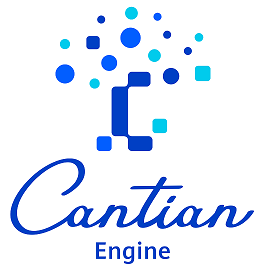
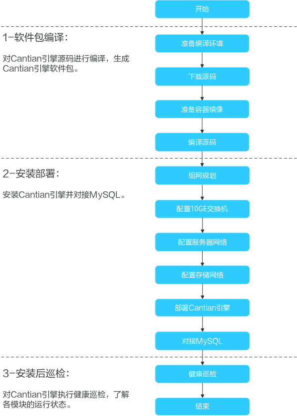

# README

Cantian引擎，是一个存储引擎，采用了存算分的离架构，通过分布式缓存技术、事务MVCC机制、多主集群高可用等关键技术，可以让使能普通的单机数据库，让其变得具有类似Oracle RAC的多读多写能力。

Cantian引擎无需修改已有数据库的实现，可以以无侵入的方式被MySQL等数据库加载运行。

类似Oracle RAC，Cantian引擎的多读多写，也需要基于共享存储来构建。任何能够提供共享存储并可以提供标准文件接口的存储系统都可以进行对接测试。

**主要价值**

部署Cantian引擎后，性能可以获得倍数级提升，且无需被动分库分表，故障倒换时间大幅缩减。

**架构简介**

Cantian引擎主要由五个主要部分组成：

-   CTC（Cantian Connector）：负责支持Cantian引擎作为分布式数据库的存储引擎插件，支持DDL、DML、事务等数据库功能，兼容分布式数据库的生态应用。
-   CMS（Cluster Manager Service）: 负责集群管理。
-   多读多写模块：Cantian引擎是基于共享存储的多写集群，各个节点在架构上对等，多读多写模块确保从任何一个节点都可以对数据库做DDL/DML/DCL等操作。任何一个节点做的修改，在满足隔离级别的要求下，其他节点都可以看到。所有计算节点共享和读写存储上同一份用户数据。
-   存储访问层：Cantian引擎通过共享存储提供的接口，例如标准文件接口，对数据进行读写操作，同时借助文件系统提供的锁机制进行互斥。
-   工具：包括备份恢复工具：将数据库下的所有表导出成SQL语句或者表格文本，逻辑恢复时再将文本格式的逻辑数据文件导入到数据库中。运维管理工具：各自命令行等。

更详细的Cantian引擎架构介绍，请参考对应版本的[《技术白皮书》](https://gitee.com/openeuler/cantian/tree/master/documents)。

**主要特性**

-   多读多写

    Cantian引擎是基于共享存储的多写集群，各个节点在架构上对等，从任何一个节点都可以对数据库做DDL/DML/DCL等操作。任何一个节点做的修改，在满足隔离级别的要求下，其他节点都可以看到。所有计算节点也都可以共享和读写存储上的同一份用户数据。

-   集群管理

    Cantian引擎支持通过CMS（Cluster manager server）进行集群管理，包括集群成员状态维护、集群异常处理、仲裁等。

-   支持与MySQL对接

    作为MySQL数据库的存储引擎插件，Cantian引擎支持DDL、DML、事务等数据库功能，兼容MySQL（InnoDB）的生态应用。

-   支持MySQL共享系统表

    MySQL8.0默认的系统表元数据存储引擎为innodb，Cantian作为一个存储引擎，也有其系统表元数据，通过修改MySQL初始化流程将系统表的存储引擎改为Cantian，可以使Cantian引擎能够存放MySQL的元数据。

-   支持滚动升级

    Cantian引擎支持集群离线方式进行升级（离线升级），也支持在线进行版本升级（滚动升级），从而保证版本升级不影响客户业务的连续性。

-   备份功能

    数据备份是容灾的基础，本特性旨在为Cantian引擎提供备份恢复功能，通过合理规划备份方式和备份频率，避免意外状况下的数据损失。

各个特性的实现原理和详细说明，请参考对应版本的[《技术白皮书》](https://gitee.com/openeuler/cantian/tree/master/documents)。

**工程说明**

-   编程语言：C
-   编译工程：cmake或make，建议使用cmake
-   目录说明：

    
    <table><thead align="left"><tr id="zh-cn_topic_0000001570546425_row12448437114615"><th class="cellrowborder" valign="top" width="29.25%" id="mcps1.1.3.1.1">
目录名称

    </th>
    <th class="cellrowborder" valign="top" width="70.75%" id="mcps1.1.3.1.2">
说明

    </th>
    </tr>
    </thead>
    <tbody><tr id="zh-cn_topic_0000001570546425_row10766533194814"><td class="cellrowborder" valign="top" width="29.25%" headers="mcps1.1.3.1.1 ">
CI

    </td>
    <td class="cellrowborder" valign="top" width="70.75%" headers="mcps1.1.3.1.2 ">
执行Cantian引擎测试用例的脚本。

    </td>
    </tr>
    <tr id="zh-cn_topic_0000001570546425_row444883724619"><td class="cellrowborder" valign="top" width="29.25%" headers="mcps1.1.3.1.1 ">
build

    </td>
    <td class="cellrowborder" valign="top" width="70.75%" headers="mcps1.1.3.1.2 ">
编译构建Cantian引擎工程的脚本。

    </td>
    </tr>
    <tr id="zh-cn_topic_0000001570546425_row1444983711469"><td class="cellrowborder" valign="top" width="29.25%" headers="mcps1.1.3.1.1 ">
common

    </td>
    <td class="cellrowborder" valign="top" width="70.75%" headers="mcps1.1.3.1.2 ">
后台定时任务运行（管控面）脚本。

    </td>
    </tr>
    <tr id="zh-cn_topic_0000001570546425_row8449143713463"><td class="cellrowborder" valign="top" width="29.25%" headers="mcps1.1.3.1.1 ">
ct_om

    </td>
    <td class="cellrowborder" valign="top" width="70.75%" headers="mcps1.1.3.1.2 ">
安装部署脚本。

    </td>
    </tr>
    <tr id="row334613520509"><td class="cellrowborder" valign="top" width="29.25%" headers="mcps1.1.3.1.1 ">
document

    </td>
    <td class="cellrowborder" valign="top" width="70.75%" headers="mcps1.1.3.1.2 ">
项目参考文档，包括《编译指南》、《安装指南》等。

    </td>
    </tr>
    <tr id="row2034725295016"><td class="cellrowborder" valign="top" width="29.25%" headers="mcps1.1.3.1.1 ">
docker

    </td>
    <td class="cellrowborder" valign="top" width="70.75%" headers="mcps1.1.3.1.2 ">
启动Cantian引擎容器镜像的相关脚本。

    </td>
    </tr>
    <tr id="row7347155285012"><td class="cellrowborder" valign="top" width="29.25%" headers="mcps1.1.3.1.1 ">
library

    </td>
    <td class="cellrowborder" valign="top" width="70.75%" headers="mcps1.1.3.1.2 ">
编译头文件库。

    </td>
    </tr>
    <tr id="row1534718520507"><td class="cellrowborder" valign="top" width="29.25%" headers="mcps1.1.3.1.1 ">
pkg

    </td>
    <td class="cellrowborder" valign="top" width="70.75%" headers="mcps1.1.3.1.2 ">
Cantian引擎源代码目录，按子目录划分模块解耦。

    </td>
    </tr>
    </tbody>
    </table>

**版本发布分支**

“cantian24.\*”为正式的版本发布分支，例如，“cantian24.6”表示2024年6月所发布版本对应的分支。您可以进入[发行版](https://gitee.com/openeuler/cantian/releases)获取对应节点的源码。

**如何使用**

要完成Cantian引擎的部署，您需要先编译源码生成Cantian引擎软件包。在完成组网规划、网络配置等操作后，安装Cantian引擎和对接MySQL。同时，在完成部署后进行健康巡检。

<table><thead align="left"><tr id="row65767273154"><th class="cellrowborder" valign="top" width="29.25%" id="mcps1.1.3.1.1">
步骤

</th>
<th class="cellrowborder" valign="top" width="70.75%" id="mcps1.1.3.1.2">
说明

</th>
</tr>
</thead>
<tbody><tr id="row105761227191514"><td class="cellrowborder" valign="top" width="29.25%" headers="mcps1.1.3.1.1 ">
1-软件包编译

</td>
<td class="cellrowborder" valign="top" width="70.75%" headers="mcps1.1.3.1.2 ">
对Cantian引擎源码进行编译，生成Cantian引擎软件包。请参考对应版本的<a href="https://gitee.com/openeuler/cantian/tree/master/documents" target="_blank" rel="noopener noreferrer">《编译指南》</a>获取详细操作步骤。

</td>
</tr>
<tr id="row357611276152"><td class="cellrowborder" valign="top" width="29.25%" headers="mcps1.1.3.1.1 ">
2-安装部署

</td>
<td class="cellrowborder" valign="top" width="70.75%" headers="mcps1.1.3.1.2 ">
安装Cantian引擎和对接MySQL，包括组网规划、网络配置、启动Cantian引擎、加载插件依赖库等。请参考对应版本的<a href="https://gitee.com/openeuler/cantian/tree/master/documents" target="_blank" rel="noopener noreferrer">《安装指南》</a>获取详细操作步骤。

</td>
</tr>
<tr id="row1757662715156"><td class="cellrowborder" valign="top" width="29.25%" headers="mcps1.1.3.1.1 ">
3-安装后巡检

</td>
<td class="cellrowborder" valign="top" width="70.75%" headers="mcps1.1.3.1.2 ">
对Cantian引擎执行健康巡检，了解对Cantian引擎各模块的运行状态。请参考对应版本<a href="https://gitee.com/openeuler/cantian/tree/master/documents" target="_blank" rel="noopener noreferrer">《管理员指南》</a>的“健康巡检”章节获取详细操作步骤。

</td>
</tr>
</tbody>
</table>

**如何提交贡献**

我们非常欢迎新贡献者加入到项目中来，也非常高兴能为新加入贡献者提供指导和帮助。

-   如果您发现了一个bug或者有一些想法想要交流，欢迎您提交[issue](https://gitee.com/openeuler/cantian/issues)。具体操作方法可参考[Issue提交指南](https://gitee.com/openeuler/community/blob/master/zh/contributors/issue-submit.md)。
-   您也可以通过提交[PR](https://gitee.com/openeuler/cantian/pulls)的方式进行贡献，在您贡献前，需先[签署CLA](https://clasign.osinfra.cn/sign/gitee_openeuler-1611298811283968340)。PR的提交的操作方法，可参考[PR提交指南](https://gitee.com/openeuler/community/blob/master/zh/contributors/pull-request.md)。
-   同时，也欢迎您在Issue和PR中提交评论。

**许可证**

Cantian引擎使用“木兰宽松许可证”（Mulan PSL V2）开源协议许可。

