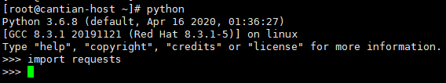
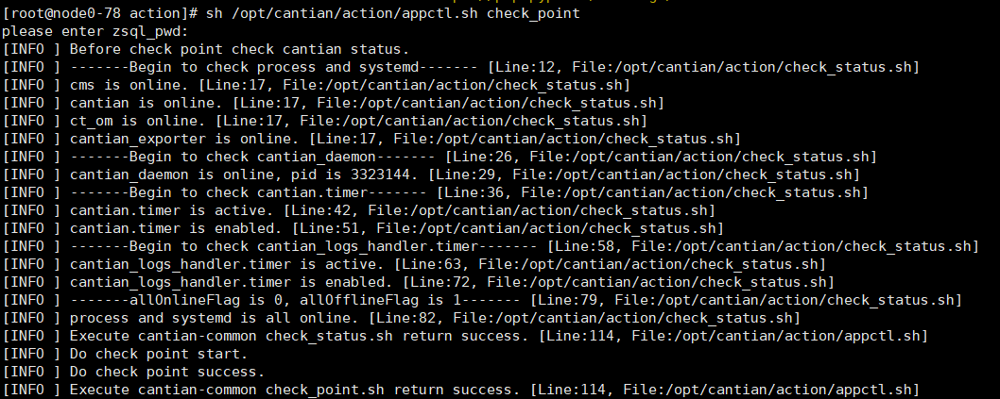

# 前  言<a name="ZH-CN_TOPIC_0000001846452089"></a>


## 概述<a name="ZH-CN_TOPIC_0000001846492013"></a>

本文档详细地描述了Cantian引擎升级流程以及具体的操作指导，同时提供了常见的问题解答。

## 读者对象<a name="ZH-CN_TOPIC_0000001799693156"></a>

**读者对象<a name="zh-cn_topic_0000001799689372_section199mcpsimp"></a>**

本文档主要适用于升级的操作人员。操作人员必须具备以下经验和技能：

-   熟悉当前网络的组网和相关网元的版本信息。
-   有该设备维护经验，熟悉设备的操作维护方式。

# 升级前必读<a name="ZH-CN_TOPIC_0000001846452093"></a>


## 升级注意事项<a name="ZH-CN_TOPIC_0000001846492017"></a>

-   升级包解压路径（如：/ctdb/cantian\_install/）下空间需大于5GB。
-   所有Cantian引擎节点均需要执行完整的升级操作，升级顺序：先升级Cantian引擎节点0，再升级其他节点。
-   升级前需确保Cantian引擎处于正常状态。可执行sh /opt/cantian/action/appctl.sh check\_status命令检查，当返回“\[INFO \] Execute cantian-common check\_status.sh return success”时，表示状态正常。
-   支持使用root用户进行升级；支持低权限用户使用sudo命令进行升级，低权限用户请使用交互式方式进行升级，否则可能存在目录权限不足的问题。
-   执行升级提交操作后，不支持回滚。

# 下载软件包<a name="ZH-CN_TOPIC_0000001846452097"></a>

请登录[Gitee](https://gitee.com/openeuler/cantian?_from=gitee_search)下载代码，编译后生成Cantian引擎软件包。

# 升级前检查<a name="ZH-CN_TOPIC_0000001799693164"></a>


## 检查Python并安装requests、paramiko库及相关依赖<a name="ZH-CN_TOPIC_0000001799852940"></a>

检查Cantian引擎所在节点的python三方库requests、paramiko是否已安装，如果未安装需要手动安装requests、paramiko库及相关依赖。

**背景信息<a name="zh-cn_topic_0000001799689364_section17133447452"></a>**

-   离线升级过程中会调用存储阵列的REST接口进行数据备份，该操作依赖python编程语言的requests库，python3.9版本之后不再自带requests，因此若当前环境python版本高于等于3.9，则需要手动安装requests库及相关依赖。


### 安装requests库<a name="ZH-CN_TOPIC_0000001846452101"></a>

检查Cantian引擎所有节点python库requests是否安装，如果已安装跳过本节，否则参考本节进行安装。

**操作步骤<a name="zh-cn_topic_0000001846448305_section325414459130"></a>**

1.  <a name="zh-cn_topic_0000001846448305_li14280345142215"></a>检查Cantian引擎所有节点python库requests是否安装，如果已安装跳过本节，否则参考以下步骤进行安装。
    1.  在Cantian引擎执行以下命令，进入可执行命令窗口。

        ```
        python
        ```

        如下图所示，成功进入可执行命令窗口。

        

    2.  执行以下命令检查当前节点是否已安装requests。

        ```
        import requests
        ```

        如下图所示，无任何报错则说明已安装，否则执行[2](#zh-cn_topic_0000001846448305_li38161025191615)。

        

2.  <a name="zh-cn_topic_0000001846448305_li38161025191615"></a>依次在所有Cantian引擎节点安装requests库。
    1.  在线安装。

        当前Cantian引擎已连接公网或者配置了pip源，可以通过pip命令进行在线安装，以华为pip源为例说明：

        ```
        pip3 install requests --trusted-host=mirrors.huaweicloud.com -i https://mirrors.huaweicloud.com/repository/pypi/simple/
        ```

    1.  离线安装。
        1.  登录python官网（https://pypi.org/）下载requests库及其依赖，参考以下版本进行下载。

            ```
            idna-2.6.tar.gz 
            certifi-2017.7.27.1.tar.gz 
            chardet-3.0.4.tar.gz 
            urllib3-1.22.tar.gz 
            requests-master.zip
            ```

        2.  执行以下命令依次解压相关依赖包。

            ```
            tar -zxvf 依赖包名
            ```

            如：

            ```
            tar -zxvf urllib3-1.22.tar.gz
            ```

        3.  依次进入依赖包后，执行以下命令安装依赖。

            ```
            python setup.py install
            ```

            > **说明：** 
            >安装顺序： urllib3-\>certifi-\>chardet-\>idna-\>request-master

3.  重复[1](#zh-cn_topic_0000001846448305_li14280345142215)，检查requests库是否安装成功。

### 安装paramiko库<a name="ZH-CN_TOPIC_0000001846492025"></a>

检查Cantian引擎所有节点python库paramiko是否安装，如果已安装跳过本节，否则参考本节进行安装。

**操作步骤<a name="zh-cn_topic_0000001799689360_section325414459130"></a>**

1.  <a name="zh-cn_topic_0000001799689360_li14280345142215"></a>检查Cantian引擎所有节点python库paramiko是否安装，已安装跳过本节，否则参考以下步骤进行安装。
    1.  在Cantian引擎执行以下命令，进入可执行命令窗口。

        ```
        python
        ```

        如下图所示，成功进入可执行命令窗口。

        

    2.  执行以下命令检查当前节点是否已安装paramiko。

        ```
        import paramiko
        ```

        如下图所示，无任何报错则说明已安装，否则执行[2](#zh-cn_topic_0000001799689360_li38161025191615)。

        

2.  <a name="zh-cn_topic_0000001799689360_li38161025191615"></a>依次在所有Cantian引擎节点安装paramiko库。
    1.  在线安装。

        当前服务器已连接互联网或者配置了pip源，可以通过pip命令进行在线安装，以华为pip源为例，参考以下命令。

        ```
        pip3 install paramiko --trusted-host=mirrors.huaweicloud.com -i https://mirrors.huaweicloud.com/repository/pypi/simple/
        ```

    1.  离线安装。
        1.  登录python官网（https://pypi.org/）下载paramiko库及其依赖，参考以下版本进行下载。
            -   X86服务器：

                ```
                bcrypt-3.1.5-cp34-abi3-manylinux1_x86_64.whl
                cffi-1.15.1-cp36-cp36m-manylinux_2_5_x86_64.manylinux1_x86_64.whl
                cryptography-3.3.2-cp36-abi3-manylinux1_x86_64.whl
                paramiko-2.12.0-py2.py3-none-any.whl
                pycparser-2.21-py2.py3-none-any.whl
                PyNaCl-1.3.0-cp34-abi3-manylinux1_x86_64.whl
                six-1.16.0-py2.py3-none-any.whl
                ```

            -   ARM服务器：

                ```
                bcrypt-3.1.7-cp35-abi3-manylinux2014_aarch64.whl
                cffi-1.15.1-cp39-cp39-manylinux_2_17_aarch64.manylinux2014_aarch64.whl
                cryptography-3.3.2-cp36-abi3-manylinux2014_aarch64.whl
                paramiko-2.12.0-py2.py3-none-any.whl
                pycparser-2.21-py2.py3-none-any.whl
                PyNaCl-1.5.0-cp36-abi3-manylinux_2_17_aarch64.manylinux2014_aarch64.manylinux_2_24_aarch64.whl
                six-1.16.0-py2.py3-none-any.whl
                ```

        2.  执行以下命令安装依赖。

            ```
            pip3 install 依赖包名
            ```

            如：

            ```
            pip3 install bcrypt-3.1.5-cp34-abi3-manylinux1_x86_64.whl
            ```

            > **说明：** 
            >安装顺序：bcrypt-\>pycparser\>six-\>cffi-\>cryptography-\>PyNaCl-\>paramiko

3.  重复[1](#zh-cn_topic_0000001799689360_li14280345142215)，检查paramiko库是否安装成功。

## 检查升级依赖的操作系统命令并安装<a name="ZH-CN_TOPIC_0000001799693168"></a>

当前升级流程中依赖操作系统tree命令，本节以ctyunos操作系统为例说明如何检查并安装tree命令，其他操作系统可能会有差异。

**操作步骤<a name="zh-cn_topic_0000001799689340_section155466012920"></a>**

1.  <a name="zh-cn_topic_0000001799689340_li15490113815215"></a>检查操作系统是否有tree命令，命令行输入tree，如果提示“command not found”表示当前系统缺少tree，需要手动安装，否则跳过该章节。

    ```
    ~]# tree
    -bash: tree: command not found
    ```

2.  执行以下命令挂载当前操作系统iso，以ctyunos-23.01-230117-aarch64-dvd.iso为例。

    ```
    mkdir -p /mnt/ctyunos
    mount -o loop ctyunos-23.01-230117-aarch64-dvd.iso /mnt/ctyunos/
    ```

3.  执行以下命令配置yum源。

    ```
    vim /etc/yum.repos.d/local.repo
    ```

    将以下内容追加至配置文件：

    ```
    [BaseOS]
    name=BaseOS
    baseurl=file:////mnt/ctyunos
    enabled=1
    gpgcheck=0
    ```

4.  执行以下命令安装tree命令。

    ```
    yum install tree
    ```

    如下图示，回显显示“Complete!“表示安装成功。

    

5.  重复[1](#zh-cn_topic_0000001799689340_li15490113815215)检查tree命令是否生效。
6.  执行以下命令取消挂载。

    ```
    umount /mnt/ctyunos/
    ```

## 检测当前版本是否可升级<a name="ZH-CN_TOPIC_0000001799852944"></a>

1.  查看计算节点/opt/cantian/路径下的versions.yml文件中的Version信息，获取源版本版本号（如下图version字段2.0.0.B086为当前版本号）。

    

2.  查看Cantian引擎解压包action目录下white\_list.txt，如下所示，查看SOURCE-VERSION列是否包含当前原版本号，图例表示2.0.0版本支持升级到当前目标版本；其中支持的升级方式从UPGRADE-MODE字段获取，offline表示离线升级模式，rollup表示滚动升级模式；CHANGE\_SYSTEM字段表示当前版本升级是否需要修改系统表，false表示不需要，ture表示需要修改。

    ```
    SOURCE-VERSION    UPGRADE-MODE    CHANGE_SYSTEM
    2.0.0.*           offline         false
    ```

# 离线升级<a name="ZH-CN_TOPIC_0000001846452105"></a>

本升级方案的总体策略是：依次对Cantian引擎的每一个计算节点进行升级操作，升级顺序先升级0节点，0节点升级成功后再升级其他节点。


## 升级流程<a name="ZH-CN_TOPIC_0000001846492029"></a>

升级流程说明如[表1](#zh-cn_topic_0000001846488229_table64551566133)所示，升级执行效率如[表2](#zh-cn_topic_0000001846488229_table238mcpsimp)所示。

-   总体升级流程有顺序要求，即先升级0节点，0节点升级成功后再升级其他节点。
-   Cantian引擎的升级不依赖具体的某个路径，升级过程中以/ctdb/cantian\_install路径为例说明升级的流程。

**表 1**  升级流程说明

|序号|任务|子任务/任务说明|
|--|--|--|
|1|执行升级|步骤1：解压升级包，执行升级前检查。|
|步骤2：停止业务。|
|步骤3：执行升级。|
|2|提交升级|升级成功后，需要执行提交才能生效。|
|3|回滚升级|升级失败，在未提交前，可进行回滚。|


**表 2**  升级流程执行效率估计

|步骤|耗时（天/小时/分钟）|备注|
|--|--|--|
|下载升级包|约2到5分钟|无|
|执行升级|约10到30分钟|无|


## 升级操作<a name="ZH-CN_TOPIC_0000001799693172"></a>

**操作步骤<a name="zh-cn_topic_0000001846448301_section17435416597"></a>**

1.  将升级包保存在/ctdb/cantian\_install/路径下，此处以X86为例说明。

    ```
    cp /tmp/Cantian_xxx_x86_64_RELEASE.tgz /ctdb/cantian_install/
    ```

2.  解压升级包：

    ```
    cd /ctdb/cantian_install
    ```

    ```
    tar -zxvf Cantian_xxx_x86_64_RELEASE.tgz
    ```

    > **说明：** 
    >如果/ctdb/cantian\_install有cantian\_connector文件夹，请删除后再解压。

3.  执行升级前检查。
    1.  执行以下命令执行升级前检查。

        ```
        sh /ctdb/cantian_install/cantian_connector/action/appctl.sh pre_upgrade offline /ctdb/cantian_install/cantian_connector/action/config_params.json
        ```

        执行结果如下图出现“\[INFO \] Execute cantian-common pre\_upgrade.sh return success”字样则表示当前预检查操作执行成功。

        

        > **说明：** 
        >升级前检查失败后，无法进行后续升级操作；需根据升级前检查失败项进行排查处理（[升级故障处理](升级故障处理.md)），确保升级前检查成功后再执行后续升级操作。

4.  升级前请停止所有业务：
    1.  停止当前节点业务应用。
    2.  停止MySQL集群：将启动mysql的yaml配置文件中的members字段值修改为0，重新生效该配置文件。
    3.  登录Cantian引擎0节点执行check\_point操作。

        ```
        sh /opt/cantian/action/appctl.sh check_point
        ```

        

        执行成功后删除标记文件：

        ```
        rm -rf  /opt/cantian/check_point.success
        ```

        > **说明：** 
        >执行当前步骤，需要交互式输入sys用户的密码。

    4.  执行下面的命令停止本节点Cantian引擎进程。

        ```
        sh /opt/cantian/action/appctl.sh stop
        ```

5.  执行升级。

    -   需用户手动输入阵列侧用户名和阵列侧密码参数。

        ```
        sh /ctdb/cantian_install/cantian_connector/action/appctl.sh upgrade offline 阵列侧IP
        ```

        执行结果如下图出现“\[INFO \] Execute cantian-common upgrade.sh return success”字样则表示当前离线升级成功。

        

    > **说明：** 
    >升级后检查操作包含在当前“执行升级”的步骤中。在完成业务代码的替换，并成功启动Cantian引擎各模块进程后，会执行升级后检查操作。上图中出现的带有“post upgrade check”字样的打印结果即是具体某一项升级后检查操作的执行结果。“模块名 post upgrade check success”表示该模块的升级后检查执行成功，比如“cms upgrade check success”就表示cms模块的升级后检查成功。若Cantian引擎各模块的升级后检查均通过，则会出现“local node post upgrade check finished”的打印结果；若存在模块升级后检查失败，请参阅[升级故障处理](升级故障处理.md)进行处理。

## 提交操作<a name="ZH-CN_TOPIC_0000001799852952"></a>

1.  <a name="zh-cn_topic_0000001799689344_li14422038318"></a>（可选）Cantian引擎节点与存储阵列管理IP不通时，需要删除文件系统storage\_dbstore\_fs、storage\_dbstore\_page\_fs、storage\_metadata\_fs、storage\_archive\_fs、storage\_share\_fs的快照。

    具体操作参考[《OceanStor Droado 6.1.x 产品文档》](https://support.huawei.com/hedex/hdx.do?docid=EDOC1100214754&id=ZH-CN_TOPIC_0000001764442510&lang=zh)中的“配置 \> HyperSnap特性指南（文件业务）\> 配置和管理文件系统快照（系统用户）\> 管理文件系统快照 \> 删除快照“章节，此处以OceanStor Dorado 5600为例说明，其他型号请参考对应型号的产品文档。

2.  升级成功后，在Cantian引擎0节点执行以下命令进行提交：

    ```
    sh /ctdb/cantian_install/cantian_connector/action/appctl.sh upgrade_commit offline
    ```

    -   Cantian引擎节点与存储阵列管理IP不通时，完成[1](#zh-cn_topic_0000001799689344_li14422038318)后，根据提示输入yes，继续提交。

        ```
        [INFO ] begin to call cms tool to raise the version num
        cms upgrade succeed, main_ver=24, major_ver=0, revision=0, inner=3.
        [INFO ] calling cms tool to raise the version num success
        [ERROR] try to ping storage array ip 'xx.xx.xx.xx’，but failed
        Please check whether input is correct. If the network is disconnected, manually delete snapshot according to the upgrade guide.
        Continue upgrade please input yes, otherwise exit:
        ```

    -   Cantian引擎节点与存储阵列管理IP连通时，需用户手动输入阵列侧用户名和阵列侧密码参数。

        > **说明：** 
        >根据交互界面回显信息依次输入阵阵列侧IP、列侧用户名、阵列侧密码。
        >当前升级过程中所使用的参数描述如下：
        >-   阵列侧IP：登录OceanStor Dorado DeviceManager的IP地址。
        >-   阵列侧用户名： 登录OceanStor Dorado DeviceManager，且具有管理员角色的用户。
        >-   阵列侧密码：登录OceanStor Dorado DeviceManager用户名的密码。

        执行结果如下，表示提交成功：

        ```
        [INFO ] begin to call cms tool to raise the version num
        cms upgrade succeed, main_ver=3, major_ver=0, revision=0, inner=2.
        [INFO ] calling cms tool to raise the version num success
        [INFO ] flag file '/mnt/dbdata/remote/metadata_metadata_fs/upgrade/cantian_offline_upgrade_commit_2.0.0.B516.success' has been detected
        [INFO ] perform the upgrade commit operation success
        [INFO ] begin to clear residual data
        [INFO ] clear residual data success
        [INFO ] Execute cantian-common upgrade_commit.sh return success. [Line:114, File:/ctdb/cantian_install/cantian_connector/action/appctl.sh
        ```

3.  执行以下命令查看cms版本号，回显如下表示cms版本抬升成功。

    ```
    # su -s /bin/bash - cantian
    [cantian@node0 ~]$ cms version
    gcc version:24.0.0.
    ```

4.  登录ctsql执行以下命令查看cantian版本号，回显如下表示cantian版本号抬升成功。

    ```
    SQL> SELECT * FROM SYS.DV_CTRL_VERSION;
    
    VERSION                                                         
    ----------------------------------------------------------------
    24.0.0.3                                                         
    
    1 rows fetched.
    ```

## 回滚操作<a name="ZH-CN_TOPIC_0000001846452109"></a>


### 回滚前须知<a name="ZH-CN_TOPIC_0000001846492033"></a>

-   升级后的环境没有进行过卸载重新安装的操作。
-   回滚需在升级的备份环节成功的条件下进行。
-   从未进行过升级的环境不支持回滚操作。
-   回滚操作有先后顺序，回滚时先回滚0节点，待0节点回滚成功后再依序号回滚其他节点。
-   支持root用户进行回滚；支持低权限用户使用sudo命令进行回滚，低权限用户请使用交互式方式（[回滚操作](回滚操作-0.md)）来进行回滚，否则可能存在目录权限不足的问题。

### 回滚操作<a name="ZH-CN_TOPIC_0000001799693176"></a>

**操作步骤<a name="zh-cn_topic_0000001799849124_section4687185563918"></a>**

1.  回滚前停止所有业务：
    1.  停止业务应用。
    2.  停止MySQL集群：将启动mysql的yaml配置文件中的members字段值修改为0，重新生效该配置文件。
    3.  执行以下命令停止本节点Cantian引擎进程：

        ```
        sh /opt/cantian/action/appctl.sh stop
        ```

2.  执行以下命令进行回滚。

    ```
    sh /ctdb/cantian_install/cantian_connector/action/appctl.sh rollback offline 阵列侧IP
    ```

    

# 滚动升级<a name="ZH-CN_TOPIC_0000001799852956"></a>

本升级方案的总体策略是：依次对Cantian引擎的每一个计算节点进行滚动升级操作，升级顺序无要求，同一时间只能对一个计算节点进行升级。


## 升级流程<a name="ZH-CN_TOPIC_0000001846452113"></a>

升级流程说明如[表1](#zh-cn_topic_0000001799689352_table64551566133)所示，升级执行效率如[表2](#zh-cn_topic_0000001799689352_table238mcpsimp)所示。

-   总体升级流程无顺序要求，同一时间只能对一个节点进行滚动升级。
-   Cantian引擎的升级不依赖具体的某个路径，升级过程中以/ctdb/cantian\_install路径为例说明升级的流程。

**表 1**  升级流程说明

|序号|任务|子任务/任务说明|
|--|--|--|
|1|执行升级|步骤1：解压升级包，执行升级前检查。|
|步骤2：执行升级。|
|2|提交升级|升级成功后，需要执行提交才能生效。|
|3|回滚升级|升级失败，在未提交前，可进行回滚。|


**表 2**  升级流程执行效率估计

|步骤|耗时（天/小时/分钟）|备注|
|--|--|--|
|下载升级包|约2到5分钟|无|
|执行升级|约10到30分钟|无|


## 升级操作<a name="ZH-CN_TOPIC_0000001846492037"></a>

**操作步骤<a name="zh-cn_topic_0000001799849104_section34471737111910"></a>**

1.  把升级包保存在/ctdb/cantian\_install/路径下，此处以X86为例说明。

    ```
    cp /tmp/Cantian_xxx_x86_64_RELEASE.tgz /ctdb/cantian_install/
    ```

2.  解压升级包：

    ```
    cd /ctdb/cantian_install
    ```

    ```
    tar -zxvf Cantian_xxx_x86_64_RELEASE.tgz
    ```

    > **说明：** 
    >如果/ctdb/cantian\_install有cantian\_connector文件夹，请删除后再解压。

3.  执行滚动升级前检查。

    ```
    cd /ctdb/cantian_install/cantian_connector/action
    sh appctl.sh pre_upgrade rollup
    ```

    执行结果如下表示滚动升级前检查成功。

    ```
    [INFO ] logicrep pre_upgrade success
    [INFO ] begin to generate an upgrade plan
    [INFO ] recommended upgrade mode is offline,rollup
    [INFO ] Execute cantian-common pre_upgrade.sh return success. [Line:114, File:/ctdb/cantian_install/cantian_connector/action/appctl.sh]
    ```

4.  执行滚动升级。

    ```
    sh appctl.sh upgrade rollup
    ```

    根据提示选择是否在升级流程中进行备份：

    ```
    Please choose whether you need to use ctbackup for backup.
    If you haven't performed a backup before the upgrade, it is recommended to select step 1 to stop the upgrade process for backup.
    If the backup is already completed, please choose step 2 to continue the upgrade.
    If you haven't performed a backup before the upgrade, select step 3 during the upgrade process.
    Note: If you choose step 3, the current upgrade process duration will be extended to accommodate the backup time, so please ensure that the upgrade time window allows for it.
    1. stop upgrade and do ctbackup.
    2. No backup required and continue upgrade.
    3. do backup in upgrading.
    What's your choice, please input [1|2|3]:
    ```

    -   选择\[1\]stop upgrade and do ctbackup：表示停止本次升级，进行备份，然后再升级。
    -   选择\[2\]No backup required and continue upgrade：表示升级前已经完成了备份，直接进行升级。

        根据回显的提示，输入cantian sys pwd：sys用户的密码。

    -   选择\[3\]do backup in upgrading：表示在升级流程内进行备份。

        根据回显的提示，依次输入：

        -   mysql login ip：如果MySQL使用物理机部署，IP为：127.0.0.1；如果MySQL为容器部署，请登录k8s查询当前节点对应的MySQL IP。
        -   mysql login port： MySQL监听端口，默认为3306。
        -   mysql login user：登录MySQL的用户名。
        -   mysql login pwd： 登录MySQL的密码。
        -   mysql metadata storage path： MySQL元数据路径，具体查询方法请参考[查询MySQL元数据路径](查询MySQL元数据路径.md)。
        -   ctbackup storage path：ctbackup备份数据存储路径，当前路径要求长度不超过100字符。
        -   cantian sys pwd：sys用户的密码。

    执行结果如下显示表示升级成功：

    ```
    [INFO ] ct_om post upgrade check success
    [INFO ] begin post upgrade check for cantian_exporter
    [INFO ] cantian_exporter post upgrade check success
    [INFO ] begin post upgrade check for cms
    [INFO ] cms post upgrade check success
    [INFO ] begin post upgrade check for cantian
    [INFO ] cantian post upgrade check success
    [INFO ] begin post upgrade check for mysql
    [INFO ] mysql post upgrade check success
    [INFO ] local node post upgrade check finished
    [INFO ] >>>>> do rollup upgrade for node0 success <<<<<
    [INFO ] change upgrade status of node_0 from 'rollup' to 'rollup_success' success.
    [INFO ] detected that the system tables have been modified or does not need to be modified
    [INFO ] >>>>> begin to check cluster upgrade status <<<<<
    [INFO ] currently only 1 nodes have performed the rollup upgrade operation, totals:2.
    [INFO ] Execute cantian-common upgrade.sh return success. [Line:114, File:/ctdb/cantian_install/cantian_connector/action/appctl.sh]
    ```

## 提交操作<a name="ZH-CN_TOPIC_0000001799693180"></a>

**注意事项<a name="zh-cn_topic_0000001799689348_section1790617433211"></a>**

-   所有节点升级完成，并且最后一个节点升级完成后，集群状态为prepared，如下显示：

    ```
    [INFO ] >>>>> begin to check cluster upgrade status <<<<<
    [INFO ] >>>>> all 2 nodes were upgraded successfully, pass check cluster upgrade status <<<<<
    [INFO ] >>>>> begin to check the startup and cluster status of all nodes after upgrading <<<<<
    [INFO ] all nodes started successfully
    [INFO ] >>>>> all nodes join the cluster successfully <<<<<
    [INFO ] change upgrade status of cluster from 'rollup' to 'prepared' success.
    [INFO ] >>>>> rollup upgrade performed successfully <<<<<
    [INFO ] Execute cantian-common upgrade.sh return success. [Line:114, File:/ctdb/cantian_install/cantian_connector/action/appctl.sh]
    ```

-   提交前请确认集群状态是否正常。
-   集群中任一节点执行即可，可重复执行。
-   升级提交后不支持回退，请谨慎操作。

**操作步骤<a name="zh-cn_topic_0000001799689348_section486229103212"></a>**

1.  输入以下命令执行提交。

    ```
    sh appctl.sh upgrade_commit rollup
    ```

    执行结果如下，表示提交成功。

    ```
    [INFO ] begin to check cluster status
    [INFO ] check cluster status success, current cluster status: prepared
    [INFO ] change upgrade status of current cluster from 'prepared' to 'commit' success.
    [INFO ] begin to call cms tool to raise the version num
    cms upgrade succeed, main_ver=3, major_ver=0, revision=0, inner=2.
    [INFO ] calling cms tool to raise the version num success
    [INFO ] change upgrade status of current cluster from 'commit' to 'normal' success.
    [INFO ] flag file '/mnt/dbdata/remote/metadata_ctom1_metadata/upgrade/cantian_rollup_upgrade_commit_3.0.0.B038.success' has been detected
    [INFO ] perform the upgrade commit operation success
    [INFO ] begin to clear residual data
    [INFO ] clear residual data success
    [INFO ] Execute cantian-common upgrade_commit.sh return success. [Line:114, File:/ctdb/cantian_install/cantian_connector/action/appctl.sh]
    [root@ctom119 action]# sh appctl.sh upgrade_commit rollup
    [INFO ] begin to perform the upgrade commit operation, current upgrade mode: rollup
    [INFO ] pass upgrade mode check, current upgrade mode: rollup
    [INFO ] begin to init cluster status flag
    [INFO ] init cluster status flag success
    [INFO ] flag file '/mnt/dbdata/remote/metadata_ctom1_metadata/upgrade/cantian_rollup_upgrade_commit_3.0.0.B038.success' has been detected
    [INFO ] perform the upgrade commit operation has been successful
    [INFO ] Execute cantian-common upgrade_commit.sh return success. [Line:114, File:/ctdb/cantian_install/cantian_connector/action/appctl.sh]
    ```

## 回滚操作<a name="ZH-CN_TOPIC_0000001799852960"></a>


### 回滚前须知<a name="ZH-CN_TOPIC_0000001846452117"></a>

-   升级后的环境没有进行过卸载重新安装的操作。
-   回滚需在升级的备份环节成功的条件下进行。
-   从未进行过升级的环境不支持回滚操作。
-   滚动升级成功后进行了提交操作的场景不支持回退。
-   滚动回退对计算节点回退顺序无要求，同一时间只能对一个计算节点进行回退。

### 回滚流程<a name="ZH-CN_TOPIC_0000001846492041"></a>

**操作步骤<a name="zh-cn_topic_0000001846448313_section109816216334"></a>**

1.  使用root账号依次登录所有Cantian引擎节点。
2.  执行滚动回退。

    ```
    sh appctl.sh rollback rollup
    ```

    执行结果如下，表示当前节点回退成功

    ```
    [INFO ] start cantian after rollback success
    [INFO ] begin to post rollback check on local node
    [INFO ] begin to check cms stat on local node
    [INFO ] local node pass cms stat check
    [INFO ] begin post rollback check for ct_om
    [INFO ] Begin to start ct_om post upgrade check. [Line:15, File:/opt/cantian/action/ct_om/post_upgrade.sh]
    [INFO ] Post upgrade check completes, everything goes right. [Line:34, File:/opt/cantian/action/ct_om/post_upgrade.sh]
    [INFO ] Execute ct_om post_upgrade.sh success [Line:129, File:/opt/cantian/action/ct_om/appctl.sh]
    [INFO ] ct_om post rollback check success
    [INFO ] begin post rollback check for cantian_exporter
    [INFO ] cantian_exporter post rollback check success
    [INFO ] begin post rollback check for cms
    [INFO ] cms post rollback check success
    [INFO ] begin post rollback check for cantian
    [INFO ] cantian post rollback check success
    [INFO ] begin post rollback check for mysql
    [INFO ] mysql post rollback check success
    [INFO ] local node post rollback check finished
    [INFO ] change rollback status of node1 from 'rolldown' to 'rolldown_success' success.
    [INFO ] >>>>> begin to check cluster rolldown status <<<<<
    [INFO ] existing nodes have not been rollback successfully, details: rollup_success rolldown_success
    [INFO ] Execute cantian-common rollback.sh return success. [Line:114, File:/ctdb/cantian_install/cantian_connector/action/appctl.sh]
    ```

# 升级故障处理<a name="ZH-CN_TOPIC_0000001799693184"></a>


## 离线升级前检查故障<a name="ZH-CN_TOPIC_0000001799852964"></a>

**现象描述<a name="zh-cn_topic_0000001846448309_section6611101032815"></a>**

正式升级前，执行下方升级前检查命令时发生故障（升级包不依赖任何路径，下面的步骤以/ctdb/cantian\_install/路径为例）。

```
sh /ctdb/cantian_install/cantian_connector/action/appctl.sh pre_upgrade offline
...
[ERROR] Execute cantian-common pre_upgrade.sh return failed. [Line:92, File:/ctdb/cantian_install/cantian_connector/action/appctl.sh]
```

**可能原因<a name="zh-cn_topic_0000001846448309_section16994515102817"></a>**

-   升级包中配置文件参数与原环境配置文件参数名不一致。
-   集群状态检查失败。
-   升级包解压目录空间小于5GB。
-   当前升级包版本不在可升级白名单中。

**处理步骤<a name="zh-cn_topic_0000001846448309_section1967158203916"></a>**

1.  请检查升级包中配置文件参数名与原环境配置文件是否一致。若不一致，请修改升级包中的配置文件参数名；若一致，请执行下一步。
2.  请确保当前节点处于可安装状态，即执行sh /opt/cantian/action/appctl.sh check\_status 返回成功。若未返回成功，请执行sh /opt/cantian/action/appctl.sh start启动Cantian引擎；若返回成功，请执行下一步。
3.  请确保升级包解压目录下的空间大于5GB，若已满足，请执行下一步。
4.  请确保当前升级包版本在可升级白名单版本中，具体操作参考[检测当前版本是否可升级](检测当前版本是否可升级.md#ZH-CN_TOPIC_0000001799852944)。若满足要求，请执行下一步。
5.  请收集相关事件信息，联系对应模块技术支持工程师处理。

## 离线升级启动入湖工具失败<a name="ZH-CN_TOPIC_0000001799693188"></a>

**现象描述<a name="zh-cn_topic_0000001799849108_section6611101032815"></a>**

离线升级启动数据入湖工具失败

**可能原因<a name="zh-cn_topic_0000001799849108_section16994515102817"></a>**

数据入湖默认LREP用户被占用，创建用户失败。

```
[INFO ] Begin to start. [Line:73, File:/opt/cantian/action/start.sh]
[INFO ] start cms . [Line:76, File:/opt/cantian/action/start.sh]
[INFO ] start cms success. [Line:83, File:/opt/cantian/action/start.sh]
[INFO ] start cantian . [Line:76, File:/opt/cantian/action/start.sh]
[INFO ] start cantian success. [Line:83, File:/opt/cantian/action/start.sh]
[INFO ] start ct_om . [Line:76, File:/opt/cantian/action/start.sh]
[INFO ] start ct_om success. [Line:83, File:/opt/cantian/action/start.sh]
[INFO ] start cantian_exporter . [Line:76, File:/opt/cantian/action/start.sh]
[INFO ] start cantian_exporter success. [Line:83, File:/opt/cantian/action/start.sh]
[INFO ] start logicrep . [Line:76, File:/opt/cantian/action/start.sh]
[ERROR] start logicrep failed. [Line:79, File:/opt/cantian/action/start.sh]
[ERROR] For details, see the /opt/cantian/logicrep/log. [Line:80, File:/opt/cantian/action/start.sh]
[ERROR] Execute cantian-common start.sh return failed. [Line:110, File:/opt/cantian/action/appctl.sh]
```

**处理步骤<a name="zh-cn_topic_0000001799849108_section860744382718"></a>**

1.  场景确认，查看日志/opt/cantian/logicrep/log/logicrep\_deploy.log，如果有如下报错确认为当前场景，执行[步骤2](#zh-cn_topic_0000001799849108_li1290971153114)。

    ```
    2023-10-10 07:30:56 INFO [pid:16272] [MainThread] [tid:139687511705408] [logicrep_ctl.py:279 start] begin create logicrep user
    2023-10-10 07:30:56 INFO [pid:16272] [MainThread] [tid:139687511705408] [logicrep_ctl.py:167 set_cantian_conf] begin get cantian config
    2023-10-10 07:30:56 ERROR [pid:16272] [MainThread] [tid:139687511705408] [logicrep_ctl.py:338 <module>] LREP already exist,please choose another name
    ```

2.  <a name="zh-cn_topic_0000001799849108_li1290971153114"></a>修改配置文件/opt/software/tools/logicrep/conf/datasource.properties 中ds.username字段为其他未被占用的用户，如下图。

    

3.  重新执行升级，入湖工具启动成功，规避生效。

    ```
    INFO ] start logicrep . [Line:76, File:/opt/cantian/action/start.sh]
    [INFO ] start logicrep success. [Line:83, File:/opt/cantian/action/start.sh]
    RES_SUCCESS
    [INFO ] start success. [Line:162, File:/opt/cantian/common/script/cantian_service.sh]
    [INFO ] start cantian_service success. [Line:95, File:/opt/cantian/action/start.sh]
    [INFO ] start cantian.timer success. [Line:40, File:/opt/cantian/action/start.sh]
    [INFO ] enable cantian.timer success. [Line:50, File:/opt/cantian/action/start.sh]
    [INFO ] start cantian_logs_handler.timer success. [Line:40, File:/opt/cantian/action/start.sh]
    [INFO ] enable cantian_logs_handler.timer success. [Line:50, File:/opt/cantian/action/start.sh]
    [INFO ] Execute cantian-common start.sh return success. [Line:114, File:/opt/cantian/action/appctl.sh]
    ```

# 常用操作<a name="ZH-CN_TOPIC_0000001799852968"></a>


## 查询MySQL元数据路径<a name="ZH-CN_TOPIC_0000001846452125"></a>

本节介绍如何查询MySQL元数据路径。

**操作步骤<a name="zh-cn_topic_0000001799689356_section138095843017"></a>**

-   如果是采用物理机部署MySQL的场景，在执行备份命令的Cantian引擎节点执行以下操作查询MySQL元数据路径：

    登录MySQL后，执行以下命令查询。

    ```
    show variables like "datadir";
    ```

    回显类似如下，其中“/mnt/dbdata/remote/metadata\_metadata\_fs2/node0/”即为要查找的元数据路径。

    ```
    mysql> show variables like "datadir";
    +---------------+-------------------------------------------------+
    | Variable_name | Value                                           |
    +---------------+-------------------------------------------------+
    | datadir       | /mnt/dbdata/remote/metadata_metadata_fs2/node0/ |
    +---------------+-------------------------------------------------+
    1 row in set (0.00 sec)
    ```

-   如果是采用容器部署MySQL的场景，执行以下操作查询MySQL元数据路径：
    1.  <a name="zh-cn_topic_0000001799689356_li16804949112317"></a>使用root账号登录任一Cantian引擎节点，执行以下命令查询Pod名称。

        ```
        kubectl get pods -n cantian -owide
        ```

        回显类似如下：

        ```
        kubectl get pods -n cantian -owide
        NAME                              READY   STATUS    RESTARTS      AGE     IP               NODE           NOMINATED NODE   READINESS GATES
        rto1221125555-0                   2/2     Running   0             9m45s   192.168.135.153   10.10.163.101   <none>           <none>
        rto1221125555-1                   2/2     Running   1 (15m ago)   8m16s   192.168.222.180   10.10.163.103   <none>           <none>
        rto1221125555-2                   2/2     Running   1 (15m ago)   8m16s   192.168.135.163   10.10.163.101   <none>           <none>
        rto1221125555-3                   2/2     Running   1 (15m ago)   8m16s   192.168.222.175   10.10.163.103   <none>           <none>
        rto1221125555-4                   2/2     Running   1 (15m ago)   8m16s   192.168.135.184   10.10.163.101   <none>           <none>
        rto1221125555-5                   2/2     Running   1 (15m ago)   8m16s   192.168.222.138   10.10.163.103   <none>           <none>
        ```

    2.  执行以下命令获取PVC路径。

        ```
        kubectl get pvc -A | grep Pod名称
        ```

        其中，_Pod名称_为[1](#zh-cn_topic_0000001799689356_li16804949112317)中查询到的Pod Name的值，选择任意一个Pod的Name即可。

        回显类似如下：

        ```
        kubectl get pvc -A | grep rto1221125555-0
        cantian     data-rto1221125555-0   Bound    pvc-ba009f8f-98b7-4557-a44e-b985f9cbd332   20Gi       RWO            teledb-nfs-storage   95m
        ```

    3.  登录Cantian引擎节点，进入MySQL元数据的文件系统路径。

        ```
        cd /mnt/dbdata/remote/metadata_存放MySQL元数据的文件系统名称/
        ```

        如：

        ```
        cd /mnt/dbdata/remote/metadata_fs_101_103/
        ```

        其中，_存放MySQL元数据的文件系统名称_为存储规划中规划的用于存放MySQL元数据的文件系统。

    4.  执行以下命令查询MySQL的元数据路径。

        ```
        ls | grep PVC路径
        ```

        如：

        ```
        ls | grep pvc-ba009f8f-98b7-4557-a44e-b985f9cbd332
        ```

        回显类似如下：

        ```
        [root@node0 metadata_metadata_fs_101_103]# ls | grep pvc-ba009f8f-98b7-4557-a44e-b985f9cbd332
        cantian-data-rto1221125555-0-pvc-ba009f8f-98b7-4557-a44e-b985f9cbd332
        ```

        查询后，在该示例中得到MySQL的元数据路径即为“**/mnt/dbdata/remote/metadata\_metadata\_**_fs\_101\_103/cantian-data-rto1221125555-0-pvc-ba009f8f-98b7-4557-a44e-b985f9cbd332_**/mysql**”，该路径中的斜体请使用实际环境中查询到的路径替换。

