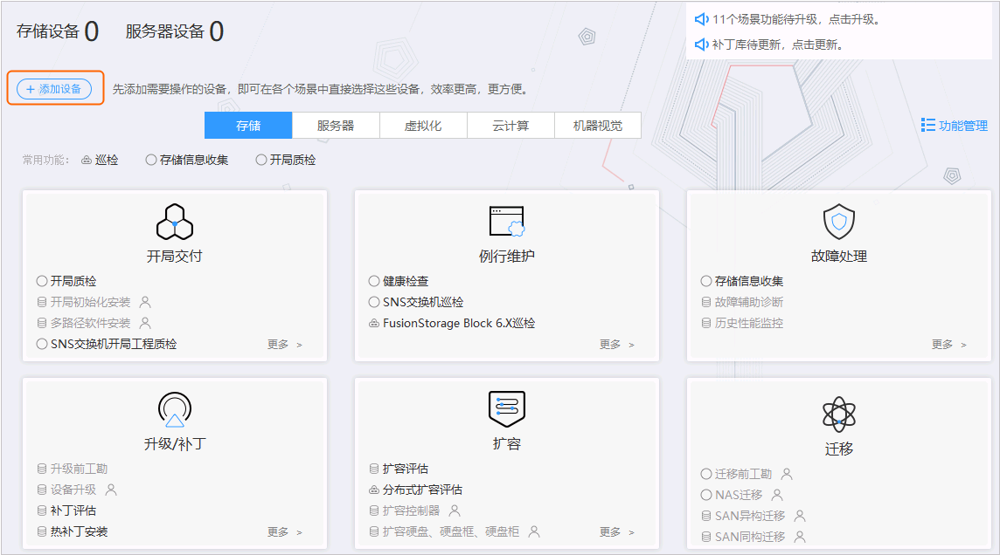
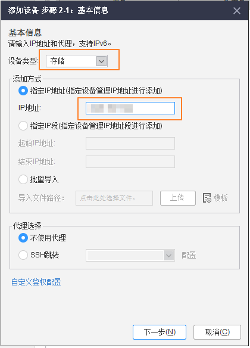
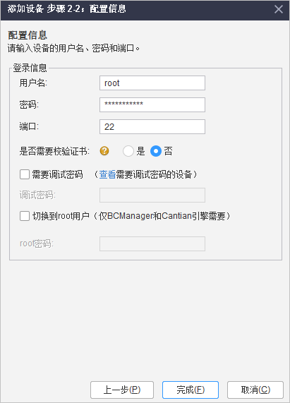
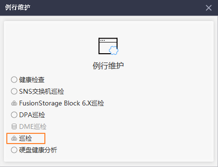
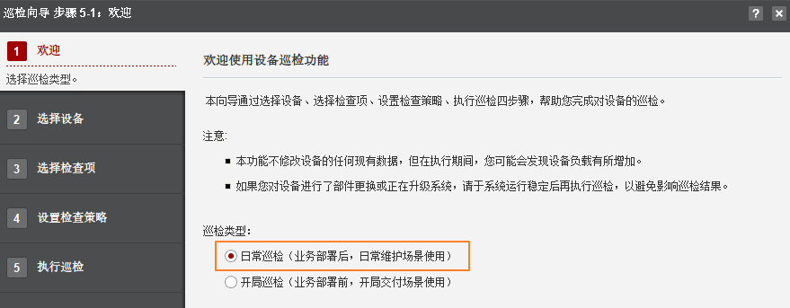
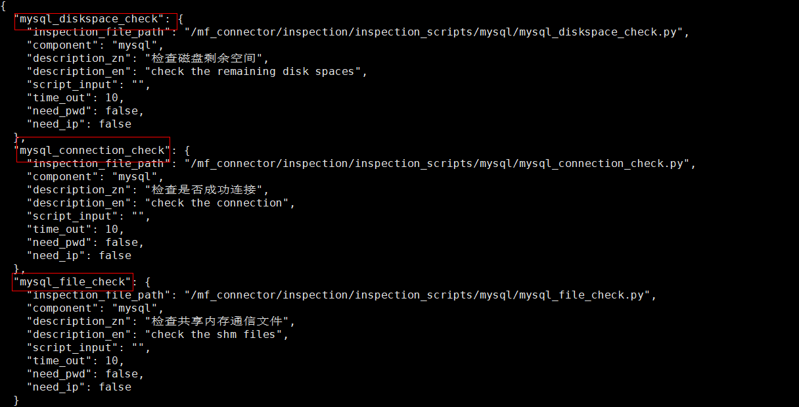
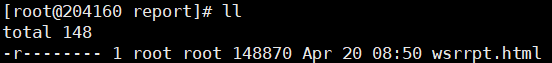

# 健康巡检<a name="ZH-CN_TOPIC_0000001835234385"></a>


## 通过SmartKit健康巡检<a name="ZH-CN_TOPIC_0000001788634796"></a>

通过SmartKit工具对Cantian引擎执行健康巡检，以便了解Cantian引擎各模块的运行状态。

**前提条件<a name="zh-cn_topic_0000001835225657_section1143990205013"></a>**

已获取SmartKit工具箱SmartKit\__xxx_\_zh.zip，获取版本为SmartKit 23.0.0.6及后续版本，获取地址：[点此前往](https://support.huawei.com/enterprise/zh/distributed-storage/smartkit-pid-8576706/software)。

**注意事项<a name="zh-cn_topic_0000001835225657_section1354152085411"></a>**

容器部署MySQL的场景，支持对Cantian引擎以及MySQL进行巡检。物理机部署MySQL的场景，仅支持对Cantian引擎进行巡检。

**操作步骤<a name="zh-cn_topic_0000001835225657_section58074912413"></a>**

1.  安装并登录SmartKit工具箱。

    > **说明：** 
    >SmartKit界面上的操作方法在不同版本可能不同，请以实际获取的版本为准。

2.  运行SmartKit工具箱。
3.  添加设备。

    > **说明：** 
    >单次仅支持添加一个节点，如果需要对多个节点进行巡检，请依次添加。

    1.  单击“添加设备“。

        

    2.  单击“添加“，配置以下参数，单击“下一步“。
        -   设备类型：选择“存储”。
        -   IP地址：配置为Cantian引擎节点IP地址。

            

    3.  配置登录信息，单击“完成“。
        -   用户名：Cantian引擎节点的登录用户。
        -   密码：登录用户对应的密码。
        -   端口：默认为22。

            > **说明：** 
            >如果配置的用户为非root用户，请勾选“切换到root用户”。

            

4.  巡检设备。
    1.  在SmartKit首页，选择“例行维护 \> 更多 \> 巡检“。

        

    2.  单击“巡检“。
    3.  勾选“日常巡检”，单击“下一步”。

        

    4.  勾选要巡检的设备，单击“下一步“。

        

    5.  选择巡检项，系统默认选择全部巡检项，单击“下一步”。
    6.  选择巡检结果保存路径，单击“下一步”，开始巡检。

        巡检完成后，可查看结果报告。

## 通过命令健康巡检<a name="ZH-CN_TOPIC_0000001835274301"></a>

通过脚本对Cantian引擎执行健康巡检，以便了解Cantian引擎各模块的运行状态。

**前提条件<a name="zh-cn_topic_0000001788626252_section1819813364111"></a>**

Cantian引擎已正确安装且正常运行。

**背景信息<a name="zh-cn_topic_0000001788626252_section89072273713"></a>**

-   针对单个节点进行一键巡检或指定巡检项巡检。
-   物理机Cantian引擎巡检和MySQL容器巡检有差异，指令不同。
-   物理机Cantian引擎巡检使用cantian用户执行，MySQL容器内巡检使用root用户执行。
-   一键巡检成功后会生成巡检文件记录巡检结果，默认仅保留最近9个巡检结果文件。
-   容器部署MySQL的场景，支持对Cantian引擎以及MySQL进行巡检。物理机部署MySQL的场景，仅支持对Cantian引擎进行巡检。

**巡检Cantian引擎<a name="zh-cn_topic_0000001788626252_section2502154624517"></a>**

1.  以SSH方式（如PuTTY），依次登录所有Cantian引擎节点。
2.  执行以下命令切换至**cantian**账号。

    ```
    su -s /bin/bash cantian
    ```

3.  依次在所有Cantian引擎节点执行以下命令进行巡检：
    -   全量巡检：

        ```
        python3 /opt/cantian/action/inspection/inspection_task.py all
        ```

    -   部分巡检：

        ```
        python3 /opt/cantian/action/inspection/inspection_task.py [xxx,xxx,…]
        ```

        > **说明：** 
        >-   _xxx_表示具体的巡检项，如“cantian\_status”。
        >    巡检项可通过“/opt/cantian/action/inspection/inspection\_config.json“文件查看，如[图1](#zh-cn_topic_0000001788626252_fig18762755183118)所示。巡检项可通过“/opt/cantian/action/inspection/inspection\_config.json“文件查看，如[图1](#zh-cn_topic_0000001788626252_fig18762755183118)所示。
        >-   各巡检项之间以英文逗号隔开，且无空格。

        **图 1**  查看巡检项<a name="zh-cn_topic_0000001788626252_fig18762755183118"></a>  
        

4.  根据回显提示，输入ctsql用户名、密码。

    

    > **说明：** 
    >-   执行全量巡检时，需要输入ctsql的用户名及密码。
    >-   执行部分巡检时，如果回显提示输入ctsql的用户名及密码才需要输入。

5.  执行结果，回显类似如下。

    

6.  查看巡检结果。

    巡检完成后，巡检结果将保存在目录“/opt/cantian/action/inspections\_log”下，以“inspection\_时间戳”命名，并且只保存最近9次的巡检结果文件。

    

**巡检MySQL（仅容器部署MySQL场景支持）<a name="zh-cn_topic_0000001788626252_section1762914064619"></a>**

1.  依次进入所有部署MySQL的容器，执行以下巡检命令。
    -   全量巡检：

        ```
        python3 /mf_connector/inspection/inspection_task.py all
        ```

    -   部分巡检：

        ```
        python3 /mf_connector/inspection/inspection_task.py [xxx,xxx,…]
        ```

        > **说明：** 
        >-   _xxx_表示具体的巡检项，如“mysql\_connection\_check”。
        >    巡检项可通过/mf\_connector/inspection/mysql\_inspection\_config.json文件查看，如[图2](#zh-cn_topic_0000001788626252_fig20421237133419)所示。
        >-   各巡检项之间以逗号隔开，且无空格。

        **图 2**  查看巡检项<a name="zh-cn_topic_0000001788626252_fig20421237133419"></a>  
        

2.  查看巡检结果。

    巡检完成后，巡检结果将保存在目录“/mf\_connector/inspection/inspections\_log”下，以“inspection\__时间戳_”命名。并且只保存最近9次的巡检结果文件。

    巡检结果查询如下：

    

# 安全管理<a name="ZH-CN_TOPIC_0000001788475140"></a>


## 数据库安全配置<a name="ZH-CN_TOPIC_0000001835234389"></a>


### 设置数据库连接<a name="ZH-CN_TOPIC_0000001788634804"></a>

为了保护数据库的信息安全，需要对数据库连接进行设置，禁止非法客户端访问数据库。SYS用户禁止远程登录。


#### 禁止侦听地址使用“0.0.0.0”和“::”<a name="ZH-CN_TOPIC_0000001835274305"></a>

**配置说明：**“0.0.0.0”表示侦听所有可用的IPv4地址，“::”表示侦听所有可用的IPv6地址。

**配置方法：**在cantiand.ini配置文件中修改参数LSNR\_ADDR的值为本机IP和127.0.0.1的IP，重启数据库生效。cantiand.ini文件的存储路径为$\{_CTDB\_DATA_\}/cfg/cantiand.ini。

使用如下命令打开配置文件，找到参数LSNR\_ADDR，修改对应的值。

```
vim ${CTDB_DATA}/cfg/cantiand.ini
```

查看默认存储路径可以使用如下命令。

```
echo ${CTDB_DATA}
```

修改完成，停止并重启数据库。

```
cms res -stop db
cms res -start db
```

**默认值：**127.0.0.1（单节点），192.168.86.1,192.168.86.2（双节点）

**检查方法：**

```
SELECT NAME, VALUE FROM DV_PARAMETERS WHERE NAME = 'LSNR_ADDR' AND VALUE IN ('0.0.0.0', '::');
```

**预期结果：**

```
NAME                                                             VALUE                                                           
---------------------------------------------------------------- ----------------------------------------------------------------

0 rows fetched.
```

**风险等级：**中

#### 修改默认侦听端口<a name="ZH-CN_TOPIC_0000001788475144"></a>

**配置说明：**修改数据库默认的侦听端口1611，禁止恶意客户端访问数据库。

**配置方法：**在cantiand.ini配置文件中修改参数LSNR\_PORT的值，重启数据库生效。cantiand.ini文件的存储路径为$\{_CTDB\_DATA_\}/cfg/cantiand.ini。

```
vim ${CTDB_DATA}/cfg/cantiand.ini
```

**默认值：**1611

**检查方法：**

```
SELECT NAME, VALUE FROM DV_PARAMETERS WHERE NAME = 'LSNR_PORT';
```

**预期结果：**

例如，修改端口为1888后，回显如下：

```
NAME                                           VALUE                                                           
--------------------------------------------- -----------------------------------------------
LSNR_PORT                                     1888                                                            

1 rows fetched.
```

**风险等级：**中

#### 设置最大连接数<a name="ZH-CN_TOPIC_0000001835234393"></a>

**配置说明：**配置服务端总的在线连接数，如果最大连接数设置过大，将导致服务端进程socket句柄和会话池内存超过操作系统默认配置阈值。建议最大并发连接数设置为500。

**配置方法：**在cantiand.ini配置文件中修改参数SESSIONS的值。cantiand.ini文件的存储路径为$\{_CTDB\_DATA_\}/cfg/cantiand.ini。

**默认值：**8192

**检查方法：**

```
SELECT NAME, VALUE FROM DV_PARAMETERS WHERE NAME = 'SESSIONS';
```

**预期结果：**

```
NAME                                                             VALUE                                                           
---------------------------------------------------------------- ----------------------------------------------------------------
SESSIONS                                                         500                                                            

1 rows fetched.

```

**风险等级：**中

#### 远程连接控制（单机）<a name="ZH-CN_TOPIC_0000001788634808"></a>

Cantian引擎支持用户通过配置用户白名单、IP白名单、IP黑名单的方式，有效管控远程连接。

**简介<a name="zh-cn_topic_0000001835225797_section167941856885"></a>**

Cantian引擎支持用户通过配置用户白名单、IP白名单、IP黑名单的方式，有效管控远程连接。数据库安装后，数据库内所有节点会默认配置在用户白名单中。

-   用户白名单：可通过添加cthba.conf有效条目，以限制指定用户只能从限定的IP访问数据库。
-   IP白名单：配置TCP\_INVITED\_NODES参数，限制只能从指定IP访问数据库。
-   IP黑名单：配置TCP\_EXCLUDED\_NODES参数，限制不能从指定IP访问数据库。

其中IP黑名单的优先级最高，一个IP地址同时配置在用户白名单、IP白名单和IP黑名单中，那么用户无法通过该IP地址远程连接数据库。

同时启用了用户白名单、IP白名单、IP黑名单时：

-   用户白名单中的用户可以通过用户白名单中的IP地址和IP白名单中的IP地址远程连接数据库（同时该IP地址不在黑名单中）。
-   如果客户端的IP地址在用户白名单cthba.conf或IP白名单中，且不在IP黑名单中，无论用户是否在用户白名单中，均可以校验成功，允许登录。

远程访问接入策略请参见[图1](#zh-cn_topic_0000001835225797_fig484414301750)。

**图 1**  接入认证示意图<a name="zh-cn_topic_0000001835225797_fig484414301750"></a>  


**配置用户白名单<a name="zh-cn_topic_0000001835225797_section59961828792"></a>**

**前提条件**

在配置用户白名单和IP黑白名单前，请先检查是否已经配置了侦听IP（LSNR\_ADDR）和侦听端口号（LSNR\_PORT），否则黑、白名单配置将不生效。检查方法如下：

**检查方式一：**

1.  检查服务端是否设置了侦听IP和侦听端口号。

    ```
    SELECT NAME,VALUE FROM DV_PARAMETERS WHERE NAME = 'LSNR_ADDR';
    SELECT NAME,VALUE FROM DV_PARAMETERS WHERE NAME = 'LSNR_PORT';
    ```

    -   如果设置了侦听IP和侦听端口号，命令执行后的回显类似如下：

        ```
        NAME                                                             VALUE                                                           
        ---------------------------------------------------------------- ----------------------------------------------------------------
        LSNR_ADDR                                                        127.0.0.1                                                       
        
        1 rows fetched.
        ```

        ```
        NAME                                                             VALUE                                                           
        ---------------------------------------------------------------- ----------------------------------------------------------------
        LSNR_PORT                                                        1611                                                            
        
        1 rows fetched.
        ```

    -   如果未设置侦听IP和侦听端口号，请使用如下方式设置服务端侦听IP和侦听端口号，利用数据库的浮动IP功能，立即生效。

        ```
        ALTER SYSTEM ADD LSNR_ADDR '127.0.0.1';
        ```

        如：

        ```
        SQL> ALTER SYSTEM ADD LSNR_ADDR '127.0.0.1';
        
        Succeed.
        
        SQL> SELECT NAME,VALUE FROM DV_PARAMETERS WHERE NAME = 'LSNR_ADDR';
        
        NAME                                                             VALUE                                                           
        ---------------------------------------------------------------- ----------------------------------------------------------------
        LSNR_ADDR                                                        127.0.0.1                                         
        
        1 rows fetched.
        ```

**检查方法二：**

1.  检查服务端是否设置了侦听IP和侦听端口号。

    ```
    SELECT NAME,VALUE FROM DV_PARAMETERS WHERE NAME = 'LSNR_ADDR';
    SELECT NAME,VALUE FROM DV_PARAMETERS WHERE NAME = 'LSNR_PORT';
    ```

    -   如果设置了侦听IP和侦听端口号，命令执行后的回显类似如下：

        ```
        NAME                                                             VALUE                                                           
        ---------------------------------------------------------------- ----------------------------------------------------------------
        LSNR_ADDR                                                        127.0.0.1                                                       
        
        1 rows fetched.
        ```

        ```
        NAME                                                             VALUE                                                           
        ---------------------------------------------------------------- ----------------------------------------------------------------
        LSNR_PORT                                                        1611                                                            
        
        1 rows fetched.
        ```

    -   如果未设置侦听IP和侦听端口号，请使用如下命令设置服务端侦听IP和侦听端口号

        当回显显示Succeed后，执行[2](#zh-cn_topic_0000001835225797_li11333101103)。

        ```
        ALTER SYSTEM SET LSNR_ADDR='127.0.0.1'; 
        ALTER SYSTEM SET LSNR_PORT = 1611;
        ```

2.  <a name="zh-cn_topic_0000001835225797_li11333101103"></a>重启数据库使配置侦听IP和侦听端口号生效。

    ```
    cd ${CTDB_DATA}/bin
    cms res -stop db
    cms res -start db
    ```

**操作步骤（方法一）**

假设服务器IP为127.0.0.1，侦听端口号为1611。配置用户白名单提供两种方法可选。

1.  使用安装Cantian引擎的操作系统用户，登录Cantian引擎所在服务器。
2.  以数据库系统管理员sys用户登录数据库，查询已配置的用户白名单。

    ```
    ctsql sys/password@127.0.0.1:1611 
    SELECT * FROM SYS.DV_HBA;
    ```

    ```
    TYPE                               USER_NAME                      ADDRESS                                                         
    ---------------------------------- ------------------------------ ----------------------------------------------------------------
    host                               *                              127.0.0.1/32,::1/128                                            
    
    1 rows fetched.
    ```

1.  执行sql语句添加hba条目，需要依次输入type、user、address。回显显示Succeed表示添加成功。

    ```
    ALTER SYSTEM ADD HBA ENTRY 'host user2 192.168.3.222,192.168.3.225,192.168.8.0/24';
    ```

    例如：

    ```
    SQL> ALTER SYSTEM ADD HBA ENTRY 'host * 192.168.3.222,192.168.3.225,192.168.8.0/24';
    
    Succeed.
    
    ```

    添加完成后，可执行以下命令查看。

    ```
    SQL> SELECT * FROM SYS.DV_HBA;
    
    TYPE                                   USER_NAME                             ADDRESS                                                         
    -------------------------------------- ------------------------------------- ----------------------------------------------------------------
    host                                   *                                     127.0.0.1/32,::1/128                                            
    host                                   *                                     192.168.3.222/32,192.168.3.225/32,192.168.8.0/24                
    
    2 rows fetched.
    ```

1.  在线删除实例的某些用户白名单条目。回显显示Succeed表示删除成功。

    ```
    ALTER SYSTEM DELETE HBA ENTRY 'host user2 192.168.3.222,192.168.3.225,192.168.8.0/24';
    ```

    例如：

    ```
    ALTER SYSTEM DELETE HBA ENTRY 'host * 192.168.3.222,192.168.3.225,192.168.8.0/24';
    
    SQL> 
    Succeed.
    
    ```

    删除完成后，执行以下命令查看。

    ```
    SQL> SELECT * FROM SYS.DV_HBA;
    
    TYPE                               USER_NAME                      ADDRESS                                                         
    ---------------------------------- ------------------------------ ----------------------------------------------------------------
    host                               *                              127.0.0.1/32,::1/128                                            
    
    1 rows fetched.
    ```

    > **说明：** 
    >-   用户白名单只对使用TCP协议连接数据库的用户有效。
    >-   host可配置为host或者hostssl，分别表示普通TCP或SSL连接。
    >-   如果user为“\*”或\*，表示所有用户。
    >-   单行只能指定一个用户。
    >    address列表声明允许连接的指定用户的IP地址范围，可以逗号分隔声明多个。各hba条目间无关联关系，声明顺序不影响功能。
    >-   如果user中包含特殊字符（例如\#、TAB键等特殊字符）需要写成“user”格式。例如：host "\#abc" 127.0.0.1、host "abc" 127.0.0.1表示将双引号中的字符串整体作为user。
    >-   IP地址支持IPv4、IPv6地址、或指定子网掩码长度表示一个子网网段。如下均为合法格式：
    >    -   \*.\*.\*.\*和0.0.0.0/0均表示全网段主机。
    >    -   192.168.3.222表示一个IPv4主机。
    >    -   192.168.3.0/24表示一个IPv4子网网段192.168.3.0所有IP。
    >    -   fe80:0000:0000:0000:0000:0000:0000:0000表示一个IPv6主机。
    >    -   fe80:0000:0000:0000:0000:0000:0000:0000/64表示前缀为64的IPv6网段。
    >-   sql语句在线添加hba条目时。语法中建议使用单引号或者括号。
    >-   cthba.conf文件最大存储空间为1MB。
    >-   cthba.conf文件中出现重复的用户名和ip，如果host或者hostssl模式不一致，Cantian引擎则按照安全级别高的hostssl模式生效；如果想使用host普通模式连接，需要把重复的设置为hostssl模式的用户名和ip删除即可。

**操作步骤（方法二）**

1.  使用安装Cantian引擎的操作系统用户，登录Cantian引擎所在服务器。
2.  查询已配置的用户白名单

    ```
    ctsql sys/password@127.0.0.1:1611 
    SELECT * FROM SYS.DV_HBA;
    ```

    返回

    ```
    TYPE                               USER_NAME                      ADDRESS                                                         
    ---------------------------------- ------------------------------ ----------------------------------------------------------------
    host                               *                              127.0.0.1/32,::1/128                                            
    
    1 rows fetched.
    ```

1.  在cthba.conf文件中添加hba条目，格式为type、user、address。

    ```
    cd ${CTDB_DATA}/cfg
    vim cthba.conf
    host user 127.0.0.1,192.168.3.222,fe80:0000:0000:0000:0000:0000:0000:0000/64
    ```

    > **说明：** 
    >编辑cthba.conf文件和执行sql语句添加hba条目时，空格不能使用Tab键输入，否则，在线加载用户白名单时会报错。

1.  在线加载用户白名单。
    1.  执行以下命令连接ctsql。

        ```
        ctsql sys/password@127.0.0.1:1611
        ```

    1.  数据库实例运行时，通过下面的语句在线加载用户白名单，立即生效，返回Succeed。

        ```
        ALTER SYSTEM RELOAD HBA CONFIG;
        ```

    1.  通过查询视图DV\_HBA确认用户白名单是否配置成功。

        ```
        SELECT * FROM SYS.DV_HBA;
        ```

        回显类似如下：

        ```
        TYPE                                   USER_NAME                                        ADDRESS                                                         
        -------------------------------------- ------------------------------------------------ ----------------------------------------------------------------
        host                                   *                                                127.0.0.1/32,192.168.3.222/32,fe80::/64                         
        host                                   *                                                127.0.0.1/32,::1/128                                            
        
        2 rows fetched.
        
        ```

**配置IP黑、白名单<a name="zh-cn_topic_0000001835225797_section1321275818210"></a>**

**注意事项**

-   开启IP白名单检测功能前，要求至少配置了TCP\_INVITED\_NODES或TCP\_EXCLUDED\_NODES中的一种，否则将报如下错误：

    ```
    CT-00254 : For invited and excluded nodes is both empty, ip whitelist function can't be enabled
    ```

-   SYS用户本地登录不受黑白名单限制。

**前提条件**

在配置用户白名单和IP黑白名单前，请先检查是否已经配置了侦听IP（LSNR\_ADDR）和侦听端口号（LSNR\_PORT），否则黑白名单配置将不生效。检查方法如下：

**检查方法一：**

1.  检查服务端是否设置了侦听IP和侦听端口号。

    ```
    SELECT NAME,VALUE FROM DV_PARAMETERS WHERE NAME = 'LSNR_ADDR';
    SELECT NAME,VALUE FROM DV_PARAMETERS WHERE NAME = 'LSNR_PORT';
    ```

    -   如果设置了侦听IP和侦听端口号，回显类似如下：

        ```
        NAME                                                             VALUE                                                           
        ---------------------------------------------------------------- ----------------------------------------------------------------
        LSNR_ADDR                                                        127.0.0.1                                                       
        
        1 rows fetched.
        ```

        ```
        NAME                                                             VALUE                                                           
        ---------------------------------------------------------------- ----------------------------------------------------------------
        LSNR_PORT                                                        1611                                                            
        
        1 rows fetched.
        ```

    -   如果未设置侦听IP和侦听端口号，请使用如下方式设置服务端侦听IP和侦听端口号，利用数据库的浮动IP功能，立即生效。

        ```
        ALTER SYSTEM ADD LSNR_ADDR '192.168.1.1';
        ```

**检查方法二：**

1.  检查服务端是否设置了侦听IP和侦听端口号。

    ```
    SELECT NAME,VALUE FROM DV_PARAMETERS WHERE NAME = 'LSNR_ADDR';
    SELECT NAME,VALUE FROM DV_PARAMETERS WHERE NAME = 'LSNR_PORT';
    ```

    -   如果设置了侦听IP和侦听端口号，回显类似如下：

        ```
        NAME                                                             VALUE                                                           
        ---------------------------------------------------------------- ----------------------------------------------------------------
        LSNR_ADDR                                                        127.0.0.1                                                       
        
        1 rows fetched.
        ```

        ```
        NAME                                                             VALUE                                                           
        ---------------------------------------------------------------- ----------------------------------------------------------------
        LSNR_PORT                                                        1611                                                            
        
        1 rows fetched.
        ```

    -   如果未设置侦听IP和侦听端口号，请使用如下命令设置服务端侦听IP和侦听端口号，返回Succeed表示设置成功。

        ```
        ALTER SYSTEM SET LSNR_ADDR='127.0.0.1';
        ALTER SYSTEM SET LSNR_PORT = 1611;
        ```

2.  重启数据库使配置侦听IP和侦听端口号生效。

    ```
    cd ${CTDB_DATA}/bin
    cms res -stop db
    cms res -start db
    ```

**操作步骤**

假设安装Cantian引擎的主机IP为127.0.0.1，侦听端口号为1611。需配置的远程连接IP为192.168.2.\*，需禁止接入的IP为192.168.10.\*，192.168.2.225。

1.  使用安装Cantian引擎的操作系统用户，登录Cantian引擎所在服务器。
2.  查询已配置的IP白名单和IP黑名单。

    ```
    ctsql sys/password@127.0.0.1:1611
    SELECT VALUE FROM DV_PARAMETERS WHERE NAME = 'TCP_INVITED_NODES'; 
    SELECT VALUE FROM DV_PARAMETERS WHERE NAME = 'TCP_EXCLUDED_NODES';
    ```

    ```
    VALUE                                                           
    ----------------------------------------------------------------
    
    1 rows fetched.
    ```

    ```
    VALUE                                                        
    ----------------------------------------------------------------
    
    1 rows fetched.
    ```

3.  在线配置IP白名单或IP黑名单。该配置立即生效，无需重启数据库。

    > **说明：** 
    >白名单设置子网字符串不能超过1024字节，如果超过会报错。

    -   配置IP白名单。

        ```
        ALTER SYSTEM SET TCP_INVITED_NODES = '(127.0.0.1,192.168.1.1, 192.168.2.*)';
        ```

        ```
        SQL> SELECT VALUE FROM DV_PARAMETERS WHERE NAME = 'TCP_INVITED_NODES'
        
        VALUE                                                           
        ----------------------------------------------------------------
        
        
        1 rows fetched.
        
        SQL> ALTER SYSTEM SET TCP_INVITED_NODES = '(127.0.0.1,192.168.1.1, 192.168.2.*)';
        
        Succeed.
        
        SQL> SELECT VALUE FROM DV_PARAMETERS WHERE NAME = 'TCP_INVITED_NODES';
        
        VALUE                                                           
        ----------------------------------------------------------------
        (127.0.0.1,192.168.1.1, 192.168.2.*)                            
        
        1 rows fetched.
        ```

    -   配置IP黑名单。

        ```
        ALTER SYSTEM SET TCP_EXCLUDED_NODES = '(192.168.10.*, 192.168.2.225)';
        ```

        例如

        ```
        SQL> SELECT VALUE FROM DV_PARAMETERS WHERE NAME = 'TCP_EXCLUDED_NODES';
        
        VALUE                                                           
        ----------------------------------------------------------------
        
        
        1 rows fetched.
        
        SQL> ALTER SYSTEM SET TCP_EXCLUDED_NODES = '(192.168.10.*, 192.168.2.225)';
        
        Succeed.
        
        SQL> SELECT VALUE FROM DV_PARAMETERS WHERE NAME = 'TCP_EXCLUDED_NODES';
        
        VALUE                                                           
        ----------------------------------------------------------------
        (192.168.10.*, 192.168.2.225)                                   
        
        1 rows fetched.
        ```

4.  在线开启IP白名单检测功能。该配置立即生效，无需重启数据库。

    ```
    ALTER SYSTEM SET TCP_VALID_NODE_CHECKING = TRUE;
    ```

    配置后可以执行如下命令检查：

    ```
    SELECT NAME, RUNTIME_VALUE, VALUE FROM DV_PARAMETERS WHERE NAME = 'TCP_VALID_NODE_CHECKING';
    ```

    ```
    NAME                               RUNTIME_VALUE                              VALUE                                                           
    ---------------------------------- ------------------------------------------ ----------------------------------------------
    TCP_VALID_NODE_CHECKING            TRUE                                       TRUE                                                           
    
    1 rows fetched.
    ```

#### 配置SSL私钥加密密钥<a name="ZH-CN_TOPIC_0000001835274309"></a>

**配置说明：**数据库配置参数\_FACTOR\_KEY和LOCAL\_KEY需及时更新，以保证SSL私钥加密的安全性。

> **说明：** 
>\_FACTOR\_KEY只能通过ALTER SYSTEM SET \_FACTOR\_KEY命令进行修改，不可在cantiand.ini文件中进行配置，否则会导致数据库无法启动。

**配置方法：**

使用数据库安装用户登录服务器，通过ctencrypt工具生成密钥，其中Key为密钥因子（\_FACTOR\_KEY），WorkKey为工作密钥（LOCAL\_KEY）。

```
ctencrypt -g
Key:          /jfXnJ5wO9YdqBU5Dbn8Lw== 
WorkKey:  FOzcFzoWgbtStBCN5KHwVcPuSZ0Q+PpU5Qk/8AjS0rACgx2RLAJ2WKzHIP3FHXh35oIfPKJgLAWfzwMtjl89nQ==
```

数据库实例运行时，通过ALTER SYSTEM语句在线配置本地登录密钥，重启数据库生效。

```
ALTER SYSTEM SET _FACTOR_KEY = '/jfXnJ5wO9YdqBU5Dbn8Lw==';
ALTER SYSTEM SET LOCAL_KEY = 'FOzcFzoWgbtStBCN5KHwVcPuSZ0Q+PpU5Qk/8AjS0rACgx2RLAJ2WKzHIP3FHXh35oIfPKJgLAWfzwMtjl89nQ==';
```

> **说明：** 
>-   在线配置本地登录密钥时，请先修改\_FACTOR\_KEY后再修改LOCAL\_KEY参数。如果直接修改LOCAL\_KEY会提示密钥无效。
>-   如果cantiand.ini配置文件中SSL证书配置或者cantian\_key文件被修改，重启数据库后，需要重新生成工作密钥和密钥因子。按照如下方法配置后，数据库可恢复正常连接。
>    1.  删除SSL\_KEY\_PASSWORD行。
>        1.  服务端：进入cantiand.ini配置文件，删除SSL\_KEY\_PASSWORD行。
>            ```
>            cd ${CTDB_DATA}/cfg/
>            vim cantiand.ini
>            ```
>        2.  客户端：进入.bashrc文件，删除CTSQL\_SSL\_KEY\_PASSWD行。
>    2.  参考以上“配置方法”生成\_FACTOR\_KEY和LOCAL\_KEY并在线配置本地登录密钥。
>    3.  用SSL进行安全的TCP/IP连接重新配置服务端和客户端SSL私钥加密密钥。
>        1.  执行如下命令，生成加密密码密文（SSL\_KEY\_PASSWORD）。
>            ```
>            ctencrypt -e aes256 -f jQ4IAgxiJR1ezCPrvtZLUQ== -k 8Vw4Gm2Ktu7B8XIzTlVRK9EOH+lpSNbIlhfVbaJ0RDdbgyUyHsYT6UxYGSEbZg7BXki6gSP8slEU8haWxiUgNg==
>            --输入私钥证书的显示密码（以Aa123456为例），生成密码加密密文。 
>            Please enter password to encrypt:  ******** 
>            Please input password again:  ******** 
>            Cipher:         PLFJgfZwLSOJFRp6o7qsj604fFwPEu2MLxH7m/F/aMg=
>            ```
>            -   -e指使用AES算法\(256位密钥\)对产生的私钥加密，-f指的是\_FACTOR\_KEY的值，-k指的是LOCAL\_KEY的值。-f和-K的值可参考配置SSL私钥加密密钥章节。
>            -   证书私钥属于安全敏感数据，强烈建议用户使用加密的证书私钥，并定期更新Cantian引擎加密密钥，保证数据安全性。
>            -   加密密码复杂度与数据库密码要求一致。
>            -   建议SSL证书私钥长度不少于3072位。
>        2.  数据库实例运行时，更新SSL私钥证书密码密文（以Aa123456为例），或者更新配置文件对应的配置选项：
>            ```
>            alter system set SSL_KEY_PASSWORD = 'PLFJgfZwLSOJFRp6o7qsj604fFwPEu2MLxH7m/F/aMg=';
>            ```

**检查方法：**检查\_FACTOR\_KEY和LOCAL\_KEY两个参数的值，查询命令如下：

```
SELECT NAME, VALUE FROM DV_PARAMETERS WHERE (NAME = '_FACTOR_KEY' ) or (NAME = 'LOCAL_KEY');
```

**预期结果：**

```
NAME                                                             VALUE                                                           
---------------------------------------------------------------- ----------------------------------------------------------------
LOCAL_KEY                                                        FOzcFzoWgbtStBCN5KHwVcPuSZ0Q+PpU5Qk/8AjS0rACgx2RLAJ2WKzHIP3FHXh35oIfPKJgLAWfzwMtjl89nQ==
_FACTOR_KEY                                                      /jfXnJ5wO9YdqBU5Dbn8Lw==                                        

2 rows fetched.
```

**风险等级：**高

#### 配置非鉴权会话老化时间<a name="ZH-CN_TOPIC_0000001788475148"></a>

建立连接需要三步：connect、auth-init、login，非鉴权会话是指没有经过login步骤的会话。

为防止客户端恶意DOS攻击，占用服务端会话资源。配置UNAUTH\_SESSION\_EXPIRE\_TIME指定客户端TCP建立完，指定时间不鉴权，服务端强制断开连接。

**配置方法：**

支持如下两种方式开启此功能：

-   在cantiand.ini配置文件中配置参数UNAUTH\_SESSION\_EXPIRE\_TIME的值，立即生效。cantiand.ini文件的存储路径为$\{_CTDB\_DATA_\}/cfg/cantiand.ini。

-   数据库实例运行时，通过ALTER SYSTEM语句在线配置非鉴权会话老化时间。

    ```
    ALTER SYSTEM SET UNAUTH_SESSION_EXPIRE_TIME = 60 SCOPE = BOTH;
    ```

**默认值：**60

**检查方法：**

```
SELECT NAME, VALUE FROM DV_PARAMETERS WHERE NAME = 'UNAUTH_SESSION_EXPIRE_TIME';
```

**预期结果：**

```
       
NAME                                                             VALUE                                                           
---------------------------------------------------------------- ----------------------------------------------------------------
UNAUTH_SESSION_EXPIRE_TIME                                       60                                                              

1 rows fetched.
```

**风险等级：**低

#### 关闭SYS用户远程登录功能<a name="ZH-CN_TOPIC_0000001835234397"></a>

**配置说明：**ENABLE\_SYS\_REMOTE\_LOGIN参数允许SYS用户远程登录数据库，建议业务规划独立的数据库用户进行远程连接，并关闭SYS用户远程登录功能。

**配置方法：**

支持如下两种方式关闭此功能：

-   在cantiand.ini配置文件中修改参数ENABLE\_SYS\_REMOTE\_LOGIN的值，重启数据库生效。cantiand.ini文件的存储路径为$\{CTDB\_DATA\}/cfg/cantiand.ini
-   数据库实例运行时，通过ALTER SYSTEM语句在线配置为FALSE。

    ```
    ALTER SYSTEM SET ENABLE_SYS_LOGIN = FALSE;
    ```

**默认值：**FALSE

**检查方法：**

```
SELECT NAME, VALUE FROM DV_PARAMETERS WHERE NAME = 'ENABLE_SYS_REMOTE_LOGIN';
```

**预期结果：**

```
NAME                                                             VALUE                                                           
---------------------------------------------------------------- ----------------------------------------------------------------
ENABLE_SYS_REMOTE_LOGIN                                          FALSE                                                           
1 rows fetched.

```

例如，以cantian用户为例，双节点部署，试图通过节点0（192.168.86.1）以sys用户远程登录节点1（192.168.86.2），登录不被允许。

```
[cantian@8b1e3c6df9fb ~]$ ctsql sys/password@192.168.86.2:1611

Warning: SSL connection to server without CA certificate is insecure. Continue anyway? (y/n):y
CT-01000, Sys user only can login with local host

```

**风险等级：**中

### 管理用户、角色和权限<a name="ZH-CN_TOPIC_0000001788634812"></a>

Cantian引擎支持基于角色的访问控制机制，通过管控用户、角色和权限提升数据库安全性。

**检查未知用户<a name="zh-cn_topic_0000001788466628_section232799173414"></a>**

**配置说明：**

未知用户是指创建原因未知的用户。未知用户会威胁数据库安全，因此需要定期检视用户，确认每个用户的用途，并删除不必要的用户，确保不存在未知用户。

SYS用户和PUBLIC用户，是系统预置用户。

-   SYS用户用于初始创建数据库实例。
-   如果授予一个权限给用户"PUBLIC"，表示该权限授予了该数据库的所有用户。例如：**GRANT SELECT ON USER1.T1 TO PUBLIC;**，表示把一个对象T1的SELECT权限给所有用户，所有用户都可以访问该表T1。例如：**GRANT DBA TO PUBLIC;**，表示所有用户均具有DBA角色拥有的所有系统权限。

**默认值：**SYS、PUBLIC

**检查方法：**

```
SELECT USERNAME FROM DB_USERS;
```

**预期结果：**当前系统中所有用户。

```
USERNAME                                                        
----------------------------------------------------------------
SYS                                                             
PUBLIC                                                                                                              

2 rows fetched.

```

**风险等级：**中

> **说明：** 
>若检查结果中存在未知用户，请在确认该未知用户未在使用后再进行删除。

**配置方法：**

```
DROP USER user_name CASCADE;
```

**检查DBA角色<a name="zh-cn_topic_0000001788466628_section18456194563410"></a>**

**检查说明：**

DBA角色拥有所有的系统权限，因此需要谨慎使用此角色。建议使用没有继承DBA角色的用户连接数据库。

**检查方法：**

```
SELECT GRANTEE FROM ADM_ROLE_PRIVS WHERE GRANTED_ROLE = 'DBA' AND GRANTEE NOT IN ('SYS','OMM');
```

**预期结果：**所要查看用户的角色。

```
GRANTEE                                                          PRIVILEGE                   
---------------------------------------------------------------- ----------------------------

0 rows fetched.

```

**风险等级：**中

> **说明：** 
>检查后，如果有用户被授予DBA角色，确认不需要后再配置删除。

**配置方法：**

回收用户本身或其继承角色的DBA角色。

```
REVOKE DBA FROM user_name; 
REVOKE DBA FROM role_name;
```

**检查CREATE USER权限<a name="zh-cn_topic_0000001788466628_section5375141616351"></a>**

**检查说明：**

拥有CREATE USER权限的用户可以创建其他用户，如果用户不需要此权限，进行权限回收。

> **说明：** 
>若使用ENCRYPTED方式创建用户，无法校验密文对应的明文密码是否符合用户profile指定的PASSWORD\_MIN\_LEN参数要求。不推荐采用此方式创建用户，管理员可选择设置enable\_password\_cipher参数关闭使用ENCRYPTED方式创建用户。

**检查方法：**

```
SELECT GRANTEE, PRIVILEGE FROM ADM_SYS_PRIVS WHERE PRIVILEGE='CREATE USER' AND GRANTEE NOT IN ('DBA','SYS');
```

**预期结果：**无

```
GRANTEE                                                          PRIVILEGE                   
---------------------------------------------------------------- ----------------------------

0 rows fetched.

```

**风险等级：**中

> **说明：** 
>检查后，如果有用户被授予CREATE USER权限，确认不需要后再配置删除。

**配置方法：**

回收用户本身或其继承角色的CREATE USER权限。

```
REVOKE CREATE USER FROM user_name; 
REVOKE CREATE USER FROM role_name;
```

**检查ALTER USER权限<a name="zh-cn_topic_0000001788466628_section8921932173516"></a>**

**检查说明：**

拥有ALTER USER权限的用户可以修改其他用户，如果用户不需要此权限，进行权限回收。

**检查方法：**

```
SELECT GRANTEE, PRIVILEGE FROM ADM_SYS_PRIVS WHERE PRIVILEGE='ALTER USER' AND GRANTEE NOT IN ('DBA','SYS');
```

**预期结果：**无

```
GRANTEE                                                          PRIVILEGE                   
---------------------------------------------------------------- ----------------------------

0 rows fetched.

```

**风险等级：**中

> **说明：** 
>检查后，如果有用户被授予ALTER USER权限，确认不需要后再配置删除。

**配置方法：**

回收用户本身或其继承角色的ALTER USER权限。

```
REVOKE ALTER USER FROM user_name;
REVOKE ALTER USER FROM role_name;
```

**检查DROP USER权限<a name="zh-cn_topic_0000001788466628_section551315489358"></a>**

**检查说明：**

拥有DROP USER权限的用户可以删除其他用户，如果用户不需要此权限，进行权限回收。

**检查方法：**

```
SELECT GRANTEE, PRIVILEGE FROM ADM_SYS_PRIVS WHERE PRIVILEGE='DROP USER' AND GRANTEE NOT IN ('DBA','SYS');
```

**预期结果：**无

```
GRANTEE                                                          PRIVILEGE                   
---------------------------------------------------------------- ----------------------------

0 rows fetched.

```

**风险等级：**中

> **说明：** 
>检查后，如果有用户被授予DROP USER权限，确认不需要后再配置删除。

**配置方法：**

回收用户本身或其继承角色的DROP USER权限。

```
REVOKE DROP USER FROM user_name; 
REVOKE DROP USER FROM role_name;
```

**检查CREATE DATABASE权限<a name="zh-cn_topic_0000001788466628_section1437684103619"></a>**

**检查说明：**

拥有CREATE DATABASE权限的用户可以创建数据库，如果用户不需要此权限，进行权限回收。

**检查方法：**

```
SELECT GRANTEE, PRIVILEGE FROM ADM_SYS_PRIVS WHERE PRIVILEGE='CREATE DATABASE' AND GRANTEE NOT IN ('DBA','SYS');
```

**预期结果：**

```
GRANTEE                                                          PRIVILEGE                   
---------------------------------------------------------------- ----------------------------

0 rows fetched.

```

**风险等级：**中

> **说明：** 
>检查后，如果有用户被授予CREATE DATABASE权限，确认不需要后再配置删除。

**配置方法：**

回收用户本身或其继承角色的CREATE DATABASE权限。

```
REVOKE CREATE DATABASE FROM user_name; 
REVOKE CREATE DATABASE FROM role_name;
```

**控制拥有WITH ADMIN OPTION属性的用户<a name="zh-cn_topic_0000001788466628_section6938101618361"></a>**

**配置说明：**

拥有WITH ADMIN OPTION权限属性的用户可以把对应的系统权限授予给其他需要拥有此属性的用户，以保护数据库的安全。

**检查方法：**

```
SELECT * FROM ADM_SYS_PRIVS WHERE ADMIN_OPTION = 'YES' AND GRANTEE NOT IN ('SYS', 'DBA');
```

**预期结果：**

```
GRANTEE                                                          PRIVILEGE                    ADMIN_OPTION
---------------------------------------------------------------- ---------------------------- ------------

0 rows fetched.

```

**风险等级：**中

> **说明：** 
>检查后，如果有用户拥有WITH ADMIN OPTION权限，确认不需要后再配置删除。

**配置方法：**（以SELECT ANY TABLE为例）

1.  回收用户拥有的某个系统权限。

    ```
    REVOKE SELECT ANY TABLE FROM user_name;
    ```

2.  重新授予该用户需要的系统权限，并且不再携带WITH ADMIN OPTION属性。

    ```
    GRANT SELECT ANY TABLE TO user_name;
    ```

**控制拥有WITH GRANT OPTION属性的用户<a name="zh-cn_topic_0000001788466628_section52611293364"></a>**

**配置说明：**

拥有WITH GRANT OPTION权限属性的用户可以把对象权限授权给其他用户，需要控制拥有此属性的用户，以保护该数据库数据的安全。

不支持收回权限的WITH GRANT OPTION属性，只支持回收整个权限。

**检查方法：**

```
SELECT * FROM ADM_TAB_PRIVS WHERE GRANTABLE = 'YES';
```

**预期结果：**

```
GRANTEE              OWNER                    OBJECT_NAME                      OBJECT_TYPE PRIVILEGE            GRANTABLE
-------------------- ------------------------ -------------------------------- -------------------------------- ---------

0 rows fetched.

```

**风险等级：**中

> **说明：** 
>检查后，如果有用户拥有WITH GRANT OPTION权限，确认不需要后再配置删除。

**配置方法：**

1.  回收用户拥有的某个对象的权限。

    ```
    REVOKE SELECT ANY TABLE FROM user_name;
    ```

2.  重新授予该用户需要的对象权限，并且不再携带WITH GRANT OPTION属性。

    ```
    GRANT SELECT ANY TABLE TO user_name;
    ```

**控制拥有GRANT ANY PRIVILEGE权限的用户<a name="zh-cn_topic_0000001788466628_section488175363616"></a>**

**检查说明：**

拥有GRANT ANY PRIVILEGE权限的用户可以将任何系统权限赋予任何用户，需要谨慎授予用户该权限。

**检查方法：**

```
SELECT GRANTEE, PRIVILEGE FROM ADM_SYS_PRIVS WHERE PRIVILEGE='GRANT ANY PRIVILEGE' AND GRANTEE NOT IN ('DBA','SYS');
```

**预期结果：**

```
GRANTEE                                                          PRIVILEGE                   
---------------------------------------------------------------- ----------------------------

0 rows fetched.

```

**风险等级：**中

> **说明：** 
>检查后，如果有用户拥有GRANT ANY PRIVILEGE权限，确认不需要后再配置删除。

**配置方法：**

回收用户本身或其继承角色的GRANT ANY PRIVILEGE权限。

```
REVOKE GRANT ANY PRIVILEGE FROM user_name; 
REVOKE GRANT ANY PRIVILEGE FROM role_name;
```

**控制拥有GRANT ANY ROLE权限的用户<a name="zh-cn_topic_0000001788466628_section12541154943614"></a>**

**检查说明：**

同时拥有GRANT ANY ROLE和GRANT ANY PRIVILEGE权限的用户可以将系统中任何角色（包括DBA角色）授予其它用户，需要谨慎授予用户该权限。

**检查方法：**

```
SELECT GRANTEE, PRIVILEGE FROM ADM_SYS_PRIVS WHERE PRIVILEGE='GRANT ANY ROLE' AND GRANTEE NOT IN ('DBA','SYS');
```

**预期结果：**

```
GRANTEE                                                          PRIVILEGE                   
---------------------------------------------------------------- ----------------------------

0 rows fetched.
```

**风险等级：**中

> **说明：** 
>检查后，如果有用户被授予GRANT ANY ROLE权限，确认不需要后再配置删除。

**配置方法：**

回收用户本身或其继承角色的GRANT ANY ROLE权限。

```
REVOKE GRANT ANY ROLE FROM user_name; 
REVOKE GRANT ANY ROLE FROM role_name;
```

**控制拥有GRANT ANY OBJECT PRIVILEGE权限的用户<a name="zh-cn_topic_0000001788466628_section1597875112394"></a>**

**检查说明：**

拥有GRANT ANY OBJECT PRIVILEGE权限的用户可以将任何对象权限赋予任何用户，需要谨慎授予用户该权限。

**检查方法：**

```
SELECT GRANTEE, PRIVILEGE FROM ADM_SYS_PRIVS WHERE PRIVILEGE='GRANT ANY OBJECT PRIVILEGE' AND GRANTEE NOT IN ('DBA','SYS');
```

**预期结果：**

```
GRANTEE                                                          PRIVILEGE                   
---------------------------------------------------------------- ----------------------------

0 rows fetched.
```

**风险等级：**中

> **说明：** 
>检查后，如果有用户被授予GRANT ANY OBJECT PRIVILEGE权限，确认不需要后再配置删除。

**配置方法：**

回收用户本身或其继承角色的GRANT ANY OBJECT PRIVILEGE权限。

```
REVOKE GRANT ANY OBJECT PRIVILEGE FROM user_name; 
REVOKE GRANT ANY OBJECT PRIVILEGE FROM role_name;
```

**禁止向public用户授予对象权限<a name="zh-cn_topic_0000001788466628_section16914747153919"></a>**

**配置说明：**

public用户属于任何用户，为了保障数据库的数据安全，禁止向public用户授予对象权限。

**配置方法：**

```
REVOKE ALL ON object_name FROM public;
```

**检查方法：**

```
SELECT * FROM ADM_TAB_PRIVS WHERE GRANTEE='PUBLIC';
```

**预期结果：**只有系统默认授予的权限，如[表1](#zh-cn_topic_0000001788466628_table1306102212716)所示。

**风险等级：**中

> **说明：** 
>1.  INHERIT PRIVILEGES权限表示用户信任所有其他用户的对象（触发器、存储过程、自定义函数、自定义高级包）不包含风险操作，本章节主要关注public用户是否被授予了对象权限。
>2.  本章节的PROCEDURE为广义上的存储过程（包括存储过程，自定义类型，自定义函数，高级包），对象的详细类型，参考视图ADM\_OBJECTS。

**表 1**  public用户系统默认授予的权限

|受权者GRANTEE|对象所属用户名OWNER|对象名称OBJECT_NAME|对象类型OBJECT_TYPE|权限PRIVILEGE|GRANTABLE选项。拥有此选项的用户才能给其他的用户授予该权限。|
|--|--|--|--|--|--|
|PUBLIC|SYS|DBE_DEBUG|PROCEDURE|EXECUTE|NO|
|PUBLIC|SYS|DBE_LOB|PROCEDURE|EXECUTE|NO|
|PUBLIC|SYS|DBE_OUTPUT|PROCEDURE|EXECUTE|NO|
|PUBLIC|SYS|DBE_RANDOM|PROCEDURE|EXECUTE|NO|
|PUBLIC|SYS|DBE_SQL|PROCEDURE|EXECUTE|NO|
|PUBLIC|SYS|DBE_STATS|PROCEDURE|EXECUTE|NO|
|PUBLIC|SYS|DBE_STD|PROCEDURE|EXECUTE|NO|
|PUBLIC|SYS|DBE_UTIL|PROCEDURE|EXECUTE|NO|
|PUBLIC|SYS|DB_ARGUMENTS|VIEW|SELECT|NO|
|PUBLIC|SYS|DB_COL_COMMENTS|VIEW|SELECT|NO|
|PUBLIC|SYS|DB_CONSTRAINTS|VIEW|SELECT|NO|
|PUBLIC|SYS|DB_CONS_COLUMNS|VIEW|SELECT|NO|
|PUBLIC|SYS|DB_DBLINK_TABLES|VIEW|SELECT|NO|
|PUBLIC|SYS|DB_DBLINK_TAB_COLUMNS|VIEW|SELECT|NO|
|PUBLIC|SYS|DB_DB_LINKS|VIEW|SELECT|NO|
|PUBLIC|SYS|DB_DEPENDENCIES|VIEW|SELECT|NO|
|PUBLIC|SYS|DB_DIRECTORIES|VIEW|SELECT|NO|
|PUBLIC|SYS|DB_DISTRIBUTE_RULES|VIEW|SELECT|NO|
|PUBLIC|SYS|DB_DIST_RULE_COLS|VIEW|SELECT|NO|
|PUBLIC|SYS|DB_HISTOGRAMS|VIEW|SELECT|NO|
|PUBLIC|SYS|DB_INDEXES|VIEW|SELECT|NO|
|PUBLIC|SYS|DB_IND_COLUMNS|VIEW|SELECT|NO|
|PUBLIC|SYS|DB_IND_PARTITIONS|VIEW|SELECT|NO|
|PUBLIC|SYS|DB_IND_SUBPARTITIONS|VIEW|SELECT|NO|
|PUBLIC|SYS|DB_LOBS|VIEW|SELECT|NO|
|PUBLIC|SYS|DB_NODE_INFO|VIEW|SELECT|NO|
|PUBLIC|SYS|DB_OBJECTS|VIEW|SELECT|NO|
|PUBLIC|SYS|DB_PACKAGES|VIEW|SELECT|NO|
|PUBLIC|SYS|DB_PART_COL_STATISTICS|VIEW|SELECT|NO|
|PUBLIC|SYS|DB_PART_KEY_COLUMNS|VIEW|SELECT|NO|
|PUBLIC|SYS|DB_PART_STORE|VIEW|SELECT|NO|
|PUBLIC|SYS|DB_PART_TABLES|VIEW|SELECT|NO|
|PUBLIC|SYS|DB_PL_MANAGER|VIEW|SELECT|NO|
|PUBLIC|SYS|DB_PROCEDURES|VIEW|SELECT|NO|
|PUBLIC|SYS|DB_PROFILES|VIEW|SELECT|NO|
|PUBLIC|SYS|DB_ROLLBACK_STATUS|VIEW|SELECT|NO|
|PUBLIC|SYS|DB_SEQUENCES|VIEW|SELECT|NO|
|PUBLIC|SYS|DB_SOURCE|VIEW|SELECT|NO|
|PUBLIC|SYS|DB_SPM|VIEW|SELECT|NO|
|PUBLIC|SYS|DB_SUBPART_COL_STATISTICS|VIEW|SELECT|NO|
|PUBLIC|SYS|DB_SUBPART_KEY_COLUMNS|VIEW|SELECT|NO|
|PUBLIC|SYS|DB_SYNONYMS|VIEW|SELECT|NO|
|PUBLIC|SYS|DB_TABLES|VIEW|SELECT|NO|
|PUBLIC|SYS|DB_TAB_COLS|VIEW|SELECT|NO|
|PUBLIC|SYS|DB_TAB_COLUMNS|VIEW|SELECT|NO|
|PUBLIC|SYS|DB_TAB_COL_STATISTICS|VIEW|SELECT|NO|
|PUBLIC|SYS|DB_TAB_COMMENTS|VIEW|SELECT|NO|
|PUBLIC|SYS|DB_TAB_DISTRIBUTE|VIEW|SELECT|NO|
|PUBLIC|SYS|DB_TAB_PARTITIONS|VIEW|SELECT|NO|
|PUBLIC|SYS|DB_TAB_STATISTICS|VIEW|SELECT|NO|
|PUBLIC|SYS|DB_TAB_SUBPARTITIONS|VIEW|SELECT|NO|
|PUBLIC|SYS|DB_TRIGGERS|VIEW|SELECT|NO|
|PUBLIC|SYS|DB_VIEWS|VIEW|SELECT|NO|
|PUBLIC|SYS|DB_VIEW_COLUMNS|VIEW|SELECT|NO|
|PUBLIC|SYS|DB_VIEW_DEPENDENCIES|VIEW|SELECT|NO|
|PUBLIC|SYS|DV_CONNPOOL_STATS|VIEW|SELECT|NO|
|PUBLIC|SYS|DV_ME|VIEW|SELECT|NO|
|PUBLIC|SYS|DV_UPGRADE_RECORD|VIEW|SELECT|NO|
|PUBLIC|SYS|DV_USER_PARAMETERS|VIEW|SELECT|NO|
|PUBLIC|SYS|DV_VERSION|VIEW|SELECT|NO|
|PUBLIC|SYS|F_GET_GADM_TABLES|PROCEDURE|EXECUTE|NO|
|PUBLIC|SYS|F_GET_GADM_TABLESPACES|PROCEDURE|EXECUTE|NO|
|PUBLIC|SYS|F_GET_GADM_TAB_MODIFICATIONS|PROCEDURE|EXECUTE|NO|
|PUBLIC|SYS|F_GET_GDV_BUFFER_POOLS|PROCEDURE|EXECUTE|NO|
|PUBLIC|SYS|F_GET_GDV_DATA_FILES|PROCEDURE|EXECUTE|NO|
|PUBLIC|SYS|F_GET_GDV_GLOBAL_TRANSACTIONS|PROCEDURE|EXECUTE|NO|
|PUBLIC|SYS|F_GET_GDV_GMA_STATS|PROCEDURE|EXECUTE|NO|
|PUBLIC|SYS|F_GET_GDV_HA_SYNC_INFO|PROCEDURE|EXECUTE|NO|
|PUBLIC|SYS|F_GET_GDV_PARAMETERS|PROCEDURE|EXECUTE|NO|
|PUBLIC|SYS|F_GET_GDV_SYS_STATS|PROCEDURE|EXECUTE|NO|
|PUBLIC|SYS|F_GET_GDV_TABLESPACES|PROCEDURE|EXECUTE|NO|
|PUBLIC|SYS|F_GET_GMY_INDEXES|PROCEDURE|EXECUTE|NO|
|PUBLIC|SYS|F_GET_GMY_TABLES|PROCEDURE|EXECUTE|NO|
|PUBLIC|SYS|F_GET_GMY_TAB_MODIFICATIONS|PROCEDURE|EXECUTE|NO|
|PUBLIC|SYS|F_GET_GSYS_PENDING_DIST_TRANS|PROCEDURE|EXECUTE|NO|
|PUBLIC|SYS|F_GET_GSYS_PENDING_TRANS|PROCEDURE|EXECUTE|NO|
|PUBLIC|SYS|GADM_TABLES|VIEW|SELECT|NO|
|PUBLIC|SYS|GADM_TABLESPACES|VIEW|SELECT|NO|
|PUBLIC|SYS|GADM_TAB_MODIFICATIONS|VIEW|SELECT|NO|
|PUBLIC|SYS|GDV_BUFFER_POOLS|VIEW|SELECT|NO|
|PUBLIC|SYS|GDV_DATA_FILES|VIEW|SELECT|NO|
|PUBLIC|SYS|GDV_GLOBAL_TRANSACTIONS|VIEW|SELECT|NO|
|PUBLIC|SYS|GDV_GMA_STATS|VIEW|SELECT|NO|
|PUBLIC|SYS|GDV_HA_SYNC_INFO|VIEW|SELECT|NO|
|PUBLIC|SYS|GDV_LOG_FILES|VIEW|SELECT|NO|
|PUBLIC|SYS|GDV_PARAMETERS|VIEW|SELECT|NO|
|PUBLIC|SYS|GDV_SYS_STATS|VIEW|SELECT|NO|
|PUBLIC|SYS|GDV_TABLESPACES|VIEW|SELECT|NO|
|PUBLIC|SYS|GMY_INDEXES|VIEW|SELECT|NO|
|PUBLIC|SYS|GMY_TABLES|VIEW|SELECT|NO|
|PUBLIC|SYS|GMY_TAB_MODIFICATIONS|VIEW|SELECT|NO|
|PUBLIC|SYS|GSYS_PENDING_DIST_TRANS|VIEW|SELECT|NO|
|PUBLIC|SYS|GSYS_PENDING_TRANS|VIEW|SELECT|NO|
|PUBLIC|SYS|MY_ARGUMENTS|VIEW|SELECT|NO|
|PUBLIC|SYS|MY_COL_COMMENTS|VIEW|SELECT|NO|
|PUBLIC|SYS|MY_CONSTRAINTS|VIEW|SELECT|NO|
|PUBLIC|SYS|MY_CONS_COLUMNS|VIEW|SELECT|NO|
|PUBLIC|SYS|MY_DB_LINKS|VIEW|SELECT|NO|
|PUBLIC|SYS|MY_DEPENDENCIES|VIEW|SELECT|NO|
|PUBLIC|SYS|MY_FOREIGN_DEPENDENCY|VIEW|SELECT|NO|
|PUBLIC|SYS|MY_FREE_SPACE|VIEW|SELECT|NO|
|PUBLIC|SYS|MY_FREE_TABLESPACES|VIEW|SELECT|NO|
|PUBLIC|SYS|MY_HISTOGRAMS|VIEW|SELECT|NO|
|PUBLIC|SYS|MY_INDEXES|VIEW|SELECT|NO|
|PUBLIC|SYS|MY_IND_COLUMNS|VIEW|SELECT|NO|
|PUBLIC|SYS|MY_IND_PARTITIONS|VIEW|SELECT|NO|
|PUBLIC|SYS|MY_IND_STATISTICS|VIEW|SELECT|NO|
|PUBLIC|SYS|MY_IND_SUBPARTITIONS|VIEW|SELECT|NO|
|PUBLIC|SYS|MY_JOBS|VIEW|SELECT|NO|
|PUBLIC|SYS|MY_LOBS|VIEW|SELECT|NO|
|PUBLIC|SYS|MY_NOLOG_OBJECTS|VIEW|SELECT|NO|
|PUBLIC|SYS|MY_OBJECTS|VIEW|SELECT|NO|
|PUBLIC|SYS|MY_PACKAGES|VIEW|SELECT|NO|
|PUBLIC|SYS|MY_PART_COL_STATISTICS|VIEW|SELECT|NO|
|PUBLIC|SYS|MY_PART_KEY_COLUMNS|VIEW|SELECT|NO|
|PUBLIC|SYS|MY_PART_STORE|VIEW|SELECT|NO|
|PUBLIC|SYS|MY_PART_TABLES|VIEW|SELECT|NO|
|PUBLIC|SYS|MY_PL_MANAGER|VIEW|SELECT|NO|
|PUBLIC|SYS|MY_POLICIES|VIEW|SELECT|NO|
|PUBLIC|SYS|MY_PROCEDURES|VIEW|SELECT|NO|
|PUBLIC|SYS|MY_REDACTION_POLICIES|VIEW|SELECT|NO|
|PUBLIC|SYS|MY_ROLE_PRIVS|VIEW|SELECT|NO|
|PUBLIC|SYS|MY_SEGMENTS|VIEW|SELECT|NO|
|PUBLIC|SYS|MY_SEQUENCES|VIEW|SELECT|NO|
|PUBLIC|SYS|MY_SOURCE|VIEW|SELECT|NO|
|PUBLIC|SYS|MY_SPM|VIEW|SELECT|NO|
|PUBLIC|SYS|MY_SQL_MAPS|VIEW|SELECT|NO|
|PUBLIC|SYS|MY_SUBPART_COL_STATISTICS|VIEW|SELECT|NO|
|PUBLIC|SYS|MY_SUBPART_KEY_COLUMNS|VIEW|SELECT|NO|
|PUBLIC|SYS|MY_SYNONYMS|VIEW|SELECT|NO|
|PUBLIC|SYS|MY_SYS_PRIVS|VIEW|SELECT|NO|
|PUBLIC|SYS|MY_TABLES|VIEW|SELECT|NO|
|PUBLIC|SYS|MY_TAB_COLS|VIEW|SELECT|NO|
|PUBLIC|SYS|MY_TAB_COLUMNS|VIEW|SELECT|NO|
|PUBLIC|SYS|MY_TAB_COL_STATISTICS|VIEW|SELECT|NO|
|PUBLIC|SYS|MY_TAB_COMMENTS|VIEW|SELECT|NO|
|PUBLIC|SYS|MY_TAB_DISTRIBUTE|VIEW|SELECT|NO|
|PUBLIC|SYS|MY_TAB_MODIFICATIONS|VIEW|SELECT|NO|
|PUBLIC|SYS|MY_TAB_PARTITIONS|VIEW|SELECT|NO|
|PUBLIC|SYS|MY_TAB_PRIVS|VIEW|SELECT|NO|
|PUBLIC|SYS|MY_TAB_STATISTICS|VIEW|SELECT|NO|
|PUBLIC|SYS|MY_TAB_SUBPARTITIONS|VIEW|SELECT|NO|
|PUBLIC|SYS|MY_TRIGGERS|VIEW|SELECT|NO|
|PUBLIC|SYS|MY_USERS|VIEW|SELECT|NO|
|PUBLIC|SYS|MY_VIEWS|VIEW|SELECT|NO|
|PUBLIC|SYS|MY_VIEW_COLUMNS|VIEW|SELECT|NO|
|PUBLIC|SYS|NLS_SESSION_PARAMETERS|VIEW|SELECT|NO|
|PUBLIC|SYS|ROLE_SYS_PRIVS|VIEW|SELECT|NO|
|PUBLIC|SYS|SYS_DUMMY|TABLE|SELECT|NO|
|PUBLIC|SYS|T_GVIEW_ADM_TABLES|PROCEDURE|EXECUTE|NO|
|PUBLIC|SYS|T_GVIEW_ADM_TABLESPACES|PROCEDURE|EXECUTE|NO|
|PUBLIC|SYS|T_GVIEW_ADM_TAB_MODIFICATIONS|PROCEDURE|EXECUTE|NO|
|PUBLIC|SYS|T_GVIEW_DV_BUFFER_POOLS|PROCEDURE|EXECUTE|NO|
|PUBLIC|SYS|T_GVIEW_DV_DATA_FILES|PROCEDURE|EXECUTE|NO|
|PUBLIC|SYS|T_GVIEW_DV_GLOBAL_TRANSACTIONS|PROCEDURE|EXECUTE|NO|
|PUBLIC|SYS|T_GVIEW_DV_GMA_STATS|PROCEDURE|EXECUTE|NO|
|PUBLIC|SYS|T_GVIEW_DV_HA_SYNC_INFO|PROCEDURE|EXECUTE|NO|
|PUBLIC|SYS|T_GVIEW_DV_PARAMETERS|PROCEDURE|EXECUTE|NO|
|PUBLIC|SYS|T_GVIEW_DV_SYS_STATS|PROCEDURE|EXECUTE|NO|
|PUBLIC|SYS|T_GVIEW_DV_TABLESPACES|PROCEDURE|EXECUTE|NO|
|PUBLIC|SYS|T_GVIEW_MY_INDEXES|PROCEDURE|EXECUTE|NO|
|PUBLIC|SYS|T_GVIEW_MY_TABLES|PROCEDURE|EXECUTE|NO|
|PUBLIC|SYS|T_GVIEW_MY_TAB_MODIFICATIONS|PROCEDURE|EXECUTE|NO|
|PUBLIC|SYS|T_GVIEW_SYS_PENDING_DIST_TRANS|PROCEDURE|EXECUTE|NO|
|PUBLIC|SYS|T_GVIEW_SYS_PENDING_TRANS|PROCEDURE|EXECUTE|NO|


**用户检查赋予public用户的INHERIT PRIVILEGES权限<a name="zh-cn_topic_0000001788466628_section1872610113405"></a>**

**配置说明：**

当参数AUTO\_INHERIT\_USER = ON时，默认会将新创建用户的INHERIT PRIVILEGES赋予public用户。即该用户信任所有其他用户的对象（触发器、存储过程、自定义函数、自定义高级包）不包含风险操作。为了保护数据库的安全，禁止向public用户授予INHERIT PRIVILEGES权限。

建议用户将AUTO\_INHERIT\_USER参数设置为OFF。

**检查方法：**

1.  执行以下命令检查AUTO\_INHERIT\_USER参数是否为OFF。

    ```
    SHOW PARAMETER AUTO_INHERIT_USER;
    ```

    如：

    ```
    SQL> SHOW PARAMETER AUTO_INHERIT_USER;
    NAME                                                             DATATYPE             VALUE                                                            RUNTIME_VALUE                                                    EFFECTIVE           
    ---------------------------------------------------------------- -------------------- ---------------------------------------------------------------- ---------------------------------------------------------------- --------------------
    AUTO_INHERIT_USER                                                CT_TYPE_VARCHAR      OFF                                                              OFF                                                              immediately     
    ```

2.  使用如下命令查询已赋予public用户的INHERIT PRIVILEGES权限。如果有用户该权限被赋予了public，建议回收。

    ```
    SELECT GRANTEE,OBJECT_NAME,PRIVILEGE FROM ADM_TAB_PRIVS WHERE PRIVILEGE='INHERIT PRIVILEGES' AND GRANTEE='PUBLIC';
    ```

3.  回收方法如下：

    ```
    REVOKE INHERIT PRIVILEGESONUSER user_name FROM public;
    ```

**预期结果：**

```
GRANTEE                                                          OBJECT_NAME                                                      PRIVILEGE           
---------------------------------------------------------------- ---------------------------------------------------------------- --------------------

0 rows fetched.

```

**风险等级：中**

> **说明：** 
>-   INHERIT PRIVILEGES权限是为了防止高权限用户调用低权限用户的存储过程、自定义函数、自定义高级包和触发器等对象发生越权操作。
>-   如果回收赋予给public用户的INHERIT PRIVILEGES权限，需要排查当前用户是否存在调用其他用户的存储过程、触发器、自定义函数和自定义高级包的场景。如果存在上述场景，调用用户A需要单独赋予存储过程对象用户B相应的INHERIT PRIVILEGES权限，则可成功执行；否则，会报inherit privileges不足。

如果A用户需要单独赋予B用户INHERIT PRIVILEGES权限，执行如下命令：

```
GRANT INHERIT PRIVILEGES ON USER A TO B; 
```

### 配置用户安全策略<a name="ZH-CN_TOPIC_0000001835274313"></a>

查看用户关联的profile及其已配置的参数。

```
SELECT * FROM ADM_PROFILES;
```

```
PROFILE                      RESOURCE_NAME                              RESOURCE_TYPE THRESHOLD                                          
---------------------------- ------------------------------------------ ------------- ------------------------
DEFAULT                      SESSIONS_PER_USER                          KERNEL        UNLIMITED                                           
DEFAULT                      FAILED_LOGIN_ATTEMPTS                      PASSWORD      10                                                  
DEFAULT                      PASSWORD_LIFE_TIME                         PASSWORD      180                                                 
DEFAULT                      PASSWORD_REUSE_TIME                        PASSWORD      UNLIMITED                                           
DEFAULT                      PASSWORD_REUSE_MAX                         PASSWORD      UNLIMITED                                           
DEFAULT                      PASSWORD_LOCK_TIME                         PASSWORD      1                                                   
DEFAULT                      PASSWORD_GRACE_TIME                        PASSWORD      7                                                   
DEFAULT                      PASSWORD_MIN_LEN                           PASSWORD      8                                                   

8 rows fetched.
```

**配置密码的不可重用天数<a name="zh-cn_topic_0000001835265641_section175217612417"></a>**

**配置说明：**

配置用户密码不可重用天数，以避免用户反复使用相同密码导致密码容易被破解。该配置项由参数PASSWORD\_REUSE\_TIME指定，单位是天。配置该选项后，只有超过不可重用天数后，才允许重新使用该密码。在配置该选项之前，可以使用“SELECT USERNAME,PROFILE FROM ADM\_USERS;”确认用户当前的profile配置。

**配置方法：**

```
ALTER PROFILE profile_name LIMIT PASSWORD_REUSE_TIME 365;
```

**默认值：**UNLIMITED

**检查方法：**

```
SELECT RESOURCE_NAME, THRESHOLD FROM ADM_PROFILES WHERE RESOURCE_NAME='PASSWORD_REUSE_TIME' AND PROFILE = 'profile_name';
```

**预期结果：**

```
                                         
RESOURCE_NAME                                                    THRESHOLD                                           
---------------------------------------------------------------- ----------------------------------------------------
PASSWORD_REUSE_TIME                                              365

1 rows fetched.

```

**风险等级：**中

**配置密码的不可重用次数<a name="zh-cn_topic_0000001835265641_section63121096413"></a>**

**配置说明：**

用于指定当前密码至少需要间隔多少次，才能被重复使用，以避免用户无限制反复使用相同密码导致密码容易被破解。在配置该选项之前，可以使用以下命令确认用户当前的profile配置。

```
SELECT USERNAME,PROFILE FROM ADM_USERS; 
```

> **须知：** 
>PASSWORD\_REUSE\_TIME和PASSWORD\_REUSE\_MAX这两个参数必须互相关联设置。设置原则：
>-   当PASSWORD\_REUSE\_MAX、PASSWORD\_REUSE\_TIME都为UNLIMITED时，密码可以随意重用，没有任何限制。
>-   当PASSWORD\_REUSE\_MAX、PASSWORD\_REUSE\_TIME均指定值时，必须满足这两者的条件时才可以重用密码。
>-   当PASSWORD\_REUSE\_MAX、PASSWORD\_REUSE\_TIME两个有其中一个不为UNLIMITED时，则密码永远不能重用。取值范围：正整数，\[1,24855\]。

**配置方法：**

```
ALTER PROFILE profile_name LIMIT PASSWORD_REUSE_MAX 20;
```

**默认值：**DEFAULT profile 默认 UNLIMITED

**检查方法：**

```
SELECT RESOURCE_NAME, THRESHOLD FROM ADM_PROFILES WHERE RESOURCE_NAME='PASSWORD_REUSE_MAX' AND PROFILE = 'profile_name';
```

**预期结果：**

```
 RESOURCE_NAME                                                    THRESHOLD                                           
---------------------------------------------------------------- ----------------------------------------------------
PASSWORD_REUSE_MAX                                               20

1 rows fetched.
```

**风险等级：**中

**配置账户登录尝试失败次数<a name="zh-cn_topic_0000001835265641_section2859133034115"></a>**

**配置说明：**

账户登录尝试失败次数由参数FAILED\_LOGIN\_ATTEMPTS指定，用于设置账户被锁定之前所允许尝试登录的最大次数。配置该选项后，如果账户登录失败次数超过参数值，数据库系统将自动锁定该账户，默认值是10次。在配置该选项之前，可以使用“SELECT USERNAME,PROFILE FROM ADM\_USERS;”确认用户当前的profile配置。

> **说明：** 
>用户的profile为DEFAULT，则该用户配置的账户登录尝试失败次数为默认值10。

**配置方法：**

```
ALTER PROFILE profile_name LIMIT FAILED_LOGIN_ATTEMPTS 30;
```

**默认值：**10

**检查方法：**

```
SELECT RESOURCE_NAME, THRESHOLD FROM ADM_PROFILES WHERE RESOURCE_NAME='FAILED_LOGIN_ATTEMPTS' AND PROFILE ='profile_name';
```

**预期结果：**

```
RESOURCE_NAME                                                    THRESHOLD                                           
---------------------------------------------------------------- ----------------------------------------------------
FAILED_LOGIN_ATTEMPTS                                            10                                                  

1 rows fetched.
```

**风险等级：**中

**配置账户锁定时间<a name="zh-cn_topic_0000001835265641_section2496646174114"></a>**

**配置说明：**

账户锁定时间由参数PASSWORD\_LOCK\_TIME指定，用于设置登录尝试失败次数达到后账户的锁定时间，以天为单位。配置该选项后，当账户被锁定时间超过设定值时，账户在下一次登录时才会自动解锁，默认值为1天。时间设置越长越安全，但是在使用过程中会带来不便。

在配置该选项之前，可以使用**SELECT USERNAME,PROFILE FROM ADM\_USERS;**确认用户当前的profile配置。

**配置方法：**

```
ALTER PROFILE profile_name LIMIT PASSWORD_LOCK_TIME 1;
```

**默认值：**1天

**检查方法：**

```
SELECT RESOURCE_NAME, THRESHOLD FROM ADM_PROFILES WHERE RESOURCE_NAME='PASSWORD_LOCK_TIME' AND PROFILE ='profile_name';
```

**预期结果：**

```
RESOURCE_NAME                                                    THRESHOLD                                           
---------------------------------------------------------------- ----------------------------------------------------
PASSWORD_LOCK_TIME                                               1                                                   

1 rows fetched.

```

**风险等级：**中

**修改初始用户的密码<a name="zh-cn_topic_0000001835265641_section8361910124218"></a>**

**配置说明：**

初始创建的SYS用户是系统管理员用户，拥有所有系统权限，为了保护数据库的数据安全，需要在数据库安装完成后定期修改其密码。

**配置方法：**

```
ALTER USER user_name IDENTIFIED BY 'newpassword';
```

**检查方法：**

使用新密码重新登录数据库，如果登录成功则表示密码已修改成功。

**预期结果：**无

**风险等级：**高

**配置用户密码有效期<a name="zh-cn_topic_0000001835265641_section1025015312422"></a>**

**配置说明：**

密码有效期由参数PASSWORD\_LIFE\_TIME指定，用于设置同一密码所允许使用的天数，以天为单位，默认值是180，无限制。配置该选项后，在设定的密码有效期结束后，系统会提供密码宽限期，用户需要在密码宽限期结束前修改密码，否则登录数据库时会提示密码超期，拒绝用户访问数据库。

在配置该选项之前，可以使用**SELECT USERNAME,PROFILE FROM ADM\_USERS;**确认用户当前的profile配置。

> **说明：** 
>profile为DEFAULT配置的用户密码有效期为默认值180。

**配置方法：**

```
ALTER PROFILE profile_name LIMIT PASSWORD_LIFE_TIME 90;
```

**默认值：**180

**检查方法：**

```
SELECT RESOURCE_NAME, THRESHOLD FROM ADM_PROFILES WHERE RESOURCE_NAME='PASSWORD_LIFE_TIME' AND PROFILE ='profile_name';
```

**预期结果：**

```
 RESOURCE_NAME                                                    THRESHOLD                                           
---------------------------------------------------------------- ----------------------------------------------------
PASSWORD_LIFE_TIME                                               180                                                 

1 rows fetched.
```

**风险等级：**中

**配置密码过期宽限天数<a name="zh-cn_topic_0000001835265641_section57051750104210"></a>**

**配置说明：**

配置用户密码过期宽限天数，就是配置数据库在密码超过有效期后发出警告到登录失效前的天数，以防止密码超过有效期后用户突然无法登录，影响业务功能。在配置该选项之前，可以使用**SELECT USERNAME,PROFILE FROM ADM\_USERS;**确认用户当前的profile配置。

**配置方法：**

```
ALTER PROFILE profile_name LIMIT PASSWORD_GRACE_TIME 7;
```

**默认值：**7天

**检查方法：**

```
SELECT RESOURCE_NAME, THRESHOLD FROM ADM_PROFILES WHERE RESOURCE_NAME='PASSWORD_GRACE_TIME' AND PROFILE ='profile_name';
```

**预期结果：**

```
RESOURCE_NAME                                                    THRESHOLD                                           
---------------------------------------------------------------- ----------------------------------------------------
PASSWORD_GRACE_TIME                                              7                                                   

1 rows fetched.

```

**风险等级：**中

**配置单用户最大连接数<a name="zh-cn_topic_0000001835265641_section187016474311"></a>**

**配置说明：**

限定单用户的最大连接数，防止系统最大连接数被占满，导致其他用户无法登录。在配置该选项之前，可以使用**SELECT USERNAME,PROFILE FROM ADM\_USERS;**确认用户当前的profile配置。

> **说明：** 
>profile为DEFAULT，则该用户配置的单用户最大连接数为默认值UNLIMITED，无限制。

**配置方法：**

```
---以下命令全局生效。 
ALTER PROFILE profile_name LIMIT SESSIONS_PER_USER 50; 
---以下命令仅在单节点生效，因此集群环境下需要在各个节点分别设置。 
ALTER SYSTEM SET RESOURCE_LIMIT = TRUE;
```

**默认值：**  如果用户的profile为APPLICATION或者DEFAULT，则该用户配置的单用户最大连接数为默认值UNLIMITED。

**检查方法：**

```
SELECT RESOURCE_NAME, THRESHOLD FROM ADM_PROFILES WHERE RESOURCE_NAME='SESSIONS_PER_USER' AND PROFILE ='profile_name'; 
SELECT NAME,VALUE FROM DV_PARAMETERS WHERE NAME='RESOURCE_LIMIT';
```

**预期结果：**

```
RESOURCE_NAME                                                    THRESHOLD                                          
---------------------------------------------------------------- ----------------------------------------------------
SESSIONS_PER_USER                                                50                                          

1 rows fetched.

```

```
NAME                                                             VALUE                                                           
---------------------------------------------------------------- ----------------------------------------------------------------
RESOURCE_LIMIT                                                   TRUE                                                           

1 rows fetched.

```

**风险等级：**中

### 配置数据库审计<a name="ZH-CN_TOPIC_0000001788475156"></a>

本节介绍如何配置数据库审计存储方式、开启数据库审计等。

**配置审计存储方式<a name="zh-cn_topic_0000001788466604_section2941912124416"></a>**

**配置说明：**

审计日志记录默认存储在OS文件中，只有数据库运行用户登录到数据库本地服务器才能查看，需要的权限较高，建议将审计存储方式配置在系统表中，这样允许数据库授权用户远程查看审计日志，而不需登录数据库，降低数据库服务器本身被恶意攻击的风险。

**配置方法：**

```
ALTER SYSTEM SET AUDIT_TRAIL_MODE = 'FILE';
```

**默认值：**FILE

**检查方法：**

```
SELECT NAME, VALUE FROM DV_PARAMETERS WHERE NAME = 'AUDIT_TRAIL_MODE';
```

**预期结果：**

```
NAME                                                             VALUE                                                           
---------------------------------------------------------------- ----------------------------------------------------------------
AUDIT_TRAIL_MODE                                                 FILE                                                            

1 rows fetched.

```

**风险等级：**中

**开启数据库审计<a name="zh-cn_topic_0000001788466604_section17631110154418"></a>**

**配置说明：**

审计日志记录是安全事件中事后追溯、定位问题原因及划分事故责任的重要手段。该配置项由参数AUDIT\_LEVEL指定。当AUDIT\_LEVEL = 0时，关闭审计日志，不推荐使用，当AUDIT\_LEVEL \> 0时，开启审计日志，同时还会对用户登录、注销等请求进行审计。建议根据实际需要设置审计日志的级别。

**配置方法：**

```
ALTERSYSTEM SET AUDIT_LEVEL = 3;
```

数据库系统开启审计日志，审计级别3级，表示对DDL和DCL操作进行审计。

**默认值：**0

**检查方法：**

```
SELECT NAME, VALUE FROM DV_PARAMETERS WHERE NAME = 'AUDIT_LEVEL';
```

**预期结果：**

```
NAME                                                             VALUE                                                           
---------------------------------------------------------------- ----------------------------------------------------------------
AUDIT_LEVEL                                                      3                                                               

1 rows fetched.

```

**风险等级：**中

**开启DDL审计<a name="zh-cn_topic_0000001788466604_section13364815447"></a>**

**配置说明：**

当审计级别设置为1时，只对数据库对象或用户的CREATE、DROP、ALTER等DDL （Data Definition Language）操作进行审计。DDL是数据定义语言，用于定义或修改数据库中的对象，如：表、索引、视图、同名词、数据库、序列、用户、角色、表空间、profile和会话等。同时也审计存储过程（匿名块以外部分）、自定义函数、触发器的创建和删除等操作。

**配置方法：**

```
ALTER SYSTEM SET AUDIT_LEVEL = 1;
```

**默认值：**0

**检查方法：**

```
SELECT (SELECT VALUE FROM DV_PARAMETERS WHERE NAME = 'AUDIT_LEVEL') & 1 AS DDL_AUDIT;
```

**预期结果：**

```
DDL_AUDIT            
-------------------- 
1                     
1 rows fetched.
```

**风险等级：**中

**开启DCL审计<a name="zh-cn_topic_0000001788466604_section23971320447"></a>**

**配置说明：**

当审计级别设置为2时，只对数据库对象的DCL（Data Control Language）操作进行审计。DCL是数据控制语言，用来设置或更改数据库事务、用户权限、锁表等。DCL操作包括GRANT、REVOKE、SHUTDOWN和LOCK TABLE。

**配置方法：**

```
ALTER SYSTEM SET AUDIT_LEVEL = 2;
```

**默认值：**0

**检查方法：**

```
SELECT (SELECT VALUE FROM DV_PARAMETERS WHERE NAME = 'AUDIT_LEVEL') & 2 AS DCL_AUDIT;
```

**预期结果：**

```
DCL_AUDIT            
-------------------- 
2                     
1 rows fetched.
```

**风险等级：**中

**开启DML审计<a name="zh-cn_topic_0000001788466604_section16232155442"></a>**

**配置说明：**

当审计级别设置为4时，对数据库对象的COMMIT、ROLLBACK、INSERT、UPDATE、DELETE等DML（Data Manipulation Language）操作进行审计，同时也对SELECT操作进行审计。DML是数据操作语言，用于对数据库表中的数据进行操作。

**配置方法：**

```
ALTER SYSTEM SET AUDIT_LEVEL = 4;
```

**默认值：**0

**检查方法：**

```
SELECT (SELECT VALUE FROM DV_PARAMETERS WHERE NAME = 'AUDIT_LEVEL') & 4 AS DML_AUDIT;
```

**预期结果：**

```
DML_AUDIT            
-------------------- 
4                     
1 rows fetched.
```

**风险等级：**中

**开启PL审计<a name="zh-cn_topic_0000001788466604_section19999125513432"></a>**

**配置说明：**

当审计级别设置为8时，对存储过程的解析与执行进行审计，如EXECUTE（可简写为EXEC）与CALL等操作的调用。同时会对存储过程中匿名块的定义进行审计。

**配置方法：**

```
ALTER SYSTEM SET AUDIT_LEVEL = 8;
```

**默认值：**0

**检查方法：**

```
SELECT (SELECT VALUE FROM DV_PARAMETERS WHERE NAME = 'AUDIT_LEVEL') & 8 AS PL_AUDIT;
```

**预期结果：**

```
PL_AUDIT             
-------------------- 
8                     
1 rows fetched.
```

**风险等级：**中

**配置审计文件路径<a name="zh-cn_topic_0000001788466604_section12114491444"></a>**

**配置说明：**

参数LOG\_HOME指定审计文件的存储路径，审计文件则默认存储在$\{_CTDB\_DATA_\}/log/audit目录下。

**配置方法：**

支持如下两种方式开启此功能cd：

-   在cantiand.ini配置文件中修改参数LOG\_HOME为指定的路径（若不存在则新增该参数），重启数据库生效。cantiand.ini文件的存储路径为$\{_CTDB\_DATA_\}/cfg/cantiand.ini。

    ```
    vim ${CTDB_DATA}/cfg/cantiand.ini
    ```

-   使用ALTER SYSTEM SET语句在线修改参数LOG\_HOME的值，重启数据库实例，设置生效。以“/home/ctdba/data/log”路径为例，在实际操作中请使用实际路径进行替换。

    > **说明：** 
    >如果配置为数据库安装用户$\{HOME\}定义之外的路径，为了预防日志信息泄露，请将日志存储目录以及父目录的属主和属组都设置为与数据库安装用户一致，并修改权限为700。

    ```
    ALTER SYSTEM SET LOG_HOME = '/home/ctdba/data/log' SCOPE=PFILE;
    ```

**默认值：**/home/ctdba/data/log

**检查方法：**

```
SELECT NAME, VALUE FROM DV_PARAMETERS WHERE NAME = 'LOG_HOME';
```

**预期结果：**

```
NAME                                                             VALUE                                                           
---------------------------------------------------------------- ----------------------------------------------------------------
LOG_HOME                                                         /home/ctdba/data/log                                         

1 rows fetched.
```

**风险等级：**低

**配置单个审计日志文件的最大容量<a name="zh-cn_topic_0000001788466604_section101443464441"></a>**

**配置说明：**

参数\_AUDIT\_MAX\_FILE\_SIZE指定单个审计日志文件最大的容量。默认单位为字节，默认值为10MB。当审计日志文件达到最大容量时，将自动创建一个新的日志文件。

**配置方法：**

支持如下两种方式开启此功能：

-   在cantiand.ini配置文件中设置参数\_AUDIT\_MAX\_FILE\_SIZE的值（若不存在则新增该参数），重启数据库生效。cantiand.ini文件的存储路径为 $\{_CTDB\_DATA_\}/cfg/cantiand.ini。

    ```
    vim ${CTDB_DATA}/cfg/cantiand.ini
    ```

-   使用ALTER SYSTEM SET语句在线修改参数\_AUDIT\_MAX\_FILE\_SIZE的值，立即生效（生效范围不含已生成的文件）。

    ```
    ALTER SYSTEM SET _AUDIT_MAX_FILE_SIZE = 10M;
    ```

**默认值：**10MB

**检查方法：**

```
SELECT NAME,VALUE FROM DV_PARAMETERS WHERE NAME = '_AUDIT_MAX_FILE_SIZE';
```

**预期结果：**

```
NAME                                                             VALUE                                                           
---------------------------------------------------------------- ----------------------------------------------------------------
_AUDIT_MAX_FILE_SIZE                                             10M                                                             

1 rows fetched.
```

**风险等级：**低

**配置备份审计日志文件的最大数目<a name="zh-cn_topic_0000001788466604_section2301643144419"></a>**

**配置说明：**

参数\_AUDIT\_BACKUP\_FILE\_COUNT指定审计日志文件的备份的最大数目。当备份总数超过指定值时，将自动删除最早的备份文件，并记录备份删除信息到审计日志中。

**配置方法：**

支持如下两种方式开启此功能

-   在cantiand.ini配置文件中设置参数\_AUDIT\_BACKUP\_FILE\_COUNT的值，重启数据库生效。cantiand.ini文件的存储路径为 $\{_CTDB\_DATA_\}/cfg/cantiand.ini。

    ```
    vim ${CTDB_DATA}/cfg/cantiand.ini
    ```

-   使用ALTER SYSTEM SET语句在线修改参数\_AUDIT\_BACKUP\_FILE\_COUNT的值，立即生效。

    ```
    ALTER SYSTEM SET _AUDIT_BACKUP_FILE_COUNT = 120;
    ```

**默认值：**10

**检查方法：**

```
SELECT NAME,VALUE FROM DV_PARAMETERS WHERE NAME = '_AUDIT_BACKUP_FILE_COUNT';
```

**预期结果：**

```
NAME                                                             VALUE                                                           
---------------------------------------------------------------- ----------------------------------------------------------------
_AUDIT_BACKUP_FILE_COUNT                                         120                                                              

1 rows fetched.
```

**风险等级：**中

### 配置日志文件信息<a name="ZH-CN_TOPIC_0000001835234401"></a>

日志信息有助于进行问题定位和数据库恢复。本节介绍如何修改日志文件存储路径、设置日志文件权限、设置日志等级等。

**修改日志文件存放路径<a name="zh-cn_topic_0000001835265601_section1161723724513"></a>**

**配置说明：**

参数LOG\_HOME指定日志文件的存储路径，日志文件默认在$\{_CTDB\_DATA_\}/log/目录下。

**配置方法：**

支持如下两种方式开启此功能：

-   在cantiand.ini配置文件中设置参数LOG\_HOME的值为指定路径，重启数据库生效。cantiand.ini文件的存储路径为 $\{_CTDB\_DATA_\}/cfg/cantiand.ini。

    ```
    vim ${CTDB_DATA}/cfg/cantiand.ini
    ```

-   使用ALTER SYSTEM SET语句在线修改参数LOG\_HOME的值，重启数据库实例，设置生效。以“/home/ctdba/data/log”路径为例，在实际操作中请使用实际路径进行替换。

    ```
    ALTER SYSTEM SET LOG_HOME = '/home/ctdba/data/log' SCOPE=PFILE;
    ```

**默认值：**$\{_CTDB\_DATA_\}/log/

**检查方法：**

```
SELECT NAME,VALUE FROM DV_PARAMETERS WHERE NAME = 'LOG_HOME';
```

**预期结果：**

```
NAME                                                             VALUE                                                           
---------------------------------------------------------------- ----------------------------------------------------------------
LOG_HOME                                                         /home/ctdba/data/log                                         

1 rows fetched.

```

**风险等级：**中

**配置日志文件权限<a name="zh-cn_topic_0000001835265601_section63613574512"></a>**

**配置说明：**

参数\_LOG\_FILE\_PERMISSIONS用于设置日志文件的权限。

**配置方法：**

支持如下两种方式开启此功能：

-   在cantiand.ini配置文件中设置参数\_LOG\_FILE\_PERMISSIONS的值为指定权限，重启数据库生效。cantiand.ini文件的存储路径为 $\{_CTDB\_DATA_\}/cfg/cantiand.ini。

    ```
    vim ${CTDB_DATA}/cfg/cantiand.ini
    ```

-   使用ALTER SYSTEM SET语句在线修改\_LOG\_FILE\_PERMISSIONS的值，立即生效（生效范围不含已生成的文件）。

    ```
    ALTER SYSTEM SET _LOG_FILE_PERMISSIONS = 600;
    ```

**默认值：**640

**检查方法：**

```
SELECT NAME,VALUE FROM DV_PARAMETERS WHERE NAME = '_LOG_FILE_PERMISSIONS';
```

**预期结果：**

```
NAME                                                             VALUE                                                           
---------------------------------------------------------------- ----------------------------------------------------------------
_LOG_FILE_PERMISSIONS                                            600                                                             

1 rows fetched.

```

**风险等级：**中

**配置日志目录权限<a name="zh-cn_topic_0000001835265601_section495410312456"></a>**

**配置说明：**

参数\_LOG\_PATH\_PERMISSIONS用于设置日志目录的权限。

**配置方法：**

支持如下两种方式开启此功能：

-   在cantiand.ini配置文件中设置参数\_LOG\_PATH\_PERMISSIONS的值为指定的权限，重启数据库生效。cantiand.ini文件的存储路径为$\{_CTDB\_DATA_\}/cfg/cantiand.ini。

    ```
    vim ${CTDB_DATA}/cfg/cantiand.ini
    ```

-   使用ALTER SYSTEM SET语句在线修改\_LOG\_PATH\_PERMISSIONS的值。该设置动态生效触发机制是，在日志备份或新建日志文件时，目录权限会变更为\_LOG\_PATH\_PERMISSIONS。

    ```
    ALTER SYSTEM SET _LOG_PATH_PERMISSIONS = 700;
    ```

**默认值：**750

**检查方法：**

```
SELECT NAME,VALUE FROM DV_PARAMETERS WHERE NAME = '_LOG_PATH_PERMISSIONS';
```

**预期结果：**

```
NAME                                                             VALUE                                                           
---------------------------------------------------------------- ----------------------------------------------------------------
_LOG_PATH_PERMISSIONS                                            700                                                             

1 rows fetched.
```

**风险等级：**中

**配置日志等级<a name="zh-cn_topic_0000001835265601_section755614285458"></a>**

**配置说明：**

参数\_LOG\_LEVEL用于设置写入到服务器的日志的级别，可以控制RUN、DEBUG日志各级别的开关，默认值为7（RUN日志默认打开）。日志级别的说明如下：

|日志级别|日志打开标识|
|--|--|
|RUN ERROR|0x00000001(1)|
|RUN WARNING|0x00000002(2)|
|RUN INFORMATION|0x00000004(4)|
|DEBUG ERROR|0x00000010(16)|
|DEBUG WARNING|0x00000020(32)|
|DEBUG INFORMATION|0x00000040(64)|
|LONGSQL  LOG|0x00000100(256)|
|OPER  LOG|0x00000200(512)|


如果需要打开对应级别的日志，\_LOG\_LEVEL则赋值为相应的标识之和。例如，需要打开RUN ERROR及DEBUG ERROR日志，则\_LOG\_LEVEL = 17，17 = 0x00000001\(1\) + 0x00000010\(16\)。

备注：为了预防紧急情况，当\_LOG\_LEVEL = 0时，不仅RUN及DEBUG日志会关闭，而且ALARM日志也会关闭。

**配置方法：**

支持如下两种方式开启此功能：

-   在cantiand.ini配置文件中修改参数\_LOG\_LEVEL，重启数据库生效。cantiand.ini文件的存储路径为$\{_CTDB\_DATA_\}/cfg/cantiand.ini。

    ```
    vim ${CTDB_DATA}/cfg/cantiand.ini
    ```

-   使用ALTER SYSTEM SET语句在线修改参数\_LOG\_LEVEL的值，立即生效，

    ```
    ALTER SYSTEM SET _LOG_LEVEL = 7; 
    ```

**默认值：7**

**检查方法：**

```
SELECT (SELECT VALUE FROM DV_PARAMETERS WHERE NAME = '_LOG_LEVEL') & (1 | 2 | 4) AS RUN_LOG;
```

**预期结果：**

```
RUN_LOG              
-------------------- 
7                     
1 rows fetched.
```

**风险等级：**中

**黑匣子日志<a name="zh-cn_topic_0000001835265601_section49565241452"></a>**

**配置说明：**

黑匣子日志默认开启。如需关闭黑匣子日志，需配置cantiand.ini文件中参数\_LOG\_LEVEL=0，重启数据库后生效。

黑匣子日志用于记录数据库进程core时的基本异常信息，目录存放在$\{CTDB\_DATA\}/log/blackbox/cantiand.blog（仅数据库进程core时才会生成blackbox目录）。目录权限是700，文件权限是600。

黑匣子日志可以打印如下信息：

-   基本异常信息：发生时间、异常类型、异常子类型、异常名、异常进程、异常线程号、进程名、版本信息、平台信息。
-   寄存器信息。
-   异常调用栈。
-   core时线程堆栈信息。
-   core时进程maps信息。
-   sql session内容信息。
-   当前执行sql和绑定参数信息，开启protect\_vm后支持打印vm ctrl信息。

**配置方法：**默认开启

**默认值：**开启

**风险等级：**低

### 修改ctsql的用户密码<a name="ZH-CN_TOPIC_0000001788634820"></a>

本章节介绍如何修改ctsql的用户密码，管理员用户与普通用户的修改方式相同。

**操作步骤<a name="zh-cn_topic_0000001788626156_section1826319342427"></a>**

1.  使用PuTTY，依次登录Cantian引擎所在的所有主机。
2.  当修改**sys**用户的密码时需执行以下步骤：

    > **说明：** 
    >仅当修改**sys**用户的密码时，才需要执行该步骤。修改其他用户的密码时请跳过。

    1.  依次在Cantian引擎所有节点执行以下命令停止Cantian系统定时任务。

        ```
        systemctl stop cantian.timer
        ```

    2.  依次在Cantian引擎所有节点执行以下命令停止cantian\_daemon进程。

        ```
        sh /opt/cantian/common/script/cantian_service.sh stop
        ```

    3.  依次在Cantian引擎所有节点执行以下命令停止cantian\_exporter进程。

        ```
        sh /opt/cantian/action/cantian_exporter/appctl.sh stop
        ```

3.  在Cantian引擎任一节点执行以下命令切换到**cantian**用户。

    ```
    su -s /bin/bash - cantian
    ```

4.  执行以下命令连接ctsql，根据提示输入**sys**用户的登录密码。

    ```
    ctsql sys@127.0.0.1:1611
    ```

    **sys**用户的初始密码是用户在安装Cantian引擎过程中定义的密码。

5.  执行以下命令查询用户。

    ```
    SELECT USERNAME FROM DB_USERS;
    ```

1.  执行以下命令修改ctsql用户的密码。

    ```
    ALTER USER username IDENTIFIED BY 'new_password' REPLACE 'old_password';
    ```

    如果_new\_password__和old\_password_中包含特殊字符（'），请执行以下命令修改密码：

    ```
    ALTER USER username IDENTIFIED BY "new_password" REPLACE "old_password";
    ```

    参数说明如下：

    -   _username_表示要修改密码的用户名。
    -   _new\_password_表示用户名的新密码。
    -   _old\_password_表示用户名的旧密码。

    > **说明：** 
    >密码复杂度要求：
    >-   至少包含以下字符中的三种：
    >    -   小写字母（a-z）
    >    -   大写字母（A-Z）
    >    -   数字（0-9）
    >    -   特殊字符：\`\~!\#$%^&\*\(\)-\_=+\\|\[\{\}\]:'",<.\>/?@和空格。
    >-   长度8\~64个字符。

2.  依次在Cantian引擎所有节点执行以下命令更新配置文件，根据提示输入修改规格后的**sys**用户的密码。

    ```
    sh /opt/cantian/action/appctl.sh update_pwd
    ```

    > **说明：** 
    >仅当修改**sys**用户的密码时，才需要执行该步骤。修改其他用户的密码时请跳过。

    执行结果如下，表示更新成功。

    ```
    [INFO ] begin to update ctsql passwd
    please input new passwd:
    update success
    ```

3.  依次在Cantian引擎所有节点执行以下命令启动定时任务。

    ```
    systemctl start cantian.timer
    ```

    > **说明：** 
    >仅当修改**sys**用户的密码时，才需要执行该步骤。修改其他用户的密码时请跳过。

# 备份恢复<a name="ZH-CN_TOPIC_0000001788634824"></a>

本章节以cantian用户为例、介绍数据库和Cantian引擎相关数据的备份及恢复。

备份数据库和Cantian引擎的相关数据。

## 备份<a name="ZH-CN_TOPIC_0000001835274325"></a>

备份数据库和Cantian引擎的相关数据。

**前提条件<a name="zh-cn_topic_0000001835225737_zh-cn_topic_0000001604574957_section5559674163"></a>**

-   已安装备份恢复工具XtraBackup。

    请从[XtraBackup官网](https://docs.percona.com/percona-xtrabackup/8.0/release-notes/8.0/8.0.26-18.0.html)获取8.0.26-18.0版本的软件包，并参考官方文档进行安装。

-   Cantian引擎正常运行。
-   MYSQLD正常运行。

**操作步骤<a name="zh-cn_topic_0000001835225737_section4507163517918"></a>**

1.  查询Cantian引擎是否已开启归档模式。
    1.  使用PuTTY，登录任意一个Cantian引擎节点。
    2.  执行以下命令切换到**cantian**用户。

        ```
        su -s /bin/bash - cantian
        ```

    3.  执行以下命令连接ctsql，根据提示输入**sys**用户的登录密码。

        ```
        ctsql sys@127.0.0.1:1611
        ```

        **sys**用户的初始密码是用户在安装Cantian引擎过程中定义的密码。

    4.  执行以下命令查询是否已开启归档模式。

        ```
        select process, state from DV_ARCHIVE_THREADS where process=0;
        ```

        回显是否显示“state“为“SUCC“：

        -   是，执行[3](#zh-cn_topic_0000001835225737_li131581424113516)。
        -   否，执行[2](#zh-cn_topic_0000001835225737_li6599153913151)。

2.  <a name="zh-cn_topic_0000001835225737_li6599153913151"></a>在任意一个Cantian引擎节点开启归档模式。
    1.  执行以下命令退出ctsql。

        ```
        exit
        ```

    2.  执行以下命令停止Cantian引擎。

        ```
        cms res -stop db
        ```

    3.  执行以下命令以nomount方式启动Cantian引擎。

        ```
        /opt/cantian/cantian/server/bin/cantiand nomount -D /mnt/dbdata/local/cantian/tmp/data &
        ```

    4.  执行以下命令连接ctsql，根据提示输入**sys**用户的登录密码。

        ```
        ctsql sys@127.0.0.1:1611
        ```

    5.  依次执行以下命令开启归档。

        ```
        alter database mount;
        ```

        ```
        alter database archivelog;
        ```

    6.  执行以下命令退出ctsql。

        ```
        exit
        ```

    7.  依次执行以下命令启动Cantian引擎。

        ```
        kill -9 $(pidof cantiand)
        ```

        ```
        cms res -start db
        ```

3.  <a name="zh-cn_topic_0000001835225737_li131581424113516"></a>可选：修改单节点归档的最大容量。
    1.  <a name="zh-cn_topic_0000001835225737_li5741050155716"></a>使用PuTTY，登录其中一个Cantian引擎节点。
    2.  执行以下命令切换到**cantian**用户。

        ```
        su -s /bin/bash - cantian
        ```

    3.  执行以下命令连接ctsql，根据提示输入**sys**用户的登录密码。

        ```
        ctsql sys@127.0.0.1:1611
        ```

    4.  <a name="zh-cn_topic_0000001835225737_li7751650125717"></a>执行以下命令修改单节点归档的最大容量。

        ```
        alter system set MAX_ARCH_FILES_SIZE = 最大归档容量;
        ```

        如：

        ```
        alter system set MAX_ARCH_FILES_SIZE = 50G;
        ```

    5.  重复[3.a](#zh-cn_topic_0000001835225737_li5741050155716)\~[3.d](#zh-cn_topic_0000001835225737_li7751650125717)修改其他节点的归档容量，所有节点的归档容量需保持一致。

4.  使用PuTTY，登录其中一个Cantian引擎节点。
5.  执行以下命令，切换cantian用户。

    ```
    su -s /bin/bash - cantian 
    ```

6.  执行以下命令，创建备份目录。

    ```
    mkdir -p 备份数据存放路径
    ```

    如以下示例，其中“/data/backups/base”作为备份目录。

    ```
    mkdir -p /data/backups/base
    ```

7.  执行该步骤查询MySQL元数据路径。
    -   如果是采用物理机部署MySQL的场景，在执行备份命令的Cantian引擎节点执行以下操作查询MySQL元数据路径：

        登录MySQL后，执行以下命令查询。

        ```
        show variables like "datadir";
        ```

        回显类似如下，其中“/mnt/dbdata/remote/metadata\_metadata\_fs2/node0/”即为要查找的元数据路径。

        ```
        mysql> show variables like "datadir";
        +---------------+-------------------------------------------------+
        | Variable_name | Value                                           |
        +---------------+-------------------------------------------------+
        | datadir       | /mnt/dbdata/remote/metadata_metadata_fs2/node0/ |
        +---------------+-------------------------------------------------+
        1 row in set (0.00 sec)
        ```

    -   如果是采用容器部署MySQL的场景，执行以下操作查询MySQL元数据路径：
        1.  <a name="zh-cn_topic_0000001835225737_li16804949112317"></a>使用root账号登录任一Cantian引擎节点，执行以下命令查询Pod名称。

            ```
            kubectl get pods -n cantian -owide
            ```

            回显类似如下：

            ```
            kubectl get pods -n cantian -owide
            NAME                              READY   STATUS    RESTARTS      AGE     IP               NODE           NOMINATED NODE   READINESS GATES
            rto1221125555-0                   2/2     Running   0             9m45s   192.168.135.153   10.10.163.101   <none>           <none>
            rto1221125555-1                   2/2     Running   1 (15m ago)   8m16s   192.168.222.180   10.10.163.103   <none>           <none>
            rto1221125555-2                   2/2     Running   1 (15m ago)   8m16s   192.168.135.163   10.10.163.101   <none>           <none>
            rto1221125555-3                   2/2     Running   1 (15m ago)   8m16s   192.168.222.175   10.10.163.103   <none>           <none>
            rto1221125555-4                   2/2     Running   1 (15m ago)   8m16s   192.168.135.184   10.10.163.101   <none>           <none>
            rto1221125555-5                   2/2     Running   1 (15m ago)   8m16s   192.168.222.138   10.10.163.103   <none>           <none>
            ```

        2.  执行以下命令获取PVC路径。

            ```
            kubectl get pvc -A | grep Pod名称
            ```

            其中，_Pod名称_为[7.a](#zh-cn_topic_0000001835225737_li16804949112317)中查询到的Pod Name的值，选择任意一个Pod的Name即可。

            回显类似如下：

            ```
            kubectl get pvc -A | grep rto1221125555-0
            cantian     data-rto1221125555-0   Bound    pvc-ba009f8f-98b7-4557-a44e-b985f9cbd332   20Gi       RWO            teledb-nfs-storage   95m
            ```

        3.  登录Cantian引擎节点，进入MySQL元数据的文件系统路径。

            ```
            cd /mnt/dbdata/remote/metadata_存放MySQL元数据的文件系统名称/
            ```

            如：

            ```
            cd /mnt/dbdata/remote/metadata_fs_101_103/
            ```

        4.  执行以下命令查询MySQL的元数据路径。

            ```
            ls | grep PVC路径
            ```

            如：

            ```
            ls | grep pvc-ba009f8f-98b7-4557-a44e-b985f9cbd332
            ```

            回显类似如下：

            ```
            [root@node0 metadata_metadata_fs_101_103]# ls | grep pvc-ba009f8f-98b7-4557-a44e-b985f9cbd332
            cantian-data-rto1221125555-0-pvc-ba009f8f-98b7-4557-a44e-b985f9cbd332
            ```

            查询后，在该示例中得到MySQL的元数据路径即为“**/mnt/dbdata/remote/metadata\_metadata\_**_fs\_101\_103/cantian-data-rto1221125555-0-pvc-ba009f8f-98b7-4557-a44e-b985f9cbd332_**/mysql**”，该路径中的斜体请使用实际环境中查询到的路径替换。

8.  在**cantian**用户下执行备份命令。

    > **须知：** 
    >-   请勿手动删除归档文件（包括临时归档文件和正式归档文件），否则可能会导致备份失败。

    -   选择备份类型：
        -   全量备份：

            ```
            ctbackup --backup --target-dir=备份数据的存放路径 --datadir=MySQL元数据路径 --user=登录MySQL数据库的用户 --password=用户对应的密码 --host=MySQL监听地址 --port=MySQL监听端口 --parallel=备份并发线程数  --compress=压缩算法 --skip-badblock
            ```

        -   增量备份：

            ```
            ctbackup --backup --incremental --target-dir=备份数据存放路径 --datadir=MySQL元数据路径 --user=登录MySQL数据库的用户 --password=用户对应的密码 --host=MySQL监听地址 --port=MySQL监听端口  --parallel=备份并发线程数  --compress=压缩算法--skip-badblock
            ```

            > **说明：** 
            >-   增量备份在全量备份基础上进行，需要创建新的增量备份集目录。
            >-   “--skip-badblock”为可选项，使用该选项表示备份时可跳过数据坏块。
            >-   “--compress”为可选项，仅支持lz4压缩算法，不配置该参数时表示不对备份数据进行压缩。
            >-   cantian用户对备份目录需要有读写权限，若没有权限，需切换到root用户下执行**chown -R cantian:cantian **_backup\_dirbackup\_dir_

## 恢复<a name="ZH-CN_TOPIC_0000001788475168"></a>

恢复数据库和Cantian引擎的相关数据。

**前提条件<a name="zh-cn_topic_0000001835265765_zh-cn_topic_0000001554494666_section5559674163"></a>**

确保Cantian引擎的数据已清理干净，包括：数据文件、日志文件、归档文件，MySQL的元数据目录。

**操作步骤<a name="zh-cn_topic_0000001835265765_section117711953599"></a>**

1.  使用PuTTY，登录Cantian引擎节点。

    需要登录与执行备份命令相同的节点。

2.  执行以下命令，切换cantian用户。

    ```
    su -s /bin/bash - cantian
    ```

3.  执行以下命令停止Cantian引擎。

    ```
    cms res -stop db
    ```

    > **说明：** 
    >如果停止前Cantian引擎正常运行，可执行强制归档命令**ctbackup --archivelog**，以保存在线日志。

4.  执行以下命令，清理数据文件、日志文件。

    ```
    rm -rf /mnt/dbdata/local/cantian/tmp/data/data/*
    ```

    > **注意：** 
    >执行该步骤后Cantian引擎状态将异常，请务必完成后续恢复操作，Cantian引擎才会恢复正常。

5.  执行以下命令，清理临时归档文件和正式归档文件。（目录为共享归档路径，此步骤在PITR（Point-In-Time Recovery，时间点恢复）恢复时忽略。）

    ```
    rm –rf /mnt/dbdata/remote/archive_archive_fs/*arch_*
    ```

    > **说明：** 
    >-   参数“_archive\_fs_”的取值为安装配置文件“config\_param.json”中的该参数的值。
    >-   PITR恢复需要对归档路径下的正式归档文件进行回放，因此需要保留。
    >-   该共享归档路径下还有CMS的备份数据目录gcc\_backup，清理归档文件时不要删除该目录。

6.  执行以下命令，切换cantian用户。

    ```
    su -s /bin/bash - cantian 
    ```

7.  执行以下命令，指定备份集，恢复数据文件、日志文件。

    -   普通恢复：

        ```
        ctbackup --prepare --restore --recover --target-dir=/data/backups/base --parallel=4 --repair-type=?
        ```

    -   PITR指定时间恢复：

        ```
        ctbackup --prepare --restore --recover --target-dir=/data/backups/base --parallel=4 --pitr-time='2022-11-07 11:46:00' --repair-type=?
        ```

    -   PITR指定SCN恢复：

        > **说明：** 
        >当节点间时间不同步时，建议使用PITR指定SCN恢复。

        1.  执行以下命令进入归档文件系统路径。

            ```
            cd /mnt/dbdata/remote/archive_归档使用的文件系统名称
            ```

        2.  依次解析并打开归档日志，寻找合适的SCN值。
        3.  <a name="zh-cn_topic_0000001835265765_li971715818243"></a>执行以下命令依次解析归档文件。

            ```
            ctbox -T cminer -l 原始归档文件名称 -F > 自定义解析后的归档文件名称
            ```

            如：

            ```
            ctbox -T cminer -l arch_0_5_3_55ba8a34_571a0e4a.arc -F > arch_0_5_3_55ba8a34_571a0e4a.data
            ```

        4.  <a name="zh-cn_topic_0000001835265765_zh-cn_topic_0000001554494666_li1465834151913"></a>执行以下命令查看是否有目标sql\_text，并寻找最后一条目标sql\_text所在batch的SCN值。

            ```
            vim 解析后的归档文件名称
            ```

            如：

            ```
            vim arch_0_5_3_55ba8a34_571a0e4a.data
            ```

            

            > **说明：** 
            >如果未找到目标sql\_text，请重复[7.c](#zh-cn_topic_0000001835265765_li971715818243)\~[7.d](#zh-cn_topic_0000001835265765_zh-cn_topic_0000001554494666_li1465834151913)依次解析其他归档文件。

        5.  执行PITR恢复命令。

            ```
            ctbackup --prepare --restore --recover --target-dir=/data/backups/base --parallel=4 --pitr-scn=73716199215424 --repair-type=return_error
            ```

            普通恢复、PITR指定时间恢复和PITR指定SCN恢复的执行结果如下图所示：

            

            > **说明：** 
            >如果备份集有使用压缩备份方式，恢复时需要添加选项--decompress。
            >```
            >ctbackup --prepare --restore --recover --target-dir=/data/backups/base --decompress --parallel=4
            >```

8.  执行以下命令恢复MySQL元数据。

    ```
    ctbackup --copy-back --target-dir=备份数据路径 --datadir=MySQL元数据路径 --parallel=4
    ```

    > **说明：** 
    >如果是采用物理机部署MySQL的场景，需要依次在所有Cantian引擎节点执行该步骤。如果是采用容器部署MySQL的场景，在任一Cantian引擎节点执行即可。

9.  恢复成功后，执行以下命令重启Cantian引擎以及查看重启后状态。

    ```
    cms res -start db
    cms stat
    ```

10. 重启MySQLD，并执行以下命令恢复MySQL元数据，使其与Cantian引擎的元数据保持一致。

    ```
    ctbackup --reconciel-mysql --user=登录MySQL的用户 --password='用户对应的密码' --host=MySQL监听地址 --port=MySQL监听端口
    ```

    > **说明：** 
    >如果是采用物理机部署MySQL的场景，需要依次在所有Cantian引擎节点执行该步骤。如果是采用容器部署MySQL的场景，在任一Cantian引擎节点执行即可。

# 性能指标上报及报告收集<a name="ZH-CN_TOPIC_0000001835234409"></a>


## 性能指标上报<a name="ZH-CN_TOPIC_0000001788634828"></a>


### 功能概述<a name="ZH-CN_TOPIC_0000001835274329"></a>

性能指标上报是指每间隔5秒钟，执行一次性能指标的收集工作，收集的指标会以键值对的形式记录在以当前时间戳命名的json文件中，其中键是指标的名称，值是该指标在当前系统中的值。json文件位于/opt/cantian/ct\_om/service/cantian\_exporter/exporter\_data目录下，该目录最多保留5份json文件，若超出5份，则会删除最早产生的json文件。

### 性能指标说明<a name="ZH-CN_TOPIC_0000001788475172"></a>

若因系统原因导致性能指标上报程序未获取到某个指标的值，则会上报空字符串作为该指标的值。绝大部分指标只有实际值和空字符串共两种上报内容，少部分指标有多种上报的内容，多出的上报内容请参见下表“指标值举例与解释”列。

|指标描述|上报的指标|指标值类型|指标值举例与解释|
|--|--|--|--|
|集群名称|cluster_name|string|'wxy-cantain1'|
|CMS侧IP|cms_ip|string|'192.168.204.91;192.168.204.92'|
|Cantian引擎侧IP和存储侧IP|cantian_vlan_ip，storage_vlan_ip|string|'192.168.204.91'|
|NFS共享名称及IP|share_logic_ip，storage_share_fs，storage_archive_fs，storage_metadata_fs|string|'192.168.204.233'，'zj_share_fs'|
|总容量|limit|int|5888468983808|
|剩余容量|free|int|590433525760|
|已使用容量|used|int|590433525760|
|快照预留|snapshotLimit|int|3958241859584|
|快照使用|snapshotUsed|int|0|
|文件系统ID|fsId|string|'1'|
|文件系统名称|fsName|string|'fs0000'|
|建链状态查询|linkState|int|0、5或6。其中当值为5时，表示建链失败，超规格；当值为6时，表示建链失败，lsid已存在。|
|缓存数据大小|data_buffer_size|dict|{"NAME": "DATA_BUFFER_SIZE", "VALUE": "16G"}|
|日志缓存大小|log_buffer_size|dict|{"NAME": "LOG_BUFFER_SIZE", "VALUE": "110M"}|
|日志缓存池数量|log_buffer_count|dict|{"NAME": "LOG_BUFFER_COUNT", "VALUE": "16"}|
|节点ID|node_id|string|'0'|
|节点状态|stat|string|'ONLINE'|
|集群状态|cluster_stat|int|1|
|CMS端口|cms_port|string|'14587'|
|内存总量|mem_total|string|'48126.3MiB'|
|内存空闲|mem_free|string|'25903.2MiB'|
|内存已使用|mem_used|string|'11605.7MiB'|
|用户空间占用cpu百分比|cpu_us|string|'19.9%'|
|内核空间占用CPU的百分比|cpu_sy|string|'12.6%'|
|空闲CPU百分比|cpu_id|string|'65.3%'|
|查询脑裂场景下当前集群剩余节点数、IP和节点ID|cms_connected_domain|dict|{'remaining_nodes_nums': 2, 'remaining_nodes': ({'node_id': '1', 'ip': '1.1.1.1','voting': 'True'},{'node_id': '2', 'ip': '1.1.1.2','voting': 'False'})}。其中voting字段表示该节点是否处于投票阶段，若值为True表示处于投标阶段，若值为False则不是。|
|硬盘I/O状态查询|disk_iostat|string|'0'、'9090'等具体数字或者 'connect to server failed, disk iostat failed'|
|最近一次备份开始、结束时间和最大缓冲大小|sys_backup_sets|dict|{"START_TIME": "xxxxx", "COMPLETION_TIME": "xxxx", "MAX_BUFFER_SIZE": "xxxxxx"}|
|查询刷盘策略中CHECKPOINT_PAGES字段的值|checkpoint_pages|dict|{"NAME": "CHECKPOINT_PAGES", "VALUE": "200000"}|
|查询刷盘策略中CHECKPOINT_PERIOD字段的值|checkpoint_period|dict|{"NAME": "CHECKPOINT_PERIOD", "VALUE": "1"}|
|查询锁数目中GLOBAL_LOCK字段的值|global_lock|dict|{"DRC_RESOURCE": "GLOBAL_LOCK", "USED": "3", "TOTAL": "1048576", "RATIO(%)": "0.00000"}|
|查询锁数目中LOCAL_LOCK字段的值|local_lock|dict|{"DRC_RESOURCE": "LOCAL_LOCK", "USED": "5", "TOTAL": "1048576", "RATIO(%)": "0.00000"}|
|查询MASTER页数量中LOCAL_TXN字段的值|local_txn|dict|{"DRC_RESOURCE": "LOCAL_TXN", "USED": "0", "TOTAL": "38760", "RATIO(%)": "0.00000"}|
|查询MASTER页数量中GLOBAL_TXN字段的值|global_txn|dict|{"DRC_RESOURCE": "GLOBAL_TXN", "USED": "0", "TOTAL": "38760", "RATIO(%)": "0.00000"}|
|工作状态|work_stat|int|0 ：正在加入集群1 ：已经加入集群2 ：正在离开集群3 ：已经离开集群6 ：DBStor文件系统信息获取失败|
|NTP服务器状态|pitr_warning|string|Ture：NTP服务异常，存在时间差False：NTP服务正常，不存在时间差|
|CMS锁状态|cms_lock_status|string|abnormal：CMS锁异常normal：CMS锁正常|


### 性能指标上报举例<a name="ZH-CN_TOPIC_0000001835234413"></a>

查看/opt/cantian/ct\_om/service/cantian\_exporter/exporter\_data目录下创建好的上报文件。

```
[root@node0 ~]# cat /opt/cantian/ct_om/service/cantian_exporter/exporter_data/20230403172442.json
{"node_id": "0", "stat": "ONLINE", "work_stat": 1, "cluster_name": "cluster0403133600", "cms_ip": "20.20.163.101;20.20.163.103", "cantian_vlan_ip": "66.66.66.101;77.77.77.101", "storage_vlan_ip": "66.66.66.110;66.66.66.111;77.77.77.112;77.77.77.113", "share_logic_ip": "30.30.163.110", "storage_share_fs": "share_fs_101_103", "storage_archive_fs": "archive_fs_101_103", "storage_metadata_fs": "metadata_fs_101_103", "data_buffer_size": "200G", "log_buffer_size": "110M", "log_buffer_count": "16", "cluster_stat": 0, "cms_port": "14587", "cms_connected_domain": {"remaining_nodes_nums": 2, "remaining_nodes": [{"NODE_ID": "0", "IP": "20.20.163.101", "VOTING": "FALSE"}, {"NODE_ID": "1", "IP": "20.20.163.103", "VOTING": "FALSE"}]}, "mem_total": "515230.2MiB", "mem_free": "247867.6MiB", "mem_used": "248656.2MiB", "cpu_us": "14.2%", "cpu_sy": "9.6%", "cpu_id": "72.8%", "sys_backup_sets": {}, "checkpoint_pages": {"NAME": "CHECKPOINT_PAGES", "VALUE": "200000"}, "checkpoint_period": {"NAME": "CHECKPOINT_PERIOD", "VALUE": "1"}, "global_lock": {"DRC_RESOURCE": "GLOBAL_LOCK", "USED": "471", "TOTAL": "62980748", "RATIO": "0.00001"}, "local_lock": {"DRC_RESOURCE": "LOCAL_LOCK", "USED": "1100", "TOTAL": "31490374", "RATIO": "0.00003"}, "local_txn": {"DRC_RESOURCE": "LOCAL_TXN", "USED": "0", "TOTAL": "38760", "RATIO": "0.00000"}, "global_txn": {"DRC_RESOURCE": "GLOBAL_TXN", "USED": "0", "TOTAL": "38760", "RATIO": "0.00000"}, "limit": 10995116277760, "used": 2735040031232, "free": 6061052990976, "snapshotLimit": 2199023255552, "snapshotUsed": 0, "fsId": 125, "fsName": "fs_101_103", "linkState": 0，'logicrep': 'Online'，'pitr_warning': 'False'}
```

## 性能报告收集<a name="ZH-CN_TOPIC_0000001788634832"></a>

提供性能报告的收集方法，以方便地获取Cantian引擎和MySQL的性能数据。性能报告以html文件形式存在，用户可通过手动执行MySQL命令或ctsql命令生成性能报告，也可以通过脚本一键收集。

**前提条件<a name="zh-cn_topic_0000001788626256_section17910163720582"></a>**

-   Cantian引擎已正常安装和运行。
-   MySQL server端和MySQL client端已正确安装且正常运行。
-   MySQL的performance\_schema引擎正常开启。

    开启MySQL server端前，在MySQL配置文件（/opt/cantian/image/cantian\_connector/mysql-server/scripts/my.conf）中修改或加入以下字段，开启MySQL的性能诊断引擎。

    ```
    performance_schema=ON
    ```


### 手动生成性能报告<a name="ZH-CN_TOPIC_0000001835274333"></a>


#### MySQL报告<a name="ZH-CN_TOPIC_0000001788475176"></a>

**操作步骤<a name="zh-cn_topic_0000001788626136_section141903385819"></a>**

1.  执行以下命令，打开外部导入ddl的开关。

    ```
    /usr/local/mysql/bin/mysql -u mysql_user_name --password=mysql_user_password --host=mysql_server_ip --port=mysql_server_port -e "set @ctc_ddl_enabled=true;set global ctc_concurrent_ddl=ON;"
    ```

1.  执行以下命令，查看ddl开关是否被打开。开启成功时，回显的值为1，否则开启失败。

    ```
    /usr/local/mysql/bin/mysql -u mysql_user_name --password=mysql_user_password --host=mysql_server_ip --port=mysql_server_port -e "select @@ctc_concurrent_ddl;"
    ```

    

2.  导入性能报告存储过程。
    1.  执行以下命令，导入性能报告初始化存储过程。

        ```
        /usr/local/mysql/bin/mysql -u mysql_user_name --password=mysql_user_password --host=mysql_server_ip --port=mysql_server_port sys < /opt/cantian/action/wsr_report/diagnostics/diagnostics_ctc_init.sql
        ```

    2.  执行以下命令，导入性能报告查询存储过程。

        ```
        /usr/local/mysql/bin/mysql -u mysql_user_name --password=mysql_user_password --host=mysql_server_ip --port=mysql_server_port sys < /opt/cantian/action/wsr_report/diagnostics/diagnostics_ctc_detail.sql
        ```

3.  <a name="zh-cn_topic_0000001788626136_li17582191712117"></a>执行以下命令，生成mysql性能报告。

    ```
    /usr/local/mysql/bin/mysql -u mysql_user_name --password=mysql_user_password --host=mysql_server_ip --port=mysql_server_port -H -e "set autocommit=on;CALL sys.diagnostics_ctc_init(mysql_diag_total_time, mysql_diag_period_time, 'mysql_diag_mode');" > report_dir/current_instance_report.html
    ```

    

    > **说明：** 
    >示例中：
    >-   “_mysql\_user\_name_”为mysql的用户名。
    >-   “_mysql\_user\_password_”为mysql的用户密码（如果没有密码可不填写）。
    >-   “_mysql\_server\_ip_”和“_mysql\_server\_port_”分别为mysql的监听地址和端口。
    >-   “_mysql\_diag\_total\_time_”为性能报告的最长数据收集时间（单位：秒）,使用NULL值默认设定为60秒。
    >-   “_mysql\_diag\_period\_time_”为性能报告的数据收集间隔时间（单位：秒），使用NULL值默认设定为30秒。
    >-   “_mysql\_diag\_mode_”为要使用的performance\_schema配置，可配置的值有：“current”（使用当前的instruments和consumers设置）、“medium”（开启除  '%\_history%'之外的所有consumers、开启除'wait/synch/%'之外的所有instruments的采集项和计时器功能）、“full”（启用所有instruments和consumers设置）。
    >-   “_report\_dir_”为性能报告的导出路径。

1.  查看mysql性能报告。

    性能报告保存在[4](#zh-cn_topic_0000001788626136_li17582191712117)中用户指定的“_report\_dir_”路径下，格式为html，用户需要将该报告传输到有浏览器的平台上，并通过浏览器打开查看。

    

2.  执行以下命令，关闭外部导入ddl的开关。

    ```
    /usr/local/mysql/bin/mysql/mysql -u mysql_user_name --password=mysql_user_password --host=mysql_server_ip --port=mysql_server_port -e "set global ctc_concurrent_ddl=OFF;"
    ```

#### WSR报告<a name="ZH-CN_TOPIC_0000001835234417"></a>

**操作步骤<a name="zh-cn_topic_0000001788466476_section155316114910"></a>**

1.  执行以下命令，生成第一个WSR性能快照点。

    ```
    su -s /bin/bash - system_user_name -c "ctsql sys/ctsql_user_password@ctsql_server_ip:ctsql_server_port -q -c 'CALL WSR\$CREATE_SNAPSHOT'"
    ```

    

1.  等待一段时间（视使用者希望观察的时间段确定），再次执行以下命令，生成第二个WSR性能快照点。

    ```
    su -s /bin/bash - system_user_name -c "ctsql sys/ctsql_user_password@ctsql_server_ip:ctsql_server_port -q -c 'CALL WSR\$CREATE_SNAPSHOT'"
    ```

1.  执行以下命令，获取快照点的id。

    ```
    su -s /bin/bash - system_user_name -c "ctsql sys/ctsql_user_password@ctsql_server_ip:ctsql_server_port -q -c 'wsr list'"
    ```

    

1.  <a name="zh-cn_topic_0000001788466476_li18537714118"></a>执行以下命令，生成WSR报告。

    ```
    su -s /bin/bash - system_user_name -c "ctsql sys/ctsql_user_password@ctsql_server_ip:ctsql_server_port -q -c 'wsr snap_id_1 snap_id_2 \"report_dir/wsrrpt.html\"'"
    ```

    

    > **说明：** 
    >示例中：
    >-   “_system\_user\_name_”的取值为安装配置文件“config\_param.json”中“deploy\_user”的值。
    >-   “_ctsql\_user\_password_”的取值为ctsql的登录密码，即用户安装Cantian引擎时输入的密码。
    >-   “_ctsql\_server\_ip_”的取值为Cantian引擎节点的监听地址。
    >-   “_ctsql\_server\_port_”的取值为Cantian引擎节点的监听端口。
    >-   “_snap\_id\_1_”是第一个快照点的id。
    >-   “_snap\_id\_2_”是第二个快照点的id。
    >-   “_report\_dir_”是WSR报告输出的路径，该路径需要有"system\_user\_name"用户的写入权限。

1.  查看WSR报告。

    WSR报告保存在[4](#zh-cn_topic_0000001788466476_li18537714118)中用户指定的“_report\_dir_”路径下，格式为html，用户需要将该报告传输到有浏览器的平台上，并通过浏览器打开查看。

    

### 脚本生成性能报告<a name="ZH-CN_TOPIC_0000001788634836"></a>

mysql容器暂不支持grant all和grant super权限，因此该脚本不支持容器mysql场景，需要用户手动进入容器内部连接mysql，参考[MySQL报告](MySQL报告.md#ZH-CN_TOPIC_0000001788475176)生成MySQL报告。

**操作步骤<a name="zh-cn_topic_0000001835225749_section15631516795"></a>**

1.  执行以下命令，编辑性能报告收集脚本配置文件，相关参数如[表1](#zh-cn_topic_0000001835225749_table10984174813221)所示。

    ```
    vi /opt/cantian/action/wsr_report/report.cnf
    ```

    **表 1**  性能报告收集脚本配置文件参数说明

|参数名称|参数说明|
|--|--|
|system_user_name|用于部署Cantian引擎的用户，即安装配置文件“config_param.json”中“deploy_user”的值。|
|mysql_user_name|登录MySQL的用户名。|
|mysql_user_password|登录MySQL的密码。|
|mysql_server_ip|MySQL server的监听地址。|
|mysql_server_port|MySQL server的监听端口。|
|mysql_diag_total_time|性能报告的最长数据收集时间（单位：秒）。使用NULL值默认设定为60秒。|
|mysql_diag_period_time|性能报告的数据收集间隔时间（单位：秒），使用NULL值默认设定为30秒。|
|mysql_diag_mode|使用的performance_schema配置，可配置的值有：“current”（使用当前的instruments和consumers设置）、“medium”（开启除'%_history%'之外的所有consumers、开启除了'wait/synch/%'之外的所有instruments的采集项和计时器功能）、“full”（启用所有instruments和consumers设置）。|
|ctsql_user_name|登录ctsql的用户名，默认为“sys”。|
|ctsql_user_passwd|登录ctsql的密码。|
|ctsql_server_ip|Cantian引擎的监听地址，默认为“127.0.0.1”，如需修改，需要将IP加入数据库监听白名单。|
|ctsql_server_port|Cantian引擎的监听端口，默认为“1611”。|
|ctsql_snapshot_time|两次快照的时间间隔（单位：秒）。|
|report_output_dir|输出MySQL性能报告和WSR报告的路径，该路径需要有"system_user_name"用户的写入权限。|


1.  执行以下命令，执行性能报告收集脚本。

    ```
    sh /opt/cantian/action/wsr_report/gen_report.sh
    ```

1.  查看mysql报告和WSR报告。

    mysql报告和WSR报告保存在配置文件“_report\_output\_dir_”字段的路径下，格式为html。mysql报告文件名以“mysql\_diag+ip地址+时间戳”的形式保存，WSR报告以“cantian\_wsr+hostname+时间戳”的形式保存。用户需要将报告传输到有浏览器的平台上，并通过浏览器打开查看。

