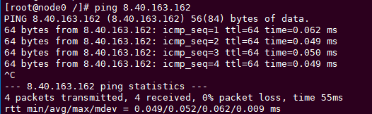
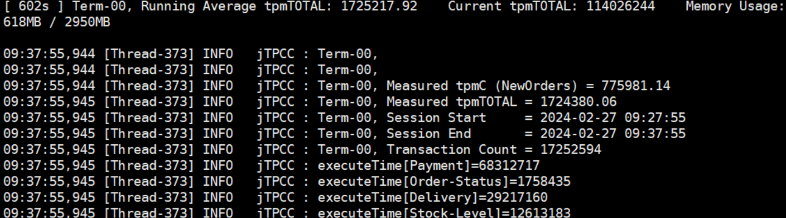

# 总体调优思路<a name="ZH-CN_TOPIC_0000001782595594"></a>

Cantian引擎主要从数据库关键参数配置、瓶颈分析以及系统配置等方面进行性能优化。在调优过程中，需要对系统资源消耗、IO吞吐量、负载等进行综合分析，对系统和数据库的关键参数进行调整以达到预期性能目标。调优可能对数据库业务产生影响，因此调优人员需要对系统软件架构、软硬件配置、数据库配置参数、并发控制、查询处理和数据库应用有广泛而深刻的理解。

# Cantian引擎关键参数配置<a name="ZH-CN_TOPIC_0000001836944529"></a>

**内存<a name="section182431641191517"></a>**

内存相关的参数配置建议如下[表1](#table8980163541)所示。

**表 1**  内存参数配置说明

<a name="table8980163541"></a>
<table><thead align="left"><tr id="row16201847413"><th class="cellrowborder" valign="top" width="16.21%" id="mcps1.2.7.1.1"><p id="p32014413411"><a name="p32014413411"></a><a name="p32014413411"></a>参数名</p>
</th>
<th class="cellrowborder" valign="top" width="41.64%" id="mcps1.2.7.1.2"><p id="p1420114745"><a name="p1420114745"></a><a name="p1420114745"></a>描述</p>
</th>
<th class="cellrowborder" valign="top" width="9.35%" id="mcps1.2.7.1.3"><p id="p1220142411"><a name="p1220142411"></a><a name="p1220142411"></a>默认值</p>
</th>
<th class="cellrowborder" valign="top" width="10.42%" id="mcps1.2.7.1.4"><p id="p16201141244"><a name="p16201141244"></a><a name="p16201141244"></a>范围</p>
</th>
<th class="cellrowborder" valign="top" width="10.84%" id="mcps1.2.7.1.5"><p id="p1020946417"><a name="p1020946417"></a><a name="p1020946417"></a>是否动态生效</p>
</th>
<th class="cellrowborder" valign="top" width="11.540000000000001%" id="mcps1.2.7.1.6"><p id="p17209410414"><a name="p17209410414"></a><a name="p17209410414"></a>调整建议</p>
</th>
</tr>
</thead>
<tbody><tr id="row3201741418"><td class="cellrowborder" valign="top" width="16.21%" headers="mcps1.2.7.1.1 "><p id="p620741841"><a name="p620741841"></a><a name="p620741841"></a>DATA_BUFFER_SIZE</p>
</td>
<td class="cellrowborder" valign="top" width="41.64%" headers="mcps1.2.7.1.2 "><p id="p8202040415"><a name="p8202040415"></a><a name="p8202040415"></a>数据BUFFER区用于缓存最近访问的数据。</p>
</td>
<td class="cellrowborder" valign="top" width="9.35%" headers="mcps1.2.7.1.3 "><p id="p1720241747"><a name="p1720241747"></a><a name="p1720241747"></a>200GB</p>
</td>
<td class="cellrowborder" valign="top" width="10.42%" headers="mcps1.2.7.1.4 "><p id="p12201243414"><a name="p12201243414"></a><a name="p12201243414"></a>[64MB, 32TB]</p>
</td>
<td class="cellrowborder" valign="top" width="10.84%" headers="mcps1.2.7.1.5 "><p id="p1920341849"><a name="p1920341849"></a><a name="p1920341849"></a>否</p>
</td>
<td class="cellrowborder" valign="top" width="11.540000000000001%" headers="mcps1.2.7.1.6 "><p id="p8201747413"><a name="p8201747413"></a><a name="p8201747413"></a>根据主机内存大小进行调整，建议为主机内存的50%。</p>
</td>
</tr>
<tr id="row1120144842"><td class="cellrowborder" valign="top" width="16.21%" headers="mcps1.2.7.1.1 "><p id="p2201749412"><a name="p2201749412"></a><a name="p2201749412"></a>BUF_POOL_NUM</p>
</td>
<td class="cellrowborder" valign="top" width="41.64%" headers="mcps1.2.7.1.2 "><p id="p120942040"><a name="p120942040"></a><a name="p120942040"></a>Data Buffer分区数，可以提升并发度。</p>
</td>
<td class="cellrowborder" valign="top" width="9.35%" headers="mcps1.2.7.1.3 "><p id="p8201143414"><a name="p8201143414"></a><a name="p8201143414"></a>32</p>
</td>
<td class="cellrowborder" valign="top" width="10.42%" headers="mcps1.2.7.1.4 "><p id="p192064241"><a name="p192064241"></a><a name="p192064241"></a>[1,128]</p>
</td>
<td class="cellrowborder" valign="top" width="10.84%" headers="mcps1.2.7.1.5 "><p id="p13201341840"><a name="p13201341840"></a><a name="p13201341840"></a>否</p>
</td>
<td class="cellrowborder" valign="top" width="11.540000000000001%" headers="mcps1.2.7.1.6 "><p id="p20211541248"><a name="p20211541248"></a><a name="p20211541248"></a>维持默认</p>
</td>
</tr>
<tr id="row421841644"><td class="cellrowborder" valign="top" width="16.21%" headers="mcps1.2.7.1.1 "><p id="p0211840419"><a name="p0211840419"></a><a name="p0211840419"></a>CR_POOL_SIZE</p>
</td>
<td class="cellrowborder" valign="top" width="41.64%" headers="mcps1.2.7.1.2 "><p id="p32117418415"><a name="p32117418415"></a><a name="p32117418415"></a>一致性读页面缓存区（即CR pool）的大小，PCR时有效。</p>
</td>
<td class="cellrowborder" valign="top" width="9.35%" headers="mcps1.2.7.1.3 "><p id="p1421641641"><a name="p1421641641"></a><a name="p1421641641"></a>1GB</p>
</td>
<td class="cellrowborder" valign="top" width="10.42%" headers="mcps1.2.7.1.4 "><p id="p18218410412"><a name="p18218410412"></a><a name="p18218410412"></a>[16MB, 32TB]</p>
</td>
<td class="cellrowborder" valign="top" width="10.84%" headers="mcps1.2.7.1.5 "><p id="p1521541419"><a name="p1521541419"></a><a name="p1521541419"></a>否</p>
</td>
<td class="cellrowborder" valign="top" width="11.540000000000001%" headers="mcps1.2.7.1.6 "><p id="p594834519411"><a name="p594834519411"></a><a name="p594834519411"></a>维持默认</p>
</td>
</tr>
<tr id="row221141243"><td class="cellrowborder" valign="top" width="16.21%" headers="mcps1.2.7.1.1 "><p id="p11211741145"><a name="p11211741145"></a><a name="p11211741145"></a>CR_POOL_COUNT</p>
</td>
<td class="cellrowborder" valign="top" width="41.64%" headers="mcps1.2.7.1.2 "><p id="p182124046"><a name="p182124046"></a><a name="p182124046"></a>一致性读页面缓存分区（即CR pool分区）的数量。</p>
</td>
<td class="cellrowborder" valign="top" width="9.35%" headers="mcps1.2.7.1.3 "><p id="p14211841442"><a name="p14211841442"></a><a name="p14211841442"></a>32</p>
</td>
<td class="cellrowborder" valign="top" width="10.42%" headers="mcps1.2.7.1.4 "><p id="p14211641044"><a name="p14211641044"></a><a name="p14211641044"></a>[1, 256]</p>
</td>
<td class="cellrowborder" valign="top" width="10.84%" headers="mcps1.2.7.1.5 "><p id="p9211442419"><a name="p9211442419"></a><a name="p9211442419"></a>否</p>
</td>
<td class="cellrowborder" valign="top" width="11.540000000000001%" headers="mcps1.2.7.1.6 "><p id="p1872144718416"><a name="p1872144718416"></a><a name="p1872144718416"></a>维持默认</p>
</td>
</tr>
<tr id="row221241243"><td class="cellrowborder" valign="top" width="16.21%" headers="mcps1.2.7.1.1 "><p id="p172154843"><a name="p172154843"></a><a name="p172154843"></a>SESSIONS</p>
</td>
<td class="cellrowborder" valign="top" width="41.64%" headers="mcps1.2.7.1.2 "><p id="p92119411412"><a name="p92119411412"></a><a name="p92119411412"></a>最大会话数。</p>
</td>
<td class="cellrowborder" valign="top" width="9.35%" headers="mcps1.2.7.1.3 "><p id="p02117413412"><a name="p02117413412"></a><a name="p02117413412"></a>18432</p>
</td>
<td class="cellrowborder" valign="top" width="10.42%" headers="mcps1.2.7.1.4 "><p id="p3211244414"><a name="p3211244414"></a><a name="p3211244414"></a>[59, 19380]</p>
</td>
<td class="cellrowborder" valign="top" width="10.84%" headers="mcps1.2.7.1.5 "><p id="p921448420"><a name="p921448420"></a><a name="p921448420"></a>是</p>
</td>
<td class="cellrowborder" valign="top" width="11.540000000000001%" headers="mcps1.2.7.1.6 "><p id="p16232155014417"><a name="p16232155014417"></a><a name="p16232155014417"></a>维持默认</p>
</td>
</tr>
<tr id="row1215412415"><td class="cellrowborder" valign="top" width="16.21%" headers="mcps1.2.7.1.1 "><p id="p721943418"><a name="p721943418"></a><a name="p721943418"></a>_INIT_CURSORS</p>
</td>
<td class="cellrowborder" valign="top" width="41.64%" headers="mcps1.2.7.1.2 "><p id="p52154749"><a name="p52154749"></a><a name="p52154749"></a>一个session上的初始游标个数。</p>
</td>
<td class="cellrowborder" valign="top" width="9.35%" headers="mcps1.2.7.1.3 "><p id="p12211244415"><a name="p12211244415"></a><a name="p12211244415"></a>32</p>
</td>
<td class="cellrowborder" valign="top" width="10.42%" headers="mcps1.2.7.1.4 "><p id="p172117414411"><a name="p172117414411"></a><a name="p172117414411"></a>[0, 256]</p>
</td>
<td class="cellrowborder" valign="top" width="10.84%" headers="mcps1.2.7.1.5 "><p id="p1521641947"><a name="p1521641947"></a><a name="p1521641947"></a>否</p>
</td>
<td class="cellrowborder" valign="top" width="11.540000000000001%" headers="mcps1.2.7.1.6 "><p id="p3685145154110"><a name="p3685145154110"></a><a name="p3685145154110"></a>维持默认</p>
</td>
</tr>
<tr id="row521144847"><td class="cellrowborder" valign="top" width="16.21%" headers="mcps1.2.7.1.1 "><p id="p1821154849"><a name="p1821154849"></a><a name="p1821154849"></a>_UNDO_SEGMENTS</p>
</td>
<td class="cellrowborder" valign="top" width="41.64%" headers="mcps1.2.7.1.2 "><p id="p1211441641"><a name="p1211441641"></a><a name="p1211441641"></a>undo段数量。</p>
</td>
<td class="cellrowborder" valign="top" width="9.35%" headers="mcps1.2.7.1.3 "><p id="p12211141644"><a name="p12211141644"></a><a name="p12211141644"></a>1024</p>
</td>
<td class="cellrowborder" valign="top" width="10.42%" headers="mcps1.2.7.1.4 "><p id="p022945412"><a name="p022945412"></a><a name="p022945412"></a>(1, 1024]</p>
</td>
<td class="cellrowborder" valign="top" width="10.84%" headers="mcps1.2.7.1.5 "><p id="p1622841347"><a name="p1622841347"></a><a name="p1622841347"></a>否</p>
</td>
<td class="cellrowborder" valign="top" width="11.540000000000001%" headers="mcps1.2.7.1.6 "><p id="p194286534416"><a name="p194286534416"></a><a name="p194286534416"></a>维持默认</p>
</td>
</tr>
</tbody>
</table>

**IO<a name="section32111209166"></a>**

IO相关的参数配置建议如下表[表2](#table386126651)所示。

**表 2**  IO参数配置说明

<a name="table386126651"></a>
<table><thead align="left"><tr id="row12546321358"><th class="cellrowborder" valign="top" width="16.21%" id="mcps1.2.7.1.1"><p id="p2439833353"><a name="p2439833353"></a><a name="p2439833353"></a>参数名</p>
</th>
<th class="cellrowborder" valign="top" width="39.95%" id="mcps1.2.7.1.2"><p id="p84398334515"><a name="p84398334515"></a><a name="p84398334515"></a>描述</p>
</th>
<th class="cellrowborder" valign="top" width="9.26%" id="mcps1.2.7.1.3"><p id="p134395336518"><a name="p134395336518"></a><a name="p134395336518"></a>默认值</p>
</th>
<th class="cellrowborder" valign="top" width="12.72%" id="mcps1.2.7.1.4"><p id="p24391331851"><a name="p24391331851"></a><a name="p24391331851"></a>范围</p>
</th>
<th class="cellrowborder" valign="top" width="10.32%" id="mcps1.2.7.1.5"><p id="p1943910331354"><a name="p1943910331354"></a><a name="p1943910331354"></a>是否动态生效</p>
</th>
<th class="cellrowborder" valign="top" width="11.540000000000001%" id="mcps1.2.7.1.6"><p id="p144391533354"><a name="p144391533354"></a><a name="p144391533354"></a>调整建议</p>
</th>
</tr>
</thead>
<tbody><tr id="row168941164515"><td class="cellrowborder" valign="top" width="16.21%" headers="mcps1.2.7.1.1 "><p id="p5894186559"><a name="p5894186559"></a><a name="p5894186559"></a>_UNDO_ACTIVE_SEGMENTS</p>
</td>
<td class="cellrowborder" valign="top" width="39.95%" headers="mcps1.2.7.1.2 "><p id="p88941461557"><a name="p88941461557"></a><a name="p88941461557"></a>当前可以使用的活跃的undo段数量。取值小于等于_UNDO_SEGMENTS的值。</p>
</td>
<td class="cellrowborder" valign="top" width="9.26%" headers="mcps1.2.7.1.3 "><p id="p17894116155"><a name="p17894116155"></a><a name="p17894116155"></a>64</p>
</td>
<td class="cellrowborder" valign="top" width="12.72%" headers="mcps1.2.7.1.4 "><p id="p1289446350"><a name="p1289446350"></a><a name="p1289446350"></a>(1, 1024]</p>
</td>
<td class="cellrowborder" valign="top" width="10.32%" headers="mcps1.2.7.1.5 "><p id="p78941369515"><a name="p78941369515"></a><a name="p78941369515"></a>是</p>
</td>
<td class="cellrowborder" valign="top" width="11.540000000000001%" headers="mcps1.2.7.1.6 "><p id="p17894661057"><a name="p17894661057"></a><a name="p17894661057"></a>默认参数可支撑大部分场景，如果事务并发过大，可以调大此参数增加并发能力，提高性能，之后可以调回原值。</p>
</td>
</tr>
<tr id="row8894186856"><td class="cellrowborder" valign="top" width="16.21%" headers="mcps1.2.7.1.1 "><p id="p78941261254"><a name="p78941261254"></a><a name="p78941261254"></a>UNDO_RETENTION_TIME</p>
</td>
<td class="cellrowborder" valign="top" width="39.95%" headers="mcps1.2.7.1.2 "><p id="p16894661512"><a name="p16894661512"></a><a name="p16894661512"></a>回滚段commit后保留时间，单位：秒。</p>
</td>
<td class="cellrowborder" valign="top" width="9.26%" headers="mcps1.2.7.1.3 "><p id="p1889486253"><a name="p1889486253"></a><a name="p1889486253"></a>600</p>
</td>
<td class="cellrowborder" valign="top" width="12.72%" headers="mcps1.2.7.1.4 "><p id="p4894106353"><a name="p4894106353"></a><a name="p4894106353"></a>(0, 4294967295]</p>
</td>
<td class="cellrowborder" valign="top" width="10.32%" headers="mcps1.2.7.1.5 "><p id="p12895465513"><a name="p12895465513"></a><a name="p12895465513"></a>是</p>
</td>
<td class="cellrowborder" valign="top" width="11.540000000000001%" headers="mcps1.2.7.1.6 "><p id="p7895106558"><a name="p7895106558"></a><a name="p7895106558"></a>维持默认</p>
</td>
</tr>
<tr id="row7895365512"><td class="cellrowborder" valign="top" width="16.21%" headers="mcps1.2.7.1.1 "><p id="p18895146257"><a name="p18895146257"></a><a name="p18895146257"></a>CHECKPOINT_PERIOD</p>
</td>
<td class="cellrowborder" valign="top" width="39.95%" headers="mcps1.2.7.1.2 "><p id="p4895156351"><a name="p4895156351"></a><a name="p4895156351"></a>设定两次checkpoint之间的间隔时间，当达到预设值时，则触发一次增量checkpoint，单位：秒。</p>
</td>
<td class="cellrowborder" valign="top" width="9.26%" headers="mcps1.2.7.1.3 "><p id="p1789519619519"><a name="p1789519619519"></a><a name="p1789519619519"></a>1</p>
</td>
<td class="cellrowborder" valign="top" width="12.72%" headers="mcps1.2.7.1.4 "><p id="p158951861057"><a name="p158951861057"></a><a name="p158951861057"></a>[1, 4294967295]</p>
</td>
<td class="cellrowborder" valign="top" width="10.32%" headers="mcps1.2.7.1.5 "><p id="p889556556"><a name="p889556556"></a><a name="p889556556"></a>是</p>
</td>
<td class="cellrowborder" valign="top" width="11.540000000000001%" headers="mcps1.2.7.1.6 "><p id="p98951261056"><a name="p98951261056"></a><a name="p98951261056"></a>维持默认</p>
</td>
</tr>
<tr id="row15895136254"><td class="cellrowborder" valign="top" width="16.21%" headers="mcps1.2.7.1.1 "><p id="p16895261556"><a name="p16895261556"></a><a name="p16895261556"></a>CHECKPOINT_PAGES</p>
</td>
<td class="cellrowborder" valign="top" width="39.95%" headers="mcps1.2.7.1.2 "><p id="p78957617512"><a name="p78957617512"></a><a name="p78957617512"></a>两次checkpoint之间的脏页数，当该数目达到此设定值将触发checkpoint。</p>
</td>
<td class="cellrowborder" valign="top" width="9.26%" headers="mcps1.2.7.1.3 "><p id="p38956613520"><a name="p38956613520"></a><a name="p38956613520"></a>200000</p>
</td>
<td class="cellrowborder" valign="top" width="12.72%" headers="mcps1.2.7.1.4 "><p id="p88956611513"><a name="p88956611513"></a><a name="p88956611513"></a>[1, 4294967295]</p>
</td>
<td class="cellrowborder" valign="top" width="10.32%" headers="mcps1.2.7.1.5 "><p id="p98951962512"><a name="p98951962512"></a><a name="p98951962512"></a>是</p>
</td>
<td class="cellrowborder" valign="top" width="11.540000000000001%" headers="mcps1.2.7.1.6 "><p id="p18895762055"><a name="p18895762055"></a><a name="p18895762055"></a>维持默认</p>
</td>
</tr>
<tr id="row289519611511"><td class="cellrowborder" valign="top" width="16.21%" headers="mcps1.2.7.1.1 "><p id="p7895186851"><a name="p7895186851"></a><a name="p7895186851"></a>DBWR_PROCESSES</p>
</td>
<td class="cellrowborder" valign="top" width="39.95%" headers="mcps1.2.7.1.2 "><p id="p168951617518"><a name="p168951617518"></a><a name="p168951617518"></a>后台写脏页面线程的个数。</p>
</td>
<td class="cellrowborder" valign="top" width="9.26%" headers="mcps1.2.7.1.3 "><p id="p118952067517"><a name="p118952067517"></a><a name="p118952067517"></a>8</p>
</td>
<td class="cellrowborder" valign="top" width="12.72%" headers="mcps1.2.7.1.4 "><p id="p1589517615519"><a name="p1589517615519"></a><a name="p1589517615519"></a>[1, 36]</p>
</td>
<td class="cellrowborder" valign="top" width="10.32%" headers="mcps1.2.7.1.5 "><p id="p148951618516"><a name="p148951618516"></a><a name="p148951618516"></a>否</p>
</td>
<td class="cellrowborder" valign="top" width="11.540000000000001%" headers="mcps1.2.7.1.6 "><p id="p138958616510"><a name="p138958616510"></a><a name="p138958616510"></a>维持默认</p>
</td>
</tr>
<tr id="row178951569510"><td class="cellrowborder" valign="top" width="16.21%" headers="mcps1.2.7.1.1 "><p id="p789511612512"><a name="p789511612512"></a><a name="p789511612512"></a>CHECKPOINT_IO_CAPACITY</p>
</td>
<td class="cellrowborder" valign="top" width="39.95%" headers="mcps1.2.7.1.2 "><p id="p198951961954"><a name="p198951961954"></a><a name="p198951961954"></a>checkpoint未被主动触发时，每次落盘的脏页容量。</p>
</td>
<td class="cellrowborder" valign="top" width="9.26%" headers="mcps1.2.7.1.3 "><p id="p10895156758"><a name="p10895156758"></a><a name="p10895156758"></a>4096</p>
</td>
<td class="cellrowborder" valign="top" width="12.72%" headers="mcps1.2.7.1.4 "><p id="p98955620517"><a name="p98955620517"></a><a name="p98955620517"></a>[1, 4096]</p>
</td>
<td class="cellrowborder" valign="top" width="10.32%" headers="mcps1.2.7.1.5 "><p id="p989514615518"><a name="p989514615518"></a><a name="p989514615518"></a>是</p>
</td>
<td class="cellrowborder" valign="top" width="11.540000000000001%" headers="mcps1.2.7.1.6 "><p id="p1489517617519"><a name="p1489517617519"></a><a name="p1489517617519"></a>维持默认</p>
</td>
</tr>
</tbody>
</table>

**DFX<a name="section16933191813165"></a>**

DFX相关的参数配置建议如下表[表3](#table9649249551)所示。

**表 3**  DFX参数配置说明

<a name="table9649249551"></a>
<table><thead align="left"><tr id="row172185541153"><th class="cellrowborder" valign="top" width="16.21%" id="mcps1.2.7.1.1"><p id="p610870766"><a name="p610870766"></a><a name="p610870766"></a>参数名</p>
</th>
<th class="cellrowborder" valign="top" width="37.89%" id="mcps1.2.7.1.2"><p id="p2108140060"><a name="p2108140060"></a><a name="p2108140060"></a>描述</p>
</th>
<th class="cellrowborder" valign="top" width="10.01%" id="mcps1.2.7.1.3"><p id="p12108110569"><a name="p12108110569"></a><a name="p12108110569"></a>默认值</p>
</th>
<th class="cellrowborder" valign="top" width="13.51%" id="mcps1.2.7.1.4"><p id="p1010813014613"><a name="p1010813014613"></a><a name="p1010813014613"></a>范围</p>
</th>
<th class="cellrowborder" valign="top" width="10.84%" id="mcps1.2.7.1.5"><p id="p31081609618"><a name="p31081609618"></a><a name="p31081609618"></a>是否动态生效</p>
</th>
<th class="cellrowborder" valign="top" width="11.540000000000001%" id="mcps1.2.7.1.6"><p id="p3108602619"><a name="p3108602619"></a><a name="p3108602619"></a>调整建议</p>
</th>
</tr>
</thead>
<tbody><tr id="row166693491254"><td class="cellrowborder" valign="top" width="16.21%" headers="mcps1.2.7.1.1 "><p id="p966904918511"><a name="p966904918511"></a><a name="p966904918511"></a>LOG_BUFFER_SIZE</p>
</td>
<td class="cellrowborder" valign="top" width="37.89%" headers="mcps1.2.7.1.2 "><p id="p1766916491551"><a name="p1766916491551"></a><a name="p1766916491551"></a>Log buffer的大小。Log buffer用于缓存Redo日志。</p>
</td>
<td class="cellrowborder" valign="top" width="10.01%" headers="mcps1.2.7.1.3 "><p id="p166918491859"><a name="p166918491859"></a><a name="p166918491859"></a>110MB</p>
</td>
<td class="cellrowborder" valign="top" width="13.51%" headers="mcps1.2.7.1.4 "><p id="p1266924911511"><a name="p1266924911511"></a><a name="p1266924911511"></a>[1MB, 110MB]</p>
</td>
<td class="cellrowborder" valign="top" width="10.84%" headers="mcps1.2.7.1.5 "><p id="p17669149053"><a name="p17669149053"></a><a name="p17669149053"></a>否</p>
</td>
<td class="cellrowborder" valign="top" width="11.540000000000001%" headers="mcps1.2.7.1.6 "><p id="p10669164912516"><a name="p10669164912516"></a><a name="p10669164912516"></a>维持默认</p>
</td>
</tr>
<tr id="row16693491520"><td class="cellrowborder" valign="top" width="16.21%" headers="mcps1.2.7.1.1 "><p id="p866918491359"><a name="p866918491359"></a><a name="p866918491359"></a>LOG_BUFFER_COUNT</p>
</td>
<td class="cellrowborder" valign="top" width="37.89%" headers="mcps1.2.7.1.2 "><p id="p666984916519"><a name="p666984916519"></a><a name="p666984916519"></a>Log buffer的数量，分成多少个buffer。</p>
</td>
<td class="cellrowborder" valign="top" width="10.01%" headers="mcps1.2.7.1.3 "><p id="p76696495513"><a name="p76696495513"></a><a name="p76696495513"></a>16</p>
</td>
<td class="cellrowborder" valign="top" width="13.51%" headers="mcps1.2.7.1.4 "><p id="p1766913496515"><a name="p1766913496515"></a><a name="p1766913496515"></a>(0,16]</p>
</td>
<td class="cellrowborder" valign="top" width="10.84%" headers="mcps1.2.7.1.5 "><p id="p13669549757"><a name="p13669549757"></a><a name="p13669549757"></a>否</p>
</td>
<td class="cellrowborder" valign="top" width="11.540000000000001%" headers="mcps1.2.7.1.6 "><p id="p116692491355"><a name="p116692491355"></a><a name="p116692491355"></a>维持默认</p>
</td>
</tr>
<tr id="row16691449851"><td class="cellrowborder" valign="top" width="16.21%" headers="mcps1.2.7.1.1 "><p id="p466974916512"><a name="p466974916512"></a><a name="p466974916512"></a>_LOG_LEVEL</p>
</td>
<td class="cellrowborder" valign="top" width="37.89%" headers="mcps1.2.7.1.2 "><p id="p6429195844819"><a name="p6429195844819"></a><a name="p6429195844819"></a>日志级别：</p>
<a name="ul4185142114916"></a><a name="ul4185142114916"></a><ul id="ul4185142114916"><li>RUN ERROR 1</li><li>RUN WARNING 2</li><li>RUN INFORMATION 4</li><li>DEBUG ERROR 16</li><li>DEBUG WARNING 32</li><li>DEBUG INFORMATION 64</li><li>LONGSQL LOG 256</li></ul>
</td>
<td class="cellrowborder" valign="top" width="10.01%" headers="mcps1.2.7.1.3 "><p id="p46699491855"><a name="p46699491855"></a><a name="p46699491855"></a>7</p>
</td>
<td class="cellrowborder" valign="top" width="13.51%" headers="mcps1.2.7.1.4 "><p id="p10669949153"><a name="p10669949153"></a><a name="p10669949153"></a>[0,16712567]</p>
</td>
<td class="cellrowborder" valign="top" width="10.84%" headers="mcps1.2.7.1.5 "><p id="p666914495516"><a name="p666914495516"></a><a name="p666914495516"></a>是</p>
</td>
<td class="cellrowborder" valign="top" width="11.540000000000001%" headers="mcps1.2.7.1.6 "><p id="p1166964915511"><a name="p1166964915511"></a><a name="p1166964915511"></a>定位时需要更多日志时调大，平时采用默认参数。</p>
</td>
</tr>
<tr id="row12669134911513"><td class="cellrowborder" valign="top" width="16.21%" headers="mcps1.2.7.1.1 "><p id="p166917491758"><a name="p166917491758"></a><a name="p166917491758"></a>ENABLE_BROADCAST_ON_COMMIT</p>
</td>
<td class="cellrowborder" valign="top" width="37.89%" headers="mcps1.2.7.1.2 "><p id="p1466914491520"><a name="p1466914491520"></a><a name="p1466914491520"></a>每次commit之前广播scn，避免另一个节点scn更新延迟。</p>
</td>
<td class="cellrowborder" valign="top" width="10.01%" headers="mcps1.2.7.1.3 "><p id="p166913493517"><a name="p166913493517"></a><a name="p166913493517"></a>TRUE</p>
</td>
<td class="cellrowborder" valign="top" width="13.51%" headers="mcps1.2.7.1.4 "><p id="p1166913491052"><a name="p1166913491052"></a><a name="p1166913491052"></a>FALSE, TRUE</p>
</td>
<td class="cellrowborder" valign="top" width="10.84%" headers="mcps1.2.7.1.5 "><p id="p1066916493511"><a name="p1066916493511"></a><a name="p1066916493511"></a>是</p>
</td>
<td class="cellrowborder" valign="top" width="11.540000000000001%" headers="mcps1.2.7.1.6 "><p id="p186696498514"><a name="p186696498514"></a><a name="p186696498514"></a>为了保障两个节点的数据一致性，在每次commit之前广播scn，收到对端节点ack后，commit成功。影响性能约为5%，极限性能场景可设为FALSE。</p>
</td>
</tr>
</tbody>
</table>

# 系统调优<a name="ZH-CN_TOPIC_0000001836788565"></a>

**硬件环境<a name="section94671549115118"></a>**

**配置服务器BIOS**

鲲鹏服务器BIOS配置建议如[表1](#table549920256204)所示。

**表 1**  鲲鹏服务器BIOS配置说明

<a name="table549920256204"></a>
<table><thead align="left"><tr id="row552442517208"><th class="cellrowborder" valign="top" width="16.8%" id="mcps1.2.5.1.1"><p id="p1052442513202"><a name="p1052442513202"></a><a name="p1052442513202"></a>配置项</p>
</th>
<th class="cellrowborder" valign="top" width="32.17%" id="mcps1.2.5.1.2"><p id="p052413258207"><a name="p052413258207"></a><a name="p052413258207"></a>选项含义</p>
</th>
<th class="cellrowborder" valign="top" width="14.85%" id="mcps1.2.5.1.3"><p id="p1952452532012"><a name="p1952452532012"></a><a name="p1952452532012"></a>配置建议</p>
</th>
<th class="cellrowborder" valign="top" width="36.18%" id="mcps1.2.5.1.4"><p id="p152412532015"><a name="p152412532015"></a><a name="p152412532015"></a>配置原因</p>
</th>
</tr>
</thead>
<tbody><tr id="row9524152519202"><td class="cellrowborder" valign="top" width="16.8%" headers="mcps1.2.5.1.1 "><p id="p12524825172013"><a name="p12524825172013"></a><a name="p12524825172013"></a>Power Policy</p>
</td>
<td class="cellrowborder" valign="top" width="32.17%" headers="mcps1.2.5.1.2 "><p id="p5524625132018"><a name="p5524625132018"></a><a name="p5524625132018"></a>能效模式。</p>
<a name="ul1252492520205"></a><a name="ul1252492520205"></a><ul id="ul1252492520205"><li>Efficiency：节能模式，支持CPPC动态调频。</li><li>Performance：性能模式，无动态调频，固定运行在标称频率。</li></ul>
</td>
<td class="cellrowborder" valign="top" width="14.85%" headers="mcps1.2.5.1.3 "><p id="p852412542019"><a name="p852412542019"></a><a name="p852412542019"></a>Performance</p>
</td>
<td class="cellrowborder" valign="top" width="36.18%" headers="mcps1.2.5.1.4 "><p id="p1524112572014"><a name="p1524112572014"></a><a name="p1524112572014"></a>性能模式，无动态调频，固定运行在标称频率。</p>
</td>
</tr>
<tr id="row165242259207"><td class="cellrowborder" valign="top" width="16.8%" headers="mcps1.2.5.1.1 "><p id="p9524132542011"><a name="p9524132542011"></a><a name="p9524132542011"></a>Custom Refresh Rate</p>
</td>
<td class="cellrowborder" valign="top" width="32.17%" headers="mcps1.2.5.1.2 "><p id="p1352412520201"><a name="p1352412520201"></a><a name="p1352412520201"></a>自定义内存刷新速率。</p>
</td>
<td class="cellrowborder" valign="top" width="14.85%" headers="mcps1.2.5.1.3 "><p id="p1952462582013"><a name="p1952462582013"></a><a name="p1952462582013"></a>32ms</p>
</td>
<td class="cellrowborder" valign="top" width="36.18%" headers="mcps1.2.5.1.4 "><p id="p10525202542020"><a name="p10525202542020"></a><a name="p10525202542020"></a>固定内存刷新频率。</p>
</td>
</tr>
<tr id="row175256258203"><td class="cellrowborder" valign="top" width="16.8%" headers="mcps1.2.5.1.1 "><p id="p25256258209"><a name="p25256258209"></a><a name="p25256258209"></a>NUMA</p>
</td>
<td class="cellrowborder" valign="top" width="32.17%" headers="mcps1.2.5.1.2 "><p id="p10525825182018"><a name="p10525825182018"></a><a name="p10525825182018"></a>控制是否使能（非统一内存访问）NUMA。</p>
</td>
<td class="cellrowborder" valign="top" width="14.85%" headers="mcps1.2.5.1.3 "><p id="p852552502017"><a name="p852552502017"></a><a name="p852552502017"></a>Enable（默认值）</p>
</td>
<td class="cellrowborder" valign="top" width="36.18%" headers="mcps1.2.5.1.4 "><p id="p18525125142010"><a name="p18525125142010"></a><a name="p18525125142010"></a>大多数情况下开启此选项后，某些工作负载的性能会有所提高。关闭NUMA要求所有节点的内存大小相同。</p>
</td>
</tr>
<tr id="row19525172514200"><td class="cellrowborder" valign="top" width="16.8%" headers="mcps1.2.5.1.1 "><p id="p55251425142015"><a name="p55251425142015"></a><a name="p55251425142015"></a>Die Interleaving</p>
</td>
<td class="cellrowborder" valign="top" width="32.17%" headers="mcps1.2.5.1.2 "><p id="p115251125112019"><a name="p115251125112019"></a><a name="p115251125112019"></a>控制是否使能DIE交织。使能DIE交织能充分利用系统的DDR带宽，并尽量保证各DDR通道的带宽均衡，提升DDR的利用率。</p>
</td>
<td class="cellrowborder" valign="top" width="14.85%" headers="mcps1.2.5.1.3 "><p id="p552510252204"><a name="p552510252204"></a><a name="p552510252204"></a>Disable（默认值）</p>
</td>
<td class="cellrowborder" valign="top" width="36.18%" headers="mcps1.2.5.1.4 "><p id="p1052582532017"><a name="p1052582532017"></a><a name="p1052582532017"></a>采用默认值即可。使能DIE交织后，可能会导致访存变慢，性能下降。</p>
</td>
</tr>
<tr id="row115258254202"><td class="cellrowborder" valign="top" width="16.8%" headers="mcps1.2.5.1.1 "><p id="p55251257207"><a name="p55251257207"></a><a name="p55251257207"></a>Rank Interleaving</p>
</td>
<td class="cellrowborder" valign="top" width="32.17%" headers="mcps1.2.5.1.2 "><p id="p752552515202"><a name="p752552515202"></a><a name="p752552515202"></a>配置排列交织模式。</p>
</td>
<td class="cellrowborder" valign="top" width="14.85%" headers="mcps1.2.5.1.3 "><p id="p15251025102016"><a name="p15251025102016"></a><a name="p15251025102016"></a>4-way Interleave（默认值）</p>
</td>
<td class="cellrowborder" valign="top" width="36.18%" headers="mcps1.2.5.1.4 "><p id="p1652510259205"><a name="p1652510259205"></a><a name="p1652510259205"></a>采用默认值即可。</p>
</td>
</tr>
<tr id="row55255255209"><td class="cellrowborder" valign="top" width="16.8%" headers="mcps1.2.5.1.1 "><p id="p1525192515208"><a name="p1525192515208"></a><a name="p1525192515208"></a>One Numa Per Socket</p>
</td>
<td class="cellrowborder" valign="top" width="32.17%" headers="mcps1.2.5.1.2 "><p id="p10525152522018"><a name="p10525152522018"></a><a name="p10525152522018"></a>每一个CPU一个Numa。如果需要设置每一个CPU多个Numa，需要同时停用“One Numa Per Socket”和“Die Interleaving”参数。</p>
</td>
<td class="cellrowborder" valign="top" width="14.85%" headers="mcps1.2.5.1.3 "><p id="p2525112562010"><a name="p2525112562010"></a><a name="p2525112562010"></a>Disabled（默认值）</p>
</td>
<td class="cellrowborder" valign="top" width="36.18%" headers="mcps1.2.5.1.4 "><p id="p16525425162020"><a name="p16525425162020"></a><a name="p16525425162020"></a>采用默认值即可。开启可能会导致访存变慢，性能下降。</p>
</td>
</tr>
<tr id="row9525325162020"><td class="cellrowborder" valign="top" width="16.8%" headers="mcps1.2.5.1.1 "><p id="p1352522513206"><a name="p1352522513206"></a><a name="p1352522513206"></a>CPU Prefetching Configuration</p>
</td>
<td class="cellrowborder" valign="top" width="32.17%" headers="mcps1.2.5.1.2 "><p id="p152519253208"><a name="p152519253208"></a><a name="p152519253208"></a>CPU预取配置。</p>
</td>
<td class="cellrowborder" valign="top" width="14.85%" headers="mcps1.2.5.1.3 "><p id="p14525172562016"><a name="p14525172562016"></a><a name="p14525172562016"></a>Disabled</p>
</td>
<td class="cellrowborder" valign="top" width="36.18%" headers="mcps1.2.5.1.4 "><p id="p252562518204"><a name="p252562518204"></a><a name="p252562518204"></a>大量顺序读取数据的场景下，性能可能有提升。</p>
</td>
</tr>
<tr id="row2038718241258"><td class="cellrowborder" valign="top" width="16.8%" headers="mcps1.2.5.1.1 "><p id="p17387202414256"><a name="p17387202414256"></a><a name="p17387202414256"></a>Support Smmu</p>
</td>
<td class="cellrowborder" valign="top" width="32.17%" headers="mcps1.2.5.1.2 "><p id="p07401546102612"><a name="p07401546102612"></a><a name="p07401546102612"></a>SMMU用于外设在读写内存时，将虚拟地址转化为物理地址。</p>
</td>
<td class="cellrowborder" valign="top" width="14.85%" headers="mcps1.2.5.1.3 "><p id="p142381751112615"><a name="p142381751112615"></a><a name="p142381751112615"></a>Disabled</p>
</td>
<td class="cellrowborder" valign="top" width="36.18%" headers="mcps1.2.5.1.4 "><p id="p8756192972716"><a name="p8756192972716"></a><a name="p8756192972716"></a>外设通过SMMU访问内存时，都要通过SMMU进行一次虚拟地址和物理地址的转换，从而多了一次地址转换的过程，导致性能变慢，所以建议关闭。</p>
</td>
</tr>
</tbody>
</table>

**网络**

网络延迟及丢包率分析

检查网络延迟及丢包率，通过ping交换机和主机观察是否有网络丢包和响应时长，响应时长超过1毫秒会影响性能，丢包率超过1%会影响性能。



**业务网卡<a name="section203363472529"></a>**

网卡中断绑核的优势在于将网卡队列上报接收中断或发送中断分散到各个core上，防止中断集中在某些特定的core上。这些接收中断的core的负载全部用于处理网卡中断和网络报文接收，其他core处于饥饿状态，网卡IO成为性能瓶颈。

1.  登录主机关闭irqbalance服务。否则绑定网卡中断之后，会被重新分配。

    ```
    service irqbalance stop
    ```

2.  使用ethtool查看并配置当前网卡的队列，建议配置为最大值（不要超过CPU核数）。
    1.  查看网卡当前的队列。

        ```
        ethtool -l 网卡名称
        ```

        如：

        ```
        ethtool -l eth0
        ```

    2.  为网卡配置队列数。

        ```
        ethtool -L 网卡名称 combined 队列数
        ```

3.  中断绑定

    把下发业务的网卡队列均匀绑在固定的CPU上，绑定的CPU按照numa的数量进行均匀分配，网卡队列数/NUMA的数量=网卡绑定的CPU核数。如果文件系统设置了独占核，则网卡中断绑核需要避让这些独占核，从而使性能达到最优。

    将以下内容复制到.sh配置文件并修改配置参数后，运行配置文件实现中断绑定。

    ```
    NICNAME=业务网卡名
    NET_BIND_CORES=网卡绑定的cpu的核数
    CORES_PER_NUMA=每个NUMA上的核数
    ALL_CPU_CORES=总的CPU核数
    NUMA_NODES=NUMA的数量
    
    if [ ${NICNAME} ];then
        echo "config 10g port $NICNAME irq ..."
        ids=($(grep $NICNAME /proc/interrupts | awk -F: '{print $1}') )
        for((k=0;k<${#ids[@]};k++))
        do
            core_id=$(($(($((${k}+1))*${CORES_PER_NUMA}-$((${k}%${NET_BIND_CORES}/${NUMA_NODES}))-1))%${ALL_CPU_CORES}))
            echo ${core_id} > /proc/irq/${ids[$k]}/smp_affinity_list
        done
    else
        echo "warning: no ${NICNAME} nic."
    fi
    ```

# TPCC性能调优测试指导<a name="ZH-CN_TOPIC_0000001790069404"></a>

本节主要介绍Cantian引擎为了达到最佳TPMC性能所依赖的关键系统级调优。

**环境搭建要求<a name="section10683138104713"></a>**

**硬件要求**

-   服务器数量：3台鲲鹏920服务器（2台用于数据库服务器，1台用于TPCC客户端）
-   服务器硬件规格：

    内存：大于512GB

    网卡：6\*10Gb ETH端口

-   业务交换机：48端口10Gb ETH交换机

**软件要求**

操作系统要求：openEuler-22.03-LTS（aarch64 架构）

**环境配置**

按照[系统调优](#ZH-CN_TOPIC_0000001836788565)描述修改环境配置。

**Cantian引擎性能参数配置<a name="section1820295635011"></a>**

1.  关闭归档，依次在Cantian引擎所有节点执行以下操作。
    1.  进入Cantian引擎配置文件config\_params.json所在目录。
    2.  修改配置文件中db\_type的值，修改为"db\_type": "0"，表示关闭归档。
    3.  重启Cantian进程使其生效，进入“_Cantian引擎__安装目录_/cantian\_connector/action”，依次执行以下命令重启Cantian进程。

        ```
        sh appctl.sh stop
        sh appctl.sh start
        ```

2.  关闭ENABLE\_BROADCAST\_ON\_COMMIT，依次在Cantian引擎所有节点执行以下操作。
    1.  执行以下命令切换到**cantian**用户。

        ```
        su -s /bin/bash - cantian
        ```

    2.  执行以下命令连接ctsql，根据提示输入**sys**用户的登录密码。

        ```
        ctsql sys@127.0.0.1:1611
        ```

    3.  执行以下命令关闭ENABLE\_BROADCAST\_ON\_COMMIT。

        ```
        alter system set ENABLE_BROADCAST_ON_COMMIT=FALSE;
        ```

**测试TPCC性能<a name="section1825969185211"></a>**

1.  下载TPCC标准测试工具BenchmarkSQL5.0。
2.  进入benchmarksql-5.0根目录，输入ant命令进行编译。

    编译成功后会生成build和dist两个目录。

    ```
    cd /benchmarksql-5.0/
    ant
    ```

3.  执行以下命令打开并修改benchmarkSQL配置文件，配置文件的路径为“/benchmarksql-5.0/run”。

    使用benchmarkSQL前需要配置数据库相关的信息，包括数据库账号、密码、端口、数据库名称。

    ```
    vim props.mysql_daac
    ```

    配置文件内容如下：

    ```
    db=mysql
    //driver=com.mysql.jdbc.Driver
    driver=com.mysql.cj.jdbc.Driver
    
    // 修改连接字符串, 包含IP、端口号、数据库，其中192.168.44.211为数据库服务端的万兆网卡IP。运行单节点TPCC时用这个参数。
    conn=jdbc:mysql://192.168.44.211:3306/TPCC?rewriteBatchedStatements=true&allowPublicKeyRetrieval=true&useSSL=false&useServerPrepStmts=true&cachePrepStmts=true&useLocalSessionState=true&prepStmtCacheSize=10000&prepStmtCacheSqlLimit=2048&cacheResultSetMetadata=true&cacheServerConfiguration=true&elideSetAutoCommits=true&maintainTimeStats=false
    
    // 运行双节点TPCC时用这个参数
    //conn=jdbc:mysql:loadbalance://10.48.163.162:3306,10.48.163.164:3306/tpcc?rewriteBatchedStatements=true&allowPublicKeyRetrieval=true&useSSL=false&useServerPrepStmts=true&cachePrepStmts=true&useLocalSessionState=true&prepStmtCacheSize=10000&prepStmtCacheSqlLimit=2048&cacheResultSetMetadata=true&cacheServerConfiguration=true&elideSetAutoCommits=true&maintainTimeStats=false&ha.loadBalanceStrategy=roundRobin
    
    // 设置数据库登录用户和密码。
    user=myuser
    password=mypass
    
    warehouses=1000
    loadWorkers=250
    
    terminals=450
    //To run specified transactions per terminal- runMins must equal zero
    runTxnsPerTerminal=0
    //To run for specified minutes- runTxnsPerTerminal must equal zero
    runMins=10
    //Number of total transactions per minute
    limitTxnsPerMin=0
    
    //Set to true to run in 4.x compatible mode. Set to false to use the
    //entire configured database evenly.
    terminalWarehouseFixed=true
    
    //The following five values must add up to 100
    //The default percentages of 45, 43, 4, 4 & 4 match the TPC-C spec
    newOrderWeight=45
    paymentWeight=43
    orderStatusWeight=4
    deliveryWeight=4
    stockLevelWeight=4
    
    // Directory name to create for collecting detailed result data.
    // Comment this out to suppress.
    //resultDirectory=my_result_%tY-%tm-%td_%tH%tM%tS
    //osCollectorScript=./misc/os_collector_linux.py
    //osCollectorInterval=1
    //osCollectorSSHAddr=user@dbhost
    //osCollectorDevices=net_eth0 blk_sda
    ```

4.  TPCC导入数据前准备。

    新增benchmarkSQL中的建表sql文件tableCreates\_1000hpar.sql，路径为benchmarksql-5.0/run/sql.common/，该文件中表使用1000分区。

    ```
    create table bmsql_config (
              cfg_name    varchar(30) primary key,
              cfg_value   varchar(50)
    );
    
    create table bmsql_warehouse (
              w_id        integer   not null,
              w_ytd       decimal(12,2),
              w_tax       decimal(4,4),
              w_name      varchar(10),
              w_street_1  varchar(20),
              w_street_2  varchar(20),
              w_city      varchar(20),
              w_state     char(2),
              w_zip       char(9)
    )
    PARTITION BY HASH(w_id) PARTITIONS 1000;
    
    create table bmsql_district (
              d_w_id       integer       not null,
              d_id         integer       not null,
              d_ytd        decimal(12,2),
              d_tax        decimal(4,4),
              d_next_o_id  integer,
              d_name       varchar(10),
              d_street_1   varchar(20),
              d_street_2   varchar(20),
              d_city       varchar(20),
              d_state      char(2),
              d_zip        char(9)
    )
    PARTITION BY HASH(d_w_id) PARTITIONS 1000;
    
    create table bmsql_customer (
              c_w_id         integer        not null,
              c_d_id         integer        not null,
              c_id           integer        not null,
              c_discount     decimal(4,4),
              c_credit       char(2),
              c_last         varchar(16),
              c_first        varchar(16),
              c_credit_lim   decimal(12,2),
              c_balance      decimal(12,2),
              c_ytd_payment  decimal(12,2),
              c_payment_cnt  integer,
              c_delivery_cnt integer,
              c_street_1     varchar(20),
              c_street_2     varchar(20),
              c_city         varchar(20),
              c_state        char(2),
              c_zip          char(9),
              c_phone        char(16),
              c_since        timestamp,
              c_middle       char(2),
              c_data         varchar(500)
    )
    PARTITION BY HASH(c_w_id) PARTITIONS 1000;
    
    create table bmsql_history (
              hist_id  integer,
              h_c_id   integer,
              h_c_d_id integer,
              h_c_w_id integer,
              h_d_id   integer,
              h_w_id   integer,
              h_date   timestamp,
              h_amount decimal(6,2),
              h_data   varchar(24)
    )
    PARTITION BY HASH(h_w_id) PARTITIONS 1000;
    
    create table bmsql_new_order (
              no_w_id  integer   not null,
              no_d_id  integer   not null,
              no_o_id  integer   not null
    )
    PARTITION BY HASH(no_w_id) PARTITIONS 1000;
    
    create table bmsql_oorder (
              o_w_id       integer      not null,
              o_d_id       integer      not null,
              o_id         integer      not null,
              o_c_id       integer,
              o_carrier_id integer,
              o_ol_cnt     integer,
              o_all_local  integer,
              o_entry_d    timestamp
    )
    PARTITION BY HASH(o_w_id) PARTITIONS 1000;
    
    create table bmsql_order_line (
              ol_w_id         integer   not null,
              ol_d_id         integer   not null,
              ol_o_id         integer   not null,
              ol_number       integer   not null,
              ol_i_id         integer   not null,
              ol_delivery_d   timestamp,
              ol_amount       decimal(6,2),
              ol_supply_w_id  integer,
              ol_quantity     integer,
              ol_dist_info    char(24)
    )
    PARTITION BY HASH(ol_w_id) PARTITIONS 1000;
    
    create table bmsql_item (
              i_id     integer      not null,
              i_name   varchar(24),
              i_price  decimal(5,2),
              i_data   varchar(50),
              i_im_id  integer
    )
    PARTITION BY HASH(i_id) PARTITIONS 1000;
    
    create table bmsql_stock (
              s_w_id       integer       not null,
              s_i_id       integer       not null,
              s_quantity   integer,
              s_ytd        integer,
              s_order_cnt  integer,
              s_remote_cnt integer,
              s_data       varchar(50),
              s_dist_01    char(24),
              s_dist_02    char(24),
              s_dist_03    char(24),
              s_dist_04    char(24),
              s_dist_05    char(24),
              s_dist_06    char(24),
              s_dist_07    char(24),
              s_dist_08    char(24),
              s_dist_09    char(24),
              s_dist_10    char(24)
    )
    PARTITION BY HASH(s_w_id) PARTITIONS 1000;
    ```

5.  导入数据。
    1.  创建数据库用户。

        ```
        set global transaction_isolation='read-committed';
        set global CTC_lock_wait_timeout=0;
        set GLOBAL max_connections = 1000;
        set global ctc_db_datafile_size = 300*1024;
        create database tpcc default charset=ascii;
        CREATE USER 'myuser'@'%' IDENTIFIED BY 'mypass';
        GRANT ALL PRIVILEGES ON *.* TO 'myuser'@'%';
        ALTER USER 'myuser'@'%' IDENTIFIED WITH mysql_native_password BY 'mypass';
        FLUSH PRIVILEGES;
        ```

    2.  修改benchmarksql-5.0/run/props.mysql\_daac中的数据库和用户名密码。
    3.  执行以下命令导入数据。

        ```
        ./runSQL.sh props.mysql ./sql.common/tableCreates_1000hpar.sql
        ./runSQL.sh props.mysql ./sql.common/indexCreates.sql
        ./runLoader.sh props.mysql
        ```

6.  执行analyze分析数据，两个Cantian引擎节点均需执行。

    ```
    analyze table demo_db.bmsql_config;
    analyze table demo_db.bmsql_warehouse;
    analyze table demo_db.bmsql_district;
    analyze table demo_db.bmsql_customer;
    analyze table demo_db.bmsql_history;
    analyze table demo_db.bmsql_oorder;
    analyze table demo_db.bmsql_new_order;
    analyze table demo_db.bmsql_order_line;
    analyze table demo_db.bmsql_stock;
    analyze table demo_db.bmsql_item;
    ```

7.  启动TPCC测试 。

    ```
    ./runBenchmark.sh props.mysql
    ```

    运行后的结果如下图，tpmC部分即为测试结果。

    

