# 概述

Cantian存储引擎决方案，结合企业级存储及开源数据库，形成面向运营商和金融市场的OLTP数据库解决方案。

主要解决当前企业的分布式数据库改造中遇到的问题，以及Oracle替换场景的问题。

# Cantian引擎软件架构

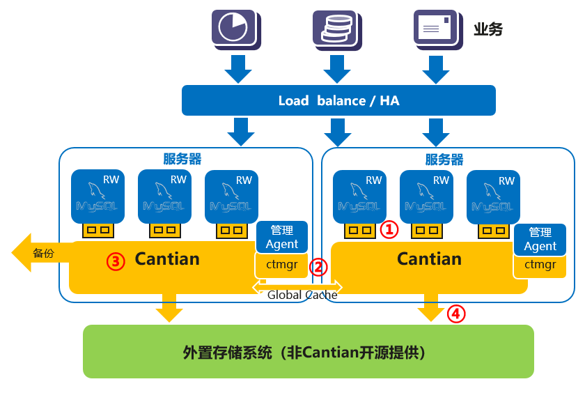

产品的整体方案如图所示。

黄色部分为Cantian开源代码交付的核心模块，主要部署在计算节点上。分成几个部分：

1.  和MySQL对接的Connector部分，这部分和MySQL在一个进程空间运行，主要作用是接受MySQL的请求，并通过IPC和Cantian进程进行通信。Cantian图中的标号①。这部分代码完全遵守MySQL的开源协议进行开源。
2.  Cantian引擎，参见图中的标号③。这部分运行时包括两部分，一部分是Cantian的业务进程，另一部分是集群管理CMS进程。每个Cantian进程都会对应一个CMS进程。CMS负责监管Cantian运行状态，脑裂仲裁，Cantian故障时由CMS拉起。CMS故障时由一个看门狗拉起。为实现多写Cantian之间通过高速网络进行通信，网络通信部分参见图中标号②。Cantian引擎整体是基于木兰开源许可协议的。
3.  访问存储客户端（内置在Cantian引擎中），主要作用是和存储通信获取数据，使用外置的共享存储即可对接。参见图中标号④。

图上蓝色部分不包括在Cantian开源代码中，需要由Cantian开源的使用者，例如数据库厂商提供。

# 主要特性介绍

## 多读多写特性介绍

Cantian引擎是基于共享存储的多写集群，各个节点在架构上对等，从任何一个节点都可以对数据库做DDL/DML/DCL等操作。任何一个节点做的修改，在满足隔离级别的要求下，其他节点都可以看到。所有计算节点共享和读写存储上同一份用户数据。

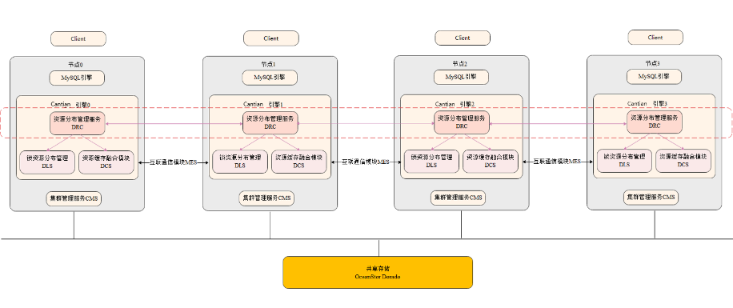

上述为架构原理图，当前发布的版本暂时仅支持2节点部署模式。后续会在社区中提供更多节点的支持能力。

### 集群化组件

整个多写集群通过如下集群组件把单机操作扩展到多节点集群：

1.  DRC: 管理分布式元数据信息，包括page/lock等资源在集群范围下的owner、权限、并发控制等信息；
2.  DCS:
    1.  管理集群范围内page的并发控制，包括page读写的并发控制，全局page读写请求的处理，page owner/只读副本的管理，最新版本page在集群范围内传输和老版本的失效等操作。
    2.  每个page都有协调者（Master）、请求者（Requester）和持有者（Owner）三个角色。master负责登记该Page的持有者信息，requester为最新请求读写该Page的节点，owner持有该资源的最新版本，一般是上一次修改数据的节点。在整个集群范围内，某个page同一时刻只能被1个节点写，可以同时被多个节点读取。读写page是互斥操作。
    3.  页面请求过程：requester根据Page ID计算协调者所在节点，将SCN和请求的Page ID发给master，master通知该Page的owner将Page发送给requester，requester收到该Page，然后requester通知master自己成为该Page的owner

        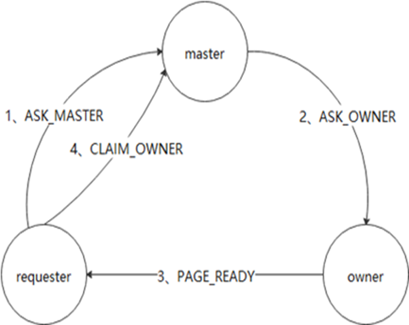

3.  DLS: 管理集群范围内lock的并发控制，把spinlock, latch等锁资源扩展到整个集群。和DCS一样，每个DLS资源都有协调者（Master）、请求者（Requester）和持有者（Owner）三个角色。

### 集群文件布局

多读多写架构需要共享存储的支持，由多个计算节点组成多写集群。

所有节点共享ctrl文件，共享system表空间、doublewrite区和user表空间。每个节点有单独的undo、temp表空间和redo log。每个节点只能写本节点的undo、redo和temp文件。集群正常运行过程中，某个节点可以读其他节点的undo文件以构造PCR页面，但是不能写其他节点的undo文件。集群做partial/full recovery时，做recovery的节点会读取crash/shutdown节点的redo log。集群正常运行时，每个节点只能写本节点的redo log。temp分区是节点私有的，只能被本节点读写，不会被其他节点访问。当节点的temp buffer不足时，节点会把temp buffer的内容换入换出到temp分区。temp buffer和temp分区一样，都是节点私有的。集群的文件布局如下：

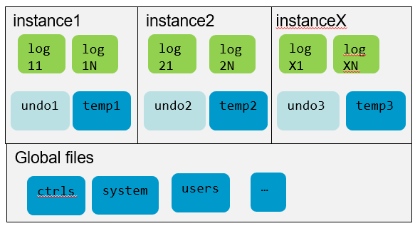

**3.1.3 分布式MVCC**

集群模式下，每个实例有自己的undo表空间，其中包括： 每个实例有自己独立的undo segment管理机制，undo回收机制，互不干扰。 每个实例有自己的事务表，事务在实例间是不能复用的。

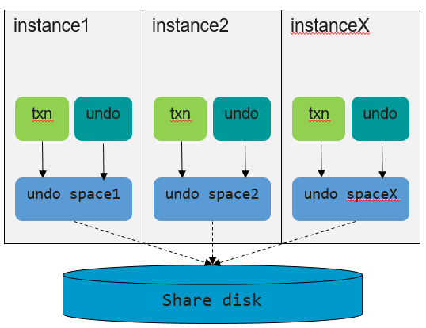

1.  segment管理

    每个实例具有独立的undo segments。

    undo的分配按照当前单机分配机制进行，正常情况下只进行本地读取和修改，不进入data fusion。

    smon线程后台shrink只在当前实例undo segments范围内进行。

2.  txn管理（xmap, xnum\) xmap -\> \(seg\_id, slot\)

    事务xid随着seg\_id的分离而分离，根据当前事务xid中的seg\_id可以快速定位到事务所在的实例和实际实例内的segment。

    每个实例的undo下面具有独立的事务表，事务分配按照单机分配回收机制进行。

3.  分布式MVCC

    集群模式下一致性读场景，某个实例要查询的页面可能在其他实例，甚至正在被其他实例上的事务修改。由于实例之前的undo和事务是隔离的，当前查询无法直接在本地完成CR页面的构建，如果依靠其他实例将需要的undo页面通过DCS传输到本地，则效率太低。考虑采用传输CR页面的方式，由相关实例后台参与CR页面的构建。

4.  跨实例构建PCR流程

    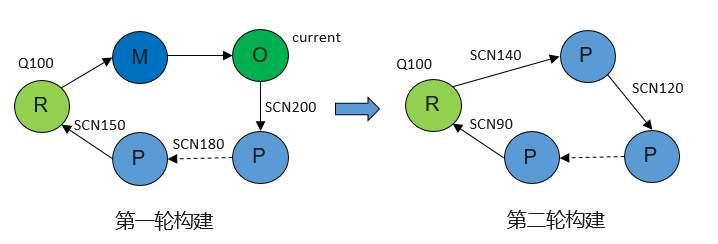

    1.  检查页面所有事务，优先还原当前实例上所有未提交事务\(减少多次交互\)，针对其他实例未提交事务，将查询信息\(query\_scn, xid等\)以及page发送给对应的实例。
    2.  对应实例后台DCS服务线程收到消息后，根据查询信息以及page进行本地的CR页面构建，还原当前实例上所有未提交事务，继续交接给下一个实例。
    3.  进入到提交事务还原阶段时，必须严格按照事务提交的逆序进行，每次只还原一个事务，继续交接给下一个事务所在的实例。
    4.  直到页面对查询完全可见，将最终结果发送给请求者\(R\)。
    5.  页面在本地，从本地进行CR构建，页面不在本地，从owner进行CR构建

### 特性约束

计算节点之间需要稳定高速的通信网络以交换page、锁等资源。

## 集群管理

### CMS

CMS: Cluster manager server，Cluster manager server负责集群管理。

#### CMS职责

CMS具体职责包括：

1.  维护集群成员状态信息

    计划内变化包括主机节点的新增、删除，计划外变化包括数据库故障退出等

2.  监控集群服务相关资源状态是否正常

    包括主机资源状况，如网络通信状态，还包括数据库状况，如实例（主要是进程）状态

3.  异常故障处理

    如Cantian异常后，需要将相关资源停下来，通过iofence控制该Cantian实例与存储的交互。异常检测的速度越快越好，以降低RTO

4.  Reform cluster

    当集群成员变化后，达到一个新状态后，需要触发数据库集群的Reform cluster。

    -   对于计划内上下线，主要是节点正常启停，Reform Cluster主要完成 ：
        -   Remaster：根据新的集群成员情况，调整分布算法函数，为新承担master职责分配相应map区，将本机的不再承担master职责的map区释放。

    -   对于计划外上下线，主要是节点异常崩溃、或者网络隔离导致脑裂的处理等，Reform Cluster主要完成：
        -   Remaster：根据新的集群成员情况，调整分布算法函数，为新承担master职责分配相应map区，将Resource Catalog信息重新分布，如果原master故障，还需要从幸存实例内存构建，将本机的不再承担master职责的map区释放。
        -   Recovery：选取主恢复实例，快速扫描故障实例的redo，，进行roll forward，被前滚到最新版本的page，触发checkpoint，并开始roll back。

5.  仲裁处理

    如果Host之间存在互通故障，需要通过磁盘锁来决策哪些实例能继续运行，哪些需要停止运行，主要仲裁原则如下：

    1.  多数派优先

        如果整个集群分裂为两个或多个组，判断在一个组内的依据是两两互通，成员多的组胜出

    2.  实例号小优先

        如果整个集群分裂为两个组，且成员数一样多，那么实例号小的组胜出

#### CMS功能组件

CMS功能视图

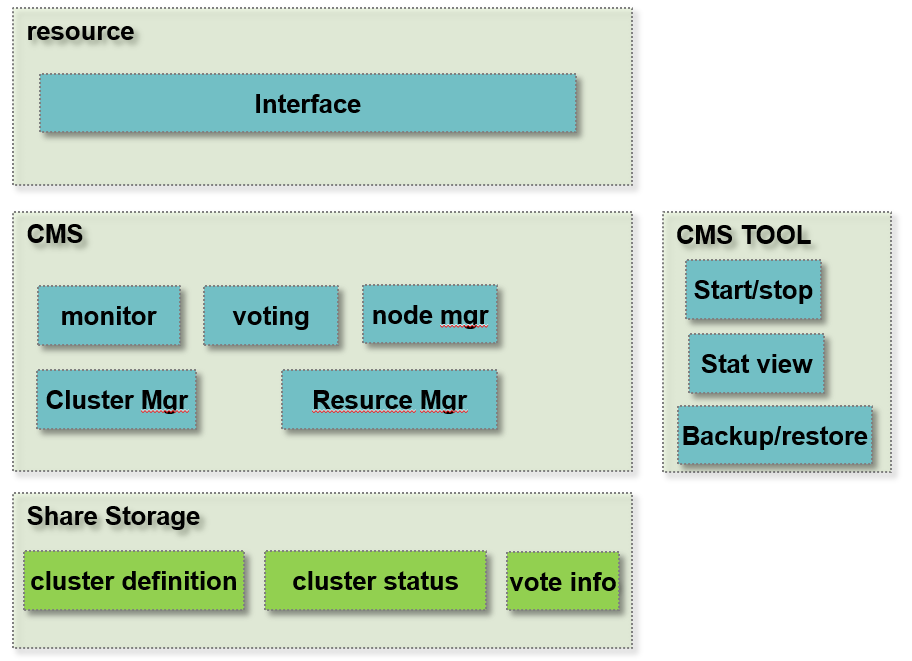

CMS分为四个模块：

1.  接口
    -   提供API接口供外部系统进行集群状态的查询
    -   资源注册、状态变更通知回调

2.  工具
    -   提供命令行工具
    -   集群定义管理：增加节点、删除节点、修改节点、节点查询
    -   集群资源定义管理：增加资源、修改资源、删除资源、资源查询
    -   集群管理：节点下线、节点上线
    -   集群信息查询：节点状态查询、节点资源状态查询

3.  共享存储
    -   共享存储需提供全局锁和IO读写能力
    -   集群的定义信息、状态信息、投票信息都持久化在共享存储上

4.  CMS Server
    -   提供资源监控、自动重拉、投票选举、通知、心跳等功能
    -   故障检测：支持Cantian进程故障、节点故障、网络故障、存储链路故障、存储故障的检测与处理
    -   协调集群内节点完成集群重构操作

### 故障切换

Cantian引擎是多写对等集群，在创建集群或者扩缩容前后需要在线上下线节点，日常运行中也可能有节点异常退出或者被脑裂隔离，故障切换特性用于处理这些计划内和计划外的场景。

#### 故障检测

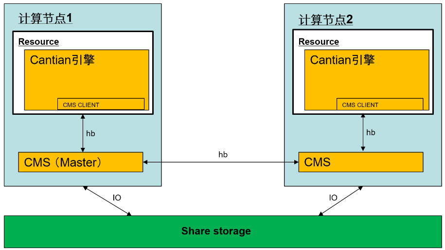

CMS进程监控本节点资源和全局资源状态，CMS进程之间有心跳保持连接状态；CMS主要支持Cantian进程故障、节点故障、网络故障、存储链路故障、存储故障的检测与处理。

1.  Cantian进程故障：
    1.  CMS Client启动时启动后台hb线程，定期向CMS Server发送心跳请求；
    2.  CMS Server连续收不到Cantian心跳，则判定Cantian进程故障。

2.  网络故障：
    1.  CMS Server启动时启动后台hb线程，定期向所有其它节点发送心跳请求；
    2.  CMS Server连续收不到另一个节点的心跳，则判定网络故障或者节点故障，进而触发脑裂仲裁机制选出新的可用集群。

3.  节点故障：
    1.  CMS Server启动时启动后台hb线程，定期向所有其它节点发送心跳请求；
    2.  CMS Server连续收不到另一个节点的心跳，则判定网络故障或者节点故障，进而触发脑裂仲裁机制选出新的可用集群。

4.  存储链路故障/存储故障：
    1.  CMS Server启动时启动后台检测线程，定期访问存储设备，维护跟存储设备之间的心跳；
    2.  CMS Server后台检测线程超过一定阈值收不到存储侧返回的IO，则判定存储故障或者存储链路故障；
    3.  判定存储侧故障则该节点Cantian进程退出；

#### 故障处理

CMS Server负责监控全局Cantian的状态，Cantian引擎实例从CMS获取集群状态，当集群中的实例发生变化时，触发Reform Cluster，驱动做Cantian引擎上下线恢复处理。

1.  **计划内上下线**

    对于计划内上下线，主要是节点正常启停，Reform Cluster主要完成

    1.  Remaster
        -   根据新的集群成员情况，调整分布算法函数，为新承担master职责分配相应map区
        -   将本机的不再承担master职责的map区释放

2.  **计划外下线**

    对于计划外下线，主要是Cantian进程故障、节点异常崩溃、或者网络隔离导致脑裂的处理等，Reform Cluster主要完成

    1.  Remaster
        -   根据新的集群成员情况，调整分布算法函数，为新承担master职责分配相应map区
        -   将Resource Catalog信息重新分布，如果原master故障，还需要从幸存实例内存构建
        -   将本机的不再承担master职责的map区释放

    2.  Recovery
        -   选取主恢复实例，快速扫描故障实例的redo，生成待恢复脏页列表recovery set
        -   根据recovery set的page id，通知其新master锁定该page
        -   再次扫描故障实例的redo，进行roll forward，被前滚到最新版本的page，通知新master释放锁并设置自己为owner
        -   触发checkpoint，并开始roll back

### 特性约束

1.  需要集群各节点时间保持一致
2.  任一节点不支持时间跳变的场景
3.  系统慢盘或者存储侧慢盘都有概率导致集群状态误判、RTO时间变长

## MySQL对接

Cantian引擎MySQL生态对接组件\(CTC, Cantian Connector\)负责支持Cantian引擎作为MySQL数据库的存储引擎插件，支持DDL、DML、事务等数据库功能，兼容MySQL\(InnoDB\)生态的应用。

### MySQL的对接原理

MySQL拥有插件式存储引擎体系结构，允许开发者根据MySQL预定义的存储引擎接口编写自定义的存储引擎。

Cantian引擎通过CTC插件以动态库+IPC通信的形式对接MySQL，加载后作为MySQL的默认存储引擎工作，Cantian引擎对MySQL原生代码无任何侵入修改。

MySQL SQL层与CTC通过MySQL预定义的hanlder/handlerton接口进行交互，CTC插件接收到MySQL SQL引擎调用存储引擎插件执行的请求，通过IPC模块以及对接层逻辑将请求转到Cantian引擎内核，CTC插件与Cantian引擎通信模块设计为统一接口，进程间IPC通信的模式。

由于Cantian和MySQL是各自独立运行的进程，因此一个Cantian引擎进程可以对接一至多个MySQL实例，不同实例间通过不同的IPC通道与Cantian引擎进行通信，CTC插件会维护实例的启停时集群资源的分配与释放。

在MySQL独立系统表的模式中，MySQL元数据仍通过InnoDB引擎存储与维护，但MySQL对元数据的修改操作会通过CTC与Cantian引擎广播到集群中存活的其他MySQL实例以保证集群的元数据一致性。广播过程中远端MySQL实例会使用对应权限的代理用户执行修改操作，从而保证集群执行语句时用户权限的一致性。

在MySQL共享系统表的模式中，MySQL的元数据对接到Cantian中，不再需要集群间的广播保证集群元数据一致性，详细见3.4章节。

MySQL与Cantian引擎集群架构如下图：

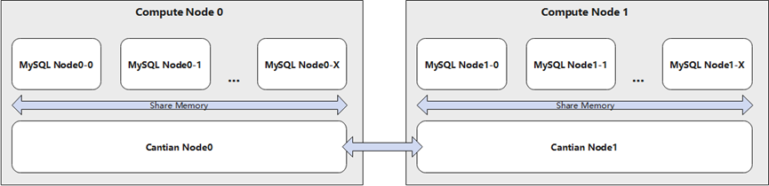

### MySQL的兼容性实现

Cantian引擎作为MySQL数据库的存储引擎插件，与MySQL原生默认存储引擎InnoDB引擎存在一定区别，在MySQL生态兼容方向上也做了许多工作，持续提升Cantian引擎MySQL生态兼容性可以减少应用改造成本、降低应用迁移难度。

通过MySQL SQL引擎层可以支持的功能和语法，Cantian引擎不做处理，解析和调用逻辑由SQL层控制，将其拆解为存储引擎可以识别的工作后由Cantian引擎层实际执行。InnoDB或通过存储引擎支持的功能，通过修改Cantian引擎对接层以及底层逻辑适配提升兼容性。

Cantian引擎高度兼容MySQL8.0版本的常用功能和语法，兼容方向大致分为以下几个方面：

-   SQL语法

    Cantian引擎支持包括SELECT/INSERT/UPDATE/DELETE的DML语法以及大部分DDL/DCL的语法。

-   量级规格

    量级规格包括最大库数量、最大表数量、最大分区数量、最大列数量、最大索引数量等数量限制以及最大行数据长度、最大命名长度、最大SQL长度等长度限制。

    其中Cantian引擎支持最大创建1024个数据库、单表最多创建32个索引、行数据最大支持64000字节长度、DDL语句长度限制126K，其他大部分规格均保持与MySQL一致。

-   数据类型

    Cantian引擎支持所有数值类型（包括整型、定点型、浮点型、比特型）、日期时间类型、字符类型、大对象类型、文本类型、枚举和集合类型的列字段。

    暂不支持空间地理数据类型，其他数据类型支持情况等于MySQL数据库。

-   函数与表达式

    Cantian引擎支持大部分常用的数学函数、字符串函数、锁定函数、窗口函数、聚合函数。

    Cantian引擎不支持空间分析函数、JSON函数和部分日期时间函数。

-   分区支持

    Cantian引擎支持一级分区和二级分区，一级分区支持List/List Columns/Range/Range Columns/Key/Hash分区，二级分区支持Key和Hash分区。

    Cantian引擎的分区类型支持情况等于MySQL数据库。

-   字符集支持

    Cantian引擎支持的字符集与比较规则如下：

    utf8mb4 - utf8mb4\_0900\_ai\_ci/utf8mb4\_0900\_bin/utf8mb4\_general\_ci/utf8mb4\_bin/utf8\_tolower\_ci

    binary - binary

    latin1 - latin1\_general\_ci/latin1\_general\_cs/latin1\_bin

    ascii - ascii\_general\_ci/ascii\_bin

    gbk - gbk\_chinese\_ci/gbk\_bin

    utf8/utf8mb3 - utf8\_general\_ci/utf8\_bin/utf8mb3\_general\_ci/utf8mb3\_general\_ci

    对于没有支持的字符集和字符序，可能会出现排序结果或查询结果不一致的情况。

### 特性约束

独立系统表存在如下约束，共享系统表不存在如下约束：

-   执行LOCK INSTANCE FOR BACKUP或FLUSH TABLE WITH READ LOCK后，集群不允许执行DDL语句。
-   修改MySQL系统数据库时，需要在集群中所有MySQL实例同步此操作。
-   不支持在MySQL系统表空间中执行DDL语句。
-   创建用户后，必须赋予该用户LOCK TABLES权限，才能进行集群DDL操作。

## 支持MySQL共享系统表

mysql8.0默认的系统表元数据存储引擎为innodb，Cantian作为一个存储引擎，也有其系统表元数据，修改MySQL初始化流程将系统表的存储引擎改为Cantian，使用Cantian引擎存放MySQL的元数据；具体涉及到以下4个系统库，information\_schema database下的表为视图和临时表，表定义放到Cantian上；mysql database下的表为核心表，表定义和数据都放到Cantian上；performance\_schema database为performance\_schema存储引擎管理的性能监控数据，表定义放到Cantian；sys database下除了sys\_config是表，其他都是视图，它们的定义都放到Cantian，sys\_config的数据也放到Cantian，相当于系统配置项所有MySQL实例共享。

### MySQL实例初始化与拉起

将mysql系统表元数据下放到Cantian引擎，集群中所有MySQL实例共享同一份系统表元数据，只需要一个实例完成系统表的创建工作，其它实例仅需要在Cantian读取系统表完成本地数据字典缓存的加载。

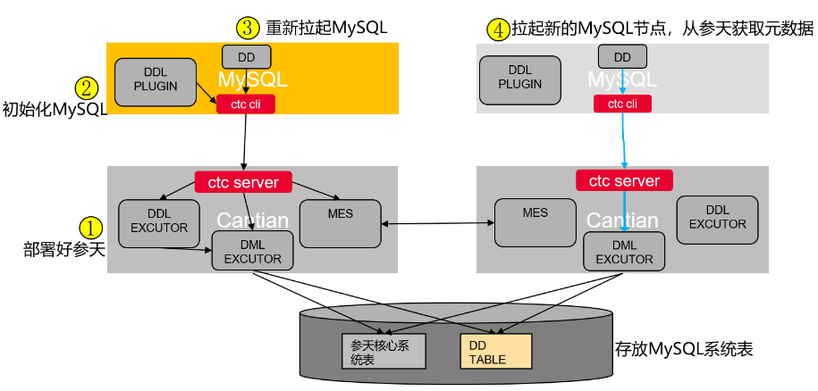

1.  部署好Cantian引擎集群，如果集群正在处于变更状态（节点加入或退出），此时初始化会失败，需要将Cantian引擎重新安装部署好再初始化拉起MySQL实例。
2.  MySQL实例初始化，创建系统库及其中的表，此时会将请求下发到Cantian，如果多个实例并发初始化，只有一个实例初始化成功。
3.  系统表创建成功后，初始化完成的MySQL实例做拉起操作，通过Cantian引擎读取共享的系统表数据，加载本地系统表缓存，完成拉起操作。
4.  其他等待初始化完成的MySQL实例做拉起操作，通过Cantian引擎读取共享的系统表数据，加载本地系统表缓存，完成拉起操作。

### 并发执行DDL

支持在任意节点对表执行DDL操作，具体的执行步骤如下：

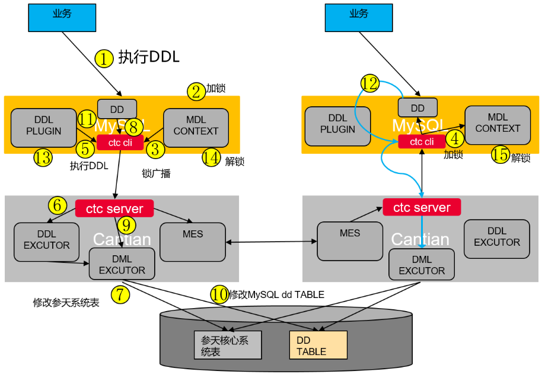

1.  业务执行DDL操作（操作用户，表，函数，存储过程，事件，资源组）；
2.  本地MySQL实例执行mdl加锁；
3.  对要操作的对象进行加X锁通知，MySQL通知Cantian适配层客户端，适配层客户端通知服务端，服务端利用Cantian间通信广播通知其他Cantian节点；
4.  其他Cantian节点的适配层服务端通知所有连接的客户端，适配层客户端调用对应的加锁函数对相应对象在远端MySQL实例加MDL锁；
5.  Cantian的DDL插件接收到DDL操作，发送消息到Cantian服务端；
6.  ctc server端调用Cantian的对应的DDL接口执行操作逻辑；
7.  Cantian的DDL修改对应的系统表，但不提交；
8.  MySQL调用DD的接口保存MySQL对应的元数据；
9.  由于DD的系统表是指定放到Cantian的存储引擎上，所以DD的保存操作会调用Cantian插件对应的DML接口；
10. Cantian内核像操作普通表一样操作DD的table，把MySQL的元数据写到Cantian的普通表上；
11. 发送DD元数据对象失效的消息到其他节点，只失效data dictionary的cache；
12. 其他节点接到失效消息可以调用（Dictionary\_client::invalidate）把cache对象失效掉，失效或者不存在的元数据对象DD会从系统表里加载；
13. 事务提交，Cantian的系统表和普通表（存放MySQL元数据）在同一个事务提交；
14. 本地MySQL实例释放MDL锁；
15. 远端MySQL实例释放MDL锁。

### 特性约束

MySQL共享系统表特性需要修改系统表的存储引擎为Cantian，同时涉及到MySQL源码的修改（这部分修改代码不包含在Cantian开源源码中）。

## 支持滚动升级

Cantian引擎支持集群离线方式进行升级（离线升级），也支持在线进行版本升级（滚动升级），可以保证版本升级不影响客户业务的连续性。

### 滚动升级方案

滚动升级时为了不影响客户业务连续性的目标前提下，利用Cantian引擎的集群多节点特性，对各个节点**轮流下线升级再上线**的方式进行升级，确保对用户业务的影响降到最低。

滚动升级一次下线升级一个节点，而离线升级是同时下线升级所有节点。

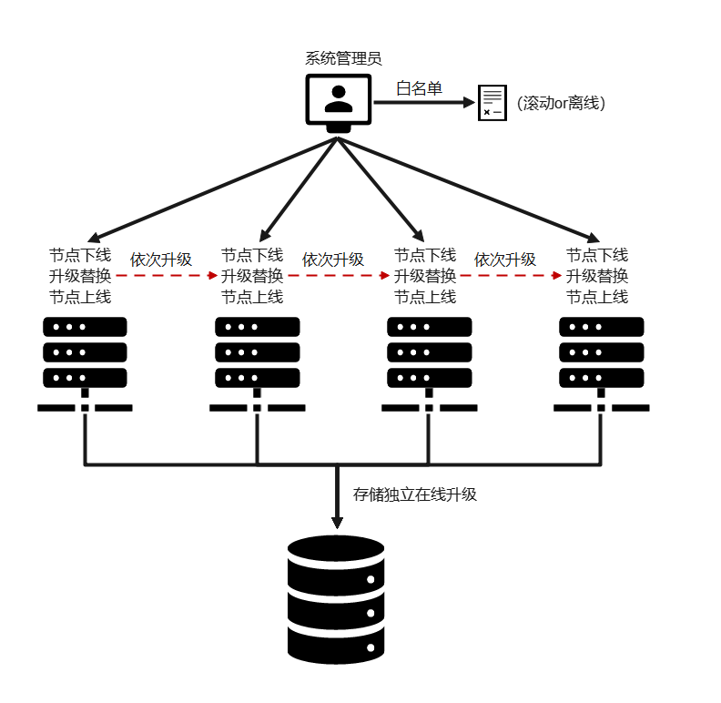

### 滚动升级操作流程

滚动升级大体步骤如下：

1.  **升级检查**：依次对各个节点进行检查，收集版本信息，汇总检查版本是否一致，并基于白名单和版本匹配名单对各个节点进行版本检查。
2.  **节点准备**：分发下载安装包，并备份老包和配置，校验解压新包。对集群进行数据在线备份（由用户指定备份路径，如指定路径空间不足，则备份失败返错）。同时设置升级状态，如果涉及到更新系统表，同时设置系统表更新标记；如果升级需要更新系统表，则提醒用户该升级操作在系统表更新之后无论是否完成升级提交都无法进行滚动回退。
3.  **升级节点**：下线节点，部署新包并以新包拉起，此时运行版本号是老版本号。
4.  **更新系统表**：更新第一个节点时，如果新版本涉及到系统表的更新，则完成系统表的更新，并删除标记文件。
5.  **升级验证**：所有节点完成升级后，验证升级是否成功。并可以选择是否结合客户业务进行验证功能。
6.  **升级提交**：完成升级提交，抬升持久化版本号和运行版本号。注意一旦提交后，不再允许版本回退。
    -   在滚动升级流程中，Cantian引擎集群的**状态**被划分为5个阶段（状态机变化如下图所示）：

        1.  **升级（rollup）**，即逐个节点进行升级的状态；
        2.  **回退（rolldown）**，节点升级失败后，用户可以选择进行重试或者回退，一般场景是在多次升级重试都失败后，选择升级回退。回退无需进行提交操作；
        3.  **升级就绪（prepared）**，集群中所有节点均升级成功后，设置集群状态为升级就绪状态；
        4.  **升级提交（commit）**，所有节点升级完成、用户对新版本业务满意后，执行升级提交，进入升级提交状态，只有状态为prepred时才进行升级提交；
        5.  **升级完成（normal）**，升级提交完成后，刷新集群升级状态为“normal”。

        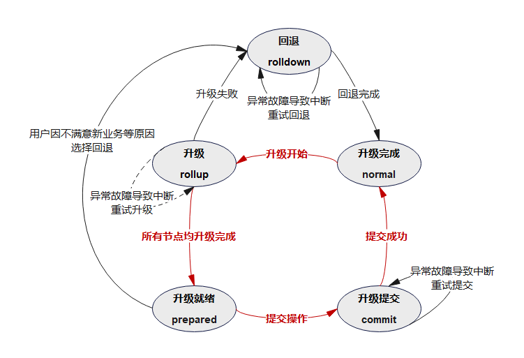

    -   滚动升级过程中的**故障处理**
        1.  单节点升级失败，节点升级失败后，用户可以选择进行升级重试或升级回退。
        2.  升级流程中断，遇到机房掉电等特殊场景可导致升级流程被异常中断，待服务恢复后，用户可以查询集群当前状态，并选择后续操作：
            1.  如果集群处于rollup状态，则可以重新发起升级流程；
            2.  如果集群处于rolldown状态，则可以重新发起回退流程；
            3.  如果集群处于prepare状态或者commit状态，则直接发起提交流程；
            4.  如果集群处于normal状态，界面显示升级成功。

        3.  故障兜底回退

            在滚动升级过程中，可能遭遇新版本存在潜在问题等极端场景，此时数据有可能出错，需进行离线降级处理，然后基于升级前的备份数据进行数据还原。具体操作步骤如下：

            -   对集群所有节点进行shutdown；
            -   对版本进行回退；
            -   对数据进行还原，采用升级时备份的数据进行数据库数据还原；
            -   基于旧版本拉起集群。

            注意此操作可能丢掉部分升级节点的业务数据。

### 离线升级

离线升级是会影响业务连续性的升级方式，离线升级一次性中断所有节点的业务，并将所有节点进行下线。待所有节点替换新包、重新部署拉起后（如升级需更新系统表，拉起首个节点时会触发系统表更新操作），执行升级提交操作，完成升级。在此之后，系统开始重新接收业务。

在离线升级过程中发生失败或故障，可以进行离线升级重试或离线回退。

### 特性约束

1.  一旦升级提交操作开始，不推荐执行回退操作。如果一定需要回退，则需要人工介入评估分析，通过升级前的备份数据进行离线回退。
2.  升级过程中需要对系统表进行更新的，更新系统表操作完成后，则不能再支持滚动回退操作，仅能升级前的备份数据进行离线回退。

## 备份功能

数据备份是容灾的基础。本特性旨在为Cantian引擎提供备份恢复功能，通过合理规划备份方式和备份频率，可以有效避免意外状况下的数据损失。当前Cantian引擎的数据备份方式分为逻辑备份和物理备份两种，逻辑备份通过MySQL引擎层导出数据库的数据进行存档，而物理备份则主要是通过Cantian引擎服务端直接拷贝数据库的数据文件。其中物理备份有全量备份和增量备份两种模式，在恢复时可以结合归档日志进行指定备份集全量恢复或指定时间点恢复（PITR恢复）。

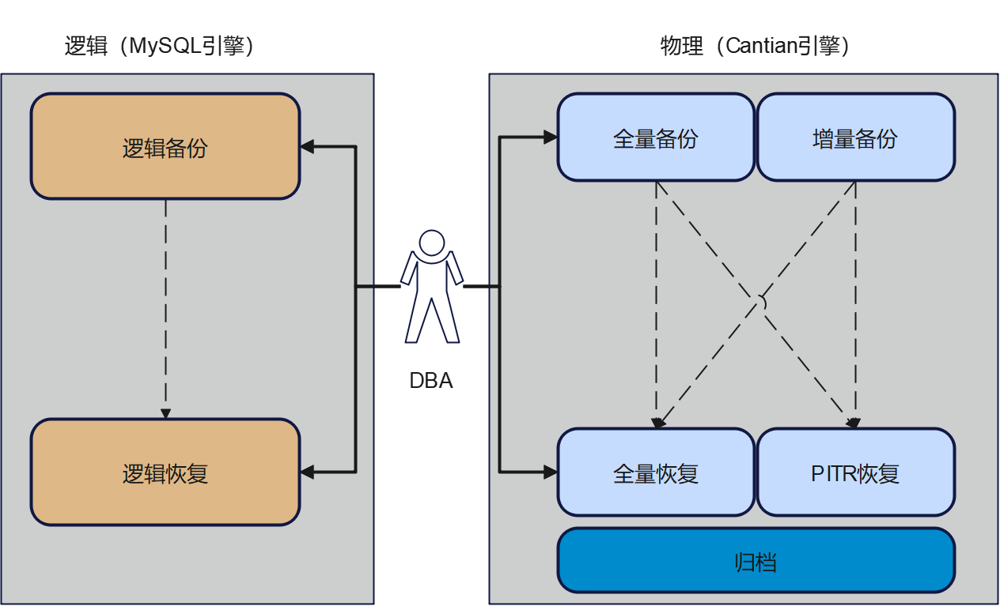

### 逻辑备份

逻辑备份可以将数据库下的所有表导出成SQL语句或者表格文本，逻辑恢复时再将文本格式的逻辑数据文件导入到数据库中。Cantian引擎对接MySQL生态，可以使用MySQL自带的开源逻辑备份工具MySQLdump，该工具主要通过select \* from table\_name来获取表的数据进而完成备份。整体架构中，Cantian引擎服务端作为存储引擎服务端，MySQL引擎通对接Cantian引擎服务端，用户对Cantian的操作全部通过MySQL的语法来实现，不涉及Cantian引擎的SQL语法，因此可以兼容MySQLdump的备份功能，实现跨数据库的导入导出。

### 物理备份

针对Cantian引擎的用户数据，通过拷贝存储层的控制文件、数据文件及日志文件（备份过程中产生的Redo日志）实现物理备份。Cantian引擎的物理备份是热备份，备份过程中不停止数据库运行但需要加备份锁，该备份锁不阻塞DML操作但会阻塞DDL操作，用来保证备份期间数据的一致性。

恢复时可以通过备份集的控制文件来获取数据库表空间等基础结构信息，使用备份的数据文件来恢复其内容，最后再通过回放备份的Redo日志来使数据文件内容保持一致性，从而实现数据库的完整恢复。相比于逻辑数据导出，物理备份是针对存储引擎持久化到存储设备的物理数据进行备份，备份出来的数据只能用于同一种存储引擎进行恢复。

Cantian引擎提供ctbackup备份恢复工具和ctsql客户端工具，可以连接Cantian引擎服务端，通过这两个工具可以向服务端下发命令。Cantian引擎服务端目前提供了物理备份能力和恢复能力，支持全量备份、增量备份、全量恢复、PITR恢复等功能。备份和恢复时可指定并发线程数，实现多线程并发读写文件，提高备份速度。

备份时可指定跳过数据坏块，避免因单个页面损坏导致备份失败，同时记录坏块信息，以便分析坏块数量、坏块原因和坏块修复方案。恢复时可通过指定的坏块修复策略对坏块进行修复，避免因部分页面损坏导致整个数据库不可用。

当MySQL与Cantian独立系统表时，物理备份需要额外备份MySQL引擎的元数据。使用MySQL开源备份工具xtrabackup进行备份即可。

Cantian引擎服务端的数据文件包含了所有的用户数据信息，数据量一般较大，为了节省备份流程占用时间和备份集占用磁盘空间，Cantian引擎在物理备份时有全量备份和增量备份两种模式可供选择，前者是全量拷贝所有数据页面，后者是增量拷贝跟上一个备份集数据有差异的数据页面。

#### 全量备份

Cantian引擎全量备份可备份指定时间点数据库在磁盘上的全量数据，在数据库异常情况下，用户可根据全量备份集对数据库的数据进行恢复。Cantian备份集中有四种类型的文件在备份开始后先后生成：

1.  控制文件，记录Cantian引擎一些重要元数据信息，包括表空间组成、恢复起始点、初始化时间等；
2.  数据文件，与表空间相对应，由大小相同的页面组成，包含表空间内的所有数据内容；
3.  归档文件，其中包括数据文件恢复到一致性所需要的Redo日志；
4.  backupset文件，记录此次备份集的相关信息。

由于备份期间不阻塞DML操作，可能存在产生脏页及脏页刷盘导致备份数据文件页面不一致的情况，因此在恢复时需要借助Redo日志来将数据文件从起始LSN点重放至一致性的结束LSN点，而不是简单地把数据再拷贝回去。相应的，Redo日志回放的起始LSN点和结束LSN点分别在备份数据文件前后获取，最终记录在backupset文件中供恢复时使用。除此之外，该起始LSN点还会随着备份集路径等此次备份的其他信息，在备份成功后记录到备份系统表中，该系统表每一行代表一次已完成的物理备份。

Redo日志在存储的空间中是循环写入的，在备份过程中，可能会产生覆盖而无法读取完整的在线日志。因此Cantian引擎实现了在线Redo日志归档的功能，可以定时或强制地从ulog中读出Redo日志形成归档文件，然后再通知ulog进行回收，需要备份时可直接拷贝归档文件而无须读在线Redo日志。

当MySQL与Cantian独立系统表时，因为MySQL引擎服务端只保留了少量的元数据信息，使用xtrabackup工具进行物理备份时不区分全量备份和增量备份，都采用全量备份的方式，直接形成MySQL备份集。

#### 增量备份

Cantian引擎增量备份可备份指定时间点与上次全量或增量备份时间点之间的增量差异数据，可以减少此次备份的数据量，在数据库异常情况下，用户可根据全量备份文件和增量备份文件进行数据恢复。增量备份整体流程和全量备份相同，差别在于备份数据文件时仅拷贝与上一次备份集有差异的数据页面，具体就是根据当前页面的LSN和上一个备份集的起始LSN过滤掉在此期间未更改过数据页面。该起始LSN点之前的所有数据页面都能在上一个备份集或者其依赖备份集中找到，从而可以避免重复备份。数据页面在修改时会记录新的LSN，而LSN在集群内是递增的，因此可以作为页面是否更改的依据。

增量备份分为差异增量备份和累积增量备份，两者的区别是依赖的备份集不同。差异增量备份依赖的是上一个备份集，该备份集可以是全量备份集或差异增量备份集。累积增量备份依赖的备份集只能是上一个全量备份集。两种增量备份都可以连续执行多次，每次都在锁依赖的备份集的基础上进行。使用增量备份集恢复时需要将依赖的一个全量备份集和一个或多个增量备份集依次恢复。这些所依赖的备份集路径在增量备份过程中从备份系统表中获取，然后记录到backupset文件中，在恢复时使用。需要注意的是，两种增量备份不能混用，当需要切换增量备份模式时，需先进行一下全量备份。

### 物理恢复

Cantian引擎物理备份的恢复有两种选择，一是全量恢复，实现将数据库数据恢复到备份集文件一致性的时间点，二是PITR恢复，实现将数据库数据恢复到备份集之后的指定时间点。物理备份恢复可以分为两个基本流程：

1.  restore流程主要是把备份的数据重新拷贝回去，根据指定备份集路径读取backupset文件，获取备份集的基础信息，使用其中记载的依赖备份集路径依次恢复每个备份集所有用户数据：首先恢复控制文件，再根据控制文件内容创建、删除或扩展数据文件，如果数据文件还存在则再使用其对应的备份数据文件进行恢复。归档日志文件只需要恢复最后一个备份集中的即可。
2.  recover流程主要是根据backupset文件中记录的恢复起始和结束信息，使用归档文件中的Redo日志把数据文件恢复到一个一致性的结束点。全量恢复和PITR恢复的区别就在于这个结束点，如果是全量恢复则默认恢复到指定备份集的结束LSN点即可；如果是PITR恢复，在恢复到该备份集的结束LSN点保证一致性后，还需要继续使用归档目录下的归档文件，回放其中Redo日志达到指定时间点时才停止。Redo日志中除了记录LSN外，还记录了SCN，而时间点可以根据控制文件中记录的数据库初始化时间转换成对应SCN，因此指定时间点也可以作为回放Redo日志的结束点。

当MySQL与Cantian独立系统表时，需要恢复MySQL引擎元数据，使用xtrabackup拷贝恢复MySQL引擎备份集元数据。PITR恢复时，还需要对逻辑Redo日志的DDL语句进行收集，用于MySQL引擎本地回放，由此将MySQL引擎备份集元数据和恢复后的Cantian引擎元数据进行同步，从而完成整个恢复流程。

### 辅助功能

-   支持查询备份集备份模式。可查询备份集是全量备份集、差异增备备份集或累积增量备份集，便于后续继续备份或进行恢复。
-   支持手动清理残留归档文件。可删除未被Cantian引擎管控的归档文件，节省存储空间，增加可留存的被管控归档文件数量。
-   备份支持进程故障场景断点续备。备份期间，若除备份节点外的其他节点发生故障，不影响备份流程。

### 特性约束

1.  备份过程中集群不允许执行DDL语句；
2.  MySQL引擎在容器部署，Cantian引擎在物理机部署时，本备份工具只能在物理机上执行；
3.  使用备份恢复功能需要开启归档功能；

