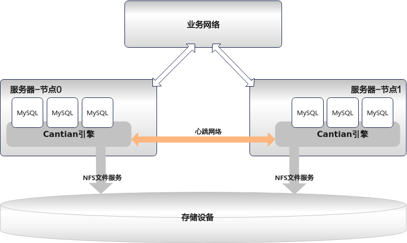
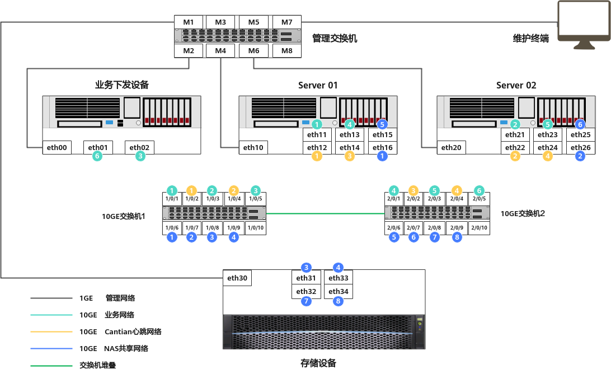
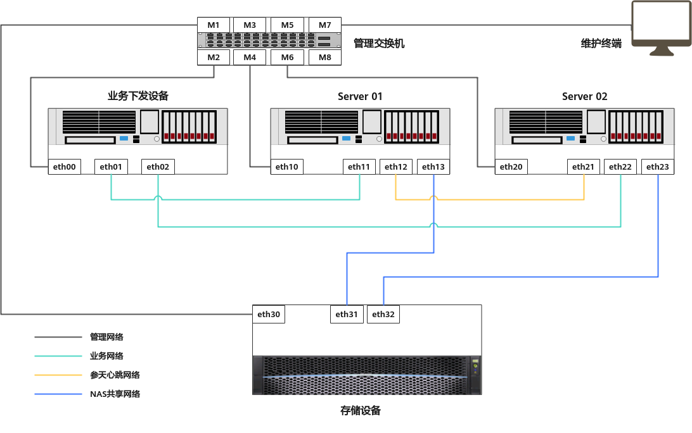

# 安装与卸载Cantian引擎<a name="ZH-CN_TOPIC_0000001850407141"></a>


## 安装前规划<a name="ZH-CN_TOPIC_0000001850327173"></a>

安装Cantian引擎前，请先完成软件和硬件的准备、以及相关的网络和存储规划。


### 组网规划<a name="ZH-CN_TOPIC_0000001803568378"></a>

介绍Cantian引擎规划的原则、硬件的基本配置和软件要求，以及存储设备所需配置的文件系统。

**规划原则<a name="zh-cn_topic_0000001779891302_section155871027274"></a>**

规划时，应确保为Cantian引擎规划了如下两个网络平面：

-   Cantian引擎心跳网络：用于部署Cantian引擎的不同数据库服务器之间进行通信。
-   NAS共享网络：进行存储的NAS共享、数据库服务器通过该网络对存储设备进行读写。

**图 1**  逻辑组网图<a name="zh-cn_topic_0000001779891302_fig1252163502417"></a>  


**硬件&软件准备<a name="zh-cn_topic_0000001779891302_section1954414863218"></a>**

请在规划时，准备好安装Cantian引擎的硬件基本配置和软件包。

**表 1**  硬件基本配置表

<a name="zh-cn_topic_0000001779891302_zh-cn_topic_0000001690212869_zh-cn_topic_0000001570546425_table12447637174618"></a>
<table><thead align="left"><tr id="zh-cn_topic_0000001779891302_zh-cn_topic_0000001690212869_zh-cn_topic_0000001570546425_row12448437114615"><th class="cellrowborder" valign="top" width="37.19371937193719%" id="mcps1.2.4.1.1"><p id="zh-cn_topic_0000001779891302_zh-cn_topic_0000001690212869_zh-cn_topic_0000001570546425_p6163124154816"><a name="zh-cn_topic_0000001779891302_zh-cn_topic_0000001690212869_zh-cn_topic_0000001570546425_p6163124154816"></a><a name="zh-cn_topic_0000001779891302_zh-cn_topic_0000001690212869_zh-cn_topic_0000001570546425_p6163124154816"></a>硬件</p>
</th>
<th class="cellrowborder" valign="top" width="25.58255825582558%" id="mcps1.2.4.1.2"><p id="zh-cn_topic_0000001779891302_zh-cn_topic_0000001690212869_zh-cn_topic_0000001570546425_p015165795820"><a name="zh-cn_topic_0000001779891302_zh-cn_topic_0000001690212869_zh-cn_topic_0000001570546425_p015165795820"></a><a name="zh-cn_topic_0000001779891302_zh-cn_topic_0000001690212869_zh-cn_topic_0000001570546425_p015165795820"></a>数量</p>
</th>
<th class="cellrowborder" valign="top" width="37.22372237223722%" id="mcps1.2.4.1.3"><p id="zh-cn_topic_0000001779891302_zh-cn_topic_0000001690212869_zh-cn_topic_0000001570546425_p415357135813"><a name="zh-cn_topic_0000001779891302_zh-cn_topic_0000001690212869_zh-cn_topic_0000001570546425_p415357135813"></a><a name="zh-cn_topic_0000001779891302_zh-cn_topic_0000001690212869_zh-cn_topic_0000001570546425_p415357135813"></a>备注</p>
</th>
</tr>
</thead>
<tbody><tr id="zh-cn_topic_0000001779891302_zh-cn_topic_0000001690212869_zh-cn_topic_0000001570546425_row10766533194814"><td class="cellrowborder" valign="top" width="37.19371937193719%" headers="mcps1.2.4.1.1 "><p id="zh-cn_topic_0000001779891302_zh-cn_topic_0000001690212869_zh-cn_topic_0000001570546425_p14190154554814"><a name="zh-cn_topic_0000001779891302_zh-cn_topic_0000001690212869_zh-cn_topic_0000001570546425_p14190154554814"></a><a name="zh-cn_topic_0000001779891302_zh-cn_topic_0000001690212869_zh-cn_topic_0000001570546425_p14190154554814"></a>X86服务器/ARM服务器</p>
</td>
<td class="cellrowborder" valign="top" width="25.58255825582558%" headers="mcps1.2.4.1.2 "><p id="zh-cn_topic_0000001779891302_zh-cn_topic_0000001690212869_zh-cn_topic_0000001570546425_p11907457489"><a name="zh-cn_topic_0000001779891302_zh-cn_topic_0000001690212869_zh-cn_topic_0000001570546425_p11907457489"></a><a name="zh-cn_topic_0000001779891302_zh-cn_topic_0000001690212869_zh-cn_topic_0000001570546425_p11907457489"></a>2</p>
</td>
<td class="cellrowborder" valign="top" width="37.22372237223722%" headers="mcps1.2.4.1.3 "><p id="zh-cn_topic_0000001779891302_zh-cn_topic_0000001690212869_zh-cn_topic_0000001570546425_p0190545164817"><a name="zh-cn_topic_0000001779891302_zh-cn_topic_0000001690212869_zh-cn_topic_0000001570546425_p0190545164817"></a><a name="zh-cn_topic_0000001779891302_zh-cn_topic_0000001690212869_zh-cn_topic_0000001570546425_p0190545164817"></a>数据库服务器（主机）</p>
</td>
</tr>
<tr id="zh-cn_topic_0000001779891302_row1633934111319"><td class="cellrowborder" valign="top" width="37.19371937193719%" headers="mcps1.2.4.1.1 "><p id="zh-cn_topic_0000001779891302_p19633173401313"><a name="zh-cn_topic_0000001779891302_p19633173401313"></a><a name="zh-cn_topic_0000001779891302_p19633173401313"></a>存储设备</p>
</td>
<td class="cellrowborder" valign="top" width="25.58255825582558%" headers="mcps1.2.4.1.2 "><p id="zh-cn_topic_0000001779891302_p0633334131319"><a name="zh-cn_topic_0000001779891302_p0633334131319"></a><a name="zh-cn_topic_0000001779891302_p0633334131319"></a>1</p>
</td>
<td class="cellrowborder" valign="top" width="37.22372237223722%" headers="mcps1.2.4.1.3 "><p id="zh-cn_topic_0000001779891302_p063383414133"><a name="zh-cn_topic_0000001779891302_p063383414133"></a><a name="zh-cn_topic_0000001779891302_p063383414133"></a>-</p>
</td>
</tr>
</tbody>
</table>

对于X86服务器/ARM服务器，推荐使用如下型号或者不低于如下型号性能CPU的服务器：

-   ARM：Kunpeng 920-4826/Kunpeng 920-6426
-   X86：Intel Xeon Gold 6248/Intel Xeon Gold 6348/Intel Xeon Gold 5218/Intel Xeon Gold 6230R

    对于X86服务器，若选择其他型号的CPU，请通过以下命令确认该CPU是否支持constant\_tsc特性，避免因CPU不支持constant\_tsc特性导致数据库服务器的时间精度无法保证。

    ```
    cat /proc/cpuinfo | grep -o constant_tsc | uniq
    ```

    -   若回显包含constant\_tsc字段，则该CPU支持constant\_tsc特性。
    -   若无回显，则该CPU不支持constant\_tsc特性。

**表 2**  软件配置表

<a name="zh-cn_topic_0000001779891302_zh-cn_topic_0000001690212869_zh-cn_topic_0000001570546425_table1834762113492"></a>
<table><thead align="left"><tr id="zh-cn_topic_0000001779891302_zh-cn_topic_0000001690212869_zh-cn_topic_0000001570546425_row17347821144910"><th class="cellrowborder" valign="top" width="50%" id="mcps1.2.3.1.1"><p id="zh-cn_topic_0000001779891302_zh-cn_topic_0000001690212869_zh-cn_topic_0000001570546425_p1212673314499"><a name="zh-cn_topic_0000001779891302_zh-cn_topic_0000001690212869_zh-cn_topic_0000001570546425_p1212673314499"></a><a name="zh-cn_topic_0000001779891302_zh-cn_topic_0000001690212869_zh-cn_topic_0000001570546425_p1212673314499"></a>软件</p>
</th>
<th class="cellrowborder" valign="top" width="50%" id="mcps1.2.3.1.2"><p id="zh-cn_topic_0000001779891302_zh-cn_topic_0000001690212869_zh-cn_topic_0000001570546425_p15883124020811"><a name="zh-cn_topic_0000001779891302_zh-cn_topic_0000001690212869_zh-cn_topic_0000001570546425_p15883124020811"></a><a name="zh-cn_topic_0000001779891302_zh-cn_topic_0000001690212869_zh-cn_topic_0000001570546425_p15883124020811"></a>配套版本</p>
</th>
</tr>
</thead>
<tbody><tr id="zh-cn_topic_0000001779891302_zh-cn_topic_0000001690212869_zh-cn_topic_0000001570546425_row03485215494"><td class="cellrowborder" valign="top" width="50%" headers="mcps1.2.3.1.1 "><p id="zh-cn_topic_0000001779891302_zh-cn_topic_0000001690212869_zh-cn_topic_0000001570546425_p19113150144916"><a name="zh-cn_topic_0000001779891302_zh-cn_topic_0000001690212869_zh-cn_topic_0000001570546425_p19113150144916"></a><a name="zh-cn_topic_0000001779891302_zh-cn_topic_0000001690212869_zh-cn_topic_0000001570546425_p19113150144916"></a>数据库操作系统</p>
</td>
<td class="cellrowborder" valign="top" width="50%" headers="mcps1.2.3.1.2 "><a name="zh-cn_topic_0000001779891302_zh-cn_topic_0000001690212869_zh-cn_topic_0000001570546425_ul123767162263"></a><a name="zh-cn_topic_0000001779891302_zh-cn_topic_0000001690212869_zh-cn_topic_0000001570546425_ul123767162263"></a><ul id="zh-cn_topic_0000001779891302_zh-cn_topic_0000001690212869_zh-cn_topic_0000001570546425_ul123767162263"><li>X86：CentOS-8.2.2004-x86_64-dvd1.iso</li><li>ARM：openEuler 2203 sp1</li></ul>
</td>
</tr>
<tr id="zh-cn_topic_0000001779891302_zh-cn_topic_0000001690212869_zh-cn_topic_0000001570546425_row934842118493"><td class="cellrowborder" valign="top" width="50%" headers="mcps1.2.3.1.1 "><p id="zh-cn_topic_0000001779891302_zh-cn_topic_0000001690212869_zh-cn_topic_0000001570546425_p181138500499"><a name="zh-cn_topic_0000001779891302_zh-cn_topic_0000001690212869_zh-cn_topic_0000001570546425_p181138500499"></a><a name="zh-cn_topic_0000001779891302_zh-cn_topic_0000001690212869_zh-cn_topic_0000001570546425_p181138500499"></a>数据库软件</p>
</td>
<td class="cellrowborder" valign="top" width="50%" headers="mcps1.2.3.1.2 "><p id="zh-cn_topic_0000001779891302_zh-cn_topic_0000001690212869_zh-cn_topic_0000001570546425_p71131450174917"><a name="zh-cn_topic_0000001779891302_zh-cn_topic_0000001690212869_zh-cn_topic_0000001570546425_p71131450174917"></a><a name="zh-cn_topic_0000001779891302_zh-cn_topic_0000001690212869_zh-cn_topic_0000001570546425_p71131450174917"></a>参见《编译指南》的“<a href="zh-cn_topic_0000001852743545.md">版本编译</a>”章节编译生成数据库软件。</p>
</td>
</tr>
</tbody>
</table>

对于ARM的“openEuler 2203 sp1”，请登录[OpenEuler](https://www.openeuler.org/zh/download/archive/detail/?version=openEuler%2022.03%20LTS%20SP1)网站，选择“AArch64”架构和“服务器”场景，下载软件包类型为“Offline Standard ISO”的软件包。若在安装数据库服务器时需要配置本地yum源，请在该页面同时下载软件包类型为“Offline Everything ISO”的软件包。

> **须知：** 
>-   安装Cantian引擎时，Cantian引擎将安装至路径“/dev/mapper/根目录”（例如：“/dev/mapper/centos-root”），且至少需要20GB空间。在安装数据库操作系统时，请为该路径预留足够的空间（用于安装Cantian引擎以及其他软件），避免因空间不足导致Cantian引擎安装失败。
>-   请确认操作系统上安装的是3.6.0以及之后版本的python。

**文件系统规划<a name="zh-cn_topic_0000001779891302_section168254503315"></a>**

安装Cantian引擎时，需要使用存储设备的4个文件系统，请为各个文件系统做好相关的容量规划。

**表 3**  文件系统分配表

<a name="zh-cn_topic_0000001779891302_zh-cn_topic_0000001690212893_zh-cn_topic_0000001519546530_table86641344117"></a>
<table><thead align="left"><tr id="zh-cn_topic_0000001779891302_zh-cn_topic_0000001690212893_zh-cn_topic_0000001519546530_row11664154151113"><th class="cellrowborder" valign="top" width="23.582358235823584%" id="mcps1.2.6.1.1"><p id="zh-cn_topic_0000001779891302_zh-cn_topic_0000001690212893_zh-cn_topic_0000001519546530_p8394195914414"><a name="zh-cn_topic_0000001779891302_zh-cn_topic_0000001690212893_zh-cn_topic_0000001519546530_p8394195914414"></a><a name="zh-cn_topic_0000001779891302_zh-cn_topic_0000001690212893_zh-cn_topic_0000001519546530_p8394195914414"></a>文件系统分类</p>
</th>
<th class="cellrowborder" valign="top" width="22.65226522652265%" id="mcps1.2.6.1.2"><p id="zh-cn_topic_0000001779891302_p153471334164618"><a name="zh-cn_topic_0000001779891302_p153471334164618"></a><a name="zh-cn_topic_0000001779891302_p153471334164618"></a>文件系统名称</p>
</th>
<th class="cellrowborder" valign="top" width="10.25102510251025%" id="mcps1.2.6.1.3"><p id="zh-cn_topic_0000001779891302_zh-cn_topic_0000001690212893_zh-cn_topic_0000001519546530_p6394145994119"><a name="zh-cn_topic_0000001779891302_zh-cn_topic_0000001690212893_zh-cn_topic_0000001519546530_p6394145994119"></a><a name="zh-cn_topic_0000001779891302_zh-cn_topic_0000001690212893_zh-cn_topic_0000001519546530_p6394145994119"></a>容量</p>
</th>
<th class="cellrowborder" valign="top" width="9.67096709670967%" id="mcps1.2.6.1.4"><p id="zh-cn_topic_0000001779891302_zh-cn_topic_0000001690212893_zh-cn_topic_0000001519546530_p1239411597413"><a name="zh-cn_topic_0000001779891302_zh-cn_topic_0000001690212893_zh-cn_topic_0000001519546530_p1239411597413"></a><a name="zh-cn_topic_0000001779891302_zh-cn_topic_0000001690212893_zh-cn_topic_0000001519546530_p1239411597413"></a>个数</p>
</th>
<th class="cellrowborder" valign="top" width="33.84338433843384%" id="mcps1.2.6.1.5"><p id="zh-cn_topic_0000001779891302_zh-cn_topic_0000001690212893_zh-cn_topic_0000001519546530_p93954599413"><a name="zh-cn_topic_0000001779891302_zh-cn_topic_0000001690212893_zh-cn_topic_0000001519546530_p93954599413"></a><a name="zh-cn_topic_0000001779891302_zh-cn_topic_0000001690212893_zh-cn_topic_0000001519546530_p93954599413"></a>功能</p>
</th>
</tr>
</thead>
<tbody><tr id="zh-cn_topic_0000001779891302_row854791014213"><td class="cellrowborder" valign="top" width="23.582358235823584%" headers="mcps1.2.6.1.1 "><p id="zh-cn_topic_0000001779891302_p45480104425"><a name="zh-cn_topic_0000001779891302_p45480104425"></a><a name="zh-cn_topic_0000001779891302_p45480104425"></a>storage_dbstore_fs</p>
</td>
<td class="cellrowborder" valign="top" width="22.65226522652265%" headers="mcps1.2.6.1.2 "><p id="zh-cn_topic_0000001779891302_p728318592509"><a name="zh-cn_topic_0000001779891302_p728318592509"></a><a name="zh-cn_topic_0000001779891302_p728318592509"></a>ctdb_dbstore_fs</p>
</td>
<td class="cellrowborder" valign="top" width="10.25102510251025%" headers="mcps1.2.6.1.3 "><p id="zh-cn_topic_0000001779891302_p16548101017422"><a name="zh-cn_topic_0000001779891302_p16548101017422"></a><a name="zh-cn_topic_0000001779891302_p16548101017422"></a>10TB</p>
</td>
<td class="cellrowborder" valign="top" width="9.67096709670967%" headers="mcps1.2.6.1.4 "><p id="zh-cn_topic_0000001779891302_p155481108428"><a name="zh-cn_topic_0000001779891302_p155481108428"></a><a name="zh-cn_topic_0000001779891302_p155481108428"></a>1</p>
</td>
<td class="cellrowborder" valign="top" width="33.84338433843384%" headers="mcps1.2.6.1.5 "><p id="zh-cn_topic_0000001779891302_p754811018429"><a name="zh-cn_topic_0000001779891302_p754811018429"></a><a name="zh-cn_topic_0000001779891302_p754811018429"></a>用于存储<span id="zh-cn_topic_0000001779891302_text969465883913"><a name="zh-cn_topic_0000001779891302_text969465883913"></a><a name="zh-cn_topic_0000001779891302_text969465883913"></a>Cantian引擎</span>数据的文件系统，容量根据实际业务规划配置。</p>
</td>
</tr>
<tr id="zh-cn_topic_0000001779891302_zh-cn_topic_0000001690212893_zh-cn_topic_0000001519546530_row11665154131119"><td class="cellrowborder" valign="top" width="23.582358235823584%" headers="mcps1.2.6.1.1 "><p id="zh-cn_topic_0000001779891302_zh-cn_topic_0000001690212893_zh-cn_topic_0000001519546530_p19951121111117"><a name="zh-cn_topic_0000001779891302_zh-cn_topic_0000001690212893_zh-cn_topic_0000001519546530_p19951121111117"></a><a name="zh-cn_topic_0000001779891302_zh-cn_topic_0000001690212893_zh-cn_topic_0000001519546530_p19951121111117"></a>storage_metadata_fs</p>
</td>
<td class="cellrowborder" valign="top" width="22.65226522652265%" headers="mcps1.2.6.1.2 "><p id="zh-cn_topic_0000001779891302_p14283125935010"><a name="zh-cn_topic_0000001779891302_p14283125935010"></a><a name="zh-cn_topic_0000001779891302_p14283125935010"></a>ctdb_metadata_fs</p>
</td>
<td class="cellrowborder" valign="top" width="10.25102510251025%" headers="mcps1.2.6.1.3 "><p id="zh-cn_topic_0000001779891302_zh-cn_topic_0000001690212893_zh-cn_topic_0000001519546530_p1695122111110"><a name="zh-cn_topic_0000001779891302_zh-cn_topic_0000001690212893_zh-cn_topic_0000001519546530_p1695122111110"></a><a name="zh-cn_topic_0000001779891302_zh-cn_topic_0000001690212893_zh-cn_topic_0000001519546530_p1695122111110"></a>1TB</p>
</td>
<td class="cellrowborder" valign="top" width="9.67096709670967%" headers="mcps1.2.6.1.4 "><p id="zh-cn_topic_0000001779891302_zh-cn_topic_0000001690212893_zh-cn_topic_0000001519546530_p4951621121114"><a name="zh-cn_topic_0000001779891302_zh-cn_topic_0000001690212893_zh-cn_topic_0000001519546530_p4951621121114"></a><a name="zh-cn_topic_0000001779891302_zh-cn_topic_0000001690212893_zh-cn_topic_0000001519546530_p4951621121114"></a>1</p>
</td>
<td class="cellrowborder" valign="top" width="33.84338433843384%" headers="mcps1.2.6.1.5 "><p id="zh-cn_topic_0000001779891302_zh-cn_topic_0000001690212893_zh-cn_topic_0000001519546530_p1095122181112"><a name="zh-cn_topic_0000001779891302_zh-cn_topic_0000001690212893_zh-cn_topic_0000001519546530_p1095122181112"></a><a name="zh-cn_topic_0000001779891302_zh-cn_topic_0000001690212893_zh-cn_topic_0000001519546530_p1095122181112"></a>用于存放MySQL元数据，容量根据实际业务规划配置。</p>
</td>
</tr>
<tr id="zh-cn_topic_0000001779891302_zh-cn_topic_0000001690212893_zh-cn_topic_0000001519546530_row13665154101113"><td class="cellrowborder" valign="top" width="23.582358235823584%" headers="mcps1.2.6.1.1 "><p id="zh-cn_topic_0000001779891302_zh-cn_topic_0000001690212893_zh-cn_topic_0000001519546530_p695162181119"><a name="zh-cn_topic_0000001779891302_zh-cn_topic_0000001690212893_zh-cn_topic_0000001519546530_p695162181119"></a><a name="zh-cn_topic_0000001779891302_zh-cn_topic_0000001690212893_zh-cn_topic_0000001519546530_p695162181119"></a>storage_share_fs</p>
</td>
<td class="cellrowborder" valign="top" width="22.65226522652265%" headers="mcps1.2.6.1.2 "><p id="zh-cn_topic_0000001779891302_p182834595507"><a name="zh-cn_topic_0000001779891302_p182834595507"></a><a name="zh-cn_topic_0000001779891302_p182834595507"></a>ctdb_share_fs</p>
</td>
<td class="cellrowborder" valign="top" width="10.25102510251025%" headers="mcps1.2.6.1.3 "><p id="zh-cn_topic_0000001779891302_zh-cn_topic_0000001690212893_zh-cn_topic_0000001519546530_p49519213115"><a name="zh-cn_topic_0000001779891302_zh-cn_topic_0000001690212893_zh-cn_topic_0000001519546530_p49519213115"></a><a name="zh-cn_topic_0000001779891302_zh-cn_topic_0000001690212893_zh-cn_topic_0000001519546530_p49519213115"></a>2GB</p>
</td>
<td class="cellrowborder" valign="top" width="9.67096709670967%" headers="mcps1.2.6.1.4 "><p id="zh-cn_topic_0000001779891302_zh-cn_topic_0000001690212893_zh-cn_topic_0000001519546530_p79513214117"><a name="zh-cn_topic_0000001779891302_zh-cn_topic_0000001690212893_zh-cn_topic_0000001519546530_p79513214117"></a><a name="zh-cn_topic_0000001779891302_zh-cn_topic_0000001690212893_zh-cn_topic_0000001519546530_p79513214117"></a>1</p>
</td>
<td class="cellrowborder" valign="top" width="33.84338433843384%" headers="mcps1.2.6.1.5 "><p id="zh-cn_topic_0000001779891302_zh-cn_topic_0000001690212893_zh-cn_topic_0000001519546530_p69562116116"><a name="zh-cn_topic_0000001779891302_zh-cn_topic_0000001690212893_zh-cn_topic_0000001519546530_p69562116116"></a><a name="zh-cn_topic_0000001779891302_zh-cn_topic_0000001690212893_zh-cn_topic_0000001519546530_p69562116116"></a>用于存放部署<span id="zh-cn_topic_0000001779891302_zh-cn_topic_0000001690212893_zh-cn_topic_0000001519546530_text536719475317"><a name="zh-cn_topic_0000001779891302_zh-cn_topic_0000001690212893_zh-cn_topic_0000001519546530_text536719475317"></a><a name="zh-cn_topic_0000001779891302_zh-cn_topic_0000001690212893_zh-cn_topic_0000001519546530_text536719475317"></a>Cantian引擎</span>的数据库服务器集群的预留信息，固定2GB大小。</p>
</td>
</tr>
<tr id="zh-cn_topic_0000001779891302_zh-cn_topic_0000001690212893_zh-cn_topic_0000001519546530_row96651848111"><td class="cellrowborder" valign="top" width="23.582358235823584%" headers="mcps1.2.6.1.1 "><p id="zh-cn_topic_0000001779891302_zh-cn_topic_0000001690212893_zh-cn_topic_0000001519546530_p149616217112"><a name="zh-cn_topic_0000001779891302_zh-cn_topic_0000001690212893_zh-cn_topic_0000001519546530_p149616217112"></a><a name="zh-cn_topic_0000001779891302_zh-cn_topic_0000001690212893_zh-cn_topic_0000001519546530_p149616217112"></a>storage_archive_fs</p>
</td>
<td class="cellrowborder" valign="top" width="22.65226522652265%" headers="mcps1.2.6.1.2 "><p id="zh-cn_topic_0000001779891302_p52831759175020"><a name="zh-cn_topic_0000001779891302_p52831759175020"></a><a name="zh-cn_topic_0000001779891302_p52831759175020"></a>ctdb_archive_fs</p>
</td>
<td class="cellrowborder" valign="top" width="10.25102510251025%" headers="mcps1.2.6.1.3 "><p id="zh-cn_topic_0000001779891302_zh-cn_topic_0000001690212893_zh-cn_topic_0000001519546530_p596221161118"><a name="zh-cn_topic_0000001779891302_zh-cn_topic_0000001690212893_zh-cn_topic_0000001519546530_p596221161118"></a><a name="zh-cn_topic_0000001779891302_zh-cn_topic_0000001690212893_zh-cn_topic_0000001519546530_p596221161118"></a>2TB</p>
</td>
<td class="cellrowborder" valign="top" width="9.67096709670967%" headers="mcps1.2.6.1.4 "><p id="zh-cn_topic_0000001779891302_zh-cn_topic_0000001690212893_zh-cn_topic_0000001519546530_p20968213117"><a name="zh-cn_topic_0000001779891302_zh-cn_topic_0000001690212893_zh-cn_topic_0000001519546530_p20968213117"></a><a name="zh-cn_topic_0000001779891302_zh-cn_topic_0000001690212893_zh-cn_topic_0000001519546530_p20968213117"></a>1</p>
</td>
<td class="cellrowborder" valign="top" width="33.84338433843384%" headers="mcps1.2.6.1.5 "><p id="zh-cn_topic_0000001779891302_zh-cn_topic_0000001690212893_zh-cn_topic_0000001519546530_p139632112111"><a name="zh-cn_topic_0000001779891302_zh-cn_topic_0000001690212893_zh-cn_topic_0000001519546530_p139632112111"></a><a name="zh-cn_topic_0000001779891302_zh-cn_topic_0000001690212893_zh-cn_topic_0000001519546530_p139632112111"></a>用于存放归档日志和binlog文件，其中归档日志和binlog文件分别占用50%的空间，建议根据归档日志保留时长及业务量综合评估文件系统大小。</p>
</td>
</tr>
</tbody>
</table>

> **说明：** 
>此处的文件系统名称和容量仅作为样例进行展示，规划时，请根据实际情况进行设置。

### 规划样例<a name="ZH-CN_TOPIC_0000001803728150"></a>

在有条件的情况下，建议采取交换机冗余连接的组网方式，提升网络的可靠性。同时，设备也支持直接连接的方式进行组网。


#### 规划样例（交换机组网）<a name="ZH-CN_TOPIC_0000001850407145"></a>

本节以通过交换机实现冗余连接的组网方式为样例进行介绍，实际规划时请根据需要进行调整。

**组网规划<a name="zh-cn_topic_0000001780380972_section1194324019416"></a>**

通过使用双交换机、组成不同环路的方式形成冗余连接，同时使用10GE端口组成Cantian引擎心跳网络和NAS共享网络。

**图 1**  组网规划<a name="zh-cn_topic_0000001780380972_fig1252163502417"></a>  


> **说明：** 
>通过不同颜色和序号的图标表示不同端口间的线缆连接。例如，Server 01的“eth12”端口和10GE交换机1的“1/0/2”端口使用同一颜色的序号“1”进行了标注，表示组网时，应使用线缆将上述两个端口进行连接。

**硬件准备<a name="zh-cn_topic_0000001780380972_section18631529135612"></a>**

组网中使用的硬件设备，应具有足够数目的10GE端口用于完成组网。

**表 1**  硬件配置表

<a name="zh-cn_topic_0000001780380972_zh-cn_topic_0000001690212869_zh-cn_topic_0000001570546425_table12447637174618"></a>
<table><thead align="left"><tr id="zh-cn_topic_0000001780380972_zh-cn_topic_0000001690212869_zh-cn_topic_0000001570546425_row12448437114615"><th class="cellrowborder" valign="top" width="26.939999999999998%" id="mcps1.2.5.1.1"><p id="zh-cn_topic_0000001780380972_zh-cn_topic_0000001690212869_zh-cn_topic_0000001570546425_p6163124154816"><a name="zh-cn_topic_0000001780380972_zh-cn_topic_0000001690212869_zh-cn_topic_0000001570546425_p6163124154816"></a><a name="zh-cn_topic_0000001780380972_zh-cn_topic_0000001690212869_zh-cn_topic_0000001570546425_p6163124154816"></a>硬件类别</p>
</th>
<th class="cellrowborder" valign="top" width="30.880000000000003%" id="mcps1.2.5.1.2"><p id="zh-cn_topic_0000001780380972_zh-cn_topic_0000001690212869_zh-cn_topic_0000001570546425_p715135711588"><a name="zh-cn_topic_0000001780380972_zh-cn_topic_0000001690212869_zh-cn_topic_0000001570546425_p715135711588"></a><a name="zh-cn_topic_0000001780380972_zh-cn_topic_0000001690212869_zh-cn_topic_0000001570546425_p715135711588"></a>最低端口数目要求</p>
</th>
<th class="cellrowborder" valign="top" width="17.18%" id="mcps1.2.5.1.3"><p id="zh-cn_topic_0000001780380972_zh-cn_topic_0000001690212869_zh-cn_topic_0000001570546425_p015165795820"><a name="zh-cn_topic_0000001780380972_zh-cn_topic_0000001690212869_zh-cn_topic_0000001570546425_p015165795820"></a><a name="zh-cn_topic_0000001780380972_zh-cn_topic_0000001690212869_zh-cn_topic_0000001570546425_p015165795820"></a>数量</p>
</th>
<th class="cellrowborder" valign="top" width="25%" id="mcps1.2.5.1.4"><p id="zh-cn_topic_0000001780380972_zh-cn_topic_0000001690212869_zh-cn_topic_0000001570546425_p415357135813"><a name="zh-cn_topic_0000001780380972_zh-cn_topic_0000001690212869_zh-cn_topic_0000001570546425_p415357135813"></a><a name="zh-cn_topic_0000001780380972_zh-cn_topic_0000001690212869_zh-cn_topic_0000001570546425_p415357135813"></a>备注</p>
</th>
</tr>
</thead>
<tbody><tr id="zh-cn_topic_0000001780380972_zh-cn_topic_0000001690212869_zh-cn_topic_0000001570546425_row10766533194814"><td class="cellrowborder" valign="top" width="26.939999999999998%" headers="mcps1.2.5.1.1 "><p id="zh-cn_topic_0000001780380972_zh-cn_topic_0000001690212869_zh-cn_topic_0000001570546425_p14190154554814"><a name="zh-cn_topic_0000001780380972_zh-cn_topic_0000001690212869_zh-cn_topic_0000001570546425_p14190154554814"></a><a name="zh-cn_topic_0000001780380972_zh-cn_topic_0000001690212869_zh-cn_topic_0000001570546425_p14190154554814"></a>X86服务器/ARM服务器</p>
</td>
<td class="cellrowborder" valign="top" width="30.880000000000003%" headers="mcps1.2.5.1.2 "><p id="zh-cn_topic_0000001780380972_p206596442092"><a name="zh-cn_topic_0000001780380972_p206596442092"></a><a name="zh-cn_topic_0000001780380972_p206596442092"></a>6个10GE端口</p>
</td>
<td class="cellrowborder" valign="top" width="17.18%" headers="mcps1.2.5.1.3 "><p id="zh-cn_topic_0000001780380972_zh-cn_topic_0000001690212869_zh-cn_topic_0000001570546425_p11907457489"><a name="zh-cn_topic_0000001780380972_zh-cn_topic_0000001690212869_zh-cn_topic_0000001570546425_p11907457489"></a><a name="zh-cn_topic_0000001780380972_zh-cn_topic_0000001690212869_zh-cn_topic_0000001570546425_p11907457489"></a>2</p>
</td>
<td class="cellrowborder" valign="top" width="25%" headers="mcps1.2.5.1.4 "><p id="zh-cn_topic_0000001780380972_zh-cn_topic_0000001690212869_zh-cn_topic_0000001570546425_p0190545164817"><a name="zh-cn_topic_0000001780380972_zh-cn_topic_0000001690212869_zh-cn_topic_0000001570546425_p0190545164817"></a><a name="zh-cn_topic_0000001780380972_zh-cn_topic_0000001690212869_zh-cn_topic_0000001570546425_p0190545164817"></a>数据库主机（服务器）</p>
</td>
</tr>
<tr id="zh-cn_topic_0000001780380972_row1633934111319"><td class="cellrowborder" valign="top" width="26.939999999999998%" headers="mcps1.2.5.1.1 "><p id="zh-cn_topic_0000001780380972_p19633173401313"><a name="zh-cn_topic_0000001780380972_p19633173401313"></a><a name="zh-cn_topic_0000001780380972_p19633173401313"></a>存储设备</p>
</td>
<td class="cellrowborder" valign="top" width="30.880000000000003%" headers="mcps1.2.5.1.2 "><p id="zh-cn_topic_0000001780380972_p46334346133"><a name="zh-cn_topic_0000001780380972_p46334346133"></a><a name="zh-cn_topic_0000001780380972_p46334346133"></a>2个10GE端口</p>
</td>
<td class="cellrowborder" valign="top" width="17.18%" headers="mcps1.2.5.1.3 "><p id="zh-cn_topic_0000001780380972_p0633334131319"><a name="zh-cn_topic_0000001780380972_p0633334131319"></a><a name="zh-cn_topic_0000001780380972_p0633334131319"></a>1</p>
</td>
<td class="cellrowborder" valign="top" width="25%" headers="mcps1.2.5.1.4 "><p id="zh-cn_topic_0000001780380972_p063383414133"><a name="zh-cn_topic_0000001780380972_p063383414133"></a><a name="zh-cn_topic_0000001780380972_p063383414133"></a>-</p>
</td>
</tr>
<tr id="zh-cn_topic_0000001780380972_zh-cn_topic_0000001690212869_zh-cn_topic_0000001570546425_row1444983711469"><td class="cellrowborder" valign="top" width="26.939999999999998%" headers="mcps1.2.5.1.1 "><p id="zh-cn_topic_0000001780380972_p0190845144811"><a name="zh-cn_topic_0000001780380972_p0190845144811"></a><a name="zh-cn_topic_0000001780380972_p0190845144811"></a>业务交换机</p>
</td>
<td class="cellrowborder" valign="top" width="30.880000000000003%" headers="mcps1.2.5.1.2 "><p id="zh-cn_topic_0000001780380972_p16190144594812"><a name="zh-cn_topic_0000001780380972_p16190144594812"></a><a name="zh-cn_topic_0000001780380972_p16190144594812"></a>9个10GE端口</p>
</td>
<td class="cellrowborder" valign="top" width="17.18%" headers="mcps1.2.5.1.3 "><p id="zh-cn_topic_0000001780380972_p6190545114814"><a name="zh-cn_topic_0000001780380972_p6190545114814"></a><a name="zh-cn_topic_0000001780380972_p6190545114814"></a>2</p>
</td>
<td class="cellrowborder" valign="top" width="25%" headers="mcps1.2.5.1.4 "><p id="zh-cn_topic_0000001780380972_p4191145124815"><a name="zh-cn_topic_0000001780380972_p4191145124815"></a><a name="zh-cn_topic_0000001780380972_p4191145124815"></a>堆叠部署，例如：CE6857交换机</p>
</td>
</tr>
</tbody>
</table>

**服务器地址规划<a name="zh-cn_topic_0000001780380972_zh-cn_topic_0000001690293657_zh-cn_topic_0000001519386558_section16225163610514"></a>**

对服务器地址的规划，包含业务网络、Cantian引擎心跳网络和NAS共享网络的地址规划。

> **说明：** 
>-   业务网络和Cantian引擎心跳网络需要跨接口模块组Bond，使用Bond4模式。
>-   [表2](#zh-cn_topic_0000001780380972_table9267104317188)、[表3](#zh-cn_topic_0000001780380972_table8643164617188)和[表4](#zh-cn_topic_0000001780380972_table331465013188)中“主机”和“物理网口”使用的是[图1](#zh-cn_topic_0000001780380972_fig1252163502417)中的设备和端口名。
>-   请对[表2](#zh-cn_topic_0000001780380972_table9267104317188)、[表3](#zh-cn_topic_0000001780380972_table8643164617188)和[表4](#zh-cn_topic_0000001780380972_table331465013188)中分配的不同VLAN的网络进行网络隔离：相同VLAN的网络使用同一网段，不同VLAN的网络不得使用相同的网段。
>-   [表2](#zh-cn_topic_0000001780380972_table9267104317188)、[表3](#zh-cn_topic_0000001780380972_table8643164617188)和[表4](#zh-cn_topic_0000001780380972_table331465013188)的主机、物理网口、绑定网口、VLAN、IP地址和掩码仅为样例进行说明，实际规划时请根据需要进行调整。配置时，请以实际规划为准。

-   业务网络：用作向数据库服务器提供业务，该网络的地址规划如[表2](#zh-cn_topic_0000001780380972_table9267104317188)所示。

    **表 2**  业务网络地址规划

    <a name="zh-cn_topic_0000001780380972_table9267104317188"></a>
    <table><thead align="left"><tr id="zh-cn_topic_0000001780380972_row326813436187"><th class="cellrowborder" valign="top" width="16.07%" id="mcps1.2.7.1.1"><p id="zh-cn_topic_0000001780380972_p132681143141814"><a name="zh-cn_topic_0000001780380972_p132681143141814"></a><a name="zh-cn_topic_0000001780380972_p132681143141814"></a>主机</p>
    </th>
    <th class="cellrowborder" valign="top" width="15.06%" id="mcps1.2.7.1.2"><p id="zh-cn_topic_0000001780380972_p72681343121817"><a name="zh-cn_topic_0000001780380972_p72681343121817"></a><a name="zh-cn_topic_0000001780380972_p72681343121817"></a>物理网口</p>
    </th>
    <th class="cellrowborder" valign="top" width="18.52%" id="mcps1.2.7.1.3"><p id="zh-cn_topic_0000001780380972_p1826844371816"><a name="zh-cn_topic_0000001780380972_p1826844371816"></a><a name="zh-cn_topic_0000001780380972_p1826844371816"></a>绑定网口</p>
    </th>
    <th class="cellrowborder" valign="top" width="14.95%" id="mcps1.2.7.1.4"><p id="zh-cn_topic_0000001780380972_p152681543151810"><a name="zh-cn_topic_0000001780380972_p152681543151810"></a><a name="zh-cn_topic_0000001780380972_p152681543151810"></a>VLAN</p>
    </th>
    <th class="cellrowborder" valign="top" width="17.7%" id="mcps1.2.7.1.5"><p id="zh-cn_topic_0000001780380972_p5268743141810"><a name="zh-cn_topic_0000001780380972_p5268743141810"></a><a name="zh-cn_topic_0000001780380972_p5268743141810"></a>IP地址</p>
    </th>
    <th class="cellrowborder" valign="top" width="17.7%" id="mcps1.2.7.1.6"><p id="zh-cn_topic_0000001780380972_p8268343131810"><a name="zh-cn_topic_0000001780380972_p8268343131810"></a><a name="zh-cn_topic_0000001780380972_p8268343131810"></a>掩码</p>
    </th>
    </tr>
    </thead>
    <tbody><tr id="zh-cn_topic_0000001780380972_row19268164317186"><td class="cellrowborder" valign="top" width="16.07%" headers="mcps1.2.7.1.1 "><p id="zh-cn_topic_0000001780380972_p6268143171811"><a name="zh-cn_topic_0000001780380972_p6268143171811"></a><a name="zh-cn_topic_0000001780380972_p6268143171811"></a>server01</p>
    </td>
    <td class="cellrowborder" valign="top" width="15.06%" headers="mcps1.2.7.1.2 "><p id="zh-cn_topic_0000001780380972_p11268204316186"><a name="zh-cn_topic_0000001780380972_p11268204316186"></a><a name="zh-cn_topic_0000001780380972_p11268204316186"></a>eth11</p>
    <p id="zh-cn_topic_0000001780380972_p153515191201"><a name="zh-cn_topic_0000001780380972_p153515191201"></a><a name="zh-cn_topic_0000001780380972_p153515191201"></a>eth13</p>
    </td>
    <td class="cellrowborder" valign="top" width="18.52%" headers="mcps1.2.7.1.3 "><p id="zh-cn_topic_0000001780380972_p182681543151811"><a name="zh-cn_topic_0000001780380972_p182681543151811"></a><a name="zh-cn_topic_0000001780380972_p182681543151811"></a>bussiness_bond</p>
    </td>
    <td class="cellrowborder" valign="top" width="14.95%" headers="mcps1.2.7.1.4 "><p id="zh-cn_topic_0000001780380972_p19268124316181"><a name="zh-cn_topic_0000001780380972_p19268124316181"></a><a name="zh-cn_topic_0000001780380972_p19268124316181"></a>10</p>
    </td>
    <td class="cellrowborder" valign="top" width="17.7%" headers="mcps1.2.7.1.5 "><p id="zh-cn_topic_0000001780380972_p4268114331819"><a name="zh-cn_topic_0000001780380972_p4268114331819"></a><a name="zh-cn_topic_0000001780380972_p4268114331819"></a>192.168.10.3</p>
    </td>
    <td class="cellrowborder" valign="top" width="17.7%" headers="mcps1.2.7.1.6 "><p id="zh-cn_topic_0000001780380972_p142686438181"><a name="zh-cn_topic_0000001780380972_p142686438181"></a><a name="zh-cn_topic_0000001780380972_p142686438181"></a>255.255.255.0</p>
    </td>
    </tr>
    <tr id="zh-cn_topic_0000001780380972_row626884301817"><td class="cellrowborder" valign="top" width="16.07%" headers="mcps1.2.7.1.1 "><p id="zh-cn_topic_0000001780380972_p126894361813"><a name="zh-cn_topic_0000001780380972_p126894361813"></a><a name="zh-cn_topic_0000001780380972_p126894361813"></a>server02</p>
    </td>
    <td class="cellrowborder" valign="top" width="15.06%" headers="mcps1.2.7.1.2 "><p id="zh-cn_topic_0000001780380972_p2269043121818"><a name="zh-cn_topic_0000001780380972_p2269043121818"></a><a name="zh-cn_topic_0000001780380972_p2269043121818"></a>eth21</p>
    <p id="zh-cn_topic_0000001780380972_p1487052982020"><a name="zh-cn_topic_0000001780380972_p1487052982020"></a><a name="zh-cn_topic_0000001780380972_p1487052982020"></a>eth23</p>
    </td>
    <td class="cellrowborder" valign="top" width="18.52%" headers="mcps1.2.7.1.3 "><p id="zh-cn_topic_0000001780380972_p142691043151815"><a name="zh-cn_topic_0000001780380972_p142691043151815"></a><a name="zh-cn_topic_0000001780380972_p142691043151815"></a>bussiness_bond</p>
    </td>
    <td class="cellrowborder" valign="top" width="14.95%" headers="mcps1.2.7.1.4 "><p id="zh-cn_topic_0000001780380972_p102691643201812"><a name="zh-cn_topic_0000001780380972_p102691643201812"></a><a name="zh-cn_topic_0000001780380972_p102691643201812"></a>10</p>
    </td>
    <td class="cellrowborder" valign="top" width="17.7%" headers="mcps1.2.7.1.5 "><p id="zh-cn_topic_0000001780380972_p42691243141810"><a name="zh-cn_topic_0000001780380972_p42691243141810"></a><a name="zh-cn_topic_0000001780380972_p42691243141810"></a>192.168.10.4</p>
    </td>
    <td class="cellrowborder" valign="top" width="17.7%" headers="mcps1.2.7.1.6 "><p id="zh-cn_topic_0000001780380972_p626974311188"><a name="zh-cn_topic_0000001780380972_p626974311188"></a><a name="zh-cn_topic_0000001780380972_p626974311188"></a>255.255.255.0</p>
    </td>
    </tr>
    </tbody>
    </table>

-   Cantian引擎心跳网络：用作部署Cantian引擎的数据库服务器间通信，该网络的地址规划如[表3](#zh-cn_topic_0000001780380972_table8643164617188)所示。

    **表 3**  Cantian引擎心跳网络地址规划

    <a name="zh-cn_topic_0000001780380972_table8643164617188"></a>
    <table><thead align="left"><tr id="zh-cn_topic_0000001780380972_row9644346181820"><th class="cellrowborder" valign="top" width="16.31%" id="mcps1.2.7.1.1"><p id="zh-cn_topic_0000001780380972_p12644846151820"><a name="zh-cn_topic_0000001780380972_p12644846151820"></a><a name="zh-cn_topic_0000001780380972_p12644846151820"></a>主机</p>
    </th>
    <th class="cellrowborder" valign="top" width="14.82%" id="mcps1.2.7.1.2"><p id="zh-cn_topic_0000001780380972_p864474618189"><a name="zh-cn_topic_0000001780380972_p864474618189"></a><a name="zh-cn_topic_0000001780380972_p864474618189"></a>物理网口</p>
    </th>
    <th class="cellrowborder" valign="top" width="18.52%" id="mcps1.2.7.1.3"><p id="zh-cn_topic_0000001780380972_p1164484613186"><a name="zh-cn_topic_0000001780380972_p1164484613186"></a><a name="zh-cn_topic_0000001780380972_p1164484613186"></a>绑定网口</p>
    </th>
    <th class="cellrowborder" valign="top" width="14.95%" id="mcps1.2.7.1.4"><p id="zh-cn_topic_0000001780380972_p4644184631811"><a name="zh-cn_topic_0000001780380972_p4644184631811"></a><a name="zh-cn_topic_0000001780380972_p4644184631811"></a>VLAN</p>
    </th>
    <th class="cellrowborder" valign="top" width="17.7%" id="mcps1.2.7.1.5"><p id="zh-cn_topic_0000001780380972_p16644146111816"><a name="zh-cn_topic_0000001780380972_p16644146111816"></a><a name="zh-cn_topic_0000001780380972_p16644146111816"></a>IP地址</p>
    </th>
    <th class="cellrowborder" valign="top" width="17.7%" id="mcps1.2.7.1.6"><p id="zh-cn_topic_0000001780380972_p1564474618183"><a name="zh-cn_topic_0000001780380972_p1564474618183"></a><a name="zh-cn_topic_0000001780380972_p1564474618183"></a>掩码</p>
    </th>
    </tr>
    </thead>
    <tbody><tr id="zh-cn_topic_0000001780380972_row4645104661815"><td class="cellrowborder" valign="top" width="16.31%" headers="mcps1.2.7.1.1 "><p id="zh-cn_topic_0000001780380972_p116451446161817"><a name="zh-cn_topic_0000001780380972_p116451446161817"></a><a name="zh-cn_topic_0000001780380972_p116451446161817"></a>server01</p>
    </td>
    <td class="cellrowborder" valign="top" width="14.82%" headers="mcps1.2.7.1.2 "><p id="zh-cn_topic_0000001780380972_p16451846121813"><a name="zh-cn_topic_0000001780380972_p16451846121813"></a><a name="zh-cn_topic_0000001780380972_p16451846121813"></a>eth12</p>
    <p id="zh-cn_topic_0000001780380972_p1767110558231"><a name="zh-cn_topic_0000001780380972_p1767110558231"></a><a name="zh-cn_topic_0000001780380972_p1767110558231"></a>eth14</p>
    </td>
    <td class="cellrowborder" valign="top" width="18.52%" headers="mcps1.2.7.1.3 "><p id="zh-cn_topic_0000001780380972_p46459469187"><a name="zh-cn_topic_0000001780380972_p46459469187"></a><a name="zh-cn_topic_0000001780380972_p46459469187"></a>cantian_bond</p>
    </td>
    <td class="cellrowborder" valign="top" width="14.95%" headers="mcps1.2.7.1.4 "><p id="zh-cn_topic_0000001780380972_p9645144681819"><a name="zh-cn_topic_0000001780380972_p9645144681819"></a><a name="zh-cn_topic_0000001780380972_p9645144681819"></a>20</p>
    </td>
    <td class="cellrowborder" valign="top" width="17.7%" headers="mcps1.2.7.1.5 "><p id="zh-cn_topic_0000001780380972_p864524691815"><a name="zh-cn_topic_0000001780380972_p864524691815"></a><a name="zh-cn_topic_0000001780380972_p864524691815"></a>192.168.20.2</p>
    </td>
    <td class="cellrowborder" valign="top" width="17.7%" headers="mcps1.2.7.1.6 "><p id="zh-cn_topic_0000001780380972_p116451746151811"><a name="zh-cn_topic_0000001780380972_p116451746151811"></a><a name="zh-cn_topic_0000001780380972_p116451746151811"></a>255.255.255.0</p>
    </td>
    </tr>
    <tr id="zh-cn_topic_0000001780380972_row364514469183"><td class="cellrowborder" valign="top" width="16.31%" headers="mcps1.2.7.1.1 "><p id="zh-cn_topic_0000001780380972_p4645144613183"><a name="zh-cn_topic_0000001780380972_p4645144613183"></a><a name="zh-cn_topic_0000001780380972_p4645144613183"></a>server02</p>
    </td>
    <td class="cellrowborder" valign="top" width="14.82%" headers="mcps1.2.7.1.2 "><p id="zh-cn_topic_0000001780380972_p1564674615188"><a name="zh-cn_topic_0000001780380972_p1564674615188"></a><a name="zh-cn_topic_0000001780380972_p1564674615188"></a>eth22</p>
    <p id="zh-cn_topic_0000001780380972_p15199194162412"><a name="zh-cn_topic_0000001780380972_p15199194162412"></a><a name="zh-cn_topic_0000001780380972_p15199194162412"></a>eth24</p>
    </td>
    <td class="cellrowborder" valign="top" width="18.52%" headers="mcps1.2.7.1.3 "><p id="zh-cn_topic_0000001780380972_p06467465189"><a name="zh-cn_topic_0000001780380972_p06467465189"></a><a name="zh-cn_topic_0000001780380972_p06467465189"></a>cantian_bond</p>
    </td>
    <td class="cellrowborder" valign="top" width="14.95%" headers="mcps1.2.7.1.4 "><p id="zh-cn_topic_0000001780380972_p36468469187"><a name="zh-cn_topic_0000001780380972_p36468469187"></a><a name="zh-cn_topic_0000001780380972_p36468469187"></a>20</p>
    </td>
    <td class="cellrowborder" valign="top" width="17.7%" headers="mcps1.2.7.1.5 "><p id="zh-cn_topic_0000001780380972_p10646846121814"><a name="zh-cn_topic_0000001780380972_p10646846121814"></a><a name="zh-cn_topic_0000001780380972_p10646846121814"></a>192.168.20.3</p>
    </td>
    <td class="cellrowborder" valign="top" width="17.7%" headers="mcps1.2.7.1.6 "><p id="zh-cn_topic_0000001780380972_p86461466184"><a name="zh-cn_topic_0000001780380972_p86461466184"></a><a name="zh-cn_topic_0000001780380972_p86461466184"></a>255.255.255.0</p>
    </td>
    </tr>
    </tbody>
    </table>

-   NAS共享网络：用作共享存储NAS共享，该网络的地址规划如[表4](#zh-cn_topic_0000001780380972_table331465013188)所示。

    **表 4**  NAS共享网络地址规划

    <a name="zh-cn_topic_0000001780380972_table331465013188"></a>
    <table><thead align="left"><tr id="zh-cn_topic_0000001780380972_row1431495011811"><th class="cellrowborder" valign="top" width="16.650000000000002%" id="mcps1.2.7.1.1"><p id="zh-cn_topic_0000001780380972_p13314155091820"><a name="zh-cn_topic_0000001780380972_p13314155091820"></a><a name="zh-cn_topic_0000001780380972_p13314155091820"></a>主机</p>
    </th>
    <th class="cellrowborder" valign="top" width="14.81%" id="mcps1.2.7.1.2"><p id="zh-cn_topic_0000001780380972_p2314050171816"><a name="zh-cn_topic_0000001780380972_p2314050171816"></a><a name="zh-cn_topic_0000001780380972_p2314050171816"></a>物理网口</p>
    </th>
    <th class="cellrowborder" valign="top" width="18.19%" id="mcps1.2.7.1.3"><p id="zh-cn_topic_0000001780380972_p4314195061810"><a name="zh-cn_topic_0000001780380972_p4314195061810"></a><a name="zh-cn_topic_0000001780380972_p4314195061810"></a>绑定网口</p>
    </th>
    <th class="cellrowborder" valign="top" width="14.95%" id="mcps1.2.7.1.4"><p id="zh-cn_topic_0000001780380972_p1131415081818"><a name="zh-cn_topic_0000001780380972_p1131415081818"></a><a name="zh-cn_topic_0000001780380972_p1131415081818"></a>VLAN</p>
    </th>
    <th class="cellrowborder" valign="top" width="17.7%" id="mcps1.2.7.1.5"><p id="zh-cn_topic_0000001780380972_p11314150101816"><a name="zh-cn_topic_0000001780380972_p11314150101816"></a><a name="zh-cn_topic_0000001780380972_p11314150101816"></a>IP地址</p>
    </th>
    <th class="cellrowborder" valign="top" width="17.7%" id="mcps1.2.7.1.6"><p id="zh-cn_topic_0000001780380972_p331416503183"><a name="zh-cn_topic_0000001780380972_p331416503183"></a><a name="zh-cn_topic_0000001780380972_p331416503183"></a>掩码</p>
    </th>
    </tr>
    </thead>
    <tbody><tr id="zh-cn_topic_0000001780380972_row1631655061815"><td class="cellrowborder" valign="top" width="16.650000000000002%" headers="mcps1.2.7.1.1 "><p id="zh-cn_topic_0000001780380972_p1131705020185"><a name="zh-cn_topic_0000001780380972_p1131705020185"></a><a name="zh-cn_topic_0000001780380972_p1131705020185"></a>server01</p>
    </td>
    <td class="cellrowborder" valign="top" width="14.81%" headers="mcps1.2.7.1.2 "><p id="zh-cn_topic_0000001780380972_p031711503186"><a name="zh-cn_topic_0000001780380972_p031711503186"></a><a name="zh-cn_topic_0000001780380972_p031711503186"></a>eth15</p>
    <p id="zh-cn_topic_0000001780380972_p101519484254"><a name="zh-cn_topic_0000001780380972_p101519484254"></a><a name="zh-cn_topic_0000001780380972_p101519484254"></a>eth16</p>
    </td>
    <td class="cellrowborder" valign="top" width="18.19%" headers="mcps1.2.7.1.3 "><p id="zh-cn_topic_0000001780380972_p17317125041810"><a name="zh-cn_topic_0000001780380972_p17317125041810"></a><a name="zh-cn_topic_0000001780380972_p17317125041810"></a>storage_bond</p>
    </td>
    <td class="cellrowborder" valign="top" width="14.95%" headers="mcps1.2.7.1.4 "><p id="zh-cn_topic_0000001780380972_p14317650161816"><a name="zh-cn_topic_0000001780380972_p14317650161816"></a><a name="zh-cn_topic_0000001780380972_p14317650161816"></a>77</p>
    </td>
    <td class="cellrowborder" valign="top" width="17.7%" headers="mcps1.2.7.1.5 "><p id="zh-cn_topic_0000001780380972_p16317205071816"><a name="zh-cn_topic_0000001780380972_p16317205071816"></a><a name="zh-cn_topic_0000001780380972_p16317205071816"></a>172.16.77.4</p>
    </td>
    <td class="cellrowborder" valign="top" width="17.7%" headers="mcps1.2.7.1.6 "><p id="zh-cn_topic_0000001780380972_p163171750111813"><a name="zh-cn_topic_0000001780380972_p163171750111813"></a><a name="zh-cn_topic_0000001780380972_p163171750111813"></a>255.255.255.0</p>
    </td>
    </tr>
    <tr id="zh-cn_topic_0000001780380972_row82231225142511"><td class="cellrowborder" valign="top" width="16.650000000000002%" headers="mcps1.2.7.1.1 "><p id="zh-cn_topic_0000001780380972_p102101525162516"><a name="zh-cn_topic_0000001780380972_p102101525162516"></a><a name="zh-cn_topic_0000001780380972_p102101525162516"></a>server01</p>
    </td>
    <td class="cellrowborder" valign="top" width="14.81%" headers="mcps1.2.7.1.2 "><p id="zh-cn_topic_0000001780380972_p0210142514251"><a name="zh-cn_topic_0000001780380972_p0210142514251"></a><a name="zh-cn_topic_0000001780380972_p0210142514251"></a>eth25</p>
    <p id="zh-cn_topic_0000001780380972_p01695501250"><a name="zh-cn_topic_0000001780380972_p01695501250"></a><a name="zh-cn_topic_0000001780380972_p01695501250"></a>eth26</p>
    </td>
    <td class="cellrowborder" valign="top" width="18.19%" headers="mcps1.2.7.1.3 "><p id="zh-cn_topic_0000001780380972_p0210142516253"><a name="zh-cn_topic_0000001780380972_p0210142516253"></a><a name="zh-cn_topic_0000001780380972_p0210142516253"></a>storage_bond</p>
    </td>
    <td class="cellrowborder" valign="top" width="14.95%" headers="mcps1.2.7.1.4 "><p id="zh-cn_topic_0000001780380972_p4210152520256"><a name="zh-cn_topic_0000001780380972_p4210152520256"></a><a name="zh-cn_topic_0000001780380972_p4210152520256"></a>77</p>
    </td>
    <td class="cellrowborder" valign="top" width="17.7%" headers="mcps1.2.7.1.5 "><p id="zh-cn_topic_0000001780380972_p1210142512516"><a name="zh-cn_topic_0000001780380972_p1210142512516"></a><a name="zh-cn_topic_0000001780380972_p1210142512516"></a>172.16.77.5</p>
    </td>
    <td class="cellrowborder" valign="top" width="17.7%" headers="mcps1.2.7.1.6 "><p id="zh-cn_topic_0000001780380972_p13210112532518"><a name="zh-cn_topic_0000001780380972_p13210112532518"></a><a name="zh-cn_topic_0000001780380972_p13210112532518"></a>255.255.255.0</p>
    </td>
    </tr>
    </tbody>
    </table>

**存储NAS共享网络地址规划<a name="zh-cn_topic_0000001780380972_section3947135102914"></a>**

> **说明：** 
>-   NAS共享网络使用10GE端口，配置接口模块内的绑定和跨接口模块的漂移组。
>-   物理网口名使用组网图中名字，配置时以实际网口名为准。
>-   [表5](#zh-cn_topic_0000001780380972_zh-cn_topic_0000001690293657_zh-cn_topic_0000001519386558_table1023015165416)中“物理端口”使用的是[图1](#zh-cn_topic_0000001780380972_fig1252163502417)中的端口名。
>-   请对[表5](#zh-cn_topic_0000001780380972_zh-cn_topic_0000001690293657_zh-cn_topic_0000001519386558_table1023015165416)中分配的不同VLAN的网络进行网络隔离：相同VLAN的网络使用同一网段，不同VLAN的网络不得使用相同的网段。
>-   此处规划的4个逻辑端口，可分别挂载到绑定网口bond\_nas\_1或bond\_nas\_2上，但同一逻辑端口不能同时挂载到两个绑定网口上。此处以将lgc\_nas\_1和lgc\_nas\_2挂载到bond\_nas\_1、lgc\_nas\_3和lgc\_nas\_4挂载到bond\_nas\_2为例。
>-   [表5](#zh-cn_topic_0000001780380972_zh-cn_topic_0000001690293657_zh-cn_topic_0000001519386558_table1023015165416)中的物理端口、绑定网口、逻辑端口、VLAN、IP地址、掩码和DNS侦听仅为样例进行说明，实际规划时请根据需要进行调整。配置时，请以实际规划为准。

**表 5**  存储NAS共享网络地址规划

<a name="zh-cn_topic_0000001780380972_zh-cn_topic_0000001690293657_zh-cn_topic_0000001519386558_table1023015165416"></a>
<table><thead align="left"><tr id="zh-cn_topic_0000001780380972_zh-cn_topic_0000001690293657_zh-cn_topic_0000001519386558_row523013161546"><th class="cellrowborder" valign="top" width="16.666666666666664%" id="mcps1.2.7.1.1"><p id="zh-cn_topic_0000001780380972_zh-cn_topic_0000001690293657_zh-cn_topic_0000001519386558_p523728175819"><a name="zh-cn_topic_0000001780380972_zh-cn_topic_0000001690293657_zh-cn_topic_0000001519386558_p523728175819"></a><a name="zh-cn_topic_0000001780380972_zh-cn_topic_0000001690293657_zh-cn_topic_0000001519386558_p523728175819"></a>物理端口</p>
</th>
<th class="cellrowborder" valign="top" width="16.666666666666664%" id="mcps1.2.7.1.2"><p id="zh-cn_topic_0000001780380972_zh-cn_topic_0000001690293657_zh-cn_topic_0000001519386558_p15238158115812"><a name="zh-cn_topic_0000001780380972_zh-cn_topic_0000001690293657_zh-cn_topic_0000001519386558_p15238158115812"></a><a name="zh-cn_topic_0000001780380972_zh-cn_topic_0000001690293657_zh-cn_topic_0000001519386558_p15238158115812"></a>绑定网口</p>
</th>
<th class="cellrowborder" valign="top" width="17.276544691061787%" id="mcps1.2.7.1.3"><p id="zh-cn_topic_0000001780380972_zh-cn_topic_0000001690293657_zh-cn_topic_0000001519386558_p13238128135814"><a name="zh-cn_topic_0000001780380972_zh-cn_topic_0000001690293657_zh-cn_topic_0000001519386558_p13238128135814"></a><a name="zh-cn_topic_0000001780380972_zh-cn_topic_0000001690293657_zh-cn_topic_0000001519386558_p13238128135814"></a>逻辑端口</p>
</th>
<th class="cellrowborder" valign="top" width="15.376924615076984%" id="mcps1.2.7.1.4"><p id="zh-cn_topic_0000001780380972_zh-cn_topic_0000001690293657_zh-cn_topic_0000001519386558_p1238178115813"><a name="zh-cn_topic_0000001780380972_zh-cn_topic_0000001690293657_zh-cn_topic_0000001519386558_p1238178115813"></a><a name="zh-cn_topic_0000001780380972_zh-cn_topic_0000001690293657_zh-cn_topic_0000001519386558_p1238178115813"></a>VLAN</p>
</th>
<th class="cellrowborder" valign="top" width="16.886622675464906%" id="mcps1.2.7.1.5"><p id="zh-cn_topic_0000001780380972_zh-cn_topic_0000001690293657_zh-cn_topic_0000001519386558_p142385816584"><a name="zh-cn_topic_0000001780380972_zh-cn_topic_0000001690293657_zh-cn_topic_0000001519386558_p142385816584"></a><a name="zh-cn_topic_0000001780380972_zh-cn_topic_0000001690293657_zh-cn_topic_0000001519386558_p142385816584"></a>IP地址</p>
</th>
<th class="cellrowborder" valign="top" width="17.12657468506299%" id="mcps1.2.7.1.6"><p id="zh-cn_topic_0000001780380972_zh-cn_topic_0000001690293657_zh-cn_topic_0000001519386558_p1023838125816"><a name="zh-cn_topic_0000001780380972_zh-cn_topic_0000001690293657_zh-cn_topic_0000001519386558_p1023838125816"></a><a name="zh-cn_topic_0000001780380972_zh-cn_topic_0000001690293657_zh-cn_topic_0000001519386558_p1023838125816"></a>掩码</p>
</th>
</tr>
</thead>
<tbody><tr id="zh-cn_topic_0000001780380972_zh-cn_topic_0000001690293657_zh-cn_topic_0000001519386558_row172321916441"><td class="cellrowborder" valign="top" width="16.666666666666664%" headers="mcps1.2.7.1.1 "><p id="zh-cn_topic_0000001780380972_zh-cn_topic_0000001690293657_zh-cn_topic_0000001519386558_p733713112613"><a name="zh-cn_topic_0000001780380972_zh-cn_topic_0000001690293657_zh-cn_topic_0000001519386558_p733713112613"></a><a name="zh-cn_topic_0000001780380972_zh-cn_topic_0000001690293657_zh-cn_topic_0000001519386558_p733713112613"></a>eth31</p>
</td>
<td class="cellrowborder" valign="top" width="16.666666666666664%" headers="mcps1.2.7.1.2 "><p id="zh-cn_topic_0000001780380972_zh-cn_topic_0000001690293657_zh-cn_topic_0000001519386558_p18176513567"><a name="zh-cn_topic_0000001780380972_zh-cn_topic_0000001690293657_zh-cn_topic_0000001519386558_p18176513567"></a><a name="zh-cn_topic_0000001780380972_zh-cn_topic_0000001690293657_zh-cn_topic_0000001519386558_p18176513567"></a>bond_nas_1</p>
</td>
<td class="cellrowborder" valign="top" width="17.276544691061787%" headers="mcps1.2.7.1.3 "><p id="zh-cn_topic_0000001780380972_zh-cn_topic_0000001690293657_zh-cn_topic_0000001519386558_p1495317141862"><a name="zh-cn_topic_0000001780380972_zh-cn_topic_0000001690293657_zh-cn_topic_0000001519386558_p1495317141862"></a><a name="zh-cn_topic_0000001780380972_zh-cn_topic_0000001690293657_zh-cn_topic_0000001519386558_p1495317141862"></a>lgc_nas_1</p>
</td>
<td class="cellrowborder" valign="top" width="15.376924615076984%" headers="mcps1.2.7.1.4 "><p id="zh-cn_topic_0000001780380972_zh-cn_topic_0000001690293657_zh-cn_topic_0000001519386558_p207061317768"><a name="zh-cn_topic_0000001780380972_zh-cn_topic_0000001690293657_zh-cn_topic_0000001519386558_p207061317768"></a><a name="zh-cn_topic_0000001780380972_zh-cn_topic_0000001690293657_zh-cn_topic_0000001519386558_p207061317768"></a>77</p>
</td>
<td class="cellrowborder" valign="top" width="16.886622675464906%" headers="mcps1.2.7.1.5 "><p id="zh-cn_topic_0000001780380972_zh-cn_topic_0000001690293657_zh-cn_topic_0000001519386558_p57272197620"><a name="zh-cn_topic_0000001780380972_zh-cn_topic_0000001690293657_zh-cn_topic_0000001519386558_p57272197620"></a><a name="zh-cn_topic_0000001780380972_zh-cn_topic_0000001690293657_zh-cn_topic_0000001519386558_p57272197620"></a>172.16.77.2</p>
</td>
<td class="cellrowborder" valign="top" width="17.12657468506299%" headers="mcps1.2.7.1.6 "><p id="zh-cn_topic_0000001780380972_zh-cn_topic_0000001690293657_zh-cn_topic_0000001519386558_p338016221261"><a name="zh-cn_topic_0000001780380972_zh-cn_topic_0000001690293657_zh-cn_topic_0000001519386558_p338016221261"></a><a name="zh-cn_topic_0000001780380972_zh-cn_topic_0000001690293657_zh-cn_topic_0000001519386558_p338016221261"></a>255.255.255.0</p>
</td>
</tr>
<tr id="zh-cn_topic_0000001780380972_zh-cn_topic_0000001690293657_zh-cn_topic_0000001519386558_row75051054310"><td class="cellrowborder" valign="top" width="16.666666666666664%" headers="mcps1.2.7.1.1 "><p id="zh-cn_topic_0000001780380972_zh-cn_topic_0000001690293657_zh-cn_topic_0000001519386558_p18681151015317"><a name="zh-cn_topic_0000001780380972_zh-cn_topic_0000001690293657_zh-cn_topic_0000001519386558_p18681151015317"></a><a name="zh-cn_topic_0000001780380972_zh-cn_topic_0000001690293657_zh-cn_topic_0000001519386558_p18681151015317"></a>eth32</p>
</td>
<td class="cellrowborder" valign="top" width="16.666666666666664%" headers="mcps1.2.7.1.2 "><p id="zh-cn_topic_0000001780380972_p12660831183020"><a name="zh-cn_topic_0000001780380972_p12660831183020"></a><a name="zh-cn_topic_0000001780380972_p12660831183020"></a>bond_nas_1</p>
</td>
<td class="cellrowborder" valign="top" width="17.276544691061787%" headers="mcps1.2.7.1.3 "><p id="zh-cn_topic_0000001780380972_p1019862393120"><a name="zh-cn_topic_0000001780380972_p1019862393120"></a><a name="zh-cn_topic_0000001780380972_p1019862393120"></a>lgc_nas_2</p>
</td>
<td class="cellrowborder" valign="top" width="15.376924615076984%" headers="mcps1.2.7.1.4 "><p id="zh-cn_topic_0000001780380972_p188811336103014"><a name="zh-cn_topic_0000001780380972_p188811336103014"></a><a name="zh-cn_topic_0000001780380972_p188811336103014"></a>77</p>
</td>
<td class="cellrowborder" valign="top" width="16.886622675464906%" headers="mcps1.2.7.1.5 "><p id="zh-cn_topic_0000001780380972_p1027139133010"><a name="zh-cn_topic_0000001780380972_p1027139133010"></a><a name="zh-cn_topic_0000001780380972_p1027139133010"></a>172.16.77.3</p>
</td>
<td class="cellrowborder" valign="top" width="17.12657468506299%" headers="mcps1.2.7.1.6 "><p id="zh-cn_topic_0000001780380972_p194011412306"><a name="zh-cn_topic_0000001780380972_p194011412306"></a><a name="zh-cn_topic_0000001780380972_p194011412306"></a>255.255.255.0</p>
</td>
</tr>
<tr id="zh-cn_topic_0000001780380972_zh-cn_topic_0000001690293657_zh-cn_topic_0000001519386558_row1787781163110"><td class="cellrowborder" valign="top" width="16.666666666666664%" headers="mcps1.2.7.1.1 "><p id="zh-cn_topic_0000001780380972_zh-cn_topic_0000001690293657_zh-cn_topic_0000001519386558_p133712111619"><a name="zh-cn_topic_0000001780380972_zh-cn_topic_0000001690293657_zh-cn_topic_0000001519386558_p133712111619"></a><a name="zh-cn_topic_0000001780380972_zh-cn_topic_0000001690293657_zh-cn_topic_0000001519386558_p133712111619"></a>eth33</p>
</td>
<td class="cellrowborder" valign="top" width="16.666666666666664%" headers="mcps1.2.7.1.2 "><p id="zh-cn_topic_0000001780380972_zh-cn_topic_0000001690293657_zh-cn_topic_0000001519386558_p3731453133114"><a name="zh-cn_topic_0000001780380972_zh-cn_topic_0000001690293657_zh-cn_topic_0000001519386558_p3731453133114"></a><a name="zh-cn_topic_0000001780380972_zh-cn_topic_0000001690293657_zh-cn_topic_0000001519386558_p3731453133114"></a>bond_nas_2</p>
</td>
<td class="cellrowborder" valign="top" width="17.276544691061787%" headers="mcps1.2.7.1.3 "><p id="zh-cn_topic_0000001780380972_p819912320311"><a name="zh-cn_topic_0000001780380972_p819912320311"></a><a name="zh-cn_topic_0000001780380972_p819912320311"></a>lgc_nas_3</p>
</td>
<td class="cellrowborder" valign="top" width="15.376924615076984%" headers="mcps1.2.7.1.4 "><p id="zh-cn_topic_0000001780380972_p10881203663017"><a name="zh-cn_topic_0000001780380972_p10881203663017"></a><a name="zh-cn_topic_0000001780380972_p10881203663017"></a>77</p>
</td>
<td class="cellrowborder" valign="top" width="16.886622675464906%" headers="mcps1.2.7.1.5 "><p id="zh-cn_topic_0000001780380972_p12271239103017"><a name="zh-cn_topic_0000001780380972_p12271239103017"></a><a name="zh-cn_topic_0000001780380972_p12271239103017"></a>172.16.77.4</p>
</td>
<td class="cellrowborder" valign="top" width="17.12657468506299%" headers="mcps1.2.7.1.6 "><p id="zh-cn_topic_0000001780380972_p11411441113013"><a name="zh-cn_topic_0000001780380972_p11411441113013"></a><a name="zh-cn_topic_0000001780380972_p11411441113013"></a>255.255.255.0</p>
</td>
</tr>
<tr id="zh-cn_topic_0000001780380972_zh-cn_topic_0000001690293657_zh-cn_topic_0000001519386558_row618311561951"><td class="cellrowborder" valign="top" width="16.666666666666664%" headers="mcps1.2.7.1.1 "><p id="zh-cn_topic_0000001780380972_zh-cn_topic_0000001690293657_zh-cn_topic_0000001519386558_p1423312933017"><a name="zh-cn_topic_0000001780380972_zh-cn_topic_0000001690293657_zh-cn_topic_0000001519386558_p1423312933017"></a><a name="zh-cn_topic_0000001780380972_zh-cn_topic_0000001690293657_zh-cn_topic_0000001519386558_p1423312933017"></a>eth34</p>
</td>
<td class="cellrowborder" valign="top" width="16.666666666666664%" headers="mcps1.2.7.1.2 "><p id="zh-cn_topic_0000001780380972_p18874133153018"><a name="zh-cn_topic_0000001780380972_p18874133153018"></a><a name="zh-cn_topic_0000001780380972_p18874133153018"></a>bond_nas_2</p>
</td>
<td class="cellrowborder" valign="top" width="17.276544691061787%" headers="mcps1.2.7.1.3 "><p id="zh-cn_topic_0000001780380972_p7199023173120"><a name="zh-cn_topic_0000001780380972_p7199023173120"></a><a name="zh-cn_topic_0000001780380972_p7199023173120"></a>lgc_nas_4</p>
</td>
<td class="cellrowborder" valign="top" width="15.376924615076984%" headers="mcps1.2.7.1.4 "><p id="zh-cn_topic_0000001780380972_p288193633017"><a name="zh-cn_topic_0000001780380972_p288193633017"></a><a name="zh-cn_topic_0000001780380972_p288193633017"></a>77</p>
</td>
<td class="cellrowborder" valign="top" width="16.886622675464906%" headers="mcps1.2.7.1.5 "><p id="zh-cn_topic_0000001780380972_p112710392305"><a name="zh-cn_topic_0000001780380972_p112710392305"></a><a name="zh-cn_topic_0000001780380972_p112710392305"></a>172.16.77.5</p>
</td>
<td class="cellrowborder" valign="top" width="17.12657468506299%" headers="mcps1.2.7.1.6 "><p id="zh-cn_topic_0000001780380972_p1141241153013"><a name="zh-cn_topic_0000001780380972_p1141241153013"></a><a name="zh-cn_topic_0000001780380972_p1141241153013"></a>255.255.255.0</p>
</td>
</tr>
</tbody>
</table>

#### 规划样例（直连组网）<a name="ZH-CN_TOPIC_0000001850327177"></a>

在未部署交换机的情况下，可通过不同设备间的直接连接进行组网。

**组网规划<a name="zh-cn_topic_0000001785105780_section1194324019416"></a>**

在服务器与服务器之间、服务器与存储设备之间，通过连接各个设备的以太端口组成Cantian引擎心跳网络和NAS共享网络。

**图 1**  组网规划<a name="zh-cn_topic_0000001785105780_fig1252163502417"></a>  


**硬件准备<a name="zh-cn_topic_0000001785105780_section18631529135612"></a>**

组网中使用的硬件设备，应具有足够的端口数目用于完成组网。

**表 1**  硬件配置表

<a name="zh-cn_topic_0000001785105780_zh-cn_topic_0000001690212869_zh-cn_topic_0000001570546425_table12447637174618"></a>
<table><thead align="left"><tr id="zh-cn_topic_0000001785105780_zh-cn_topic_0000001690212869_zh-cn_topic_0000001570546425_row12448437114615"><th class="cellrowborder" valign="top" width="26.939999999999998%" id="mcps1.2.5.1.1"><p id="zh-cn_topic_0000001785105780_zh-cn_topic_0000001690212869_zh-cn_topic_0000001570546425_p6163124154816"><a name="zh-cn_topic_0000001785105780_zh-cn_topic_0000001690212869_zh-cn_topic_0000001570546425_p6163124154816"></a><a name="zh-cn_topic_0000001785105780_zh-cn_topic_0000001690212869_zh-cn_topic_0000001570546425_p6163124154816"></a>硬件类别</p>
</th>
<th class="cellrowborder" valign="top" width="30.880000000000003%" id="mcps1.2.5.1.2"><p id="zh-cn_topic_0000001785105780_zh-cn_topic_0000001690212869_zh-cn_topic_0000001570546425_p715135711588"><a name="zh-cn_topic_0000001785105780_zh-cn_topic_0000001690212869_zh-cn_topic_0000001570546425_p715135711588"></a><a name="zh-cn_topic_0000001785105780_zh-cn_topic_0000001690212869_zh-cn_topic_0000001570546425_p715135711588"></a>最低以太端口数目要求</p>
</th>
<th class="cellrowborder" valign="top" width="17.18%" id="mcps1.2.5.1.3"><p id="zh-cn_topic_0000001785105780_zh-cn_topic_0000001690212869_zh-cn_topic_0000001570546425_p015165795820"><a name="zh-cn_topic_0000001785105780_zh-cn_topic_0000001690212869_zh-cn_topic_0000001570546425_p015165795820"></a><a name="zh-cn_topic_0000001785105780_zh-cn_topic_0000001690212869_zh-cn_topic_0000001570546425_p015165795820"></a>数量</p>
</th>
<th class="cellrowborder" valign="top" width="25%" id="mcps1.2.5.1.4"><p id="zh-cn_topic_0000001785105780_zh-cn_topic_0000001690212869_zh-cn_topic_0000001570546425_p415357135813"><a name="zh-cn_topic_0000001785105780_zh-cn_topic_0000001690212869_zh-cn_topic_0000001570546425_p415357135813"></a><a name="zh-cn_topic_0000001785105780_zh-cn_topic_0000001690212869_zh-cn_topic_0000001570546425_p415357135813"></a>备注</p>
</th>
</tr>
</thead>
<tbody><tr id="zh-cn_topic_0000001785105780_zh-cn_topic_0000001690212869_zh-cn_topic_0000001570546425_row10766533194814"><td class="cellrowborder" valign="top" width="26.939999999999998%" headers="mcps1.2.5.1.1 "><p id="zh-cn_topic_0000001785105780_zh-cn_topic_0000001690212869_zh-cn_topic_0000001570546425_p14190154554814"><a name="zh-cn_topic_0000001785105780_zh-cn_topic_0000001690212869_zh-cn_topic_0000001570546425_p14190154554814"></a><a name="zh-cn_topic_0000001785105780_zh-cn_topic_0000001690212869_zh-cn_topic_0000001570546425_p14190154554814"></a>X86服务器/ARM服务器</p>
</td>
<td class="cellrowborder" valign="top" width="30.880000000000003%" headers="mcps1.2.5.1.2 "><p id="zh-cn_topic_0000001785105780_p206596442092"><a name="zh-cn_topic_0000001785105780_p206596442092"></a><a name="zh-cn_topic_0000001785105780_p206596442092"></a>3</p>
</td>
<td class="cellrowborder" valign="top" width="17.18%" headers="mcps1.2.5.1.3 "><p id="zh-cn_topic_0000001785105780_zh-cn_topic_0000001690212869_zh-cn_topic_0000001570546425_p11907457489"><a name="zh-cn_topic_0000001785105780_zh-cn_topic_0000001690212869_zh-cn_topic_0000001570546425_p11907457489"></a><a name="zh-cn_topic_0000001785105780_zh-cn_topic_0000001690212869_zh-cn_topic_0000001570546425_p11907457489"></a>2</p>
</td>
<td class="cellrowborder" valign="top" width="25%" headers="mcps1.2.5.1.4 "><p id="zh-cn_topic_0000001785105780_zh-cn_topic_0000001690212869_zh-cn_topic_0000001570546425_p0190545164817"><a name="zh-cn_topic_0000001785105780_zh-cn_topic_0000001690212869_zh-cn_topic_0000001570546425_p0190545164817"></a><a name="zh-cn_topic_0000001785105780_zh-cn_topic_0000001690212869_zh-cn_topic_0000001570546425_p0190545164817"></a>数据库主机（服务器）</p>
</td>
</tr>
<tr id="zh-cn_topic_0000001785105780_row1633934111319"><td class="cellrowborder" valign="top" width="26.939999999999998%" headers="mcps1.2.5.1.1 "><p id="zh-cn_topic_0000001785105780_p19633173401313"><a name="zh-cn_topic_0000001785105780_p19633173401313"></a><a name="zh-cn_topic_0000001785105780_p19633173401313"></a>存储设备</p>
</td>
<td class="cellrowborder" valign="top" width="30.880000000000003%" headers="mcps1.2.5.1.2 "><p id="zh-cn_topic_0000001785105780_p46334346133"><a name="zh-cn_topic_0000001785105780_p46334346133"></a><a name="zh-cn_topic_0000001785105780_p46334346133"></a>2</p>
</td>
<td class="cellrowborder" valign="top" width="17.18%" headers="mcps1.2.5.1.3 "><p id="zh-cn_topic_0000001785105780_p0633334131319"><a name="zh-cn_topic_0000001785105780_p0633334131319"></a><a name="zh-cn_topic_0000001785105780_p0633334131319"></a>1</p>
</td>
<td class="cellrowborder" valign="top" width="25%" headers="mcps1.2.5.1.4 "><p id="zh-cn_topic_0000001785105780_p063383414133"><a name="zh-cn_topic_0000001785105780_p063383414133"></a><a name="zh-cn_topic_0000001785105780_p063383414133"></a>-</p>
</td>
</tr>
</tbody>
</table>

**服务器地址规划<a name="zh-cn_topic_0000001785105780_section104681220164116"></a>**

对服务器地址的规划，包含业务网络、Cantian引擎心跳网络和NAS共享网络的地址规划。

> **说明：** 
>-   [表2](#zh-cn_topic_0000001785105780_table9267104317188)、[表3](#zh-cn_topic_0000001785105780_table8643164617188)和[表4](#zh-cn_topic_0000001785105780_table331465013188)中“主机”和“物理网口”使用的是[图1](#zh-cn_topic_0000001785105780_fig1252163502417)中的设备和端口名。
>-   [表2](#zh-cn_topic_0000001785105780_table9267104317188)、[表3](#zh-cn_topic_0000001785105780_table8643164617188)和[表4](#zh-cn_topic_0000001785105780_table331465013188)中的主机、物理网口、IP地址和掩码仅为样例进行说明，实际规划时请根据需要进行调整。配置时，请以实际规划为准。

-   业务网络：用作向数据库服务器提供业务，该网络的地址规划如[表2](#zh-cn_topic_0000001785105780_table9267104317188)所示。

    **表 2**  业务网络地址规划

    <a name="zh-cn_topic_0000001785105780_table9267104317188"></a>
    <table><thead align="left"><tr id="zh-cn_topic_0000001785105780_row326813436187"><th class="cellrowborder" valign="top" width="24.152415241524153%" id="mcps1.2.5.1.1"><p id="zh-cn_topic_0000001785105780_p132681143141814"><a name="zh-cn_topic_0000001785105780_p132681143141814"></a><a name="zh-cn_topic_0000001785105780_p132681143141814"></a>主机</p>
    </th>
    <th class="cellrowborder" valign="top" width="22.64226422642264%" id="mcps1.2.5.1.2"><p id="zh-cn_topic_0000001785105780_p72681343121817"><a name="zh-cn_topic_0000001785105780_p72681343121817"></a><a name="zh-cn_topic_0000001785105780_p72681343121817"></a>物理网口</p>
    </th>
    <th class="cellrowborder" valign="top" width="26.602660266026607%" id="mcps1.2.5.1.3"><p id="zh-cn_topic_0000001785105780_p5268743141810"><a name="zh-cn_topic_0000001785105780_p5268743141810"></a><a name="zh-cn_topic_0000001785105780_p5268743141810"></a>IP地址</p>
    </th>
    <th class="cellrowborder" valign="top" width="26.602660266026607%" id="mcps1.2.5.1.4"><p id="zh-cn_topic_0000001785105780_p8268343131810"><a name="zh-cn_topic_0000001785105780_p8268343131810"></a><a name="zh-cn_topic_0000001785105780_p8268343131810"></a>掩码</p>
    </th>
    </tr>
    </thead>
    <tbody><tr id="zh-cn_topic_0000001785105780_row19268164317186"><td class="cellrowborder" valign="top" width="24.152415241524153%" headers="mcps1.2.5.1.1 "><p id="zh-cn_topic_0000001785105780_p6268143171811"><a name="zh-cn_topic_0000001785105780_p6268143171811"></a><a name="zh-cn_topic_0000001785105780_p6268143171811"></a>server01</p>
    </td>
    <td class="cellrowborder" valign="top" width="22.64226422642264%" headers="mcps1.2.5.1.2 "><p id="zh-cn_topic_0000001785105780_p11268204316186"><a name="zh-cn_topic_0000001785105780_p11268204316186"></a><a name="zh-cn_topic_0000001785105780_p11268204316186"></a>eth11</p>
    </td>
    <td class="cellrowborder" valign="top" width="26.602660266026607%" headers="mcps1.2.5.1.3 "><p id="zh-cn_topic_0000001785105780_p4268114331819"><a name="zh-cn_topic_0000001785105780_p4268114331819"></a><a name="zh-cn_topic_0000001785105780_p4268114331819"></a>192.168.10.3</p>
    </td>
    <td class="cellrowborder" valign="top" width="26.602660266026607%" headers="mcps1.2.5.1.4 "><p id="zh-cn_topic_0000001785105780_p142686438181"><a name="zh-cn_topic_0000001785105780_p142686438181"></a><a name="zh-cn_topic_0000001785105780_p142686438181"></a>255.255.255.0</p>
    </td>
    </tr>
    <tr id="zh-cn_topic_0000001785105780_row626884301817"><td class="cellrowborder" valign="top" width="24.152415241524153%" headers="mcps1.2.5.1.1 "><p id="zh-cn_topic_0000001785105780_p126894361813"><a name="zh-cn_topic_0000001785105780_p126894361813"></a><a name="zh-cn_topic_0000001785105780_p126894361813"></a>server02</p>
    </td>
    <td class="cellrowborder" valign="top" width="22.64226422642264%" headers="mcps1.2.5.1.2 "><p id="zh-cn_topic_0000001785105780_p2269043121818"><a name="zh-cn_topic_0000001785105780_p2269043121818"></a><a name="zh-cn_topic_0000001785105780_p2269043121818"></a>eth21</p>
    </td>
    <td class="cellrowborder" valign="top" width="26.602660266026607%" headers="mcps1.2.5.1.3 "><p id="zh-cn_topic_0000001785105780_p42691243141810"><a name="zh-cn_topic_0000001785105780_p42691243141810"></a><a name="zh-cn_topic_0000001785105780_p42691243141810"></a>192.168.10.4</p>
    </td>
    <td class="cellrowborder" valign="top" width="26.602660266026607%" headers="mcps1.2.5.1.4 "><p id="zh-cn_topic_0000001785105780_p626974311188"><a name="zh-cn_topic_0000001785105780_p626974311188"></a><a name="zh-cn_topic_0000001785105780_p626974311188"></a>255.255.255.0</p>
    </td>
    </tr>
    </tbody>
    </table>

-   Cantian引擎心跳网络：用作部署Cantian引擎的数据库服务器间通信，该网络的地址规划如[表3](#zh-cn_topic_0000001785105780_table8643164617188)所示。

    **表 3**  Cantian引擎心跳网络地址规划

    <a name="zh-cn_topic_0000001785105780_table8643164617188"></a>
    <table><thead align="left"><tr id="zh-cn_topic_0000001785105780_row9644346181820"><th class="cellrowborder" valign="top" width="24.52%" id="mcps1.2.5.1.1"><p id="zh-cn_topic_0000001785105780_p12644846151820"><a name="zh-cn_topic_0000001785105780_p12644846151820"></a><a name="zh-cn_topic_0000001785105780_p12644846151820"></a>主机</p>
    </th>
    <th class="cellrowborder" valign="top" width="22.28%" id="mcps1.2.5.1.2"><p id="zh-cn_topic_0000001785105780_p864474618189"><a name="zh-cn_topic_0000001785105780_p864474618189"></a><a name="zh-cn_topic_0000001785105780_p864474618189"></a>物理网口</p>
    </th>
    <th class="cellrowborder" valign="top" width="26.6%" id="mcps1.2.5.1.3"><p id="zh-cn_topic_0000001785105780_p16644146111816"><a name="zh-cn_topic_0000001785105780_p16644146111816"></a><a name="zh-cn_topic_0000001785105780_p16644146111816"></a>IP地址</p>
    </th>
    <th class="cellrowborder" valign="top" width="26.6%" id="mcps1.2.5.1.4"><p id="zh-cn_topic_0000001785105780_p1564474618183"><a name="zh-cn_topic_0000001785105780_p1564474618183"></a><a name="zh-cn_topic_0000001785105780_p1564474618183"></a>掩码</p>
    </th>
    </tr>
    </thead>
    <tbody><tr id="zh-cn_topic_0000001785105780_row4645104661815"><td class="cellrowborder" valign="top" width="24.52%" headers="mcps1.2.5.1.1 "><p id="zh-cn_topic_0000001785105780_p116451446161817"><a name="zh-cn_topic_0000001785105780_p116451446161817"></a><a name="zh-cn_topic_0000001785105780_p116451446161817"></a>server01</p>
    </td>
    <td class="cellrowborder" valign="top" width="22.28%" headers="mcps1.2.5.1.2 "><p id="zh-cn_topic_0000001785105780_p16451846121813"><a name="zh-cn_topic_0000001785105780_p16451846121813"></a><a name="zh-cn_topic_0000001785105780_p16451846121813"></a>eth12</p>
    </td>
    <td class="cellrowborder" valign="top" width="26.6%" headers="mcps1.2.5.1.3 "><p id="zh-cn_topic_0000001785105780_p864524691815"><a name="zh-cn_topic_0000001785105780_p864524691815"></a><a name="zh-cn_topic_0000001785105780_p864524691815"></a>192.168.20.2</p>
    </td>
    <td class="cellrowborder" valign="top" width="26.6%" headers="mcps1.2.5.1.4 "><p id="zh-cn_topic_0000001785105780_p116451746151811"><a name="zh-cn_topic_0000001785105780_p116451746151811"></a><a name="zh-cn_topic_0000001785105780_p116451746151811"></a>255.255.255.0</p>
    </td>
    </tr>
    <tr id="zh-cn_topic_0000001785105780_row364514469183"><td class="cellrowborder" valign="top" width="24.52%" headers="mcps1.2.5.1.1 "><p id="zh-cn_topic_0000001785105780_p4645144613183"><a name="zh-cn_topic_0000001785105780_p4645144613183"></a><a name="zh-cn_topic_0000001785105780_p4645144613183"></a>server02</p>
    </td>
    <td class="cellrowborder" valign="top" width="22.28%" headers="mcps1.2.5.1.2 "><p id="zh-cn_topic_0000001785105780_p1564674615188"><a name="zh-cn_topic_0000001785105780_p1564674615188"></a><a name="zh-cn_topic_0000001785105780_p1564674615188"></a>eth22</p>
    </td>
    <td class="cellrowborder" valign="top" width="26.6%" headers="mcps1.2.5.1.3 "><p id="zh-cn_topic_0000001785105780_p10646846121814"><a name="zh-cn_topic_0000001785105780_p10646846121814"></a><a name="zh-cn_topic_0000001785105780_p10646846121814"></a>192.168.20.3</p>
    </td>
    <td class="cellrowborder" valign="top" width="26.6%" headers="mcps1.2.5.1.4 "><p id="zh-cn_topic_0000001785105780_p86461466184"><a name="zh-cn_topic_0000001785105780_p86461466184"></a><a name="zh-cn_topic_0000001785105780_p86461466184"></a>255.255.255.0</p>
    </td>
    </tr>
    </tbody>
    </table>

-   NAS共享网络：用作共享存储NAS共享，该网络的地址规划如[表4](#zh-cn_topic_0000001785105780_table331465013188)所示。

    **表 4**  NAS共享网络地址规划

    <a name="zh-cn_topic_0000001785105780_table331465013188"></a>
    <table><thead align="left"><tr id="zh-cn_topic_0000001785105780_row1431495011811"><th class="cellrowborder" valign="top" width="24.902490249024904%" id="mcps1.2.5.1.1"><p id="zh-cn_topic_0000001785105780_p13314155091820"><a name="zh-cn_topic_0000001785105780_p13314155091820"></a><a name="zh-cn_topic_0000001785105780_p13314155091820"></a>主机</p>
    </th>
    <th class="cellrowborder" valign="top" width="22.152215221522155%" id="mcps1.2.5.1.2"><p id="zh-cn_topic_0000001785105780_p2314050171816"><a name="zh-cn_topic_0000001785105780_p2314050171816"></a><a name="zh-cn_topic_0000001785105780_p2314050171816"></a>物理网口</p>
    </th>
    <th class="cellrowborder" valign="top" width="26.472647264726472%" id="mcps1.2.5.1.3"><p id="zh-cn_topic_0000001785105780_p11314150101816"><a name="zh-cn_topic_0000001785105780_p11314150101816"></a><a name="zh-cn_topic_0000001785105780_p11314150101816"></a>IP地址</p>
    </th>
    <th class="cellrowborder" valign="top" width="26.472647264726472%" id="mcps1.2.5.1.4"><p id="zh-cn_topic_0000001785105780_p331416503183"><a name="zh-cn_topic_0000001785105780_p331416503183"></a><a name="zh-cn_topic_0000001785105780_p331416503183"></a>掩码</p>
    </th>
    </tr>
    </thead>
    <tbody><tr id="zh-cn_topic_0000001785105780_row1631655061815"><td class="cellrowborder" valign="top" width="24.902490249024904%" headers="mcps1.2.5.1.1 "><p id="zh-cn_topic_0000001785105780_p1131705020185"><a name="zh-cn_topic_0000001785105780_p1131705020185"></a><a name="zh-cn_topic_0000001785105780_p1131705020185"></a>server01</p>
    </td>
    <td class="cellrowborder" valign="top" width="22.152215221522155%" headers="mcps1.2.5.1.2 "><p id="zh-cn_topic_0000001785105780_p031711503186"><a name="zh-cn_topic_0000001785105780_p031711503186"></a><a name="zh-cn_topic_0000001785105780_p031711503186"></a>eth13</p>
    </td>
    <td class="cellrowborder" valign="top" width="26.472647264726472%" headers="mcps1.2.5.1.3 "><p id="zh-cn_topic_0000001785105780_p16317205071816"><a name="zh-cn_topic_0000001785105780_p16317205071816"></a><a name="zh-cn_topic_0000001785105780_p16317205071816"></a>172.16.77.4</p>
    </td>
    <td class="cellrowborder" valign="top" width="26.472647264726472%" headers="mcps1.2.5.1.4 "><p id="zh-cn_topic_0000001785105780_p163171750111813"><a name="zh-cn_topic_0000001785105780_p163171750111813"></a><a name="zh-cn_topic_0000001785105780_p163171750111813"></a>255.255.255.0</p>
    </td>
    </tr>
    <tr id="zh-cn_topic_0000001785105780_row82231225142511"><td class="cellrowborder" valign="top" width="24.902490249024904%" headers="mcps1.2.5.1.1 "><p id="zh-cn_topic_0000001785105780_p102101525162516"><a name="zh-cn_topic_0000001785105780_p102101525162516"></a><a name="zh-cn_topic_0000001785105780_p102101525162516"></a>server01</p>
    </td>
    <td class="cellrowborder" valign="top" width="22.152215221522155%" headers="mcps1.2.5.1.2 "><p id="zh-cn_topic_0000001785105780_p0210142514251"><a name="zh-cn_topic_0000001785105780_p0210142514251"></a><a name="zh-cn_topic_0000001785105780_p0210142514251"></a>eth23</p>
    </td>
    <td class="cellrowborder" valign="top" width="26.472647264726472%" headers="mcps1.2.5.1.3 "><p id="zh-cn_topic_0000001785105780_p1210142512516"><a name="zh-cn_topic_0000001785105780_p1210142512516"></a><a name="zh-cn_topic_0000001785105780_p1210142512516"></a>172.16.77.5</p>
    </td>
    <td class="cellrowborder" valign="top" width="26.472647264726472%" headers="mcps1.2.5.1.4 "><p id="zh-cn_topic_0000001785105780_p13210112532518"><a name="zh-cn_topic_0000001785105780_p13210112532518"></a><a name="zh-cn_topic_0000001785105780_p13210112532518"></a>255.255.255.0</p>
    </td>
    </tr>
    </tbody>
    </table>

**存储NAS共享网络地址规划<a name="zh-cn_topic_0000001785105780_section1710120426463"></a>**

> **说明：** 
>-   [表5](#zh-cn_topic_0000001785105780_table161473316461)中“物理端口”使用的是[图1](#zh-cn_topic_0000001785105780_fig1252163502417)中的端口名。
>-   此处规划的逻辑端口，将用于挂载[表3](#zh-cn_topic_0000001779891302_zh-cn_topic_0000001690212893_zh-cn_topic_0000001519546530_table86641344117)的4个文件系统。您可以规划4个逻辑端口、每个逻辑端口挂载一个文件系统；也可以只规划1个逻辑端口，同时挂载4个文件系统。此处以规划4个逻辑端口为例进行说明。
>-   [表5](#zh-cn_topic_0000001785105780_table161473316461)中的物理端口、逻辑端口、IP地址、掩码和DNS侦听仅为样例进行说明，实际规划时请根据需要进行调整。配置时，请以实际规划为准。

**表 5**  存储NAS共享网络地址规划

<a name="zh-cn_topic_0000001785105780_table161473316461"></a>
<table><thead align="left"><tr id="zh-cn_topic_0000001785105780_row2061493364611"><th class="cellrowborder" valign="top" width="24.529999999999998%" id="mcps1.2.5.1.1"><p id="zh-cn_topic_0000001785105780_p16141233154619"><a name="zh-cn_topic_0000001785105780_p16141233154619"></a><a name="zh-cn_topic_0000001785105780_p16141233154619"></a>物理端口</p>
</th>
<th class="cellrowborder" valign="top" width="25.419999999999998%" id="mcps1.2.5.1.2"><p id="zh-cn_topic_0000001785105780_p96141833184619"><a name="zh-cn_topic_0000001785105780_p96141833184619"></a><a name="zh-cn_topic_0000001785105780_p96141833184619"></a>逻辑端口</p>
</th>
<th class="cellrowborder" valign="top" width="24.85%" id="mcps1.2.5.1.3"><p id="zh-cn_topic_0000001785105780_p561473313461"><a name="zh-cn_topic_0000001785105780_p561473313461"></a><a name="zh-cn_topic_0000001785105780_p561473313461"></a>IP地址</p>
</th>
<th class="cellrowborder" valign="top" width="25.2%" id="mcps1.2.5.1.4"><p id="zh-cn_topic_0000001785105780_p96142339464"><a name="zh-cn_topic_0000001785105780_p96142339464"></a><a name="zh-cn_topic_0000001785105780_p96142339464"></a>掩码</p>
</th>
</tr>
</thead>
<tbody><tr id="zh-cn_topic_0000001785105780_row1661513317461"><td class="cellrowborder" valign="top" width="24.529999999999998%" headers="mcps1.2.5.1.1 "><p id="zh-cn_topic_0000001785105780_p56151233164618"><a name="zh-cn_topic_0000001785105780_p56151233164618"></a><a name="zh-cn_topic_0000001785105780_p56151233164618"></a>eth31</p>
</td>
<td class="cellrowborder" valign="top" width="25.419999999999998%" headers="mcps1.2.5.1.2 "><p id="zh-cn_topic_0000001785105780_p1661553344613"><a name="zh-cn_topic_0000001785105780_p1661553344613"></a><a name="zh-cn_topic_0000001785105780_p1661553344613"></a>lgc_nas_1</p>
</td>
<td class="cellrowborder" valign="top" width="24.85%" headers="mcps1.2.5.1.3 "><p id="zh-cn_topic_0000001785105780_p1061519337462"><a name="zh-cn_topic_0000001785105780_p1061519337462"></a><a name="zh-cn_topic_0000001785105780_p1061519337462"></a>172.16.77.2</p>
</td>
<td class="cellrowborder" valign="top" width="25.2%" headers="mcps1.2.5.1.4 "><p id="zh-cn_topic_0000001785105780_p1615333204617"><a name="zh-cn_topic_0000001785105780_p1615333204617"></a><a name="zh-cn_topic_0000001785105780_p1615333204617"></a>255.255.255.0</p>
</td>
</tr>
<tr id="zh-cn_topic_0000001785105780_row14615433154612"><td class="cellrowborder" valign="top" width="24.529999999999998%" headers="mcps1.2.5.1.1 "><p id="zh-cn_topic_0000001785105780_p1861583304616"><a name="zh-cn_topic_0000001785105780_p1861583304616"></a><a name="zh-cn_topic_0000001785105780_p1861583304616"></a>eth31</p>
</td>
<td class="cellrowborder" valign="top" width="25.419999999999998%" headers="mcps1.2.5.1.2 "><p id="zh-cn_topic_0000001785105780_p1019862393120"><a name="zh-cn_topic_0000001785105780_p1019862393120"></a><a name="zh-cn_topic_0000001785105780_p1019862393120"></a>lgc_nas_2</p>
</td>
<td class="cellrowborder" valign="top" width="24.85%" headers="mcps1.2.5.1.3 "><p id="zh-cn_topic_0000001785105780_p1027139133010"><a name="zh-cn_topic_0000001785105780_p1027139133010"></a><a name="zh-cn_topic_0000001785105780_p1027139133010"></a>172.16.77.3</p>
</td>
<td class="cellrowborder" valign="top" width="25.2%" headers="mcps1.2.5.1.4 "><p id="zh-cn_topic_0000001785105780_p194011412306"><a name="zh-cn_topic_0000001785105780_p194011412306"></a><a name="zh-cn_topic_0000001785105780_p194011412306"></a>255.255.255.0</p>
</td>
</tr>
<tr id="zh-cn_topic_0000001785105780_zh-cn_topic_0000001690293657_zh-cn_topic_0000001519386558_row1787781163110"><td class="cellrowborder" valign="top" width="24.529999999999998%" headers="mcps1.2.5.1.1 "><p id="zh-cn_topic_0000001785105780_zh-cn_topic_0000001690293657_zh-cn_topic_0000001519386558_p133712111619"><a name="zh-cn_topic_0000001785105780_zh-cn_topic_0000001690293657_zh-cn_topic_0000001519386558_p133712111619"></a><a name="zh-cn_topic_0000001785105780_zh-cn_topic_0000001690293657_zh-cn_topic_0000001519386558_p133712111619"></a>eth31</p>
</td>
<td class="cellrowborder" valign="top" width="25.419999999999998%" headers="mcps1.2.5.1.2 "><p id="zh-cn_topic_0000001785105780_p819912320311"><a name="zh-cn_topic_0000001785105780_p819912320311"></a><a name="zh-cn_topic_0000001785105780_p819912320311"></a>lgc_nas_3</p>
</td>
<td class="cellrowborder" valign="top" width="24.85%" headers="mcps1.2.5.1.3 "><p id="zh-cn_topic_0000001785105780_p12271239103017"><a name="zh-cn_topic_0000001785105780_p12271239103017"></a><a name="zh-cn_topic_0000001785105780_p12271239103017"></a>172.16.77.4</p>
</td>
<td class="cellrowborder" valign="top" width="25.2%" headers="mcps1.2.5.1.4 "><p id="zh-cn_topic_0000001785105780_p11411441113013"><a name="zh-cn_topic_0000001785105780_p11411441113013"></a><a name="zh-cn_topic_0000001785105780_p11411441113013"></a>255.255.255.0</p>
</td>
</tr>
<tr id="zh-cn_topic_0000001785105780_zh-cn_topic_0000001690293657_zh-cn_topic_0000001519386558_row618311561951"><td class="cellrowborder" valign="top" width="24.529999999999998%" headers="mcps1.2.5.1.1 "><p id="zh-cn_topic_0000001785105780_zh-cn_topic_0000001690293657_zh-cn_topic_0000001519386558_p1423312933017"><a name="zh-cn_topic_0000001785105780_zh-cn_topic_0000001690293657_zh-cn_topic_0000001519386558_p1423312933017"></a><a name="zh-cn_topic_0000001785105780_zh-cn_topic_0000001690293657_zh-cn_topic_0000001519386558_p1423312933017"></a>eth31</p>
</td>
<td class="cellrowborder" valign="top" width="25.419999999999998%" headers="mcps1.2.5.1.2 "><p id="zh-cn_topic_0000001785105780_p7199023173120"><a name="zh-cn_topic_0000001785105780_p7199023173120"></a><a name="zh-cn_topic_0000001785105780_p7199023173120"></a>lgc_nas_4</p>
</td>
<td class="cellrowborder" valign="top" width="24.85%" headers="mcps1.2.5.1.3 "><p id="zh-cn_topic_0000001785105780_p112710392305"><a name="zh-cn_topic_0000001785105780_p112710392305"></a><a name="zh-cn_topic_0000001785105780_p112710392305"></a>172.16.77.5</p>
</td>
<td class="cellrowborder" valign="top" width="25.2%" headers="mcps1.2.5.1.4 "><p id="zh-cn_topic_0000001785105780_p1141241153013"><a name="zh-cn_topic_0000001785105780_p1141241153013"></a><a name="zh-cn_topic_0000001785105780_p1141241153013"></a>255.255.255.0</p>
</td>
</tr>
<tr id="zh-cn_topic_0000001785105780_row143432416485"><td class="cellrowborder" valign="top" width="24.529999999999998%" headers="mcps1.2.5.1.1 "><p id="zh-cn_topic_0000001785105780_p12414624114815"><a name="zh-cn_topic_0000001785105780_p12414624114815"></a><a name="zh-cn_topic_0000001785105780_p12414624114815"></a>eth32</p>
</td>
<td class="cellrowborder" valign="top" width="25.419999999999998%" headers="mcps1.2.5.1.2 "><p id="zh-cn_topic_0000001785105780_p15414724204816"><a name="zh-cn_topic_0000001785105780_p15414724204816"></a><a name="zh-cn_topic_0000001785105780_p15414724204816"></a>lgc_nas_5</p>
</td>
<td class="cellrowborder" valign="top" width="24.85%" headers="mcps1.2.5.1.3 "><p id="zh-cn_topic_0000001785105780_p2414152444814"><a name="zh-cn_topic_0000001785105780_p2414152444814"></a><a name="zh-cn_topic_0000001785105780_p2414152444814"></a>172.16.77.6</p>
</td>
<td class="cellrowborder" valign="top" width="25.2%" headers="mcps1.2.5.1.4 "><p id="zh-cn_topic_0000001785105780_p13415224174818"><a name="zh-cn_topic_0000001785105780_p13415224174818"></a><a name="zh-cn_topic_0000001785105780_p13415224174818"></a>255.255.255.0</p>
</td>
</tr>
<tr id="zh-cn_topic_0000001785105780_row44341224124816"><td class="cellrowborder" valign="top" width="24.529999999999998%" headers="mcps1.2.5.1.1 "><p id="zh-cn_topic_0000001785105780_p114155249482"><a name="zh-cn_topic_0000001785105780_p114155249482"></a><a name="zh-cn_topic_0000001785105780_p114155249482"></a>eth32</p>
</td>
<td class="cellrowborder" valign="top" width="25.419999999999998%" headers="mcps1.2.5.1.2 "><p id="zh-cn_topic_0000001785105780_p2415152414817"><a name="zh-cn_topic_0000001785105780_p2415152414817"></a><a name="zh-cn_topic_0000001785105780_p2415152414817"></a>lgc_nas_6</p>
</td>
<td class="cellrowborder" valign="top" width="24.85%" headers="mcps1.2.5.1.3 "><p id="zh-cn_topic_0000001785105780_p19415162474817"><a name="zh-cn_topic_0000001785105780_p19415162474817"></a><a name="zh-cn_topic_0000001785105780_p19415162474817"></a>172.16.77.7</p>
</td>
<td class="cellrowborder" valign="top" width="25.2%" headers="mcps1.2.5.1.4 "><p id="zh-cn_topic_0000001785105780_p2415024104812"><a name="zh-cn_topic_0000001785105780_p2415024104812"></a><a name="zh-cn_topic_0000001785105780_p2415024104812"></a>255.255.255.0</p>
</td>
</tr>
<tr id="zh-cn_topic_0000001785105780_row74339243480"><td class="cellrowborder" valign="top" width="24.529999999999998%" headers="mcps1.2.5.1.1 "><p id="zh-cn_topic_0000001785105780_p17415122404812"><a name="zh-cn_topic_0000001785105780_p17415122404812"></a><a name="zh-cn_topic_0000001785105780_p17415122404812"></a>eth32</p>
</td>
<td class="cellrowborder" valign="top" width="25.419999999999998%" headers="mcps1.2.5.1.2 "><p id="zh-cn_topic_0000001785105780_p7415524184816"><a name="zh-cn_topic_0000001785105780_p7415524184816"></a><a name="zh-cn_topic_0000001785105780_p7415524184816"></a>lgc_nas_7</p>
</td>
<td class="cellrowborder" valign="top" width="24.85%" headers="mcps1.2.5.1.3 "><p id="zh-cn_topic_0000001785105780_p11415924174810"><a name="zh-cn_topic_0000001785105780_p11415924174810"></a><a name="zh-cn_topic_0000001785105780_p11415924174810"></a>172.16.77.8</p>
</td>
<td class="cellrowborder" valign="top" width="25.2%" headers="mcps1.2.5.1.4 "><p id="zh-cn_topic_0000001785105780_p19415192474816"><a name="zh-cn_topic_0000001785105780_p19415192474816"></a><a name="zh-cn_topic_0000001785105780_p19415192474816"></a>255.255.255.0</p>
</td>
</tr>
<tr id="zh-cn_topic_0000001785105780_row0433224144818"><td class="cellrowborder" valign="top" width="24.529999999999998%" headers="mcps1.2.5.1.1 "><p id="zh-cn_topic_0000001785105780_p24157248487"><a name="zh-cn_topic_0000001785105780_p24157248487"></a><a name="zh-cn_topic_0000001785105780_p24157248487"></a>eth32</p>
</td>
<td class="cellrowborder" valign="top" width="25.419999999999998%" headers="mcps1.2.5.1.2 "><p id="zh-cn_topic_0000001785105780_p12415122464815"><a name="zh-cn_topic_0000001785105780_p12415122464815"></a><a name="zh-cn_topic_0000001785105780_p12415122464815"></a>lgc_nas_8</p>
</td>
<td class="cellrowborder" valign="top" width="24.85%" headers="mcps1.2.5.1.3 "><p id="zh-cn_topic_0000001785105780_p174155243481"><a name="zh-cn_topic_0000001785105780_p174155243481"></a><a name="zh-cn_topic_0000001785105780_p174155243481"></a>172.16.77.9</p>
</td>
<td class="cellrowborder" valign="top" width="25.2%" headers="mcps1.2.5.1.4 "><p id="zh-cn_topic_0000001785105780_p341516243480"><a name="zh-cn_topic_0000001785105780_p341516243480"></a><a name="zh-cn_topic_0000001785105780_p341516243480"></a>255.255.255.0</p>
</td>
</tr>
</tbody>
</table>

## 安装Cantian引擎<a name="ZH-CN_TOPIC_0000001803568382"></a>

请根据实际的硬件情况和网络规划进行网络配置，并安装Cantian引擎软件。


### 配置10GE交换机<a name="ZH-CN_TOPIC_0000001803728154"></a>

若规划了交换机，请根据规划，将业务网络和Cantian引擎心跳网络、以及NAS共享网络接入10GE交换机，此处以[规划样例（交换机组网）](#ZH-CN_TOPIC_0000001850407145)为例、使用CE6857交换机进行配置介绍。

**前提条件<a name="zh-cn_topic_0000001801796821_zh-cn_topic_0000001642093132_zh-cn_topic_0000001572428253_zh-cn_topic_0000001571456733_section1319514558493"></a>**

配置前，需确保使用的端口无其他配置，您可以使用**clear configuration interface**命令来一键式清除接口下的配置。

**为与业务网络和Cantian引擎心跳网络连接的交换机端口配置动态LACP模式<a name="zh-cn_topic_0000001801796821_zh-cn_topic_0000001642093132_zh-cn_topic_0000001572428253_zh-cn_topic_0000001571456733_section51517816501"></a>**

此处以“10GE 1/0/2”和“10GE 2/0/2”两个端口为例：

配置Trunk21和动态LACP模式，将两个端口的VLAN配置为20并加入Trunk21。完成后，保存配置信息。

```
<SwitchA>system-view 
[~SwitchA]vlan 20 
[*SwitchA]interface Eth-Trunk 21 
[*SwitchA-Eth-Trunk21]port link-type trunk 
[*SwitchA-Eth-Trunk21]port trunk allow-pass vlan 20 
[*SwitchA-Eth-Trunk21]mode lacp-dynamic 
[*SwitchA-Eth-Trunk21]trunkport 10GE 1/0/2 
[*SwitchA-Eth-Trunk21]trunkport 10GE 2/0/2 
[*SwitchA-Eth-Trunk21]commit 
[~SwitchA-Eth-Trunk21]quit 
[~SwitchA]quit 
<SwitchA>save 
Warning: The current configuration will be written to the device. Continue? [Y/N]:y 
Now saving the current configuration to the slot 1 .... 
Info: Save the configuration successfully. 
Now saving the current configuration to the slot 2 ........... 
Info: Save the configuration successfully.
```

> **说明：** 
>所有规划的要与业务网络和Cantian引擎心跳网络连接的交换机端口，均需进行上述配置并添加规划的VLAN。对端数据库服务器端口的VLAN规划，请参见[表2](#zh-cn_topic_0000001780380972_table9267104317188)和[表3](#zh-cn_topic_0000001780380972_table8643164617188)。

**为与NAS共享网络连接的交换机端口配置静态/动态LACP模式<a name="zh-cn_topic_0000001801796821_section1299553311221"></a>**

-   对端为存储设备，配置与存储设备相连的交换机端口的静态LACP模式

    此处以“10GE 1/0/8”和“10GE 2/0/8”两个端口为例：

    配置Trunk30和静态LACP模式，并将Trunk30端口的VLAN配置为77。

    ```
    <SwitchA>system-view 
    [~SwitchA]vlan 77 
    [*SwitchA]interface Eth-Trunk 30 
    [*SwitchA-Eth-Trunk30]port link-type trunk 
    [*SwitchA-Eth-Trunk30]port trunk allow-pass vlan 77 
    [*SwitchA-Eth-Trunk30]mode lacp-static 
    [*SwitchA-Eth-Trunk30]trunkport 10GE 1/0/5 
    [*SwitchA-Eth-Trunk30]trunkport 10GE 2/0/5 
    [*SwitchA-Eth-Trunk30]commit 
    [~SwitchA-Eth-Trunk30]quit 
    [~SwitchA]quit 
    <SwitchA>save 
    Warning: The current configuration will be written to the device. Continue? [Y/N]:y 
    Now saving the current configuration to the slot 1 .... 
    Info: Save the configuration successfully. 
    Now saving the current configuration to the slot 2 ........... 
    Info: Save the configuration successfully.
    ```

    > **说明：** 
    >所有规划要与存储设备NAS共享网络相连的交换机端口，均需进行上述配置并添加规划的VLAN。对端存储设备端口的VLAN规划，请参见[表5](#zh-cn_topic_0000001780380972_zh-cn_topic_0000001690293657_zh-cn_topic_0000001519386558_table1023015165416)。

-   对端为数据库服务器，配置与数据库服务器相连的交换机端口的动态LACP模式。

    此处以“10GE 1/0/6”和“10GE 2/0/6”两个端口为例：

    配置Trunk31和静态LACP模式，并将Trunk31端口的VLAN配置为77。

    ```
    <SwitchA>system-view 
    [~SwitchA]vlan 77 
    [*SwitchA]interface Eth-Trunk 31 
    [*SwitchA-Eth-Trunk31]port link-type trunk 
    [*SwitchA-Eth-Trunk31]port trunk allow-pass vlan 77 
    [*SwitchA-Eth-Trunk31]mode lacp-dynamic 
    [*SwitchA-Eth-Trunk31]trunkport 10GE 1/0/1 
    [*SwitchA-Eth-Trunk31]trunkport 10GE 2/0/1 
    [*SwitchA-Eth-Trunk31]commit 
    [~SwitchA-Eth-Trunk31]quit 
    [~SwitchA]quit 
    <SwitchA>save 
    Warning: The current configuration will be written to the device. Continue? [Y/N]:y 
    Now saving the current configuration to the slot 1 .... 
    Info: Save the configuration successfully. 
    Now saving the current configuration to the slot 2 ........... 
    Info: Save the configuration successfully.
    ```

    > **说明：** 
    >所有规划要与数据库服务器NAS共享网络相连的交换机端口，均需进行上述配置并添加规划的VLAN。对端数据库服务器端口的VLAN规划，请参见[表4](#zh-cn_topic_0000001780380972_table331465013188)。

### 配置服务器网络<a name="ZH-CN_TOPIC_0000001850407149"></a>

安装Cantian引擎前，请在数据库服务器上对用于业务网络和Cantian引擎心跳网络、以及NAS共享网络的端口进行配置。


#### 配置服务器网络（交换机组网）<a name="ZH-CN_TOPIC_0000001850327181"></a>

本章节中涉及的交换机、服务器配置，以及使用的VLAN、IP地址等参数的数值均来自[规划样例（交换机组网）](#ZH-CN_TOPIC_0000001850407145)中规划的数据，仅作为样例进行展示。实际配置时，请根据实际的硬件配置和网络规划为准。


##### 配置用于NAS共享网络的端口<a name="ZH-CN_TOPIC_0000001803568386"></a>

每台数据库服务器NAS共享网络使用2个10Gb端口，2个端口进行接口模块内组Bond，并采用Bond4模式。

**操作步骤<a name="zh-cn_topic_0000001801796825_zh-cn_topic_0000001642093164_zh-cn_topic_0000001572428257_zh-cn_topic_0000001520258314_section983514156578"></a>**

> **说明：** 
>-   请根据[表4](#zh-cn_topic_0000001780380972_table331465013188)中关于VLAN和IP地址的规划进行配置，此处以服务器“server01”的eth15端口和eth16端口为例进行配置：端口名分别为“eth15”和“eth16”、绑定网口名为“storage\_bond”、端口使用的VLAN为“77”、IP地址为“172.16.77.4”和“172.16.77.5”、子网掩码为“255.255.255.0”。
>-   请重复以下步骤，对另一个服务器上两个用于“NAS共享网络”的端口进行配置。

1.  登录数据库服务器。
2.  依次执行以下命令，创建绑定口。

    ```
    nmcli connection add type bond ifname 绑定网口 mode 802.3ad 
    nmcli connection add type ethernet ifname 端口1 master 绑定网口 
    nmcli connection add type ethernet ifname 端口2 master 绑定网口
    ```

    以绑定网口名为“storage\_bond”的eth15端口和eth16端口为例：

    ```
    [root@host ~]# nmcli connection add type bond ifname storage_bond mode 802.3ad 
    [root@host ~]# nmcli connection add type ethernet ifname eth15 master storage_bond 
    [root@host ~]# nmcli connection add type ethernet ifname eth16 master storage_bond
    ```

3.  修改Bond口配置文件“ifcfg-bond-绑定网口”（例如：ifcfg-bond-storage\_bond），配置文件所在目录/etc/sysconfig/network-scripts/。

    请对如下参数进行修改，其他参数保持不变：

    -   设置“BOOTPROTO”为“none”。
    -   设置“IPV6INIT”为“no”。
    -   设置“IPV6\_AUTOCONF”为“no”。
    -   通过在句首添加“\#”的方式，使“IPV4\_FAILURE\_FATAL=no”、“IPV6\_DEFROUTE=yes”、“IPV6\_FAILURE\_FATAL=no”和“IPV6\_ADDR\_GEN\_MODE=stable-privacy”的内容失效。

    ```
    BONDING_OPTS=mode=802.3ad 
    TYPE=Bond 
    BONDING_MASTER=yes 
    PROXY_METHOD=none 
    BROWSER_ONLY=no 
    BOOTPROTO=none
    DEFROUTE=yes 
    #IPV4_FAILURE_FATAL=no
    IPV6INIT=no
    IPV6_AUTOCONF=no
    #IPV6_DEFROUTE=yes
    #IPV6_FAILURE_FATAL=no
    #IPV6_ADDR_GEN_MODE=stable-privacy
    NAME=storage_bond 
    UUID=fa3ec34f-1180-4d7b-b537-b3be17916d6c 
    DEVICE=storage_bond 
    ONBOOT=yes
    ```

4.  在/etc/sysconfig/network-scripts/目录下，新建VLAN配置文件ifcfg-bond-绑定网口.VLAN，其中，“绑定网口”和“VLAN”为NAS共享网络使用的绑定网口名和VLAN，例如：ifcfg-bond-storage\_bond.77。

    -   设置“TYPE”为“Vlan”。
    -   设置“PHYSDEV”为绑定网口的名字，此处的“PHYSDEV”为“storage\_bond”。
    -   设置“VLAN\_ID”为NAS共享网络使用的VLAN，此处的“VLAN\_ID”为“77”。
    -   设置“BOOTPROTO”为“static”。
    -   设置“IPV4\_FAILURE\_FATAL”为“no”。
    -   设置“NAME”为“绑定网口.VLAN”，此处的“NAME”为“storage\_bond.77”。
    -   设置“DEVICE”为“绑定网口.VLAN”，此处的“DEVICE”为“storage\_bond.77”。
    -   设置“ONBOOT”为“yes”。
    -   设置“VLAN”为“yes”。
    -   设置“IPADDR”为规划的IP地址，此处的“IPADDR”为“172.16.77.4”。
    -   设置“NETMASK”为规划IP地址的子网掩码，此处的“NETMASK”为“255.255.255.0”。

    ```
    TYPE=Vlan
    PHYSDEV=storage_bond
    VLAN_ID=77
    BOOTPROTO=static 
    IPV4_FAILURE_FATAL=no 
    NAME=storage_bond.77 
    DEVICE=storage_bond.77 
    ONBOOT=yes 
    VLAN=yes 
    IPADDR=172.16.77.4 
    NETMASK=255.255.255.0
    ```

5.  依次执行以下命令，重启网络服务。

    ```
    nmcli connection reload 
    nmcli connection up bond-绑定网口 
    nmcli connection up bond-slave-端口1 
    nmcli connection up bond-slave-端口2
    nmcli connection up 绑定网口.VLAN
    ```

    例如：

    ```
    [root@host ~]# nmcli connection reload 
    [root@host ~]# nmcli connection up bond-storage_bond 
    [root@host ~]# nmcli connection up bond-slave-eth15 
    [root@host ~]# nmcli connection up bond-slave-eth16
    [root@host ~]# nmcli connection up storage_bond.77
    ```

    完成重启后，请对存储IP地址进行Ping操作，可以Ping通即配置成功。

    > **说明：** 
    >以eth15端口和eth16端口为例，[表4](#zh-cn_topic_0000001780380972_table331465013188)中端口的VLAN为77，在对应的[表5](#zh-cn_topic_0000001780380972_zh-cn_topic_0000001690293657_zh-cn_topic_0000001519386558_table1023015165416)中，VLAN为77的“NAS共享网络”IP地址172.16.77.2和172.16.77.3即为进行Ping操作的存储IP地址。

##### 配置用于业务网络和Cantian引擎心跳网络的端口<a name="ZH-CN_TOPIC_0000001803728158"></a>

数据库服务器业务网络和Cantian引擎心跳网络使用10Gb端口，建议在接口模块之间组Bond，并采用Bond4模式。

**操作步骤<a name="zh-cn_topic_0000001754996170_zh-cn_topic_0000001690293625_zh-cn_topic_0000001572148265_zh-cn_topic_0000001520257482_section179721130205114"></a>**

> **说明：** 
>-   请根据[表2](#zh-cn_topic_0000001780380972_table9267104317188)和[表3](#zh-cn_topic_0000001780380972_table8643164617188)中关于VLAN和IP地址的规划进行配置，此处以“业务网络”服务器“server01”的eth11端口和eth13端口为例进行配置：端口名分别为“eth11”和“eth13”、绑定网口名为“bussiness\_bond”、端口使用的VLAN为“10”、IP地址和子网掩码分别为“192.168.10.3”和“255.255.255.0”。
>-   请重复以下步骤，对当前服务器上另一个用于“业务网络”的端口、当前服务器上用于“Cantian引擎心跳网络”的两个端口、以及另一个服务器上用于“业务网络”和“Cantian引擎心跳网络”的各个端口进行配置。

1.  登录数据库服务器。
2.  依次执行以下命令，创建绑定口。

    ```
    nmcli connection add type bond ifname 绑定网口 mode 802.3ad 
    nmcli connection add type ethernet ifname 端口1 master 绑定网口 
    nmcli connection add type ethernet ifname 端口2 master 绑定网口
    ```

    以绑定网口名为“bussiness\_bond”的eth11端口和eth13端口为例：

    ```
    [root@host ~]# nmcli connection add type bond ifname bussiness_bond mode 802.3ad 
    [root@host ~]# nmcli connection add type ethernet ifname eth11 master bussiness_bond 
    [root@host ~]# nmcli connection add type ethernet ifname eth13 master bussiness_bond
    ```

3.  修改Bond口配置文件“ifcfg-bond-绑定网口”（例如：ifcfg-bond-bussiness\_bond），配置文件所在目录/etc/sysconfig/network-scripts/。

    请对如下参数进行修改，其他参数保持不变：

    -   设置“BOOTPROTO”为“none”。
    -   设置“IPV6INIT”为“no”。
    -   设置“IPV6\_AUTOCONF”为“no”。
    -   通过在句首添加“\#”的方式，将“IPV4\_FAILURE\_FATAL=no”、“IPV6\_DEFROUTE=yes”、“IPV6\_FAILURE\_FATAL=no”和“IPV6\_ADDR\_GEN\_MODE=stable-privacy”的内容失效。

    ```
    BONDING_OPTS=mode=802.3ad 
    TYPE=Bond 
    BONDING_MASTER=yes
    PROXY_METHOD=none 
    BROWSER_ONLY=no 
    BOOTPROTO=none 
    DEFROUTE=yes 
    #IPV4_FAILURE_FATAL=no 
    IPV6INIT=no 
    IPV6_AUTOCONF=no 
    #IPV6_DEFROUTE=yes 
    #IPV6_FAILURE_FATAL=no 
    #IPV6_ADDR_GEN_MODE=stable-privacy 
    NAME=bond-bussiness_bond 
    UUID=f4d806b4-66fe-4981-a138-4e0cb1500039 
    DEVICE=bussiness_bond 
    ONBOOT=yes
    ```

4.  在/etc/sysconfig/network-scripts/目录下，新建VLAN配置文ifcfg-bond-绑定网口.VLAN，其中，“绑定网口”和“VLAN”为端口规划的绑定网口名和VLAN，例如：ifcfg-bond-bussiness\_bond.10。

    -   设置“TYPE”为“Vlan”。
    -   设置“PHYSDEV”为绑定网口的名字，此处的“PHYSDEV”为“bussiness\_bond”。
    -   设置“VLAN\_ID”为端口规划的VLAN，此处的“VLAN\_ID”为“10”。
    -   设置“BOOTPROTO”为“static”。
    -   设置“IPV4\_FAILURE\_FATAL”为“no”。
    -   设置“NAME”为“绑定网口.VLAN”，此处的“NAME”为“bussiness\_bond.10”。
    -   设置“DEVICE”为“绑定网口.VLAN”，此处的“DEVICE”为“bussiness\_bond.10”。
    -   设置“ONBOOT”为“yes”。
    -   设置“VLAN”为“yes”。
    -   设置“IPADDR”为规划的IP地址，此处的“IPADDR”为“192.168.10.3”。
    -   设置“NETMASK”为规划IP地址的子网掩码，此处的“NETMASK”为“255.255.255.0”。

    ```
    TYPE=Vlan
    PHYSDEV=bussiness
    VLAN_ID=10
    BOOTPROTO=static 
    IPV4_FAILURE_FATAL=no 
    NAME=bussiness_bond.10 
    DEVICE=bussiness_bond.10 
    ONBOOT=yes 
    VLAN=yes 
    IPADDR=192.168.10.3 
    NETMASK=255.255.255.0
    ```

5.  依次执行以下命令，重启网络服务，对其他配置完成的同平面IP进行Ping，可以Ping通即配置成功。

    ```
    nmcli connection reload 
    nmcli connection up bond-绑定网口 
    nmcli connection up bond-slave-端口1 
    nmcli connection up bond-slave-端口2
    nmcli connection up 绑定网口.VLAN
    ```

    例如：

    ```
    [root@host ~]# nmcli connection reload 
    [root@host ~]# nmcli connection up bond-bussiness_bond 
    [root@host ~]# nmcli connection up bond-slave-eth11 
    [root@host ~]# nmcli connection up bond-slave-eth13
    [root@host ~]# nmcli connection up bussiness_bond.10
    ```

    完成重启后，请对其他配置完成的同平面IP地址进行Ping操作，可以Ping通即配置成功。

    > **说明：** 
    >以eth11端口和eth13端口为例，[表2](#zh-cn_topic_0000001780380972_table9267104317188)中，上述端口VLAN为10、所在服务器“server01”的IP地址为192.168.10.3，另一服务器“server02”VLAN为10的IP地址为192.168.10.4，其中，192.168.10.4即为进行Ping操作的同平面IP地址。

#### 配置服务器网络（直连组网）<a name="ZH-CN_TOPIC_0000001850407153"></a>


##### 配置用于NAS共享网络的端口<a name="ZH-CN_TOPIC_0000001850327185"></a>

**操作步骤<a name="zh-cn_topic_0000001785538994_zh-cn_topic_0000001642093164_zh-cn_topic_0000001572428257_zh-cn_topic_0000001520258314_section983514156578"></a>**

> **说明：** 
>-   请根据[表4](#zh-cn_topic_0000001785105780_table331465013188)中IP地址的规划进行配置，此处以服务器“server01”的eth13端口为例进行配置：端口名为“eth13”、IP地址为“172.16.77.4”、子网掩码为“255.255.255.0”。
>-   请重复以下步骤，对另一个服务器上用于“NAS共享网络”的端口进行配置。

1.  登录数据库服务器。
2.  在/etc/sysconfig/network-scripts/目录下，修改已存在的VLAN配置文件“ifcfg-端口名”，其中，“端口名”为NAS共享网络使用的物理网口名，例如：ifcfg-eth13。

    请对如下参数进行修改：

    -   设置“BOOTPROTO”为“none”。
    -   设置“ONBOOT”为“yes”。
    -   设置“IPADDR”为规划的IP地址，此处的“IPADDR”为“172.16.77.4”。
    -   设置“NETMASK”为规划IP地址的子网掩码，此处的“NETMASK”为“255.255.255.0”。

    其他参数保持不变。

    ```
    TYPE=Ethernet
    PROXY_METHOD=none
    BROWSER_ONLY=no
    BOOTPROTO=none
    DEFROUTE=yes
    IPV6INIT=no
    IPV6_AUTOCONF=no
    NAME=eth13
    UUID=6974c94d-9cb1-4316-b0c7-865bea8f994a
    DEVICE=eth13
    ONBOOT=yes
    IPADDR=172.16.77.4
    NETWORKMASK=255.255.255.0
    ```

3.  依次执行以下命令，重启网络服务。

    ```
    nmcli connection reload 
    nmcli connection up 端口号 
    ```

    例如：

    ```
    [root@host ~]# nmcli connection reload 
    [root@host ~]# nmcli connection up eth13
    ```

    完成重启后，请对存储IP地址进行Ping操作，可以Ping通即配置成功。

    > **说明：** 
    >以eth13端口为例，根据[图1](#zh-cn_topic_0000001785105780_fig1252163502417)的规划，该端口的对端端口为eth31，在对应的[表5](#zh-cn_topic_0000001785105780_table161473316461)中，eth31端口的IP地址即为进行Ping操作的存储IP地址。

##### 配置用于业务网络和Cantian引擎心跳网络的端口<a name="ZH-CN_TOPIC_0000001803568390"></a>

**操作步骤<a name="zh-cn_topic_0000001785698650_zh-cn_topic_0000001690293625_zh-cn_topic_0000001572148265_zh-cn_topic_0000001520257482_section179721130205114"></a>**

> **说明：** 
>-   请根据[表2](#zh-cn_topic_0000001785105780_table9267104317188)和[表3](#zh-cn_topic_0000001785105780_table8643164617188)中IP地址的规划进行配置，此处以“业务网络”服务器“server01”的eth11端口为例进行配置：端口名为“eth11”、IP地址和子网掩码分别为“192.168.10.3”和“255.255.255.0”。
>-   请重复以下步骤，对当前服务器上用于“Cantian引擎心跳网络”的端口、以及另一个服务器上用于“业务网络”和“Cantian引擎心跳网络”的各个端口进行配置。

1.  登录数据库服务器。
2.  在/etc/sysconfig/network-scripts/目录下，修改已存在的VLAN配置文件“ifcfg-端口名”，其中，“端口名”为业务网络或Cantian引擎心跳网络使用的物理网口名，例如：ifcfg-eth11。

    请对如下参数进行修改：

    -   设置“BOOTPROTO”为“none”。
    -   设置“ONBOOT”为“yes”。
    -   设置“IPADDR”为规划的IP地址，此处的“IPADDR”为“192.168.10.3”。
    -   设置“NETMASK”为规划IP地址的子网掩码，此处的“NETMASK”为“255.255.255.0”。

    其他参数保持不变。

    ```
    TYPE=Ethernet
    PROXY_METHOD=none
    BROWSER_ONLY=no
    BOOTPROTO=none
    DEFROUTE=yes
    IPV6INIT=no
    IPV6_AUTOCONF=no
    NAME=eth11
    UUID=6974c94d-9cb1-4316-b0c7-865bea8f994a
    DEVICE=eth11
    ONBOOT=yes
    IPADDR=192.168.10.3
    NETWORKMASK=255.255.255.0
    ```

3.  依次执行以下命令，重启网络服务。

    ```
    nmcli connection reload 
    nmcli connection up 端口号 
    ```

    例如：

    ```
    [root@host ~]# nmcli connection reload 
    [root@host ~]# nmcli connection up eth11
    ```

    完成重启后，请对其他配置完成的同平面IP地址进行Ping操作，可以Ping通即配置成功。

    > **说明：** 
    >以eth11端口为例，根据[图1](#zh-cn_topic_0000001785105780_fig1252163502417)的线缆连接，eth11端口的对端端口为“业务下发设备”的eth01端口，eth01端口的IP地址即为进行Ping操作的同平面IP地址。

### 配置存储网络<a name="ZH-CN_TOPIC_0000001803728162"></a>

在部署Cantian引擎前，您还需在存储设备上进行如下的配置：

-   启用NFSv4.0及NFSv4.1服务。
-   创建[表3](#zh-cn_topic_0000001779891302_zh-cn_topic_0000001690212893_zh-cn_topic_0000001519546530_table86641344117)中规划的不同用途的文件系统，并为各个文件系统创建NFS共享。
-   创建用于挂载[表3](#zh-cn_topic_0000001779891302_zh-cn_topic_0000001690212893_zh-cn_topic_0000001519546530_table86641344117)中规划的各个文件系统的逻辑端口。

### 部署Cantian引擎<a name="ZH-CN_TOPIC_0000001850407157"></a>

**前提条件<a name="zh-cn_topic_0000001801875845_zh-cn_topic_0000001690212877_zh-cn_topic_0000001521308384_zh-cn_topic_0000001571256873_section14896551532"></a>**

-   在Cantian引擎部署到数据库服务器前，请确保各个数据库服务器的时间一致，否则在数据库服务器故障、cms进程故障、网络故障时，时间偏大的数据库服务器会被自动移出集群。
-   在Cantian引擎部署到数据库服务器前，请确保各个数据库服务器的防火墙处于关闭状态，避免影响Cantian引擎的部署和启动。
-   在部署Cantian引擎时，若需要进行两个数据库服务器间的通信认证，请准备好两台数据库服务器各自的CA证书、CRT证书和CRT证书私钥，并确保两台数据库服务器的CA证书、CRT证书和CRT证书私钥内容分别保持一致。否则， 通信认证无法成功。
-   服务器上未创建目录“/dev/shm”，或服务器上已存在目录“/dev/shm”且用户具有该目录及文件的drwxrwxrwt权限：
    1.  若存在目录“/dev/shm”，进入该目录并执行以下命令，查看用户是否拥有drwxrwxrwt权限。

        ```
        ll /dev/ | grep shm
        ```

        回显样例如下：

        ```
        [root@node1 shm]# ll
        drwxrwxrwt    2     root  root                               40   Feb  1  15:10   shm
        ```

    2.  若用户没有drwxrwxrwt权限，请执行以下命令修改用户目录权限：

        ```
        chmod 777 /dev/shm
        ```

-   python的依赖库pyopenssl和cryptography已存在：
    1.  执行以下命令，确认python的依赖库pyopenssl和cryptography是否存在。

        ```
        pip show pyopenssl
        pip show cryptography
        ```

        若回显显示“Package\(s\) not found:”，表示对应的依赖库不存在。

        例如，当pyopenssl依赖库不存在，回显如下：

        ```
        [root@node1 shm]# pip show pyopenssl
        WARNING: Package(s) not found: pyopenssl
        ```

    2.  若缺少依赖库pyopenssl或cryptography，请执行以下命令分别进行安装：

        ```
        pip3 install pyopenssl --trusted-host=mirrors.huaweicloud.com -i https://mirrors.huaweicloud.com/repository/pypi/simple/
        pip3 install cryptography --trusted-host=mirrors.huaweicloud.com -i https://mirrors.huaweicloud.com/repository/pypi/simple/
        ```

**操作步骤<a name="zh-cn_topic_0000001801875845_zh-cn_topic_0000001690212877_zh-cn_topic_0000001521308384_zh-cn_topic_0000001571256873_section186051491142"></a>**

1.  登录第一台数据库服务器。
2.  <a name="zh-cn_topic_0000001801875845_li57931725703"></a>通过执行以下命令，创建新的用户和组，以ctdba:ctdba为例。建议为用于安装Cantian引擎的各个数据库服务器设置相同的用户和组。

    > **须知：** 
    >使用useradd命令时，此处参数的取值必须与MySQL中进程“mysqld”的运行用户id保持一致。此处以5000为例进行说明，具体配置时以实际的运行用户id为准。

    ```
    useradd -m -u 5000 -d /home/ctdba ctdba
    ```

3.  执行以下命令，设置数据库服务器的hostname。

    > **须知：** 
    >为用于安装Cantian引擎的各个数据库服务器设置hostname时，不同数据库服务器的hostname应设置为不同的值，避免因hostname相同导致Cantian引擎安装失败。

    ```
    hostnamectl set-hostname name 
    ```

    其中，“name”为设置的数据库服务器hostname。

4.  <a name="zh-cn_topic_0000001801875845_zh-cn_topic_0000001690212877_zh-cn_topic_0000001521308384_li168751833144317"></a>执行以下命令，上传Cantian引擎安装包并解压。

    > **须知：** 
    >请确保安装包上传路径所在目录和所有上层目录的权限均为755，避免因目录权限不足导致安装失败。

    ```
    mkdir path
    chmod 755 path
    cd path
    tar -zxvf Installation Package
    ```

    其中，“path”为安装包的上传路径，“Installation Package”为《编译指南》的“[版本编译](zh-cn_topic_0000001852743545.md)”章节中编译生成的软件包。

    此处以软件包名称为“Cantian\_24.03\_x86\_64\_RELEASE.tgz”、将包放到目录“/ctdb/cantian\_install”为例进行说明。最终的参数配置以《编译指南》的“[版本编译](zh-cn_topic_0000001852743545.md)”中编译生成的软件包和实际的安装路径为准。

    ```
    [root@host ~]# mkdir /ctdb/cantian_install
    [root@host ~]# chmod 755 /ctdb/cantian_install
    [root@host ~]# cd /ctdb/cantian_install
    [root@host  ]# tar -zxvf Cantian_24.03_x86_64_RELEASE.tgz
    ```

5.  修改配置文件config\_params\_file.json，相关参数如[表1](#zh-cn_topic_0000001801875845_zh-cn_topic_0000001690212877_zh-cn_topic_0000001521308384_zh-cn_topic_0000001571256873_table111125312412)所示。

    配置文件的所在路径与[4](#zh-cn_topic_0000001801875845_zh-cn_topic_0000001690212877_zh-cn_topic_0000001521308384_li168751833144317)中Cantian引擎安装包的存放路径相关，以安装包的存放路径是“/ctdb/cantian\_install”为例：该文件的所在路径为：/ctdb/cantian\_install/cantian\_connector/action/config\_params\_file.json。

    **表 1**  config\_params\_file.json文件参数说明

    <a name="zh-cn_topic_0000001801875845_zh-cn_topic_0000001690212877_zh-cn_topic_0000001521308384_zh-cn_topic_0000001571256873_table111125312412"></a>
    <table><thead align="left"><tr id="zh-cn_topic_0000001801875845_zh-cn_topic_0000001690212877_zh-cn_topic_0000001521308384_zh-cn_topic_0000001571256873_row91031953448"><th class="cellrowborder" valign="top" width="19.869999999999997%" id="mcps1.2.3.1.1"><p id="zh-cn_topic_0000001801875845_zh-cn_topic_0000001690212877_zh-cn_topic_0000001521308384_zh-cn_topic_0000001571256873_p15103165318412"><a name="zh-cn_topic_0000001801875845_zh-cn_topic_0000001690212877_zh-cn_topic_0000001521308384_zh-cn_topic_0000001571256873_p15103165318412"></a><a name="zh-cn_topic_0000001801875845_zh-cn_topic_0000001690212877_zh-cn_topic_0000001521308384_zh-cn_topic_0000001571256873_p15103165318412"></a>参数名称</p>
    </th>
    <th class="cellrowborder" valign="top" width="80.13%" id="mcps1.2.3.1.2"><p id="zh-cn_topic_0000001801875845_zh-cn_topic_0000001690212877_zh-cn_topic_0000001521308384_zh-cn_topic_0000001571256873_p81035535415"><a name="zh-cn_topic_0000001801875845_zh-cn_topic_0000001690212877_zh-cn_topic_0000001521308384_zh-cn_topic_0000001571256873_p81035535415"></a><a name="zh-cn_topic_0000001801875845_zh-cn_topic_0000001690212877_zh-cn_topic_0000001521308384_zh-cn_topic_0000001571256873_p81035535415"></a>参数说明</p>
    </th>
    </tr>
    </thead>
    <tbody><tr id="zh-cn_topic_0000001801875845_row15151131174810"><td class="cellrowborder" valign="top" width="19.869999999999997%" headers="mcps1.2.3.1.1 "><p id="zh-cn_topic_0000001801875845_p203743224818"><a name="zh-cn_topic_0000001801875845_p203743224818"></a><a name="zh-cn_topic_0000001801875845_p203743224818"></a>deploy_mode</p>
    </td>
    <td class="cellrowborder" valign="top" width="80.13%" headers="mcps1.2.3.1.2 "><p id="zh-cn_topic_0000001801875845_p337153284816"><a name="zh-cn_topic_0000001801875845_p337153284816"></a><a name="zh-cn_topic_0000001801875845_p337153284816"></a>部署模式：请将部署模式设置为“file”。</p>
    </td>
    </tr>
    <tr id="zh-cn_topic_0000001801875845_zh-cn_topic_0000001690212877_zh-cn_topic_0000001521308384_zh-cn_topic_0000001571256873_row9103185316415"><td class="cellrowborder" valign="top" width="19.869999999999997%" headers="mcps1.2.3.1.1 "><p id="zh-cn_topic_0000001801875845_zh-cn_topic_0000001690212877_zh-cn_topic_0000001521308384_zh-cn_topic_0000001571256873_p710310531844"><a name="zh-cn_topic_0000001801875845_zh-cn_topic_0000001690212877_zh-cn_topic_0000001521308384_zh-cn_topic_0000001571256873_p710310531844"></a><a name="zh-cn_topic_0000001801875845_zh-cn_topic_0000001690212877_zh-cn_topic_0000001521308384_zh-cn_topic_0000001571256873_p710310531844"></a>deploy_user</p>
    </td>
    <td class="cellrowborder" valign="top" width="80.13%" headers="mcps1.2.3.1.2 "><p id="zh-cn_topic_0000001801875845_zh-cn_topic_0000001690212877_zh-cn_topic_0000001521308384_zh-cn_topic_0000001571256873_p2010335312410"><a name="zh-cn_topic_0000001801875845_zh-cn_topic_0000001690212877_zh-cn_topic_0000001521308384_zh-cn_topic_0000001571256873_p2010335312410"></a><a name="zh-cn_topic_0000001801875845_zh-cn_topic_0000001690212877_zh-cn_topic_0000001521308384_zh-cn_topic_0000001571256873_p2010335312410"></a><a href="#zh-cn_topic_0000001801875845_li57931725703">2</a>中创建的数据库配置的“用户:用户组”，例如：“ctdba:ctdba”。</p>
    </td>
    </tr>
    <tr id="zh-cn_topic_0000001801875845_row1222025474818"><td class="cellrowborder" valign="top" width="19.869999999999997%" headers="mcps1.2.3.1.1 "><p id="zh-cn_topic_0000001801875845_p17215195594819"><a name="zh-cn_topic_0000001801875845_p17215195594819"></a><a name="zh-cn_topic_0000001801875845_p17215195594819"></a>node_id</p>
    </td>
    <td class="cellrowborder" valign="top" width="80.13%" headers="mcps1.2.3.1.2 "><p id="zh-cn_topic_0000001801875845_p021575516486"><a name="zh-cn_topic_0000001801875845_p021575516486"></a><a name="zh-cn_topic_0000001801875845_p021575516486"></a>部署<span id="zh-cn_topic_0000001801875845_text18215755184812"><a name="zh-cn_topic_0000001801875845_text18215755184812"></a><a name="zh-cn_topic_0000001801875845_text18215755184812"></a>Cantian引擎</span>的数据库服务器id，两个数据库服务器分别设置成0和1。</p>
    <div class="notice" id="zh-cn_topic_0000001801875845_note72699536287"><a name="zh-cn_topic_0000001801875845_note72699536287"></a><a name="zh-cn_topic_0000001801875845_note72699536287"></a><span class="noticetitle"> 须知： </span><div class="noticebody"><p id="zh-cn_topic_0000001801875845_p326917533280"><a name="zh-cn_topic_0000001801875845_p326917533280"></a><a name="zh-cn_topic_0000001801875845_p326917533280"></a>请将登录的第一台数据库服务器的node_id设置为0、登录的第二台数据库服务器的node_id设置为1。</p>
    </div></div>
    </td>
    </tr>
    <tr id="zh-cn_topic_0000001801875845_row1233201054920"><td class="cellrowborder" valign="top" width="19.869999999999997%" headers="mcps1.2.3.1.1 "><p id="zh-cn_topic_0000001801875845_p059741115491"><a name="zh-cn_topic_0000001801875845_p059741115491"></a><a name="zh-cn_topic_0000001801875845_p059741115491"></a>cms_ip</p>
    </td>
    <td class="cellrowborder" valign="top" width="80.13%" headers="mcps1.2.3.1.2 "><p id="zh-cn_topic_0000001801875845_p16597141110496"><a name="zh-cn_topic_0000001801875845_p16597141110496"></a><a name="zh-cn_topic_0000001801875845_p16597141110496"></a>在<a href="规划样例.md">规划样例</a>中规划的“<span id="zh-cn_topic_0000001801875845_text659781118499"><a name="zh-cn_topic_0000001801875845_text659781118499"></a><a name="zh-cn_topic_0000001801875845_text659781118499"></a>Cantian引擎</span>心跳网络”IP地址，即数据库服务器间的通信IP。填写参数时，所有数据库服务器间的通信IP均需填入，比如“192.168.20.2;192.168.20.3”。</p>
    <div class="notice" id="zh-cn_topic_0000001801875845_note0597211124913"><a name="zh-cn_topic_0000001801875845_note0597211124913"></a><a name="zh-cn_topic_0000001801875845_note0597211124913"></a><span class="noticetitle"> 须知： </span><div class="noticebody"><p id="zh-cn_topic_0000001801875845_p45971411194919"><a name="zh-cn_topic_0000001801875845_p45971411194919"></a><a name="zh-cn_topic_0000001801875845_p45971411194919"></a>请先填入node_id为0的数据库服务器IP、再填入node_id为1的数据库服务器IP，上述示例中，192.168.20.2为node_id为0的数据库服务器IP，192.168.20.3为node_id为1的数据库服务器IP。</p>
    </div></div>
    </td>
    </tr>
    <tr id="zh-cn_topic_0000001801875845_zh-cn_topic_0000001690212877_zh-cn_topic_0000001521308384_zh-cn_topic_0000001571256873_row111034536411"><td class="cellrowborder" valign="top" width="19.869999999999997%" headers="mcps1.2.3.1.1 "><p id="zh-cn_topic_0000001801875845_zh-cn_topic_0000001690212877_zh-cn_topic_0000001521308384_zh-cn_topic_0000001571256873_p71031453647"><a name="zh-cn_topic_0000001801875845_zh-cn_topic_0000001690212877_zh-cn_topic_0000001521308384_zh-cn_topic_0000001571256873_p71031453647"></a><a name="zh-cn_topic_0000001801875845_zh-cn_topic_0000001690212877_zh-cn_topic_0000001521308384_zh-cn_topic_0000001571256873_p71031453647"></a>storage_dbstore_fs</p>
    </td>
    <td class="cellrowborder" valign="top" width="80.13%" headers="mcps1.2.3.1.2 "><p id="zh-cn_topic_0000001801875845_p26801138173819"><a name="zh-cn_topic_0000001801875845_p26801138173819"></a><a name="zh-cn_topic_0000001801875845_p26801138173819"></a><span id="zh-cn_topic_0000001801875845_text812161910813"><a name="zh-cn_topic_0000001801875845_text812161910813"></a><a name="zh-cn_topic_0000001801875845_text812161910813"></a>Cantian引擎</span>使用的存储文件系统名称。该文件系统应在<a href="配置存储网络.md">配置存储网络</a>进行了创建，请填写创建该文件系统时使用的名称。</p>
    <div class="notice" id="zh-cn_topic_0000001801875845_zh-cn_topic_0000001690212877_zh-cn_topic_0000001521308384_note1277064612141"><a name="zh-cn_topic_0000001801875845_zh-cn_topic_0000001690212877_zh-cn_topic_0000001521308384_note1277064612141"></a><a name="zh-cn_topic_0000001801875845_zh-cn_topic_0000001690212877_zh-cn_topic_0000001521308384_note1277064612141"></a><span class="noticetitle"> 须知： </span><div class="noticebody"><p id="zh-cn_topic_0000001801875845_zh-cn_topic_0000001690212877_zh-cn_topic_0000001521308384_p577074615141"><a name="zh-cn_topic_0000001801875845_zh-cn_topic_0000001690212877_zh-cn_topic_0000001521308384_p577074615141"></a><a name="zh-cn_topic_0000001801875845_zh-cn_topic_0000001690212877_zh-cn_topic_0000001521308384_p577074615141"></a>每个文件系统只能部署一个<span id="zh-cn_topic_0000001801875845_text3280955183912"><a name="zh-cn_topic_0000001801875845_text3280955183912"></a><a name="zh-cn_topic_0000001801875845_text3280955183912"></a>Cantian引擎</span>。完成部署后，请勿修改文件系统的名称、以及NFS共享的名称。</p>
    </div></div>
    </td>
    </tr>
    <tr id="zh-cn_topic_0000001801875845_zh-cn_topic_0000001690212877_zh-cn_topic_0000001521308384_zh-cn_topic_0000001571256873_row51047531840"><td class="cellrowborder" valign="top" width="19.869999999999997%" headers="mcps1.2.3.1.1 "><p id="zh-cn_topic_0000001801875845_zh-cn_topic_0000001690212877_zh-cn_topic_0000001521308384_zh-cn_topic_0000001571256873_p1610412531344"><a name="zh-cn_topic_0000001801875845_zh-cn_topic_0000001690212877_zh-cn_topic_0000001521308384_zh-cn_topic_0000001571256873_p1610412531344"></a><a name="zh-cn_topic_0000001801875845_zh-cn_topic_0000001690212877_zh-cn_topic_0000001521308384_zh-cn_topic_0000001571256873_p1610412531344"></a>storage_share_fs</p>
    </td>
    <td class="cellrowborder" valign="top" width="80.13%" headers="mcps1.2.3.1.2 "><p id="zh-cn_topic_0000001801875845_zh-cn_topic_0000001690212877_zh-cn_topic_0000001521308384_zh-cn_topic_0000001571256873_p17104175314415"><a name="zh-cn_topic_0000001801875845_zh-cn_topic_0000001690212877_zh-cn_topic_0000001521308384_zh-cn_topic_0000001571256873_p17104175314415"></a><a name="zh-cn_topic_0000001801875845_zh-cn_topic_0000001690212877_zh-cn_topic_0000001521308384_zh-cn_topic_0000001571256873_p17104175314415"></a>cms共享数据使用的存储文件系统名称。该文件系统应在<a href="配置存储网络.md">配置存储网络</a>进行了创建，请填写创建该文件系统时使用的名称。</p>
    <div class="notice" id="zh-cn_topic_0000001801875845_zh-cn_topic_0000001690212877_zh-cn_topic_0000001521308384_note194051241181514"><a name="zh-cn_topic_0000001801875845_zh-cn_topic_0000001690212877_zh-cn_topic_0000001521308384_note194051241181514"></a><a name="zh-cn_topic_0000001801875845_zh-cn_topic_0000001690212877_zh-cn_topic_0000001521308384_note194051241181514"></a><span class="noticetitle"> 须知： </span><div class="noticebody"><p id="zh-cn_topic_0000001801875845_zh-cn_topic_0000001690212877_zh-cn_topic_0000001521308384_p14405541121510"><a name="zh-cn_topic_0000001801875845_zh-cn_topic_0000001690212877_zh-cn_topic_0000001521308384_p14405541121510"></a><a name="zh-cn_topic_0000001801875845_zh-cn_topic_0000001690212877_zh-cn_topic_0000001521308384_p14405541121510"></a>每个文件系统只能部署一个<span id="zh-cn_topic_0000001801875845_zh-cn_topic_0000001690212877_zh-cn_topic_0000001521308384_text1687841311015"><a name="zh-cn_topic_0000001801875845_zh-cn_topic_0000001690212877_zh-cn_topic_0000001521308384_text1687841311015"></a><a name="zh-cn_topic_0000001801875845_zh-cn_topic_0000001690212877_zh-cn_topic_0000001521308384_text1687841311015"></a>Cantian引擎</span>。完成部署后，请勿修改文件系统的名称、以及NFS共享的名称。</p>
    </div></div>
    </td>
    </tr>
    <tr id="zh-cn_topic_0000001801875845_zh-cn_topic_0000001690212877_zh-cn_topic_0000001521308384_zh-cn_topic_0000001571256873_row1310465320413"><td class="cellrowborder" valign="top" width="19.869999999999997%" headers="mcps1.2.3.1.1 "><p id="zh-cn_topic_0000001801875845_zh-cn_topic_0000001690212877_zh-cn_topic_0000001521308384_zh-cn_topic_0000001571256873_p21043531043"><a name="zh-cn_topic_0000001801875845_zh-cn_topic_0000001690212877_zh-cn_topic_0000001521308384_zh-cn_topic_0000001571256873_p21043531043"></a><a name="zh-cn_topic_0000001801875845_zh-cn_topic_0000001690212877_zh-cn_topic_0000001521308384_zh-cn_topic_0000001571256873_p21043531043"></a>storage_archive_fs</p>
    </td>
    <td class="cellrowborder" valign="top" width="80.13%" headers="mcps1.2.3.1.2 "><p id="zh-cn_topic_0000001801875845_zh-cn_topic_0000001690212877_zh-cn_topic_0000001521308384_zh-cn_topic_0000001571256873_p181041053845"><a name="zh-cn_topic_0000001801875845_zh-cn_topic_0000001690212877_zh-cn_topic_0000001521308384_zh-cn_topic_0000001571256873_p181041053845"></a><a name="zh-cn_topic_0000001801875845_zh-cn_topic_0000001690212877_zh-cn_topic_0000001521308384_zh-cn_topic_0000001571256873_p181041053845"></a>归档使用的存储文件系统名称。该文件系统应在<a href="配置存储网络.md">配置存储网络</a>进行了创建，请填写创建该文件系统时使用的名称。</p>
    <div class="notice" id="zh-cn_topic_0000001801875845_zh-cn_topic_0000001690212877_zh-cn_topic_0000001521308384_note15216144321512"><a name="zh-cn_topic_0000001801875845_zh-cn_topic_0000001690212877_zh-cn_topic_0000001521308384_note15216144321512"></a><a name="zh-cn_topic_0000001801875845_zh-cn_topic_0000001690212877_zh-cn_topic_0000001521308384_note15216144321512"></a><span class="noticetitle"> 须知： </span><div class="noticebody"><p id="zh-cn_topic_0000001801875845_zh-cn_topic_0000001690212877_zh-cn_topic_0000001521308384_p0217104301515"><a name="zh-cn_topic_0000001801875845_zh-cn_topic_0000001690212877_zh-cn_topic_0000001521308384_p0217104301515"></a><a name="zh-cn_topic_0000001801875845_zh-cn_topic_0000001690212877_zh-cn_topic_0000001521308384_p0217104301515"></a>每个文件系统只能部署一个<span id="zh-cn_topic_0000001801875845_zh-cn_topic_0000001690212877_zh-cn_topic_0000001521308384_text21971615108"><a name="zh-cn_topic_0000001801875845_zh-cn_topic_0000001690212877_zh-cn_topic_0000001521308384_text21971615108"></a><a name="zh-cn_topic_0000001801875845_zh-cn_topic_0000001690212877_zh-cn_topic_0000001521308384_text21971615108"></a>Cantian引擎</span>。完成部署后，请勿修改文件系统的名称、以及NFS共享的名称。</p>
    </div></div>
    </td>
    </tr>
    <tr id="zh-cn_topic_0000001801875845_zh-cn_topic_0000001690212877_zh-cn_topic_0000001521308384_zh-cn_topic_0000001571256873_row1104653048"><td class="cellrowborder" valign="top" width="19.869999999999997%" headers="mcps1.2.3.1.1 "><p id="zh-cn_topic_0000001801875845_zh-cn_topic_0000001690212877_zh-cn_topic_0000001521308384_zh-cn_topic_0000001571256873_p41045537417"><a name="zh-cn_topic_0000001801875845_zh-cn_topic_0000001690212877_zh-cn_topic_0000001521308384_zh-cn_topic_0000001571256873_p41045537417"></a><a name="zh-cn_topic_0000001801875845_zh-cn_topic_0000001690212877_zh-cn_topic_0000001521308384_zh-cn_topic_0000001571256873_p41045537417"></a>storage_metadata_fs</p>
    </td>
    <td class="cellrowborder" valign="top" width="80.13%" headers="mcps1.2.3.1.2 "><p id="zh-cn_topic_0000001801875845_zh-cn_topic_0000001690212877_zh-cn_topic_0000001521308384_zh-cn_topic_0000001571256873_p01049531942"><a name="zh-cn_topic_0000001801875845_zh-cn_topic_0000001690212877_zh-cn_topic_0000001521308384_zh-cn_topic_0000001571256873_p01049531942"></a><a name="zh-cn_topic_0000001801875845_zh-cn_topic_0000001690212877_zh-cn_topic_0000001521308384_zh-cn_topic_0000001571256873_p01049531942"></a>用于存放MySQL元数据的文件系统名称。该文件系统应在<a href="配置存储网络.md">配置存储网络</a>进行了创建，请填写创建该文件系统时使用的名称。</p>
    <div class="notice" id="zh-cn_topic_0000001801875845_zh-cn_topic_0000001690212877_zh-cn_topic_0000001521308384_note196145717428"><a name="zh-cn_topic_0000001801875845_zh-cn_topic_0000001690212877_zh-cn_topic_0000001521308384_note196145717428"></a><a name="zh-cn_topic_0000001801875845_zh-cn_topic_0000001690212877_zh-cn_topic_0000001521308384_note196145717428"></a><span class="noticetitle"> 须知： </span><div class="noticebody"><p id="zh-cn_topic_0000001801875845_zh-cn_topic_0000001690212877_zh-cn_topic_0000001521308384_p161157124218"><a name="zh-cn_topic_0000001801875845_zh-cn_topic_0000001690212877_zh-cn_topic_0000001521308384_p161157124218"></a><a name="zh-cn_topic_0000001801875845_zh-cn_topic_0000001690212877_zh-cn_topic_0000001521308384_p161157124218"></a>每个文件系统只能部署一个<span id="zh-cn_topic_0000001801875845_zh-cn_topic_0000001690212877_zh-cn_topic_0000001521308384_text56117577426"><a name="zh-cn_topic_0000001801875845_zh-cn_topic_0000001690212877_zh-cn_topic_0000001521308384_text56117577426"></a><a name="zh-cn_topic_0000001801875845_zh-cn_topic_0000001690212877_zh-cn_topic_0000001521308384_text56117577426"></a>Cantian引擎</span>。完成部署后，请勿修改文件系统的名称、以及NFS共享的名称。</p>
    </div></div>
    </td>
    </tr>
    <tr id="zh-cn_topic_0000001801875845_row081414814916"><td class="cellrowborder" valign="top" width="19.869999999999997%" headers="mcps1.2.3.1.1 "><p id="zh-cn_topic_0000001801875845_p1171985674915"><a name="zh-cn_topic_0000001801875845_p1171985674915"></a><a name="zh-cn_topic_0000001801875845_p1171985674915"></a>mysql_in_container</p>
    </td>
    <td class="cellrowborder" valign="top" width="80.13%" headers="mcps1.2.3.1.2 "><p id="zh-cn_topic_0000001801875845_p871914569492"><a name="zh-cn_topic_0000001801875845_p871914569492"></a><a name="zh-cn_topic_0000001801875845_p871914569492"></a>MySQL是否安装在容器内，“0”表示安装在数据库服务器上，“1”表示安装在容器内。默认值为“0”。</p>
    </td>
    </tr>
    <tr id="zh-cn_topic_0000001801875845_zh-cn_topic_0000001690212877_zh-cn_topic_0000001521308384_zh-cn_topic_0000001571256873_row14104953947"><td class="cellrowborder" valign="top" width="19.869999999999997%" headers="mcps1.2.3.1.1 "><p id="zh-cn_topic_0000001801875845_zh-cn_topic_0000001690212877_zh-cn_topic_0000001521308384_zh-cn_topic_0000001571256873_p18104195319416"><a name="zh-cn_topic_0000001801875845_zh-cn_topic_0000001690212877_zh-cn_topic_0000001521308384_zh-cn_topic_0000001571256873_p18104195319416"></a><a name="zh-cn_topic_0000001801875845_zh-cn_topic_0000001690212877_zh-cn_topic_0000001521308384_zh-cn_topic_0000001571256873_p18104195319416"></a>share_logic_ip</p>
    </td>
    <td class="cellrowborder" valign="top" width="80.13%" headers="mcps1.2.3.1.2 "><p id="zh-cn_topic_0000001801875845_zh-cn_topic_0000001690212877_zh-cn_topic_0000001521308384_p1468812226235"><a name="zh-cn_topic_0000001801875845_zh-cn_topic_0000001690212877_zh-cn_topic_0000001521308384_p1468812226235"></a><a name="zh-cn_topic_0000001801875845_zh-cn_topic_0000001690212877_zh-cn_topic_0000001521308384_p1468812226235"></a>挂载storage_share_fs文件系统的逻辑端口的IP。该逻辑IP应在<a href="配置存储网络.md">配置存储网络</a>进行了设置，请填写设置的逻辑IP值。</p>
    </td>
    </tr>
    <tr id="zh-cn_topic_0000001801875845_zh-cn_topic_0000001690212877_zh-cn_topic_0000001521308384_zh-cn_topic_0000001571256873_row6104553846"><td class="cellrowborder" valign="top" width="19.869999999999997%" headers="mcps1.2.3.1.1 "><p id="zh-cn_topic_0000001801875845_zh-cn_topic_0000001690212877_zh-cn_topic_0000001521308384_zh-cn_topic_0000001571256873_p91041853444"><a name="zh-cn_topic_0000001801875845_zh-cn_topic_0000001690212877_zh-cn_topic_0000001521308384_zh-cn_topic_0000001571256873_p91041853444"></a><a name="zh-cn_topic_0000001801875845_zh-cn_topic_0000001690212877_zh-cn_topic_0000001521308384_zh-cn_topic_0000001571256873_p91041853444"></a>archive_logic_ip</p>
    </td>
    <td class="cellrowborder" valign="top" width="80.13%" headers="mcps1.2.3.1.2 "><p id="zh-cn_topic_0000001801875845_zh-cn_topic_0000001690212877_zh-cn_topic_0000001521308384_p426419153179"><a name="zh-cn_topic_0000001801875845_zh-cn_topic_0000001690212877_zh-cn_topic_0000001521308384_p426419153179"></a><a name="zh-cn_topic_0000001801875845_zh-cn_topic_0000001690212877_zh-cn_topic_0000001521308384_p426419153179"></a>挂载storage_archive_fs文件系统的逻辑端口的IP。该逻辑IP应在<a href="配置存储网络.md">配置存储网络</a>进行了设置，请填写设置的逻辑IP值。</p>
    </td>
    </tr>
    <tr id="zh-cn_topic_0000001801875845_row16629174319496"><td class="cellrowborder" valign="top" width="19.869999999999997%" headers="mcps1.2.3.1.1 "><p id="zh-cn_topic_0000001801875845_p463074316498"><a name="zh-cn_topic_0000001801875845_p463074316498"></a><a name="zh-cn_topic_0000001801875845_p463074316498"></a>metadata_logic_ip</p>
    </td>
    <td class="cellrowborder" valign="top" width="80.13%" headers="mcps1.2.3.1.2 "><p id="zh-cn_topic_0000001801875845_p19630114344910"><a name="zh-cn_topic_0000001801875845_p19630114344910"></a><a name="zh-cn_topic_0000001801875845_p19630114344910"></a>挂载storage_metadata_fs文件系统的逻辑端口的IP。该逻辑IP应在<a href="配置存储网络.md">配置存储网络</a>进行了设置，请填写设置的逻辑IP值。</p>
    </td>
    </tr>
    <tr id="zh-cn_topic_0000001801875845_row10542134145018"><td class="cellrowborder" valign="top" width="19.869999999999997%" headers="mcps1.2.3.1.1 "><p id="zh-cn_topic_0000001801875845_p2041343819509"><a name="zh-cn_topic_0000001801875845_p2041343819509"></a><a name="zh-cn_topic_0000001801875845_p2041343819509"></a>storage_logic_ip</p>
    </td>
    <td class="cellrowborder" valign="top" width="80.13%" headers="mcps1.2.3.1.2 "><p id="zh-cn_topic_0000001801875845_p1841320388507"><a name="zh-cn_topic_0000001801875845_p1841320388507"></a><a name="zh-cn_topic_0000001801875845_p1841320388507"></a>挂载storage_dbstore_fs文件系统的逻辑端口的IP。该逻辑IP应在<a href="配置存储网络.md">配置存储网络</a>进行了设置，请填写设置的逻辑IP值。</p>
    </td>
    </tr>
    <tr id="zh-cn_topic_0000001801875845_zh-cn_topic_0000001690212877_zh-cn_topic_0000001521308384_zh-cn_topic_0000001571256873_row1127720211121"><td class="cellrowborder" valign="top" width="19.869999999999997%" headers="mcps1.2.3.1.1 "><p id="zh-cn_topic_0000001801875845_zh-cn_topic_0000001690212877_zh-cn_topic_0000001521308384_zh-cn_topic_0000001571256873_p202788261217"><a name="zh-cn_topic_0000001801875845_zh-cn_topic_0000001690212877_zh-cn_topic_0000001521308384_zh-cn_topic_0000001571256873_p202788261217"></a><a name="zh-cn_topic_0000001801875845_zh-cn_topic_0000001690212877_zh-cn_topic_0000001521308384_zh-cn_topic_0000001571256873_p202788261217"></a>db_type</p>
    </td>
    <td class="cellrowborder" valign="top" width="80.13%" headers="mcps1.2.3.1.2 "><p id="zh-cn_topic_0000001801875845_zh-cn_topic_0000001690212877_zh-cn_topic_0000001521308384_zh-cn_topic_0000001571256873_p427810221212"><a name="zh-cn_topic_0000001801875845_zh-cn_topic_0000001690212877_zh-cn_topic_0000001521308384_zh-cn_topic_0000001571256873_p427810221212"></a><a name="zh-cn_topic_0000001801875845_zh-cn_topic_0000001690212877_zh-cn_topic_0000001521308384_zh-cn_topic_0000001571256873_p427810221212"></a>数据库类型，“0”表示性能模式，“1”表示开启归档模式。默认值为“0”。</p>
    <div class="note" id="zh-cn_topic_0000001801875845_note243614581335"><a name="zh-cn_topic_0000001801875845_note243614581335"></a><a name="zh-cn_topic_0000001801875845_note243614581335"></a><span class="notetitle"> 说明： </span><div class="notebody"><p id="zh-cn_topic_0000001801875845_p16436258173317"><a name="zh-cn_topic_0000001801875845_p16436258173317"></a><a name="zh-cn_topic_0000001801875845_p16436258173317"></a>若需要使用<span id="zh-cn_topic_0000001801875845_text93251227183414"><a name="zh-cn_topic_0000001801875845_text93251227183414"></a><a name="zh-cn_topic_0000001801875845_text93251227183414"></a>Cantian引擎</span>的数据备份功能，请将该参数设置为“1”。</p>
    </div></div>
    </td>
    </tr>
    <tr id="zh-cn_topic_0000001801875845_row10942337518"><td class="cellrowborder" valign="top" width="19.869999999999997%" headers="mcps1.2.3.1.1 "><p id="zh-cn_topic_0000001801875845_p494210314511"><a name="zh-cn_topic_0000001801875845_p494210314511"></a><a name="zh-cn_topic_0000001801875845_p494210314511"></a>mysql_metadata_in_cantian</p>
    </td>
    <td class="cellrowborder" valign="top" width="80.13%" headers="mcps1.2.3.1.2 "><p id="zh-cn_topic_0000001801875845_p595753965715"><a name="zh-cn_topic_0000001801875845_p595753965715"></a><a name="zh-cn_topic_0000001801875845_p595753965715"></a>请将该参数设置为“false”，否则将影响MySQL的对接。</p>
    </td>
    </tr>
    <tr id="zh-cn_topic_0000001801875845_zh-cn_topic_0000001690212877_zh-cn_topic_0000001521308384_zh-cn_topic_0000001571256873_row10946135419912"><td class="cellrowborder" valign="top" width="19.869999999999997%" headers="mcps1.2.3.1.1 "><p id="zh-cn_topic_0000001801875845_zh-cn_topic_0000001690212877_zh-cn_topic_0000001521308384_zh-cn_topic_0000001571256873_p1094755412917"><a name="zh-cn_topic_0000001801875845_zh-cn_topic_0000001690212877_zh-cn_topic_0000001521308384_zh-cn_topic_0000001571256873_p1094755412917"></a><a name="zh-cn_topic_0000001801875845_zh-cn_topic_0000001690212877_zh-cn_topic_0000001521308384_zh-cn_topic_0000001571256873_p1094755412917"></a>MAX_ARCH_FILES_SIZE</p>
    </td>
    <td class="cellrowborder" valign="top" width="80.13%" headers="mcps1.2.3.1.2 "><p id="zh-cn_topic_0000001801875845_zh-cn_topic_0000001690212877_zh-cn_topic_0000001521308384_p1952054275715"><a name="zh-cn_topic_0000001801875845_zh-cn_topic_0000001690212877_zh-cn_topic_0000001521308384_p1952054275715"></a><a name="zh-cn_topic_0000001801875845_zh-cn_topic_0000001690212877_zh-cn_topic_0000001521308384_p1952054275715"></a>单个数据库服务器归档的最大容量，建议设置为storage_archive_fs文件系统中用于存放归档日志空间的45%。若超过了该最大容量，将按归档日志生成的先后顺序、自动删除部分归档日志。</p>
    </td>
    </tr>
    <tr id="row233817217253"><td class="cellrowborder" valign="top" width="19.869999999999997%" headers="mcps1.2.3.1.1 "><p id="p541011652518"><a name="p541011652518"></a><a name="p541011652518"></a>mes_ssl_switch</p>
    </td>
    <td class="cellrowborder" valign="top" width="80.13%" headers="mcps1.2.3.1.2 "><p id="p141015610252"><a name="p141015610252"></a><a name="p141015610252"></a>部署Cantian引擎时，数据库服务器间是否进行通信认证。“true”表示需要进行通信认证，“false”表示不需要进行通信认证。默认为“true”。</p>
    </td>
    </tr>
    <tr id="zh-cn_topic_0000001801875845_zh-cn_topic_0000001690212877_zh-cn_topic_0000001521308384_row152911434165516"><td class="cellrowborder" valign="top" width="19.869999999999997%" headers="mcps1.2.3.1.1 "><p id="zh-cn_topic_0000001801875845_zh-cn_topic_0000001690212877_zh-cn_topic_0000001521308384_p132921934175513"><a name="zh-cn_topic_0000001801875845_zh-cn_topic_0000001690212877_zh-cn_topic_0000001521308384_p132921934175513"></a><a name="zh-cn_topic_0000001801875845_zh-cn_topic_0000001690212877_zh-cn_topic_0000001521308384_p132921934175513"></a>ca_path</p>
    </td>
    <td class="cellrowborder" valign="top" width="80.13%" headers="mcps1.2.3.1.2 "><p id="zh-cn_topic_0000001801875845_zh-cn_topic_0000001690212877_zh-cn_topic_0000001521308384_p1993161518585"><a name="zh-cn_topic_0000001801875845_zh-cn_topic_0000001690212877_zh-cn_topic_0000001521308384_p1993161518585"></a><a name="zh-cn_topic_0000001801875845_zh-cn_topic_0000001690212877_zh-cn_topic_0000001521308384_p1993161518585"></a>若“mes_ssl_switch”的值为“true”，请填入数据库服务器上CA证书的存放路径，例如："/opt/certificate/ca.crt"；若为“false”，无需为该参数填入内容。</p>
    </td>
    </tr>
    <tr id="zh-cn_topic_0000001801875845_zh-cn_topic_0000001690212877_zh-cn_topic_0000001521308384_row17310315556"><td class="cellrowborder" valign="top" width="19.869999999999997%" headers="mcps1.2.3.1.1 "><p id="zh-cn_topic_0000001801875845_zh-cn_topic_0000001690212877_zh-cn_topic_0000001521308384_p97373165510"><a name="zh-cn_topic_0000001801875845_zh-cn_topic_0000001690212877_zh-cn_topic_0000001521308384_p97373165510"></a><a name="zh-cn_topic_0000001801875845_zh-cn_topic_0000001690212877_zh-cn_topic_0000001521308384_p97373165510"></a>crt_path</p>
    </td>
    <td class="cellrowborder" valign="top" width="80.13%" headers="mcps1.2.3.1.2 "><p id="zh-cn_topic_0000001801875845_zh-cn_topic_0000001690212877_zh-cn_topic_0000001521308384_p873163125519"><a name="zh-cn_topic_0000001801875845_zh-cn_topic_0000001690212877_zh-cn_topic_0000001521308384_p873163125519"></a><a name="zh-cn_topic_0000001801875845_zh-cn_topic_0000001690212877_zh-cn_topic_0000001521308384_p873163125519"></a>若“mes_ssl_switch”的值为“true”，请填入数据库服务器上CRT证书的存放路径，例如："/opt/certificate/mes.crt"；若为“false”，无需为该参数填入内容。</p>
    </td>
    </tr>
    <tr id="zh-cn_topic_0000001801875845_zh-cn_topic_0000001690212877_zh-cn_topic_0000001521308384_row2029942865515"><td class="cellrowborder" valign="top" width="19.869999999999997%" headers="mcps1.2.3.1.1 "><p id="zh-cn_topic_0000001801875845_zh-cn_topic_0000001690212877_zh-cn_topic_0000001521308384_p92998285551"><a name="zh-cn_topic_0000001801875845_zh-cn_topic_0000001690212877_zh-cn_topic_0000001521308384_p92998285551"></a><a name="zh-cn_topic_0000001801875845_zh-cn_topic_0000001690212877_zh-cn_topic_0000001521308384_p92998285551"></a>key_path</p>
    </td>
    <td class="cellrowborder" valign="top" width="80.13%" headers="mcps1.2.3.1.2 "><p id="zh-cn_topic_0000001801875845_zh-cn_topic_0000001690212877_zh-cn_topic_0000001521308384_p229972845513"><a name="zh-cn_topic_0000001801875845_zh-cn_topic_0000001690212877_zh-cn_topic_0000001521308384_p229972845513"></a><a name="zh-cn_topic_0000001801875845_zh-cn_topic_0000001690212877_zh-cn_topic_0000001521308384_p229972845513"></a>若“mes_ssl_switch”的值为“true”，请填入数据库服务器上CRT证书私钥的存放路径，例如："/opt/certificate/mes.key"；若为“false”，无需为该参数填入内容。</p>
    </td>
    </tr>
    <tr id="zh-cn_topic_0000001801875845_row31522283811"><td class="cellrowborder" valign="top" width="19.869999999999997%" headers="mcps1.2.3.1.1 "><p id="zh-cn_topic_0000001801875845_p1615262123819"><a name="zh-cn_topic_0000001801875845_p1615262123819"></a><a name="zh-cn_topic_0000001801875845_p1615262123819"></a>redo_num</p>
    </td>
    <td class="cellrowborder" valign="top" width="80.13%" headers="mcps1.2.3.1.2 "><p id="zh-cn_topic_0000001801875845_p8613263399"><a name="zh-cn_topic_0000001801875845_p8613263399"></a><a name="zh-cn_topic_0000001801875845_p8613263399"></a>单个数据库服务器的redo文件的数目。</p>
    </td>
    </tr>
    <tr id="zh-cn_topic_0000001801875845_row13466483811"><td class="cellrowborder" valign="top" width="19.869999999999997%" headers="mcps1.2.3.1.1 "><p id="zh-cn_topic_0000001801875845_p234617423819"><a name="zh-cn_topic_0000001801875845_p234617423819"></a><a name="zh-cn_topic_0000001801875845_p234617423819"></a>redo_size</p>
    </td>
    <td class="cellrowborder" valign="top" width="80.13%" headers="mcps1.2.3.1.2 "><p id="zh-cn_topic_0000001801875845_p734654173818"><a name="zh-cn_topic_0000001801875845_p734654173818"></a><a name="zh-cn_topic_0000001801875845_p734654173818"></a>单个数据库服务器的redo文件的容量。</p>
    </td>
    </tr>
    </tbody>
    </table>

6.  <a name="zh-cn_topic_0000001801875845_zh-cn_topic_0000001690212877_zh-cn_topic_0000001521308384_zh-cn_topic_0000001571256873_li1417111015314"></a>执行以下命令，进行Cantian引擎的安装：
    -   若是首次安装Cantian引擎、或上次是通过override方式卸载了Cantian引擎，请执行以下命令进行安装：

        ```
        sh path/cantian_connector/action/appctl.sh install path/cantian_connector/action/config_params_file.json
        ```

        其中，“path”为[4](#zh-cn_topic_0000001801875845_zh-cn_topic_0000001690212877_zh-cn_topic_0000001521308384_li168751833144317)中安装包的上传路径，以该路径是“/ctdb/cantian\_install”为例：

        ```
        [root@host ~]# sh /ctdb/cantian_install/cantian_connector/action/appctl.sh install /ctdb/cantian_install/cantian_connector/action/config_params_file.json
        ```

        根据回显的提示，依次输入：

        1.  <a name="zh-cn_topic_0000001801875845_zh-cn_topic_0000001690212877_zh-cn_topic_0000001521308384_zh-cn_topic_0000001571256873_li5142123395716"></a>创建数据库系统管理员sys用户的密码。
        2.  确认[6.a](#zh-cn_topic_0000001801875845_zh-cn_topic_0000001690212877_zh-cn_topic_0000001521308384_zh-cn_topic_0000001571256873_li5142123395716)中新建的密码。
        3.  CRT证书私钥的密码。

        脚本运行完成后，最后回显“install success”即安装成功。

    -   若上次是通过reserve方式卸载了Cantian引擎，请执行以下命令进行安装：

        ```
        sh path/cantian_connector/action/appctl.sh install reserve
        ```

        其中，“path”为[4](#zh-cn_topic_0000001801875845_zh-cn_topic_0000001690212877_zh-cn_topic_0000001521308384_li168751833144317)中安装包的上传路径，以该路径是“/ctdb/cantian\_install”为例：

        ```
        [root@host ~]# sh /ctdb/cantian_install/cantian_connector/action/appctl.sh install reserve
        ```

        脚本运行完成后，最后回显“install success”即安装成功。

7.  登录另一台数据库服务器，重复执行[2](#zh-cn_topic_0000001801875845_li57931725703)\~[6](#zh-cn_topic_0000001801875845_zh-cn_topic_0000001690212877_zh-cn_topic_0000001521308384_zh-cn_topic_0000001571256873_li1417111015314)，在另一台数据库服务器上安装Cantian引擎。
8.  两台数据库服务器均完成Cantian引擎的安装后，别在两台数据库服务上执行以下命令启动Cantian引擎。

    ```
    sh /opt/cantian/action/appctl.sh start
    ```

    > **须知：** 
    >-   请先在node\_id为0的数据库服务器成功启动Cantian引擎后，再在node\_id为1的数据库服务器启动Cantian引擎。
    >-   用于启动Cantian引擎的命令，与Cantian引擎安装包的上传路径无关。

    您可以通过以下步骤查询相关启动任务是否完成、集群状态是否正常，判断Cantian引擎是否启动成功：

    1.  执行以下命令，查看Cantian引擎的系统定时任务是否完成启动。

        ```
        systemctl status cantian.timer
        ```

        若“Active”的回显内容为“active”，表示系统定时任务启动完成。例如：

        ```
        systemctl status cantian.timer
        [root@host ~]# systemctl status cantian.timer
          cantian.timer - Run every 5s and on boot
          Loaded: loaded (/etc/systemd/system/cantian.timer; enabled; vendor preset: disabled)
          Active: active (waiting) since Mon 2024-02-05 05:45:34 EST; 20h ago
        Trigger: Tue 2024-02-06 02:43:37 EST; 3s left
        ```

    2.  执行以下命令，查看Cantian引擎的日志监控任务是否完成启动。

        ```
        systemctl status cantian_logs_handler.timer
        ```

        若“Active”的回显内容为“active”，表示日志监控任务启动完成。例如：

        ```
        [root@host ~]# systemctl status cantian_logs_handler.timer 
          cantian_logs_handler.timer - Run every 60minutes and on boot
          Loaded: loaded (/etc/systemd/system/cantian_logs_handler.timer; enabled; vendor preset: disabled)
          Active: active (waiting) since Mon 2024-02-05 05:45:35 EST; 20h ago
        Trigger: Tue 2024-02-06 02:45:45 EST; 1min 42s left
        ```

    3.  依次执行以下命令，切换为cantian用户后，查看Cantian引擎的集群状态是否正常。

        ```
        su -s /bin/bash - cantian
        cms stat
        ```

        回显中，若集群里两台数据库服务器的“STAT”值为“ONLINE”、“WORK\_STAT”值为“1”、“ROLE”值为“REFORMER”，表示集群状态正常。例如：

        ```
        [root@host ~]# su -s /bin/bash - cantian 
        [cantian@host ~]$ cms stat
        NODE_ID  NAME      STAT    PRE_STAT    TARGET_STAT   WORK_STAT   SESSION_ID   INSTANCE_ID   ROLE     LAST_CHECK              HB_TIME                 STAT_CHANGE
              0  db        ONLINE  UNKNOWN     ONLINE                1            0             0   REFORMER 2024-02-06 02:42:32.753 2024-02-06 02:42:32.753 2024-02-05 05:44:30.578
              1  db        ONLINE  OFFLINE     ONLINE                1            0             1   REFORMER 2024-02-06 02:42:34.599 2024-02-06 02:42:34.599 2024-02-05 05:47:06.742
        ```

**后续操作<a name="section69871413552"></a>**

若部署Cantian引擎前，数据库服务器的防火墙处于开启状态。请在完成Cantian引擎的启动后，重新开启防火墙。

## 卸载Cantian引擎<a name="ZH-CN_TOPIC_0000001850327189"></a>

系统支持通过override方式或reserve方式卸载Cantian引擎。卸载时，请在两台数据库服务器上使用相同的方式对Cantian引擎进行卸载。


### 通过override方式卸载Cantian引擎<a name="ZH-CN_TOPIC_0000001803568394"></a>

若无需对数据库服务器的数据进行备份，请通过override方式卸载Cantian引擎。

**注意事项<a name="zh-cn_topic_0000001801796829_zh-cn_topic_0000001641933898_zh-cn_topic_0000001583378605_section4654154113292"></a>**

-   卸载Cantian引擎前，请确保上层业务已停止。
-   Cantian引擎卸载后，所有的用户配置、数据库数据将会被清除，请谨慎操作。

**操作步骤<a name="zh-cn_topic_0000001801796829_zh-cn_topic_0000001641933898_zh-cn_topic_0000001583378605_section39361939192815"></a>**

1.  登录数据库服务器。
2.  <a name="zh-cn_topic_0000001801796829_zh-cn_topic_0000001641933898_zh-cn_topic_0000001583378605_li3936133912813"></a>执行以下命令，停止数据库服务器上运行的Cantian引擎。

    ```
    sh /opt/cantian/action/appctl.sh stop
    ```

3.  登录另一台数据库服务器，重复执行[2](#zh-cn_topic_0000001801796829_zh-cn_topic_0000001641933898_zh-cn_topic_0000001583378605_li3936133912813)，停止另一台数据库服务器上运行的Cantian引擎。
4.  依次在两台数据库服务器上执行以下命令，卸载数据库服务器上安装的Cantian引擎。

    ```
    sh /opt/cantian/action/appctl.sh uninstall override
    ```

5.  （可选）若卸载失败，请执行下列命令进行强制卸载。

    ```
    sh /opt/cantian/action/appctl.sh uninstall override force
    ```

    若依然无法卸载，请联系技术工程师。

### 通过reserve方式卸载Cantian引擎<a name="ZH-CN_TOPIC_0000001803728166"></a>

若需对数据库服务器的数据进行备份，请通过reserve方式卸载Cantian引擎。

**操作步骤<a name="zh-cn_topic_0000001754996174_zh-cn_topic_0000001690293593_zh-cn_topic_0000001583138609_section187473011390"></a>**

1.  登录数据库服务器。
2.  <a name="zh-cn_topic_0000001754996174_zh-cn_topic_0000001690293593_zh-cn_topic_0000001583138609_li138742030173919"></a>执行以下命令，对数据库服务器的数据进行备份。

    ```
    sh /opt/cantian/action/appctl.sh backup
    ```

3.  <a name="zh-cn_topic_0000001754996174_zh-cn_topic_0000001690293593_zh-cn_topic_0000001583138609_li14874153016395"></a>执行以下数据，停止数据库服务器上运行的Cantian引擎。

    ```
    sh /opt/cantian/action/appctl.sh stop
    ```

4.  登录另一台数据库服务器，重复执行[2](#zh-cn_topic_0000001754996174_zh-cn_topic_0000001690293593_zh-cn_topic_0000001583138609_li138742030173919)和[3](#zh-cn_topic_0000001754996174_zh-cn_topic_0000001690293593_zh-cn_topic_0000001583138609_li14874153016395)，停止另一台数据库服务器上运行的Cantian引擎。
5.  依次在两台数据库服务器上执行以下命令，卸载数据库服务器上安装的Cantian引擎。

    ```
    sh /opt/cantian/action/appctl.sh uninstall reserve
    ```

    若无法卸载，请联系技术工程师。

# 对接MySQL<a name="ZH-CN_TOPIC_0000001850407161"></a>


## 安装MySQL<a name="ZH-CN_TOPIC_0000001850327193"></a>

请安装与Cantian引擎匹配的8.0.26版本的MySQL。

> **须知：** 
>-   请根据《编译指南》的“[编译源码](zh-cn_topic_0000001754552772.md)”章节中生成的软件包版本类型（release或debug版本），安装对应版本类型的MySQL。
>-   在部署Cantian引擎的两个数据库服务器上安装MySQL时，MySQL的配置文件里面必须存在如下配置项、且设置的值必须为“ON”：
>    -   check\_proxy\_users=ON
>    -   log\_raw=ON
>    -   mysql\_native\_password\_proxy\_users=ON

**加载jemalloc库<a name="zh-cn_topic_0000001753452360_section1587435013342"></a>**

运行MySQL需要依赖jemalloc库，请在运行前完成jemalloc库的加载。

> **说明：** 
>-   若加载jemalloc库时MySQL已运行，完成jemalloc库加载后，请重启mysqld进程。
>-   若加载jemalloc库时MySQL还未运行，则无需重启mysqld进程。

1.  安装jemalloc库：
    -   若数据库服务器能够连接互联网，请执行以下命令进行jemalloc库的安装：

        ```
        yum -y install jemalloc jemalloc-devel
        ```

    -   若数据库服务器无法连接互联网，请按以下步骤进行jemalloc库的安装：
        1.  在能够连接网络的设备上，访问[https://gitee.com/mirrors/jemalloc/tree/5.2.1/](https://gitee.com/mirrors/jemalloc/tree/5.2.1/)，单击“克隆/下载”，下载jemalloc-5.2.1源码。
        2.  将下载的源码拷贝至安装MySQL的数据库服务器，编译源码并安装jemalloc库。
            1.  进入jemalloc源码存放目录后，执行以下命令：

                ```
                autogen.sh
                ```

            2.  执行以下命令编译源码：

                ```
                make -j
                ```

            3.  执行以下命令，安装jemalloc库：

                ```
                make install
                ```

2.  将/usr/local/lib/路径加到数据库系统配置文件中。例如：

    ```
    [root@localhost]# cat /etc/ld.so.conf
    /usr/local/lib/
    ```

3.  执行以下命令，加载jemalloc库：

    ```
    ldconfig -p
    ```

4.  执行以下命令，确认jemalloc库是否加载成功：

    ```
    ldconfig -p | grep libjemalloc
    ```

    若回显中存在“libjemalloc.so.\*”（例如：libjemalloc.so.1）和“libjemalloc.so”，表示jemalloc库加载成功。

    ```
    [root@localhost]# ldconfig -p | grep libjemalloc
            libjemalloc.so.1 (libc6,x86-64) => /usr/local/lib/libjemalloc.so.1
            libjemalloc.so (libc6,x86-64) => /usr/local/lib/libjemalloc.so
    ```

5.  将环境变量“export LD\_PRELOAD=/usr/local/lib/libjemalloc.so”添加至如下路径.bashrc文件的最后一行：“/home/_user_/.bashrc”。

    其中，“user”为[表1](#zh-cn_topic_0000001801875845_zh-cn_topic_0000001690212877_zh-cn_topic_0000001521308384_zh-cn_topic_0000001571256873_table111125312412)中参数deploy\_user配置的用户，例如：ctdba。

**配置max\_connection<a name="zh-cn_topic_0000001753452360_section85651529103511"></a>**

安装完成后，若对MySQL的“max\_connection”进行设置，“max\_connection”应不大于“Cantian引擎Session数/CTC\_MAX\_INST\_PER\_NODE”的值。其中，获取“Cantian引擎Session数”和“CTC\_MAX\_INST\_PER\_NODE”的步骤为：

1.  切换cantian用户并登录ctsql。
    1.  执行以下命令，切换至cantian用户。

        ```
        su -s /bin/bash - cantian
        ```

    2.  执行以下命令，登录ctsql。

        ```
        ctsql sys@127.0.0.1:1611 -q
        ```

        请根据回显提示信息输入密码，该密码为[6](#zh-cn_topic_0000001801875845_zh-cn_topic_0000001690212877_zh-cn_topic_0000001521308384_zh-cn_topic_0000001571256873_li1417111015314)创建的数据库系统管理员sys用户的密码。

        ```
        [cantiandba@localhost ~]$ ctsql sys@127.0.0.1:1611 -q
        Please enter password: 
        ********
        connected.
        ```

2.  执行以下命令，获取Cantian引擎Session数。

    ```
    SHOW PARAMETER SESSIONS
    ```

    例如：

    ```
    SQL> SHOW PARAMETER SESSIONS; 
    NAME                                   DATATYPE             VALUE        RUNTIME_VALUE      EFFECTIVE           
    -------------------------------------- -------------------- ------------ ------------------ ---------------
    AUTONOMOUS_SESSIONS                    CT_TYPE_INTEGER      8            8                  reboot 
    KNL_AUTONOMOUS_SESSIONS                CT_TYPE_INTEGER      8            8                  reboot 
    NORMAL_USER_RESERVED_SESSIONS_FACTOR   CT_TYPE_REAL         1            1                  immediately 
    SESSIONS                               CT_TYPE_INTEGER      18432        18432              immediately  
    SUPER_USER_RESERVED_SESSIONS           CT_TYPE_INTEGER      10           10                 reboot
    ```

    其中，“SESSIONS”所在行的“VALUE”的值即为“Cantian引擎Session数”。

3.  执行以下命令，获取CTC\_MAX\_INST\_PER\_NODE的值。

    ```
    SHOW PARAMETER CTC_MAX_INST_PER_NODE
    ```

    例如：

    ```
    SQL> SHOW PARAMETER CTC_MAX_INST_PER_NODE;
    NAME                      DATATYPE             VALUE              RUNTIME_VALUE         EFFECTIVE           
    ------------------------- -------------------- ------------------ --------------------- --------------------
    CTC_MAX_INST_PER_NODE     CT_TYPE_INTEGER      6                  6                      reboot
    ```

## 加载插件依赖库<a name="ZH-CN_TOPIC_0000001803568398"></a>

Cantian引擎支持通过物理方式和容器方式加载插件依赖库。


### 通过物理方式加载插件依赖库<a name="ZH-CN_TOPIC_0000001803728170"></a>

本章节介绍在数据库服务器上如何通过直接加载或启动MySQL进程的方式加载插件依赖库。

**前提条件<a name="zh-cn_topic_0000001808214541_section71229291314"></a>**

> **说明：** 
>MySQL的插件路径为“.../mysql/lib/plugin”，完整的插件路径与MySQL的安装路径相关。例如，MySQL安装在“/usr/local/”路径下，则完整的插件路径为“/usr/local/mysql/lib/plugin”。

-   已将ha\_ctc.so、libctc\_proxy.so、libsecurec.so和libsecurec.a拷贝到指定路径。

    -   已将如下路径的文件拷贝到插件路径下：

        /opt/cantian/mysql/server/plugin/ha\_ctc.so

    -   已将如下路径的文件分别拷贝到插件路径和“/usr/lib64”路径下：
        -   /opt/cantian/image/cantian\_connector/for\_mysql\_official/mf\_connector\_mount\_dir/cantian\_lib/libctc\_proxy.so
        -   /opt/cantian/image/cantian\_connector/for\_mysql\_official/mf\_connector\_mount\_dir/cantian\_lib/libsecurec.so
        -   /opt/cantian/image/cantian\_connector/for\_mysql\_official/mf\_connector\_mount\_dir/cantian\_lib/libsecurec.a

    拷贝完成后，还需至少具有对上述文件的读写权限、同时上述文件的所属用户和用户组应与部署Cantian引擎时的参数“deploy\_user”一致。参数“deploy\_user”的相关描述，请参见[表1](#zh-cn_topic_0000001801875845_zh-cn_topic_0000001690212877_zh-cn_topic_0000001521308384_zh-cn_topic_0000001571256873_table111125312412)。权限、所属用户和用户组的查询与修改方式如下：

    1.  进入该插件目录并执行以下命令，查看文件权限以及所属用户和用户组。

        以插件目录是“/usr/local/mysql/lib/plugin”为例。

        ```
        ll /usr/local/mysql/lib/plugin/ha_ctc.so
        ll /usr/local/mysql/lib/plugin/libctc_proxy.so
        ll /usr/local/mysql/lib/plugin/libsecurec.so
        ll /usr/local/mysql/lib/plugin/libsecurec.a
        ```

        回显样例如下：

        查询获取的权限为-r-xr-xr-x（只读），所属用户和用户组为“root:root”。

        ```
        [root@node1]# ll /usr/local/mysql/lib/plugin/ha_ctc.so 
        -r-xr-xr-x 1 root root 18493272 May 11 11:05 /usr/local/mysql/lib/plugin/ha_ctc.so
        ```

    2.  若文件没有读写或以上的权限、所属用户和用户组与[部署Cantian引擎](部署Cantian引擎.md)中[5](#zh-cn_topic_0000001801875845_zh-cn_topic_0000001690212877_zh-cn_topic_0000001521308384_li814413357016)使用的用户和用户组不一致，请执行以下命令进行修改：
        1.  执行以下命令修改文件权限：

            ```
            chmod 755 /usr/local/mysql/lib/plugin/ha_ctc.so
            chmod 755 /usr/local/mysql/lib/plugin/libctc_proxy.so
            chmod 755 /usr/local/mysql/lib/plugin/libsecurec.so
            chmod 755 /usr/local/mysql/lib/plugin/libsecurec.a
            ```

        2.  执行以下命令修改用户和用户组。

            ```
            chown -R ctdba:ctdba /usr/local/mysql/lib/plugin/ha_ctc.so
            chown -R ctdba:ctdba /usr/local/mysql/lib/plugin/libctc_proxy.so
            chown -R ctdba:ctdba /usr/local/mysql/lib/plugin/libsecurec.so
            chown -R ctdba:ctdba /usr/local/mysql/lib/plugin/libsecurec.a
            ```

-   在数据库服务器的MySQL安装目录下，获取libmysqlclient.so.21文件的所在路径，并将该文件拷贝至插件路径下。若libmysqlclient.so.21不存在，请安装对应操作系统的相关MySQL软件包。

**操作步骤<a name="zh-cn_topic_0000001808214541_section105551441133815"></a>**

1.  登录第一台数据库服务器。
2.  <a name="zh-cn_topic_0000001808214541_li95222027105913"></a>进入目录“/dev/shm”，执行以下命令，确认用户拥有该目录及文件的rw（读写）权限。

    ```
    ll
    ```

    回显样例如下：

    ```
    [root@node1 shm]# ll
    total 1796964
    -rw-rw---- 1 cantian cantiandba 4003037184 Dec 29 00:53 cantian.0
    -rw-rw---- 1 cantian cantiandba 4003037184 Dec 29 01:14 cantian.1
    -rw-rw---- 1 cantian cantiandba 4003037184 Dec 29 01:14 cantian.2
    -rw-rw---- 1 cantian cantiandba 4003037184 Dec 29 01:10 cantian.3
    -rw-rw---- 1 cantian cantiandba 4003037184 Dec 29 00:40 cantian.4
    -rw-rw---- 1 cantian cantiandba 4003037184 Dec 29 00:37 cantian.5
    -rw-rw---- 1 cantian cantiandba 4003037184 Dec 29 00:43 cantian.6
    -rw-rw---- 1 cantian cantiandba 4003037184 Dec 29 01:09 cantian.7
    -rw-rw---- 1 cantian cantiandba 4003037184 Dec 28 22:45 cantian.8
    -rw-rw---- 1 cantian cantiandba        378 Dec 28 22:39 cantian_shm_config_0.txt
    -rw-rw---- 1 cantian cantiandba        378 Dec 28 22:39 cantian_shm_config_1.txt
    srw-rw---- 1 cantian cantiandba          0 Dec 28 22:39 cantian.shm_unix_sock
    ```

3.  <a name="zh-cn_topic_0000001808214541_li142421623195811"></a>加载插件ctc.so的依赖库。

    > **须知：** 
    >-   执行以下命令前，请确认MySQL配置文件里面配置的用户和组具有读写权限。若没有读写权限，请对配置文件进行修改，并在修改后重启mysqld进程。
    >-   请根据MySQL的编译方式，选择对应的加载插件ctc.so的依赖库的步骤。

    -   元数据非归一方式加载插件ctc.so的依赖库：
        -   方法一：打开MySQL客户端，依次执行以下命令，直接加载插件ctc.so的依赖库。

            ```
            install plugin ctc_ddl_rewriter soname 'ha_ctc.so'
            install plugin CTC soname 'ha_ctc.so'
            ```

        -   方法二：通过启动MySQL进程、加载插件ctc.so的依赖库。
            1.  执行以下命令，初始化MySQL。

                ```
                mysqld_binary_path --defaults-file=configuration_file_path --initialize-insecure --datadir=data_path --plugin-dir=mysqld_plugin_path --early-plugin-load="ctc_ddl_rewriter=ha_ctc.so;ctc=ha_ctc.so;" --initialize-insecure --user=cantian
                ```

                参数说明：

                -   mysqld\_binary\_path：启动MySQL的二进制文件路径。
                -   configuration\_file\_path：配置文件路径。
                -   data\_path：数据路径。
                -   mysqld\_plugin\_path：插件路径。

                例如：

                ```
                /usr/local/mysql/bin/mysqld --defaults-file=/usr/local/mysql/my.cnf --initialize-insecure --datadir=/data/data --plugin-dir=/usr/local/mysql/lib/plugin --early-plugin-load="ctc_ddl_rewriter=ha_ctc.so;ctc=ha_ctc.so;" --initialize-insecure --user=cantian
                ```

            2.  执行以下命令，启动MySQL。

                ```
                mysqld_binary_path --defaults-file=onfiguration_file_path --datadir=data_path --plugin-dir=mysqld_plugin_path --plugin_load="ctc_ddl_rewriter=ha_ctc.so;ctc=ha_ctc.so;" --check_proxy_users=ON --mysql_native_password_proxy_users=ON --default-storage-engine=CTC --user=cantian
                ```

                参数说明：

                -   mysqld\_binary\_path：启动MySQL的二进制文件路径。
                -   configuration\_file\_path：配置文件路径。
                -   data\_path：数据路径。
                -   mysqld\_plugin\_path：插件路径。

                例如：

                ```
                /usr/local/mysql/bin/mysqld --defaults-file=/usr/local/mysql/my.cnf --datadir=/data/data --plugin-dir=/usr/local/mysql/lib/plugin --plugin_load="ctc_ddl_rewriter=ha_ctc.so;ctc=ha_ctc.so;" --check_proxy_users=ON --mysql_native_password_proxy_users=ON --default-storage-engine=CTC --user=cantian
                ```

    -   元数据归一方式加载插件ctc.so的依赖库。
        1.  执行以下命令，初始化MySQL。

            ```
            mysqld_binary_path --defaults-file=configuration_file_path --initialize-insecure --datadir=data_path --early-plugin-load="ha_ctc.so" --user=cantian
            ```

            参数说明：

            -   mysqld\_binary\_path：启动MySQL的二进制文件路径。
            -   configuration\_file\_path：配置文件路径。
            -   data\_path：数据路径。

            例如：

            ```
            /usr/local/mysql/bin/mysqld --defaults-file=/usr/local/mysql/my.cnf --initialize-insecure --datadir=/usr/local/mysql/data/ --early-plugin-load="ha_ctc.so" --user=cantian
            ```

        2.  执行以下命令，启动MySQL。

            ```
            mysqld_binary_path --defaults-file=configuration_file_path --datadir=data_path --plugin-dir=mysqld_plugin_path --user=cantian --early-plugin-load="ha_ctc.so"  --skip-innodb
            ```

            参数说明：

            -   mysqld\_binary\_path：启动MySQL的二进制文件路径。
            -   configuration\_file\_path：配置文件路径。
            -   data\_path：数据路径。
            -   mysqld\_plugin\_path：插件路径。

            例如：

            ```
            /usr/local/mysql/bin/mysqld --defaults-file=/usr/local/mysql/my.cnf --datadir=/usr/local/mysql/data/ --plugin-dir=/usr/local/mysql/lib/plugin --user=cantian --early-plugin-load="ha_ctc.so"  --skip-innodb
            ```

4.  登录另一台数据库服务器，重复执行[2](#zh-cn_topic_0000001808214541_li95222027105913)和[3](#zh-cn_topic_0000001808214541_li142421623195811)，为另一台数据库服务器加载插件ha\_ctc.so的依赖库。

