# 信息收集<a name="ZH-CN_TOPIC_0000001788632912"></a>


## 通过命令进行信息收集<a name="ZH-CN_TOPIC_0000001835272433"></a>

通过命令收集Cantian引擎信息，具体请参考《命令参考》中的“ctctl collection logs”。

# 故障案例<a name="ZH-CN_TOPIC_0000001835232517"></a>


## 数据库进程大量占用CPU资源<a name="ZH-CN_TOPIC_0000001788473280"></a>

**现象描述<a name="zh-cn_topic_0000001835265609_section6611101032815"></a>**

数据库进程大量占用CPU资源。

**可能原因<a name="zh-cn_topic_0000001835265609_section16994515102817"></a>**

存在部分SQL语句大量占用CPU资源。

**处理步骤<a name="zh-cn_topic_0000001835265609_section13517132562812"></a>**

1.  打开mysql，在mysql执行命令：

    ```
    mysql> show processlist;
    +—–+————-+——————–+
    | Id | User | Host | db | Command | Time| State | Info
    +—–+————-+——————–+
    |207|root |192.168.0.2:51621 |mytest | Sleep | 5 | | NULL
    |208|root |192.168.0.2:51622 |mytest | Sleep | 5 | | NULL
    |220|root |192.168.0.2:51676 |mytest |Query | 84 | locked |
    select name,culture,value,type from book where id=1
    ```

2.  查看回显的“Time”列，如果该数值较大，表示该语句执行慢。
3.  在mysql中输入命令：

    ```
    set global slow_query_log = 1
    ```

4.  开启慢log，下发业务之后查看/var/lib/mysql/test-slow.log，回显如下：

    ```
    Tcp port:3306 Unix socket: /var/lib/mysql/mysql.sock
    
    Time Id Command Argument
    
    # Time:180906 14:38:54# User@Host: root[root] @ localhost [] Id:28# Query_time:5.000303 Lock_time: 0.000000 Rows_sent: 1 Rows_examined: 0SET timestamp=1536215934;select sleep(5);
    ```

5.  筛选出Query\_time较大的SQL进行优化。

## 业务执行超时<a name="ZH-CN_TOPIC_0000001835272441"></a>

**现象描述<a name="zh-cn_topic_0000001788626112_section6611101032815"></a>**

当一个业务（增删改查）在客户端（ctsql/jdbc/odbc）中执行时，超出预期的时间无返回值。

**可能原因<a name="zh-cn_topic_0000001788626112_section16994515102817"></a>**

-   网络断开。
-   磁盘空间已满。

**处理步骤<a name="zh-cn_topic_0000001788626112_section13517132562812"></a>**

1.  使用ping命令检查网络是否连接正常。
2.  执行如下命令，查看磁盘空间和归档目录是否已写满。

    ```
    df -h 
    ```

3.  若回显中的“Use%”列的值接近100%时，表明磁盘剩余空间不足。请扩容磁盘空间或删除不需要的数据。

    ```
    Filesystem                Size  Used Avail Use% Mounted on
    devtmpfs                  4.0M     0  4.0M   0% /dev
    tmpfs                     205G  1.1G  204G   1% /dev/shm
    tmpfs                     205G  4.0G  201G   2% /run
    tmpfs                     4.0M     0  4.0M   0% /sys/fs/cgroup
    /dev/mapper/euleros-root   69G   16G   50G  24% /
    tmpfs                     205G  252K  205G   1% /tmp
    /dev/sda2                 974M  112M  795M  13% /boot
    /dev/sda1                 599M  6.0M  593M   2% /boot/efi
    /dev/mapper/euleros-home  805G   47G  718G   7% /home
    ```

## SQL语句执行超时<a name="ZH-CN_TOPIC_0000001835232521"></a>

**现象描述<a name="zh-cn_topic_0000001835225821_section6611101032815"></a>**

某些SQL语句执行超时。

**可能原因<a name="zh-cn_topic_0000001835225821_section16994515102817"></a>**

-   未设置索引。
-   执行计划非最优。
-   存在锁等待现象。

**处理步骤<a name="zh-cn_topic_0000001835225821_section13517132562812"></a>**

1.  通过命令为相关的表添加索引。

    ```
    alter   table  表名   add  primary   key(列名); 
    ```

2.  通过hint或统计信息选择最优执行计划，例如使用该命令可以强制使用索引SELECT \* FROM tbl FORCE INDEX \(FIELD1\) …。
3.  修改业务（例如将冲突大的表进行分表操作，拆成多个小表，或者业务设置一定的时间差），减少锁冲突。

## 元数据不一致<a name="ZH-CN_TOPIC_0000001788473284"></a>

**现象描述<a name="zh-cn_topic_0000001835225689_section18552193215461"></a>**

Cantian引擎和数据库的元数据不一致。不一致的场景主要包括：

-   场景1：MySQL查看发现元数据存在，执行操作时报错不存在。
-   场景2：MySQL查看发现元数据不存在，操作时报错已存在。
-   场景3：MySQL执行DDL操作后MYSQL进程退出（DDL未回滚）。

**可能原因<a name="zh-cn_topic_0000001835225689_section1857091614470"></a>**

元数据操作在Cantian引擎执行完成后，Cantian引擎或数据库发生故障，导致元数据操作流程终止，未在整集群中执行完成，进而导致不同节点元数据不一致。

故障发生时执行的元数据操作可能包括create table、drop table、alter table等。

**处理步骤<a name="zh-cn_topic_0000001835225689_section1518720415559"></a>**

1.  登录MySQL，执行以下命令确认是否为独立系统表场景。

    value为0代表独立系统表场景，1代表共享系统表场景。

    ```
    mysql> show variables like "ctc_metadata_normalization";
    +----------------------------+-------+
    | Variable_name              | Value |
    +----------------------------+-------+
    | ctc_metadata_normalization | 0     |
    +----------------------------+-------+
    1 row in set (0.02 sec)
    ```

2.  确定故障场景。
    1.  Mysql上创表/删表操作时，Cantian引擎提示表已存在/不存在，或执行DDL操作时，进程主动退出，例如：
        -   场景1：Mysql查看发现元数据存在，执行操作时报错不存在。

            ```
            alter table t1 rename to t1_rename;
            ERROR 1146 (42S02): Table 'test_DB.t1' doesn't exist
            
            alter table t1 drop index idx_1;
            ERROR 3655 (HY000): Index test_DB.idx_100000000 does not exist(cantian error_code:830)
            ```

        -   场景2：Mysql查看发现元数据不存在，操作时报错已存在。

            ```
            create table t1(i int);
            ERROR 3655 (HY000): test_DB.t1 already exsits(cantian error_code:1301)
            ```

        -   场景3：在一条sql语句中包含多个DDL，执行过程中发生故障，部分DDL在Cantian引擎中执行成功，数据库侧会对已成功的元数据变更进行回滚，Cantian引擎内部未对执行成功的元数据变更进行回滚，导致元数据不一致。

            ```
            create table t0 SELECT 1,"table 1";
            create table t2 SELECT 2,"table 2";
            create table t3 SELECT 3,"table 3";
            rename table t3 to t4, t2 to t3, t1 to t2, t4 to t2;
            ERROR 2013 (HY000): Lost connection to MySQL server during query
            No connection. Trying to reconnect...
            ERROR 2002 (HY000): Can't connect to local MySQL server through socket '/tmp/mysql.sock' (111)
            ERROR:
            Can't connect to the server
            
            查看mysql日志中存在"ctc_ddl_atomic error failed to rollback for sql"的日志。
            ```

    2.  查看MySQL中元数据信息，发现该数据的库或表存在/不存在。
        -   执行以下命令查看表。

            ```
            use 相应数据库名字
            show tables
            ```

        -   执行以下命令查看表结构。

            ```
            use 相应数据库名字
            show create table 表名;
            ```

    3.  查看Cantian引擎中元数据信息，进行比对。
        1.  使用PuTTY，登录任一Cantian引擎节点。

            执行以下命令切换到**cantian**用户。

            ```
            su -s /bin/bash - cantian
            ```

            执行以下命令连接ctsql，根据提示输入**sys**用户的登录密码。

            ```
            ctsql sys@127.0.0.1:1611
            ```

        2.  查看相应不一致的元数据，确认是否存在不一致的情况，如MySQL不存在但是Cantian引擎存在。
            -   ctsql查询表空间：

                ```
                select * from ADM_TABLESPACES;
                ```

            -   ctsql查询表：

                ```
                select * from ADM_TABLES;
                ```

            -   ctsql查询用户：

                ```
                select * from DB_USERS;
                select USERNAME from ADM_USERS
                ```

3.  执行以下操作保证元数据一致。
    -   建议暂停业务，然后在每个节点的mysql实例上都执行如下命令。

        ```
        set @ctc_ddl_local_enabled=true;
        ```

    -   在每个节点的mysql实例上重新执行故障发生时正在进行的操作，举例如下。
        -   创表时发生故障，故障恢复后重新创表失败，则执行：

            ```
            create table t1;
            ```

        -   rename table时发生故障，故障恢复后重新执行rename table失败，则执行：

            ```
            alter table t1 rename to t1_rename;
            ```

        -   drop index时发生故障，故障恢复后重新执行drop index失败，则执行：

            ```
            alter table t1 drop index idx_1;
            ```

4.  在每个节点的mysql实例上都执行如下命令。

    ```
    set @ctc_ddl_local_enabled=NULL;
    ```

5.  回到MySQL侧重新查询元数据信息，看元数据信息是否已经一致，一致后即可恢复业务。

    ```
    show tables;
    ```

    ```
    show create table t1;
    ```

6.  手动恢复元数据一致性存在一定风险，若涉及重要数据，建议做好备份，或收集相关信息联系技术支持。

## Cantian引擎安装失败-挂载文件系统失败<a name="ZH-CN_TOPIC_0000001835232533"></a>

**现象描述<a name="zh-cn_topic_0000001835265633_section18552193215461"></a>**

Cantian引擎安装失败，提示挂载文件系统失败，日志提示：

```
mount.nfs: access denied by server while mounting x.x.x.x:/xxxxx_xxxxx_fs
```

**可能原因<a name="zh-cn_topic_0000001835265633_section1857091614470"></a>**

挂载文件系统失败的原因：

-   存储侧未开启了nfs4.0或者nfs4.1协议服务。
-   文件系统挂载IP不通。
-   文件系统名称填写错误。
-   文件系统root权限配置错误。

**处理步骤<a name="zh-cn_topic_0000001835265633_section1518720415559"></a>**

原因1：阵列未开启nfs4.0或者nfs4.1协议服务。

1.  登录存储系统DeviceManager，选择“设置 \> 文件服务 \> NFS服务”。
2.  检查NFS4.0协议与4.1协议是否开启，未开启请修改。

    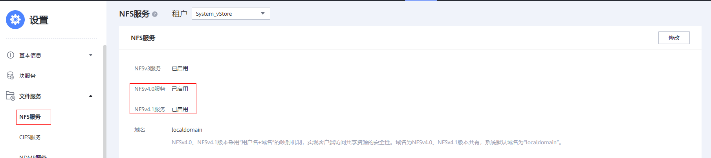

原因2：文件系统挂载的IP不通。

1.  检查网络配置是否正确。
2.  检查配置文件中share\_logic\_ip、archive\_logic\_ip、metadata\_logic\_ip是否填写正确。
3.  在本机上执行以下命令查看配置IP是否连通。命令中的“_ip_”为配置文件中share\_logic\_ip、archive\_logic\_ip、metadata\_logic\_ip的IP。

    ```
    ping ip
    ```

原因3：文件系统名称填写错误。

1.  <a name="zh-cn_topic_0000001835265633_li8100115753116"></a>登录存储系统DeviceManager，选择“设置 \> 文件服务 \> 文件系统”，查看创建的文件系统名称。
2.  检查配置文件中storage\_share\_fs、storage\_archive\_fs、storage\_metadata\_fs配置的文件系统名称，与[1](#zh-cn_topic_0000001835265633_li8100115753116)查询的名称是否一致。

原因4：文件系统root权限配置错误。

1.  登录存储系统DeviceManager，选择“设置 \> 文件服务 \> 共享”，找到对应文件系统（如下图lym\_bakup\_fs文件系统示例），单击查看配置信息。

    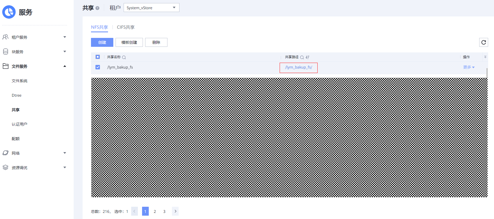

2.  如下图红框所示，单击“修改”查看配置信息。

    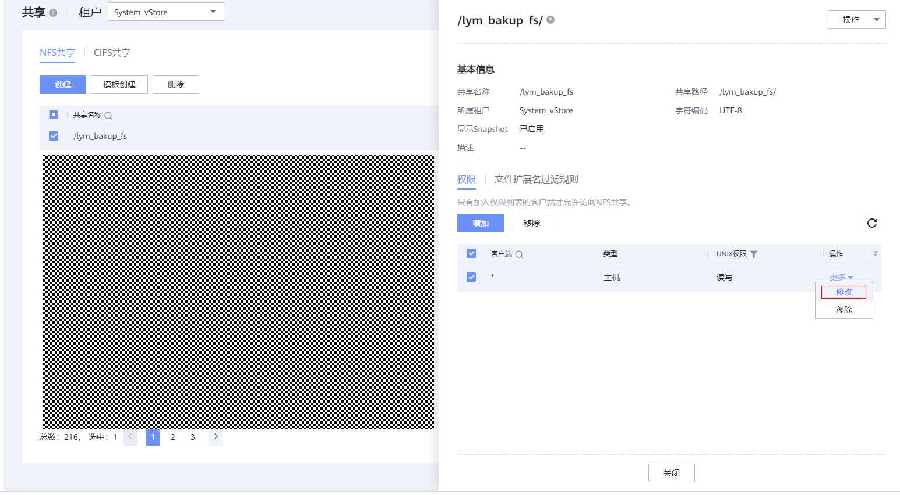

3.  查看“root权限限制“是否配置为“no\_root\_squash“，如果配置不正确请修改。

    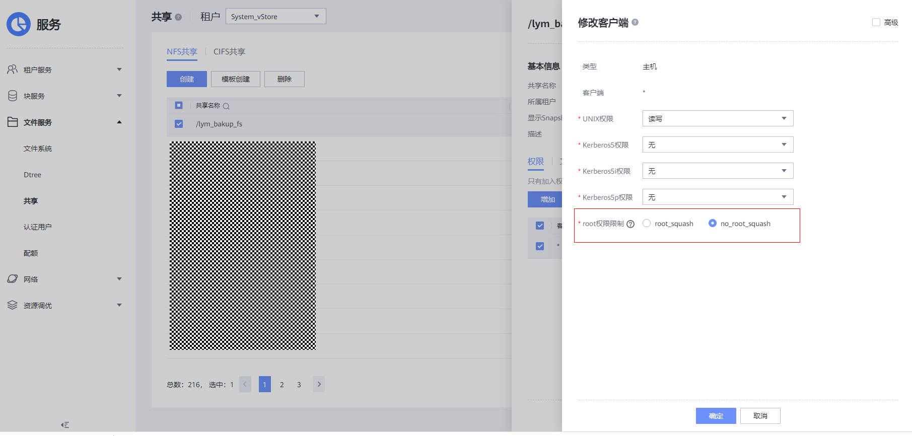

## 卸载Cantian引擎时，提示cms卸载失败<a name="ZH-CN_TOPIC_0000001835272457"></a>

**现象描述<a name="zh-cn_topic_0000001835225745_section18552193215461"></a>**

卸载Cantian引擎时，出现报错提示：cms卸载失败“uninstall cms result is failed.”，回显类似如下：

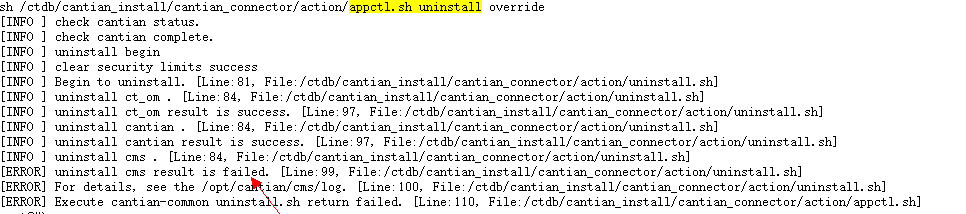

打开日志文件/opt/cantian/cms/log/cms\_deploy.log，查看cms日志，有如下报错提示：

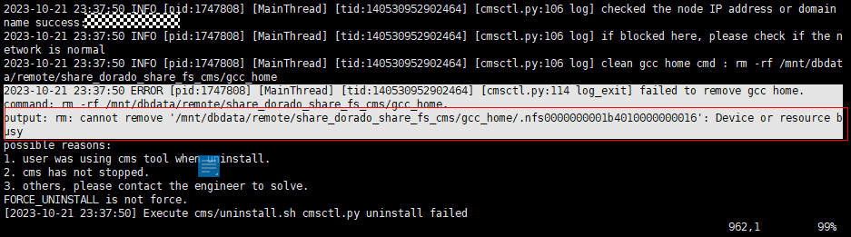

**可能原因<a name="zh-cn_topic_0000001835225745_section1857091614470"></a>**

卸载前gcc\_home目录下的gcc\_file文件正在被cms进程打开，系统产生了.nfs0000XXX 临时文件。卸载时cms进程已停止，但是系统内核对该文件的引用计数并未归0，导致系统误认为当前文件还在被引用，导致删除gcc\_home目录时，报错提示 .nfs0000XXX Device or resource busy。

**处理步骤<a name="zh-cn_topic_0000001835225745_section381410892514"></a>**

1.  使用PuTTY，以root账号登录卸载失败的Cantian节点。
2.  执行以下命令，进入gcc\_home共享路径。

    ```
    cd /mnt/dbdata/remote/share_sotrage_share_fs/gcc_home
    ```

3.  <a name="zh-cn_topic_0000001835225745_li1031016187"></a>执行以下命令，查看隐藏文件。

    ```
    ls -a
    ```

    回显类似如下：

    ```
    ls -a
    .  ..  .nfs0000000005915d7e00000296
    ```

4.  执行以下命令，查看占用该隐藏文件的进程。

    ```
    lsof 隐藏文件
    ```

    _隐藏文件_为[3](#zh-cn_topic_0000001835225745_li1031016187)中查询到的隐藏文件。如：

    ```
    lsof .nfs0000000005915d7e00000296
    ```

    -   有进程占用该文件，执行[5](#zh-cn_topic_0000001835225745_li333519136203)。
    -   无进程占用该文件，执行[6](#zh-cn_topic_0000001835225745_li1548964513508)。

5.  <a name="zh-cn_topic_0000001835225745_li333519136203"></a>执行以下命令关闭进程。

    ```
    kill -9 以上步骤查询到的进程ID
    ```

6.  <a name="zh-cn_topic_0000001835225745_li1548964513508"></a>登录该集群另外一个Cantian节点，执行以下命令删除该文件。

    ```
    rm -rf /mnt/dbdata/remote/share_sotrage_share_fs/gcc_home/隐藏文件
    ```

    如：

    ```
    rm -rf /mnt/dbdata/remote/share_sotrage_share_fs/gcc_home/.nfs0000000005915d7e00000296
    ```

7.  重新执行卸载Cantian引擎的操作。确认是否卸载成功：
    -   是，处理结束。
    -   否，执行[8](#zh-cn_topic_0000001835225745_li144461128142519)。

8.  <a name="zh-cn_topic_0000001835225745_li144461128142519"></a>在卸载失败的Cantian节点执行以下命令卸载共享文件后，再重新挂载。

    ```
    umount /mnt/dbdata/remote/共享文件名称
    ```

9.  执行以下命令删除隐藏文件。如果删除失败，请尝试重启Cantian节点。

    ```
    rm -rf /mnt/dbdata/remote/share_sotrage_share_fs/gcc_home/隐藏文件
    ```

    > **须知：** 
    >卸载共享文件系统或重启主机操作将影响业务正常运行，请确保在无业务运行的情况下执行。

## 通过TCP/IP连接MySQL数据库主机，报错system error: 104<a name="ZH-CN_TOPIC_0000001835232537"></a>

**现象描述<a name="zh-cn_topic_0000001788626184_section18552193215461"></a>**

通过TCP/IP连接MySQL数据库主机，报错：ERROR 2013 \(HY000\): Lost connection to MySQL server at 'reading initial communication packet', system error: 104。

**可能原因<a name="zh-cn_topic_0000001788626184_section1857091614470"></a>**

-   MySQL数据库主机负载过高。
-   MySQL默认connect\_timeout是5秒，连接时长超过5秒后，MySQL Server端会返回“Bad handshake”。

**处理步骤<a name="zh-cn_topic_0000001788626184_section381410892514"></a>**

1.  使用PuTTY，以root账号登录MySQL数据库主机。
2.  执行以下命令修改connect\_timeout的值。

    ```
    set global connect_timeout=60
    ```

3.  重新连接MySQL数据库。是否连接成功：
    -   成功，处理结束。
    -   失败，执行[4](#zh-cn_topic_0000001788626184_li109659104282)。

4.  <a name="zh-cn_topic_0000001788626184_li109659104282"></a>登录MySQL数据库主机，打开MySQL配置文件。
5.  将“skip-name-resolve”添加至\[mysqld\]标签下，以减少域名解析时间。

    如：

    ```
    [mysqld]
    skip-name-resolve
    ```

1.  修改完成后，重启MySQL。
2.  重新连接MySQL数据库。是否连接成功：
    -   成功，处理结束。
    -   失败，联系技术支持工程师协助解决。

## 备份数据期间网络不稳定导致ctsql与Cantian引擎连接断开，备份失败<a name="ZH-CN_TOPIC_0000001788473292"></a>

**现象描述<a name="zh-cn_topic_0000001788466504_section18552193215461"></a>**

出现如下回显表示ctsql与Cantian引擎连接断开：

```
SQL>  CT-00339, tcp connection is closed, reason: 32 
[ctbackup]cantian backup execute failed! 
[ctbackup]cantian data files backup failed!
```

**可能原因<a name="zh-cn_topic_0000001788466504_section1857091614470"></a>**

网络不稳定导致管道破损，ctsql与Cantian引擎连接断开。

**处理步骤<a name="zh-cn_topic_0000001788466504_section131739162319"></a>**

1.  使用PuTTY，以root用户登录备份失败的Cantian引擎节点。
2.  执行以下命令清空备份路径。

    ```
    rm -rf backup_path/*
    ```

    > **说明：** 
    >_backup\_path_为用户自定义的备份路径。

3.  重新执行备份命令。

## 恢复数据时选择对坏块进行修复，恢复失败<a name="ZH-CN_TOPIC_0000001835272465"></a>

**现象描述<a name="zh-cn_topic_0000001835265581_section18552193215461"></a>**

恢复数据时，选择对坏块进行修复，且备份集中已存在backupset\_bad\_block\_record坏块记录文件，恢复任务失败，回显信息如下：

```
[ctbackup] there exist /home/lyz/backup/base1/cantian/backupset_bad_block_record, pelase remove it before restore with repair_type!
[ctbackup]fill_params_for_cantian_restore failed!
```

**可能原因<a name="zh-cn_topic_0000001835265581_section1857091614470"></a>**

用户曾基于该备份集执行过恢复操作，该备份集中已存在记录坏块信息的backupset\_bad\_block\_record。

**处理步骤<a name="zh-cn_topic_0000001835265581_section131739162319"></a>**

1.  使用PuTTY，登录数据库主机。
2.  执行以下命令删除backupset\_bad\_block\_record。

    ```
    rm -rf backup_path/cantian/backupset_bad_block_record
    ```

    > **说明：** 
    >_backup\_path_  为用户自定义的备份路径。

3.  重新执行恢复命令。

## 数据库中存在数据坏块，备份任务失败<a name="ZH-CN_TOPIC_0000001835232541"></a>

**现象描述<a name="zh-cn_topic_0000001788466540_section18552193215461"></a>**

执行全量或增量备份时，备份任务失败，回显中存在关键字“Checksum failed”，类似如下：

```
CT-00855, backup failed, Checksum failed with page 14-20 when read data from file -data1029114304_0
```

**可能原因<a name="zh-cn_topic_0000001788466540_section1857091614470"></a>**

数据库中存在坏块，执行备份任务时未指定跳过坏块参数。

**处理步骤<a name="zh-cn_topic_0000001788466540_section122384583532"></a>**

1.  使用PuTTY，登录执行备份命令的计算节点。
2.  进入备份目录，并清空该目录。
3.  重新执行备份命令，并且在备份命令末尾追加“--skip-badblock”参数。

    备份命令的详细说明可参考《命令参考》中的“ctbackup --backup”、“ctbackup --backup --incremental”。

## 备份集中存在数据坏块，恢复任务失败<a name="ZH-CN_TOPIC_0000001788632948"></a>

**现象描述<a name="zh-cn_topic_0000001788466468_section18552193215461"></a>**

恢复任务执行失败，回显中存在关键字“Checksum failed”，类似如下：

```
CT-00855, restore failed, Checksum failed with page 14-20 when read data from file /home/backup/20231029114734/cantian/data_data1029114304_0_14_0.bak
```

**可能原因<a name="zh-cn_topic_0000001788466468_section1857091614470"></a>**

备份集中存在坏块。

**处理步骤<a name="zh-cn_topic_0000001788466468_section157848461478"></a>**

1.  使用PuTTY，登录执行恢复命令的计算节点。
2.  执行以下命令，清理数据文件、日志文件。

    ```
    rm -rf /mnt/dbdata/local/cantian/tmp/data/data/*
    ```

1.  重新执行恢复命令，命令末尾追加“--repair-type=?”参数，根据实际情况设置“--repair-type”为“replace\_checksum”或“discard\_badblock”。

    该命令的具体说明可参考《命令参考》中的“ctbackup”。

2.  执行以下命令以只读方式重启执行恢复命令的计算节点的Cantian进程。

    ```
    echo -e 'sys账户的密码' | sh /ctdb/cantian_install/cantian_connector/action/cantian/installdb.sh -P cantiand -M nomount -T cantiand_in_cluster -C /opt/cantian/image/cantian_connector/mysql-server/scripts/my.cnf >> /opt/cantian/cantian/log/cantian_deploy.log 2>&1
    ```

3.  重启MYSQLD。
4.  <a name="zh-cn_topic_0000001788466468_li162168718116"></a>执行以下命令使用MySQLDUMP备份数据。

    ```
    mysql_path/mysqldump --user=？ --password=？ --host=？ --port=？   --databases 数据库名称  > 生成的备份文件名称  --force
    ```

    -   _mysql\_path_为MySQL的安装路径。
    -   请备份所有数据库，多个数据库名称以空格隔开，如：db1\_name db2\_name。
    -   请自定义生成的备份文件名称，如：backup.sql。

    由于备份集中存在坏块数据，执行该命令将报错，类似如下：

    ```
    mysqldump: Error 1877: Operation cannot be performed. The table ' db1_name.table1' is missing, corrupt or contains bad data. when dumping table ` table 1` at row: 0
    ```

5.  <a name="zh-cn_topic_0000001788466468_li1951570111512"></a>重新执行以下命令使用MySQLDUMP备份数据，备份过程中忽略坏块。

    ```
    mysql_path/mysqldump --user=？ --password=？--host=？ --port=？   --databases 数据库名称  --ignore-table=存在坏块的表名 > 生成的备份文件名称 --force
    ```

    其中，存在坏块的表名可在[6](#zh-cn_topic_0000001788466468_li162168718116)的报错回显中获取，如： --ignore-table=db1\_name.table1 --ignore-table=db1\_name.table2。

6.  重新安装Cantian引擎。
7.  部署完成后，执行以下命令使用[7](#zh-cn_topic_0000001788466468_li1951570111512)中的备份数据恢复数据库。

    ```
    mysql --user=？ --password=？--host=？ --port=? < 备份文件名称
    ```

## 对端Cantian引擎处于重启中，备份任务失败<a name="ZH-CN_TOPIC_0000001788473300"></a>

**现象描述<a name="zh-cn_topic_0000001835265649_section18552193215461"></a>**

备份任务执行失败，出现如下回显：

```
ERROR 299 (HY000) at line 1: Got error(err_code:299, err_msg:) on remote mysql.
```

**可能原因<a name="zh-cn_topic_0000001835265649_section1857091614470"></a>**

对端Cantian引擎处于重启中。

**处理步骤<a name="zh-cn_topic_0000001835265649_section157848461478"></a>**

1.  使用PuTTY，登录执行备份任务失败的计算节点。

1.  执行以下命令，切换到“user”用户。

    ```
    # su -s /bin/bash - user
    ```

    其中，“user”为安装部署配置文件中参数deploy\_user的用户字段。例如：

    ```
    # su -s /bin/bash - ctdba
    ```

2.  等待对端Cantian引擎重启完成。可执行以下命令检查Cantian引擎是否重启完成。

    当回显中“STAT“的值为“ONLINE“时，表示重启完成。

    ```
    cms stat
    ```

3.  重新执行备份命令。

## Cantian引擎节点启动上线时，在线节点故障，导致上线节点启动失败<a name="ZH-CN_TOPIC_0000001835272473"></a>

**现象描述<a name="zh-cn_topic_0000001788466500_section18552193215461"></a>**

Cantian引擎节点启动上线时，在线节点故障，导致上线节点启动失败，回显类似如下：

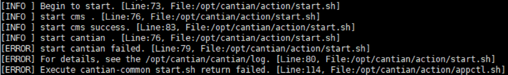

**可能原因<a name="zh-cn_topic_0000001788466500_section1857091614470"></a>**

Cantian引擎节点启动上线时，在线节点故障，会导致上线节点进程卡在非OPEN状态，集群无法正常工作。

**处理步骤<a name="zh-cn_topic_0000001788466500_section197232517548"></a>**

1.  使用PuTTY，登录启动失败的Cantian引擎节点。
2.  执行以下命令，查询Cantian进程是否存在。

    ```
    ps -aux | grep cantiand
    ```

    回显类似如下：

    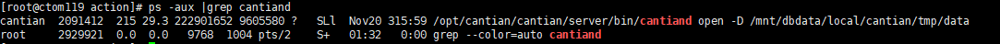

    -   Cantian进程存在，执行[3](#zh-cn_topic_0000001788466500_li1864184415017)。
    -   Cantian进程不存在，联系技术支持协助处理。

3.  <a name="zh-cn_topic_0000001788466500_li1864184415017"></a>执行以下命令切换到**cantian**用户。

    ```
    su -s /bin/bash - cantian
    ```

    执行以下命令连接ctsql，根据提示输入**sys**用户的登录密码。

    ```
    ctsql sys@127.0.0.1:1611
    ```

    **sys**用户的初始密码是用户在安装Cantian引擎过程中定义的密码。

4.  执行以下命令查看Cantian状态。

    ```
    select NAME, STATUS, OPEN_STATUS from DV_DATABASE;
    ```

    回显类似如下：

    ```
    SQL> select NAME, STATUS, OPEN_STATUS from DV_DATABASE;
    NAME                             STATUS                OPEN_STATUS
    -------------------------------- ------------------- --------------------
    cantian                             OPEN                  READ WRITE
    ```

    回显中“STATUS“是否为“OPEN“：

    -   是，联系技术支持协助处理。
    -   否，执行[5](#zh-cn_topic_0000001788466500_li15851134291)重启该节点。

5.  <a name="zh-cn_topic_0000001788466500_li15851134291"></a>使用PuTTY，以root账号登录启动失败的Cantian引擎节点。
6.  执行以下命令，停止该节点。

    ```
    sh /opt/cantian/action/appctl.sh stop
    ```

7.  执行以下命令，重启该节点。

    ```
    sh /opt/cantian/action/appctl.sh start
    ```

## 从其他数据库迁移数据至Cantian引擎时，表结构迁移创建外键关系失败<a name="ZH-CN_TOPIC_0000001835232549"></a>

**现象描述<a name="zh-cn_topic_0000001788626224_section18552193215461"></a>**

从其他数据库迁移数据至Cantian引擎，由于数据库中存在不同数据类型的外键列，导致数据迁移过程中迁移表结构失败，回显报错类似如下：

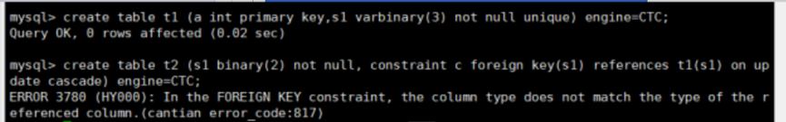

**可能原因<a name="zh-cn_topic_0000001788626224_section1857091614470"></a>**

Cantian引擎不支持对不同数据类型的列创建外键关系。

**处理步骤<a name="zh-cn_topic_0000001788626224_section197232517548"></a>**

1.  根据报错内容提示外键列数据类型不匹配，选择如下两种方式之一进行修改：

    > **说明：** 
    >为了避免后续数据迁移出现错误，请尽量将数据结构统一为与父表的数据类型一致，或者统一为长度更大的数据类型。

    -   修改报错的创表语句，将对应列的数据结构修改为与已创建成功的表一致。

        以报错示例为例说明如下，实际环境请替换参数值：

        ```
        create table t2 (s1 varbinary (3) not null, constraint c foreign key(s1) references t1(s1) on update cascade) engine=CTC;
        ```

    -   修改创建完成的表，将对应列的数据结构修改为与待创建的表一致。

        以报错示例为例说明如下，实际环境请替换参数值：

        ```
        alter table t1 modify column s1 binary(2);
        ```

2.  处理完成后，再重新执行表结构迁移。待表结构迁移成功后，再进行数据迁移。

## 备份数据期间存储阵列app\_data进程故障或存储阵列节点重启，导致备份失败<a name="ZH-CN_TOPIC_0000001788632956"></a>

**现象描述<a name="zh-cn_topic_0000001788466552_section18552193215461"></a>**

-   备份任务失败，回显报错类似如下：

    ```
    CT-00855, backup failed, Failed to create the file /home/backup/20231228130705/cantian/data_data1228130823_0_11_1.bak, the error code was 17
    ```

-   如果备份任务回显中没有以上报错信息，可查看Cantian引擎运行日志中有如下错误：

    Cantian引擎运行日志的默认路径为/mnt/dbdata/local/cantian/tmp/data/log/run/cantiand.rlog。

    ```
    UTC+08:00 2023-12-28 13:24:24.415|BACKUP|00000|3463302|ERROR>CT-00003:[BACKUP] failed to generate bak file /home/backup/20231228130705/cantian/data_data1228130823_0_11_1.bak, file_index 13, sec_id 1.,Failed to create the file /home/backup/20231228130705/cantian/data_data1228130823_0_11_1.bak, the error code was 17 [bak_paral.c:196]
    ```

**可能原因<a name="zh-cn_topic_0000001788466552_section1857091614470"></a>**

备份数据所在存储阵列故障，导致创建文件失败。

**处理步骤<a name="zh-cn_topic_0000001788466552_section197232517548"></a>**

1.  使用PuTTY，以root用户登录备份失败的Cantian引擎节点。
2.  执行以下命令清空备份路径。

    ```
    rm -rf backup_path/*
    ```

    > **说明：** 
    >_backup\_path_为用户自定义的备份路径。

3.  重新执行备份命令。

## 恢复数据期间存储阵列app\_data进程故障或存储阵列节点重启，导致恢复失败<a name="ZH-CN_TOPIC_0000001788473304"></a>

**现象描述<a name="zh-cn_topic_0000001835225649_section18552193215461"></a>**

-   恢复任务失败，回显报错类似如下：

    ```
    CT-00855, restore failed, Failed to create the file /home/backup/20231228130705/cantian/backupset_bad_block_record, the error code was 17
    ```

-   如果恢复任务回显中没有以上报错信息，可查看Cantian引擎运行日志中有如下错误：

    Cantian引擎运行日志的默认路径为/mnt/dbdata/local/cantian/tmp/data/log/run/cantiand.rlog。

    ```
    UTC+08:00 2024-01-05 16:38:06.575|BACKUP|00000|3463302|ERROR>CT-00003:[BACKUP] failed to 
    create /home/backup/20231228130705/cantian/backupset_bad_block_record,Failed to create the file /home/backup/20231228130705/cantian/
    backupset_bad_block_record, the error code was 17 [bak_badblock.c:239]
    ```

**可能原因<a name="zh-cn_topic_0000001835225649_section1857091614470"></a>**

备份数据所在存储阵列故障，导致创建文件失败。

**处理步骤<a name="zh-cn_topic_0000001835225649_section197232517548"></a>**

1.  使用PuTTY，以root用户登录恢复失败的Cantian引擎节点。
2.  删除备份集中的backupset\_bad\_block\_record文件。

    ```
    rm -rf backup_path/cantian/backupset_bad_block_record
    ```

    > **说明：** 
    >_backup\_path_为用户自定义的备份路径。

3.  执行以下命令，清理数据文件、日志文件。

    ```
    rm -rf /mnt/dbdata/local/cantian/tmp/data/data/*
    ```

4.  重新执行恢复命令。

## 大量并发插入且同时执行查询后，报错提示Snapshot too old<a name="ZH-CN_TOPIC_0000001835272481"></a>

**现象描述<a name="zh-cn_topic_0000001788466564_section18552193215461"></a>**

大量并发插入写入大量Undo日志，Undo空间满时会淘汰旧的数据版本，因此查询老版本数据时会报错，报错提示：Snapshot too old。

**可能原因<a name="zh-cn_topic_0000001788466564_section1857091614470"></a>**

Undo空间耗尽。

**处理步骤<a name="zh-cn_topic_0000001788466564_section76771217114218"></a>**

1.  使用PuTTY，依次登录所有Cantian引擎节点。
2.  执行以下命令切换用户。

    执行以下命令连接ctsql，根据提示输入**sys**用户的登录密码。

    ```
    ctsql sys@127.0.0.1:1611
    ```

    **sys**用户的初始密码是用户在安装Cantian引擎过程中定义的密码。

3.  执行以下命令根据实际业务场景调整\_UNDO\_ACTIVE\_SEGMENTS参数。

    ```
    alter system set _UNDO_ACTIVE_SEGMENTS=? 
    ```

    > **说明：** 
    >\_UNDO\_ACTIVE\_SEGMENTS参数值的默认范围为\[2, 1024\]，其中上限值由\_UNDO\_SEGEMENTS决定。可执行**show parameters undo\_segments;**命令查看\_UNDO\_SEGEMENTS的值。

## 大量并发replace/update且事务做完未提交，导致其他事务replace/update卡住<a name="ZH-CN_TOPIC_0000001835232553"></a>

**现象描述<a name="zh-cn_topic_0000001835265733_section18552193215461"></a>**

大量并发replace/update且事务做完未提交，其他事务长时间repalce/update未结束，通过在mysql实例下发**show processlist;**查询到某些线程长期在做某一DML操作，且多次查询无变化即认为卡住。**show processlist;**命令回显类似如下：

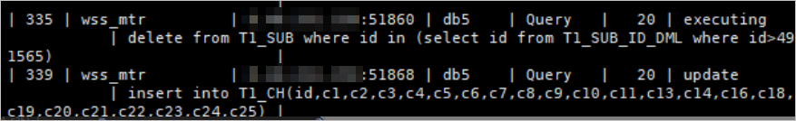

**可能原因<a name="zh-cn_topic_0000001835265733_section1857091614470"></a>**

不同事务对同一个page的不同行进行replace/update操作，每个事务都需要一个事务插槽（itl），该page的空间已满，free size大小不足以申请新的itl，且itl被未提交的事务占用，需一直等待可用的itl。

**处理步骤<a name="zh-cn_topic_0000001835265733_section323211417171"></a>**

1.  登录MySQL实例，删除replace/update操作的表内索引或删除整表。

    ```
    DROP INDEX index_name ON table_name;
    ALTER TABLE table_name DROP INDEX index_name;
    DROP TABLE table_name;
    ```

2.  使用PuTTY，登录任一Cantian引擎节点。
3.  执行以下命令切换用户，切换到“user”用户。

    ```
    # su -s /bin/bash - user
    ```

    其中，“user”为安装部署配置文件中参数deploy\_user的用户字段。例如：

    ```
    # su -s /bin/bash - ctdba
    ```

    执行以下命令连接ctsql，根据提示输入**sys**用户的登录密码。

    ```
    ctsql sys@127.0.0.1:1611
    ```

    **sys**用户的初始密码是用户在安装Cantian引擎过程中定义的密码。

4.  执行以下命令根据实际业务场景调整INI\_TRANS参数。

    ```
    alter system set INI_TRANS=? ;
    ```

    > **说明：** 
    >-   INI\_TRANS可以指定数据块中初始的事务插槽（itl）个数，当多个事务并发访问同一数据块的行时，将为每个DML事务在块中的事务插槽（itl）分配空间。一旦INI\_TRANS保留的空间耗尽，将从块中的可用空间中分配用于其他事务条目的空间，空间用尽后需等待事务插槽（itl）释放后复用。
    >-   INI\_TRANS参数值的默认范围为\[1, 255\]，当前INI\_TRANS默认值为2，最大可支持数量为255，INIT\_TRANS是一个全局变量，可执行**show parameters ini\_trans;**命令查看INI\_TRANS的值。如果遇到多并发update/replace事务未提交的操作导致其他事务卡住的场景，可以增大INI\_TRANS的数量来解决。高并发操作结束并提交后，为避免浪费资源，将INI\_TRANS参数的值修改为默认值2。

5.  重新创建索引或者创建整表进行update/replace操作。

## CMS向存储阵列下发IO请求时，数据库主机维护的状态错误导致CMS功能异常<a name="ZH-CN_TOPIC_0000001788632960"></a>

**现象描述<a name="zh-cn_topic_0000001788626268_section18552193215461"></a>**

CMS通过数据库主机向存储阵列下发读写、加解范围锁失败，导致CMS功能异常。

-   执行以下命令查看CMS运行日志，回显中存在关键字“cms\_disk\_lock timeout”、“read failed”或“write failed”。

    ```
    cat /opt/cantian/cms/log/run/cms_srv.rlog | grep "ERROR"
    ```

    回显类似如下：

    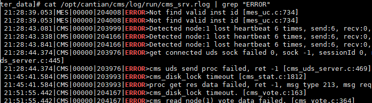

-   或者执行以下命令查看Cantian引擎集群管控面状态监控目录日志，“cms\_lock\_status”的状态为“abnormal”。

    ```
    cat /opt/cantian/ct_om/service/cantian_exporter/exporter_data/*.json | grep cms_lock_status
    ```

    回显类似如下：

    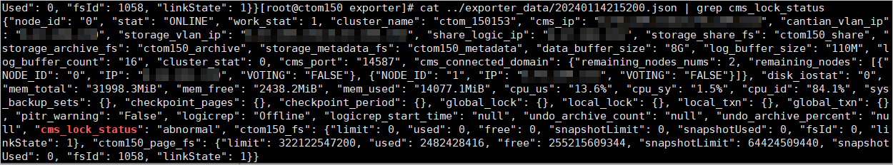

**可能原因<a name="zh-cn_topic_0000001788626268_section1857091614470"></a>**

数据库主机OS内核在高并发场景对文件状态的stateId管理存在问题。

**处理步骤<a name="zh-cn_topic_0000001788626268_section1980710368217"></a>**

1.  确认CMS共享数据使用的文件系统是否存在异常。
    1.  <a name="zh-cn_topic_0000001788626268_li14416151015142"></a>登录任务失败的主机，查看Cantian引擎安装配置文件“/cantian\_connector/action/config\_params.json”中参数“share\_logic\_ip”和“storage\_share\_fs”的值。

        “share\_logic\_ip”为访问文件系统的逻辑IP地址，“storage\_share\_fs”为文件系统名称。

        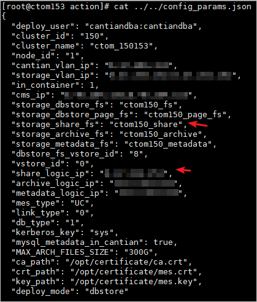

    2.  在数据库主机执行以下命令查看文件系统是否已挂载。

        ```
        mount | grep "文件系统名称"
        ```

        _其中，文件系统名称_为[1.a](#zh-cn_topic_0000001788626268_li14416151015142)中查询到的“storage\_share\_fs”的值。

        回显类似如下表示文件系统已挂载，否则表示未挂载。

        -   如果查询到文件系统已挂载，则执行[1.c](#zh-cn_topic_0000001788626268_li1040614181885)。
        -   如果查询到文件系统未挂载，请重新挂载文件系统后查看日志中是否仍然存在错误信息。

        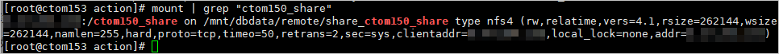

    3.  <a name="zh-cn_topic_0000001788626268_li1040614181885"></a>登录存储系统，查看存储控制器是否存在故障以及文件系统是否存在异常告警，比如容量已满、状态异常等。
        -   如果查询到存储控制器以及文件系统均正常，则执行[2](#zh-cn_topic_0000001788626268_li1991729143420)。
        -   如果查询到存储控制器或文件系统存在异常，请修复后查看日志中是否仍然存在错误信息。

2.  <a name="zh-cn_topic_0000001788626268_li1991729143420"></a>如果文件系统已正常挂载且存储阵列和文件系统均状态正常，参考以下步骤进行处理。
    1.  如果CMS运行日志\(cat /opt/cantian/cms/log/run/cms\_srv.rlog | grep "ERROR"\)出现“read failed”或“write failed”报错，则执行以下命令重启Cantian引擎及CMS。

        ```
        sh /opt/cantian/action/appctl.sh stop
        sh /opt/cantian/action/appctl.sh start
        ```

    2.  如果查看CMS运行日志\(cat /opt/cantian/cms/log/run/cms\_srv.rlog | grep "ERROR"\)出现为“cms\_disk\_lock timeout”报错，则需要在存储阵列清除客户端范围锁信息。

## 数据页面坏块修复<a name="ZH-CN_TOPIC_0000001994519294"></a>

**现象描述<a name="zh-cn_topic_0000001945396429_section18552193215461"></a>**

在数据库使用过程中提示某个页面损坏导致无法查询表中数据。

-   ctsql场景下，使用select语句查询，存在页面损坏的表，报错提示具体损坏的page id，类似如下：

    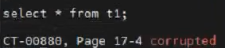

-   mysql场景下，使用select语句查询，存在页面损坏的表时不会提示损坏的page id，可以在Cantian引擎日志中查询损坏page id，日志信息类似如下：

    

**可能原因<a name="zh-cn_topic_0000001945396429_section1857091614470"></a>**

Cantian引擎运行时，可能因为硬件错误导致某个page被损坏。

**处理步骤<a name="zh-cn_topic_0000001945396429_section4321816313"></a>**

1.  可通过坏块修复功能修改损坏的page，恢复前请检查并确保满足以下条件。
    -   page损坏前执行过全量备份。
    -   全量备份集中包含损坏的page。
    -   全量备份集中有从该备份集到当前redo log末尾的所有redo。
    -   目标数据库状态正常，可以接收查询。

2.  登录任一Cantian引擎节点。
3.  <a name="zh-cn_topic_0000001945396429_li238641201811"></a>执行以下命令创建临时目录。

    以下以创建目录为/data/tmp为例说明。

    ```
    mkdir /data/tmp
    ```

4.  执行以下命令启动一个Cantian引擎临时实例恢复损坏的页面。

    ```
    ctrst -p 端口 -D 路径 -B 备份集路径 -S Cantian引擎实例IP:监听端口 -P pageID
    ```

    -   端口：新启动的Cantian引擎临时实例的监听端口，不能与原有Cantian引擎实例的监听端口冲突。
    -   路径：[3](#zh-cn_topic_0000001945396429_li238641201811)创建的目录。
    -   备份集路径：用来恢复的全量备份集路径。
    -   Cantian引擎实例IP:监听端口：原有Cantian引擎实例的IP以及监听端口。
    -   pageID：需要修复的page id。

    如：

    ```
    ctrst -p 1612 -D /data/tmp -B /dev/backup/770398223948990 -S 127.0.0.1:1610 -P 17_4
    ```

5.  修复完成后，删除创建的临时目录，再次执行查询命令确认数据已修复。

## 执行拷贝算法DDL操作后统计信息丢失<a name="ZH-CN_TOPIC_0000002021776654"></a>

**现象描述<a name="zh-cn_topic_0000002021766900_section6862174910916"></a>**

在数据库执行拷贝算法的DDL操作后统计信息丢失。

例如，进行如下操作，查看修改表前后的执行计划，存在差异：

1.  创建表并插入数据后，执行以下命令，收集表的统计信息：

    ```
    ANALYZE TABLE t1;
    +--------+---------+----------+----------+
    | Table  | Op      | Msg_type | Msg_text |
    +--------+---------+----------+----------+
    | db1.t1 | analyze | status   | OK       |
    +--------+---------+----------+----------+
    ```

2.  <a name="zh-cn_topic_0000002021766900_li5996356123511"></a>执行以下命令，查看收集完统计信息后的执行计划：

    ```
    EXPLAIN SELECT * FROM t1 WHERE i=2 OR i IS NULL;
    +----+-------------+-------+------------+-------------+---------------+------+---------+-------+------+----------+---------------+
    | id | select_type | table | partitions | type        | possible_keys | key  | key_len | ref   | rows | filtered | Extra  |   
    +----+-------------+-------+------------+-------------+---------------+------+---------+-------+------+----------+---------------+
    |  1 | SIMPLE      | t1    | NULL       | ref_or_null | i             | i    | 5       | const |   10 |   100.00 | Using where; Using pushed condition ((`eco_specifications_db1`.`t1`.`i` = 2) or (`eco_specifications_db1`.`t1`.`i` is null)); Using index |
    +----+-------------+-------+------------+-------------+---------------+------+---------+-------+------+----------+---------------+
    ```

3.  执行以下命令，将所创建表的一列内容定义为非空：

    ```
    SET SQL_MODE = 'NO_ENGINE_SUBSTITUTION';
    ALTER TABLE t1 CHANGE i i int NOT NULL;
    ```

4.  再次执行[2](#zh-cn_topic_0000002021766900_li5996356123511)的EXPLAIN命令、并与[2](#zh-cn_topic_0000002021766900_li5996356123511)的回显内容进行对比，关键字“rows ”的内容发生变化、信息丢失。

    ```
    EXPLAIN SELECT * FROM t1 WHERE i=2 OR i IS NULL;
    +----+-------------+-------+------------+------+---------------+------+---------+-------+------+----------+-------------+
    | id | select_type | table | partitions | type | possible_keys | key  | key_len | ref   | rows | filtered | Extra       |
    +----+-------------+-------+------------+------+---------------+------+---------+-------+------+----------+-------------+
    |  1 | SIMPLE      | t1    | NULL       | ref  | i             | i    | 4       | const |    1 |   100.00 | Using index |
    +----+-------------+-------+------------+------+---------------+------+---------+-------+------+----------+-------------+
    ```

**可能原因<a name="zh-cn_topic_0000002021766900_zh-cn_topic_0000001835225689_section1857091614470"></a>**

在执行拷贝算法的DDL操作时，算法流程中会新建一张满足执行ALTER语句后表定义的新表，再把之前表中数据拷贝到新表中，旧表及旧表的统计信息会被删除，故统计信息需要重新收集。

**处理步骤<a name="zh-cn_topic_0000002021766900_section48647491493"></a>**

以上述样例为例，在完成表的修改操作后、执行EXPLAIN命令查看执行计划前，再次执行ANALYZE命令收集表的统计信息。

增加该操作后，上述样例的执行步骤为：

1.  创建表并插入数据后，执行以下命令，收集表的统计信息：

    ```
    ANALYZE TABLE t1;
    +--------+---------+----------+----------+
    | Table  | Op      | Msg_type | Msg_text |
    +--------+---------+----------+----------+
    | db1.t1 | analyze | status   | OK       |
    +--------+---------+----------+----------+
    ```

2.  <a name="zh-cn_topic_0000002021766900_li109741674367"></a>执行以下命令，查看收集完统计信息后的执行计划：

    ```
    EXPLAIN SELECT * FROM t1 WHERE i=2 OR i IS NULL;
    +----+-------------+-------+------------+-------------+---------------+------+---------+-------+------+----------+---------------+
    | id | select_type | table | partitions | type        | possible_keys | key  | key_len | ref   | rows | filtered | Extra|
    +----+-------------+-------+------------+-------------+---------------+------+---------+-------+------+----------+---------------+
    |  1 | SIMPLE      | t1    | NULL       | ref_or_null | i             | i    | 5       | const |   10 |   100.00 | Using where; Using pushed condition ((`eco_specifications_db1`.`t1`.`i` = 2) or (`eco_specifications_db1`.`t1`.`i` is null)); Using index |
    +----+-------------+-------+------------+-------------+---------------+------+---------+-------+------+----------+---------------+
    ```

3.  执行以下命令，将所创建表的一列内容定义为非空：

    ```
    SET SQL_MODE = 'NO_ENGINE_SUBSTITUTION';
    ALTER TABLE t1 CHANGE i i int NOT NULL;
    ```

4.  执行以下命令，收集修改后表的统计信息。

    ```
    ANALYZE TABLE t1;
    +--------+---------+----------+----------+
    | Table  | Op      | Msg_type | Msg_text |
    +--------+---------+----------+----------+
    | db1.t1 | analyze | status   | OK       |
    +--------+---------+----------+----------+
    ```

5.  再次执行[2](#zh-cn_topic_0000002021766900_li109741674367)的EXPLAIN命令、并与[2](#zh-cn_topic_0000002021766900_li109741674367)的回显内容进行对比，关键字“rows ”的内容信息匹配。

    ```
    EXPLAIN SELECT * FROM t1 WHERE i=2 OR i IS NULL;
    +----+-------------+-------+------------+------+---------------+------+---------+-------+------+----------+-------------+
    | id | select_type | table | partitions | type | possible_keys | key  | key_len | ref   | rows | filtered | Extra       |
    +----+-------------+-------+------------+------+---------------+------+---------+-------+------+----------+-------------+
    |  1 | SIMPLE      | t1    | NULL       | ref  | i             | i    | 4       | const |    9 |   100.00 | Using index |
    +----+-------------+-------+------------+------+---------------+------+---------+-------+------+----------+-------------+
    ```

## 在Cantian引擎的任一数据库服务器安装插件，该插件在其他数据库服务器无法生效、也无法被安装<a name="ZH-CN_TOPIC_0000002090454413"></a>

**现象描述<a name="zh-cn_topic_0000002089934629_section6862174910916"></a>**

在部署Cantian引擎的任一一个数据库服务器上，启动MySQL的命令行窗口、并在该窗口执行MySQL所支持插件的安装命令。执行后，插件会在该数据库上立刻生效，但在其他数据库服务器无法生效、且无法安装该插件。

例如：

1.  <a name="zh-cn_topic_0000002089934629_li18996556133512"></a>登录部署Cantian引擎的任一一个数据库服务器，执行以下命令安装MySQL支持的插件。

    ```
    INSTALL PLUGIN plugin_name SONAME 'plugin';
    ```

    其中，“plugin\_name”为该插件的名称，“plugin”为安装的插件。以“connection\_control”和“connection\_control.so”为例：

    ```
    mysql> INSTALL PLUGIN connection_control SONAME 'connection_control.so';
    Query OK, 0 rows affected (0.03 sec)
    ```

2.  登录部署Cantian引擎的其他数据库服务器，执行以下命令，查询[1](#zh-cn_topic_0000002089934629_li18996556133512)中安装的插件在该数据库服务器上是否生效。

    ```
    select * from information_schema.plugins where PLUGIN_NAME = 'plugin_name';
    ```

    其中，“plugin\_name”为[1](#zh-cn_topic_0000002089934629_li18996556133512)中安装的插件名称。

    ```
    mysql> select * from information_schema.plugins where PLUGIN_NAME = 'connection_control';
    Empty set (0.00 sec)
    ```

    返回“Empty ”的回显信息，表示插件在该数据库服务器上未生效。

3.  执行以下命令，安装与[1](#zh-cn_topic_0000002089934629_li18996556133512)中相同的MySQL插件。

    ```
    INSTALL PLUGIN plugin_name SONAME 'plugin';
    ```

    其中，“plugin\_name”为[1](#zh-cn_topic_0000002089934629_li18996556133512)中安装的插件名称、“plugin”为[1](#zh-cn_topic_0000002089934629_li18996556133512)中安装的插件。

    ```
    INSTALL PLUGIN connection_control SONAME 'connection_control.so';
    ERROR 3883 (HY000): Error installing plugin 'connection_control': got 'Operation not permitted' writing to mysql.plugin
    ```

    返回“ERROR ”的回显信息，表示插件安装失败。即在该数据库服务器，插件既无法生效、也无法被安装。

**可能原因<a name="zh-cn_topic_0000002089934629_zh-cn_topic_0000001835225689_section1857091614470"></a>**

在MySQL的命令行窗口、手动进行插件安装后，MySQL会先将插件信息注册到系统表mysql.plugin中，然后将插件进行初始化、并将插件状态等信息更新到information\_schema.plugin视图里。information\_schema.plugin视图完成信息更新后，插件会才会生效。

在Cantian引擎里，mysq.plugin由Cantian引擎统一管理，在任一数据库服务器进行了插件安装，Cantian引擎会将插件信息注册到所有数据库服务器的系统表mysql.plugin中。但是information\_schema.plugin视图只会在执行了安装操作的数据库服务器进行刷新。因此，插件在其他数据库服务器无法生效，同时因为插件信息已在mysql.plugin中，导致插件也无法被安装。

**处理步骤<a name="zh-cn_topic_0000002089934629_section48647491493"></a>**

-   方案1：在任一数据库服务器启动MySQL的命令行窗口、执行插件的手工安装后，重启其他数据库服务器的mysql进程，重启后，其他数据库服务器的information\_schema.plugin视图会自动更新、插件生效。
-   方案2：在任一数据库服务器启动MySQL的命令行窗口、执行插件的手工安装后，登录其他数据库服务器，删除其他数据库服务器mysql.plugin中的插件信息后执行安装操作，即可在不重启数据库的情况下使插件生效。

    1.  登录其他数据库服务器，执行以下命令删除插件注册信息。

        ```
        delete from mysql.plugin where name = 'plugin_name';
        ```

        其中，“plugin\_name”为[1](#zh-cn_topic_0000002089934629_li18996556133512)中安装的插件名称。

        ```
        delete from mysql.plugin where name = 'connection_control';
        Query OK, 1 row affected (0.00 sec)
        ```

    2.  执行以下命令，安装与[1](#zh-cn_topic_0000002089934629_li18996556133512)中相同的MySQL插件。

        ```
        INSTALL PLUGIN plugin_name SONAME 'plugin';
        ```

        其中，“plugin\_name”为[1](#zh-cn_topic_0000002089934629_li18996556133512)中安装的插件名称、“plugin”为[1](#zh-cn_topic_0000002089934629_li18996556133512)中安装的插件。

        ```
        mysql> INSTALL PLUGIN connection_control SONAME 'connection_control.so';
        Query OK, 0 rows affected (0.03 sec)
        ```

        根据回显信息，插件安装成功。

    > **须知：** 
    >根据上述方案完成插件的安装后，若后续要卸载该插件，请在安装插件的各个数据库服务器上执行以下命令进行卸载操作：
    >```
    >uninstall PLUGIN plugin
    >```
    >其中，“plugin”为[1](#zh-cn_topic_0000002089934629_li18996556133512)中安装的插件。例如：
    >```
    >uninstall PLUGIN connection_control
    >```

## 部署Cantian引擎数据库服务器故障、更换数据库服务器<a name="ZH-CN_TOPIC_0000002137872625"></a>

**现象描述<a name="zh-cn_topic_0000002136282425_section1249852681510"></a>**

部署Cantian引擎的服务器服务器故障，请根据[处理步骤](#zh-cn_topic_0000002136282425_section343915318182)更换数据库服务器。

**处理步骤<a name="zh-cn_topic_0000002136282425_section343915318182"></a>**

1.  根据《安装指南》中 “部署Cantian引擎”章节的“前提条件”，完成配置前准备，其中，根据《安装指南》的“配置服务器网络”进行配置时，为确保业务不停止，需确保网络配置中新分配的IP与原数据库服务器一致。
2.  执行《安装指南》中 “部署Cantian引擎”章节的“步骤1”至“步骤5”，其中，除参数“node\_id”和“cantian\_vlan\_ip”应根据当前数据库服务器实际情况进行配置外，其余参数应与部署该Cantian引擎的另一台数据库服务器的“/opt/cantian/config/deploy\_param.json”配置文件保持一致。
3.  执行以下命令修改文件。

    ```
    sed -i "/^[[:space:]]*install_cms[[:space:]]*$/i\return 0" path/cantian_connector/action/cms/start_cms.sh
    ```

    其中，“path”安装包的上传路径，以该路径是“/ctdb/cantian\_install”为例：

    ```
    [root@host ~]# sed -i "/^[[:space:]]*install_cms[[:space:]]*$/i\return 0" /ctdb/cantian_install/cantian_connector/action/cms/start_cms.sh
    ```

4.  执行《安装指南》中 “部署Cantian引擎”章节的“步骤6”。
5.  在新的数据库服务器上安装部署mysql。
6.  执行以下命令启动cantian引擎。

    ```
    sh path/cantian_connector/action/appctl.sh start standby
    ```

    其中，“path”安装包的上传路径，以该路径是“/ctdb/cantian\_install”为例：

    ```
    [root@host ~]# sh /ctdb/cantian_install/cantian_connector/action/appctl.sh start standby
    ```

7.  执行以下命令，切换到“user”用户。

    ```
    # su -s /bin/bash - user
    ```

    其中，“user”为安装部署配置文件中参数deploy\_user的用户字段。例如：

    ```
    # su -s /bin/bash - ctdba
    ```

8.  依次执行以下命令，查看Cantian引擎的集群状态是否正常。

    ```
    cms stat
    ```

    若集群里两台数据库服务器的“STAT”值为“ONLINE”、“WORK\_STAT”值为“1”、“ROLE”值为“REFORMER”，表示集群状态正常。

    ```
    ]$ cms stat
    NODE_ID  NAME      STAT    PRE_STAT    TARGET_STAT   WORK_STAT   SESSION_ID   INSTANCE_ID   ROLE     LAST_CHECK              HB_TIME                 STAT_CHANGE
          0  db        ONLINE  UNKNOWN     ONLINE                1            0             0   REFORMER 2024-02-06 02:42:32.753 2024-02-06 02:42:32.753 2024-02-05 05:44:30.578
          1  db        ONLINE  OFFLINE     ONLINE                1            0             1   REFORMER 2024-02-06 02:42:34.599 2024-02-06 02:42:34.599 2024-02-05 05:47:06.742
    ```

