# 健康巡检<a name="ZH-CN_TOPIC_0000001835234385"></a>


## 通过命令健康巡检<a name="ZH-CN_TOPIC_0000001835274301"></a>

通过脚本对Cantian引擎执行健康巡检，以便了解Cantian引擎各模块的运行状态。

**前提条件<a name="zh-cn_topic_0000001788626252_section1819813364111"></a>**

Cantian引擎已正确安装且正常运行。

**背景信息<a name="zh-cn_topic_0000001788626252_section89072273713"></a>**

-   针对单个节点进行一键巡检或指定巡检项巡检。
-   一键巡检成功后会生成巡检文件记录巡检结果，默认仅保留最近9个巡检结果文件。

**巡检Cantian引擎<a name="zh-cn_topic_0000001788626252_section2502154624517"></a>**

1.  以SSH方式（如PuTTY），依次登录所有Cantian引擎节点。
2.  执行以下命令切换至**cantian**账号。

    ```
    su -s /bin/bash cantian
    ```

3.  依次在所有Cantian引擎节点执行以下命令进行巡检：
    -   全量巡检：

        ```
        python3 /opt/cantian/action/inspection/inspection_task.py all
        ```

    -   部分巡检：

        ```
        python3 /opt/cantian/action/inspection/inspection_task.py [xxx,xxx,…]
        ```

        > **说明：** 
        >-   _xxx_表示具体的巡检项，如“cantian\_status”。
        >    巡检项可通过“/opt/cantian/action/inspection/inspection\_config.json“文件查看，如[图1](#zh-cn_topic_0000001788626252_fig18762755183118)所示。巡检项可通过“/opt/cantian/action/inspection/inspection\_config.json“文件查看，如[图1](#zh-cn_topic_0000001788626252_fig18762755183118)所示。
        >-   各巡检项之间以英文逗号隔开，且无空格。

        **图 1**  查看巡检项<a name="zh-cn_topic_0000001788626252_fig18762755183118"></a>  
        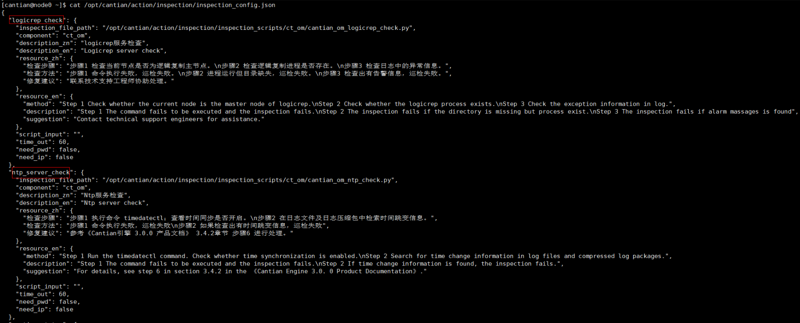

4.  根据回显提示，输入ctsql用户名、密码。

    

    > **说明：** 
    >-   执行全量巡检时，需要输入ctsql的用户名及密码。
    >-   执行部分巡检时，如果回显提示输入ctsql的用户名及密码才需要输入。

5.  执行结果，回显类似如下。

    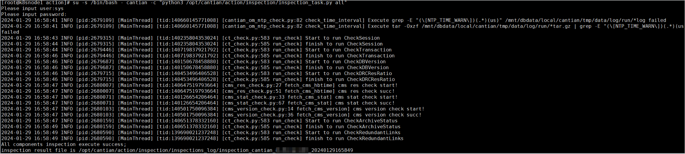

6.  查看巡检结果。

    巡检完成后，巡检结果将保存在目录“/opt/cantian/action/inspections\_log”下，以“inspection\_时间戳”命名，并且只保存最近9次的巡检结果文件。

    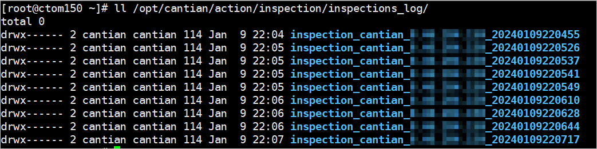

# 安全管理<a name="ZH-CN_TOPIC_0000001788475140"></a>


## 数据库安全配置<a name="ZH-CN_TOPIC_0000001835234389"></a>


### 设置数据库连接<a name="ZH-CN_TOPIC_0000001788634804"></a>

为了保护数据库的信息安全，需要对数据库连接进行设置，禁止非法客户端访问数据库。SYS用户禁止远程登录。


#### 禁止侦听地址使用“0.0.0.0”和“::”<a name="ZH-CN_TOPIC_0000001835274305"></a>

**配置说明：**“0.0.0.0”表示侦听所有可用的IPv4地址，“::”表示侦听所有可用的IPv6地址。

**配置方法：**在cantiand.ini配置文件中修改参数LSNR\_ADDR的值为本机IP和127.0.0.1的IP，重启数据库生效。cantiand.ini文件的存储路径为$\{_CTDB\_DATA_\}/cfg/cantiand.ini。

使用如下命令打开配置文件，找到参数LSNR\_ADDR，修改对应的值。

```
vim ${CTDB_DATA}/cfg/cantiand.ini
```

查看默认存储路径可以使用如下命令。

```
echo ${CTDB_DATA}
```

修改完成，停止并重启数据库。

```
cms res -stop db
cms res -start db
```

**默认值：**127.0.0.1（单节点），192.168.86.1,192.168.86.2（双节点）

**检查方法：**

```
SELECT NAME, VALUE FROM DV_PARAMETERS WHERE NAME = 'LSNR_ADDR' AND VALUE IN ('0.0.0.0', '::');
```

**预期结果：**

```
NAME                                                             VALUE                                                           
---------------------------------------------------------------- ----------------------------------------------------------------

0 rows fetched.
```

**风险等级：**中

#### 修改默认侦听端口<a name="ZH-CN_TOPIC_0000001788475144"></a>

**配置说明：**修改数据库默认的侦听端口1611，禁止恶意客户端访问数据库。

**配置方法：**在cantiand.ini配置文件中修改参数LSNR\_PORT的值，重启数据库生效。cantiand.ini文件的存储路径为$\{_CTDB\_DATA_\}/cfg/cantiand.ini。

```
vim ${CTDB_DATA}/cfg/cantiand.ini
```

**默认值：**1611

**检查方法：**

```
SELECT NAME, VALUE FROM DV_PARAMETERS WHERE NAME = 'LSNR_PORT';
```

**预期结果：**

例如，修改端口为1888后，回显如下：

```
NAME                                           VALUE                                                           
--------------------------------------------- -----------------------------------------------
LSNR_PORT                                     1888                                                            

1 rows fetched.
```

**风险等级：**中

#### 设置最大连接数<a name="ZH-CN_TOPIC_0000001835234393"></a>

**配置说明：**配置服务端总的在线连接数，如果最大连接数设置过大，将导致服务端进程socket句柄和会话池内存超过操作系统默认配置阈值。建议最大并发连接数设置为500。

**配置方法：**在cantiand.ini配置文件中修改参数SESSIONS的值。cantiand.ini文件的存储路径为$\{_CTDB\_DATA_\}/cfg/cantiand.ini。

**默认值：**8192

**检查方法：**

```
SELECT NAME, VALUE FROM DV_PARAMETERS WHERE NAME = 'SESSIONS';
```

**预期结果：**

```
NAME                                                             VALUE                                                           
---------------------------------------------------------------- ----------------------------------------------------------------
SESSIONS                                                         500                                                            

1 rows fetched.

```

**风险等级：**中

#### 远程连接控制（单机）<a name="ZH-CN_TOPIC_0000001788634808"></a>

Cantian引擎支持用户通过配置用户白名单、IP白名单、IP黑名单的方式，有效管控远程连接。

**简介<a name="zh-cn_topic_0000001835225797_section167941856885"></a>**

Cantian引擎支持用户通过配置用户白名单、IP白名单、IP黑名单的方式，有效管控远程连接。数据库安装后，数据库内所有节点会默认配置在用户白名单中。

-   用户白名单：可通过添加cthba.conf有效条目，以限制指定用户只能从限定的IP访问数据库。
-   IP白名单：配置TCP\_INVITED\_NODES参数，限制只能从指定IP访问数据库。
-   IP黑名单：配置TCP\_EXCLUDED\_NODES参数，限制不能从指定IP访问数据库。

其中IP黑名单的优先级最高，一个IP地址同时配置在用户白名单、IP白名单和IP黑名单中，那么用户无法通过该IP地址远程连接数据库。

同时启用了用户白名单、IP白名单、IP黑名单时：

-   用户白名单中的用户可以通过用户白名单中的IP地址和IP白名单中的IP地址远程连接数据库（同时该IP地址不在黑名单中）。
-   如果客户端的IP地址在用户白名单cthba.conf或IP白名单中，且不在IP黑名单中，无论用户是否在用户白名单中，均可以校验成功，允许登录。

远程访问接入策略请参见[图1](#zh-cn_topic_0000001835225797_fig484414301750)。

**图 1**  接入认证示意图<a name="zh-cn_topic_0000001835225797_fig484414301750"></a>  
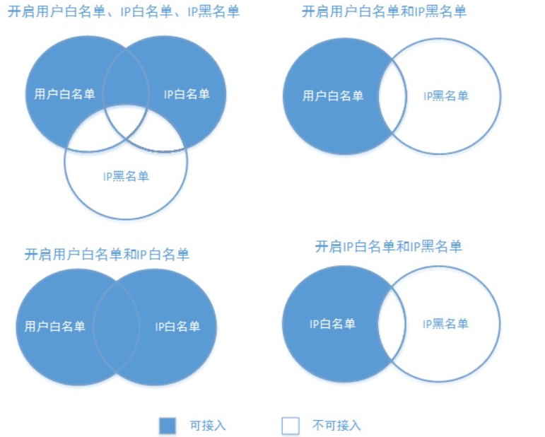

**配置用户白名单<a name="zh-cn_topic_0000001835225797_section59961828792"></a>**

**前提条件**

在配置用户白名单和IP黑白名单前，请先检查是否已经配置了侦听IP（LSNR\_ADDR）和侦听端口号（LSNR\_PORT），否则黑、白名单配置将不生效。检查方法如下：

**检查方式一：**

1.  检查服务端是否设置了侦听IP和侦听端口号。

    ```
    SELECT NAME,VALUE FROM DV_PARAMETERS WHERE NAME = 'LSNR_ADDR';
    SELECT NAME,VALUE FROM DV_PARAMETERS WHERE NAME = 'LSNR_PORT';
    ```

    -   如果设置了侦听IP和侦听端口号，命令执行后的回显类似如下：

        ```
        NAME                                                             VALUE                                                           
        ---------------------------------------------------------------- ----------------------------------------------------------------
        LSNR_ADDR                                                        127.0.0.1                                                       
        
        1 rows fetched.
        ```

        ```
        NAME                                                             VALUE                                                           
        ---------------------------------------------------------------- ----------------------------------------------------------------
        LSNR_PORT                                                        1611                                                            
        
        1 rows fetched.
        ```

    -   如果未设置侦听IP和侦听端口号，请使用如下方式设置服务端侦听IP和侦听端口号，利用数据库的浮动IP功能，立即生效。

        ```
        ALTER SYSTEM ADD LSNR_ADDR '127.0.0.1';
        ```

        如：

        ```
        SQL> ALTER SYSTEM ADD LSNR_ADDR '127.0.0.1';
        
        Succeed.
        
        SQL> SELECT NAME,VALUE FROM DV_PARAMETERS WHERE NAME = 'LSNR_ADDR';
        
        NAME                                                             VALUE                                                           
        ---------------------------------------------------------------- ----------------------------------------------------------------
        LSNR_ADDR                                                        127.0.0.1                                         
        
        1 rows fetched.
        ```

**检查方法二：**

1.  检查服务端是否设置了侦听IP和侦听端口号。

    ```
    SELECT NAME,VALUE FROM DV_PARAMETERS WHERE NAME = 'LSNR_ADDR';
    SELECT NAME,VALUE FROM DV_PARAMETERS WHERE NAME = 'LSNR_PORT';
    ```

    -   如果设置了侦听IP和侦听端口号，命令执行后的回显类似如下：

        ```
        NAME                                                             VALUE                                                           
        ---------------------------------------------------------------- ----------------------------------------------------------------
        LSNR_ADDR                                                        127.0.0.1                                                       
        
        1 rows fetched.
        ```

        ```
        NAME                                                             VALUE                                                           
        ---------------------------------------------------------------- ----------------------------------------------------------------
        LSNR_PORT                                                        1611                                                            
        
        1 rows fetched.
        ```

    -   如果未设置侦听IP和侦听端口号，请使用如下命令设置服务端侦听IP和侦听端口号

        当回显显示Succeed后，执行[2](#zh-cn_topic_0000001835225797_li11333101103)。

        ```
        ALTER SYSTEM SET LSNR_ADDR='127.0.0.1'; 
        ALTER SYSTEM SET LSNR_PORT = 1611;
        ```

2.  <a name="zh-cn_topic_0000001835225797_li11333101103"></a>重启数据库使配置侦听IP和侦听端口号生效。

    ```
    cd ${CTDB_DATA}/bin
    cms res -stop db
    cms res -start db
    ```

**操作步骤（方法一）**

假设服务器IP为127.0.0.1，侦听端口号为1611。配置用户白名单提供两种方法可选。

1.  使用安装Cantian引擎的操作系统用户，登录Cantian引擎所在服务器。
2.  以数据库系统管理员sys用户登录数据库，查询已配置的用户白名单。

    ```
    ctsql sys/password@127.0.0.1:1611 
    SELECT * FROM SYS.DV_HBA;
    ```

    ```
    TYPE                               USER_NAME                      ADDRESS                                                         
    ---------------------------------- ------------------------------ ----------------------------------------------------------------
    host                               *                              127.0.0.1/32,::1/128                                            
    
    1 rows fetched.
    ```

1.  执行sql语句添加hba条目，需要依次输入type、user、address。回显显示Succeed表示添加成功。

    ```
    ALTER SYSTEM ADD HBA ENTRY 'host user2 192.168.3.222,192.168.3.225,192.168.8.0/24';
    ```

    例如：

    ```
    SQL> ALTER SYSTEM ADD HBA ENTRY 'host * 192.168.3.222,192.168.3.225,192.168.8.0/24';
    
    Succeed.
    
    ```

    添加完成后，可执行以下命令查看。

    ```
    SQL> SELECT * FROM SYS.DV_HBA;
    
    TYPE                                   USER_NAME                             ADDRESS                                                         
    -------------------------------------- ------------------------------------- ----------------------------------------------------------------
    host                                   *                                     127.0.0.1/32,::1/128                                            
    host                                   *                                     192.168.3.222/32,192.168.3.225/32,192.168.8.0/24                
    
    2 rows fetched.
    ```

1.  在线删除实例的某些用户白名单条目。回显显示Succeed表示删除成功。

    ```
    ALTER SYSTEM DELETE HBA ENTRY 'host user2 192.168.3.222,192.168.3.225,192.168.8.0/24';
    ```

    例如：

    ```
    ALTER SYSTEM DELETE HBA ENTRY 'host * 192.168.3.222,192.168.3.225,192.168.8.0/24';
    
    SQL> 
    Succeed.
    
    ```

    删除完成后，执行以下命令查看。

    ```
    SQL> SELECT * FROM SYS.DV_HBA;
    
    TYPE                               USER_NAME                      ADDRESS                                                         
    ---------------------------------- ------------------------------ ----------------------------------------------------------------
    host                               *                              127.0.0.1/32,::1/128                                            
    
    1 rows fetched.
    ```

    > **说明：** 
    >-   用户白名单只对使用TCP协议连接数据库的用户有效。
    >-   host可配置为host或者hostssl，分别表示普通TCP或SSL连接。
    >-   如果user为“\*”或\*，表示所有用户。
    >-   单行只能指定一个用户。
    >    address列表声明允许连接的指定用户的IP地址范围，可以逗号分隔声明多个。各hba条目间无关联关系，声明顺序不影响功能。
    >-   如果user中包含特殊字符（例如\#、TAB键等特殊字符）需要写成“user”格式。例如：host "\#abc" 127.0.0.1、host "abc" 127.0.0.1表示将双引号中的字符串整体作为user。
    >-   IP地址支持IPv4、IPv6地址、或指定子网掩码长度表示一个子网网段。如下均为合法格式：
    >    -   \*.\*.\*.\*和0.0.0.0/0均表示全网段主机。
    >    -   192.168.3.222表示一个IPv4主机。
    >    -   192.168.3.0/24表示一个IPv4子网网段192.168.3.0所有IP。
    >    -   fe80:0000:0000:0000:0000:0000:0000:0000表示一个IPv6主机。
    >    -   fe80:0000:0000:0000:0000:0000:0000:0000/64表示前缀为64的IPv6网段。
    >-   sql语句在线添加hba条目时。语法中建议使用单引号或者括号。
    >-   cthba.conf文件最大存储空间为1MB。
    >-   cthba.conf文件中出现重复的用户名和ip，如果host或者hostssl模式不一致，Cantian引擎则按照安全级别高的hostssl模式生效；如果想使用host普通模式连接，需要把重复的设置为hostssl模式的用户名和ip删除即可。

**操作步骤（方法二）**

1.  使用安装Cantian引擎的操作系统用户，登录Cantian引擎所在服务器。
2.  查询已配置的用户白名单

    ```
    ctsql sys/password@127.0.0.1:1611 
    SELECT * FROM SYS.DV_HBA;
    ```

    返回

    ```
    TYPE                               USER_NAME                      ADDRESS                                                         
    ---------------------------------- ------------------------------ ----------------------------------------------------------------
    host                               *                              127.0.0.1/32,::1/128                                            
    
    1 rows fetched.
    ```

1.  在cthba.conf文件中添加hba条目，格式为type、user、address。

    ```
    cd ${CTDB_DATA}/cfg
    vim cthba.conf
    host user 127.0.0.1,192.168.3.222,fe80:0000:0000:0000:0000:0000:0000:0000/64
    ```

    > **说明：** 
    >编辑cthba.conf文件和执行sql语句添加hba条目时，空格不能使用Tab键输入，否则，在线加载用户白名单时会报错。

1.  在线加载用户白名单。
    1.  执行以下命令连接ctsql。

        ```
        ctsql sys/password@127.0.0.1:1611
        ```

    1.  数据库实例运行时，通过下面的语句在线加载用户白名单，立即生效，返回Succeed。

        ```
        ALTER SYSTEM RELOAD HBA CONFIG;
        ```

    1.  通过查询视图DV\_HBA确认用户白名单是否配置成功。

        ```
        SELECT * FROM SYS.DV_HBA;
        ```

        回显类似如下：

        ```
        TYPE                                   USER_NAME                                        ADDRESS                                                         
        -------------------------------------- ------------------------------------------------ ----------------------------------------------------------------
        host                                   *                                                127.0.0.1/32,192.168.3.222/32,fe80::/64                         
        host                                   *                                                127.0.0.1/32,::1/128                                            
        
        2 rows fetched.
        
        ```

**配置IP黑、白名单<a name="zh-cn_topic_0000001835225797_section1321275818210"></a>**

**注意事项**

-   开启IP白名单检测功能前，要求至少配置了TCP\_INVITED\_NODES或TCP\_EXCLUDED\_NODES中的一种，否则将报如下错误：

    ```
    CT-00254 : For invited and excluded nodes is both empty, ip whitelist function can't be enabled
    ```

-   SYS用户本地登录不受黑白名单限制。

**前提条件**

在配置用户白名单和IP黑白名单前，请先检查是否已经配置了侦听IP（LSNR\_ADDR）和侦听端口号（LSNR\_PORT），否则黑白名单配置将不生效。检查方法如下：

**检查方法一：**

1.  检查服务端是否设置了侦听IP和侦听端口号。

    ```
    SELECT NAME,VALUE FROM DV_PARAMETERS WHERE NAME = 'LSNR_ADDR';
    SELECT NAME,VALUE FROM DV_PARAMETERS WHERE NAME = 'LSNR_PORT';
    ```

    -   如果设置了侦听IP和侦听端口号，回显类似如下：

        ```
        NAME                                                             VALUE                                                           
        ---------------------------------------------------------------- ----------------------------------------------------------------
        LSNR_ADDR                                                        127.0.0.1                                                       
        
        1 rows fetched.
        ```

        ```
        NAME                                                             VALUE                                                           
        ---------------------------------------------------------------- ----------------------------------------------------------------
        LSNR_PORT                                                        1611                                                            
        
        1 rows fetched.
        ```

    -   如果未设置侦听IP和侦听端口号，请使用如下方式设置服务端侦听IP和侦听端口号，利用数据库的浮动IP功能，立即生效。

        ```
        ALTER SYSTEM ADD LSNR_ADDR '192.168.1.1';
        ```

**检查方法二：**

1.  检查服务端是否设置了侦听IP和侦听端口号。

    ```
    SELECT NAME,VALUE FROM DV_PARAMETERS WHERE NAME = 'LSNR_ADDR';
    SELECT NAME,VALUE FROM DV_PARAMETERS WHERE NAME = 'LSNR_PORT';
    ```

    -   如果设置了侦听IP和侦听端口号，回显类似如下：

        ```
        NAME                                                             VALUE                                                           
        ---------------------------------------------------------------- ----------------------------------------------------------------
        LSNR_ADDR                                                        127.0.0.1                                                       
        
        1 rows fetched.
        ```

        ```
        NAME                                                             VALUE                                                           
        ---------------------------------------------------------------- ----------------------------------------------------------------
        LSNR_PORT                                                        1611                                                            
        
        1 rows fetched.
        ```

    -   如果未设置侦听IP和侦听端口号，请使用如下命令设置服务端侦听IP和侦听端口号，返回Succeed表示设置成功。

        ```
        ALTER SYSTEM SET LSNR_ADDR='127.0.0.1';
        ALTER SYSTEM SET LSNR_PORT = 1611;
        ```

2.  重启数据库使配置侦听IP和侦听端口号生效。

    ```
    cd ${CTDB_DATA}/bin
    cms res -stop db
    cms res -start db
    ```

**操作步骤**

假设安装Cantian引擎的主机IP为127.0.0.1，侦听端口号为1611。需配置的远程连接IP为192.168.2.\*，需禁止接入的IP为192.168.10.\*，192.168.2.225。

1.  使用安装Cantian引擎的操作系统用户，登录Cantian引擎所在服务器。
2.  查询已配置的IP白名单和IP黑名单。

    ```
    ctsql sys/password@127.0.0.1:1611
    SELECT VALUE FROM DV_PARAMETERS WHERE NAME = 'TCP_INVITED_NODES'; 
    SELECT VALUE FROM DV_PARAMETERS WHERE NAME = 'TCP_EXCLUDED_NODES';
    ```

    ```
    VALUE                                                           
    ----------------------------------------------------------------
    
    1 rows fetched.
    ```

    ```
    VALUE                                                        
    ----------------------------------------------------------------
    
    1 rows fetched.
    ```

3.  在线配置IP白名单或IP黑名单。该配置立即生效，无需重启数据库。

    > **说明：** 
    >白名单设置子网字符串不能超过1024字节，如果超过会报错。

    -   配置IP白名单。

        ```
        ALTER SYSTEM SET TCP_INVITED_NODES = '(127.0.0.1,192.168.1.1, 192.168.2.*)';
        ```

        ```
        SQL> SELECT VALUE FROM DV_PARAMETERS WHERE NAME = 'TCP_INVITED_NODES'
        
        VALUE                                                           
        ----------------------------------------------------------------
        
        
        1 rows fetched.
        
        SQL> ALTER SYSTEM SET TCP_INVITED_NODES = '(127.0.0.1,192.168.1.1, 192.168.2.*)';
        
        Succeed.
        
        SQL> SELECT VALUE FROM DV_PARAMETERS WHERE NAME = 'TCP_INVITED_NODES';
        
        VALUE                                                           
        ----------------------------------------------------------------
        (127.0.0.1,192.168.1.1, 192.168.2.*)                            
        
        1 rows fetched.
        ```

    -   配置IP黑名单。

        ```
        ALTER SYSTEM SET TCP_EXCLUDED_NODES = '(192.168.10.*, 192.168.2.225)';
        ```

        例如

        ```
        SQL> SELECT VALUE FROM DV_PARAMETERS WHERE NAME = 'TCP_EXCLUDED_NODES';
        
        VALUE                                                           
        ----------------------------------------------------------------
        
        
        1 rows fetched.
        
        SQL> ALTER SYSTEM SET TCP_EXCLUDED_NODES = '(192.168.10.*, 192.168.2.225)';
        
        Succeed.
        
        SQL> SELECT VALUE FROM DV_PARAMETERS WHERE NAME = 'TCP_EXCLUDED_NODES';
        
        VALUE                                                           
        ----------------------------------------------------------------
        (192.168.10.*, 192.168.2.225)                                   
        
        1 rows fetched.
        ```

4.  在线开启IP白名单检测功能。该配置立即生效，无需重启数据库。

    ```
    ALTER SYSTEM SET TCP_VALID_NODE_CHECKING = TRUE;
    ```

    配置后可以执行如下命令检查：

    ```
    SELECT NAME, RUNTIME_VALUE, VALUE FROM DV_PARAMETERS WHERE NAME = 'TCP_VALID_NODE_CHECKING';
    ```

    ```
    NAME                               RUNTIME_VALUE                              VALUE                                                           
    ---------------------------------- ------------------------------------------ ----------------------------------------------
    TCP_VALID_NODE_CHECKING            TRUE                                       TRUE                                                           
    
    1 rows fetched.
    ```

#### 配置SSL私钥加密密钥<a name="ZH-CN_TOPIC_0000001835274309"></a>

**配置说明：**数据库配置参数\_FACTOR\_KEY和LOCAL\_KEY需及时更新，以保证SSL私钥加密的安全性。

> **说明：** 
>\_FACTOR\_KEY只能通过ALTER SYSTEM SET \_FACTOR\_KEY命令进行修改，不可在cantiand.ini文件中进行配置，否则会导致数据库无法启动。

**配置方法：**

使用数据库安装用户登录服务器，通过ctencrypt工具生成密钥，其中Key为密钥因子（\_FACTOR\_KEY），WorkKey为工作密钥（LOCAL\_KEY）。

```
ctencrypt -g
Key:          /jfXnJ5wO9YdqBU5Dbn8Lw== 
WorkKey:  FOzcFzoWgbtStBCN5KHwVcPuSZ0Q+PpU5Qk/8AjS0rACgx2RLAJ2WKzHIP3FHXh35oIfPKJgLAWfzwMtjl89nQ==
```

数据库实例运行时，通过ALTER SYSTEM语句在线配置本地登录密钥，重启数据库生效。

```
ALTER SYSTEM SET _FACTOR_KEY = '/jfXnJ5wO9YdqBU5Dbn8Lw==';
ALTER SYSTEM SET LOCAL_KEY = 'FOzcFzoWgbtStBCN5KHwVcPuSZ0Q+PpU5Qk/8AjS0rACgx2RLAJ2WKzHIP3FHXh35oIfPKJgLAWfzwMtjl89nQ==';
```

> **说明：** 
>-   在线配置本地登录密钥时，请先修改\_FACTOR\_KEY后再修改LOCAL\_KEY参数。如果直接修改LOCAL\_KEY会提示密钥无效。
>-   如果cantiand.ini配置文件中SSL证书配置或者cantian\_key文件被修改，重启数据库后，需要重新生成工作密钥和密钥因子。按照如下方法配置后，数据库可恢复正常连接。
>    1.  删除SSL\_KEY\_PASSWORD行。
>        1.  服务端：进入cantiand.ini配置文件，删除SSL\_KEY\_PASSWORD行。
>            ```
>            cd ${CTDB_DATA}/cfg/
>            vim cantiand.ini
>            ```
>        2.  客户端：进入.bashrc文件，删除CTSQL\_SSL\_KEY\_PASSWD行。
>    2.  参考以上“配置方法”生成\_FACTOR\_KEY和LOCAL\_KEY并在线配置本地登录密钥。
>    3.  用SSL进行安全的TCP/IP连接重新配置服务端和客户端SSL私钥加密密钥。
>        1.  执行如下命令，生成加密密码密文（SSL\_KEY\_PASSWORD）。
>            ```
>            ctencrypt -e aes256 -f jQ4IAgxiJR1ezCPrvtZLUQ== -k 8Vw4Gm2Ktu7B8XIzTlVRK9EOH+lpSNbIlhfVbaJ0RDdbgyUyHsYT6UxYGSEbZg7BXki6gSP8slEU8haWxiUgNg==
>            --输入私钥证书的显示密码（以Aa123456为例），生成密码加密密文。 
>            Please enter password to encrypt:  ******** 
>            Please input password again:  ******** 
>            Cipher:         PLFJgfZwLSOJFRp6o7qsj604fFwPEu2MLxH7m/F/aMg=
>            ```
>            -   -e指使用AES算法\(256位密钥\)对产生的私钥加密，-f指的是\_FACTOR\_KEY的值，-k指的是LOCAL\_KEY的值。-f和-K的值可参考配置SSL私钥加密密钥章节。
>            -   证书私钥属于安全敏感数据，强烈建议用户使用加密的证书私钥，并定期更新Cantian引擎加密密钥，保证数据安全性。
>            -   加密密码复杂度与数据库密码要求一致。
>            -   建议SSL证书私钥长度不少于3072位。
>        2.  数据库实例运行时，更新SSL私钥证书密码密文（以Aa123456为例），或者更新配置文件对应的配置选项：
>            ```
>            alter system set SSL_KEY_PASSWORD = 'PLFJgfZwLSOJFRp6o7qsj604fFwPEu2MLxH7m/F/aMg=';
>            ```

**检查方法：**检查\_FACTOR\_KEY和LOCAL\_KEY两个参数的值，查询命令如下：

```
SELECT NAME, VALUE FROM DV_PARAMETERS WHERE (NAME = '_FACTOR_KEY' ) or (NAME = 'LOCAL_KEY');
```

**预期结果：**

```
NAME                                                             VALUE                                                           
---------------------------------------------------------------- ----------------------------------------------------------------
LOCAL_KEY                                                        FOzcFzoWgbtStBCN5KHwVcPuSZ0Q+PpU5Qk/8AjS0rACgx2RLAJ2WKzHIP3FHXh35oIfPKJgLAWfzwMtjl89nQ==
_FACTOR_KEY                                                      /jfXnJ5wO9YdqBU5Dbn8Lw==                                        

2 rows fetched.
```

**风险等级：**高

#### 配置非鉴权会话老化时间<a name="ZH-CN_TOPIC_0000001788475148"></a>

建立连接需要三步：connect、auth-init、login，非鉴权会话是指没有经过login步骤的会话。

为防止客户端恶意DOS攻击，占用服务端会话资源。配置UNAUTH\_SESSION\_EXPIRE\_TIME指定客户端TCP建立完，指定时间不鉴权，服务端强制断开连接。

**配置方法：**

支持如下两种方式开启此功能：

-   在cantiand.ini配置文件中配置参数UNAUTH\_SESSION\_EXPIRE\_TIME的值，立即生效。cantiand.ini文件的存储路径为$\{_CTDB\_DATA_\}/cfg/cantiand.ini。

-   数据库实例运行时，通过ALTER SYSTEM语句在线配置非鉴权会话老化时间。

    ```
    ALTER SYSTEM SET UNAUTH_SESSION_EXPIRE_TIME = 60 SCOPE = BOTH;
    ```

**默认值：**60

**检查方法：**

```
SELECT NAME, VALUE FROM DV_PARAMETERS WHERE NAME = 'UNAUTH_SESSION_EXPIRE_TIME';
```

**预期结果：**

```
       
NAME                                                             VALUE                                                           
---------------------------------------------------------------- ----------------------------------------------------------------
UNAUTH_SESSION_EXPIRE_TIME                                       60                                                              

1 rows fetched.
```

**风险等级：**低

#### 关闭SYS用户远程登录功能<a name="ZH-CN_TOPIC_0000001835234397"></a>

**配置说明：**ENABLE\_SYS\_REMOTE\_LOGIN参数允许SYS用户远程登录数据库，建议业务规划独立的数据库用户进行远程连接，并关闭SYS用户远程登录功能。

**配置方法：**

支持如下两种方式关闭此功能：

-   在cantiand.ini配置文件中修改参数ENABLE\_SYS\_REMOTE\_LOGIN的值，重启数据库生效。cantiand.ini文件的存储路径为$\{CTDB\_DATA\}/cfg/cantiand.ini
-   数据库实例运行时，通过ALTER SYSTEM语句在线配置为FALSE。

    ```
    ALTER SYSTEM SET ENABLE_SYS_LOGIN = FALSE;
    ```

**默认值：**FALSE

**检查方法：**

```
SELECT NAME, VALUE FROM DV_PARAMETERS WHERE NAME = 'ENABLE_SYS_REMOTE_LOGIN';
```

**预期结果：**

```
NAME                                                             VALUE                                                           
---------------------------------------------------------------- ----------------------------------------------------------------
ENABLE_SYS_REMOTE_LOGIN                                          FALSE                                                           
1 rows fetched.

```

例如，以cantian用户为例，双节点部署，试图通过节点0（192.168.86.1）以sys用户远程登录节点1（192.168.86.2），登录不被允许。

```
[cantian@8b1e3c6df9fb ~]$ ctsql sys/password@192.168.86.2:1611

Warning: SSL connection to server without CA certificate is insecure. Continue anyway? (y/n):y
CT-01000, Sys user only can login with local host

```

**风险等级：**中

### 管理用户、角色和权限<a name="ZH-CN_TOPIC_0000001788634812"></a>

Cantian引擎支持基于角色的访问控制机制，通过管控用户、角色和权限提升数据库安全性。

**检查未知用户<a name="zh-cn_topic_0000001788466628_section232799173414"></a>**

**配置说明：**

未知用户是指创建原因未知的用户。未知用户会威胁数据库安全，因此需要定期检视用户，确认每个用户的用途，并删除不必要的用户，确保不存在未知用户。

SYS用户和PUBLIC用户，是系统预置用户。

-   SYS用户用于初始创建数据库实例。
-   如果授予一个权限给用户"PUBLIC"，表示该权限授予了该数据库的所有用户。例如：**GRANT SELECT ON USER1.T1 TO PUBLIC;**，表示把一个对象T1的SELECT权限给所有用户，所有用户都可以访问该表T1。例如：**GRANT DBA TO PUBLIC;**，表示所有用户均具有DBA角色拥有的所有系统权限。

**默认值：**SYS、PUBLIC

**检查方法：**

```
SELECT USERNAME FROM DB_USERS;
```

**预期结果：**当前系统中所有用户。

```
USERNAME                                                        
----------------------------------------------------------------
SYS                                                             
PUBLIC                                                                                                              

2 rows fetched.

```

**风险等级：**中

> **说明：** 
>若检查结果中存在未知用户，请在确认该未知用户未在使用后再进行删除。

**配置方法：**

```
DROP USER user_name CASCADE;
```

**检查DBA角色<a name="zh-cn_topic_0000001788466628_section18456194563410"></a>**

**检查说明：**

DBA角色拥有所有的系统权限，因此需要谨慎使用此角色。建议使用没有继承DBA角色的用户连接数据库。

**检查方法：**

```
SELECT GRANTEE FROM ADM_ROLE_PRIVS WHERE GRANTED_ROLE = 'DBA' AND GRANTEE NOT IN ('SYS','OMM');
```

**预期结果：**所要查看用户的角色。

```
GRANTEE                                                          PRIVILEGE                   
---------------------------------------------------------------- ----------------------------

0 rows fetched.

```

**风险等级：**中

> **说明：** 
>检查后，如果有用户被授予DBA角色，确认不需要后再配置删除。

**配置方法：**

回收用户本身或其继承角色的DBA角色。

```
REVOKE DBA FROM user_name; 
REVOKE DBA FROM role_name;
```

**检查CREATE USER权限<a name="zh-cn_topic_0000001788466628_section5375141616351"></a>**

**检查说明：**

拥有CREATE USER权限的用户可以创建其他用户，如果用户不需要此权限，进行权限回收。

> **说明：** 
>若使用ENCRYPTED方式创建用户，无法校验密文对应的明文密码是否符合用户profile指定的PASSWORD\_MIN\_LEN参数要求。不推荐采用此方式创建用户，管理员可选择设置enable\_password\_cipher参数关闭使用ENCRYPTED方式创建用户。

**检查方法：**

```
SELECT GRANTEE, PRIVILEGE FROM ADM_SYS_PRIVS WHERE PRIVILEGE='CREATE USER' AND GRANTEE NOT IN ('DBA','SYS');
```

**预期结果：**无

```
GRANTEE                                                          PRIVILEGE                   
---------------------------------------------------------------- ----------------------------

0 rows fetched.

```

**风险等级：**中

> **说明：** 
>检查后，如果有用户被授予CREATE USER权限，确认不需要后再配置删除。

**配置方法：**

回收用户本身或其继承角色的CREATE USER权限。

```
REVOKE CREATE USER FROM user_name; 
REVOKE CREATE USER FROM role_name;
```

**检查ALTER USER权限<a name="zh-cn_topic_0000001788466628_section8921932173516"></a>**

**检查说明：**

拥有ALTER USER权限的用户可以修改其他用户，如果用户不需要此权限，进行权限回收。

**检查方法：**

```
SELECT GRANTEE, PRIVILEGE FROM ADM_SYS_PRIVS WHERE PRIVILEGE='ALTER USER' AND GRANTEE NOT IN ('DBA','SYS');
```

**预期结果：**无

```
GRANTEE                                                          PRIVILEGE                   
---------------------------------------------------------------- ----------------------------

0 rows fetched.

```

**风险等级：**中

> **说明：** 
>检查后，如果有用户被授予ALTER USER权限，确认不需要后再配置删除。

**配置方法：**

回收用户本身或其继承角色的ALTER USER权限。

```
REVOKE ALTER USER FROM user_name;
REVOKE ALTER USER FROM role_name;
```

**检查DROP USER权限<a name="zh-cn_topic_0000001788466628_section551315489358"></a>**

**检查说明：**

拥有DROP USER权限的用户可以删除其他用户，如果用户不需要此权限，进行权限回收。

**检查方法：**

```
SELECT GRANTEE, PRIVILEGE FROM ADM_SYS_PRIVS WHERE PRIVILEGE='DROP USER' AND GRANTEE NOT IN ('DBA','SYS');
```

**预期结果：**无

```
GRANTEE                                                          PRIVILEGE                   
---------------------------------------------------------------- ----------------------------

0 rows fetched.

```

**风险等级：**中

> **说明：** 
>检查后，如果有用户被授予DROP USER权限，确认不需要后再配置删除。

**配置方法：**

回收用户本身或其继承角色的DROP USER权限。

```
REVOKE DROP USER FROM user_name; 
REVOKE DROP USER FROM role_name;
```

**检查CREATE DATABASE权限<a name="zh-cn_topic_0000001788466628_section1437684103619"></a>**

**检查说明：**

拥有CREATE DATABASE权限的用户可以创建数据库，如果用户不需要此权限，进行权限回收。

**检查方法：**

```
SELECT GRANTEE, PRIVILEGE FROM ADM_SYS_PRIVS WHERE PRIVILEGE='CREATE DATABASE' AND GRANTEE NOT IN ('DBA','SYS');
```

**预期结果：**

```
GRANTEE                                                          PRIVILEGE                   
---------------------------------------------------------------- ----------------------------

0 rows fetched.

```

**风险等级：**中

> **说明：** 
>检查后，如果有用户被授予CREATE DATABASE权限，确认不需要后再配置删除。

**配置方法：**

回收用户本身或其继承角色的CREATE DATABASE权限。

```
REVOKE CREATE DATABASE FROM user_name; 
REVOKE CREATE DATABASE FROM role_name;
```

**控制拥有WITH ADMIN OPTION属性的用户<a name="zh-cn_topic_0000001788466628_section6938101618361"></a>**

**配置说明：**

拥有WITH ADMIN OPTION权限属性的用户可以把对应的系统权限授予给其他需要拥有此属性的用户，以保护数据库的安全。

**检查方法：**

```
SELECT * FROM ADM_SYS_PRIVS WHERE ADMIN_OPTION = 'YES' AND GRANTEE NOT IN ('SYS', 'DBA');
```

**预期结果：**

```
GRANTEE                                                          PRIVILEGE                    ADMIN_OPTION
---------------------------------------------------------------- ---------------------------- ------------

0 rows fetched.

```

**风险等级：**中

> **说明：** 
>检查后，如果有用户拥有WITH ADMIN OPTION权限，确认不需要后再配置删除。

**配置方法：**（以SELECT ANY TABLE为例）

1.  回收用户拥有的某个系统权限。

    ```
    REVOKE SELECT ANY TABLE FROM user_name;
    ```

2.  重新授予该用户需要的系统权限，并且不再携带WITH ADMIN OPTION属性。

    ```
    GRANT SELECT ANY TABLE TO user_name;
    ```

**控制拥有WITH GRANT OPTION属性的用户<a name="zh-cn_topic_0000001788466628_section52611293364"></a>**

**配置说明：**

拥有WITH GRANT OPTION权限属性的用户可以把对象权限授权给其他用户，需要控制拥有此属性的用户，以保护该数据库数据的安全。

不支持收回权限的WITH GRANT OPTION属性，只支持回收整个权限。

**检查方法：**

```
SELECT * FROM ADM_TAB_PRIVS WHERE GRANTABLE = 'YES';
```

**预期结果：**

```
GRANTEE              OWNER                    OBJECT_NAME                      OBJECT_TYPE PRIVILEGE            GRANTABLE
-------------------- ------------------------ -------------------------------- -------------------------------- ---------

0 rows fetched.

```

**风险等级：**中

> **说明：** 
>检查后，如果有用户拥有WITH GRANT OPTION权限，确认不需要后再配置删除。

**配置方法：**

1.  回收用户拥有的某个对象的权限。

    ```
    REVOKE SELECT ANY TABLE FROM user_name;
    ```

2.  重新授予该用户需要的对象权限，并且不再携带WITH GRANT OPTION属性。

    ```
    GRANT SELECT ANY TABLE TO user_name;
    ```

**控制拥有GRANT ANY PRIVILEGE权限的用户<a name="zh-cn_topic_0000001788466628_section488175363616"></a>**

**检查说明：**

拥有GRANT ANY PRIVILEGE权限的用户可以将任何系统权限赋予任何用户，需要谨慎授予用户该权限。

**检查方法：**

```
SELECT GRANTEE, PRIVILEGE FROM ADM_SYS_PRIVS WHERE PRIVILEGE='GRANT ANY PRIVILEGE' AND GRANTEE NOT IN ('DBA','SYS');
```

**预期结果：**

```
GRANTEE                                                          PRIVILEGE                   
---------------------------------------------------------------- ----------------------------

0 rows fetched.

```

**风险等级：**中

> **说明：** 
>检查后，如果有用户拥有GRANT ANY PRIVILEGE权限，确认不需要后再配置删除。

**配置方法：**

回收用户本身或其继承角色的GRANT ANY PRIVILEGE权限。

```
REVOKE GRANT ANY PRIVILEGE FROM user_name; 
REVOKE GRANT ANY PRIVILEGE FROM role_name;
```

**控制拥有GRANT ANY ROLE权限的用户<a name="zh-cn_topic_0000001788466628_section12541154943614"></a>**

**检查说明：**

同时拥有GRANT ANY ROLE和GRANT ANY PRIVILEGE权限的用户可以将系统中任何角色（包括DBA角色）授予其它用户，需要谨慎授予用户该权限。

**检查方法：**

```
SELECT GRANTEE, PRIVILEGE FROM ADM_SYS_PRIVS WHERE PRIVILEGE='GRANT ANY ROLE' AND GRANTEE NOT IN ('DBA','SYS');
```

**预期结果：**

```
GRANTEE                                                          PRIVILEGE                   
---------------------------------------------------------------- ----------------------------

0 rows fetched.
```

**风险等级：**中

> **说明：** 
>检查后，如果有用户被授予GRANT ANY ROLE权限，确认不需要后再配置删除。

**配置方法：**

回收用户本身或其继承角色的GRANT ANY ROLE权限。

```
REVOKE GRANT ANY ROLE FROM user_name; 
REVOKE GRANT ANY ROLE FROM role_name;
```

**控制拥有GRANT ANY OBJECT PRIVILEGE权限的用户<a name="zh-cn_topic_0000001788466628_section1597875112394"></a>**

**检查说明：**

拥有GRANT ANY OBJECT PRIVILEGE权限的用户可以将任何对象权限赋予任何用户，需要谨慎授予用户该权限。

**检查方法：**

```
SELECT GRANTEE, PRIVILEGE FROM ADM_SYS_PRIVS WHERE PRIVILEGE='GRANT ANY OBJECT PRIVILEGE' AND GRANTEE NOT IN ('DBA','SYS');
```

**预期结果：**

```
GRANTEE                                                          PRIVILEGE                   
---------------------------------------------------------------- ----------------------------

0 rows fetched.
```

**风险等级：**中

> **说明：** 
>检查后，如果有用户被授予GRANT ANY OBJECT PRIVILEGE权限，确认不需要后再配置删除。

**配置方法：**

回收用户本身或其继承角色的GRANT ANY OBJECT PRIVILEGE权限。

```
REVOKE GRANT ANY OBJECT PRIVILEGE FROM user_name; 
REVOKE GRANT ANY OBJECT PRIVILEGE FROM role_name;
```

**禁止向public用户授予对象权限<a name="zh-cn_topic_0000001788466628_section16914747153919"></a>**

**配置说明：**

public用户属于任何用户，为了保障数据库的数据安全，禁止向public用户授予对象权限。

**配置方法：**

```
REVOKE ALL ON object_name FROM public;
```

**检查方法：**

```
SELECT * FROM ADM_TAB_PRIVS WHERE GRANTEE='PUBLIC';
```

**预期结果：**只有系统默认授予的权限，如[表1](#zh-cn_topic_0000001788466628_table1306102212716)所示。

**风险等级：**中

> **说明：** 
>1.  INHERIT PRIVILEGES权限表示用户信任所有其他用户的对象（触发器、存储过程、自定义函数、自定义高级包）不包含风险操作，本章节主要关注public用户是否被授予了对象权限。
>2.  本章节的PROCEDURE为广义上的存储过程（包括存储过程，自定义类型，自定义函数，高级包），对象的详细类型，参考视图ADM\_OBJECTS。

**表 1**  public用户系统默认授予的权限

<a name="zh-cn_topic_0000001788466628_table1306102212716"></a>
<table><thead align="left"><tr id="zh-cn_topic_0000001788466628_row96486221273"><th class="cellrowborder" valign="top" width="13.75724855028994%" id="mcps1.2.7.1.1"><p id="zh-cn_topic_0000001788466628_p1764819221975"><a name="zh-cn_topic_0000001788466628_p1764819221975"></a><a name="zh-cn_topic_0000001788466628_p1764819221975"></a>受权者GRANTEE</p>
</th>
<th class="cellrowborder" valign="top" width="12.9374125174965%" id="mcps1.2.7.1.2"><p id="zh-cn_topic_0000001788466628_p36492221879"><a name="zh-cn_topic_0000001788466628_p36492221879"></a><a name="zh-cn_topic_0000001788466628_p36492221879"></a>对象所属用户名OWNER</p>
</th>
<th class="cellrowborder" valign="top" width="27.924415116976604%" id="mcps1.2.7.1.3"><p id="zh-cn_topic_0000001788466628_p176497225712"><a name="zh-cn_topic_0000001788466628_p176497225712"></a><a name="zh-cn_topic_0000001788466628_p176497225712"></a>对象名称OBJECT_NAME</p>
</th>
<th class="cellrowborder" valign="top" width="12.047590481903619%" id="mcps1.2.7.1.4"><p id="zh-cn_topic_0000001788466628_p2649722470"><a name="zh-cn_topic_0000001788466628_p2649722470"></a><a name="zh-cn_topic_0000001788466628_p2649722470"></a>对象类型OBJECT_TYPE</p>
</th>
<th class="cellrowborder" valign="top" width="16.666666666666664%" id="mcps1.2.7.1.5"><p id="zh-cn_topic_0000001788466628_p76497221711"><a name="zh-cn_topic_0000001788466628_p76497221711"></a><a name="zh-cn_topic_0000001788466628_p76497221711"></a>权限PRIVILEGE</p>
</th>
<th class="cellrowborder" valign="top" width="16.666666666666664%" id="mcps1.2.7.1.6"><p id="zh-cn_topic_0000001788466628_p176492228712"><a name="zh-cn_topic_0000001788466628_p176492228712"></a><a name="zh-cn_topic_0000001788466628_p176492228712"></a>GRANTABLE选项。拥有此选项的用户才能给其他的用户授予该权限。</p>
</th>
</tr>
</thead>
<tbody><tr id="zh-cn_topic_0000001788466628_row10649142212713"><td class="cellrowborder" valign="top" width="13.75724855028994%" headers="mcps1.2.7.1.1 "><p id="zh-cn_topic_0000001788466628_p126491221078"><a name="zh-cn_topic_0000001788466628_p126491221078"></a><a name="zh-cn_topic_0000001788466628_p126491221078"></a>PUBLIC</p>
</td>
<td class="cellrowborder" valign="top" width="12.9374125174965%" headers="mcps1.2.7.1.2 "><p id="zh-cn_topic_0000001788466628_p136494221571"><a name="zh-cn_topic_0000001788466628_p136494221571"></a><a name="zh-cn_topic_0000001788466628_p136494221571"></a>SYS</p>
</td>
<td class="cellrowborder" valign="top" width="27.924415116976604%" headers="mcps1.2.7.1.3 "><p id="zh-cn_topic_0000001788466628_p764952220717"><a name="zh-cn_topic_0000001788466628_p764952220717"></a><a name="zh-cn_topic_0000001788466628_p764952220717"></a>DBE_DEBUG</p>
</td>
<td class="cellrowborder" valign="top" width="12.047590481903619%" headers="mcps1.2.7.1.4 "><p id="zh-cn_topic_0000001788466628_p11649922575"><a name="zh-cn_topic_0000001788466628_p11649922575"></a><a name="zh-cn_topic_0000001788466628_p11649922575"></a>PROCEDURE</p>
</td>
<td class="cellrowborder" valign="top" width="16.666666666666664%" headers="mcps1.2.7.1.5 "><p id="zh-cn_topic_0000001788466628_p16494221171"><a name="zh-cn_topic_0000001788466628_p16494221171"></a><a name="zh-cn_topic_0000001788466628_p16494221171"></a>EXECUTE</p>
</td>
<td class="cellrowborder" valign="top" width="16.666666666666664%" headers="mcps1.2.7.1.6 "><p id="zh-cn_topic_0000001788466628_p664913229711"><a name="zh-cn_topic_0000001788466628_p664913229711"></a><a name="zh-cn_topic_0000001788466628_p664913229711"></a>NO</p>
</td>
</tr>
<tr id="zh-cn_topic_0000001788466628_row106496221272"><td class="cellrowborder" valign="top" width="13.75724855028994%" headers="mcps1.2.7.1.1 "><p id="zh-cn_topic_0000001788466628_p1649182220719"><a name="zh-cn_topic_0000001788466628_p1649182220719"></a><a name="zh-cn_topic_0000001788466628_p1649182220719"></a>PUBLIC</p>
</td>
<td class="cellrowborder" valign="top" width="12.9374125174965%" headers="mcps1.2.7.1.2 "><p id="zh-cn_topic_0000001788466628_p4649202217711"><a name="zh-cn_topic_0000001788466628_p4649202217711"></a><a name="zh-cn_topic_0000001788466628_p4649202217711"></a>SYS</p>
</td>
<td class="cellrowborder" valign="top" width="27.924415116976604%" headers="mcps1.2.7.1.3 "><p id="zh-cn_topic_0000001788466628_p19649522676"><a name="zh-cn_topic_0000001788466628_p19649522676"></a><a name="zh-cn_topic_0000001788466628_p19649522676"></a>DBE_LOB</p>
</td>
<td class="cellrowborder" valign="top" width="12.047590481903619%" headers="mcps1.2.7.1.4 "><p id="zh-cn_topic_0000001788466628_p564919221274"><a name="zh-cn_topic_0000001788466628_p564919221274"></a><a name="zh-cn_topic_0000001788466628_p564919221274"></a>PROCEDURE</p>
</td>
<td class="cellrowborder" valign="top" width="16.666666666666664%" headers="mcps1.2.7.1.5 "><p id="zh-cn_topic_0000001788466628_p3649172217712"><a name="zh-cn_topic_0000001788466628_p3649172217712"></a><a name="zh-cn_topic_0000001788466628_p3649172217712"></a>EXECUTE</p>
</td>
<td class="cellrowborder" valign="top" width="16.666666666666664%" headers="mcps1.2.7.1.6 "><p id="zh-cn_topic_0000001788466628_p2649142217720"><a name="zh-cn_topic_0000001788466628_p2649142217720"></a><a name="zh-cn_topic_0000001788466628_p2649142217720"></a>NO</p>
</td>
</tr>
<tr id="zh-cn_topic_0000001788466628_row764914226720"><td class="cellrowborder" valign="top" width="13.75724855028994%" headers="mcps1.2.7.1.1 "><p id="zh-cn_topic_0000001788466628_p136499221475"><a name="zh-cn_topic_0000001788466628_p136499221475"></a><a name="zh-cn_topic_0000001788466628_p136499221475"></a>PUBLIC</p>
</td>
<td class="cellrowborder" valign="top" width="12.9374125174965%" headers="mcps1.2.7.1.2 "><p id="zh-cn_topic_0000001788466628_p264918221177"><a name="zh-cn_topic_0000001788466628_p264918221177"></a><a name="zh-cn_topic_0000001788466628_p264918221177"></a>SYS</p>
</td>
<td class="cellrowborder" valign="top" width="27.924415116976604%" headers="mcps1.2.7.1.3 "><p id="zh-cn_topic_0000001788466628_p16491722073"><a name="zh-cn_topic_0000001788466628_p16491722073"></a><a name="zh-cn_topic_0000001788466628_p16491722073"></a>DBE_OUTPUT</p>
</td>
<td class="cellrowborder" valign="top" width="12.047590481903619%" headers="mcps1.2.7.1.4 "><p id="zh-cn_topic_0000001788466628_p15649622272"><a name="zh-cn_topic_0000001788466628_p15649622272"></a><a name="zh-cn_topic_0000001788466628_p15649622272"></a>PROCEDURE</p>
</td>
<td class="cellrowborder" valign="top" width="16.666666666666664%" headers="mcps1.2.7.1.5 "><p id="zh-cn_topic_0000001788466628_p12649172218716"><a name="zh-cn_topic_0000001788466628_p12649172218716"></a><a name="zh-cn_topic_0000001788466628_p12649172218716"></a>EXECUTE</p>
</td>
<td class="cellrowborder" valign="top" width="16.666666666666664%" headers="mcps1.2.7.1.6 "><p id="zh-cn_topic_0000001788466628_p156491022974"><a name="zh-cn_topic_0000001788466628_p156491022974"></a><a name="zh-cn_topic_0000001788466628_p156491022974"></a>NO</p>
</td>
</tr>
<tr id="zh-cn_topic_0000001788466628_row156509221972"><td class="cellrowborder" valign="top" width="13.75724855028994%" headers="mcps1.2.7.1.1 "><p id="zh-cn_topic_0000001788466628_p196502225712"><a name="zh-cn_topic_0000001788466628_p196502225712"></a><a name="zh-cn_topic_0000001788466628_p196502225712"></a>PUBLIC</p>
</td>
<td class="cellrowborder" valign="top" width="12.9374125174965%" headers="mcps1.2.7.1.2 "><p id="zh-cn_topic_0000001788466628_p156501322478"><a name="zh-cn_topic_0000001788466628_p156501322478"></a><a name="zh-cn_topic_0000001788466628_p156501322478"></a>SYS</p>
</td>
<td class="cellrowborder" valign="top" width="27.924415116976604%" headers="mcps1.2.7.1.3 "><p id="zh-cn_topic_0000001788466628_p56503221715"><a name="zh-cn_topic_0000001788466628_p56503221715"></a><a name="zh-cn_topic_0000001788466628_p56503221715"></a>DBE_RANDOM</p>
</td>
<td class="cellrowborder" valign="top" width="12.047590481903619%" headers="mcps1.2.7.1.4 "><p id="zh-cn_topic_0000001788466628_p665042214712"><a name="zh-cn_topic_0000001788466628_p665042214712"></a><a name="zh-cn_topic_0000001788466628_p665042214712"></a>PROCEDURE</p>
</td>
<td class="cellrowborder" valign="top" width="16.666666666666664%" headers="mcps1.2.7.1.5 "><p id="zh-cn_topic_0000001788466628_p365020221178"><a name="zh-cn_topic_0000001788466628_p365020221178"></a><a name="zh-cn_topic_0000001788466628_p365020221178"></a>EXECUTE</p>
</td>
<td class="cellrowborder" valign="top" width="16.666666666666664%" headers="mcps1.2.7.1.6 "><p id="zh-cn_topic_0000001788466628_p36501422776"><a name="zh-cn_topic_0000001788466628_p36501422776"></a><a name="zh-cn_topic_0000001788466628_p36501422776"></a>NO</p>
</td>
</tr>
<tr id="zh-cn_topic_0000001788466628_row13650422277"><td class="cellrowborder" valign="top" width="13.75724855028994%" headers="mcps1.2.7.1.1 "><p id="zh-cn_topic_0000001788466628_p106501122974"><a name="zh-cn_topic_0000001788466628_p106501122974"></a><a name="zh-cn_topic_0000001788466628_p106501122974"></a>PUBLIC</p>
</td>
<td class="cellrowborder" valign="top" width="12.9374125174965%" headers="mcps1.2.7.1.2 "><p id="zh-cn_topic_0000001788466628_p12650142212719"><a name="zh-cn_topic_0000001788466628_p12650142212719"></a><a name="zh-cn_topic_0000001788466628_p12650142212719"></a>SYS</p>
</td>
<td class="cellrowborder" valign="top" width="27.924415116976604%" headers="mcps1.2.7.1.3 "><p id="zh-cn_topic_0000001788466628_p3650142214712"><a name="zh-cn_topic_0000001788466628_p3650142214712"></a><a name="zh-cn_topic_0000001788466628_p3650142214712"></a>DBE_SQL</p>
</td>
<td class="cellrowborder" valign="top" width="12.047590481903619%" headers="mcps1.2.7.1.4 "><p id="zh-cn_topic_0000001788466628_p1565013228715"><a name="zh-cn_topic_0000001788466628_p1565013228715"></a><a name="zh-cn_topic_0000001788466628_p1565013228715"></a>PROCEDURE</p>
</td>
<td class="cellrowborder" valign="top" width="16.666666666666664%" headers="mcps1.2.7.1.5 "><p id="zh-cn_topic_0000001788466628_p76501422471"><a name="zh-cn_topic_0000001788466628_p76501422471"></a><a name="zh-cn_topic_0000001788466628_p76501422471"></a>EXECUTE</p>
</td>
<td class="cellrowborder" valign="top" width="16.666666666666664%" headers="mcps1.2.7.1.6 "><p id="zh-cn_topic_0000001788466628_p206504221870"><a name="zh-cn_topic_0000001788466628_p206504221870"></a><a name="zh-cn_topic_0000001788466628_p206504221870"></a>NO</p>
</td>
</tr>
<tr id="zh-cn_topic_0000001788466628_row10650192218718"><td class="cellrowborder" valign="top" width="13.75724855028994%" headers="mcps1.2.7.1.1 "><p id="zh-cn_topic_0000001788466628_p56502221779"><a name="zh-cn_topic_0000001788466628_p56502221779"></a><a name="zh-cn_topic_0000001788466628_p56502221779"></a>PUBLIC</p>
</td>
<td class="cellrowborder" valign="top" width="12.9374125174965%" headers="mcps1.2.7.1.2 "><p id="zh-cn_topic_0000001788466628_p10650202215710"><a name="zh-cn_topic_0000001788466628_p10650202215710"></a><a name="zh-cn_topic_0000001788466628_p10650202215710"></a>SYS</p>
</td>
<td class="cellrowborder" valign="top" width="27.924415116976604%" headers="mcps1.2.7.1.3 "><p id="zh-cn_topic_0000001788466628_p1565012221973"><a name="zh-cn_topic_0000001788466628_p1565012221973"></a><a name="zh-cn_topic_0000001788466628_p1565012221973"></a>DBE_STATS</p>
</td>
<td class="cellrowborder" valign="top" width="12.047590481903619%" headers="mcps1.2.7.1.4 "><p id="zh-cn_topic_0000001788466628_p1565012221672"><a name="zh-cn_topic_0000001788466628_p1565012221672"></a><a name="zh-cn_topic_0000001788466628_p1565012221672"></a>PROCEDURE</p>
</td>
<td class="cellrowborder" valign="top" width="16.666666666666664%" headers="mcps1.2.7.1.5 "><p id="zh-cn_topic_0000001788466628_p17650322175"><a name="zh-cn_topic_0000001788466628_p17650322175"></a><a name="zh-cn_topic_0000001788466628_p17650322175"></a>EXECUTE</p>
</td>
<td class="cellrowborder" valign="top" width="16.666666666666664%" headers="mcps1.2.7.1.6 "><p id="zh-cn_topic_0000001788466628_p765012222712"><a name="zh-cn_topic_0000001788466628_p765012222712"></a><a name="zh-cn_topic_0000001788466628_p765012222712"></a>NO</p>
</td>
</tr>
<tr id="zh-cn_topic_0000001788466628_row1665014221972"><td class="cellrowborder" valign="top" width="13.75724855028994%" headers="mcps1.2.7.1.1 "><p id="zh-cn_topic_0000001788466628_p265092212720"><a name="zh-cn_topic_0000001788466628_p265092212720"></a><a name="zh-cn_topic_0000001788466628_p265092212720"></a>PUBLIC</p>
</td>
<td class="cellrowborder" valign="top" width="12.9374125174965%" headers="mcps1.2.7.1.2 "><p id="zh-cn_topic_0000001788466628_p156511022876"><a name="zh-cn_topic_0000001788466628_p156511022876"></a><a name="zh-cn_topic_0000001788466628_p156511022876"></a>SYS</p>
</td>
<td class="cellrowborder" valign="top" width="27.924415116976604%" headers="mcps1.2.7.1.3 "><p id="zh-cn_topic_0000001788466628_p196512221875"><a name="zh-cn_topic_0000001788466628_p196512221875"></a><a name="zh-cn_topic_0000001788466628_p196512221875"></a>DBE_STD</p>
</td>
<td class="cellrowborder" valign="top" width="12.047590481903619%" headers="mcps1.2.7.1.4 "><p id="zh-cn_topic_0000001788466628_p146512221715"><a name="zh-cn_topic_0000001788466628_p146512221715"></a><a name="zh-cn_topic_0000001788466628_p146512221715"></a>PROCEDURE</p>
</td>
<td class="cellrowborder" valign="top" width="16.666666666666664%" headers="mcps1.2.7.1.5 "><p id="zh-cn_topic_0000001788466628_p66516221475"><a name="zh-cn_topic_0000001788466628_p66516221475"></a><a name="zh-cn_topic_0000001788466628_p66516221475"></a>EXECUTE</p>
</td>
<td class="cellrowborder" valign="top" width="16.666666666666664%" headers="mcps1.2.7.1.6 "><p id="zh-cn_topic_0000001788466628_p206511222670"><a name="zh-cn_topic_0000001788466628_p206511222670"></a><a name="zh-cn_topic_0000001788466628_p206511222670"></a>NO</p>
</td>
</tr>
<tr id="zh-cn_topic_0000001788466628_row66511522172"><td class="cellrowborder" valign="top" width="13.75724855028994%" headers="mcps1.2.7.1.1 "><p id="zh-cn_topic_0000001788466628_p565118221673"><a name="zh-cn_topic_0000001788466628_p565118221673"></a><a name="zh-cn_topic_0000001788466628_p565118221673"></a>PUBLIC</p>
</td>
<td class="cellrowborder" valign="top" width="12.9374125174965%" headers="mcps1.2.7.1.2 "><p id="zh-cn_topic_0000001788466628_p16651322573"><a name="zh-cn_topic_0000001788466628_p16651322573"></a><a name="zh-cn_topic_0000001788466628_p16651322573"></a>SYS</p>
</td>
<td class="cellrowborder" valign="top" width="27.924415116976604%" headers="mcps1.2.7.1.3 "><p id="zh-cn_topic_0000001788466628_p26516229719"><a name="zh-cn_topic_0000001788466628_p26516229719"></a><a name="zh-cn_topic_0000001788466628_p26516229719"></a>DBE_UTIL</p>
</td>
<td class="cellrowborder" valign="top" width="12.047590481903619%" headers="mcps1.2.7.1.4 "><p id="zh-cn_topic_0000001788466628_p165112220717"><a name="zh-cn_topic_0000001788466628_p165112220717"></a><a name="zh-cn_topic_0000001788466628_p165112220717"></a>PROCEDURE</p>
</td>
<td class="cellrowborder" valign="top" width="16.666666666666664%" headers="mcps1.2.7.1.5 "><p id="zh-cn_topic_0000001788466628_p86513221718"><a name="zh-cn_topic_0000001788466628_p86513221718"></a><a name="zh-cn_topic_0000001788466628_p86513221718"></a>EXECUTE</p>
</td>
<td class="cellrowborder" valign="top" width="16.666666666666664%" headers="mcps1.2.7.1.6 "><p id="zh-cn_topic_0000001788466628_p196512022476"><a name="zh-cn_topic_0000001788466628_p196512022476"></a><a name="zh-cn_topic_0000001788466628_p196512022476"></a>NO</p>
</td>
</tr>
<tr id="zh-cn_topic_0000001788466628_row16651202214710"><td class="cellrowborder" valign="top" width="13.75724855028994%" headers="mcps1.2.7.1.1 "><p id="zh-cn_topic_0000001788466628_p16651922075"><a name="zh-cn_topic_0000001788466628_p16651922075"></a><a name="zh-cn_topic_0000001788466628_p16651922075"></a>PUBLIC</p>
</td>
<td class="cellrowborder" valign="top" width="12.9374125174965%" headers="mcps1.2.7.1.2 "><p id="zh-cn_topic_0000001788466628_p1665112221472"><a name="zh-cn_topic_0000001788466628_p1665112221472"></a><a name="zh-cn_topic_0000001788466628_p1665112221472"></a>SYS</p>
</td>
<td class="cellrowborder" valign="top" width="27.924415116976604%" headers="mcps1.2.7.1.3 "><p id="zh-cn_topic_0000001788466628_p11651922474"><a name="zh-cn_topic_0000001788466628_p11651922474"></a><a name="zh-cn_topic_0000001788466628_p11651922474"></a>DB_ARGUMENTS</p>
</td>
<td class="cellrowborder" valign="top" width="12.047590481903619%" headers="mcps1.2.7.1.4 "><p id="zh-cn_topic_0000001788466628_p06511221717"><a name="zh-cn_topic_0000001788466628_p06511221717"></a><a name="zh-cn_topic_0000001788466628_p06511221717"></a>VIEW</p>
</td>
<td class="cellrowborder" valign="top" width="16.666666666666664%" headers="mcps1.2.7.1.5 "><p id="zh-cn_topic_0000001788466628_p8651122219717"><a name="zh-cn_topic_0000001788466628_p8651122219717"></a><a name="zh-cn_topic_0000001788466628_p8651122219717"></a>SELECT</p>
</td>
<td class="cellrowborder" valign="top" width="16.666666666666664%" headers="mcps1.2.7.1.6 "><p id="zh-cn_topic_0000001788466628_p365214221873"><a name="zh-cn_topic_0000001788466628_p365214221873"></a><a name="zh-cn_topic_0000001788466628_p365214221873"></a>NO</p>
</td>
</tr>
<tr id="zh-cn_topic_0000001788466628_row465212214719"><td class="cellrowborder" valign="top" width="13.75724855028994%" headers="mcps1.2.7.1.1 "><p id="zh-cn_topic_0000001788466628_p206521221271"><a name="zh-cn_topic_0000001788466628_p206521221271"></a><a name="zh-cn_topic_0000001788466628_p206521221271"></a>PUBLIC</p>
</td>
<td class="cellrowborder" valign="top" width="12.9374125174965%" headers="mcps1.2.7.1.2 "><p id="zh-cn_topic_0000001788466628_p8652122277"><a name="zh-cn_topic_0000001788466628_p8652122277"></a><a name="zh-cn_topic_0000001788466628_p8652122277"></a>SYS</p>
</td>
<td class="cellrowborder" valign="top" width="27.924415116976604%" headers="mcps1.2.7.1.3 "><p id="zh-cn_topic_0000001788466628_p19652422678"><a name="zh-cn_topic_0000001788466628_p19652422678"></a><a name="zh-cn_topic_0000001788466628_p19652422678"></a>DB_COL_COMMENTS</p>
</td>
<td class="cellrowborder" valign="top" width="12.047590481903619%" headers="mcps1.2.7.1.4 "><p id="zh-cn_topic_0000001788466628_p06524226718"><a name="zh-cn_topic_0000001788466628_p06524226718"></a><a name="zh-cn_topic_0000001788466628_p06524226718"></a>VIEW</p>
</td>
<td class="cellrowborder" valign="top" width="16.666666666666664%" headers="mcps1.2.7.1.5 "><p id="zh-cn_topic_0000001788466628_p17652132214718"><a name="zh-cn_topic_0000001788466628_p17652132214718"></a><a name="zh-cn_topic_0000001788466628_p17652132214718"></a>SELECT</p>
</td>
<td class="cellrowborder" valign="top" width="16.666666666666664%" headers="mcps1.2.7.1.6 "><p id="zh-cn_topic_0000001788466628_p765216221872"><a name="zh-cn_topic_0000001788466628_p765216221872"></a><a name="zh-cn_topic_0000001788466628_p765216221872"></a>NO</p>
</td>
</tr>
<tr id="zh-cn_topic_0000001788466628_row36526227716"><td class="cellrowborder" valign="top" width="13.75724855028994%" headers="mcps1.2.7.1.1 "><p id="zh-cn_topic_0000001788466628_p765211227716"><a name="zh-cn_topic_0000001788466628_p765211227716"></a><a name="zh-cn_topic_0000001788466628_p765211227716"></a>PUBLIC</p>
</td>
<td class="cellrowborder" valign="top" width="12.9374125174965%" headers="mcps1.2.7.1.2 "><p id="zh-cn_topic_0000001788466628_p365213223719"><a name="zh-cn_topic_0000001788466628_p365213223719"></a><a name="zh-cn_topic_0000001788466628_p365213223719"></a>SYS</p>
</td>
<td class="cellrowborder" valign="top" width="27.924415116976604%" headers="mcps1.2.7.1.3 "><p id="zh-cn_topic_0000001788466628_p1965220225710"><a name="zh-cn_topic_0000001788466628_p1965220225710"></a><a name="zh-cn_topic_0000001788466628_p1965220225710"></a>DB_CONSTRAINTS</p>
</td>
<td class="cellrowborder" valign="top" width="12.047590481903619%" headers="mcps1.2.7.1.4 "><p id="zh-cn_topic_0000001788466628_p265212228711"><a name="zh-cn_topic_0000001788466628_p265212228711"></a><a name="zh-cn_topic_0000001788466628_p265212228711"></a>VIEW</p>
</td>
<td class="cellrowborder" valign="top" width="16.666666666666664%" headers="mcps1.2.7.1.5 "><p id="zh-cn_topic_0000001788466628_p10652922476"><a name="zh-cn_topic_0000001788466628_p10652922476"></a><a name="zh-cn_topic_0000001788466628_p10652922476"></a>SELECT</p>
</td>
<td class="cellrowborder" valign="top" width="16.666666666666664%" headers="mcps1.2.7.1.6 "><p id="zh-cn_topic_0000001788466628_p76522221712"><a name="zh-cn_topic_0000001788466628_p76522221712"></a><a name="zh-cn_topic_0000001788466628_p76522221712"></a>NO</p>
</td>
</tr>
<tr id="zh-cn_topic_0000001788466628_row465213221974"><td class="cellrowborder" valign="top" width="13.75724855028994%" headers="mcps1.2.7.1.1 "><p id="zh-cn_topic_0000001788466628_p1165216221276"><a name="zh-cn_topic_0000001788466628_p1165216221276"></a><a name="zh-cn_topic_0000001788466628_p1165216221276"></a>PUBLIC</p>
</td>
<td class="cellrowborder" valign="top" width="12.9374125174965%" headers="mcps1.2.7.1.2 "><p id="zh-cn_topic_0000001788466628_p1665219221774"><a name="zh-cn_topic_0000001788466628_p1665219221774"></a><a name="zh-cn_topic_0000001788466628_p1665219221774"></a>SYS</p>
</td>
<td class="cellrowborder" valign="top" width="27.924415116976604%" headers="mcps1.2.7.1.3 "><p id="zh-cn_topic_0000001788466628_p5652122218719"><a name="zh-cn_topic_0000001788466628_p5652122218719"></a><a name="zh-cn_topic_0000001788466628_p5652122218719"></a>DB_CONS_COLUMNS</p>
</td>
<td class="cellrowborder" valign="top" width="12.047590481903619%" headers="mcps1.2.7.1.4 "><p id="zh-cn_topic_0000001788466628_p56520221675"><a name="zh-cn_topic_0000001788466628_p56520221675"></a><a name="zh-cn_topic_0000001788466628_p56520221675"></a>VIEW</p>
</td>
<td class="cellrowborder" valign="top" width="16.666666666666664%" headers="mcps1.2.7.1.5 "><p id="zh-cn_topic_0000001788466628_p106531922370"><a name="zh-cn_topic_0000001788466628_p106531922370"></a><a name="zh-cn_topic_0000001788466628_p106531922370"></a>SELECT</p>
</td>
<td class="cellrowborder" valign="top" width="16.666666666666664%" headers="mcps1.2.7.1.6 "><p id="zh-cn_topic_0000001788466628_p20653202214719"><a name="zh-cn_topic_0000001788466628_p20653202214719"></a><a name="zh-cn_topic_0000001788466628_p20653202214719"></a>NO</p>
</td>
</tr>
<tr id="zh-cn_topic_0000001788466628_row176531822170"><td class="cellrowborder" valign="top" width="13.75724855028994%" headers="mcps1.2.7.1.1 "><p id="zh-cn_topic_0000001788466628_p865311226715"><a name="zh-cn_topic_0000001788466628_p865311226715"></a><a name="zh-cn_topic_0000001788466628_p865311226715"></a>PUBLIC</p>
</td>
<td class="cellrowborder" valign="top" width="12.9374125174965%" headers="mcps1.2.7.1.2 "><p id="zh-cn_topic_0000001788466628_p86538226719"><a name="zh-cn_topic_0000001788466628_p86538226719"></a><a name="zh-cn_topic_0000001788466628_p86538226719"></a>SYS</p>
</td>
<td class="cellrowborder" valign="top" width="27.924415116976604%" headers="mcps1.2.7.1.3 "><p id="zh-cn_topic_0000001788466628_p16538221776"><a name="zh-cn_topic_0000001788466628_p16538221776"></a><a name="zh-cn_topic_0000001788466628_p16538221776"></a>DB_DBLINK_TABLES</p>
</td>
<td class="cellrowborder" valign="top" width="12.047590481903619%" headers="mcps1.2.7.1.4 "><p id="zh-cn_topic_0000001788466628_p3653722772"><a name="zh-cn_topic_0000001788466628_p3653722772"></a><a name="zh-cn_topic_0000001788466628_p3653722772"></a>VIEW</p>
</td>
<td class="cellrowborder" valign="top" width="16.666666666666664%" headers="mcps1.2.7.1.5 "><p id="zh-cn_topic_0000001788466628_p1065332212720"><a name="zh-cn_topic_0000001788466628_p1065332212720"></a><a name="zh-cn_topic_0000001788466628_p1065332212720"></a>SELECT</p>
</td>
<td class="cellrowborder" valign="top" width="16.666666666666664%" headers="mcps1.2.7.1.6 "><p id="zh-cn_topic_0000001788466628_p7653122075"><a name="zh-cn_topic_0000001788466628_p7653122075"></a><a name="zh-cn_topic_0000001788466628_p7653122075"></a>NO</p>
</td>
</tr>
<tr id="zh-cn_topic_0000001788466628_row765312221075"><td class="cellrowborder" valign="top" width="13.75724855028994%" headers="mcps1.2.7.1.1 "><p id="zh-cn_topic_0000001788466628_p15653182216719"><a name="zh-cn_topic_0000001788466628_p15653182216719"></a><a name="zh-cn_topic_0000001788466628_p15653182216719"></a>PUBLIC</p>
</td>
<td class="cellrowborder" valign="top" width="12.9374125174965%" headers="mcps1.2.7.1.2 "><p id="zh-cn_topic_0000001788466628_p065317222714"><a name="zh-cn_topic_0000001788466628_p065317222714"></a><a name="zh-cn_topic_0000001788466628_p065317222714"></a>SYS</p>
</td>
<td class="cellrowborder" valign="top" width="27.924415116976604%" headers="mcps1.2.7.1.3 "><p id="zh-cn_topic_0000001788466628_p2065315221670"><a name="zh-cn_topic_0000001788466628_p2065315221670"></a><a name="zh-cn_topic_0000001788466628_p2065315221670"></a>DB_DBLINK_TAB_COLUMNS</p>
</td>
<td class="cellrowborder" valign="top" width="12.047590481903619%" headers="mcps1.2.7.1.4 "><p id="zh-cn_topic_0000001788466628_p365315221575"><a name="zh-cn_topic_0000001788466628_p365315221575"></a><a name="zh-cn_topic_0000001788466628_p365315221575"></a>VIEW</p>
</td>
<td class="cellrowborder" valign="top" width="16.666666666666664%" headers="mcps1.2.7.1.5 "><p id="zh-cn_topic_0000001788466628_p1465342215719"><a name="zh-cn_topic_0000001788466628_p1465342215719"></a><a name="zh-cn_topic_0000001788466628_p1465342215719"></a>SELECT</p>
</td>
<td class="cellrowborder" valign="top" width="16.666666666666664%" headers="mcps1.2.7.1.6 "><p id="zh-cn_topic_0000001788466628_p56531122277"><a name="zh-cn_topic_0000001788466628_p56531122277"></a><a name="zh-cn_topic_0000001788466628_p56531122277"></a>NO</p>
</td>
</tr>
<tr id="zh-cn_topic_0000001788466628_row96533227715"><td class="cellrowborder" valign="top" width="13.75724855028994%" headers="mcps1.2.7.1.1 "><p id="zh-cn_topic_0000001788466628_p265392219717"><a name="zh-cn_topic_0000001788466628_p265392219717"></a><a name="zh-cn_topic_0000001788466628_p265392219717"></a>PUBLIC</p>
</td>
<td class="cellrowborder" valign="top" width="12.9374125174965%" headers="mcps1.2.7.1.2 "><p id="zh-cn_topic_0000001788466628_p19653172217711"><a name="zh-cn_topic_0000001788466628_p19653172217711"></a><a name="zh-cn_topic_0000001788466628_p19653172217711"></a>SYS</p>
</td>
<td class="cellrowborder" valign="top" width="27.924415116976604%" headers="mcps1.2.7.1.3 "><p id="zh-cn_topic_0000001788466628_p165332216717"><a name="zh-cn_topic_0000001788466628_p165332216717"></a><a name="zh-cn_topic_0000001788466628_p165332216717"></a>DB_DB_LINKS</p>
</td>
<td class="cellrowborder" valign="top" width="12.047590481903619%" headers="mcps1.2.7.1.4 "><p id="zh-cn_topic_0000001788466628_p4653122570"><a name="zh-cn_topic_0000001788466628_p4653122570"></a><a name="zh-cn_topic_0000001788466628_p4653122570"></a>VIEW</p>
</td>
<td class="cellrowborder" valign="top" width="16.666666666666664%" headers="mcps1.2.7.1.5 "><p id="zh-cn_topic_0000001788466628_p116535221770"><a name="zh-cn_topic_0000001788466628_p116535221770"></a><a name="zh-cn_topic_0000001788466628_p116535221770"></a>SELECT</p>
</td>
<td class="cellrowborder" valign="top" width="16.666666666666664%" headers="mcps1.2.7.1.6 "><p id="zh-cn_topic_0000001788466628_p86538221717"><a name="zh-cn_topic_0000001788466628_p86538221717"></a><a name="zh-cn_topic_0000001788466628_p86538221717"></a>NO</p>
</td>
</tr>
<tr id="zh-cn_topic_0000001788466628_row156549221879"><td class="cellrowborder" valign="top" width="13.75724855028994%" headers="mcps1.2.7.1.1 "><p id="zh-cn_topic_0000001788466628_p965414224713"><a name="zh-cn_topic_0000001788466628_p965414224713"></a><a name="zh-cn_topic_0000001788466628_p965414224713"></a>PUBLIC</p>
</td>
<td class="cellrowborder" valign="top" width="12.9374125174965%" headers="mcps1.2.7.1.2 "><p id="zh-cn_topic_0000001788466628_p1165416222718"><a name="zh-cn_topic_0000001788466628_p1165416222718"></a><a name="zh-cn_topic_0000001788466628_p1165416222718"></a>SYS</p>
</td>
<td class="cellrowborder" valign="top" width="27.924415116976604%" headers="mcps1.2.7.1.3 "><p id="zh-cn_topic_0000001788466628_p76542224710"><a name="zh-cn_topic_0000001788466628_p76542224710"></a><a name="zh-cn_topic_0000001788466628_p76542224710"></a>DB_DEPENDENCIES</p>
</td>
<td class="cellrowborder" valign="top" width="12.047590481903619%" headers="mcps1.2.7.1.4 "><p id="zh-cn_topic_0000001788466628_p1365410228712"><a name="zh-cn_topic_0000001788466628_p1365410228712"></a><a name="zh-cn_topic_0000001788466628_p1365410228712"></a>VIEW</p>
</td>
<td class="cellrowborder" valign="top" width="16.666666666666664%" headers="mcps1.2.7.1.5 "><p id="zh-cn_topic_0000001788466628_p186545220719"><a name="zh-cn_topic_0000001788466628_p186545220719"></a><a name="zh-cn_topic_0000001788466628_p186545220719"></a>SELECT</p>
</td>
<td class="cellrowborder" valign="top" width="16.666666666666664%" headers="mcps1.2.7.1.6 "><p id="zh-cn_topic_0000001788466628_p20654132213713"><a name="zh-cn_topic_0000001788466628_p20654132213713"></a><a name="zh-cn_topic_0000001788466628_p20654132213713"></a>NO</p>
</td>
</tr>
<tr id="zh-cn_topic_0000001788466628_row7654322974"><td class="cellrowborder" valign="top" width="13.75724855028994%" headers="mcps1.2.7.1.1 "><p id="zh-cn_topic_0000001788466628_p1654132213715"><a name="zh-cn_topic_0000001788466628_p1654132213715"></a><a name="zh-cn_topic_0000001788466628_p1654132213715"></a>PUBLIC</p>
</td>
<td class="cellrowborder" valign="top" width="12.9374125174965%" headers="mcps1.2.7.1.2 "><p id="zh-cn_topic_0000001788466628_p1765413221670"><a name="zh-cn_topic_0000001788466628_p1765413221670"></a><a name="zh-cn_topic_0000001788466628_p1765413221670"></a>SYS</p>
</td>
<td class="cellrowborder" valign="top" width="27.924415116976604%" headers="mcps1.2.7.1.3 "><p id="zh-cn_topic_0000001788466628_p165414221170"><a name="zh-cn_topic_0000001788466628_p165414221170"></a><a name="zh-cn_topic_0000001788466628_p165414221170"></a>DB_DIRECTORIES</p>
</td>
<td class="cellrowborder" valign="top" width="12.047590481903619%" headers="mcps1.2.7.1.4 "><p id="zh-cn_topic_0000001788466628_p136615221973"><a name="zh-cn_topic_0000001788466628_p136615221973"></a><a name="zh-cn_topic_0000001788466628_p136615221973"></a>VIEW</p>
</td>
<td class="cellrowborder" valign="top" width="16.666666666666664%" headers="mcps1.2.7.1.5 "><p id="zh-cn_topic_0000001788466628_p19661202213710"><a name="zh-cn_topic_0000001788466628_p19661202213710"></a><a name="zh-cn_topic_0000001788466628_p19661202213710"></a>SELECT</p>
</td>
<td class="cellrowborder" valign="top" width="16.666666666666664%" headers="mcps1.2.7.1.6 "><p id="zh-cn_topic_0000001788466628_p186613221372"><a name="zh-cn_topic_0000001788466628_p186613221372"></a><a name="zh-cn_topic_0000001788466628_p186613221372"></a>NO</p>
</td>
</tr>
<tr id="zh-cn_topic_0000001788466628_row196610228720"><td class="cellrowborder" valign="top" width="13.75724855028994%" headers="mcps1.2.7.1.1 "><p id="zh-cn_topic_0000001788466628_p196612221672"><a name="zh-cn_topic_0000001788466628_p196612221672"></a><a name="zh-cn_topic_0000001788466628_p196612221672"></a>PUBLIC</p>
</td>
<td class="cellrowborder" valign="top" width="12.9374125174965%" headers="mcps1.2.7.1.2 "><p id="zh-cn_topic_0000001788466628_p1666162217715"><a name="zh-cn_topic_0000001788466628_p1666162217715"></a><a name="zh-cn_topic_0000001788466628_p1666162217715"></a>SYS</p>
</td>
<td class="cellrowborder" valign="top" width="27.924415116976604%" headers="mcps1.2.7.1.3 "><p id="zh-cn_topic_0000001788466628_p4661182214711"><a name="zh-cn_topic_0000001788466628_p4661182214711"></a><a name="zh-cn_topic_0000001788466628_p4661182214711"></a>DB_DISTRIBUTE_RULES</p>
</td>
<td class="cellrowborder" valign="top" width="12.047590481903619%" headers="mcps1.2.7.1.4 "><p id="zh-cn_topic_0000001788466628_p16612226713"><a name="zh-cn_topic_0000001788466628_p16612226713"></a><a name="zh-cn_topic_0000001788466628_p16612226713"></a>VIEW</p>
</td>
<td class="cellrowborder" valign="top" width="16.666666666666664%" headers="mcps1.2.7.1.5 "><p id="zh-cn_topic_0000001788466628_p18661922075"><a name="zh-cn_topic_0000001788466628_p18661922075"></a><a name="zh-cn_topic_0000001788466628_p18661922075"></a>SELECT</p>
</td>
<td class="cellrowborder" valign="top" width="16.666666666666664%" headers="mcps1.2.7.1.6 "><p id="zh-cn_topic_0000001788466628_p366118221718"><a name="zh-cn_topic_0000001788466628_p366118221718"></a><a name="zh-cn_topic_0000001788466628_p366118221718"></a>NO</p>
</td>
</tr>
<tr id="zh-cn_topic_0000001788466628_row10661722470"><td class="cellrowborder" valign="top" width="13.75724855028994%" headers="mcps1.2.7.1.1 "><p id="zh-cn_topic_0000001788466628_p166122213716"><a name="zh-cn_topic_0000001788466628_p166122213716"></a><a name="zh-cn_topic_0000001788466628_p166122213716"></a>PUBLIC</p>
</td>
<td class="cellrowborder" valign="top" width="12.9374125174965%" headers="mcps1.2.7.1.2 "><p id="zh-cn_topic_0000001788466628_p1366118224714"><a name="zh-cn_topic_0000001788466628_p1366118224714"></a><a name="zh-cn_topic_0000001788466628_p1366118224714"></a>SYS</p>
</td>
<td class="cellrowborder" valign="top" width="27.924415116976604%" headers="mcps1.2.7.1.3 "><p id="zh-cn_topic_0000001788466628_p19661172218717"><a name="zh-cn_topic_0000001788466628_p19661172218717"></a><a name="zh-cn_topic_0000001788466628_p19661172218717"></a>DB_DIST_RULE_COLS</p>
</td>
<td class="cellrowborder" valign="top" width="12.047590481903619%" headers="mcps1.2.7.1.4 "><p id="zh-cn_topic_0000001788466628_p9661422873"><a name="zh-cn_topic_0000001788466628_p9661422873"></a><a name="zh-cn_topic_0000001788466628_p9661422873"></a>VIEW</p>
</td>
<td class="cellrowborder" valign="top" width="16.666666666666664%" headers="mcps1.2.7.1.5 "><p id="zh-cn_topic_0000001788466628_p11661822172"><a name="zh-cn_topic_0000001788466628_p11661822172"></a><a name="zh-cn_topic_0000001788466628_p11661822172"></a>SELECT</p>
</td>
<td class="cellrowborder" valign="top" width="16.666666666666664%" headers="mcps1.2.7.1.6 "><p id="zh-cn_topic_0000001788466628_p6661152212719"><a name="zh-cn_topic_0000001788466628_p6661152212719"></a><a name="zh-cn_topic_0000001788466628_p6661152212719"></a>NO</p>
</td>
</tr>
<tr id="zh-cn_topic_0000001788466628_row3661222979"><td class="cellrowborder" valign="top" width="13.75724855028994%" headers="mcps1.2.7.1.1 "><p id="zh-cn_topic_0000001788466628_p1366118221712"><a name="zh-cn_topic_0000001788466628_p1366118221712"></a><a name="zh-cn_topic_0000001788466628_p1366118221712"></a>PUBLIC</p>
</td>
<td class="cellrowborder" valign="top" width="12.9374125174965%" headers="mcps1.2.7.1.2 "><p id="zh-cn_topic_0000001788466628_p146612220710"><a name="zh-cn_topic_0000001788466628_p146612220710"></a><a name="zh-cn_topic_0000001788466628_p146612220710"></a>SYS</p>
</td>
<td class="cellrowborder" valign="top" width="27.924415116976604%" headers="mcps1.2.7.1.3 "><p id="zh-cn_topic_0000001788466628_p36611322873"><a name="zh-cn_topic_0000001788466628_p36611322873"></a><a name="zh-cn_topic_0000001788466628_p36611322873"></a>DB_HISTOGRAMS</p>
</td>
<td class="cellrowborder" valign="top" width="12.047590481903619%" headers="mcps1.2.7.1.4 "><p id="zh-cn_topic_0000001788466628_p7661132219710"><a name="zh-cn_topic_0000001788466628_p7661132219710"></a><a name="zh-cn_topic_0000001788466628_p7661132219710"></a>VIEW</p>
</td>
<td class="cellrowborder" valign="top" width="16.666666666666664%" headers="mcps1.2.7.1.5 "><p id="zh-cn_topic_0000001788466628_p106612221872"><a name="zh-cn_topic_0000001788466628_p106612221872"></a><a name="zh-cn_topic_0000001788466628_p106612221872"></a>SELECT</p>
</td>
<td class="cellrowborder" valign="top" width="16.666666666666664%" headers="mcps1.2.7.1.6 "><p id="zh-cn_topic_0000001788466628_p1266152211717"><a name="zh-cn_topic_0000001788466628_p1266152211717"></a><a name="zh-cn_topic_0000001788466628_p1266152211717"></a>NO</p>
</td>
</tr>
<tr id="zh-cn_topic_0000001788466628_row17661112213710"><td class="cellrowborder" valign="top" width="13.75724855028994%" headers="mcps1.2.7.1.1 "><p id="zh-cn_topic_0000001788466628_p76611221874"><a name="zh-cn_topic_0000001788466628_p76611221874"></a><a name="zh-cn_topic_0000001788466628_p76611221874"></a>PUBLIC</p>
</td>
<td class="cellrowborder" valign="top" width="12.9374125174965%" headers="mcps1.2.7.1.2 "><p id="zh-cn_topic_0000001788466628_p56618221277"><a name="zh-cn_topic_0000001788466628_p56618221277"></a><a name="zh-cn_topic_0000001788466628_p56618221277"></a>SYS</p>
</td>
<td class="cellrowborder" valign="top" width="27.924415116976604%" headers="mcps1.2.7.1.3 "><p id="zh-cn_topic_0000001788466628_p1466118220719"><a name="zh-cn_topic_0000001788466628_p1466118220719"></a><a name="zh-cn_topic_0000001788466628_p1466118220719"></a>DB_INDEXES</p>
</td>
<td class="cellrowborder" valign="top" width="12.047590481903619%" headers="mcps1.2.7.1.4 "><p id="zh-cn_topic_0000001788466628_p366113221710"><a name="zh-cn_topic_0000001788466628_p366113221710"></a><a name="zh-cn_topic_0000001788466628_p366113221710"></a>VIEW</p>
</td>
<td class="cellrowborder" valign="top" width="16.666666666666664%" headers="mcps1.2.7.1.5 "><p id="zh-cn_topic_0000001788466628_p36619221772"><a name="zh-cn_topic_0000001788466628_p36619221772"></a><a name="zh-cn_topic_0000001788466628_p36619221772"></a>SELECT</p>
</td>
<td class="cellrowborder" valign="top" width="16.666666666666664%" headers="mcps1.2.7.1.6 "><p id="zh-cn_topic_0000001788466628_p766162217711"><a name="zh-cn_topic_0000001788466628_p766162217711"></a><a name="zh-cn_topic_0000001788466628_p766162217711"></a>NO</p>
</td>
</tr>
<tr id="zh-cn_topic_0000001788466628_row136611224717"><td class="cellrowborder" valign="top" width="13.75724855028994%" headers="mcps1.2.7.1.1 "><p id="zh-cn_topic_0000001788466628_p26629225716"><a name="zh-cn_topic_0000001788466628_p26629225716"></a><a name="zh-cn_topic_0000001788466628_p26629225716"></a>PUBLIC</p>
</td>
<td class="cellrowborder" valign="top" width="12.9374125174965%" headers="mcps1.2.7.1.2 "><p id="zh-cn_topic_0000001788466628_p866215221710"><a name="zh-cn_topic_0000001788466628_p866215221710"></a><a name="zh-cn_topic_0000001788466628_p866215221710"></a>SYS</p>
</td>
<td class="cellrowborder" valign="top" width="27.924415116976604%" headers="mcps1.2.7.1.3 "><p id="zh-cn_topic_0000001788466628_p56621522375"><a name="zh-cn_topic_0000001788466628_p56621522375"></a><a name="zh-cn_topic_0000001788466628_p56621522375"></a>DB_IND_COLUMNS</p>
</td>
<td class="cellrowborder" valign="top" width="12.047590481903619%" headers="mcps1.2.7.1.4 "><p id="zh-cn_topic_0000001788466628_p136621622370"><a name="zh-cn_topic_0000001788466628_p136621622370"></a><a name="zh-cn_topic_0000001788466628_p136621622370"></a>VIEW</p>
</td>
<td class="cellrowborder" valign="top" width="16.666666666666664%" headers="mcps1.2.7.1.5 "><p id="zh-cn_topic_0000001788466628_p1466218220711"><a name="zh-cn_topic_0000001788466628_p1466218220711"></a><a name="zh-cn_topic_0000001788466628_p1466218220711"></a>SELECT</p>
</td>
<td class="cellrowborder" valign="top" width="16.666666666666664%" headers="mcps1.2.7.1.6 "><p id="zh-cn_topic_0000001788466628_p196627228710"><a name="zh-cn_topic_0000001788466628_p196627228710"></a><a name="zh-cn_topic_0000001788466628_p196627228710"></a>NO</p>
</td>
</tr>
<tr id="zh-cn_topic_0000001788466628_row1666210226719"><td class="cellrowborder" valign="top" width="13.75724855028994%" headers="mcps1.2.7.1.1 "><p id="zh-cn_topic_0000001788466628_p1966252215713"><a name="zh-cn_topic_0000001788466628_p1966252215713"></a><a name="zh-cn_topic_0000001788466628_p1966252215713"></a>PUBLIC</p>
</td>
<td class="cellrowborder" valign="top" width="12.9374125174965%" headers="mcps1.2.7.1.2 "><p id="zh-cn_topic_0000001788466628_p196629220716"><a name="zh-cn_topic_0000001788466628_p196629220716"></a><a name="zh-cn_topic_0000001788466628_p196629220716"></a>SYS</p>
</td>
<td class="cellrowborder" valign="top" width="27.924415116976604%" headers="mcps1.2.7.1.3 "><p id="zh-cn_topic_0000001788466628_p066218221776"><a name="zh-cn_topic_0000001788466628_p066218221776"></a><a name="zh-cn_topic_0000001788466628_p066218221776"></a>DB_IND_PARTITIONS</p>
</td>
<td class="cellrowborder" valign="top" width="12.047590481903619%" headers="mcps1.2.7.1.4 "><p id="zh-cn_topic_0000001788466628_p16662112219717"><a name="zh-cn_topic_0000001788466628_p16662112219717"></a><a name="zh-cn_topic_0000001788466628_p16662112219717"></a>VIEW</p>
</td>
<td class="cellrowborder" valign="top" width="16.666666666666664%" headers="mcps1.2.7.1.5 "><p id="zh-cn_topic_0000001788466628_p166217221579"><a name="zh-cn_topic_0000001788466628_p166217221579"></a><a name="zh-cn_topic_0000001788466628_p166217221579"></a>SELECT</p>
</td>
<td class="cellrowborder" valign="top" width="16.666666666666664%" headers="mcps1.2.7.1.6 "><p id="zh-cn_topic_0000001788466628_p86621422075"><a name="zh-cn_topic_0000001788466628_p86621422075"></a><a name="zh-cn_topic_0000001788466628_p86621422075"></a>NO</p>
</td>
</tr>
<tr id="zh-cn_topic_0000001788466628_row166218221377"><td class="cellrowborder" valign="top" width="13.75724855028994%" headers="mcps1.2.7.1.1 "><p id="zh-cn_topic_0000001788466628_p12662132215718"><a name="zh-cn_topic_0000001788466628_p12662132215718"></a><a name="zh-cn_topic_0000001788466628_p12662132215718"></a>PUBLIC</p>
</td>
<td class="cellrowborder" valign="top" width="12.9374125174965%" headers="mcps1.2.7.1.2 "><p id="zh-cn_topic_0000001788466628_p566219221474"><a name="zh-cn_topic_0000001788466628_p566219221474"></a><a name="zh-cn_topic_0000001788466628_p566219221474"></a>SYS</p>
</td>
<td class="cellrowborder" valign="top" width="27.924415116976604%" headers="mcps1.2.7.1.3 "><p id="zh-cn_topic_0000001788466628_p466215221872"><a name="zh-cn_topic_0000001788466628_p466215221872"></a><a name="zh-cn_topic_0000001788466628_p466215221872"></a>DB_IND_SUBPARTITIONS</p>
</td>
<td class="cellrowborder" valign="top" width="12.047590481903619%" headers="mcps1.2.7.1.4 "><p id="zh-cn_topic_0000001788466628_p14662422272"><a name="zh-cn_topic_0000001788466628_p14662422272"></a><a name="zh-cn_topic_0000001788466628_p14662422272"></a>VIEW</p>
</td>
<td class="cellrowborder" valign="top" width="16.666666666666664%" headers="mcps1.2.7.1.5 "><p id="zh-cn_topic_0000001788466628_p17662172215716"><a name="zh-cn_topic_0000001788466628_p17662172215716"></a><a name="zh-cn_topic_0000001788466628_p17662172215716"></a>SELECT</p>
</td>
<td class="cellrowborder" valign="top" width="16.666666666666664%" headers="mcps1.2.7.1.6 "><p id="zh-cn_topic_0000001788466628_p14662142210714"><a name="zh-cn_topic_0000001788466628_p14662142210714"></a><a name="zh-cn_topic_0000001788466628_p14662142210714"></a>NO</p>
</td>
</tr>
<tr id="zh-cn_topic_0000001788466628_row166628223718"><td class="cellrowborder" valign="top" width="13.75724855028994%" headers="mcps1.2.7.1.1 "><p id="zh-cn_topic_0000001788466628_p17662192210715"><a name="zh-cn_topic_0000001788466628_p17662192210715"></a><a name="zh-cn_topic_0000001788466628_p17662192210715"></a>PUBLIC</p>
</td>
<td class="cellrowborder" valign="top" width="12.9374125174965%" headers="mcps1.2.7.1.2 "><p id="zh-cn_topic_0000001788466628_p1666214221072"><a name="zh-cn_topic_0000001788466628_p1666214221072"></a><a name="zh-cn_topic_0000001788466628_p1666214221072"></a>SYS</p>
</td>
<td class="cellrowborder" valign="top" width="27.924415116976604%" headers="mcps1.2.7.1.3 "><p id="zh-cn_topic_0000001788466628_p86621221774"><a name="zh-cn_topic_0000001788466628_p86621221774"></a><a name="zh-cn_topic_0000001788466628_p86621221774"></a>DB_LOBS</p>
</td>
<td class="cellrowborder" valign="top" width="12.047590481903619%" headers="mcps1.2.7.1.4 "><p id="zh-cn_topic_0000001788466628_p56620228711"><a name="zh-cn_topic_0000001788466628_p56620228711"></a><a name="zh-cn_topic_0000001788466628_p56620228711"></a>VIEW</p>
</td>
<td class="cellrowborder" valign="top" width="16.666666666666664%" headers="mcps1.2.7.1.5 "><p id="zh-cn_topic_0000001788466628_p9662102220711"><a name="zh-cn_topic_0000001788466628_p9662102220711"></a><a name="zh-cn_topic_0000001788466628_p9662102220711"></a>SELECT</p>
</td>
<td class="cellrowborder" valign="top" width="16.666666666666664%" headers="mcps1.2.7.1.6 "><p id="zh-cn_topic_0000001788466628_p19662202210718"><a name="zh-cn_topic_0000001788466628_p19662202210718"></a><a name="zh-cn_topic_0000001788466628_p19662202210718"></a>NO</p>
</td>
</tr>
<tr id="zh-cn_topic_0000001788466628_row1566210224710"><td class="cellrowborder" valign="top" width="13.75724855028994%" headers="mcps1.2.7.1.1 "><p id="zh-cn_topic_0000001788466628_p86620225711"><a name="zh-cn_topic_0000001788466628_p86620225711"></a><a name="zh-cn_topic_0000001788466628_p86620225711"></a>PUBLIC</p>
</td>
<td class="cellrowborder" valign="top" width="12.9374125174965%" headers="mcps1.2.7.1.2 "><p id="zh-cn_topic_0000001788466628_p06629221075"><a name="zh-cn_topic_0000001788466628_p06629221075"></a><a name="zh-cn_topic_0000001788466628_p06629221075"></a>SYS</p>
</td>
<td class="cellrowborder" valign="top" width="27.924415116976604%" headers="mcps1.2.7.1.3 "><p id="zh-cn_topic_0000001788466628_p19662192216710"><a name="zh-cn_topic_0000001788466628_p19662192216710"></a><a name="zh-cn_topic_0000001788466628_p19662192216710"></a>DB_NODE_INFO</p>
</td>
<td class="cellrowborder" valign="top" width="12.047590481903619%" headers="mcps1.2.7.1.4 "><p id="zh-cn_topic_0000001788466628_p566219224716"><a name="zh-cn_topic_0000001788466628_p566219224716"></a><a name="zh-cn_topic_0000001788466628_p566219224716"></a>VIEW</p>
</td>
<td class="cellrowborder" valign="top" width="16.666666666666664%" headers="mcps1.2.7.1.5 "><p id="zh-cn_topic_0000001788466628_p166222216715"><a name="zh-cn_topic_0000001788466628_p166222216715"></a><a name="zh-cn_topic_0000001788466628_p166222216715"></a>SELECT</p>
</td>
<td class="cellrowborder" valign="top" width="16.666666666666664%" headers="mcps1.2.7.1.6 "><p id="zh-cn_topic_0000001788466628_p1266272217715"><a name="zh-cn_topic_0000001788466628_p1266272217715"></a><a name="zh-cn_topic_0000001788466628_p1266272217715"></a>NO</p>
</td>
</tr>
<tr id="zh-cn_topic_0000001788466628_row5662182212720"><td class="cellrowborder" valign="top" width="13.75724855028994%" headers="mcps1.2.7.1.1 "><p id="zh-cn_topic_0000001788466628_p366282213712"><a name="zh-cn_topic_0000001788466628_p366282213712"></a><a name="zh-cn_topic_0000001788466628_p366282213712"></a>PUBLIC</p>
</td>
<td class="cellrowborder" valign="top" width="12.9374125174965%" headers="mcps1.2.7.1.2 "><p id="zh-cn_topic_0000001788466628_p1766215221079"><a name="zh-cn_topic_0000001788466628_p1766215221079"></a><a name="zh-cn_topic_0000001788466628_p1766215221079"></a>SYS</p>
</td>
<td class="cellrowborder" valign="top" width="27.924415116976604%" headers="mcps1.2.7.1.3 "><p id="zh-cn_topic_0000001788466628_p8663102216710"><a name="zh-cn_topic_0000001788466628_p8663102216710"></a><a name="zh-cn_topic_0000001788466628_p8663102216710"></a>DB_OBJECTS</p>
</td>
<td class="cellrowborder" valign="top" width="12.047590481903619%" headers="mcps1.2.7.1.4 "><p id="zh-cn_topic_0000001788466628_p13663162220718"><a name="zh-cn_topic_0000001788466628_p13663162220718"></a><a name="zh-cn_topic_0000001788466628_p13663162220718"></a>VIEW</p>
</td>
<td class="cellrowborder" valign="top" width="16.666666666666664%" headers="mcps1.2.7.1.5 "><p id="zh-cn_topic_0000001788466628_p156630222719"><a name="zh-cn_topic_0000001788466628_p156630222719"></a><a name="zh-cn_topic_0000001788466628_p156630222719"></a>SELECT</p>
</td>
<td class="cellrowborder" valign="top" width="16.666666666666664%" headers="mcps1.2.7.1.6 "><p id="zh-cn_topic_0000001788466628_p1866316227712"><a name="zh-cn_topic_0000001788466628_p1866316227712"></a><a name="zh-cn_topic_0000001788466628_p1866316227712"></a>NO</p>
</td>
</tr>
<tr id="zh-cn_topic_0000001788466628_row16631422374"><td class="cellrowborder" valign="top" width="13.75724855028994%" headers="mcps1.2.7.1.1 "><p id="zh-cn_topic_0000001788466628_p56637228718"><a name="zh-cn_topic_0000001788466628_p56637228718"></a><a name="zh-cn_topic_0000001788466628_p56637228718"></a>PUBLIC</p>
</td>
<td class="cellrowborder" valign="top" width="12.9374125174965%" headers="mcps1.2.7.1.2 "><p id="zh-cn_topic_0000001788466628_p17663142215710"><a name="zh-cn_topic_0000001788466628_p17663142215710"></a><a name="zh-cn_topic_0000001788466628_p17663142215710"></a>SYS</p>
</td>
<td class="cellrowborder" valign="top" width="27.924415116976604%" headers="mcps1.2.7.1.3 "><p id="zh-cn_topic_0000001788466628_p866416221073"><a name="zh-cn_topic_0000001788466628_p866416221073"></a><a name="zh-cn_topic_0000001788466628_p866416221073"></a>DB_PACKAGES</p>
</td>
<td class="cellrowborder" valign="top" width="12.047590481903619%" headers="mcps1.2.7.1.4 "><p id="zh-cn_topic_0000001788466628_p066417221672"><a name="zh-cn_topic_0000001788466628_p066417221672"></a><a name="zh-cn_topic_0000001788466628_p066417221672"></a>VIEW</p>
</td>
<td class="cellrowborder" valign="top" width="16.666666666666664%" headers="mcps1.2.7.1.5 "><p id="zh-cn_topic_0000001788466628_p11664172214714"><a name="zh-cn_topic_0000001788466628_p11664172214714"></a><a name="zh-cn_topic_0000001788466628_p11664172214714"></a>SELECT</p>
</td>
<td class="cellrowborder" valign="top" width="16.666666666666664%" headers="mcps1.2.7.1.6 "><p id="zh-cn_topic_0000001788466628_p1866411222718"><a name="zh-cn_topic_0000001788466628_p1866411222718"></a><a name="zh-cn_topic_0000001788466628_p1866411222718"></a>NO</p>
</td>
</tr>
<tr id="zh-cn_topic_0000001788466628_row1666411228714"><td class="cellrowborder" valign="top" width="13.75724855028994%" headers="mcps1.2.7.1.1 "><p id="zh-cn_topic_0000001788466628_p86649226715"><a name="zh-cn_topic_0000001788466628_p86649226715"></a><a name="zh-cn_topic_0000001788466628_p86649226715"></a>PUBLIC</p>
</td>
<td class="cellrowborder" valign="top" width="12.9374125174965%" headers="mcps1.2.7.1.2 "><p id="zh-cn_topic_0000001788466628_p146643221477"><a name="zh-cn_topic_0000001788466628_p146643221477"></a><a name="zh-cn_topic_0000001788466628_p146643221477"></a>SYS</p>
</td>
<td class="cellrowborder" valign="top" width="27.924415116976604%" headers="mcps1.2.7.1.3 "><p id="zh-cn_topic_0000001788466628_p066412229717"><a name="zh-cn_topic_0000001788466628_p066412229717"></a><a name="zh-cn_topic_0000001788466628_p066412229717"></a>DB_PART_COL_STATISTICS</p>
</td>
<td class="cellrowborder" valign="top" width="12.047590481903619%" headers="mcps1.2.7.1.4 "><p id="zh-cn_topic_0000001788466628_p366492210716"><a name="zh-cn_topic_0000001788466628_p366492210716"></a><a name="zh-cn_topic_0000001788466628_p366492210716"></a>VIEW</p>
</td>
<td class="cellrowborder" valign="top" width="16.666666666666664%" headers="mcps1.2.7.1.5 "><p id="zh-cn_topic_0000001788466628_p16645223720"><a name="zh-cn_topic_0000001788466628_p16645223720"></a><a name="zh-cn_topic_0000001788466628_p16645223720"></a>SELECT</p>
</td>
<td class="cellrowborder" valign="top" width="16.666666666666664%" headers="mcps1.2.7.1.6 "><p id="zh-cn_topic_0000001788466628_p1366417223719"><a name="zh-cn_topic_0000001788466628_p1366417223719"></a><a name="zh-cn_topic_0000001788466628_p1366417223719"></a>NO</p>
</td>
</tr>
<tr id="zh-cn_topic_0000001788466628_row1466418223717"><td class="cellrowborder" valign="top" width="13.75724855028994%" headers="mcps1.2.7.1.1 "><p id="zh-cn_topic_0000001788466628_p566415223718"><a name="zh-cn_topic_0000001788466628_p566415223718"></a><a name="zh-cn_topic_0000001788466628_p566415223718"></a>PUBLIC</p>
</td>
<td class="cellrowborder" valign="top" width="12.9374125174965%" headers="mcps1.2.7.1.2 "><p id="zh-cn_topic_0000001788466628_p86648228711"><a name="zh-cn_topic_0000001788466628_p86648228711"></a><a name="zh-cn_topic_0000001788466628_p86648228711"></a>SYS</p>
</td>
<td class="cellrowborder" valign="top" width="27.924415116976604%" headers="mcps1.2.7.1.3 "><p id="zh-cn_topic_0000001788466628_p5664622175"><a name="zh-cn_topic_0000001788466628_p5664622175"></a><a name="zh-cn_topic_0000001788466628_p5664622175"></a>DB_PART_KEY_COLUMNS</p>
</td>
<td class="cellrowborder" valign="top" width="12.047590481903619%" headers="mcps1.2.7.1.4 "><p id="zh-cn_topic_0000001788466628_p14664122873"><a name="zh-cn_topic_0000001788466628_p14664122873"></a><a name="zh-cn_topic_0000001788466628_p14664122873"></a>VIEW</p>
</td>
<td class="cellrowborder" valign="top" width="16.666666666666664%" headers="mcps1.2.7.1.5 "><p id="zh-cn_topic_0000001788466628_p186647223713"><a name="zh-cn_topic_0000001788466628_p186647223713"></a><a name="zh-cn_topic_0000001788466628_p186647223713"></a>SELECT</p>
</td>
<td class="cellrowborder" valign="top" width="16.666666666666664%" headers="mcps1.2.7.1.6 "><p id="zh-cn_topic_0000001788466628_p966413221175"><a name="zh-cn_topic_0000001788466628_p966413221175"></a><a name="zh-cn_topic_0000001788466628_p966413221175"></a>NO</p>
</td>
</tr>
<tr id="zh-cn_topic_0000001788466628_row666414221778"><td class="cellrowborder" valign="top" width="13.75724855028994%" headers="mcps1.2.7.1.1 "><p id="zh-cn_topic_0000001788466628_p166417229711"><a name="zh-cn_topic_0000001788466628_p166417229711"></a><a name="zh-cn_topic_0000001788466628_p166417229711"></a>PUBLIC</p>
</td>
<td class="cellrowborder" valign="top" width="12.9374125174965%" headers="mcps1.2.7.1.2 "><p id="zh-cn_topic_0000001788466628_p1466416228720"><a name="zh-cn_topic_0000001788466628_p1466416228720"></a><a name="zh-cn_topic_0000001788466628_p1466416228720"></a>SYS</p>
</td>
<td class="cellrowborder" valign="top" width="27.924415116976604%" headers="mcps1.2.7.1.3 "><p id="zh-cn_topic_0000001788466628_p166412221778"><a name="zh-cn_topic_0000001788466628_p166412221778"></a><a name="zh-cn_topic_0000001788466628_p166412221778"></a>DB_PART_STORE</p>
</td>
<td class="cellrowborder" valign="top" width="12.047590481903619%" headers="mcps1.2.7.1.4 "><p id="zh-cn_topic_0000001788466628_p126641722677"><a name="zh-cn_topic_0000001788466628_p126641722677"></a><a name="zh-cn_topic_0000001788466628_p126641722677"></a>VIEW</p>
</td>
<td class="cellrowborder" valign="top" width="16.666666666666664%" headers="mcps1.2.7.1.5 "><p id="zh-cn_topic_0000001788466628_p266452216711"><a name="zh-cn_topic_0000001788466628_p266452216711"></a><a name="zh-cn_topic_0000001788466628_p266452216711"></a>SELECT</p>
</td>
<td class="cellrowborder" valign="top" width="16.666666666666664%" headers="mcps1.2.7.1.6 "><p id="zh-cn_topic_0000001788466628_p666413223716"><a name="zh-cn_topic_0000001788466628_p666413223716"></a><a name="zh-cn_topic_0000001788466628_p666413223716"></a>NO</p>
</td>
</tr>
<tr id="zh-cn_topic_0000001788466628_row1566418221474"><td class="cellrowborder" valign="top" width="13.75724855028994%" headers="mcps1.2.7.1.1 "><p id="zh-cn_topic_0000001788466628_p866519221679"><a name="zh-cn_topic_0000001788466628_p866519221679"></a><a name="zh-cn_topic_0000001788466628_p866519221679"></a>PUBLIC</p>
</td>
<td class="cellrowborder" valign="top" width="12.9374125174965%" headers="mcps1.2.7.1.2 "><p id="zh-cn_topic_0000001788466628_p136651822778"><a name="zh-cn_topic_0000001788466628_p136651822778"></a><a name="zh-cn_topic_0000001788466628_p136651822778"></a>SYS</p>
</td>
<td class="cellrowborder" valign="top" width="27.924415116976604%" headers="mcps1.2.7.1.3 "><p id="zh-cn_topic_0000001788466628_p66654222078"><a name="zh-cn_topic_0000001788466628_p66654222078"></a><a name="zh-cn_topic_0000001788466628_p66654222078"></a>DB_PART_TABLES</p>
</td>
<td class="cellrowborder" valign="top" width="12.047590481903619%" headers="mcps1.2.7.1.4 "><p id="zh-cn_topic_0000001788466628_p36651722175"><a name="zh-cn_topic_0000001788466628_p36651722175"></a><a name="zh-cn_topic_0000001788466628_p36651722175"></a>VIEW</p>
</td>
<td class="cellrowborder" valign="top" width="16.666666666666664%" headers="mcps1.2.7.1.5 "><p id="zh-cn_topic_0000001788466628_p13665102213714"><a name="zh-cn_topic_0000001788466628_p13665102213714"></a><a name="zh-cn_topic_0000001788466628_p13665102213714"></a>SELECT</p>
</td>
<td class="cellrowborder" valign="top" width="16.666666666666664%" headers="mcps1.2.7.1.6 "><p id="zh-cn_topic_0000001788466628_p566562214713"><a name="zh-cn_topic_0000001788466628_p566562214713"></a><a name="zh-cn_topic_0000001788466628_p566562214713"></a>NO</p>
</td>
</tr>
<tr id="zh-cn_topic_0000001788466628_row1366516221672"><td class="cellrowborder" valign="top" width="13.75724855028994%" headers="mcps1.2.7.1.1 "><p id="zh-cn_topic_0000001788466628_p966515221578"><a name="zh-cn_topic_0000001788466628_p966515221578"></a><a name="zh-cn_topic_0000001788466628_p966515221578"></a>PUBLIC</p>
</td>
<td class="cellrowborder" valign="top" width="12.9374125174965%" headers="mcps1.2.7.1.2 "><p id="zh-cn_topic_0000001788466628_p566514225713"><a name="zh-cn_topic_0000001788466628_p566514225713"></a><a name="zh-cn_topic_0000001788466628_p566514225713"></a>SYS</p>
</td>
<td class="cellrowborder" valign="top" width="27.924415116976604%" headers="mcps1.2.7.1.3 "><p id="zh-cn_topic_0000001788466628_p1466513224714"><a name="zh-cn_topic_0000001788466628_p1466513224714"></a><a name="zh-cn_topic_0000001788466628_p1466513224714"></a>DB_PL_MANAGER</p>
</td>
<td class="cellrowborder" valign="top" width="12.047590481903619%" headers="mcps1.2.7.1.4 "><p id="zh-cn_topic_0000001788466628_p1266513221177"><a name="zh-cn_topic_0000001788466628_p1266513221177"></a><a name="zh-cn_topic_0000001788466628_p1266513221177"></a>VIEW</p>
</td>
<td class="cellrowborder" valign="top" width="16.666666666666664%" headers="mcps1.2.7.1.5 "><p id="zh-cn_topic_0000001788466628_p1666514226719"><a name="zh-cn_topic_0000001788466628_p1666514226719"></a><a name="zh-cn_topic_0000001788466628_p1666514226719"></a>SELECT</p>
</td>
<td class="cellrowborder" valign="top" width="16.666666666666664%" headers="mcps1.2.7.1.6 "><p id="zh-cn_topic_0000001788466628_p9665022174"><a name="zh-cn_topic_0000001788466628_p9665022174"></a><a name="zh-cn_topic_0000001788466628_p9665022174"></a>NO</p>
</td>
</tr>
<tr id="zh-cn_topic_0000001788466628_row1566572217718"><td class="cellrowborder" valign="top" width="13.75724855028994%" headers="mcps1.2.7.1.1 "><p id="zh-cn_topic_0000001788466628_p2066572213714"><a name="zh-cn_topic_0000001788466628_p2066572213714"></a><a name="zh-cn_topic_0000001788466628_p2066572213714"></a>PUBLIC</p>
</td>
<td class="cellrowborder" valign="top" width="12.9374125174965%" headers="mcps1.2.7.1.2 "><p id="zh-cn_topic_0000001788466628_p06657221073"><a name="zh-cn_topic_0000001788466628_p06657221073"></a><a name="zh-cn_topic_0000001788466628_p06657221073"></a>SYS</p>
</td>
<td class="cellrowborder" valign="top" width="27.924415116976604%" headers="mcps1.2.7.1.3 "><p id="zh-cn_topic_0000001788466628_p066542210711"><a name="zh-cn_topic_0000001788466628_p066542210711"></a><a name="zh-cn_topic_0000001788466628_p066542210711"></a>DB_PROCEDURES</p>
</td>
<td class="cellrowborder" valign="top" width="12.047590481903619%" headers="mcps1.2.7.1.4 "><p id="zh-cn_topic_0000001788466628_p1966562212718"><a name="zh-cn_topic_0000001788466628_p1966562212718"></a><a name="zh-cn_topic_0000001788466628_p1966562212718"></a>VIEW</p>
</td>
<td class="cellrowborder" valign="top" width="16.666666666666664%" headers="mcps1.2.7.1.5 "><p id="zh-cn_topic_0000001788466628_p7665022179"><a name="zh-cn_topic_0000001788466628_p7665022179"></a><a name="zh-cn_topic_0000001788466628_p7665022179"></a>SELECT</p>
</td>
<td class="cellrowborder" valign="top" width="16.666666666666664%" headers="mcps1.2.7.1.6 "><p id="zh-cn_topic_0000001788466628_p1066542213720"><a name="zh-cn_topic_0000001788466628_p1066542213720"></a><a name="zh-cn_topic_0000001788466628_p1066542213720"></a>NO</p>
</td>
</tr>
<tr id="zh-cn_topic_0000001788466628_row19665202212712"><td class="cellrowborder" valign="top" width="13.75724855028994%" headers="mcps1.2.7.1.1 "><p id="zh-cn_topic_0000001788466628_p56655229713"><a name="zh-cn_topic_0000001788466628_p56655229713"></a><a name="zh-cn_topic_0000001788466628_p56655229713"></a>PUBLIC</p>
</td>
<td class="cellrowborder" valign="top" width="12.9374125174965%" headers="mcps1.2.7.1.2 "><p id="zh-cn_topic_0000001788466628_p13665112218718"><a name="zh-cn_topic_0000001788466628_p13665112218718"></a><a name="zh-cn_topic_0000001788466628_p13665112218718"></a>SYS</p>
</td>
<td class="cellrowborder" valign="top" width="27.924415116976604%" headers="mcps1.2.7.1.3 "><p id="zh-cn_topic_0000001788466628_p7665152215720"><a name="zh-cn_topic_0000001788466628_p7665152215720"></a><a name="zh-cn_topic_0000001788466628_p7665152215720"></a>DB_PROFILES</p>
</td>
<td class="cellrowborder" valign="top" width="12.047590481903619%" headers="mcps1.2.7.1.4 "><p id="zh-cn_topic_0000001788466628_p106662221775"><a name="zh-cn_topic_0000001788466628_p106662221775"></a><a name="zh-cn_topic_0000001788466628_p106662221775"></a>VIEW</p>
</td>
<td class="cellrowborder" valign="top" width="16.666666666666664%" headers="mcps1.2.7.1.5 "><p id="zh-cn_topic_0000001788466628_p566672220716"><a name="zh-cn_topic_0000001788466628_p566672220716"></a><a name="zh-cn_topic_0000001788466628_p566672220716"></a>SELECT</p>
</td>
<td class="cellrowborder" valign="top" width="16.666666666666664%" headers="mcps1.2.7.1.6 "><p id="zh-cn_topic_0000001788466628_p06663225718"><a name="zh-cn_topic_0000001788466628_p06663225718"></a><a name="zh-cn_topic_0000001788466628_p06663225718"></a>NO</p>
</td>
</tr>
<tr id="zh-cn_topic_0000001788466628_row766616221770"><td class="cellrowborder" valign="top" width="13.75724855028994%" headers="mcps1.2.7.1.1 "><p id="zh-cn_topic_0000001788466628_p7666192219713"><a name="zh-cn_topic_0000001788466628_p7666192219713"></a><a name="zh-cn_topic_0000001788466628_p7666192219713"></a>PUBLIC</p>
</td>
<td class="cellrowborder" valign="top" width="12.9374125174965%" headers="mcps1.2.7.1.2 "><p id="zh-cn_topic_0000001788466628_p866682210719"><a name="zh-cn_topic_0000001788466628_p866682210719"></a><a name="zh-cn_topic_0000001788466628_p866682210719"></a>SYS</p>
</td>
<td class="cellrowborder" valign="top" width="27.924415116976604%" headers="mcps1.2.7.1.3 "><p id="zh-cn_topic_0000001788466628_p6666122216712"><a name="zh-cn_topic_0000001788466628_p6666122216712"></a><a name="zh-cn_topic_0000001788466628_p6666122216712"></a>DB_ROLLBACK_STATUS</p>
</td>
<td class="cellrowborder" valign="top" width="12.047590481903619%" headers="mcps1.2.7.1.4 "><p id="zh-cn_topic_0000001788466628_p186661922378"><a name="zh-cn_topic_0000001788466628_p186661922378"></a><a name="zh-cn_topic_0000001788466628_p186661922378"></a>VIEW</p>
</td>
<td class="cellrowborder" valign="top" width="16.666666666666664%" headers="mcps1.2.7.1.5 "><p id="zh-cn_topic_0000001788466628_p46661122378"><a name="zh-cn_topic_0000001788466628_p46661122378"></a><a name="zh-cn_topic_0000001788466628_p46661122378"></a>SELECT</p>
</td>
<td class="cellrowborder" valign="top" width="16.666666666666664%" headers="mcps1.2.7.1.6 "><p id="zh-cn_topic_0000001788466628_p136669221871"><a name="zh-cn_topic_0000001788466628_p136669221871"></a><a name="zh-cn_topic_0000001788466628_p136669221871"></a>NO</p>
</td>
</tr>
<tr id="zh-cn_topic_0000001788466628_row106664226715"><td class="cellrowborder" valign="top" width="13.75724855028994%" headers="mcps1.2.7.1.1 "><p id="zh-cn_topic_0000001788466628_p1766613221771"><a name="zh-cn_topic_0000001788466628_p1766613221771"></a><a name="zh-cn_topic_0000001788466628_p1766613221771"></a>PUBLIC</p>
</td>
<td class="cellrowborder" valign="top" width="12.9374125174965%" headers="mcps1.2.7.1.2 "><p id="zh-cn_topic_0000001788466628_p15666522972"><a name="zh-cn_topic_0000001788466628_p15666522972"></a><a name="zh-cn_topic_0000001788466628_p15666522972"></a>SYS</p>
</td>
<td class="cellrowborder" valign="top" width="27.924415116976604%" headers="mcps1.2.7.1.3 "><p id="zh-cn_topic_0000001788466628_p14666122377"><a name="zh-cn_topic_0000001788466628_p14666122377"></a><a name="zh-cn_topic_0000001788466628_p14666122377"></a>DB_SEQUENCES</p>
</td>
<td class="cellrowborder" valign="top" width="12.047590481903619%" headers="mcps1.2.7.1.4 "><p id="zh-cn_topic_0000001788466628_p466672219713"><a name="zh-cn_topic_0000001788466628_p466672219713"></a><a name="zh-cn_topic_0000001788466628_p466672219713"></a>VIEW</p>
</td>
<td class="cellrowborder" valign="top" width="16.666666666666664%" headers="mcps1.2.7.1.5 "><p id="zh-cn_topic_0000001788466628_p766616227720"><a name="zh-cn_topic_0000001788466628_p766616227720"></a><a name="zh-cn_topic_0000001788466628_p766616227720"></a>SELECT</p>
</td>
<td class="cellrowborder" valign="top" width="16.666666666666664%" headers="mcps1.2.7.1.6 "><p id="zh-cn_topic_0000001788466628_p06661922478"><a name="zh-cn_topic_0000001788466628_p06661922478"></a><a name="zh-cn_topic_0000001788466628_p06661922478"></a>NO</p>
</td>
</tr>
<tr id="zh-cn_topic_0000001788466628_row166661422571"><td class="cellrowborder" valign="top" width="13.75724855028994%" headers="mcps1.2.7.1.1 "><p id="zh-cn_topic_0000001788466628_p26661622676"><a name="zh-cn_topic_0000001788466628_p26661622676"></a><a name="zh-cn_topic_0000001788466628_p26661622676"></a>PUBLIC</p>
</td>
<td class="cellrowborder" valign="top" width="12.9374125174965%" headers="mcps1.2.7.1.2 "><p id="zh-cn_topic_0000001788466628_p76666226711"><a name="zh-cn_topic_0000001788466628_p76666226711"></a><a name="zh-cn_topic_0000001788466628_p76666226711"></a>SYS</p>
</td>
<td class="cellrowborder" valign="top" width="27.924415116976604%" headers="mcps1.2.7.1.3 "><p id="zh-cn_topic_0000001788466628_p176676221676"><a name="zh-cn_topic_0000001788466628_p176676221676"></a><a name="zh-cn_topic_0000001788466628_p176676221676"></a>DB_SOURCE</p>
</td>
<td class="cellrowborder" valign="top" width="12.047590481903619%" headers="mcps1.2.7.1.4 "><p id="zh-cn_topic_0000001788466628_p866713221716"><a name="zh-cn_topic_0000001788466628_p866713221716"></a><a name="zh-cn_topic_0000001788466628_p866713221716"></a>VIEW</p>
</td>
<td class="cellrowborder" valign="top" width="16.666666666666664%" headers="mcps1.2.7.1.5 "><p id="zh-cn_topic_0000001788466628_p17667162213719"><a name="zh-cn_topic_0000001788466628_p17667162213719"></a><a name="zh-cn_topic_0000001788466628_p17667162213719"></a>SELECT</p>
</td>
<td class="cellrowborder" valign="top" width="16.666666666666664%" headers="mcps1.2.7.1.6 "><p id="zh-cn_topic_0000001788466628_p566716224712"><a name="zh-cn_topic_0000001788466628_p566716224712"></a><a name="zh-cn_topic_0000001788466628_p566716224712"></a>NO</p>
</td>
</tr>
<tr id="zh-cn_topic_0000001788466628_row319724920138"><td class="cellrowborder" valign="top" width="13.75724855028994%" headers="mcps1.2.7.1.1 "><p id="zh-cn_topic_0000001788466628_p101971049101316"><a name="zh-cn_topic_0000001788466628_p101971049101316"></a><a name="zh-cn_topic_0000001788466628_p101971049101316"></a>PUBLIC</p>
</td>
<td class="cellrowborder" valign="top" width="12.9374125174965%" headers="mcps1.2.7.1.2 "><p id="zh-cn_topic_0000001788466628_p1319744911132"><a name="zh-cn_topic_0000001788466628_p1319744911132"></a><a name="zh-cn_topic_0000001788466628_p1319744911132"></a>SYS</p>
</td>
<td class="cellrowborder" valign="top" width="27.924415116976604%" headers="mcps1.2.7.1.3 "><p id="zh-cn_topic_0000001788466628_p171971549141320"><a name="zh-cn_topic_0000001788466628_p171971549141320"></a><a name="zh-cn_topic_0000001788466628_p171971549141320"></a>DB_SPM</p>
</td>
<td class="cellrowborder" valign="top" width="12.047590481903619%" headers="mcps1.2.7.1.4 "><p id="zh-cn_topic_0000001788466628_p128719441410"><a name="zh-cn_topic_0000001788466628_p128719441410"></a><a name="zh-cn_topic_0000001788466628_p128719441410"></a>VIEW</p>
</td>
<td class="cellrowborder" valign="top" width="16.666666666666664%" headers="mcps1.2.7.1.5 "><p id="zh-cn_topic_0000001788466628_p118710416144"><a name="zh-cn_topic_0000001788466628_p118710416144"></a><a name="zh-cn_topic_0000001788466628_p118710416144"></a>SELECT</p>
</td>
<td class="cellrowborder" valign="top" width="16.666666666666664%" headers="mcps1.2.7.1.6 "><p id="zh-cn_topic_0000001788466628_p68711414148"><a name="zh-cn_topic_0000001788466628_p68711414148"></a><a name="zh-cn_topic_0000001788466628_p68711414148"></a>NO</p>
</td>
</tr>
<tr id="zh-cn_topic_0000001788466628_row1667172216712"><td class="cellrowborder" valign="top" width="13.75724855028994%" headers="mcps1.2.7.1.1 "><p id="zh-cn_topic_0000001788466628_p1866718221079"><a name="zh-cn_topic_0000001788466628_p1866718221079"></a><a name="zh-cn_topic_0000001788466628_p1866718221079"></a>PUBLIC</p>
</td>
<td class="cellrowborder" valign="top" width="12.9374125174965%" headers="mcps1.2.7.1.2 "><p id="zh-cn_topic_0000001788466628_p1866719222077"><a name="zh-cn_topic_0000001788466628_p1866719222077"></a><a name="zh-cn_topic_0000001788466628_p1866719222077"></a>SYS</p>
</td>
<td class="cellrowborder" valign="top" width="27.924415116976604%" headers="mcps1.2.7.1.3 "><p id="zh-cn_topic_0000001788466628_p1166719221479"><a name="zh-cn_topic_0000001788466628_p1166719221479"></a><a name="zh-cn_topic_0000001788466628_p1166719221479"></a>DB_SUBPART_COL_STATISTICS</p>
</td>
<td class="cellrowborder" valign="top" width="12.047590481903619%" headers="mcps1.2.7.1.4 "><p id="zh-cn_topic_0000001788466628_p10667522471"><a name="zh-cn_topic_0000001788466628_p10667522471"></a><a name="zh-cn_topic_0000001788466628_p10667522471"></a>VIEW</p>
</td>
<td class="cellrowborder" valign="top" width="16.666666666666664%" headers="mcps1.2.7.1.5 "><p id="zh-cn_topic_0000001788466628_p166676221172"><a name="zh-cn_topic_0000001788466628_p166676221172"></a><a name="zh-cn_topic_0000001788466628_p166676221172"></a>SELECT</p>
</td>
<td class="cellrowborder" valign="top" width="16.666666666666664%" headers="mcps1.2.7.1.6 "><p id="zh-cn_topic_0000001788466628_p126671422579"><a name="zh-cn_topic_0000001788466628_p126671422579"></a><a name="zh-cn_topic_0000001788466628_p126671422579"></a>NO</p>
</td>
</tr>
<tr id="zh-cn_topic_0000001788466628_row666720221716"><td class="cellrowborder" valign="top" width="13.75724855028994%" headers="mcps1.2.7.1.1 "><p id="zh-cn_topic_0000001788466628_p156677221072"><a name="zh-cn_topic_0000001788466628_p156677221072"></a><a name="zh-cn_topic_0000001788466628_p156677221072"></a>PUBLIC</p>
</td>
<td class="cellrowborder" valign="top" width="12.9374125174965%" headers="mcps1.2.7.1.2 "><p id="zh-cn_topic_0000001788466628_p266762217716"><a name="zh-cn_topic_0000001788466628_p266762217716"></a><a name="zh-cn_topic_0000001788466628_p266762217716"></a>SYS</p>
</td>
<td class="cellrowborder" valign="top" width="27.924415116976604%" headers="mcps1.2.7.1.3 "><p id="zh-cn_topic_0000001788466628_p76674221673"><a name="zh-cn_topic_0000001788466628_p76674221673"></a><a name="zh-cn_topic_0000001788466628_p76674221673"></a>DB_SUBPART_KEY_COLUMNS</p>
</td>
<td class="cellrowborder" valign="top" width="12.047590481903619%" headers="mcps1.2.7.1.4 "><p id="zh-cn_topic_0000001788466628_p1266712221776"><a name="zh-cn_topic_0000001788466628_p1266712221776"></a><a name="zh-cn_topic_0000001788466628_p1266712221776"></a>VIEW</p>
</td>
<td class="cellrowborder" valign="top" width="16.666666666666664%" headers="mcps1.2.7.1.5 "><p id="zh-cn_topic_0000001788466628_p1066717222073"><a name="zh-cn_topic_0000001788466628_p1066717222073"></a><a name="zh-cn_topic_0000001788466628_p1066717222073"></a>SELECT</p>
</td>
<td class="cellrowborder" valign="top" width="16.666666666666664%" headers="mcps1.2.7.1.6 "><p id="zh-cn_topic_0000001788466628_p19667822977"><a name="zh-cn_topic_0000001788466628_p19667822977"></a><a name="zh-cn_topic_0000001788466628_p19667822977"></a>NO</p>
</td>
</tr>
<tr id="zh-cn_topic_0000001788466628_row1666719221975"><td class="cellrowborder" valign="top" width="13.75724855028994%" headers="mcps1.2.7.1.1 "><p id="zh-cn_topic_0000001788466628_p666719221276"><a name="zh-cn_topic_0000001788466628_p666719221276"></a><a name="zh-cn_topic_0000001788466628_p666719221276"></a>PUBLIC</p>
</td>
<td class="cellrowborder" valign="top" width="12.9374125174965%" headers="mcps1.2.7.1.2 "><p id="zh-cn_topic_0000001788466628_p56671422877"><a name="zh-cn_topic_0000001788466628_p56671422877"></a><a name="zh-cn_topic_0000001788466628_p56671422877"></a>SYS</p>
</td>
<td class="cellrowborder" valign="top" width="27.924415116976604%" headers="mcps1.2.7.1.3 "><p id="zh-cn_topic_0000001788466628_p666732210715"><a name="zh-cn_topic_0000001788466628_p666732210715"></a><a name="zh-cn_topic_0000001788466628_p666732210715"></a>DB_SYNONYMS</p>
</td>
<td class="cellrowborder" valign="top" width="12.047590481903619%" headers="mcps1.2.7.1.4 "><p id="zh-cn_topic_0000001788466628_p1166722213712"><a name="zh-cn_topic_0000001788466628_p1166722213712"></a><a name="zh-cn_topic_0000001788466628_p1166722213712"></a>VIEW</p>
</td>
<td class="cellrowborder" valign="top" width="16.666666666666664%" headers="mcps1.2.7.1.5 "><p id="zh-cn_topic_0000001788466628_p1166717220720"><a name="zh-cn_topic_0000001788466628_p1166717220720"></a><a name="zh-cn_topic_0000001788466628_p1166717220720"></a>SELECT</p>
</td>
<td class="cellrowborder" valign="top" width="16.666666666666664%" headers="mcps1.2.7.1.6 "><p id="zh-cn_topic_0000001788466628_p156677225714"><a name="zh-cn_topic_0000001788466628_p156677225714"></a><a name="zh-cn_topic_0000001788466628_p156677225714"></a>NO</p>
</td>
</tr>
<tr id="zh-cn_topic_0000001788466628_row1066820221273"><td class="cellrowborder" valign="top" width="13.75724855028994%" headers="mcps1.2.7.1.1 "><p id="zh-cn_topic_0000001788466628_p1066810226716"><a name="zh-cn_topic_0000001788466628_p1066810226716"></a><a name="zh-cn_topic_0000001788466628_p1066810226716"></a>PUBLIC</p>
</td>
<td class="cellrowborder" valign="top" width="12.9374125174965%" headers="mcps1.2.7.1.2 "><p id="zh-cn_topic_0000001788466628_p666812229711"><a name="zh-cn_topic_0000001788466628_p666812229711"></a><a name="zh-cn_topic_0000001788466628_p666812229711"></a>SYS</p>
</td>
<td class="cellrowborder" valign="top" width="27.924415116976604%" headers="mcps1.2.7.1.3 "><p id="zh-cn_topic_0000001788466628_p18668112218719"><a name="zh-cn_topic_0000001788466628_p18668112218719"></a><a name="zh-cn_topic_0000001788466628_p18668112218719"></a>DB_TABLES</p>
</td>
<td class="cellrowborder" valign="top" width="12.047590481903619%" headers="mcps1.2.7.1.4 "><p id="zh-cn_topic_0000001788466628_p4668522272"><a name="zh-cn_topic_0000001788466628_p4668522272"></a><a name="zh-cn_topic_0000001788466628_p4668522272"></a>VIEW</p>
</td>
<td class="cellrowborder" valign="top" width="16.666666666666664%" headers="mcps1.2.7.1.5 "><p id="zh-cn_topic_0000001788466628_p1266818223716"><a name="zh-cn_topic_0000001788466628_p1266818223716"></a><a name="zh-cn_topic_0000001788466628_p1266818223716"></a>SELECT</p>
</td>
<td class="cellrowborder" valign="top" width="16.666666666666664%" headers="mcps1.2.7.1.6 "><p id="zh-cn_topic_0000001788466628_p86686221770"><a name="zh-cn_topic_0000001788466628_p86686221770"></a><a name="zh-cn_topic_0000001788466628_p86686221770"></a>NO</p>
</td>
</tr>
<tr id="zh-cn_topic_0000001788466628_row10668222679"><td class="cellrowborder" valign="top" width="13.75724855028994%" headers="mcps1.2.7.1.1 "><p id="zh-cn_topic_0000001788466628_p1866814221975"><a name="zh-cn_topic_0000001788466628_p1866814221975"></a><a name="zh-cn_topic_0000001788466628_p1866814221975"></a>PUBLIC</p>
</td>
<td class="cellrowborder" valign="top" width="12.9374125174965%" headers="mcps1.2.7.1.2 "><p id="zh-cn_topic_0000001788466628_p4668422576"><a name="zh-cn_topic_0000001788466628_p4668422576"></a><a name="zh-cn_topic_0000001788466628_p4668422576"></a>SYS</p>
</td>
<td class="cellrowborder" valign="top" width="27.924415116976604%" headers="mcps1.2.7.1.3 "><p id="zh-cn_topic_0000001788466628_p166812218720"><a name="zh-cn_topic_0000001788466628_p166812218720"></a><a name="zh-cn_topic_0000001788466628_p166812218720"></a>DB_TAB_COLS</p>
</td>
<td class="cellrowborder" valign="top" width="12.047590481903619%" headers="mcps1.2.7.1.4 "><p id="zh-cn_topic_0000001788466628_p15668722673"><a name="zh-cn_topic_0000001788466628_p15668722673"></a><a name="zh-cn_topic_0000001788466628_p15668722673"></a>VIEW</p>
</td>
<td class="cellrowborder" valign="top" width="16.666666666666664%" headers="mcps1.2.7.1.5 "><p id="zh-cn_topic_0000001788466628_p186683228711"><a name="zh-cn_topic_0000001788466628_p186683228711"></a><a name="zh-cn_topic_0000001788466628_p186683228711"></a>SELECT</p>
</td>
<td class="cellrowborder" valign="top" width="16.666666666666664%" headers="mcps1.2.7.1.6 "><p id="zh-cn_topic_0000001788466628_p966815221979"><a name="zh-cn_topic_0000001788466628_p966815221979"></a><a name="zh-cn_topic_0000001788466628_p966815221979"></a>NO</p>
</td>
</tr>
<tr id="zh-cn_topic_0000001788466628_row1668152213713"><td class="cellrowborder" valign="top" width="13.75724855028994%" headers="mcps1.2.7.1.1 "><p id="zh-cn_topic_0000001788466628_p1966812215717"><a name="zh-cn_topic_0000001788466628_p1966812215717"></a><a name="zh-cn_topic_0000001788466628_p1966812215717"></a>PUBLIC</p>
</td>
<td class="cellrowborder" valign="top" width="12.9374125174965%" headers="mcps1.2.7.1.2 "><p id="zh-cn_topic_0000001788466628_p1966812221779"><a name="zh-cn_topic_0000001788466628_p1966812221779"></a><a name="zh-cn_topic_0000001788466628_p1966812221779"></a>SYS</p>
</td>
<td class="cellrowborder" valign="top" width="27.924415116976604%" headers="mcps1.2.7.1.3 "><p id="zh-cn_topic_0000001788466628_p766813221073"><a name="zh-cn_topic_0000001788466628_p766813221073"></a><a name="zh-cn_topic_0000001788466628_p766813221073"></a>DB_TAB_COLUMNS</p>
</td>
<td class="cellrowborder" valign="top" width="12.047590481903619%" headers="mcps1.2.7.1.4 "><p id="zh-cn_topic_0000001788466628_p1566872215718"><a name="zh-cn_topic_0000001788466628_p1566872215718"></a><a name="zh-cn_topic_0000001788466628_p1566872215718"></a>VIEW</p>
</td>
<td class="cellrowborder" valign="top" width="16.666666666666664%" headers="mcps1.2.7.1.5 "><p id="zh-cn_topic_0000001788466628_p20668192220710"><a name="zh-cn_topic_0000001788466628_p20668192220710"></a><a name="zh-cn_topic_0000001788466628_p20668192220710"></a>SELECT</p>
</td>
<td class="cellrowborder" valign="top" width="16.666666666666664%" headers="mcps1.2.7.1.6 "><p id="zh-cn_topic_0000001788466628_p466892216716"><a name="zh-cn_topic_0000001788466628_p466892216716"></a><a name="zh-cn_topic_0000001788466628_p466892216716"></a>NO</p>
</td>
</tr>
<tr id="zh-cn_topic_0000001788466628_row1166882220710"><td class="cellrowborder" valign="top" width="13.75724855028994%" headers="mcps1.2.7.1.1 "><p id="zh-cn_topic_0000001788466628_p1866862220714"><a name="zh-cn_topic_0000001788466628_p1866862220714"></a><a name="zh-cn_topic_0000001788466628_p1866862220714"></a>PUBLIC</p>
</td>
<td class="cellrowborder" valign="top" width="12.9374125174965%" headers="mcps1.2.7.1.2 "><p id="zh-cn_topic_0000001788466628_p966982215714"><a name="zh-cn_topic_0000001788466628_p966982215714"></a><a name="zh-cn_topic_0000001788466628_p966982215714"></a>SYS</p>
</td>
<td class="cellrowborder" valign="top" width="27.924415116976604%" headers="mcps1.2.7.1.3 "><p id="zh-cn_topic_0000001788466628_p1266992218714"><a name="zh-cn_topic_0000001788466628_p1266992218714"></a><a name="zh-cn_topic_0000001788466628_p1266992218714"></a>DB_TAB_COL_STATISTICS</p>
</td>
<td class="cellrowborder" valign="top" width="12.047590481903619%" headers="mcps1.2.7.1.4 "><p id="zh-cn_topic_0000001788466628_p866912219713"><a name="zh-cn_topic_0000001788466628_p866912219713"></a><a name="zh-cn_topic_0000001788466628_p866912219713"></a>VIEW</p>
</td>
<td class="cellrowborder" valign="top" width="16.666666666666664%" headers="mcps1.2.7.1.5 "><p id="zh-cn_topic_0000001788466628_p766913229711"><a name="zh-cn_topic_0000001788466628_p766913229711"></a><a name="zh-cn_topic_0000001788466628_p766913229711"></a>SELECT</p>
</td>
<td class="cellrowborder" valign="top" width="16.666666666666664%" headers="mcps1.2.7.1.6 "><p id="zh-cn_topic_0000001788466628_p18669522874"><a name="zh-cn_topic_0000001788466628_p18669522874"></a><a name="zh-cn_topic_0000001788466628_p18669522874"></a>NO</p>
</td>
</tr>
<tr id="zh-cn_topic_0000001788466628_row666913225714"><td class="cellrowborder" valign="top" width="13.75724855028994%" headers="mcps1.2.7.1.1 "><p id="zh-cn_topic_0000001788466628_p96694221879"><a name="zh-cn_topic_0000001788466628_p96694221879"></a><a name="zh-cn_topic_0000001788466628_p96694221879"></a>PUBLIC</p>
</td>
<td class="cellrowborder" valign="top" width="12.9374125174965%" headers="mcps1.2.7.1.2 "><p id="zh-cn_topic_0000001788466628_p9669162218717"><a name="zh-cn_topic_0000001788466628_p9669162218717"></a><a name="zh-cn_topic_0000001788466628_p9669162218717"></a>SYS</p>
</td>
<td class="cellrowborder" valign="top" width="27.924415116976604%" headers="mcps1.2.7.1.3 "><p id="zh-cn_topic_0000001788466628_p146699223710"><a name="zh-cn_topic_0000001788466628_p146699223710"></a><a name="zh-cn_topic_0000001788466628_p146699223710"></a>DB_TAB_COMMENTS</p>
</td>
<td class="cellrowborder" valign="top" width="12.047590481903619%" headers="mcps1.2.7.1.4 "><p id="zh-cn_topic_0000001788466628_p1366932213717"><a name="zh-cn_topic_0000001788466628_p1366932213717"></a><a name="zh-cn_topic_0000001788466628_p1366932213717"></a>VIEW</p>
</td>
<td class="cellrowborder" valign="top" width="16.666666666666664%" headers="mcps1.2.7.1.5 "><p id="zh-cn_topic_0000001788466628_p18669182211717"><a name="zh-cn_topic_0000001788466628_p18669182211717"></a><a name="zh-cn_topic_0000001788466628_p18669182211717"></a>SELECT</p>
</td>
<td class="cellrowborder" valign="top" width="16.666666666666664%" headers="mcps1.2.7.1.6 "><p id="zh-cn_topic_0000001788466628_p566910222714"><a name="zh-cn_topic_0000001788466628_p566910222714"></a><a name="zh-cn_topic_0000001788466628_p566910222714"></a>NO</p>
</td>
</tr>
<tr id="zh-cn_topic_0000001788466628_row166911221173"><td class="cellrowborder" valign="top" width="13.75724855028994%" headers="mcps1.2.7.1.1 "><p id="zh-cn_topic_0000001788466628_p1466915228711"><a name="zh-cn_topic_0000001788466628_p1466915228711"></a><a name="zh-cn_topic_0000001788466628_p1466915228711"></a>PUBLIC</p>
</td>
<td class="cellrowborder" valign="top" width="12.9374125174965%" headers="mcps1.2.7.1.2 "><p id="zh-cn_topic_0000001788466628_p566917221277"><a name="zh-cn_topic_0000001788466628_p566917221277"></a><a name="zh-cn_topic_0000001788466628_p566917221277"></a>SYS</p>
</td>
<td class="cellrowborder" valign="top" width="27.924415116976604%" headers="mcps1.2.7.1.3 "><p id="zh-cn_topic_0000001788466628_p156699227712"><a name="zh-cn_topic_0000001788466628_p156699227712"></a><a name="zh-cn_topic_0000001788466628_p156699227712"></a>DB_TAB_DISTRIBUTE</p>
</td>
<td class="cellrowborder" valign="top" width="12.047590481903619%" headers="mcps1.2.7.1.4 "><p id="zh-cn_topic_0000001788466628_p1866922210715"><a name="zh-cn_topic_0000001788466628_p1866922210715"></a><a name="zh-cn_topic_0000001788466628_p1866922210715"></a>VIEW</p>
</td>
<td class="cellrowborder" valign="top" width="16.666666666666664%" headers="mcps1.2.7.1.5 "><p id="zh-cn_topic_0000001788466628_p166952220717"><a name="zh-cn_topic_0000001788466628_p166952220717"></a><a name="zh-cn_topic_0000001788466628_p166952220717"></a>SELECT</p>
</td>
<td class="cellrowborder" valign="top" width="16.666666666666664%" headers="mcps1.2.7.1.6 "><p id="zh-cn_topic_0000001788466628_p6669122210719"><a name="zh-cn_topic_0000001788466628_p6669122210719"></a><a name="zh-cn_topic_0000001788466628_p6669122210719"></a>NO</p>
</td>
</tr>
<tr id="zh-cn_topic_0000001788466628_row176691224715"><td class="cellrowborder" valign="top" width="13.75724855028994%" headers="mcps1.2.7.1.1 "><p id="zh-cn_topic_0000001788466628_p18669622871"><a name="zh-cn_topic_0000001788466628_p18669622871"></a><a name="zh-cn_topic_0000001788466628_p18669622871"></a>PUBLIC</p>
</td>
<td class="cellrowborder" valign="top" width="12.9374125174965%" headers="mcps1.2.7.1.2 "><p id="zh-cn_topic_0000001788466628_p12669152218713"><a name="zh-cn_topic_0000001788466628_p12669152218713"></a><a name="zh-cn_topic_0000001788466628_p12669152218713"></a>SYS</p>
</td>
<td class="cellrowborder" valign="top" width="27.924415116976604%" headers="mcps1.2.7.1.3 "><p id="zh-cn_topic_0000001788466628_p96691022478"><a name="zh-cn_topic_0000001788466628_p96691022478"></a><a name="zh-cn_topic_0000001788466628_p96691022478"></a>DB_TAB_PARTITIONS</p>
</td>
<td class="cellrowborder" valign="top" width="12.047590481903619%" headers="mcps1.2.7.1.4 "><p id="zh-cn_topic_0000001788466628_p106697221270"><a name="zh-cn_topic_0000001788466628_p106697221270"></a><a name="zh-cn_topic_0000001788466628_p106697221270"></a>VIEW</p>
</td>
<td class="cellrowborder" valign="top" width="16.666666666666664%" headers="mcps1.2.7.1.5 "><p id="zh-cn_topic_0000001788466628_p1767010221976"><a name="zh-cn_topic_0000001788466628_p1767010221976"></a><a name="zh-cn_topic_0000001788466628_p1767010221976"></a>SELECT</p>
</td>
<td class="cellrowborder" valign="top" width="16.666666666666664%" headers="mcps1.2.7.1.6 "><p id="zh-cn_topic_0000001788466628_p3670162210712"><a name="zh-cn_topic_0000001788466628_p3670162210712"></a><a name="zh-cn_topic_0000001788466628_p3670162210712"></a>NO</p>
</td>
</tr>
<tr id="zh-cn_topic_0000001788466628_row467018229711"><td class="cellrowborder" valign="top" width="13.75724855028994%" headers="mcps1.2.7.1.1 "><p id="zh-cn_topic_0000001788466628_p1067092212713"><a name="zh-cn_topic_0000001788466628_p1067092212713"></a><a name="zh-cn_topic_0000001788466628_p1067092212713"></a>PUBLIC</p>
</td>
<td class="cellrowborder" valign="top" width="12.9374125174965%" headers="mcps1.2.7.1.2 "><p id="zh-cn_topic_0000001788466628_p86701222871"><a name="zh-cn_topic_0000001788466628_p86701222871"></a><a name="zh-cn_topic_0000001788466628_p86701222871"></a>SYS</p>
</td>
<td class="cellrowborder" valign="top" width="27.924415116976604%" headers="mcps1.2.7.1.3 "><p id="zh-cn_topic_0000001788466628_p9670182212717"><a name="zh-cn_topic_0000001788466628_p9670182212717"></a><a name="zh-cn_topic_0000001788466628_p9670182212717"></a>DB_TAB_STATISTICS</p>
</td>
<td class="cellrowborder" valign="top" width="12.047590481903619%" headers="mcps1.2.7.1.4 "><p id="zh-cn_topic_0000001788466628_p16670622572"><a name="zh-cn_topic_0000001788466628_p16670622572"></a><a name="zh-cn_topic_0000001788466628_p16670622572"></a>VIEW</p>
</td>
<td class="cellrowborder" valign="top" width="16.666666666666664%" headers="mcps1.2.7.1.5 "><p id="zh-cn_topic_0000001788466628_p1067017220718"><a name="zh-cn_topic_0000001788466628_p1067017220718"></a><a name="zh-cn_topic_0000001788466628_p1067017220718"></a>SELECT</p>
</td>
<td class="cellrowborder" valign="top" width="16.666666666666664%" headers="mcps1.2.7.1.6 "><p id="zh-cn_topic_0000001788466628_p19670182219719"><a name="zh-cn_topic_0000001788466628_p19670182219719"></a><a name="zh-cn_topic_0000001788466628_p19670182219719"></a>NO</p>
</td>
</tr>
<tr id="zh-cn_topic_0000001788466628_row867020223718"><td class="cellrowborder" valign="top" width="13.75724855028994%" headers="mcps1.2.7.1.1 "><p id="zh-cn_topic_0000001788466628_p136708221475"><a name="zh-cn_topic_0000001788466628_p136708221475"></a><a name="zh-cn_topic_0000001788466628_p136708221475"></a>PUBLIC</p>
</td>
<td class="cellrowborder" valign="top" width="12.9374125174965%" headers="mcps1.2.7.1.2 "><p id="zh-cn_topic_0000001788466628_p14670622874"><a name="zh-cn_topic_0000001788466628_p14670622874"></a><a name="zh-cn_topic_0000001788466628_p14670622874"></a>SYS</p>
</td>
<td class="cellrowborder" valign="top" width="27.924415116976604%" headers="mcps1.2.7.1.3 "><p id="zh-cn_topic_0000001788466628_p1967013223717"><a name="zh-cn_topic_0000001788466628_p1967013223717"></a><a name="zh-cn_topic_0000001788466628_p1967013223717"></a>DB_TAB_SUBPARTITIONS</p>
</td>
<td class="cellrowborder" valign="top" width="12.047590481903619%" headers="mcps1.2.7.1.4 "><p id="zh-cn_topic_0000001788466628_p1467012228711"><a name="zh-cn_topic_0000001788466628_p1467012228711"></a><a name="zh-cn_topic_0000001788466628_p1467012228711"></a>VIEW</p>
</td>
<td class="cellrowborder" valign="top" width="16.666666666666664%" headers="mcps1.2.7.1.5 "><p id="zh-cn_topic_0000001788466628_p3670152218716"><a name="zh-cn_topic_0000001788466628_p3670152218716"></a><a name="zh-cn_topic_0000001788466628_p3670152218716"></a>SELECT</p>
</td>
<td class="cellrowborder" valign="top" width="16.666666666666664%" headers="mcps1.2.7.1.6 "><p id="zh-cn_topic_0000001788466628_p126704221470"><a name="zh-cn_topic_0000001788466628_p126704221470"></a><a name="zh-cn_topic_0000001788466628_p126704221470"></a>NO</p>
</td>
</tr>
<tr id="zh-cn_topic_0000001788466628_row66706221175"><td class="cellrowborder" valign="top" width="13.75724855028994%" headers="mcps1.2.7.1.1 "><p id="zh-cn_topic_0000001788466628_p36708228712"><a name="zh-cn_topic_0000001788466628_p36708228712"></a><a name="zh-cn_topic_0000001788466628_p36708228712"></a>PUBLIC</p>
</td>
<td class="cellrowborder" valign="top" width="12.9374125174965%" headers="mcps1.2.7.1.2 "><p id="zh-cn_topic_0000001788466628_p56701322470"><a name="zh-cn_topic_0000001788466628_p56701322470"></a><a name="zh-cn_topic_0000001788466628_p56701322470"></a>SYS</p>
</td>
<td class="cellrowborder" valign="top" width="27.924415116976604%" headers="mcps1.2.7.1.3 "><p id="zh-cn_topic_0000001788466628_p1167032212719"><a name="zh-cn_topic_0000001788466628_p1167032212719"></a><a name="zh-cn_topic_0000001788466628_p1167032212719"></a>DB_TRIGGERS</p>
</td>
<td class="cellrowborder" valign="top" width="12.047590481903619%" headers="mcps1.2.7.1.4 "><p id="zh-cn_topic_0000001788466628_p6670922275"><a name="zh-cn_topic_0000001788466628_p6670922275"></a><a name="zh-cn_topic_0000001788466628_p6670922275"></a>VIEW</p>
</td>
<td class="cellrowborder" valign="top" width="16.666666666666664%" headers="mcps1.2.7.1.5 "><p id="zh-cn_topic_0000001788466628_p126709221474"><a name="zh-cn_topic_0000001788466628_p126709221474"></a><a name="zh-cn_topic_0000001788466628_p126709221474"></a>SELECT</p>
</td>
<td class="cellrowborder" valign="top" width="16.666666666666664%" headers="mcps1.2.7.1.6 "><p id="zh-cn_topic_0000001788466628_p7670522171"><a name="zh-cn_topic_0000001788466628_p7670522171"></a><a name="zh-cn_topic_0000001788466628_p7670522171"></a>NO</p>
</td>
</tr>
<tr id="zh-cn_topic_0000001788466628_row36706223713"><td class="cellrowborder" valign="top" width="13.75724855028994%" headers="mcps1.2.7.1.1 "><p id="zh-cn_topic_0000001788466628_p3670122472"><a name="zh-cn_topic_0000001788466628_p3670122472"></a><a name="zh-cn_topic_0000001788466628_p3670122472"></a>PUBLIC</p>
</td>
<td class="cellrowborder" valign="top" width="12.9374125174965%" headers="mcps1.2.7.1.2 "><p id="zh-cn_topic_0000001788466628_p067012222716"><a name="zh-cn_topic_0000001788466628_p067012222716"></a><a name="zh-cn_topic_0000001788466628_p067012222716"></a>SYS</p>
</td>
<td class="cellrowborder" valign="top" width="27.924415116976604%" headers="mcps1.2.7.1.3 "><p id="zh-cn_topic_0000001788466628_p367010221075"><a name="zh-cn_topic_0000001788466628_p367010221075"></a><a name="zh-cn_topic_0000001788466628_p367010221075"></a>DB_VIEWS</p>
</td>
<td class="cellrowborder" valign="top" width="12.047590481903619%" headers="mcps1.2.7.1.4 "><p id="zh-cn_topic_0000001788466628_p167014221274"><a name="zh-cn_topic_0000001788466628_p167014221274"></a><a name="zh-cn_topic_0000001788466628_p167014221274"></a>VIEW</p>
</td>
<td class="cellrowborder" valign="top" width="16.666666666666664%" headers="mcps1.2.7.1.5 "><p id="zh-cn_topic_0000001788466628_p1067102211714"><a name="zh-cn_topic_0000001788466628_p1067102211714"></a><a name="zh-cn_topic_0000001788466628_p1067102211714"></a>SELECT</p>
</td>
<td class="cellrowborder" valign="top" width="16.666666666666664%" headers="mcps1.2.7.1.6 "><p id="zh-cn_topic_0000001788466628_p16671322575"><a name="zh-cn_topic_0000001788466628_p16671322575"></a><a name="zh-cn_topic_0000001788466628_p16671322575"></a>NO</p>
</td>
</tr>
<tr id="zh-cn_topic_0000001788466628_row136717221773"><td class="cellrowborder" valign="top" width="13.75724855028994%" headers="mcps1.2.7.1.1 "><p id="zh-cn_topic_0000001788466628_p18671622478"><a name="zh-cn_topic_0000001788466628_p18671622478"></a><a name="zh-cn_topic_0000001788466628_p18671622478"></a>PUBLIC</p>
</td>
<td class="cellrowborder" valign="top" width="12.9374125174965%" headers="mcps1.2.7.1.2 "><p id="zh-cn_topic_0000001788466628_p16671222879"><a name="zh-cn_topic_0000001788466628_p16671222879"></a><a name="zh-cn_topic_0000001788466628_p16671222879"></a>SYS</p>
</td>
<td class="cellrowborder" valign="top" width="27.924415116976604%" headers="mcps1.2.7.1.3 "><p id="zh-cn_topic_0000001788466628_p467118229710"><a name="zh-cn_topic_0000001788466628_p467118229710"></a><a name="zh-cn_topic_0000001788466628_p467118229710"></a>DB_VIEW_COLUMNS</p>
</td>
<td class="cellrowborder" valign="top" width="12.047590481903619%" headers="mcps1.2.7.1.4 "><p id="zh-cn_topic_0000001788466628_p196714221471"><a name="zh-cn_topic_0000001788466628_p196714221471"></a><a name="zh-cn_topic_0000001788466628_p196714221471"></a>VIEW</p>
</td>
<td class="cellrowborder" valign="top" width="16.666666666666664%" headers="mcps1.2.7.1.5 "><p id="zh-cn_topic_0000001788466628_p1067120221377"><a name="zh-cn_topic_0000001788466628_p1067120221377"></a><a name="zh-cn_topic_0000001788466628_p1067120221377"></a>SELECT</p>
</td>
<td class="cellrowborder" valign="top" width="16.666666666666664%" headers="mcps1.2.7.1.6 "><p id="zh-cn_topic_0000001788466628_p1967114224714"><a name="zh-cn_topic_0000001788466628_p1967114224714"></a><a name="zh-cn_topic_0000001788466628_p1967114224714"></a>NO</p>
</td>
</tr>
<tr id="zh-cn_topic_0000001788466628_row167114221278"><td class="cellrowborder" valign="top" width="13.75724855028994%" headers="mcps1.2.7.1.1 "><p id="zh-cn_topic_0000001788466628_p6671822578"><a name="zh-cn_topic_0000001788466628_p6671822578"></a><a name="zh-cn_topic_0000001788466628_p6671822578"></a>PUBLIC</p>
</td>
<td class="cellrowborder" valign="top" width="12.9374125174965%" headers="mcps1.2.7.1.2 "><p id="zh-cn_topic_0000001788466628_p1167110224714"><a name="zh-cn_topic_0000001788466628_p1167110224714"></a><a name="zh-cn_topic_0000001788466628_p1167110224714"></a>SYS</p>
</td>
<td class="cellrowborder" valign="top" width="27.924415116976604%" headers="mcps1.2.7.1.3 "><p id="zh-cn_topic_0000001788466628_p166712220718"><a name="zh-cn_topic_0000001788466628_p166712220718"></a><a name="zh-cn_topic_0000001788466628_p166712220718"></a>DB_VIEW_DEPENDENCIES</p>
</td>
<td class="cellrowborder" valign="top" width="12.047590481903619%" headers="mcps1.2.7.1.4 "><p id="zh-cn_topic_0000001788466628_p11671182215715"><a name="zh-cn_topic_0000001788466628_p11671182215715"></a><a name="zh-cn_topic_0000001788466628_p11671182215715"></a>VIEW</p>
</td>
<td class="cellrowborder" valign="top" width="16.666666666666664%" headers="mcps1.2.7.1.5 "><p id="zh-cn_topic_0000001788466628_p1671522874"><a name="zh-cn_topic_0000001788466628_p1671522874"></a><a name="zh-cn_topic_0000001788466628_p1671522874"></a>SELECT</p>
</td>
<td class="cellrowborder" valign="top" width="16.666666666666664%" headers="mcps1.2.7.1.6 "><p id="zh-cn_topic_0000001788466628_p267118221873"><a name="zh-cn_topic_0000001788466628_p267118221873"></a><a name="zh-cn_topic_0000001788466628_p267118221873"></a>NO</p>
</td>
</tr>
<tr id="zh-cn_topic_0000001788466628_row567172211719"><td class="cellrowborder" valign="top" width="13.75724855028994%" headers="mcps1.2.7.1.1 "><p id="zh-cn_topic_0000001788466628_p2671142210717"><a name="zh-cn_topic_0000001788466628_p2671142210717"></a><a name="zh-cn_topic_0000001788466628_p2671142210717"></a>PUBLIC</p>
</td>
<td class="cellrowborder" valign="top" width="12.9374125174965%" headers="mcps1.2.7.1.2 "><p id="zh-cn_topic_0000001788466628_p76712221279"><a name="zh-cn_topic_0000001788466628_p76712221279"></a><a name="zh-cn_topic_0000001788466628_p76712221279"></a>SYS</p>
</td>
<td class="cellrowborder" valign="top" width="27.924415116976604%" headers="mcps1.2.7.1.3 "><p id="zh-cn_topic_0000001788466628_p15671142210716"><a name="zh-cn_topic_0000001788466628_p15671142210716"></a><a name="zh-cn_topic_0000001788466628_p15671142210716"></a>DV_CONNPOOL_STATS</p>
</td>
<td class="cellrowborder" valign="top" width="12.047590481903619%" headers="mcps1.2.7.1.4 "><p id="zh-cn_topic_0000001788466628_p1267111221474"><a name="zh-cn_topic_0000001788466628_p1267111221474"></a><a name="zh-cn_topic_0000001788466628_p1267111221474"></a>VIEW</p>
</td>
<td class="cellrowborder" valign="top" width="16.666666666666664%" headers="mcps1.2.7.1.5 "><p id="zh-cn_topic_0000001788466628_p1867120226713"><a name="zh-cn_topic_0000001788466628_p1867120226713"></a><a name="zh-cn_topic_0000001788466628_p1867120226713"></a>SELECT</p>
</td>
<td class="cellrowborder" valign="top" width="16.666666666666664%" headers="mcps1.2.7.1.6 "><p id="zh-cn_topic_0000001788466628_p4671112213718"><a name="zh-cn_topic_0000001788466628_p4671112213718"></a><a name="zh-cn_topic_0000001788466628_p4671112213718"></a>NO</p>
</td>
</tr>
<tr id="zh-cn_topic_0000001788466628_row176711222773"><td class="cellrowborder" valign="top" width="13.75724855028994%" headers="mcps1.2.7.1.1 "><p id="zh-cn_topic_0000001788466628_p26716220718"><a name="zh-cn_topic_0000001788466628_p26716220718"></a><a name="zh-cn_topic_0000001788466628_p26716220718"></a>PUBLIC</p>
</td>
<td class="cellrowborder" valign="top" width="12.9374125174965%" headers="mcps1.2.7.1.2 "><p id="zh-cn_topic_0000001788466628_p2671172219713"><a name="zh-cn_topic_0000001788466628_p2671172219713"></a><a name="zh-cn_topic_0000001788466628_p2671172219713"></a>SYS</p>
</td>
<td class="cellrowborder" valign="top" width="27.924415116976604%" headers="mcps1.2.7.1.3 "><p id="zh-cn_topic_0000001788466628_p146721222776"><a name="zh-cn_topic_0000001788466628_p146721222776"></a><a name="zh-cn_topic_0000001788466628_p146721222776"></a>DV_ME</p>
</td>
<td class="cellrowborder" valign="top" width="12.047590481903619%" headers="mcps1.2.7.1.4 "><p id="zh-cn_topic_0000001788466628_p16721522372"><a name="zh-cn_topic_0000001788466628_p16721522372"></a><a name="zh-cn_topic_0000001788466628_p16721522372"></a>VIEW</p>
</td>
<td class="cellrowborder" valign="top" width="16.666666666666664%" headers="mcps1.2.7.1.5 "><p id="zh-cn_topic_0000001788466628_p867232219711"><a name="zh-cn_topic_0000001788466628_p867232219711"></a><a name="zh-cn_topic_0000001788466628_p867232219711"></a>SELECT</p>
</td>
<td class="cellrowborder" valign="top" width="16.666666666666664%" headers="mcps1.2.7.1.6 "><p id="zh-cn_topic_0000001788466628_p967217221719"><a name="zh-cn_topic_0000001788466628_p967217221719"></a><a name="zh-cn_topic_0000001788466628_p967217221719"></a>NO</p>
</td>
</tr>
<tr id="zh-cn_topic_0000001788466628_row747017304129"><td class="cellrowborder" valign="top" width="13.75724855028994%" headers="mcps1.2.7.1.1 "><p id="zh-cn_topic_0000001788466628_p1947193014124"><a name="zh-cn_topic_0000001788466628_p1947193014124"></a><a name="zh-cn_topic_0000001788466628_p1947193014124"></a>PUBLIC</p>
</td>
<td class="cellrowborder" valign="top" width="12.9374125174965%" headers="mcps1.2.7.1.2 "><p id="zh-cn_topic_0000001788466628_p13471143016125"><a name="zh-cn_topic_0000001788466628_p13471143016125"></a><a name="zh-cn_topic_0000001788466628_p13471143016125"></a>SYS</p>
</td>
<td class="cellrowborder" valign="top" width="27.924415116976604%" headers="mcps1.2.7.1.3 "><p id="zh-cn_topic_0000001788466628_p24718308129"><a name="zh-cn_topic_0000001788466628_p24718308129"></a><a name="zh-cn_topic_0000001788466628_p24718308129"></a>DV_UPGRADE_RECORD</p>
</td>
<td class="cellrowborder" valign="top" width="12.047590481903619%" headers="mcps1.2.7.1.4 "><p id="zh-cn_topic_0000001788466628_p1847123061214"><a name="zh-cn_topic_0000001788466628_p1847123061214"></a><a name="zh-cn_topic_0000001788466628_p1847123061214"></a>VIEW</p>
</td>
<td class="cellrowborder" valign="top" width="16.666666666666664%" headers="mcps1.2.7.1.5 "><p id="zh-cn_topic_0000001788466628_p154711730191214"><a name="zh-cn_topic_0000001788466628_p154711730191214"></a><a name="zh-cn_topic_0000001788466628_p154711730191214"></a>SELECT</p>
</td>
<td class="cellrowborder" valign="top" width="16.666666666666664%" headers="mcps1.2.7.1.6 "><p id="zh-cn_topic_0000001788466628_p64711830161215"><a name="zh-cn_topic_0000001788466628_p64711830161215"></a><a name="zh-cn_topic_0000001788466628_p64711830161215"></a>NO</p>
</td>
</tr>
<tr id="zh-cn_topic_0000001788466628_row5672422474"><td class="cellrowborder" valign="top" width="13.75724855028994%" headers="mcps1.2.7.1.1 "><p id="zh-cn_topic_0000001788466628_p36726221979"><a name="zh-cn_topic_0000001788466628_p36726221979"></a><a name="zh-cn_topic_0000001788466628_p36726221979"></a>PUBLIC</p>
</td>
<td class="cellrowborder" valign="top" width="12.9374125174965%" headers="mcps1.2.7.1.2 "><p id="zh-cn_topic_0000001788466628_p6672162213712"><a name="zh-cn_topic_0000001788466628_p6672162213712"></a><a name="zh-cn_topic_0000001788466628_p6672162213712"></a>SYS</p>
</td>
<td class="cellrowborder" valign="top" width="27.924415116976604%" headers="mcps1.2.7.1.3 "><p id="zh-cn_topic_0000001788466628_p1167222214717"><a name="zh-cn_topic_0000001788466628_p1167222214717"></a><a name="zh-cn_topic_0000001788466628_p1167222214717"></a>DV_USER_PARAMETERS</p>
</td>
<td class="cellrowborder" valign="top" width="12.047590481903619%" headers="mcps1.2.7.1.4 "><p id="zh-cn_topic_0000001788466628_p10672522979"><a name="zh-cn_topic_0000001788466628_p10672522979"></a><a name="zh-cn_topic_0000001788466628_p10672522979"></a>VIEW</p>
</td>
<td class="cellrowborder" valign="top" width="16.666666666666664%" headers="mcps1.2.7.1.5 "><p id="zh-cn_topic_0000001788466628_p86723222718"><a name="zh-cn_topic_0000001788466628_p86723222718"></a><a name="zh-cn_topic_0000001788466628_p86723222718"></a>SELECT</p>
</td>
<td class="cellrowborder" valign="top" width="16.666666666666664%" headers="mcps1.2.7.1.6 "><p id="zh-cn_topic_0000001788466628_p1167213221877"><a name="zh-cn_topic_0000001788466628_p1167213221877"></a><a name="zh-cn_topic_0000001788466628_p1167213221877"></a>NO</p>
</td>
</tr>
<tr id="zh-cn_topic_0000001788466628_row6672182219712"><td class="cellrowborder" valign="top" width="13.75724855028994%" headers="mcps1.2.7.1.1 "><p id="zh-cn_topic_0000001788466628_p46726221373"><a name="zh-cn_topic_0000001788466628_p46726221373"></a><a name="zh-cn_topic_0000001788466628_p46726221373"></a>PUBLIC</p>
</td>
<td class="cellrowborder" valign="top" width="12.9374125174965%" headers="mcps1.2.7.1.2 "><p id="zh-cn_topic_0000001788466628_p86724221178"><a name="zh-cn_topic_0000001788466628_p86724221178"></a><a name="zh-cn_topic_0000001788466628_p86724221178"></a>SYS</p>
</td>
<td class="cellrowborder" valign="top" width="27.924415116976604%" headers="mcps1.2.7.1.3 "><p id="zh-cn_topic_0000001788466628_p467211221372"><a name="zh-cn_topic_0000001788466628_p467211221372"></a><a name="zh-cn_topic_0000001788466628_p467211221372"></a>DV_VERSION</p>
</td>
<td class="cellrowborder" valign="top" width="12.047590481903619%" headers="mcps1.2.7.1.4 "><p id="zh-cn_topic_0000001788466628_p11672142215712"><a name="zh-cn_topic_0000001788466628_p11672142215712"></a><a name="zh-cn_topic_0000001788466628_p11672142215712"></a>VIEW</p>
</td>
<td class="cellrowborder" valign="top" width="16.666666666666664%" headers="mcps1.2.7.1.5 "><p id="zh-cn_topic_0000001788466628_p76726221579"><a name="zh-cn_topic_0000001788466628_p76726221579"></a><a name="zh-cn_topic_0000001788466628_p76726221579"></a>SELECT</p>
</td>
<td class="cellrowborder" valign="top" width="16.666666666666664%" headers="mcps1.2.7.1.6 "><p id="zh-cn_topic_0000001788466628_p1672622473"><a name="zh-cn_topic_0000001788466628_p1672622473"></a><a name="zh-cn_topic_0000001788466628_p1672622473"></a>NO</p>
</td>
</tr>
<tr id="zh-cn_topic_0000001788466628_row86721422173"><td class="cellrowborder" valign="top" width="13.75724855028994%" headers="mcps1.2.7.1.1 "><p id="zh-cn_topic_0000001788466628_p17672102214719"><a name="zh-cn_topic_0000001788466628_p17672102214719"></a><a name="zh-cn_topic_0000001788466628_p17672102214719"></a>PUBLIC</p>
</td>
<td class="cellrowborder" valign="top" width="12.9374125174965%" headers="mcps1.2.7.1.2 "><p id="zh-cn_topic_0000001788466628_p567212220711"><a name="zh-cn_topic_0000001788466628_p567212220711"></a><a name="zh-cn_topic_0000001788466628_p567212220711"></a>SYS</p>
</td>
<td class="cellrowborder" valign="top" width="27.924415116976604%" headers="mcps1.2.7.1.3 "><p id="zh-cn_topic_0000001788466628_p667202217711"><a name="zh-cn_topic_0000001788466628_p667202217711"></a><a name="zh-cn_topic_0000001788466628_p667202217711"></a>F_GET_GADM_TABLES</p>
</td>
<td class="cellrowborder" valign="top" width="12.047590481903619%" headers="mcps1.2.7.1.4 "><p id="zh-cn_topic_0000001788466628_p267262217717"><a name="zh-cn_topic_0000001788466628_p267262217717"></a><a name="zh-cn_topic_0000001788466628_p267262217717"></a>PROCEDURE</p>
</td>
<td class="cellrowborder" valign="top" width="16.666666666666664%" headers="mcps1.2.7.1.5 "><p id="zh-cn_topic_0000001788466628_p1567213222713"><a name="zh-cn_topic_0000001788466628_p1567213222713"></a><a name="zh-cn_topic_0000001788466628_p1567213222713"></a>EXECUTE</p>
</td>
<td class="cellrowborder" valign="top" width="16.666666666666664%" headers="mcps1.2.7.1.6 "><p id="zh-cn_topic_0000001788466628_p146721221671"><a name="zh-cn_topic_0000001788466628_p146721221671"></a><a name="zh-cn_topic_0000001788466628_p146721221671"></a>NO</p>
</td>
</tr>
<tr id="zh-cn_topic_0000001788466628_row2672222974"><td class="cellrowborder" valign="top" width="13.75724855028994%" headers="mcps1.2.7.1.1 "><p id="zh-cn_topic_0000001788466628_p267252219715"><a name="zh-cn_topic_0000001788466628_p267252219715"></a><a name="zh-cn_topic_0000001788466628_p267252219715"></a>PUBLIC</p>
</td>
<td class="cellrowborder" valign="top" width="12.9374125174965%" headers="mcps1.2.7.1.2 "><p id="zh-cn_topic_0000001788466628_p3673022771"><a name="zh-cn_topic_0000001788466628_p3673022771"></a><a name="zh-cn_topic_0000001788466628_p3673022771"></a>SYS</p>
</td>
<td class="cellrowborder" valign="top" width="27.924415116976604%" headers="mcps1.2.7.1.3 "><p id="zh-cn_topic_0000001788466628_p136739224711"><a name="zh-cn_topic_0000001788466628_p136739224711"></a><a name="zh-cn_topic_0000001788466628_p136739224711"></a>F_GET_GADM_TABLESPACES</p>
</td>
<td class="cellrowborder" valign="top" width="12.047590481903619%" headers="mcps1.2.7.1.4 "><p id="zh-cn_topic_0000001788466628_p567362220714"><a name="zh-cn_topic_0000001788466628_p567362220714"></a><a name="zh-cn_topic_0000001788466628_p567362220714"></a>PROCEDURE</p>
</td>
<td class="cellrowborder" valign="top" width="16.666666666666664%" headers="mcps1.2.7.1.5 "><p id="zh-cn_topic_0000001788466628_p11673722178"><a name="zh-cn_topic_0000001788466628_p11673722178"></a><a name="zh-cn_topic_0000001788466628_p11673722178"></a>EXECUTE</p>
</td>
<td class="cellrowborder" valign="top" width="16.666666666666664%" headers="mcps1.2.7.1.6 "><p id="zh-cn_topic_0000001788466628_p567322217715"><a name="zh-cn_topic_0000001788466628_p567322217715"></a><a name="zh-cn_topic_0000001788466628_p567322217715"></a>NO</p>
</td>
</tr>
<tr id="zh-cn_topic_0000001788466628_row136737221979"><td class="cellrowborder" valign="top" width="13.75724855028994%" headers="mcps1.2.7.1.1 "><p id="zh-cn_topic_0000001788466628_p86731022477"><a name="zh-cn_topic_0000001788466628_p86731022477"></a><a name="zh-cn_topic_0000001788466628_p86731022477"></a>PUBLIC</p>
</td>
<td class="cellrowborder" valign="top" width="12.9374125174965%" headers="mcps1.2.7.1.2 "><p id="zh-cn_topic_0000001788466628_p156731722772"><a name="zh-cn_topic_0000001788466628_p156731722772"></a><a name="zh-cn_topic_0000001788466628_p156731722772"></a>SYS</p>
</td>
<td class="cellrowborder" valign="top" width="27.924415116976604%" headers="mcps1.2.7.1.3 "><p id="zh-cn_topic_0000001788466628_p146731722679"><a name="zh-cn_topic_0000001788466628_p146731722679"></a><a name="zh-cn_topic_0000001788466628_p146731722679"></a>F_GET_GADM_TAB_MODIFICATIONS</p>
</td>
<td class="cellrowborder" valign="top" width="12.047590481903619%" headers="mcps1.2.7.1.4 "><p id="zh-cn_topic_0000001788466628_p11673722771"><a name="zh-cn_topic_0000001788466628_p11673722771"></a><a name="zh-cn_topic_0000001788466628_p11673722771"></a>PROCEDURE</p>
</td>
<td class="cellrowborder" valign="top" width="16.666666666666664%" headers="mcps1.2.7.1.5 "><p id="zh-cn_topic_0000001788466628_p56733221773"><a name="zh-cn_topic_0000001788466628_p56733221773"></a><a name="zh-cn_topic_0000001788466628_p56733221773"></a>EXECUTE</p>
</td>
<td class="cellrowborder" valign="top" width="16.666666666666664%" headers="mcps1.2.7.1.6 "><p id="zh-cn_topic_0000001788466628_p16733222720"><a name="zh-cn_topic_0000001788466628_p16733222720"></a><a name="zh-cn_topic_0000001788466628_p16733222720"></a>NO</p>
</td>
</tr>
<tr id="zh-cn_topic_0000001788466628_row1367314221179"><td class="cellrowborder" valign="top" width="13.75724855028994%" headers="mcps1.2.7.1.1 "><p id="zh-cn_topic_0000001788466628_p0673222870"><a name="zh-cn_topic_0000001788466628_p0673222870"></a><a name="zh-cn_topic_0000001788466628_p0673222870"></a>PUBLIC</p>
</td>
<td class="cellrowborder" valign="top" width="12.9374125174965%" headers="mcps1.2.7.1.2 "><p id="zh-cn_topic_0000001788466628_p19673182213718"><a name="zh-cn_topic_0000001788466628_p19673182213718"></a><a name="zh-cn_topic_0000001788466628_p19673182213718"></a>SYS</p>
</td>
<td class="cellrowborder" valign="top" width="27.924415116976604%" headers="mcps1.2.7.1.3 "><p id="zh-cn_topic_0000001788466628_p767316221713"><a name="zh-cn_topic_0000001788466628_p767316221713"></a><a name="zh-cn_topic_0000001788466628_p767316221713"></a>F_GET_GDV_BUFFER_POOLS</p>
</td>
<td class="cellrowborder" valign="top" width="12.047590481903619%" headers="mcps1.2.7.1.4 "><p id="zh-cn_topic_0000001788466628_p1673822275"><a name="zh-cn_topic_0000001788466628_p1673822275"></a><a name="zh-cn_topic_0000001788466628_p1673822275"></a>PROCEDURE</p>
</td>
<td class="cellrowborder" valign="top" width="16.666666666666664%" headers="mcps1.2.7.1.5 "><p id="zh-cn_topic_0000001788466628_p367312221879"><a name="zh-cn_topic_0000001788466628_p367312221879"></a><a name="zh-cn_topic_0000001788466628_p367312221879"></a>EXECUTE</p>
</td>
<td class="cellrowborder" valign="top" width="16.666666666666664%" headers="mcps1.2.7.1.6 "><p id="zh-cn_topic_0000001788466628_p1767352218715"><a name="zh-cn_topic_0000001788466628_p1767352218715"></a><a name="zh-cn_topic_0000001788466628_p1767352218715"></a>NO</p>
</td>
</tr>
<tr id="zh-cn_topic_0000001788466628_row1267311221279"><td class="cellrowborder" valign="top" width="13.75724855028994%" headers="mcps1.2.7.1.1 "><p id="zh-cn_topic_0000001788466628_p867492214720"><a name="zh-cn_topic_0000001788466628_p867492214720"></a><a name="zh-cn_topic_0000001788466628_p867492214720"></a>PUBLIC</p>
</td>
<td class="cellrowborder" valign="top" width="12.9374125174965%" headers="mcps1.2.7.1.2 "><p id="zh-cn_topic_0000001788466628_p66748221379"><a name="zh-cn_topic_0000001788466628_p66748221379"></a><a name="zh-cn_topic_0000001788466628_p66748221379"></a>SYS</p>
</td>
<td class="cellrowborder" valign="top" width="27.924415116976604%" headers="mcps1.2.7.1.3 "><p id="zh-cn_topic_0000001788466628_p12674122774"><a name="zh-cn_topic_0000001788466628_p12674122774"></a><a name="zh-cn_topic_0000001788466628_p12674122774"></a>F_GET_GDV_DATA_FILES</p>
</td>
<td class="cellrowborder" valign="top" width="12.047590481903619%" headers="mcps1.2.7.1.4 "><p id="zh-cn_topic_0000001788466628_p7674122211715"><a name="zh-cn_topic_0000001788466628_p7674122211715"></a><a name="zh-cn_topic_0000001788466628_p7674122211715"></a>PROCEDURE</p>
</td>
<td class="cellrowborder" valign="top" width="16.666666666666664%" headers="mcps1.2.7.1.5 "><p id="zh-cn_topic_0000001788466628_p267432218719"><a name="zh-cn_topic_0000001788466628_p267432218719"></a><a name="zh-cn_topic_0000001788466628_p267432218719"></a>EXECUTE</p>
</td>
<td class="cellrowborder" valign="top" width="16.666666666666664%" headers="mcps1.2.7.1.6 "><p id="zh-cn_topic_0000001788466628_p4674112211720"><a name="zh-cn_topic_0000001788466628_p4674112211720"></a><a name="zh-cn_topic_0000001788466628_p4674112211720"></a>NO</p>
</td>
</tr>
<tr id="zh-cn_topic_0000001788466628_row06741222712"><td class="cellrowborder" valign="top" width="13.75724855028994%" headers="mcps1.2.7.1.1 "><p id="zh-cn_topic_0000001788466628_p767410224717"><a name="zh-cn_topic_0000001788466628_p767410224717"></a><a name="zh-cn_topic_0000001788466628_p767410224717"></a>PUBLIC</p>
</td>
<td class="cellrowborder" valign="top" width="12.9374125174965%" headers="mcps1.2.7.1.2 "><p id="zh-cn_topic_0000001788466628_p6674152217715"><a name="zh-cn_topic_0000001788466628_p6674152217715"></a><a name="zh-cn_topic_0000001788466628_p6674152217715"></a>SYS</p>
</td>
<td class="cellrowborder" valign="top" width="27.924415116976604%" headers="mcps1.2.7.1.3 "><p id="zh-cn_topic_0000001788466628_p10674422671"><a name="zh-cn_topic_0000001788466628_p10674422671"></a><a name="zh-cn_topic_0000001788466628_p10674422671"></a>F_GET_GDV_GLOBAL_TRANSACTIONS</p>
</td>
<td class="cellrowborder" valign="top" width="12.047590481903619%" headers="mcps1.2.7.1.4 "><p id="zh-cn_topic_0000001788466628_p1567411223716"><a name="zh-cn_topic_0000001788466628_p1567411223716"></a><a name="zh-cn_topic_0000001788466628_p1567411223716"></a>PROCEDURE</p>
</td>
<td class="cellrowborder" valign="top" width="16.666666666666664%" headers="mcps1.2.7.1.5 "><p id="zh-cn_topic_0000001788466628_p567413225711"><a name="zh-cn_topic_0000001788466628_p567413225711"></a><a name="zh-cn_topic_0000001788466628_p567413225711"></a>EXECUTE</p>
</td>
<td class="cellrowborder" valign="top" width="16.666666666666664%" headers="mcps1.2.7.1.6 "><p id="zh-cn_topic_0000001788466628_p1467492213717"><a name="zh-cn_topic_0000001788466628_p1467492213717"></a><a name="zh-cn_topic_0000001788466628_p1467492213717"></a>NO</p>
</td>
</tr>
<tr id="zh-cn_topic_0000001788466628_row66741422671"><td class="cellrowborder" valign="top" width="13.75724855028994%" headers="mcps1.2.7.1.1 "><p id="zh-cn_topic_0000001788466628_p3674172214717"><a name="zh-cn_topic_0000001788466628_p3674172214717"></a><a name="zh-cn_topic_0000001788466628_p3674172214717"></a>PUBLIC</p>
</td>
<td class="cellrowborder" valign="top" width="12.9374125174965%" headers="mcps1.2.7.1.2 "><p id="zh-cn_topic_0000001788466628_p1867415223717"><a name="zh-cn_topic_0000001788466628_p1867415223717"></a><a name="zh-cn_topic_0000001788466628_p1867415223717"></a>SYS</p>
</td>
<td class="cellrowborder" valign="top" width="27.924415116976604%" headers="mcps1.2.7.1.3 "><p id="zh-cn_topic_0000001788466628_p196743222720"><a name="zh-cn_topic_0000001788466628_p196743222720"></a><a name="zh-cn_topic_0000001788466628_p196743222720"></a>F_GET_GDV_GMA_STATS</p>
</td>
<td class="cellrowborder" valign="top" width="12.047590481903619%" headers="mcps1.2.7.1.4 "><p id="zh-cn_topic_0000001788466628_p19674722374"><a name="zh-cn_topic_0000001788466628_p19674722374"></a><a name="zh-cn_topic_0000001788466628_p19674722374"></a>PROCEDURE</p>
</td>
<td class="cellrowborder" valign="top" width="16.666666666666664%" headers="mcps1.2.7.1.5 "><p id="zh-cn_topic_0000001788466628_p767482212718"><a name="zh-cn_topic_0000001788466628_p767482212718"></a><a name="zh-cn_topic_0000001788466628_p767482212718"></a>EXECUTE</p>
</td>
<td class="cellrowborder" valign="top" width="16.666666666666664%" headers="mcps1.2.7.1.6 "><p id="zh-cn_topic_0000001788466628_p367415221076"><a name="zh-cn_topic_0000001788466628_p367415221076"></a><a name="zh-cn_topic_0000001788466628_p367415221076"></a>NO</p>
</td>
</tr>
<tr id="zh-cn_topic_0000001788466628_row6674152214711"><td class="cellrowborder" valign="top" width="13.75724855028994%" headers="mcps1.2.7.1.1 "><p id="zh-cn_topic_0000001788466628_p46741221271"><a name="zh-cn_topic_0000001788466628_p46741221271"></a><a name="zh-cn_topic_0000001788466628_p46741221271"></a>PUBLIC</p>
</td>
<td class="cellrowborder" valign="top" width="12.9374125174965%" headers="mcps1.2.7.1.2 "><p id="zh-cn_topic_0000001788466628_p18674022677"><a name="zh-cn_topic_0000001788466628_p18674022677"></a><a name="zh-cn_topic_0000001788466628_p18674022677"></a>SYS</p>
</td>
<td class="cellrowborder" valign="top" width="27.924415116976604%" headers="mcps1.2.7.1.3 "><p id="zh-cn_topic_0000001788466628_p18674142218712"><a name="zh-cn_topic_0000001788466628_p18674142218712"></a><a name="zh-cn_topic_0000001788466628_p18674142218712"></a>F_GET_GDV_HA_SYNC_INFO</p>
</td>
<td class="cellrowborder" valign="top" width="12.047590481903619%" headers="mcps1.2.7.1.4 "><p id="zh-cn_topic_0000001788466628_p1867412222714"><a name="zh-cn_topic_0000001788466628_p1867412222714"></a><a name="zh-cn_topic_0000001788466628_p1867412222714"></a>PROCEDURE</p>
</td>
<td class="cellrowborder" valign="top" width="16.666666666666664%" headers="mcps1.2.7.1.5 "><p id="zh-cn_topic_0000001788466628_p46756225713"><a name="zh-cn_topic_0000001788466628_p46756225713"></a><a name="zh-cn_topic_0000001788466628_p46756225713"></a>EXECUTE</p>
</td>
<td class="cellrowborder" valign="top" width="16.666666666666664%" headers="mcps1.2.7.1.6 "><p id="zh-cn_topic_0000001788466628_p0675922676"><a name="zh-cn_topic_0000001788466628_p0675922676"></a><a name="zh-cn_topic_0000001788466628_p0675922676"></a>NO</p>
</td>
</tr>
<tr id="zh-cn_topic_0000001788466628_row1675172210710"><td class="cellrowborder" valign="top" width="13.75724855028994%" headers="mcps1.2.7.1.1 "><p id="zh-cn_topic_0000001788466628_p166751522472"><a name="zh-cn_topic_0000001788466628_p166751522472"></a><a name="zh-cn_topic_0000001788466628_p166751522472"></a>PUBLIC</p>
</td>
<td class="cellrowborder" valign="top" width="12.9374125174965%" headers="mcps1.2.7.1.2 "><p id="zh-cn_topic_0000001788466628_p1667514221711"><a name="zh-cn_topic_0000001788466628_p1667514221711"></a><a name="zh-cn_topic_0000001788466628_p1667514221711"></a>SYS</p>
</td>
<td class="cellrowborder" valign="top" width="27.924415116976604%" headers="mcps1.2.7.1.3 "><p id="zh-cn_topic_0000001788466628_p7675822770"><a name="zh-cn_topic_0000001788466628_p7675822770"></a><a name="zh-cn_topic_0000001788466628_p7675822770"></a>F_GET_GDV_PARAMETERS</p>
</td>
<td class="cellrowborder" valign="top" width="12.047590481903619%" headers="mcps1.2.7.1.4 "><p id="zh-cn_topic_0000001788466628_p1867512215713"><a name="zh-cn_topic_0000001788466628_p1867512215713"></a><a name="zh-cn_topic_0000001788466628_p1867512215713"></a>PROCEDURE</p>
</td>
<td class="cellrowborder" valign="top" width="16.666666666666664%" headers="mcps1.2.7.1.5 "><p id="zh-cn_topic_0000001788466628_p15675192212715"><a name="zh-cn_topic_0000001788466628_p15675192212715"></a><a name="zh-cn_topic_0000001788466628_p15675192212715"></a>EXECUTE</p>
</td>
<td class="cellrowborder" valign="top" width="16.666666666666664%" headers="mcps1.2.7.1.6 "><p id="zh-cn_topic_0000001788466628_p10675172210710"><a name="zh-cn_topic_0000001788466628_p10675172210710"></a><a name="zh-cn_topic_0000001788466628_p10675172210710"></a>NO</p>
</td>
</tr>
<tr id="zh-cn_topic_0000001788466628_row1467512221670"><td class="cellrowborder" valign="top" width="13.75724855028994%" headers="mcps1.2.7.1.1 "><p id="zh-cn_topic_0000001788466628_p367515229710"><a name="zh-cn_topic_0000001788466628_p367515229710"></a><a name="zh-cn_topic_0000001788466628_p367515229710"></a>PUBLIC</p>
</td>
<td class="cellrowborder" valign="top" width="12.9374125174965%" headers="mcps1.2.7.1.2 "><p id="zh-cn_topic_0000001788466628_p146752221874"><a name="zh-cn_topic_0000001788466628_p146752221874"></a><a name="zh-cn_topic_0000001788466628_p146752221874"></a>SYS</p>
</td>
<td class="cellrowborder" valign="top" width="27.924415116976604%" headers="mcps1.2.7.1.3 "><p id="zh-cn_topic_0000001788466628_p1767542210715"><a name="zh-cn_topic_0000001788466628_p1767542210715"></a><a name="zh-cn_topic_0000001788466628_p1767542210715"></a>F_GET_GDV_SYS_STATS</p>
</td>
<td class="cellrowborder" valign="top" width="12.047590481903619%" headers="mcps1.2.7.1.4 "><p id="zh-cn_topic_0000001788466628_p1367514228716"><a name="zh-cn_topic_0000001788466628_p1367514228716"></a><a name="zh-cn_topic_0000001788466628_p1367514228716"></a>PROCEDURE</p>
</td>
<td class="cellrowborder" valign="top" width="16.666666666666664%" headers="mcps1.2.7.1.5 "><p id="zh-cn_topic_0000001788466628_p967517229719"><a name="zh-cn_topic_0000001788466628_p967517229719"></a><a name="zh-cn_topic_0000001788466628_p967517229719"></a>EXECUTE</p>
</td>
<td class="cellrowborder" valign="top" width="16.666666666666664%" headers="mcps1.2.7.1.6 "><p id="zh-cn_topic_0000001788466628_p19675182217711"><a name="zh-cn_topic_0000001788466628_p19675182217711"></a><a name="zh-cn_topic_0000001788466628_p19675182217711"></a>NO</p>
</td>
</tr>
<tr id="zh-cn_topic_0000001788466628_row36751228717"><td class="cellrowborder" valign="top" width="13.75724855028994%" headers="mcps1.2.7.1.1 "><p id="zh-cn_topic_0000001788466628_p8675822674"><a name="zh-cn_topic_0000001788466628_p8675822674"></a><a name="zh-cn_topic_0000001788466628_p8675822674"></a>PUBLIC</p>
</td>
<td class="cellrowborder" valign="top" width="12.9374125174965%" headers="mcps1.2.7.1.2 "><p id="zh-cn_topic_0000001788466628_p1675202211715"><a name="zh-cn_topic_0000001788466628_p1675202211715"></a><a name="zh-cn_topic_0000001788466628_p1675202211715"></a>SYS</p>
</td>
<td class="cellrowborder" valign="top" width="27.924415116976604%" headers="mcps1.2.7.1.3 "><p id="zh-cn_topic_0000001788466628_p6676122976"><a name="zh-cn_topic_0000001788466628_p6676122976"></a><a name="zh-cn_topic_0000001788466628_p6676122976"></a>F_GET_GDV_TABLESPACES</p>
</td>
<td class="cellrowborder" valign="top" width="12.047590481903619%" headers="mcps1.2.7.1.4 "><p id="zh-cn_topic_0000001788466628_p136760227710"><a name="zh-cn_topic_0000001788466628_p136760227710"></a><a name="zh-cn_topic_0000001788466628_p136760227710"></a>PROCEDURE</p>
</td>
<td class="cellrowborder" valign="top" width="16.666666666666664%" headers="mcps1.2.7.1.5 "><p id="zh-cn_topic_0000001788466628_p267620226711"><a name="zh-cn_topic_0000001788466628_p267620226711"></a><a name="zh-cn_topic_0000001788466628_p267620226711"></a>EXECUTE</p>
</td>
<td class="cellrowborder" valign="top" width="16.666666666666664%" headers="mcps1.2.7.1.6 "><p id="zh-cn_topic_0000001788466628_p467613225713"><a name="zh-cn_topic_0000001788466628_p467613225713"></a><a name="zh-cn_topic_0000001788466628_p467613225713"></a>NO</p>
</td>
</tr>
<tr id="zh-cn_topic_0000001788466628_row1367692216713"><td class="cellrowborder" valign="top" width="13.75724855028994%" headers="mcps1.2.7.1.1 "><p id="zh-cn_topic_0000001788466628_p067612210716"><a name="zh-cn_topic_0000001788466628_p067612210716"></a><a name="zh-cn_topic_0000001788466628_p067612210716"></a>PUBLIC</p>
</td>
<td class="cellrowborder" valign="top" width="12.9374125174965%" headers="mcps1.2.7.1.2 "><p id="zh-cn_topic_0000001788466628_p067611221277"><a name="zh-cn_topic_0000001788466628_p067611221277"></a><a name="zh-cn_topic_0000001788466628_p067611221277"></a>SYS</p>
</td>
<td class="cellrowborder" valign="top" width="27.924415116976604%" headers="mcps1.2.7.1.3 "><p id="zh-cn_topic_0000001788466628_p66761229711"><a name="zh-cn_topic_0000001788466628_p66761229711"></a><a name="zh-cn_topic_0000001788466628_p66761229711"></a>F_GET_GMY_INDEXES</p>
</td>
<td class="cellrowborder" valign="top" width="12.047590481903619%" headers="mcps1.2.7.1.4 "><p id="zh-cn_topic_0000001788466628_p0676112219711"><a name="zh-cn_topic_0000001788466628_p0676112219711"></a><a name="zh-cn_topic_0000001788466628_p0676112219711"></a>PROCEDURE</p>
</td>
<td class="cellrowborder" valign="top" width="16.666666666666664%" headers="mcps1.2.7.1.5 "><p id="zh-cn_topic_0000001788466628_p56761221474"><a name="zh-cn_topic_0000001788466628_p56761221474"></a><a name="zh-cn_topic_0000001788466628_p56761221474"></a>EXECUTE</p>
</td>
<td class="cellrowborder" valign="top" width="16.666666666666664%" headers="mcps1.2.7.1.6 "><p id="zh-cn_topic_0000001788466628_p14676922073"><a name="zh-cn_topic_0000001788466628_p14676922073"></a><a name="zh-cn_topic_0000001788466628_p14676922073"></a>NO</p>
</td>
</tr>
<tr id="zh-cn_topic_0000001788466628_row14676202210711"><td class="cellrowborder" valign="top" width="13.75724855028994%" headers="mcps1.2.7.1.1 "><p id="zh-cn_topic_0000001788466628_p146761322672"><a name="zh-cn_topic_0000001788466628_p146761322672"></a><a name="zh-cn_topic_0000001788466628_p146761322672"></a>PUBLIC</p>
</td>
<td class="cellrowborder" valign="top" width="12.9374125174965%" headers="mcps1.2.7.1.2 "><p id="zh-cn_topic_0000001788466628_p46768221576"><a name="zh-cn_topic_0000001788466628_p46768221576"></a><a name="zh-cn_topic_0000001788466628_p46768221576"></a>SYS</p>
</td>
<td class="cellrowborder" valign="top" width="27.924415116976604%" headers="mcps1.2.7.1.3 "><p id="zh-cn_topic_0000001788466628_p1667612217710"><a name="zh-cn_topic_0000001788466628_p1667612217710"></a><a name="zh-cn_topic_0000001788466628_p1667612217710"></a>F_GET_GMY_TABLES</p>
</td>
<td class="cellrowborder" valign="top" width="12.047590481903619%" headers="mcps1.2.7.1.4 "><p id="zh-cn_topic_0000001788466628_p5676222573"><a name="zh-cn_topic_0000001788466628_p5676222573"></a><a name="zh-cn_topic_0000001788466628_p5676222573"></a>PROCEDURE</p>
</td>
<td class="cellrowborder" valign="top" width="16.666666666666664%" headers="mcps1.2.7.1.5 "><p id="zh-cn_topic_0000001788466628_p146761422174"><a name="zh-cn_topic_0000001788466628_p146761422174"></a><a name="zh-cn_topic_0000001788466628_p146761422174"></a>EXECUTE</p>
</td>
<td class="cellrowborder" valign="top" width="16.666666666666664%" headers="mcps1.2.7.1.6 "><p id="zh-cn_topic_0000001788466628_p196762228715"><a name="zh-cn_topic_0000001788466628_p196762228715"></a><a name="zh-cn_topic_0000001788466628_p196762228715"></a>NO</p>
</td>
</tr>
<tr id="zh-cn_topic_0000001788466628_row967618220713"><td class="cellrowborder" valign="top" width="13.75724855028994%" headers="mcps1.2.7.1.1 "><p id="zh-cn_topic_0000001788466628_p13676112211719"><a name="zh-cn_topic_0000001788466628_p13676112211719"></a><a name="zh-cn_topic_0000001788466628_p13676112211719"></a>PUBLIC</p>
</td>
<td class="cellrowborder" valign="top" width="12.9374125174965%" headers="mcps1.2.7.1.2 "><p id="zh-cn_topic_0000001788466628_p267619220712"><a name="zh-cn_topic_0000001788466628_p267619220712"></a><a name="zh-cn_topic_0000001788466628_p267619220712"></a>SYS</p>
</td>
<td class="cellrowborder" valign="top" width="27.924415116976604%" headers="mcps1.2.7.1.3 "><p id="zh-cn_topic_0000001788466628_p0676122211712"><a name="zh-cn_topic_0000001788466628_p0676122211712"></a><a name="zh-cn_topic_0000001788466628_p0676122211712"></a>F_GET_GMY_TAB_MODIFICATIONS</p>
</td>
<td class="cellrowborder" valign="top" width="12.047590481903619%" headers="mcps1.2.7.1.4 "><p id="zh-cn_topic_0000001788466628_p196769225717"><a name="zh-cn_topic_0000001788466628_p196769225717"></a><a name="zh-cn_topic_0000001788466628_p196769225717"></a>PROCEDURE</p>
</td>
<td class="cellrowborder" valign="top" width="16.666666666666664%" headers="mcps1.2.7.1.5 "><p id="zh-cn_topic_0000001788466628_p46761222379"><a name="zh-cn_topic_0000001788466628_p46761222379"></a><a name="zh-cn_topic_0000001788466628_p46761222379"></a>EXECUTE</p>
</td>
<td class="cellrowborder" valign="top" width="16.666666666666664%" headers="mcps1.2.7.1.6 "><p id="zh-cn_topic_0000001788466628_p767632213714"><a name="zh-cn_topic_0000001788466628_p767632213714"></a><a name="zh-cn_topic_0000001788466628_p767632213714"></a>NO</p>
</td>
</tr>
<tr id="zh-cn_topic_0000001788466628_row567718223712"><td class="cellrowborder" valign="top" width="13.75724855028994%" headers="mcps1.2.7.1.1 "><p id="zh-cn_topic_0000001788466628_p126777221716"><a name="zh-cn_topic_0000001788466628_p126777221716"></a><a name="zh-cn_topic_0000001788466628_p126777221716"></a>PUBLIC</p>
</td>
<td class="cellrowborder" valign="top" width="12.9374125174965%" headers="mcps1.2.7.1.2 "><p id="zh-cn_topic_0000001788466628_p1467792215715"><a name="zh-cn_topic_0000001788466628_p1467792215715"></a><a name="zh-cn_topic_0000001788466628_p1467792215715"></a>SYS</p>
</td>
<td class="cellrowborder" valign="top" width="27.924415116976604%" headers="mcps1.2.7.1.3 "><p id="zh-cn_topic_0000001788466628_p1867717221773"><a name="zh-cn_topic_0000001788466628_p1867717221773"></a><a name="zh-cn_topic_0000001788466628_p1867717221773"></a>F_GET_GSYS_PENDING_DIST_TRANS</p>
</td>
<td class="cellrowborder" valign="top" width="12.047590481903619%" headers="mcps1.2.7.1.4 "><p id="zh-cn_topic_0000001788466628_p4677192213714"><a name="zh-cn_topic_0000001788466628_p4677192213714"></a><a name="zh-cn_topic_0000001788466628_p4677192213714"></a>PROCEDURE</p>
</td>
<td class="cellrowborder" valign="top" width="16.666666666666664%" headers="mcps1.2.7.1.5 "><p id="zh-cn_topic_0000001788466628_p166771022171"><a name="zh-cn_topic_0000001788466628_p166771022171"></a><a name="zh-cn_topic_0000001788466628_p166771022171"></a>EXECUTE</p>
</td>
<td class="cellrowborder" valign="top" width="16.666666666666664%" headers="mcps1.2.7.1.6 "><p id="zh-cn_topic_0000001788466628_p1367715226718"><a name="zh-cn_topic_0000001788466628_p1367715226718"></a><a name="zh-cn_topic_0000001788466628_p1367715226718"></a>NO</p>
</td>
</tr>
<tr id="zh-cn_topic_0000001788466628_row12677722574"><td class="cellrowborder" valign="top" width="13.75724855028994%" headers="mcps1.2.7.1.1 "><p id="zh-cn_topic_0000001788466628_p17677172216718"><a name="zh-cn_topic_0000001788466628_p17677172216718"></a><a name="zh-cn_topic_0000001788466628_p17677172216718"></a>PUBLIC</p>
</td>
<td class="cellrowborder" valign="top" width="12.9374125174965%" headers="mcps1.2.7.1.2 "><p id="zh-cn_topic_0000001788466628_p967713221870"><a name="zh-cn_topic_0000001788466628_p967713221870"></a><a name="zh-cn_topic_0000001788466628_p967713221870"></a>SYS</p>
</td>
<td class="cellrowborder" valign="top" width="27.924415116976604%" headers="mcps1.2.7.1.3 "><p id="zh-cn_topic_0000001788466628_p7677152219717"><a name="zh-cn_topic_0000001788466628_p7677152219717"></a><a name="zh-cn_topic_0000001788466628_p7677152219717"></a>F_GET_GSYS_PENDING_TRANS</p>
</td>
<td class="cellrowborder" valign="top" width="12.047590481903619%" headers="mcps1.2.7.1.4 "><p id="zh-cn_topic_0000001788466628_p19677162213718"><a name="zh-cn_topic_0000001788466628_p19677162213718"></a><a name="zh-cn_topic_0000001788466628_p19677162213718"></a>PROCEDURE</p>
</td>
<td class="cellrowborder" valign="top" width="16.666666666666664%" headers="mcps1.2.7.1.5 "><p id="zh-cn_topic_0000001788466628_p126770221971"><a name="zh-cn_topic_0000001788466628_p126770221971"></a><a name="zh-cn_topic_0000001788466628_p126770221971"></a>EXECUTE</p>
</td>
<td class="cellrowborder" valign="top" width="16.666666666666664%" headers="mcps1.2.7.1.6 "><p id="zh-cn_topic_0000001788466628_p16773221179"><a name="zh-cn_topic_0000001788466628_p16773221179"></a><a name="zh-cn_topic_0000001788466628_p16773221179"></a>NO</p>
</td>
</tr>
<tr id="zh-cn_topic_0000001788466628_row267711221673"><td class="cellrowborder" valign="top" width="13.75724855028994%" headers="mcps1.2.7.1.1 "><p id="zh-cn_topic_0000001788466628_p1867772214716"><a name="zh-cn_topic_0000001788466628_p1867772214716"></a><a name="zh-cn_topic_0000001788466628_p1867772214716"></a>PUBLIC</p>
</td>
<td class="cellrowborder" valign="top" width="12.9374125174965%" headers="mcps1.2.7.1.2 "><p id="zh-cn_topic_0000001788466628_p467714222078"><a name="zh-cn_topic_0000001788466628_p467714222078"></a><a name="zh-cn_topic_0000001788466628_p467714222078"></a>SYS</p>
</td>
<td class="cellrowborder" valign="top" width="27.924415116976604%" headers="mcps1.2.7.1.3 "><p id="zh-cn_topic_0000001788466628_p56771622274"><a name="zh-cn_topic_0000001788466628_p56771622274"></a><a name="zh-cn_topic_0000001788466628_p56771622274"></a>GADM_TABLES</p>
</td>
<td class="cellrowborder" valign="top" width="12.047590481903619%" headers="mcps1.2.7.1.4 "><p id="zh-cn_topic_0000001788466628_p66771122375"><a name="zh-cn_topic_0000001788466628_p66771122375"></a><a name="zh-cn_topic_0000001788466628_p66771122375"></a>VIEW</p>
</td>
<td class="cellrowborder" valign="top" width="16.666666666666664%" headers="mcps1.2.7.1.5 "><p id="zh-cn_topic_0000001788466628_p156772022173"><a name="zh-cn_topic_0000001788466628_p156772022173"></a><a name="zh-cn_topic_0000001788466628_p156772022173"></a>SELECT</p>
</td>
<td class="cellrowborder" valign="top" width="16.666666666666664%" headers="mcps1.2.7.1.6 "><p id="zh-cn_topic_0000001788466628_p196771422674"><a name="zh-cn_topic_0000001788466628_p196771422674"></a><a name="zh-cn_topic_0000001788466628_p196771422674"></a>NO</p>
</td>
</tr>
<tr id="zh-cn_topic_0000001788466628_row16771822476"><td class="cellrowborder" valign="top" width="13.75724855028994%" headers="mcps1.2.7.1.1 "><p id="zh-cn_topic_0000001788466628_p467716221479"><a name="zh-cn_topic_0000001788466628_p467716221479"></a><a name="zh-cn_topic_0000001788466628_p467716221479"></a>PUBLIC</p>
</td>
<td class="cellrowborder" valign="top" width="12.9374125174965%" headers="mcps1.2.7.1.2 "><p id="zh-cn_topic_0000001788466628_p1867717224718"><a name="zh-cn_topic_0000001788466628_p1867717224718"></a><a name="zh-cn_topic_0000001788466628_p1867717224718"></a>SYS</p>
</td>
<td class="cellrowborder" valign="top" width="27.924415116976604%" headers="mcps1.2.7.1.3 "><p id="zh-cn_topic_0000001788466628_p126771122579"><a name="zh-cn_topic_0000001788466628_p126771122579"></a><a name="zh-cn_topic_0000001788466628_p126771122579"></a>GADM_TABLESPACES</p>
</td>
<td class="cellrowborder" valign="top" width="12.047590481903619%" headers="mcps1.2.7.1.4 "><p id="zh-cn_topic_0000001788466628_p96771822172"><a name="zh-cn_topic_0000001788466628_p96771822172"></a><a name="zh-cn_topic_0000001788466628_p96771822172"></a>VIEW</p>
</td>
<td class="cellrowborder" valign="top" width="16.666666666666664%" headers="mcps1.2.7.1.5 "><p id="zh-cn_topic_0000001788466628_p106782222710"><a name="zh-cn_topic_0000001788466628_p106782222710"></a><a name="zh-cn_topic_0000001788466628_p106782222710"></a>SELECT</p>
</td>
<td class="cellrowborder" valign="top" width="16.666666666666664%" headers="mcps1.2.7.1.6 "><p id="zh-cn_topic_0000001788466628_p26781922777"><a name="zh-cn_topic_0000001788466628_p26781922777"></a><a name="zh-cn_topic_0000001788466628_p26781922777"></a>NO</p>
</td>
</tr>
<tr id="zh-cn_topic_0000001788466628_row567812225720"><td class="cellrowborder" valign="top" width="13.75724855028994%" headers="mcps1.2.7.1.1 "><p id="zh-cn_topic_0000001788466628_p0678122211710"><a name="zh-cn_topic_0000001788466628_p0678122211710"></a><a name="zh-cn_topic_0000001788466628_p0678122211710"></a>PUBLIC</p>
</td>
<td class="cellrowborder" valign="top" width="12.9374125174965%" headers="mcps1.2.7.1.2 "><p id="zh-cn_topic_0000001788466628_p2067820221714"><a name="zh-cn_topic_0000001788466628_p2067820221714"></a><a name="zh-cn_topic_0000001788466628_p2067820221714"></a>SYS</p>
</td>
<td class="cellrowborder" valign="top" width="27.924415116976604%" headers="mcps1.2.7.1.3 "><p id="zh-cn_topic_0000001788466628_p6678122078"><a name="zh-cn_topic_0000001788466628_p6678122078"></a><a name="zh-cn_topic_0000001788466628_p6678122078"></a>GADM_TAB_MODIFICATIONS</p>
</td>
<td class="cellrowborder" valign="top" width="12.047590481903619%" headers="mcps1.2.7.1.4 "><p id="zh-cn_topic_0000001788466628_p8678172215717"><a name="zh-cn_topic_0000001788466628_p8678172215717"></a><a name="zh-cn_topic_0000001788466628_p8678172215717"></a>VIEW</p>
</td>
<td class="cellrowborder" valign="top" width="16.666666666666664%" headers="mcps1.2.7.1.5 "><p id="zh-cn_topic_0000001788466628_p176789222720"><a name="zh-cn_topic_0000001788466628_p176789222720"></a><a name="zh-cn_topic_0000001788466628_p176789222720"></a>SELECT</p>
</td>
<td class="cellrowborder" valign="top" width="16.666666666666664%" headers="mcps1.2.7.1.6 "><p id="zh-cn_topic_0000001788466628_p136782222713"><a name="zh-cn_topic_0000001788466628_p136782222713"></a><a name="zh-cn_topic_0000001788466628_p136782222713"></a>NO</p>
</td>
</tr>
<tr id="zh-cn_topic_0000001788466628_row967882214717"><td class="cellrowborder" valign="top" width="13.75724855028994%" headers="mcps1.2.7.1.1 "><p id="zh-cn_topic_0000001788466628_p66781722378"><a name="zh-cn_topic_0000001788466628_p66781722378"></a><a name="zh-cn_topic_0000001788466628_p66781722378"></a>PUBLIC</p>
</td>
<td class="cellrowborder" valign="top" width="12.9374125174965%" headers="mcps1.2.7.1.2 "><p id="zh-cn_topic_0000001788466628_p19678132211716"><a name="zh-cn_topic_0000001788466628_p19678132211716"></a><a name="zh-cn_topic_0000001788466628_p19678132211716"></a>SYS</p>
</td>
<td class="cellrowborder" valign="top" width="27.924415116976604%" headers="mcps1.2.7.1.3 "><p id="zh-cn_topic_0000001788466628_p1067816221714"><a name="zh-cn_topic_0000001788466628_p1067816221714"></a><a name="zh-cn_topic_0000001788466628_p1067816221714"></a>GDV_BUFFER_POOLS</p>
</td>
<td class="cellrowborder" valign="top" width="12.047590481903619%" headers="mcps1.2.7.1.4 "><p id="zh-cn_topic_0000001788466628_p20678142212713"><a name="zh-cn_topic_0000001788466628_p20678142212713"></a><a name="zh-cn_topic_0000001788466628_p20678142212713"></a>VIEW</p>
</td>
<td class="cellrowborder" valign="top" width="16.666666666666664%" headers="mcps1.2.7.1.5 "><p id="zh-cn_topic_0000001788466628_p06780229711"><a name="zh-cn_topic_0000001788466628_p06780229711"></a><a name="zh-cn_topic_0000001788466628_p06780229711"></a>SELECT</p>
</td>
<td class="cellrowborder" valign="top" width="16.666666666666664%" headers="mcps1.2.7.1.6 "><p id="zh-cn_topic_0000001788466628_p7678122217716"><a name="zh-cn_topic_0000001788466628_p7678122217716"></a><a name="zh-cn_topic_0000001788466628_p7678122217716"></a>NO</p>
</td>
</tr>
<tr id="zh-cn_topic_0000001788466628_row8678422471"><td class="cellrowborder" valign="top" width="13.75724855028994%" headers="mcps1.2.7.1.1 "><p id="zh-cn_topic_0000001788466628_p1467814229719"><a name="zh-cn_topic_0000001788466628_p1467814229719"></a><a name="zh-cn_topic_0000001788466628_p1467814229719"></a>PUBLIC</p>
</td>
<td class="cellrowborder" valign="top" width="12.9374125174965%" headers="mcps1.2.7.1.2 "><p id="zh-cn_topic_0000001788466628_p12678522779"><a name="zh-cn_topic_0000001788466628_p12678522779"></a><a name="zh-cn_topic_0000001788466628_p12678522779"></a>SYS</p>
</td>
<td class="cellrowborder" valign="top" width="27.924415116976604%" headers="mcps1.2.7.1.3 "><p id="zh-cn_topic_0000001788466628_p467819224714"><a name="zh-cn_topic_0000001788466628_p467819224714"></a><a name="zh-cn_topic_0000001788466628_p467819224714"></a>GDV_DATA_FILES</p>
</td>
<td class="cellrowborder" valign="top" width="12.047590481903619%" headers="mcps1.2.7.1.4 "><p id="zh-cn_topic_0000001788466628_p667852218712"><a name="zh-cn_topic_0000001788466628_p667852218712"></a><a name="zh-cn_topic_0000001788466628_p667852218712"></a>VIEW</p>
</td>
<td class="cellrowborder" valign="top" width="16.666666666666664%" headers="mcps1.2.7.1.5 "><p id="zh-cn_topic_0000001788466628_p17678112220719"><a name="zh-cn_topic_0000001788466628_p17678112220719"></a><a name="zh-cn_topic_0000001788466628_p17678112220719"></a>SELECT</p>
</td>
<td class="cellrowborder" valign="top" width="16.666666666666664%" headers="mcps1.2.7.1.6 "><p id="zh-cn_topic_0000001788466628_p126789227713"><a name="zh-cn_topic_0000001788466628_p126789227713"></a><a name="zh-cn_topic_0000001788466628_p126789227713"></a>NO</p>
</td>
</tr>
<tr id="zh-cn_topic_0000001788466628_row10678322371"><td class="cellrowborder" valign="top" width="13.75724855028994%" headers="mcps1.2.7.1.1 "><p id="zh-cn_topic_0000001788466628_p15678322578"><a name="zh-cn_topic_0000001788466628_p15678322578"></a><a name="zh-cn_topic_0000001788466628_p15678322578"></a>PUBLIC</p>
</td>
<td class="cellrowborder" valign="top" width="12.9374125174965%" headers="mcps1.2.7.1.2 "><p id="zh-cn_topic_0000001788466628_p467917221274"><a name="zh-cn_topic_0000001788466628_p467917221274"></a><a name="zh-cn_topic_0000001788466628_p467917221274"></a>SYS</p>
</td>
<td class="cellrowborder" valign="top" width="27.924415116976604%" headers="mcps1.2.7.1.3 "><p id="zh-cn_topic_0000001788466628_p166799221172"><a name="zh-cn_topic_0000001788466628_p166799221172"></a><a name="zh-cn_topic_0000001788466628_p166799221172"></a>GDV_GLOBAL_TRANSACTIONS</p>
</td>
<td class="cellrowborder" valign="top" width="12.047590481903619%" headers="mcps1.2.7.1.4 "><p id="zh-cn_topic_0000001788466628_p767932214717"><a name="zh-cn_topic_0000001788466628_p767932214717"></a><a name="zh-cn_topic_0000001788466628_p767932214717"></a>VIEW</p>
</td>
<td class="cellrowborder" valign="top" width="16.666666666666664%" headers="mcps1.2.7.1.5 "><p id="zh-cn_topic_0000001788466628_p1567913220716"><a name="zh-cn_topic_0000001788466628_p1567913220716"></a><a name="zh-cn_topic_0000001788466628_p1567913220716"></a>SELECT</p>
</td>
<td class="cellrowborder" valign="top" width="16.666666666666664%" headers="mcps1.2.7.1.6 "><p id="zh-cn_topic_0000001788466628_p18679622279"><a name="zh-cn_topic_0000001788466628_p18679622279"></a><a name="zh-cn_topic_0000001788466628_p18679622279"></a>NO</p>
</td>
</tr>
<tr id="zh-cn_topic_0000001788466628_row1767942218717"><td class="cellrowborder" valign="top" width="13.75724855028994%" headers="mcps1.2.7.1.1 "><p id="zh-cn_topic_0000001788466628_p17679182216719"><a name="zh-cn_topic_0000001788466628_p17679182216719"></a><a name="zh-cn_topic_0000001788466628_p17679182216719"></a>PUBLIC</p>
</td>
<td class="cellrowborder" valign="top" width="12.9374125174965%" headers="mcps1.2.7.1.2 "><p id="zh-cn_topic_0000001788466628_p967920221774"><a name="zh-cn_topic_0000001788466628_p967920221774"></a><a name="zh-cn_topic_0000001788466628_p967920221774"></a>SYS</p>
</td>
<td class="cellrowborder" valign="top" width="27.924415116976604%" headers="mcps1.2.7.1.3 "><p id="zh-cn_topic_0000001788466628_p1067919223713"><a name="zh-cn_topic_0000001788466628_p1067919223713"></a><a name="zh-cn_topic_0000001788466628_p1067919223713"></a>GDV_GMA_STATS</p>
</td>
<td class="cellrowborder" valign="top" width="12.047590481903619%" headers="mcps1.2.7.1.4 "><p id="zh-cn_topic_0000001788466628_p267942212717"><a name="zh-cn_topic_0000001788466628_p267942212717"></a><a name="zh-cn_topic_0000001788466628_p267942212717"></a>VIEW</p>
</td>
<td class="cellrowborder" valign="top" width="16.666666666666664%" headers="mcps1.2.7.1.5 "><p id="zh-cn_topic_0000001788466628_p26794227715"><a name="zh-cn_topic_0000001788466628_p26794227715"></a><a name="zh-cn_topic_0000001788466628_p26794227715"></a>SELECT</p>
</td>
<td class="cellrowborder" valign="top" width="16.666666666666664%" headers="mcps1.2.7.1.6 "><p id="zh-cn_topic_0000001788466628_p1967992212710"><a name="zh-cn_topic_0000001788466628_p1967992212710"></a><a name="zh-cn_topic_0000001788466628_p1967992212710"></a>NO</p>
</td>
</tr>
<tr id="zh-cn_topic_0000001788466628_row11679722078"><td class="cellrowborder" valign="top" width="13.75724855028994%" headers="mcps1.2.7.1.1 "><p id="zh-cn_topic_0000001788466628_p567912221173"><a name="zh-cn_topic_0000001788466628_p567912221173"></a><a name="zh-cn_topic_0000001788466628_p567912221173"></a>PUBLIC</p>
</td>
<td class="cellrowborder" valign="top" width="12.9374125174965%" headers="mcps1.2.7.1.2 "><p id="zh-cn_topic_0000001788466628_p86799221272"><a name="zh-cn_topic_0000001788466628_p86799221272"></a><a name="zh-cn_topic_0000001788466628_p86799221272"></a>SYS</p>
</td>
<td class="cellrowborder" valign="top" width="27.924415116976604%" headers="mcps1.2.7.1.3 "><p id="zh-cn_topic_0000001788466628_p15679162213720"><a name="zh-cn_topic_0000001788466628_p15679162213720"></a><a name="zh-cn_topic_0000001788466628_p15679162213720"></a>GDV_HA_SYNC_INFO</p>
</td>
<td class="cellrowborder" valign="top" width="12.047590481903619%" headers="mcps1.2.7.1.4 "><p id="zh-cn_topic_0000001788466628_p26791122875"><a name="zh-cn_topic_0000001788466628_p26791122875"></a><a name="zh-cn_topic_0000001788466628_p26791122875"></a>VIEW</p>
</td>
<td class="cellrowborder" valign="top" width="16.666666666666664%" headers="mcps1.2.7.1.5 "><p id="zh-cn_topic_0000001788466628_p567913222715"><a name="zh-cn_topic_0000001788466628_p567913222715"></a><a name="zh-cn_topic_0000001788466628_p567913222715"></a>SELECT</p>
</td>
<td class="cellrowborder" valign="top" width="16.666666666666664%" headers="mcps1.2.7.1.6 "><p id="zh-cn_topic_0000001788466628_p06791221172"><a name="zh-cn_topic_0000001788466628_p06791221172"></a><a name="zh-cn_topic_0000001788466628_p06791221172"></a>NO</p>
</td>
</tr>
<tr id="zh-cn_topic_0000001788466628_row10679122215713"><td class="cellrowborder" valign="top" width="13.75724855028994%" headers="mcps1.2.7.1.1 "><p id="zh-cn_topic_0000001788466628_p136793221877"><a name="zh-cn_topic_0000001788466628_p136793221877"></a><a name="zh-cn_topic_0000001788466628_p136793221877"></a>PUBLIC</p>
</td>
<td class="cellrowborder" valign="top" width="12.9374125174965%" headers="mcps1.2.7.1.2 "><p id="zh-cn_topic_0000001788466628_p11679152217714"><a name="zh-cn_topic_0000001788466628_p11679152217714"></a><a name="zh-cn_topic_0000001788466628_p11679152217714"></a>SYS</p>
</td>
<td class="cellrowborder" valign="top" width="27.924415116976604%" headers="mcps1.2.7.1.3 "><p id="zh-cn_topic_0000001788466628_p1167918222719"><a name="zh-cn_topic_0000001788466628_p1167918222719"></a><a name="zh-cn_topic_0000001788466628_p1167918222719"></a>GDV_LOG_FILES</p>
</td>
<td class="cellrowborder" valign="top" width="12.047590481903619%" headers="mcps1.2.7.1.4 "><p id="zh-cn_topic_0000001788466628_p126794221070"><a name="zh-cn_topic_0000001788466628_p126794221070"></a><a name="zh-cn_topic_0000001788466628_p126794221070"></a>VIEW</p>
</td>
<td class="cellrowborder" valign="top" width="16.666666666666664%" headers="mcps1.2.7.1.5 "><p id="zh-cn_topic_0000001788466628_p1668082218720"><a name="zh-cn_topic_0000001788466628_p1668082218720"></a><a name="zh-cn_topic_0000001788466628_p1668082218720"></a>SELECT</p>
</td>
<td class="cellrowborder" valign="top" width="16.666666666666664%" headers="mcps1.2.7.1.6 "><p id="zh-cn_topic_0000001788466628_p3680132215712"><a name="zh-cn_topic_0000001788466628_p3680132215712"></a><a name="zh-cn_topic_0000001788466628_p3680132215712"></a>NO</p>
</td>
</tr>
<tr id="zh-cn_topic_0000001788466628_row1168012221276"><td class="cellrowborder" valign="top" width="13.75724855028994%" headers="mcps1.2.7.1.1 "><p id="zh-cn_topic_0000001788466628_p9680922379"><a name="zh-cn_topic_0000001788466628_p9680922379"></a><a name="zh-cn_topic_0000001788466628_p9680922379"></a>PUBLIC</p>
</td>
<td class="cellrowborder" valign="top" width="12.9374125174965%" headers="mcps1.2.7.1.2 "><p id="zh-cn_topic_0000001788466628_p146804224719"><a name="zh-cn_topic_0000001788466628_p146804224719"></a><a name="zh-cn_topic_0000001788466628_p146804224719"></a>SYS</p>
</td>
<td class="cellrowborder" valign="top" width="27.924415116976604%" headers="mcps1.2.7.1.3 "><p id="zh-cn_topic_0000001788466628_p1868015221579"><a name="zh-cn_topic_0000001788466628_p1868015221579"></a><a name="zh-cn_topic_0000001788466628_p1868015221579"></a>GDV_PARAMETERS</p>
</td>
<td class="cellrowborder" valign="top" width="12.047590481903619%" headers="mcps1.2.7.1.4 "><p id="zh-cn_topic_0000001788466628_p668092215719"><a name="zh-cn_topic_0000001788466628_p668092215719"></a><a name="zh-cn_topic_0000001788466628_p668092215719"></a>VIEW</p>
</td>
<td class="cellrowborder" valign="top" width="16.666666666666664%" headers="mcps1.2.7.1.5 "><p id="zh-cn_topic_0000001788466628_p13680522173"><a name="zh-cn_topic_0000001788466628_p13680522173"></a><a name="zh-cn_topic_0000001788466628_p13680522173"></a>SELECT</p>
</td>
<td class="cellrowborder" valign="top" width="16.666666666666664%" headers="mcps1.2.7.1.6 "><p id="zh-cn_topic_0000001788466628_p468014225711"><a name="zh-cn_topic_0000001788466628_p468014225711"></a><a name="zh-cn_topic_0000001788466628_p468014225711"></a>NO</p>
</td>
</tr>
<tr id="zh-cn_topic_0000001788466628_row1168019229714"><td class="cellrowborder" valign="top" width="13.75724855028994%" headers="mcps1.2.7.1.1 "><p id="zh-cn_topic_0000001788466628_p468013221270"><a name="zh-cn_topic_0000001788466628_p468013221270"></a><a name="zh-cn_topic_0000001788466628_p468013221270"></a>PUBLIC</p>
</td>
<td class="cellrowborder" valign="top" width="12.9374125174965%" headers="mcps1.2.7.1.2 "><p id="zh-cn_topic_0000001788466628_p196807221374"><a name="zh-cn_topic_0000001788466628_p196807221374"></a><a name="zh-cn_topic_0000001788466628_p196807221374"></a>SYS</p>
</td>
<td class="cellrowborder" valign="top" width="27.924415116976604%" headers="mcps1.2.7.1.3 "><p id="zh-cn_topic_0000001788466628_p15680152210711"><a name="zh-cn_topic_0000001788466628_p15680152210711"></a><a name="zh-cn_topic_0000001788466628_p15680152210711"></a>GDV_SYS_STATS</p>
</td>
<td class="cellrowborder" valign="top" width="12.047590481903619%" headers="mcps1.2.7.1.4 "><p id="zh-cn_topic_0000001788466628_p10680142211712"><a name="zh-cn_topic_0000001788466628_p10680142211712"></a><a name="zh-cn_topic_0000001788466628_p10680142211712"></a>VIEW</p>
</td>
<td class="cellrowborder" valign="top" width="16.666666666666664%" headers="mcps1.2.7.1.5 "><p id="zh-cn_topic_0000001788466628_p1568014221978"><a name="zh-cn_topic_0000001788466628_p1568014221978"></a><a name="zh-cn_topic_0000001788466628_p1568014221978"></a>SELECT</p>
</td>
<td class="cellrowborder" valign="top" width="16.666666666666664%" headers="mcps1.2.7.1.6 "><p id="zh-cn_topic_0000001788466628_p368018221178"><a name="zh-cn_topic_0000001788466628_p368018221178"></a><a name="zh-cn_topic_0000001788466628_p368018221178"></a>NO</p>
</td>
</tr>
<tr id="zh-cn_topic_0000001788466628_row12680112211710"><td class="cellrowborder" valign="top" width="13.75724855028994%" headers="mcps1.2.7.1.1 "><p id="zh-cn_topic_0000001788466628_p126808222715"><a name="zh-cn_topic_0000001788466628_p126808222715"></a><a name="zh-cn_topic_0000001788466628_p126808222715"></a>PUBLIC</p>
</td>
<td class="cellrowborder" valign="top" width="12.9374125174965%" headers="mcps1.2.7.1.2 "><p id="zh-cn_topic_0000001788466628_p12680182214717"><a name="zh-cn_topic_0000001788466628_p12680182214717"></a><a name="zh-cn_topic_0000001788466628_p12680182214717"></a>SYS</p>
</td>
<td class="cellrowborder" valign="top" width="27.924415116976604%" headers="mcps1.2.7.1.3 "><p id="zh-cn_topic_0000001788466628_p1068018225715"><a name="zh-cn_topic_0000001788466628_p1068018225715"></a><a name="zh-cn_topic_0000001788466628_p1068018225715"></a>GDV_TABLESPACES</p>
</td>
<td class="cellrowborder" valign="top" width="12.047590481903619%" headers="mcps1.2.7.1.4 "><p id="zh-cn_topic_0000001788466628_p12680322871"><a name="zh-cn_topic_0000001788466628_p12680322871"></a><a name="zh-cn_topic_0000001788466628_p12680322871"></a>VIEW</p>
</td>
<td class="cellrowborder" valign="top" width="16.666666666666664%" headers="mcps1.2.7.1.5 "><p id="zh-cn_topic_0000001788466628_p12680122871"><a name="zh-cn_topic_0000001788466628_p12680122871"></a><a name="zh-cn_topic_0000001788466628_p12680122871"></a>SELECT</p>
</td>
<td class="cellrowborder" valign="top" width="16.666666666666664%" headers="mcps1.2.7.1.6 "><p id="zh-cn_topic_0000001788466628_p36802022176"><a name="zh-cn_topic_0000001788466628_p36802022176"></a><a name="zh-cn_topic_0000001788466628_p36802022176"></a>NO</p>
</td>
</tr>
<tr id="zh-cn_topic_0000001788466628_row1680822573"><td class="cellrowborder" valign="top" width="13.75724855028994%" headers="mcps1.2.7.1.1 "><p id="zh-cn_topic_0000001788466628_p46808221678"><a name="zh-cn_topic_0000001788466628_p46808221678"></a><a name="zh-cn_topic_0000001788466628_p46808221678"></a>PUBLIC</p>
</td>
<td class="cellrowborder" valign="top" width="12.9374125174965%" headers="mcps1.2.7.1.2 "><p id="zh-cn_topic_0000001788466628_p196806221771"><a name="zh-cn_topic_0000001788466628_p196806221771"></a><a name="zh-cn_topic_0000001788466628_p196806221771"></a>SYS</p>
</td>
<td class="cellrowborder" valign="top" width="27.924415116976604%" headers="mcps1.2.7.1.3 "><p id="zh-cn_topic_0000001788466628_p46802221777"><a name="zh-cn_topic_0000001788466628_p46802221777"></a><a name="zh-cn_topic_0000001788466628_p46802221777"></a>GMY_INDEXES</p>
</td>
<td class="cellrowborder" valign="top" width="12.047590481903619%" headers="mcps1.2.7.1.4 "><p id="zh-cn_topic_0000001788466628_p1168113227718"><a name="zh-cn_topic_0000001788466628_p1168113227718"></a><a name="zh-cn_topic_0000001788466628_p1168113227718"></a>VIEW</p>
</td>
<td class="cellrowborder" valign="top" width="16.666666666666664%" headers="mcps1.2.7.1.5 "><p id="zh-cn_topic_0000001788466628_p106810221776"><a name="zh-cn_topic_0000001788466628_p106810221776"></a><a name="zh-cn_topic_0000001788466628_p106810221776"></a>SELECT</p>
</td>
<td class="cellrowborder" valign="top" width="16.666666666666664%" headers="mcps1.2.7.1.6 "><p id="zh-cn_topic_0000001788466628_p10681132212711"><a name="zh-cn_topic_0000001788466628_p10681132212711"></a><a name="zh-cn_topic_0000001788466628_p10681132212711"></a>NO</p>
</td>
</tr>
<tr id="zh-cn_topic_0000001788466628_row15681022376"><td class="cellrowborder" valign="top" width="13.75724855028994%" headers="mcps1.2.7.1.1 "><p id="zh-cn_topic_0000001788466628_p368132219714"><a name="zh-cn_topic_0000001788466628_p368132219714"></a><a name="zh-cn_topic_0000001788466628_p368132219714"></a>PUBLIC</p>
</td>
<td class="cellrowborder" valign="top" width="12.9374125174965%" headers="mcps1.2.7.1.2 "><p id="zh-cn_topic_0000001788466628_p186816221271"><a name="zh-cn_topic_0000001788466628_p186816221271"></a><a name="zh-cn_topic_0000001788466628_p186816221271"></a>SYS</p>
</td>
<td class="cellrowborder" valign="top" width="27.924415116976604%" headers="mcps1.2.7.1.3 "><p id="zh-cn_topic_0000001788466628_p668110228713"><a name="zh-cn_topic_0000001788466628_p668110228713"></a><a name="zh-cn_topic_0000001788466628_p668110228713"></a>GMY_TABLES</p>
</td>
<td class="cellrowborder" valign="top" width="12.047590481903619%" headers="mcps1.2.7.1.4 "><p id="zh-cn_topic_0000001788466628_p1968115226710"><a name="zh-cn_topic_0000001788466628_p1968115226710"></a><a name="zh-cn_topic_0000001788466628_p1968115226710"></a>VIEW</p>
</td>
<td class="cellrowborder" valign="top" width="16.666666666666664%" headers="mcps1.2.7.1.5 "><p id="zh-cn_topic_0000001788466628_p568117225719"><a name="zh-cn_topic_0000001788466628_p568117225719"></a><a name="zh-cn_topic_0000001788466628_p568117225719"></a>SELECT</p>
</td>
<td class="cellrowborder" valign="top" width="16.666666666666664%" headers="mcps1.2.7.1.6 "><p id="zh-cn_topic_0000001788466628_p14681222576"><a name="zh-cn_topic_0000001788466628_p14681222576"></a><a name="zh-cn_topic_0000001788466628_p14681222576"></a>NO</p>
</td>
</tr>
<tr id="zh-cn_topic_0000001788466628_row6681192218719"><td class="cellrowborder" valign="top" width="13.75724855028994%" headers="mcps1.2.7.1.1 "><p id="zh-cn_topic_0000001788466628_p1068110221373"><a name="zh-cn_topic_0000001788466628_p1068110221373"></a><a name="zh-cn_topic_0000001788466628_p1068110221373"></a>PUBLIC</p>
</td>
<td class="cellrowborder" valign="top" width="12.9374125174965%" headers="mcps1.2.7.1.2 "><p id="zh-cn_topic_0000001788466628_p06814226712"><a name="zh-cn_topic_0000001788466628_p06814226712"></a><a name="zh-cn_topic_0000001788466628_p06814226712"></a>SYS</p>
</td>
<td class="cellrowborder" valign="top" width="27.924415116976604%" headers="mcps1.2.7.1.3 "><p id="zh-cn_topic_0000001788466628_p568110221876"><a name="zh-cn_topic_0000001788466628_p568110221876"></a><a name="zh-cn_topic_0000001788466628_p568110221876"></a>GMY_TAB_MODIFICATIONS</p>
</td>
<td class="cellrowborder" valign="top" width="12.047590481903619%" headers="mcps1.2.7.1.4 "><p id="zh-cn_topic_0000001788466628_p46816227718"><a name="zh-cn_topic_0000001788466628_p46816227718"></a><a name="zh-cn_topic_0000001788466628_p46816227718"></a>VIEW</p>
</td>
<td class="cellrowborder" valign="top" width="16.666666666666664%" headers="mcps1.2.7.1.5 "><p id="zh-cn_topic_0000001788466628_p13681142218716"><a name="zh-cn_topic_0000001788466628_p13681142218716"></a><a name="zh-cn_topic_0000001788466628_p13681142218716"></a>SELECT</p>
</td>
<td class="cellrowborder" valign="top" width="16.666666666666664%" headers="mcps1.2.7.1.6 "><p id="zh-cn_topic_0000001788466628_p268182218711"><a name="zh-cn_topic_0000001788466628_p268182218711"></a><a name="zh-cn_topic_0000001788466628_p268182218711"></a>NO</p>
</td>
</tr>
<tr id="zh-cn_topic_0000001788466628_row20681182218716"><td class="cellrowborder" valign="top" width="13.75724855028994%" headers="mcps1.2.7.1.1 "><p id="zh-cn_topic_0000001788466628_p126811822970"><a name="zh-cn_topic_0000001788466628_p126811822970"></a><a name="zh-cn_topic_0000001788466628_p126811822970"></a>PUBLIC</p>
</td>
<td class="cellrowborder" valign="top" width="12.9374125174965%" headers="mcps1.2.7.1.2 "><p id="zh-cn_topic_0000001788466628_p26812022677"><a name="zh-cn_topic_0000001788466628_p26812022677"></a><a name="zh-cn_topic_0000001788466628_p26812022677"></a>SYS</p>
</td>
<td class="cellrowborder" valign="top" width="27.924415116976604%" headers="mcps1.2.7.1.3 "><p id="zh-cn_topic_0000001788466628_p1268115221975"><a name="zh-cn_topic_0000001788466628_p1268115221975"></a><a name="zh-cn_topic_0000001788466628_p1268115221975"></a>GSYS_PENDING_DIST_TRANS</p>
</td>
<td class="cellrowborder" valign="top" width="12.047590481903619%" headers="mcps1.2.7.1.4 "><p id="zh-cn_topic_0000001788466628_p186811622175"><a name="zh-cn_topic_0000001788466628_p186811622175"></a><a name="zh-cn_topic_0000001788466628_p186811622175"></a>VIEW</p>
</td>
<td class="cellrowborder" valign="top" width="16.666666666666664%" headers="mcps1.2.7.1.5 "><p id="zh-cn_topic_0000001788466628_p66821221274"><a name="zh-cn_topic_0000001788466628_p66821221274"></a><a name="zh-cn_topic_0000001788466628_p66821221274"></a>SELECT</p>
</td>
<td class="cellrowborder" valign="top" width="16.666666666666664%" headers="mcps1.2.7.1.6 "><p id="zh-cn_topic_0000001788466628_p1368213226718"><a name="zh-cn_topic_0000001788466628_p1368213226718"></a><a name="zh-cn_topic_0000001788466628_p1368213226718"></a>NO</p>
</td>
</tr>
<tr id="zh-cn_topic_0000001788466628_row3682182219716"><td class="cellrowborder" valign="top" width="13.75724855028994%" headers="mcps1.2.7.1.1 "><p id="zh-cn_topic_0000001788466628_p26824221979"><a name="zh-cn_topic_0000001788466628_p26824221979"></a><a name="zh-cn_topic_0000001788466628_p26824221979"></a>PUBLIC</p>
</td>
<td class="cellrowborder" valign="top" width="12.9374125174965%" headers="mcps1.2.7.1.2 "><p id="zh-cn_topic_0000001788466628_p968252213711"><a name="zh-cn_topic_0000001788466628_p968252213711"></a><a name="zh-cn_topic_0000001788466628_p968252213711"></a>SYS</p>
</td>
<td class="cellrowborder" valign="top" width="27.924415116976604%" headers="mcps1.2.7.1.3 "><p id="zh-cn_topic_0000001788466628_p668218228714"><a name="zh-cn_topic_0000001788466628_p668218228714"></a><a name="zh-cn_topic_0000001788466628_p668218228714"></a>GSYS_PENDING_TRANS</p>
</td>
<td class="cellrowborder" valign="top" width="12.047590481903619%" headers="mcps1.2.7.1.4 "><p id="zh-cn_topic_0000001788466628_p1668262218713"><a name="zh-cn_topic_0000001788466628_p1668262218713"></a><a name="zh-cn_topic_0000001788466628_p1668262218713"></a>VIEW</p>
</td>
<td class="cellrowborder" valign="top" width="16.666666666666664%" headers="mcps1.2.7.1.5 "><p id="zh-cn_topic_0000001788466628_p26829221379"><a name="zh-cn_topic_0000001788466628_p26829221379"></a><a name="zh-cn_topic_0000001788466628_p26829221379"></a>SELECT</p>
</td>
<td class="cellrowborder" valign="top" width="16.666666666666664%" headers="mcps1.2.7.1.6 "><p id="zh-cn_topic_0000001788466628_p116821622274"><a name="zh-cn_topic_0000001788466628_p116821622274"></a><a name="zh-cn_topic_0000001788466628_p116821622274"></a>NO</p>
</td>
</tr>
<tr id="zh-cn_topic_0000001788466628_row126823221379"><td class="cellrowborder" valign="top" width="13.75724855028994%" headers="mcps1.2.7.1.1 "><p id="zh-cn_topic_0000001788466628_p56822022976"><a name="zh-cn_topic_0000001788466628_p56822022976"></a><a name="zh-cn_topic_0000001788466628_p56822022976"></a>PUBLIC</p>
</td>
<td class="cellrowborder" valign="top" width="12.9374125174965%" headers="mcps1.2.7.1.2 "><p id="zh-cn_topic_0000001788466628_p1368272218712"><a name="zh-cn_topic_0000001788466628_p1368272218712"></a><a name="zh-cn_topic_0000001788466628_p1368272218712"></a>SYS</p>
</td>
<td class="cellrowborder" valign="top" width="27.924415116976604%" headers="mcps1.2.7.1.3 "><p id="zh-cn_topic_0000001788466628_p1168218221371"><a name="zh-cn_topic_0000001788466628_p1168218221371"></a><a name="zh-cn_topic_0000001788466628_p1168218221371"></a>MY_ARGUMENTS</p>
</td>
<td class="cellrowborder" valign="top" width="12.047590481903619%" headers="mcps1.2.7.1.4 "><p id="zh-cn_topic_0000001788466628_p16682122216715"><a name="zh-cn_topic_0000001788466628_p16682122216715"></a><a name="zh-cn_topic_0000001788466628_p16682122216715"></a>VIEW</p>
</td>
<td class="cellrowborder" valign="top" width="16.666666666666664%" headers="mcps1.2.7.1.5 "><p id="zh-cn_topic_0000001788466628_p668219221875"><a name="zh-cn_topic_0000001788466628_p668219221875"></a><a name="zh-cn_topic_0000001788466628_p668219221875"></a>SELECT</p>
</td>
<td class="cellrowborder" valign="top" width="16.666666666666664%" headers="mcps1.2.7.1.6 "><p id="zh-cn_topic_0000001788466628_p146824222075"><a name="zh-cn_topic_0000001788466628_p146824222075"></a><a name="zh-cn_topic_0000001788466628_p146824222075"></a>NO</p>
</td>
</tr>
<tr id="zh-cn_topic_0000001788466628_row26828221710"><td class="cellrowborder" valign="top" width="13.75724855028994%" headers="mcps1.2.7.1.1 "><p id="zh-cn_topic_0000001788466628_p11682722673"><a name="zh-cn_topic_0000001788466628_p11682722673"></a><a name="zh-cn_topic_0000001788466628_p11682722673"></a>PUBLIC</p>
</td>
<td class="cellrowborder" valign="top" width="12.9374125174965%" headers="mcps1.2.7.1.2 "><p id="zh-cn_topic_0000001788466628_p1868215229711"><a name="zh-cn_topic_0000001788466628_p1868215229711"></a><a name="zh-cn_topic_0000001788466628_p1868215229711"></a>SYS</p>
</td>
<td class="cellrowborder" valign="top" width="27.924415116976604%" headers="mcps1.2.7.1.3 "><p id="zh-cn_topic_0000001788466628_p106829222712"><a name="zh-cn_topic_0000001788466628_p106829222712"></a><a name="zh-cn_topic_0000001788466628_p106829222712"></a>MY_COL_COMMENTS</p>
</td>
<td class="cellrowborder" valign="top" width="12.047590481903619%" headers="mcps1.2.7.1.4 "><p id="zh-cn_topic_0000001788466628_p2683122214715"><a name="zh-cn_topic_0000001788466628_p2683122214715"></a><a name="zh-cn_topic_0000001788466628_p2683122214715"></a>VIEW</p>
</td>
<td class="cellrowborder" valign="top" width="16.666666666666664%" headers="mcps1.2.7.1.5 "><p id="zh-cn_topic_0000001788466628_p1168362215719"><a name="zh-cn_topic_0000001788466628_p1168362215719"></a><a name="zh-cn_topic_0000001788466628_p1168362215719"></a>SELECT</p>
</td>
<td class="cellrowborder" valign="top" width="16.666666666666664%" headers="mcps1.2.7.1.6 "><p id="zh-cn_topic_0000001788466628_p116835221573"><a name="zh-cn_topic_0000001788466628_p116835221573"></a><a name="zh-cn_topic_0000001788466628_p116835221573"></a>NO</p>
</td>
</tr>
<tr id="zh-cn_topic_0000001788466628_row96831922479"><td class="cellrowborder" valign="top" width="13.75724855028994%" headers="mcps1.2.7.1.1 "><p id="zh-cn_topic_0000001788466628_p2683172215714"><a name="zh-cn_topic_0000001788466628_p2683172215714"></a><a name="zh-cn_topic_0000001788466628_p2683172215714"></a>PUBLIC</p>
</td>
<td class="cellrowborder" valign="top" width="12.9374125174965%" headers="mcps1.2.7.1.2 "><p id="zh-cn_topic_0000001788466628_p2683322978"><a name="zh-cn_topic_0000001788466628_p2683322978"></a><a name="zh-cn_topic_0000001788466628_p2683322978"></a>SYS</p>
</td>
<td class="cellrowborder" valign="top" width="27.924415116976604%" headers="mcps1.2.7.1.3 "><p id="zh-cn_topic_0000001788466628_p26831228718"><a name="zh-cn_topic_0000001788466628_p26831228718"></a><a name="zh-cn_topic_0000001788466628_p26831228718"></a>MY_CONSTRAINTS</p>
</td>
<td class="cellrowborder" valign="top" width="12.047590481903619%" headers="mcps1.2.7.1.4 "><p id="zh-cn_topic_0000001788466628_p1468313229710"><a name="zh-cn_topic_0000001788466628_p1468313229710"></a><a name="zh-cn_topic_0000001788466628_p1468313229710"></a>VIEW</p>
</td>
<td class="cellrowborder" valign="top" width="16.666666666666664%" headers="mcps1.2.7.1.5 "><p id="zh-cn_topic_0000001788466628_p868313222073"><a name="zh-cn_topic_0000001788466628_p868313222073"></a><a name="zh-cn_topic_0000001788466628_p868313222073"></a>SELECT</p>
</td>
<td class="cellrowborder" valign="top" width="16.666666666666664%" headers="mcps1.2.7.1.6 "><p id="zh-cn_topic_0000001788466628_p146838221878"><a name="zh-cn_topic_0000001788466628_p146838221878"></a><a name="zh-cn_topic_0000001788466628_p146838221878"></a>NO</p>
</td>
</tr>
<tr id="zh-cn_topic_0000001788466628_row1668320221972"><td class="cellrowborder" valign="top" width="13.75724855028994%" headers="mcps1.2.7.1.1 "><p id="zh-cn_topic_0000001788466628_p66831822573"><a name="zh-cn_topic_0000001788466628_p66831822573"></a><a name="zh-cn_topic_0000001788466628_p66831822573"></a>PUBLIC</p>
</td>
<td class="cellrowborder" valign="top" width="12.9374125174965%" headers="mcps1.2.7.1.2 "><p id="zh-cn_topic_0000001788466628_p868313221871"><a name="zh-cn_topic_0000001788466628_p868313221871"></a><a name="zh-cn_topic_0000001788466628_p868313221871"></a>SYS</p>
</td>
<td class="cellrowborder" valign="top" width="27.924415116976604%" headers="mcps1.2.7.1.3 "><p id="zh-cn_topic_0000001788466628_p96831227718"><a name="zh-cn_topic_0000001788466628_p96831227718"></a><a name="zh-cn_topic_0000001788466628_p96831227718"></a>MY_CONS_COLUMNS</p>
</td>
<td class="cellrowborder" valign="top" width="12.047590481903619%" headers="mcps1.2.7.1.4 "><p id="zh-cn_topic_0000001788466628_p6683622174"><a name="zh-cn_topic_0000001788466628_p6683622174"></a><a name="zh-cn_topic_0000001788466628_p6683622174"></a>VIEW</p>
</td>
<td class="cellrowborder" valign="top" width="16.666666666666664%" headers="mcps1.2.7.1.5 "><p id="zh-cn_topic_0000001788466628_p0683192211715"><a name="zh-cn_topic_0000001788466628_p0683192211715"></a><a name="zh-cn_topic_0000001788466628_p0683192211715"></a>SELECT</p>
</td>
<td class="cellrowborder" valign="top" width="16.666666666666664%" headers="mcps1.2.7.1.6 "><p id="zh-cn_topic_0000001788466628_p1368311221270"><a name="zh-cn_topic_0000001788466628_p1368311221270"></a><a name="zh-cn_topic_0000001788466628_p1368311221270"></a>NO</p>
</td>
</tr>
<tr id="zh-cn_topic_0000001788466628_row176830221715"><td class="cellrowborder" valign="top" width="13.75724855028994%" headers="mcps1.2.7.1.1 "><p id="zh-cn_topic_0000001788466628_p156839221712"><a name="zh-cn_topic_0000001788466628_p156839221712"></a><a name="zh-cn_topic_0000001788466628_p156839221712"></a>PUBLIC</p>
</td>
<td class="cellrowborder" valign="top" width="12.9374125174965%" headers="mcps1.2.7.1.2 "><p id="zh-cn_topic_0000001788466628_p166831822271"><a name="zh-cn_topic_0000001788466628_p166831822271"></a><a name="zh-cn_topic_0000001788466628_p166831822271"></a>SYS</p>
</td>
<td class="cellrowborder" valign="top" width="27.924415116976604%" headers="mcps1.2.7.1.3 "><p id="zh-cn_topic_0000001788466628_p17683722478"><a name="zh-cn_topic_0000001788466628_p17683722478"></a><a name="zh-cn_topic_0000001788466628_p17683722478"></a>MY_DB_LINKS</p>
</td>
<td class="cellrowborder" valign="top" width="12.047590481903619%" headers="mcps1.2.7.1.4 "><p id="zh-cn_topic_0000001788466628_p16683202212713"><a name="zh-cn_topic_0000001788466628_p16683202212713"></a><a name="zh-cn_topic_0000001788466628_p16683202212713"></a>VIEW</p>
</td>
<td class="cellrowborder" valign="top" width="16.666666666666664%" headers="mcps1.2.7.1.5 "><p id="zh-cn_topic_0000001788466628_p15683822473"><a name="zh-cn_topic_0000001788466628_p15683822473"></a><a name="zh-cn_topic_0000001788466628_p15683822473"></a>SELECT</p>
</td>
<td class="cellrowborder" valign="top" width="16.666666666666664%" headers="mcps1.2.7.1.6 "><p id="zh-cn_topic_0000001788466628_p768312226710"><a name="zh-cn_topic_0000001788466628_p768312226710"></a><a name="zh-cn_topic_0000001788466628_p768312226710"></a>NO</p>
</td>
</tr>
<tr id="zh-cn_topic_0000001788466628_row1168322213718"><td class="cellrowborder" valign="top" width="13.75724855028994%" headers="mcps1.2.7.1.1 "><p id="zh-cn_topic_0000001788466628_p4683422577"><a name="zh-cn_topic_0000001788466628_p4683422577"></a><a name="zh-cn_topic_0000001788466628_p4683422577"></a>PUBLIC</p>
</td>
<td class="cellrowborder" valign="top" width="12.9374125174965%" headers="mcps1.2.7.1.2 "><p id="zh-cn_topic_0000001788466628_p768319221871"><a name="zh-cn_topic_0000001788466628_p768319221871"></a><a name="zh-cn_topic_0000001788466628_p768319221871"></a>SYS</p>
</td>
<td class="cellrowborder" valign="top" width="27.924415116976604%" headers="mcps1.2.7.1.3 "><p id="zh-cn_topic_0000001788466628_p12683182214713"><a name="zh-cn_topic_0000001788466628_p12683182214713"></a><a name="zh-cn_topic_0000001788466628_p12683182214713"></a>MY_DEPENDENCIES</p>
</td>
<td class="cellrowborder" valign="top" width="12.047590481903619%" headers="mcps1.2.7.1.4 "><p id="zh-cn_topic_0000001788466628_p166831222370"><a name="zh-cn_topic_0000001788466628_p166831222370"></a><a name="zh-cn_topic_0000001788466628_p166831222370"></a>VIEW</p>
</td>
<td class="cellrowborder" valign="top" width="16.666666666666664%" headers="mcps1.2.7.1.5 "><p id="zh-cn_topic_0000001788466628_p10684192215716"><a name="zh-cn_topic_0000001788466628_p10684192215716"></a><a name="zh-cn_topic_0000001788466628_p10684192215716"></a>SELECT</p>
</td>
<td class="cellrowborder" valign="top" width="16.666666666666664%" headers="mcps1.2.7.1.6 "><p id="zh-cn_topic_0000001788466628_p1568412218719"><a name="zh-cn_topic_0000001788466628_p1568412218719"></a><a name="zh-cn_topic_0000001788466628_p1568412218719"></a>NO</p>
</td>
</tr>
<tr id="zh-cn_topic_0000001788466628_row168411221577"><td class="cellrowborder" valign="top" width="13.75724855028994%" headers="mcps1.2.7.1.1 "><p id="zh-cn_topic_0000001788466628_p156848221777"><a name="zh-cn_topic_0000001788466628_p156848221777"></a><a name="zh-cn_topic_0000001788466628_p156848221777"></a>PUBLIC</p>
</td>
<td class="cellrowborder" valign="top" width="12.9374125174965%" headers="mcps1.2.7.1.2 "><p id="zh-cn_topic_0000001788466628_p12684162211711"><a name="zh-cn_topic_0000001788466628_p12684162211711"></a><a name="zh-cn_topic_0000001788466628_p12684162211711"></a>SYS</p>
</td>
<td class="cellrowborder" valign="top" width="27.924415116976604%" headers="mcps1.2.7.1.3 "><p id="zh-cn_topic_0000001788466628_p6684112217717"><a name="zh-cn_topic_0000001788466628_p6684112217717"></a><a name="zh-cn_topic_0000001788466628_p6684112217717"></a>MY_FOREIGN_DEPENDENCY</p>
</td>
<td class="cellrowborder" valign="top" width="12.047590481903619%" headers="mcps1.2.7.1.4 "><p id="zh-cn_topic_0000001788466628_p1068420221712"><a name="zh-cn_topic_0000001788466628_p1068420221712"></a><a name="zh-cn_topic_0000001788466628_p1068420221712"></a>VIEW</p>
</td>
<td class="cellrowborder" valign="top" width="16.666666666666664%" headers="mcps1.2.7.1.5 "><p id="zh-cn_topic_0000001788466628_p126841422777"><a name="zh-cn_topic_0000001788466628_p126841422777"></a><a name="zh-cn_topic_0000001788466628_p126841422777"></a>SELECT</p>
</td>
<td class="cellrowborder" valign="top" width="16.666666666666664%" headers="mcps1.2.7.1.6 "><p id="zh-cn_topic_0000001788466628_p66846222712"><a name="zh-cn_topic_0000001788466628_p66846222712"></a><a name="zh-cn_topic_0000001788466628_p66846222712"></a>NO</p>
</td>
</tr>
<tr id="zh-cn_topic_0000001788466628_row126841922779"><td class="cellrowborder" valign="top" width="13.75724855028994%" headers="mcps1.2.7.1.1 "><p id="zh-cn_topic_0000001788466628_p1268417221677"><a name="zh-cn_topic_0000001788466628_p1268417221677"></a><a name="zh-cn_topic_0000001788466628_p1268417221677"></a>PUBLIC</p>
</td>
<td class="cellrowborder" valign="top" width="12.9374125174965%" headers="mcps1.2.7.1.2 "><p id="zh-cn_topic_0000001788466628_p5684182213713"><a name="zh-cn_topic_0000001788466628_p5684182213713"></a><a name="zh-cn_topic_0000001788466628_p5684182213713"></a>SYS</p>
</td>
<td class="cellrowborder" valign="top" width="27.924415116976604%" headers="mcps1.2.7.1.3 "><p id="zh-cn_topic_0000001788466628_p568472216716"><a name="zh-cn_topic_0000001788466628_p568472216716"></a><a name="zh-cn_topic_0000001788466628_p568472216716"></a>MY_FREE_SPACE</p>
</td>
<td class="cellrowborder" valign="top" width="12.047590481903619%" headers="mcps1.2.7.1.4 "><p id="zh-cn_topic_0000001788466628_p1668418221574"><a name="zh-cn_topic_0000001788466628_p1668418221574"></a><a name="zh-cn_topic_0000001788466628_p1668418221574"></a>VIEW</p>
</td>
<td class="cellrowborder" valign="top" width="16.666666666666664%" headers="mcps1.2.7.1.5 "><p id="zh-cn_topic_0000001788466628_p2684122772"><a name="zh-cn_topic_0000001788466628_p2684122772"></a><a name="zh-cn_topic_0000001788466628_p2684122772"></a>SELECT</p>
</td>
<td class="cellrowborder" valign="top" width="16.666666666666664%" headers="mcps1.2.7.1.6 "><p id="zh-cn_topic_0000001788466628_p196845225711"><a name="zh-cn_topic_0000001788466628_p196845225711"></a><a name="zh-cn_topic_0000001788466628_p196845225711"></a>NO</p>
</td>
</tr>
<tr id="zh-cn_topic_0000001788466628_row1168415221177"><td class="cellrowborder" valign="top" width="13.75724855028994%" headers="mcps1.2.7.1.1 "><p id="zh-cn_topic_0000001788466628_p76847227713"><a name="zh-cn_topic_0000001788466628_p76847227713"></a><a name="zh-cn_topic_0000001788466628_p76847227713"></a>PUBLIC</p>
</td>
<td class="cellrowborder" valign="top" width="12.9374125174965%" headers="mcps1.2.7.1.2 "><p id="zh-cn_topic_0000001788466628_p1968417227710"><a name="zh-cn_topic_0000001788466628_p1968417227710"></a><a name="zh-cn_topic_0000001788466628_p1968417227710"></a>SYS</p>
</td>
<td class="cellrowborder" valign="top" width="27.924415116976604%" headers="mcps1.2.7.1.3 "><p id="zh-cn_topic_0000001788466628_p16841322477"><a name="zh-cn_topic_0000001788466628_p16841322477"></a><a name="zh-cn_topic_0000001788466628_p16841322477"></a>MY_FREE_TABLESPACES</p>
</td>
<td class="cellrowborder" valign="top" width="12.047590481903619%" headers="mcps1.2.7.1.4 "><p id="zh-cn_topic_0000001788466628_p5684422275"><a name="zh-cn_topic_0000001788466628_p5684422275"></a><a name="zh-cn_topic_0000001788466628_p5684422275"></a>VIEW</p>
</td>
<td class="cellrowborder" valign="top" width="16.666666666666664%" headers="mcps1.2.7.1.5 "><p id="zh-cn_topic_0000001788466628_p46843225715"><a name="zh-cn_topic_0000001788466628_p46843225715"></a><a name="zh-cn_topic_0000001788466628_p46843225715"></a>SELECT</p>
</td>
<td class="cellrowborder" valign="top" width="16.666666666666664%" headers="mcps1.2.7.1.6 "><p id="zh-cn_topic_0000001788466628_p15684822777"><a name="zh-cn_topic_0000001788466628_p15684822777"></a><a name="zh-cn_topic_0000001788466628_p15684822777"></a>NO</p>
</td>
</tr>
<tr id="zh-cn_topic_0000001788466628_row166843221178"><td class="cellrowborder" valign="top" width="13.75724855028994%" headers="mcps1.2.7.1.1 "><p id="zh-cn_topic_0000001788466628_p1868411228719"><a name="zh-cn_topic_0000001788466628_p1868411228719"></a><a name="zh-cn_topic_0000001788466628_p1868411228719"></a>PUBLIC</p>
</td>
<td class="cellrowborder" valign="top" width="12.9374125174965%" headers="mcps1.2.7.1.2 "><p id="zh-cn_topic_0000001788466628_p468413221720"><a name="zh-cn_topic_0000001788466628_p468413221720"></a><a name="zh-cn_topic_0000001788466628_p468413221720"></a>SYS</p>
</td>
<td class="cellrowborder" valign="top" width="27.924415116976604%" headers="mcps1.2.7.1.3 "><p id="zh-cn_topic_0000001788466628_p15684112213711"><a name="zh-cn_topic_0000001788466628_p15684112213711"></a><a name="zh-cn_topic_0000001788466628_p15684112213711"></a>MY_HISTOGRAMS</p>
</td>
<td class="cellrowborder" valign="top" width="12.047590481903619%" headers="mcps1.2.7.1.4 "><p id="zh-cn_topic_0000001788466628_p1568416221976"><a name="zh-cn_topic_0000001788466628_p1568416221976"></a><a name="zh-cn_topic_0000001788466628_p1568416221976"></a>VIEW</p>
</td>
<td class="cellrowborder" valign="top" width="16.666666666666664%" headers="mcps1.2.7.1.5 "><p id="zh-cn_topic_0000001788466628_p968514221578"><a name="zh-cn_topic_0000001788466628_p968514221578"></a><a name="zh-cn_topic_0000001788466628_p968514221578"></a>SELECT</p>
</td>
<td class="cellrowborder" valign="top" width="16.666666666666664%" headers="mcps1.2.7.1.6 "><p id="zh-cn_topic_0000001788466628_p11685922179"><a name="zh-cn_topic_0000001788466628_p11685922179"></a><a name="zh-cn_topic_0000001788466628_p11685922179"></a>NO</p>
</td>
</tr>
<tr id="zh-cn_topic_0000001788466628_row5685112212715"><td class="cellrowborder" valign="top" width="13.75724855028994%" headers="mcps1.2.7.1.1 "><p id="zh-cn_topic_0000001788466628_p2685122279"><a name="zh-cn_topic_0000001788466628_p2685122279"></a><a name="zh-cn_topic_0000001788466628_p2685122279"></a>PUBLIC</p>
</td>
<td class="cellrowborder" valign="top" width="12.9374125174965%" headers="mcps1.2.7.1.2 "><p id="zh-cn_topic_0000001788466628_p46854221475"><a name="zh-cn_topic_0000001788466628_p46854221475"></a><a name="zh-cn_topic_0000001788466628_p46854221475"></a>SYS</p>
</td>
<td class="cellrowborder" valign="top" width="27.924415116976604%" headers="mcps1.2.7.1.3 "><p id="zh-cn_topic_0000001788466628_p186850227712"><a name="zh-cn_topic_0000001788466628_p186850227712"></a><a name="zh-cn_topic_0000001788466628_p186850227712"></a>MY_INDEXES</p>
</td>
<td class="cellrowborder" valign="top" width="12.047590481903619%" headers="mcps1.2.7.1.4 "><p id="zh-cn_topic_0000001788466628_p10685722270"><a name="zh-cn_topic_0000001788466628_p10685722270"></a><a name="zh-cn_topic_0000001788466628_p10685722270"></a>VIEW</p>
</td>
<td class="cellrowborder" valign="top" width="16.666666666666664%" headers="mcps1.2.7.1.5 "><p id="zh-cn_topic_0000001788466628_p1968532217713"><a name="zh-cn_topic_0000001788466628_p1968532217713"></a><a name="zh-cn_topic_0000001788466628_p1968532217713"></a>SELECT</p>
</td>
<td class="cellrowborder" valign="top" width="16.666666666666664%" headers="mcps1.2.7.1.6 "><p id="zh-cn_topic_0000001788466628_p1768516221978"><a name="zh-cn_topic_0000001788466628_p1768516221978"></a><a name="zh-cn_topic_0000001788466628_p1768516221978"></a>NO</p>
</td>
</tr>
<tr id="zh-cn_topic_0000001788466628_row268511221570"><td class="cellrowborder" valign="top" width="13.75724855028994%" headers="mcps1.2.7.1.1 "><p id="zh-cn_topic_0000001788466628_p36856221474"><a name="zh-cn_topic_0000001788466628_p36856221474"></a><a name="zh-cn_topic_0000001788466628_p36856221474"></a>PUBLIC</p>
</td>
<td class="cellrowborder" valign="top" width="12.9374125174965%" headers="mcps1.2.7.1.2 "><p id="zh-cn_topic_0000001788466628_p26857228714"><a name="zh-cn_topic_0000001788466628_p26857228714"></a><a name="zh-cn_topic_0000001788466628_p26857228714"></a>SYS</p>
</td>
<td class="cellrowborder" valign="top" width="27.924415116976604%" headers="mcps1.2.7.1.3 "><p id="zh-cn_topic_0000001788466628_p2068511221719"><a name="zh-cn_topic_0000001788466628_p2068511221719"></a><a name="zh-cn_topic_0000001788466628_p2068511221719"></a>MY_IND_COLUMNS</p>
</td>
<td class="cellrowborder" valign="top" width="12.047590481903619%" headers="mcps1.2.7.1.4 "><p id="zh-cn_topic_0000001788466628_p5685172216713"><a name="zh-cn_topic_0000001788466628_p5685172216713"></a><a name="zh-cn_topic_0000001788466628_p5685172216713"></a>VIEW</p>
</td>
<td class="cellrowborder" valign="top" width="16.666666666666664%" headers="mcps1.2.7.1.5 "><p id="zh-cn_topic_0000001788466628_p2685202218714"><a name="zh-cn_topic_0000001788466628_p2685202218714"></a><a name="zh-cn_topic_0000001788466628_p2685202218714"></a>SELECT</p>
</td>
<td class="cellrowborder" valign="top" width="16.666666666666664%" headers="mcps1.2.7.1.6 "><p id="zh-cn_topic_0000001788466628_p12685222077"><a name="zh-cn_topic_0000001788466628_p12685222077"></a><a name="zh-cn_topic_0000001788466628_p12685222077"></a>NO</p>
</td>
</tr>
<tr id="zh-cn_topic_0000001788466628_row156851422479"><td class="cellrowborder" valign="top" width="13.75724855028994%" headers="mcps1.2.7.1.1 "><p id="zh-cn_topic_0000001788466628_p56853220719"><a name="zh-cn_topic_0000001788466628_p56853220719"></a><a name="zh-cn_topic_0000001788466628_p56853220719"></a>PUBLIC</p>
</td>
<td class="cellrowborder" valign="top" width="12.9374125174965%" headers="mcps1.2.7.1.2 "><p id="zh-cn_topic_0000001788466628_p1685162220712"><a name="zh-cn_topic_0000001788466628_p1685162220712"></a><a name="zh-cn_topic_0000001788466628_p1685162220712"></a>SYS</p>
</td>
<td class="cellrowborder" valign="top" width="27.924415116976604%" headers="mcps1.2.7.1.3 "><p id="zh-cn_topic_0000001788466628_p1968517226714"><a name="zh-cn_topic_0000001788466628_p1968517226714"></a><a name="zh-cn_topic_0000001788466628_p1968517226714"></a>MY_IND_PARTITIONS</p>
</td>
<td class="cellrowborder" valign="top" width="12.047590481903619%" headers="mcps1.2.7.1.4 "><p id="zh-cn_topic_0000001788466628_p206851225713"><a name="zh-cn_topic_0000001788466628_p206851225713"></a><a name="zh-cn_topic_0000001788466628_p206851225713"></a>VIEW</p>
</td>
<td class="cellrowborder" valign="top" width="16.666666666666664%" headers="mcps1.2.7.1.5 "><p id="zh-cn_topic_0000001788466628_p7685102219711"><a name="zh-cn_topic_0000001788466628_p7685102219711"></a><a name="zh-cn_topic_0000001788466628_p7685102219711"></a>SELECT</p>
</td>
<td class="cellrowborder" valign="top" width="16.666666666666664%" headers="mcps1.2.7.1.6 "><p id="zh-cn_topic_0000001788466628_p56851922979"><a name="zh-cn_topic_0000001788466628_p56851922979"></a><a name="zh-cn_topic_0000001788466628_p56851922979"></a>NO</p>
</td>
</tr>
<tr id="zh-cn_topic_0000001788466628_row86853221717"><td class="cellrowborder" valign="top" width="13.75724855028994%" headers="mcps1.2.7.1.1 "><p id="zh-cn_topic_0000001788466628_p12685922173"><a name="zh-cn_topic_0000001788466628_p12685922173"></a><a name="zh-cn_topic_0000001788466628_p12685922173"></a>PUBLIC</p>
</td>
<td class="cellrowborder" valign="top" width="12.9374125174965%" headers="mcps1.2.7.1.2 "><p id="zh-cn_topic_0000001788466628_p1868510221176"><a name="zh-cn_topic_0000001788466628_p1868510221176"></a><a name="zh-cn_topic_0000001788466628_p1868510221176"></a>SYS</p>
</td>
<td class="cellrowborder" valign="top" width="27.924415116976604%" headers="mcps1.2.7.1.3 "><p id="zh-cn_topic_0000001788466628_p18685102220715"><a name="zh-cn_topic_0000001788466628_p18685102220715"></a><a name="zh-cn_topic_0000001788466628_p18685102220715"></a>MY_IND_STATISTICS</p>
</td>
<td class="cellrowborder" valign="top" width="12.047590481903619%" headers="mcps1.2.7.1.4 "><p id="zh-cn_topic_0000001788466628_p5685172219713"><a name="zh-cn_topic_0000001788466628_p5685172219713"></a><a name="zh-cn_topic_0000001788466628_p5685172219713"></a>VIEW</p>
</td>
<td class="cellrowborder" valign="top" width="16.666666666666664%" headers="mcps1.2.7.1.5 "><p id="zh-cn_topic_0000001788466628_p1668616221471"><a name="zh-cn_topic_0000001788466628_p1668616221471"></a><a name="zh-cn_topic_0000001788466628_p1668616221471"></a>SELECT</p>
</td>
<td class="cellrowborder" valign="top" width="16.666666666666664%" headers="mcps1.2.7.1.6 "><p id="zh-cn_topic_0000001788466628_p6686172211720"><a name="zh-cn_topic_0000001788466628_p6686172211720"></a><a name="zh-cn_topic_0000001788466628_p6686172211720"></a>NO</p>
</td>
</tr>
<tr id="zh-cn_topic_0000001788466628_row368612221716"><td class="cellrowborder" valign="top" width="13.75724855028994%" headers="mcps1.2.7.1.1 "><p id="zh-cn_topic_0000001788466628_p368618221873"><a name="zh-cn_topic_0000001788466628_p368618221873"></a><a name="zh-cn_topic_0000001788466628_p368618221873"></a>PUBLIC</p>
</td>
<td class="cellrowborder" valign="top" width="12.9374125174965%" headers="mcps1.2.7.1.2 "><p id="zh-cn_topic_0000001788466628_p16686522272"><a name="zh-cn_topic_0000001788466628_p16686522272"></a><a name="zh-cn_topic_0000001788466628_p16686522272"></a>SYS</p>
</td>
<td class="cellrowborder" valign="top" width="27.924415116976604%" headers="mcps1.2.7.1.3 "><p id="zh-cn_topic_0000001788466628_p968614229714"><a name="zh-cn_topic_0000001788466628_p968614229714"></a><a name="zh-cn_topic_0000001788466628_p968614229714"></a>MY_IND_SUBPARTITIONS</p>
</td>
<td class="cellrowborder" valign="top" width="12.047590481903619%" headers="mcps1.2.7.1.4 "><p id="zh-cn_topic_0000001788466628_p4686622375"><a name="zh-cn_topic_0000001788466628_p4686622375"></a><a name="zh-cn_topic_0000001788466628_p4686622375"></a>VIEW</p>
</td>
<td class="cellrowborder" valign="top" width="16.666666666666664%" headers="mcps1.2.7.1.5 "><p id="zh-cn_topic_0000001788466628_p176863221870"><a name="zh-cn_topic_0000001788466628_p176863221870"></a><a name="zh-cn_topic_0000001788466628_p176863221870"></a>SELECT</p>
</td>
<td class="cellrowborder" valign="top" width="16.666666666666664%" headers="mcps1.2.7.1.6 "><p id="zh-cn_topic_0000001788466628_p1568616224716"><a name="zh-cn_topic_0000001788466628_p1568616224716"></a><a name="zh-cn_topic_0000001788466628_p1568616224716"></a>NO</p>
</td>
</tr>
<tr id="zh-cn_topic_0000001788466628_row76861122174"><td class="cellrowborder" valign="top" width="13.75724855028994%" headers="mcps1.2.7.1.1 "><p id="zh-cn_topic_0000001788466628_p1168614225711"><a name="zh-cn_topic_0000001788466628_p1168614225711"></a><a name="zh-cn_topic_0000001788466628_p1168614225711"></a>PUBLIC</p>
</td>
<td class="cellrowborder" valign="top" width="12.9374125174965%" headers="mcps1.2.7.1.2 "><p id="zh-cn_topic_0000001788466628_p868682212713"><a name="zh-cn_topic_0000001788466628_p868682212713"></a><a name="zh-cn_topic_0000001788466628_p868682212713"></a>SYS</p>
</td>
<td class="cellrowborder" valign="top" width="27.924415116976604%" headers="mcps1.2.7.1.3 "><p id="zh-cn_topic_0000001788466628_p16686622478"><a name="zh-cn_topic_0000001788466628_p16686622478"></a><a name="zh-cn_topic_0000001788466628_p16686622478"></a>MY_JOBS</p>
</td>
<td class="cellrowborder" valign="top" width="12.047590481903619%" headers="mcps1.2.7.1.4 "><p id="zh-cn_topic_0000001788466628_p19686142217714"><a name="zh-cn_topic_0000001788466628_p19686142217714"></a><a name="zh-cn_topic_0000001788466628_p19686142217714"></a>VIEW</p>
</td>
<td class="cellrowborder" valign="top" width="16.666666666666664%" headers="mcps1.2.7.1.5 "><p id="zh-cn_topic_0000001788466628_p868610223719"><a name="zh-cn_topic_0000001788466628_p868610223719"></a><a name="zh-cn_topic_0000001788466628_p868610223719"></a>SELECT</p>
</td>
<td class="cellrowborder" valign="top" width="16.666666666666664%" headers="mcps1.2.7.1.6 "><p id="zh-cn_topic_0000001788466628_p468602210710"><a name="zh-cn_topic_0000001788466628_p468602210710"></a><a name="zh-cn_topic_0000001788466628_p468602210710"></a>NO</p>
</td>
</tr>
<tr id="zh-cn_topic_0000001788466628_row26866221774"><td class="cellrowborder" valign="top" width="13.75724855028994%" headers="mcps1.2.7.1.1 "><p id="zh-cn_topic_0000001788466628_p196861422470"><a name="zh-cn_topic_0000001788466628_p196861422470"></a><a name="zh-cn_topic_0000001788466628_p196861422470"></a>PUBLIC</p>
</td>
<td class="cellrowborder" valign="top" width="12.9374125174965%" headers="mcps1.2.7.1.2 "><p id="zh-cn_topic_0000001788466628_p1568632213713"><a name="zh-cn_topic_0000001788466628_p1568632213713"></a><a name="zh-cn_topic_0000001788466628_p1568632213713"></a>SYS</p>
</td>
<td class="cellrowborder" valign="top" width="27.924415116976604%" headers="mcps1.2.7.1.3 "><p id="zh-cn_topic_0000001788466628_p56861722476"><a name="zh-cn_topic_0000001788466628_p56861722476"></a><a name="zh-cn_topic_0000001788466628_p56861722476"></a>MY_LOBS</p>
</td>
<td class="cellrowborder" valign="top" width="12.047590481903619%" headers="mcps1.2.7.1.4 "><p id="zh-cn_topic_0000001788466628_p96862228714"><a name="zh-cn_topic_0000001788466628_p96862228714"></a><a name="zh-cn_topic_0000001788466628_p96862228714"></a>VIEW</p>
</td>
<td class="cellrowborder" valign="top" width="16.666666666666664%" headers="mcps1.2.7.1.5 "><p id="zh-cn_topic_0000001788466628_p06860220716"><a name="zh-cn_topic_0000001788466628_p06860220716"></a><a name="zh-cn_topic_0000001788466628_p06860220716"></a>SELECT</p>
</td>
<td class="cellrowborder" valign="top" width="16.666666666666664%" headers="mcps1.2.7.1.6 "><p id="zh-cn_topic_0000001788466628_p20686422972"><a name="zh-cn_topic_0000001788466628_p20686422972"></a><a name="zh-cn_topic_0000001788466628_p20686422972"></a>NO</p>
</td>
</tr>
<tr id="zh-cn_topic_0000001788466628_row56861322276"><td class="cellrowborder" valign="top" width="13.75724855028994%" headers="mcps1.2.7.1.1 "><p id="zh-cn_topic_0000001788466628_p166863221471"><a name="zh-cn_topic_0000001788466628_p166863221471"></a><a name="zh-cn_topic_0000001788466628_p166863221471"></a>PUBLIC</p>
</td>
<td class="cellrowborder" valign="top" width="12.9374125174965%" headers="mcps1.2.7.1.2 "><p id="zh-cn_topic_0000001788466628_p06868221078"><a name="zh-cn_topic_0000001788466628_p06868221078"></a><a name="zh-cn_topic_0000001788466628_p06868221078"></a>SYS</p>
</td>
<td class="cellrowborder" valign="top" width="27.924415116976604%" headers="mcps1.2.7.1.3 "><p id="zh-cn_topic_0000001788466628_p1168617221879"><a name="zh-cn_topic_0000001788466628_p1168617221879"></a><a name="zh-cn_topic_0000001788466628_p1168617221879"></a>MY_NOLOG_OBJECTS</p>
</td>
<td class="cellrowborder" valign="top" width="12.047590481903619%" headers="mcps1.2.7.1.4 "><p id="zh-cn_topic_0000001788466628_p136867226720"><a name="zh-cn_topic_0000001788466628_p136867226720"></a><a name="zh-cn_topic_0000001788466628_p136867226720"></a>VIEW</p>
</td>
<td class="cellrowborder" valign="top" width="16.666666666666664%" headers="mcps1.2.7.1.5 "><p id="zh-cn_topic_0000001788466628_p176871222375"><a name="zh-cn_topic_0000001788466628_p176871222375"></a><a name="zh-cn_topic_0000001788466628_p176871222375"></a>SELECT</p>
</td>
<td class="cellrowborder" valign="top" width="16.666666666666664%" headers="mcps1.2.7.1.6 "><p id="zh-cn_topic_0000001788466628_p968713221070"><a name="zh-cn_topic_0000001788466628_p968713221070"></a><a name="zh-cn_topic_0000001788466628_p968713221070"></a>NO</p>
</td>
</tr>
<tr id="zh-cn_topic_0000001788466628_row3687192218712"><td class="cellrowborder" valign="top" width="13.75724855028994%" headers="mcps1.2.7.1.1 "><p id="zh-cn_topic_0000001788466628_p206876223717"><a name="zh-cn_topic_0000001788466628_p206876223717"></a><a name="zh-cn_topic_0000001788466628_p206876223717"></a>PUBLIC</p>
</td>
<td class="cellrowborder" valign="top" width="12.9374125174965%" headers="mcps1.2.7.1.2 "><p id="zh-cn_topic_0000001788466628_p46871522871"><a name="zh-cn_topic_0000001788466628_p46871522871"></a><a name="zh-cn_topic_0000001788466628_p46871522871"></a>SYS</p>
</td>
<td class="cellrowborder" valign="top" width="27.924415116976604%" headers="mcps1.2.7.1.3 "><p id="zh-cn_topic_0000001788466628_p7687322071"><a name="zh-cn_topic_0000001788466628_p7687322071"></a><a name="zh-cn_topic_0000001788466628_p7687322071"></a>MY_OBJECTS</p>
</td>
<td class="cellrowborder" valign="top" width="12.047590481903619%" headers="mcps1.2.7.1.4 "><p id="zh-cn_topic_0000001788466628_p116871222078"><a name="zh-cn_topic_0000001788466628_p116871222078"></a><a name="zh-cn_topic_0000001788466628_p116871222078"></a>VIEW</p>
</td>
<td class="cellrowborder" valign="top" width="16.666666666666664%" headers="mcps1.2.7.1.5 "><p id="zh-cn_topic_0000001788466628_p1668717220718"><a name="zh-cn_topic_0000001788466628_p1668717220718"></a><a name="zh-cn_topic_0000001788466628_p1668717220718"></a>SELECT</p>
</td>
<td class="cellrowborder" valign="top" width="16.666666666666664%" headers="mcps1.2.7.1.6 "><p id="zh-cn_topic_0000001788466628_p768718228719"><a name="zh-cn_topic_0000001788466628_p768718228719"></a><a name="zh-cn_topic_0000001788466628_p768718228719"></a>NO</p>
</td>
</tr>
<tr id="zh-cn_topic_0000001788466628_row1068719221170"><td class="cellrowborder" valign="top" width="13.75724855028994%" headers="mcps1.2.7.1.1 "><p id="zh-cn_topic_0000001788466628_p768714221975"><a name="zh-cn_topic_0000001788466628_p768714221975"></a><a name="zh-cn_topic_0000001788466628_p768714221975"></a>PUBLIC</p>
</td>
<td class="cellrowborder" valign="top" width="12.9374125174965%" headers="mcps1.2.7.1.2 "><p id="zh-cn_topic_0000001788466628_p26875223715"><a name="zh-cn_topic_0000001788466628_p26875223715"></a><a name="zh-cn_topic_0000001788466628_p26875223715"></a>SYS</p>
</td>
<td class="cellrowborder" valign="top" width="27.924415116976604%" headers="mcps1.2.7.1.3 "><p id="zh-cn_topic_0000001788466628_p568712224710"><a name="zh-cn_topic_0000001788466628_p568712224710"></a><a name="zh-cn_topic_0000001788466628_p568712224710"></a>MY_PACKAGES</p>
</td>
<td class="cellrowborder" valign="top" width="12.047590481903619%" headers="mcps1.2.7.1.4 "><p id="zh-cn_topic_0000001788466628_p9687172210716"><a name="zh-cn_topic_0000001788466628_p9687172210716"></a><a name="zh-cn_topic_0000001788466628_p9687172210716"></a>VIEW</p>
</td>
<td class="cellrowborder" valign="top" width="16.666666666666664%" headers="mcps1.2.7.1.5 "><p id="zh-cn_topic_0000001788466628_p14687722978"><a name="zh-cn_topic_0000001788466628_p14687722978"></a><a name="zh-cn_topic_0000001788466628_p14687722978"></a>SELECT</p>
</td>
<td class="cellrowborder" valign="top" width="16.666666666666664%" headers="mcps1.2.7.1.6 "><p id="zh-cn_topic_0000001788466628_p368718224718"><a name="zh-cn_topic_0000001788466628_p368718224718"></a><a name="zh-cn_topic_0000001788466628_p368718224718"></a>NO</p>
</td>
</tr>
<tr id="zh-cn_topic_0000001788466628_row168712211715"><td class="cellrowborder" valign="top" width="13.75724855028994%" headers="mcps1.2.7.1.1 "><p id="zh-cn_topic_0000001788466628_p11687172220719"><a name="zh-cn_topic_0000001788466628_p11687172220719"></a><a name="zh-cn_topic_0000001788466628_p11687172220719"></a>PUBLIC</p>
</td>
<td class="cellrowborder" valign="top" width="12.9374125174965%" headers="mcps1.2.7.1.2 "><p id="zh-cn_topic_0000001788466628_p106877221677"><a name="zh-cn_topic_0000001788466628_p106877221677"></a><a name="zh-cn_topic_0000001788466628_p106877221677"></a>SYS</p>
</td>
<td class="cellrowborder" valign="top" width="27.924415116976604%" headers="mcps1.2.7.1.3 "><p id="zh-cn_topic_0000001788466628_p196875221177"><a name="zh-cn_topic_0000001788466628_p196875221177"></a><a name="zh-cn_topic_0000001788466628_p196875221177"></a>MY_PART_COL_STATISTICS</p>
</td>
<td class="cellrowborder" valign="top" width="12.047590481903619%" headers="mcps1.2.7.1.4 "><p id="zh-cn_topic_0000001788466628_p116874221712"><a name="zh-cn_topic_0000001788466628_p116874221712"></a><a name="zh-cn_topic_0000001788466628_p116874221712"></a>VIEW</p>
</td>
<td class="cellrowborder" valign="top" width="16.666666666666664%" headers="mcps1.2.7.1.5 "><p id="zh-cn_topic_0000001788466628_p7687722273"><a name="zh-cn_topic_0000001788466628_p7687722273"></a><a name="zh-cn_topic_0000001788466628_p7687722273"></a>SELECT</p>
</td>
<td class="cellrowborder" valign="top" width="16.666666666666664%" headers="mcps1.2.7.1.6 "><p id="zh-cn_topic_0000001788466628_p18687822876"><a name="zh-cn_topic_0000001788466628_p18687822876"></a><a name="zh-cn_topic_0000001788466628_p18687822876"></a>NO</p>
</td>
</tr>
<tr id="zh-cn_topic_0000001788466628_row86871722372"><td class="cellrowborder" valign="top" width="13.75724855028994%" headers="mcps1.2.7.1.1 "><p id="zh-cn_topic_0000001788466628_p156877221779"><a name="zh-cn_topic_0000001788466628_p156877221779"></a><a name="zh-cn_topic_0000001788466628_p156877221779"></a>PUBLIC</p>
</td>
<td class="cellrowborder" valign="top" width="12.9374125174965%" headers="mcps1.2.7.1.2 "><p id="zh-cn_topic_0000001788466628_p768715224713"><a name="zh-cn_topic_0000001788466628_p768715224713"></a><a name="zh-cn_topic_0000001788466628_p768715224713"></a>SYS</p>
</td>
<td class="cellrowborder" valign="top" width="27.924415116976604%" headers="mcps1.2.7.1.3 "><p id="zh-cn_topic_0000001788466628_p13687122574"><a name="zh-cn_topic_0000001788466628_p13687122574"></a><a name="zh-cn_topic_0000001788466628_p13687122574"></a>MY_PART_KEY_COLUMNS</p>
</td>
<td class="cellrowborder" valign="top" width="12.047590481903619%" headers="mcps1.2.7.1.4 "><p id="zh-cn_topic_0000001788466628_p468742219712"><a name="zh-cn_topic_0000001788466628_p468742219712"></a><a name="zh-cn_topic_0000001788466628_p468742219712"></a>VIEW</p>
</td>
<td class="cellrowborder" valign="top" width="16.666666666666664%" headers="mcps1.2.7.1.5 "><p id="zh-cn_topic_0000001788466628_p668842216715"><a name="zh-cn_topic_0000001788466628_p668842216715"></a><a name="zh-cn_topic_0000001788466628_p668842216715"></a>SELECT</p>
</td>
<td class="cellrowborder" valign="top" width="16.666666666666664%" headers="mcps1.2.7.1.6 "><p id="zh-cn_topic_0000001788466628_p66883222072"><a name="zh-cn_topic_0000001788466628_p66883222072"></a><a name="zh-cn_topic_0000001788466628_p66883222072"></a>NO</p>
</td>
</tr>
<tr id="zh-cn_topic_0000001788466628_row13688722879"><td class="cellrowborder" valign="top" width="13.75724855028994%" headers="mcps1.2.7.1.1 "><p id="zh-cn_topic_0000001788466628_p26883228714"><a name="zh-cn_topic_0000001788466628_p26883228714"></a><a name="zh-cn_topic_0000001788466628_p26883228714"></a>PUBLIC</p>
</td>
<td class="cellrowborder" valign="top" width="12.9374125174965%" headers="mcps1.2.7.1.2 "><p id="zh-cn_topic_0000001788466628_p1668814224717"><a name="zh-cn_topic_0000001788466628_p1668814224717"></a><a name="zh-cn_topic_0000001788466628_p1668814224717"></a>SYS</p>
</td>
<td class="cellrowborder" valign="top" width="27.924415116976604%" headers="mcps1.2.7.1.3 "><p id="zh-cn_topic_0000001788466628_p1368813221675"><a name="zh-cn_topic_0000001788466628_p1368813221675"></a><a name="zh-cn_topic_0000001788466628_p1368813221675"></a>MY_PART_STORE</p>
</td>
<td class="cellrowborder" valign="top" width="12.047590481903619%" headers="mcps1.2.7.1.4 "><p id="zh-cn_topic_0000001788466628_p1268812221776"><a name="zh-cn_topic_0000001788466628_p1268812221776"></a><a name="zh-cn_topic_0000001788466628_p1268812221776"></a>VIEW</p>
</td>
<td class="cellrowborder" valign="top" width="16.666666666666664%" headers="mcps1.2.7.1.5 "><p id="zh-cn_topic_0000001788466628_p136881221475"><a name="zh-cn_topic_0000001788466628_p136881221475"></a><a name="zh-cn_topic_0000001788466628_p136881221475"></a>SELECT</p>
</td>
<td class="cellrowborder" valign="top" width="16.666666666666664%" headers="mcps1.2.7.1.6 "><p id="zh-cn_topic_0000001788466628_p9688142214710"><a name="zh-cn_topic_0000001788466628_p9688142214710"></a><a name="zh-cn_topic_0000001788466628_p9688142214710"></a>NO</p>
</td>
</tr>
<tr id="zh-cn_topic_0000001788466628_row668816224716"><td class="cellrowborder" valign="top" width="13.75724855028994%" headers="mcps1.2.7.1.1 "><p id="zh-cn_topic_0000001788466628_p4688162214716"><a name="zh-cn_topic_0000001788466628_p4688162214716"></a><a name="zh-cn_topic_0000001788466628_p4688162214716"></a>PUBLIC</p>
</td>
<td class="cellrowborder" valign="top" width="12.9374125174965%" headers="mcps1.2.7.1.2 "><p id="zh-cn_topic_0000001788466628_p0688822076"><a name="zh-cn_topic_0000001788466628_p0688822076"></a><a name="zh-cn_topic_0000001788466628_p0688822076"></a>SYS</p>
</td>
<td class="cellrowborder" valign="top" width="27.924415116976604%" headers="mcps1.2.7.1.3 "><p id="zh-cn_topic_0000001788466628_p6688112217717"><a name="zh-cn_topic_0000001788466628_p6688112217717"></a><a name="zh-cn_topic_0000001788466628_p6688112217717"></a>MY_PART_TABLES</p>
</td>
<td class="cellrowborder" valign="top" width="12.047590481903619%" headers="mcps1.2.7.1.4 "><p id="zh-cn_topic_0000001788466628_p36881122576"><a name="zh-cn_topic_0000001788466628_p36881122576"></a><a name="zh-cn_topic_0000001788466628_p36881122576"></a>VIEW</p>
</td>
<td class="cellrowborder" valign="top" width="16.666666666666664%" headers="mcps1.2.7.1.5 "><p id="zh-cn_topic_0000001788466628_p9688522371"><a name="zh-cn_topic_0000001788466628_p9688522371"></a><a name="zh-cn_topic_0000001788466628_p9688522371"></a>SELECT</p>
</td>
<td class="cellrowborder" valign="top" width="16.666666666666664%" headers="mcps1.2.7.1.6 "><p id="zh-cn_topic_0000001788466628_p06881022376"><a name="zh-cn_topic_0000001788466628_p06881022376"></a><a name="zh-cn_topic_0000001788466628_p06881022376"></a>NO</p>
</td>
</tr>
<tr id="zh-cn_topic_0000001788466628_row368813221571"><td class="cellrowborder" valign="top" width="13.75724855028994%" headers="mcps1.2.7.1.1 "><p id="zh-cn_topic_0000001788466628_p26887221978"><a name="zh-cn_topic_0000001788466628_p26887221978"></a><a name="zh-cn_topic_0000001788466628_p26887221978"></a>PUBLIC</p>
</td>
<td class="cellrowborder" valign="top" width="12.9374125174965%" headers="mcps1.2.7.1.2 "><p id="zh-cn_topic_0000001788466628_p146886228710"><a name="zh-cn_topic_0000001788466628_p146886228710"></a><a name="zh-cn_topic_0000001788466628_p146886228710"></a>SYS</p>
</td>
<td class="cellrowborder" valign="top" width="27.924415116976604%" headers="mcps1.2.7.1.3 "><p id="zh-cn_topic_0000001788466628_p2068842219720"><a name="zh-cn_topic_0000001788466628_p2068842219720"></a><a name="zh-cn_topic_0000001788466628_p2068842219720"></a>MY_PL_MANAGER</p>
</td>
<td class="cellrowborder" valign="top" width="12.047590481903619%" headers="mcps1.2.7.1.4 "><p id="zh-cn_topic_0000001788466628_p176881722272"><a name="zh-cn_topic_0000001788466628_p176881722272"></a><a name="zh-cn_topic_0000001788466628_p176881722272"></a>VIEW</p>
</td>
<td class="cellrowborder" valign="top" width="16.666666666666664%" headers="mcps1.2.7.1.5 "><p id="zh-cn_topic_0000001788466628_p76887222070"><a name="zh-cn_topic_0000001788466628_p76887222070"></a><a name="zh-cn_topic_0000001788466628_p76887222070"></a>SELECT</p>
</td>
<td class="cellrowborder" valign="top" width="16.666666666666664%" headers="mcps1.2.7.1.6 "><p id="zh-cn_topic_0000001788466628_p46889228715"><a name="zh-cn_topic_0000001788466628_p46889228715"></a><a name="zh-cn_topic_0000001788466628_p46889228715"></a>NO</p>
</td>
</tr>
<tr id="zh-cn_topic_0000001788466628_row126880224715"><td class="cellrowborder" valign="top" width="13.75724855028994%" headers="mcps1.2.7.1.1 "><p id="zh-cn_topic_0000001788466628_p66881222079"><a name="zh-cn_topic_0000001788466628_p66881222079"></a><a name="zh-cn_topic_0000001788466628_p66881222079"></a>PUBLIC</p>
</td>
<td class="cellrowborder" valign="top" width="12.9374125174965%" headers="mcps1.2.7.1.2 "><p id="zh-cn_topic_0000001788466628_p1568819221679"><a name="zh-cn_topic_0000001788466628_p1568819221679"></a><a name="zh-cn_topic_0000001788466628_p1568819221679"></a>SYS</p>
</td>
<td class="cellrowborder" valign="top" width="27.924415116976604%" headers="mcps1.2.7.1.3 "><p id="zh-cn_topic_0000001788466628_p268816221874"><a name="zh-cn_topic_0000001788466628_p268816221874"></a><a name="zh-cn_topic_0000001788466628_p268816221874"></a>MY_POLICIES</p>
</td>
<td class="cellrowborder" valign="top" width="12.047590481903619%" headers="mcps1.2.7.1.4 "><p id="zh-cn_topic_0000001788466628_p6688222779"><a name="zh-cn_topic_0000001788466628_p6688222779"></a><a name="zh-cn_topic_0000001788466628_p6688222779"></a>VIEW</p>
</td>
<td class="cellrowborder" valign="top" width="16.666666666666664%" headers="mcps1.2.7.1.5 "><p id="zh-cn_topic_0000001788466628_p196881225711"><a name="zh-cn_topic_0000001788466628_p196881225711"></a><a name="zh-cn_topic_0000001788466628_p196881225711"></a>SELECT</p>
</td>
<td class="cellrowborder" valign="top" width="16.666666666666664%" headers="mcps1.2.7.1.6 "><p id="zh-cn_topic_0000001788466628_p136891226718"><a name="zh-cn_topic_0000001788466628_p136891226718"></a><a name="zh-cn_topic_0000001788466628_p136891226718"></a>NO</p>
</td>
</tr>
<tr id="zh-cn_topic_0000001788466628_row14689102219720"><td class="cellrowborder" valign="top" width="13.75724855028994%" headers="mcps1.2.7.1.1 "><p id="zh-cn_topic_0000001788466628_p1568912221676"><a name="zh-cn_topic_0000001788466628_p1568912221676"></a><a name="zh-cn_topic_0000001788466628_p1568912221676"></a>PUBLIC</p>
</td>
<td class="cellrowborder" valign="top" width="12.9374125174965%" headers="mcps1.2.7.1.2 "><p id="zh-cn_topic_0000001788466628_p1689222672"><a name="zh-cn_topic_0000001788466628_p1689222672"></a><a name="zh-cn_topic_0000001788466628_p1689222672"></a>SYS</p>
</td>
<td class="cellrowborder" valign="top" width="27.924415116976604%" headers="mcps1.2.7.1.3 "><p id="zh-cn_topic_0000001788466628_p368917221777"><a name="zh-cn_topic_0000001788466628_p368917221777"></a><a name="zh-cn_topic_0000001788466628_p368917221777"></a>MY_PROCEDURES</p>
</td>
<td class="cellrowborder" valign="top" width="12.047590481903619%" headers="mcps1.2.7.1.4 "><p id="zh-cn_topic_0000001788466628_p15689822274"><a name="zh-cn_topic_0000001788466628_p15689822274"></a><a name="zh-cn_topic_0000001788466628_p15689822274"></a>VIEW</p>
</td>
<td class="cellrowborder" valign="top" width="16.666666666666664%" headers="mcps1.2.7.1.5 "><p id="zh-cn_topic_0000001788466628_p116891122879"><a name="zh-cn_topic_0000001788466628_p116891122879"></a><a name="zh-cn_topic_0000001788466628_p116891122879"></a>SELECT</p>
</td>
<td class="cellrowborder" valign="top" width="16.666666666666664%" headers="mcps1.2.7.1.6 "><p id="zh-cn_topic_0000001788466628_p196893221778"><a name="zh-cn_topic_0000001788466628_p196893221778"></a><a name="zh-cn_topic_0000001788466628_p196893221778"></a>NO</p>
</td>
</tr>
<tr id="zh-cn_topic_0000001788466628_row146896221079"><td class="cellrowborder" valign="top" width="13.75724855028994%" headers="mcps1.2.7.1.1 "><p id="zh-cn_topic_0000001788466628_p86893222072"><a name="zh-cn_topic_0000001788466628_p86893222072"></a><a name="zh-cn_topic_0000001788466628_p86893222072"></a>PUBLIC</p>
</td>
<td class="cellrowborder" valign="top" width="12.9374125174965%" headers="mcps1.2.7.1.2 "><p id="zh-cn_topic_0000001788466628_p11689152218718"><a name="zh-cn_topic_0000001788466628_p11689152218718"></a><a name="zh-cn_topic_0000001788466628_p11689152218718"></a>SYS</p>
</td>
<td class="cellrowborder" valign="top" width="27.924415116976604%" headers="mcps1.2.7.1.3 "><p id="zh-cn_topic_0000001788466628_p1368910221878"><a name="zh-cn_topic_0000001788466628_p1368910221878"></a><a name="zh-cn_topic_0000001788466628_p1368910221878"></a>MY_REDACTION_POLICIES</p>
</td>
<td class="cellrowborder" valign="top" width="12.047590481903619%" headers="mcps1.2.7.1.4 "><p id="zh-cn_topic_0000001788466628_p868919223720"><a name="zh-cn_topic_0000001788466628_p868919223720"></a><a name="zh-cn_topic_0000001788466628_p868919223720"></a>VIEW</p>
</td>
<td class="cellrowborder" valign="top" width="16.666666666666664%" headers="mcps1.2.7.1.5 "><p id="zh-cn_topic_0000001788466628_p36897221673"><a name="zh-cn_topic_0000001788466628_p36897221673"></a><a name="zh-cn_topic_0000001788466628_p36897221673"></a>SELECT</p>
</td>
<td class="cellrowborder" valign="top" width="16.666666666666664%" headers="mcps1.2.7.1.6 "><p id="zh-cn_topic_0000001788466628_p1668915221772"><a name="zh-cn_topic_0000001788466628_p1668915221772"></a><a name="zh-cn_topic_0000001788466628_p1668915221772"></a>NO</p>
</td>
</tr>
<tr id="zh-cn_topic_0000001788466628_row1568922213711"><td class="cellrowborder" valign="top" width="13.75724855028994%" headers="mcps1.2.7.1.1 "><p id="zh-cn_topic_0000001788466628_p968914226714"><a name="zh-cn_topic_0000001788466628_p968914226714"></a><a name="zh-cn_topic_0000001788466628_p968914226714"></a>PUBLIC</p>
</td>
<td class="cellrowborder" valign="top" width="12.9374125174965%" headers="mcps1.2.7.1.2 "><p id="zh-cn_topic_0000001788466628_p19689122279"><a name="zh-cn_topic_0000001788466628_p19689122279"></a><a name="zh-cn_topic_0000001788466628_p19689122279"></a>SYS</p>
</td>
<td class="cellrowborder" valign="top" width="27.924415116976604%" headers="mcps1.2.7.1.3 "><p id="zh-cn_topic_0000001788466628_p7689622475"><a name="zh-cn_topic_0000001788466628_p7689622475"></a><a name="zh-cn_topic_0000001788466628_p7689622475"></a>MY_ROLE_PRIVS</p>
</td>
<td class="cellrowborder" valign="top" width="12.047590481903619%" headers="mcps1.2.7.1.4 "><p id="zh-cn_topic_0000001788466628_p96899229716"><a name="zh-cn_topic_0000001788466628_p96899229716"></a><a name="zh-cn_topic_0000001788466628_p96899229716"></a>VIEW</p>
</td>
<td class="cellrowborder" valign="top" width="16.666666666666664%" headers="mcps1.2.7.1.5 "><p id="zh-cn_topic_0000001788466628_p126892221577"><a name="zh-cn_topic_0000001788466628_p126892221577"></a><a name="zh-cn_topic_0000001788466628_p126892221577"></a>SELECT</p>
</td>
<td class="cellrowborder" valign="top" width="16.666666666666664%" headers="mcps1.2.7.1.6 "><p id="zh-cn_topic_0000001788466628_p86891622273"><a name="zh-cn_topic_0000001788466628_p86891622273"></a><a name="zh-cn_topic_0000001788466628_p86891622273"></a>NO</p>
</td>
</tr>
<tr id="zh-cn_topic_0000001788466628_row66897221473"><td class="cellrowborder" valign="top" width="13.75724855028994%" headers="mcps1.2.7.1.1 "><p id="zh-cn_topic_0000001788466628_p16891224717"><a name="zh-cn_topic_0000001788466628_p16891224717"></a><a name="zh-cn_topic_0000001788466628_p16891224717"></a>PUBLIC</p>
</td>
<td class="cellrowborder" valign="top" width="12.9374125174965%" headers="mcps1.2.7.1.2 "><p id="zh-cn_topic_0000001788466628_p1268916221874"><a name="zh-cn_topic_0000001788466628_p1268916221874"></a><a name="zh-cn_topic_0000001788466628_p1268916221874"></a>SYS</p>
</td>
<td class="cellrowborder" valign="top" width="27.924415116976604%" headers="mcps1.2.7.1.3 "><p id="zh-cn_topic_0000001788466628_p269518226713"><a name="zh-cn_topic_0000001788466628_p269518226713"></a><a name="zh-cn_topic_0000001788466628_p269518226713"></a>MY_SEGMENTS</p>
</td>
<td class="cellrowborder" valign="top" width="12.047590481903619%" headers="mcps1.2.7.1.4 "><p id="zh-cn_topic_0000001788466628_p6695202210715"><a name="zh-cn_topic_0000001788466628_p6695202210715"></a><a name="zh-cn_topic_0000001788466628_p6695202210715"></a>VIEW</p>
</td>
<td class="cellrowborder" valign="top" width="16.666666666666664%" headers="mcps1.2.7.1.5 "><p id="zh-cn_topic_0000001788466628_p169517221376"><a name="zh-cn_topic_0000001788466628_p169517221376"></a><a name="zh-cn_topic_0000001788466628_p169517221376"></a>SELECT</p>
</td>
<td class="cellrowborder" valign="top" width="16.666666666666664%" headers="mcps1.2.7.1.6 "><p id="zh-cn_topic_0000001788466628_p126951222675"><a name="zh-cn_topic_0000001788466628_p126951222675"></a><a name="zh-cn_topic_0000001788466628_p126951222675"></a>NO</p>
</td>
</tr>
<tr id="zh-cn_topic_0000001788466628_row146954221976"><td class="cellrowborder" valign="top" width="13.75724855028994%" headers="mcps1.2.7.1.1 "><p id="zh-cn_topic_0000001788466628_p669515229714"><a name="zh-cn_topic_0000001788466628_p669515229714"></a><a name="zh-cn_topic_0000001788466628_p669515229714"></a>PUBLIC</p>
</td>
<td class="cellrowborder" valign="top" width="12.9374125174965%" headers="mcps1.2.7.1.2 "><p id="zh-cn_topic_0000001788466628_p186952222717"><a name="zh-cn_topic_0000001788466628_p186952222717"></a><a name="zh-cn_topic_0000001788466628_p186952222717"></a>SYS</p>
</td>
<td class="cellrowborder" valign="top" width="27.924415116976604%" headers="mcps1.2.7.1.3 "><p id="zh-cn_topic_0000001788466628_p146952225714"><a name="zh-cn_topic_0000001788466628_p146952225714"></a><a name="zh-cn_topic_0000001788466628_p146952225714"></a>MY_SEQUENCES</p>
</td>
<td class="cellrowborder" valign="top" width="12.047590481903619%" headers="mcps1.2.7.1.4 "><p id="zh-cn_topic_0000001788466628_p1469552212712"><a name="zh-cn_topic_0000001788466628_p1469552212712"></a><a name="zh-cn_topic_0000001788466628_p1469552212712"></a>VIEW</p>
</td>
<td class="cellrowborder" valign="top" width="16.666666666666664%" headers="mcps1.2.7.1.5 "><p id="zh-cn_topic_0000001788466628_p469510221876"><a name="zh-cn_topic_0000001788466628_p469510221876"></a><a name="zh-cn_topic_0000001788466628_p469510221876"></a>SELECT</p>
</td>
<td class="cellrowborder" valign="top" width="16.666666666666664%" headers="mcps1.2.7.1.6 "><p id="zh-cn_topic_0000001788466628_p4695162218720"><a name="zh-cn_topic_0000001788466628_p4695162218720"></a><a name="zh-cn_topic_0000001788466628_p4695162218720"></a>NO</p>
</td>
</tr>
<tr id="zh-cn_topic_0000001788466628_row1369519222715"><td class="cellrowborder" valign="top" width="13.75724855028994%" headers="mcps1.2.7.1.1 "><p id="zh-cn_topic_0000001788466628_p126951222471"><a name="zh-cn_topic_0000001788466628_p126951222471"></a><a name="zh-cn_topic_0000001788466628_p126951222471"></a>PUBLIC</p>
</td>
<td class="cellrowborder" valign="top" width="12.9374125174965%" headers="mcps1.2.7.1.2 "><p id="zh-cn_topic_0000001788466628_p146951223718"><a name="zh-cn_topic_0000001788466628_p146951223718"></a><a name="zh-cn_topic_0000001788466628_p146951223718"></a>SYS</p>
</td>
<td class="cellrowborder" valign="top" width="27.924415116976604%" headers="mcps1.2.7.1.3 "><p id="zh-cn_topic_0000001788466628_p19695122214717"><a name="zh-cn_topic_0000001788466628_p19695122214717"></a><a name="zh-cn_topic_0000001788466628_p19695122214717"></a>MY_SOURCE</p>
</td>
<td class="cellrowborder" valign="top" width="12.047590481903619%" headers="mcps1.2.7.1.4 "><p id="zh-cn_topic_0000001788466628_p26951422877"><a name="zh-cn_topic_0000001788466628_p26951422877"></a><a name="zh-cn_topic_0000001788466628_p26951422877"></a>VIEW</p>
</td>
<td class="cellrowborder" valign="top" width="16.666666666666664%" headers="mcps1.2.7.1.5 "><p id="zh-cn_topic_0000001788466628_p126954221678"><a name="zh-cn_topic_0000001788466628_p126954221678"></a><a name="zh-cn_topic_0000001788466628_p126954221678"></a>SELECT</p>
</td>
<td class="cellrowborder" valign="top" width="16.666666666666664%" headers="mcps1.2.7.1.6 "><p id="zh-cn_topic_0000001788466628_p126951022479"><a name="zh-cn_topic_0000001788466628_p126951022479"></a><a name="zh-cn_topic_0000001788466628_p126951022479"></a>NO</p>
</td>
</tr>
<tr id="zh-cn_topic_0000001788466628_row10184246231"><td class="cellrowborder" valign="top" width="13.75724855028994%" headers="mcps1.2.7.1.1 "><p id="zh-cn_topic_0000001788466628_p18673311192318"><a name="zh-cn_topic_0000001788466628_p18673311192318"></a><a name="zh-cn_topic_0000001788466628_p18673311192318"></a>PUBLIC</p>
</td>
<td class="cellrowborder" valign="top" width="12.9374125174965%" headers="mcps1.2.7.1.2 "><p id="zh-cn_topic_0000001788466628_p5673181119231"><a name="zh-cn_topic_0000001788466628_p5673181119231"></a><a name="zh-cn_topic_0000001788466628_p5673181119231"></a>SYS</p>
</td>
<td class="cellrowborder" valign="top" width="27.924415116976604%" headers="mcps1.2.7.1.3 "><p id="zh-cn_topic_0000001788466628_p367312114236"><a name="zh-cn_topic_0000001788466628_p367312114236"></a><a name="zh-cn_topic_0000001788466628_p367312114236"></a>MY_SPM</p>
</td>
<td class="cellrowborder" valign="top" width="12.047590481903619%" headers="mcps1.2.7.1.4 "><p id="zh-cn_topic_0000001788466628_p1867371112315"><a name="zh-cn_topic_0000001788466628_p1867371112315"></a><a name="zh-cn_topic_0000001788466628_p1867371112315"></a>VIEW</p>
</td>
<td class="cellrowborder" valign="top" width="16.666666666666664%" headers="mcps1.2.7.1.5 "><p id="zh-cn_topic_0000001788466628_p4673131117230"><a name="zh-cn_topic_0000001788466628_p4673131117230"></a><a name="zh-cn_topic_0000001788466628_p4673131117230"></a>SELECT</p>
</td>
<td class="cellrowborder" valign="top" width="16.666666666666664%" headers="mcps1.2.7.1.6 "><p id="zh-cn_topic_0000001788466628_p26731611132313"><a name="zh-cn_topic_0000001788466628_p26731611132313"></a><a name="zh-cn_topic_0000001788466628_p26731611132313"></a>NO</p>
</td>
</tr>
<tr id="zh-cn_topic_0000001788466628_row10695722474"><td class="cellrowborder" valign="top" width="13.75724855028994%" headers="mcps1.2.7.1.1 "><p id="zh-cn_topic_0000001788466628_p15695142216717"><a name="zh-cn_topic_0000001788466628_p15695142216717"></a><a name="zh-cn_topic_0000001788466628_p15695142216717"></a>PUBLIC</p>
</td>
<td class="cellrowborder" valign="top" width="12.9374125174965%" headers="mcps1.2.7.1.2 "><p id="zh-cn_topic_0000001788466628_p176952221379"><a name="zh-cn_topic_0000001788466628_p176952221379"></a><a name="zh-cn_topic_0000001788466628_p176952221379"></a>SYS</p>
</td>
<td class="cellrowborder" valign="top" width="27.924415116976604%" headers="mcps1.2.7.1.3 "><p id="zh-cn_topic_0000001788466628_p5695112212711"><a name="zh-cn_topic_0000001788466628_p5695112212711"></a><a name="zh-cn_topic_0000001788466628_p5695112212711"></a>MY_SQL_MAPS</p>
</td>
<td class="cellrowborder" valign="top" width="12.047590481903619%" headers="mcps1.2.7.1.4 "><p id="zh-cn_topic_0000001788466628_p469516228715"><a name="zh-cn_topic_0000001788466628_p469516228715"></a><a name="zh-cn_topic_0000001788466628_p469516228715"></a>VIEW</p>
</td>
<td class="cellrowborder" valign="top" width="16.666666666666664%" headers="mcps1.2.7.1.5 "><p id="zh-cn_topic_0000001788466628_p1469619222076"><a name="zh-cn_topic_0000001788466628_p1469619222076"></a><a name="zh-cn_topic_0000001788466628_p1469619222076"></a>SELECT</p>
</td>
<td class="cellrowborder" valign="top" width="16.666666666666664%" headers="mcps1.2.7.1.6 "><p id="zh-cn_topic_0000001788466628_p1369612211714"><a name="zh-cn_topic_0000001788466628_p1369612211714"></a><a name="zh-cn_topic_0000001788466628_p1369612211714"></a>NO</p>
</td>
</tr>
<tr id="zh-cn_topic_0000001788466628_row36961222878"><td class="cellrowborder" valign="top" width="13.75724855028994%" headers="mcps1.2.7.1.1 "><p id="zh-cn_topic_0000001788466628_p1269617228715"><a name="zh-cn_topic_0000001788466628_p1269617228715"></a><a name="zh-cn_topic_0000001788466628_p1269617228715"></a>PUBLIC</p>
</td>
<td class="cellrowborder" valign="top" width="12.9374125174965%" headers="mcps1.2.7.1.2 "><p id="zh-cn_topic_0000001788466628_p186967228715"><a name="zh-cn_topic_0000001788466628_p186967228715"></a><a name="zh-cn_topic_0000001788466628_p186967228715"></a>SYS</p>
</td>
<td class="cellrowborder" valign="top" width="27.924415116976604%" headers="mcps1.2.7.1.3 "><p id="zh-cn_topic_0000001788466628_p469620222714"><a name="zh-cn_topic_0000001788466628_p469620222714"></a><a name="zh-cn_topic_0000001788466628_p469620222714"></a>MY_SUBPART_COL_STATISTICS</p>
</td>
<td class="cellrowborder" valign="top" width="12.047590481903619%" headers="mcps1.2.7.1.4 "><p id="zh-cn_topic_0000001788466628_p56966225715"><a name="zh-cn_topic_0000001788466628_p56966225715"></a><a name="zh-cn_topic_0000001788466628_p56966225715"></a>VIEW</p>
</td>
<td class="cellrowborder" valign="top" width="16.666666666666664%" headers="mcps1.2.7.1.5 "><p id="zh-cn_topic_0000001788466628_p069642219714"><a name="zh-cn_topic_0000001788466628_p069642219714"></a><a name="zh-cn_topic_0000001788466628_p069642219714"></a>SELECT</p>
</td>
<td class="cellrowborder" valign="top" width="16.666666666666664%" headers="mcps1.2.7.1.6 "><p id="zh-cn_topic_0000001788466628_p3696202212716"><a name="zh-cn_topic_0000001788466628_p3696202212716"></a><a name="zh-cn_topic_0000001788466628_p3696202212716"></a>NO</p>
</td>
</tr>
<tr id="zh-cn_topic_0000001788466628_row16963227715"><td class="cellrowborder" valign="top" width="13.75724855028994%" headers="mcps1.2.7.1.1 "><p id="zh-cn_topic_0000001788466628_p1696822978"><a name="zh-cn_topic_0000001788466628_p1696822978"></a><a name="zh-cn_topic_0000001788466628_p1696822978"></a>PUBLIC</p>
</td>
<td class="cellrowborder" valign="top" width="12.9374125174965%" headers="mcps1.2.7.1.2 "><p id="zh-cn_topic_0000001788466628_p106961221475"><a name="zh-cn_topic_0000001788466628_p106961221475"></a><a name="zh-cn_topic_0000001788466628_p106961221475"></a>SYS</p>
</td>
<td class="cellrowborder" valign="top" width="27.924415116976604%" headers="mcps1.2.7.1.3 "><p id="zh-cn_topic_0000001788466628_p769612221471"><a name="zh-cn_topic_0000001788466628_p769612221471"></a><a name="zh-cn_topic_0000001788466628_p769612221471"></a>MY_SUBPART_KEY_COLUMNS</p>
</td>
<td class="cellrowborder" valign="top" width="12.047590481903619%" headers="mcps1.2.7.1.4 "><p id="zh-cn_topic_0000001788466628_p1669672218718"><a name="zh-cn_topic_0000001788466628_p1669672218718"></a><a name="zh-cn_topic_0000001788466628_p1669672218718"></a>VIEW</p>
</td>
<td class="cellrowborder" valign="top" width="16.666666666666664%" headers="mcps1.2.7.1.5 "><p id="zh-cn_topic_0000001788466628_p86963221771"><a name="zh-cn_topic_0000001788466628_p86963221771"></a><a name="zh-cn_topic_0000001788466628_p86963221771"></a>SELECT</p>
</td>
<td class="cellrowborder" valign="top" width="16.666666666666664%" headers="mcps1.2.7.1.6 "><p id="zh-cn_topic_0000001788466628_p17696922077"><a name="zh-cn_topic_0000001788466628_p17696922077"></a><a name="zh-cn_topic_0000001788466628_p17696922077"></a>NO</p>
</td>
</tr>
<tr id="zh-cn_topic_0000001788466628_row13696922978"><td class="cellrowborder" valign="top" width="13.75724855028994%" headers="mcps1.2.7.1.1 "><p id="zh-cn_topic_0000001788466628_p26961422579"><a name="zh-cn_topic_0000001788466628_p26961422579"></a><a name="zh-cn_topic_0000001788466628_p26961422579"></a>PUBLIC</p>
</td>
<td class="cellrowborder" valign="top" width="12.9374125174965%" headers="mcps1.2.7.1.2 "><p id="zh-cn_topic_0000001788466628_p11696122276"><a name="zh-cn_topic_0000001788466628_p11696122276"></a><a name="zh-cn_topic_0000001788466628_p11696122276"></a>SYS</p>
</td>
<td class="cellrowborder" valign="top" width="27.924415116976604%" headers="mcps1.2.7.1.3 "><p id="zh-cn_topic_0000001788466628_p16696022172"><a name="zh-cn_topic_0000001788466628_p16696022172"></a><a name="zh-cn_topic_0000001788466628_p16696022172"></a>MY_SYNONYMS</p>
</td>
<td class="cellrowborder" valign="top" width="12.047590481903619%" headers="mcps1.2.7.1.4 "><p id="zh-cn_topic_0000001788466628_p469672215710"><a name="zh-cn_topic_0000001788466628_p469672215710"></a><a name="zh-cn_topic_0000001788466628_p469672215710"></a>VIEW</p>
</td>
<td class="cellrowborder" valign="top" width="16.666666666666664%" headers="mcps1.2.7.1.5 "><p id="zh-cn_topic_0000001788466628_p869612220715"><a name="zh-cn_topic_0000001788466628_p869612220715"></a><a name="zh-cn_topic_0000001788466628_p869612220715"></a>SELECT</p>
</td>
<td class="cellrowborder" valign="top" width="16.666666666666664%" headers="mcps1.2.7.1.6 "><p id="zh-cn_topic_0000001788466628_p76969227719"><a name="zh-cn_topic_0000001788466628_p76969227719"></a><a name="zh-cn_topic_0000001788466628_p76969227719"></a>NO</p>
</td>
</tr>
<tr id="zh-cn_topic_0000001788466628_row17696102210711"><td class="cellrowborder" valign="top" width="13.75724855028994%" headers="mcps1.2.7.1.1 "><p id="zh-cn_topic_0000001788466628_p13696122777"><a name="zh-cn_topic_0000001788466628_p13696122777"></a><a name="zh-cn_topic_0000001788466628_p13696122777"></a>PUBLIC</p>
</td>
<td class="cellrowborder" valign="top" width="12.9374125174965%" headers="mcps1.2.7.1.2 "><p id="zh-cn_topic_0000001788466628_p16696122216711"><a name="zh-cn_topic_0000001788466628_p16696122216711"></a><a name="zh-cn_topic_0000001788466628_p16696122216711"></a>SYS</p>
</td>
<td class="cellrowborder" valign="top" width="27.924415116976604%" headers="mcps1.2.7.1.3 "><p id="zh-cn_topic_0000001788466628_p6696522876"><a name="zh-cn_topic_0000001788466628_p6696522876"></a><a name="zh-cn_topic_0000001788466628_p6696522876"></a>MY_SYS_PRIVS</p>
</td>
<td class="cellrowborder" valign="top" width="12.047590481903619%" headers="mcps1.2.7.1.4 "><p id="zh-cn_topic_0000001788466628_p16696142214715"><a name="zh-cn_topic_0000001788466628_p16696142214715"></a><a name="zh-cn_topic_0000001788466628_p16696142214715"></a>VIEW</p>
</td>
<td class="cellrowborder" valign="top" width="16.666666666666664%" headers="mcps1.2.7.1.5 "><p id="zh-cn_topic_0000001788466628_p12696152219714"><a name="zh-cn_topic_0000001788466628_p12696152219714"></a><a name="zh-cn_topic_0000001788466628_p12696152219714"></a>SELECT</p>
</td>
<td class="cellrowborder" valign="top" width="16.666666666666664%" headers="mcps1.2.7.1.6 "><p id="zh-cn_topic_0000001788466628_p269712228713"><a name="zh-cn_topic_0000001788466628_p269712228713"></a><a name="zh-cn_topic_0000001788466628_p269712228713"></a>NO</p>
</td>
</tr>
<tr id="zh-cn_topic_0000001788466628_row56971422775"><td class="cellrowborder" valign="top" width="13.75724855028994%" headers="mcps1.2.7.1.1 "><p id="zh-cn_topic_0000001788466628_p1369712221877"><a name="zh-cn_topic_0000001788466628_p1369712221877"></a><a name="zh-cn_topic_0000001788466628_p1369712221877"></a>PUBLIC</p>
</td>
<td class="cellrowborder" valign="top" width="12.9374125174965%" headers="mcps1.2.7.1.2 "><p id="zh-cn_topic_0000001788466628_p46977221874"><a name="zh-cn_topic_0000001788466628_p46977221874"></a><a name="zh-cn_topic_0000001788466628_p46977221874"></a>SYS</p>
</td>
<td class="cellrowborder" valign="top" width="27.924415116976604%" headers="mcps1.2.7.1.3 "><p id="zh-cn_topic_0000001788466628_p146971522476"><a name="zh-cn_topic_0000001788466628_p146971522476"></a><a name="zh-cn_topic_0000001788466628_p146971522476"></a>MY_TABLES</p>
</td>
<td class="cellrowborder" valign="top" width="12.047590481903619%" headers="mcps1.2.7.1.4 "><p id="zh-cn_topic_0000001788466628_p86971221712"><a name="zh-cn_topic_0000001788466628_p86971221712"></a><a name="zh-cn_topic_0000001788466628_p86971221712"></a>VIEW</p>
</td>
<td class="cellrowborder" valign="top" width="16.666666666666664%" headers="mcps1.2.7.1.5 "><p id="zh-cn_topic_0000001788466628_p3697122971"><a name="zh-cn_topic_0000001788466628_p3697122971"></a><a name="zh-cn_topic_0000001788466628_p3697122971"></a>SELECT</p>
</td>
<td class="cellrowborder" valign="top" width="16.666666666666664%" headers="mcps1.2.7.1.6 "><p id="zh-cn_topic_0000001788466628_p86971322775"><a name="zh-cn_topic_0000001788466628_p86971322775"></a><a name="zh-cn_topic_0000001788466628_p86971322775"></a>NO</p>
</td>
</tr>
<tr id="zh-cn_topic_0000001788466628_row14697522673"><td class="cellrowborder" valign="top" width="13.75724855028994%" headers="mcps1.2.7.1.1 "><p id="zh-cn_topic_0000001788466628_p269722219713"><a name="zh-cn_topic_0000001788466628_p269722219713"></a><a name="zh-cn_topic_0000001788466628_p269722219713"></a>PUBLIC</p>
</td>
<td class="cellrowborder" valign="top" width="12.9374125174965%" headers="mcps1.2.7.1.2 "><p id="zh-cn_topic_0000001788466628_p1869710229717"><a name="zh-cn_topic_0000001788466628_p1869710229717"></a><a name="zh-cn_topic_0000001788466628_p1869710229717"></a>SYS</p>
</td>
<td class="cellrowborder" valign="top" width="27.924415116976604%" headers="mcps1.2.7.1.3 "><p id="zh-cn_topic_0000001788466628_p12697182214716"><a name="zh-cn_topic_0000001788466628_p12697182214716"></a><a name="zh-cn_topic_0000001788466628_p12697182214716"></a>MY_TAB_COLS</p>
</td>
<td class="cellrowborder" valign="top" width="12.047590481903619%" headers="mcps1.2.7.1.4 "><p id="zh-cn_topic_0000001788466628_p19697822671"><a name="zh-cn_topic_0000001788466628_p19697822671"></a><a name="zh-cn_topic_0000001788466628_p19697822671"></a>VIEW</p>
</td>
<td class="cellrowborder" valign="top" width="16.666666666666664%" headers="mcps1.2.7.1.5 "><p id="zh-cn_topic_0000001788466628_p146973226715"><a name="zh-cn_topic_0000001788466628_p146973226715"></a><a name="zh-cn_topic_0000001788466628_p146973226715"></a>SELECT</p>
</td>
<td class="cellrowborder" valign="top" width="16.666666666666664%" headers="mcps1.2.7.1.6 "><p id="zh-cn_topic_0000001788466628_p2697122570"><a name="zh-cn_topic_0000001788466628_p2697122570"></a><a name="zh-cn_topic_0000001788466628_p2697122570"></a>NO</p>
</td>
</tr>
<tr id="zh-cn_topic_0000001788466628_row1669710221978"><td class="cellrowborder" valign="top" width="13.75724855028994%" headers="mcps1.2.7.1.1 "><p id="zh-cn_topic_0000001788466628_p14697122179"><a name="zh-cn_topic_0000001788466628_p14697122179"></a><a name="zh-cn_topic_0000001788466628_p14697122179"></a>PUBLIC</p>
</td>
<td class="cellrowborder" valign="top" width="12.9374125174965%" headers="mcps1.2.7.1.2 "><p id="zh-cn_topic_0000001788466628_p1669715221710"><a name="zh-cn_topic_0000001788466628_p1669715221710"></a><a name="zh-cn_topic_0000001788466628_p1669715221710"></a>SYS</p>
</td>
<td class="cellrowborder" valign="top" width="27.924415116976604%" headers="mcps1.2.7.1.3 "><p id="zh-cn_topic_0000001788466628_p206972022471"><a name="zh-cn_topic_0000001788466628_p206972022471"></a><a name="zh-cn_topic_0000001788466628_p206972022471"></a>MY_TAB_COLUMNS</p>
</td>
<td class="cellrowborder" valign="top" width="12.047590481903619%" headers="mcps1.2.7.1.4 "><p id="zh-cn_topic_0000001788466628_p46973228710"><a name="zh-cn_topic_0000001788466628_p46973228710"></a><a name="zh-cn_topic_0000001788466628_p46973228710"></a>VIEW</p>
</td>
<td class="cellrowborder" valign="top" width="16.666666666666664%" headers="mcps1.2.7.1.5 "><p id="zh-cn_topic_0000001788466628_p176975229712"><a name="zh-cn_topic_0000001788466628_p176975229712"></a><a name="zh-cn_topic_0000001788466628_p176975229712"></a>SELECT</p>
</td>
<td class="cellrowborder" valign="top" width="16.666666666666664%" headers="mcps1.2.7.1.6 "><p id="zh-cn_topic_0000001788466628_p136972221973"><a name="zh-cn_topic_0000001788466628_p136972221973"></a><a name="zh-cn_topic_0000001788466628_p136972221973"></a>NO</p>
</td>
</tr>
<tr id="zh-cn_topic_0000001788466628_row769713224717"><td class="cellrowborder" valign="top" width="13.75724855028994%" headers="mcps1.2.7.1.1 "><p id="zh-cn_topic_0000001788466628_p469715222719"><a name="zh-cn_topic_0000001788466628_p469715222719"></a><a name="zh-cn_topic_0000001788466628_p469715222719"></a>PUBLIC</p>
</td>
<td class="cellrowborder" valign="top" width="12.9374125174965%" headers="mcps1.2.7.1.2 "><p id="zh-cn_topic_0000001788466628_p18697162212719"><a name="zh-cn_topic_0000001788466628_p18697162212719"></a><a name="zh-cn_topic_0000001788466628_p18697162212719"></a>SYS</p>
</td>
<td class="cellrowborder" valign="top" width="27.924415116976604%" headers="mcps1.2.7.1.3 "><p id="zh-cn_topic_0000001788466628_p156971022276"><a name="zh-cn_topic_0000001788466628_p156971022276"></a><a name="zh-cn_topic_0000001788466628_p156971022276"></a>MY_TAB_COL_STATISTICS</p>
</td>
<td class="cellrowborder" valign="top" width="12.047590481903619%" headers="mcps1.2.7.1.4 "><p id="zh-cn_topic_0000001788466628_p1969792213719"><a name="zh-cn_topic_0000001788466628_p1969792213719"></a><a name="zh-cn_topic_0000001788466628_p1969792213719"></a>VIEW</p>
</td>
<td class="cellrowborder" valign="top" width="16.666666666666664%" headers="mcps1.2.7.1.5 "><p id="zh-cn_topic_0000001788466628_p1069712225717"><a name="zh-cn_topic_0000001788466628_p1069712225717"></a><a name="zh-cn_topic_0000001788466628_p1069712225717"></a>SELECT</p>
</td>
<td class="cellrowborder" valign="top" width="16.666666666666664%" headers="mcps1.2.7.1.6 "><p id="zh-cn_topic_0000001788466628_p13697152215717"><a name="zh-cn_topic_0000001788466628_p13697152215717"></a><a name="zh-cn_topic_0000001788466628_p13697152215717"></a>NO</p>
</td>
</tr>
<tr id="zh-cn_topic_0000001788466628_row13697152214711"><td class="cellrowborder" valign="top" width="13.75724855028994%" headers="mcps1.2.7.1.1 "><p id="zh-cn_topic_0000001788466628_p56989226715"><a name="zh-cn_topic_0000001788466628_p56989226715"></a><a name="zh-cn_topic_0000001788466628_p56989226715"></a>PUBLIC</p>
</td>
<td class="cellrowborder" valign="top" width="12.9374125174965%" headers="mcps1.2.7.1.2 "><p id="zh-cn_topic_0000001788466628_p1969819221274"><a name="zh-cn_topic_0000001788466628_p1969819221274"></a><a name="zh-cn_topic_0000001788466628_p1969819221274"></a>SYS</p>
</td>
<td class="cellrowborder" valign="top" width="27.924415116976604%" headers="mcps1.2.7.1.3 "><p id="zh-cn_topic_0000001788466628_p26980227716"><a name="zh-cn_topic_0000001788466628_p26980227716"></a><a name="zh-cn_topic_0000001788466628_p26980227716"></a>MY_TAB_COMMENTS</p>
</td>
<td class="cellrowborder" valign="top" width="12.047590481903619%" headers="mcps1.2.7.1.4 "><p id="zh-cn_topic_0000001788466628_p369817221876"><a name="zh-cn_topic_0000001788466628_p369817221876"></a><a name="zh-cn_topic_0000001788466628_p369817221876"></a>VIEW</p>
</td>
<td class="cellrowborder" valign="top" width="16.666666666666664%" headers="mcps1.2.7.1.5 "><p id="zh-cn_topic_0000001788466628_p11698132212716"><a name="zh-cn_topic_0000001788466628_p11698132212716"></a><a name="zh-cn_topic_0000001788466628_p11698132212716"></a>SELECT</p>
</td>
<td class="cellrowborder" valign="top" width="16.666666666666664%" headers="mcps1.2.7.1.6 "><p id="zh-cn_topic_0000001788466628_p156981722378"><a name="zh-cn_topic_0000001788466628_p156981722378"></a><a name="zh-cn_topic_0000001788466628_p156981722378"></a>NO</p>
</td>
</tr>
<tr id="zh-cn_topic_0000001788466628_row1969811221714"><td class="cellrowborder" valign="top" width="13.75724855028994%" headers="mcps1.2.7.1.1 "><p id="zh-cn_topic_0000001788466628_p126988226710"><a name="zh-cn_topic_0000001788466628_p126988226710"></a><a name="zh-cn_topic_0000001788466628_p126988226710"></a>PUBLIC</p>
</td>
<td class="cellrowborder" valign="top" width="12.9374125174965%" headers="mcps1.2.7.1.2 "><p id="zh-cn_topic_0000001788466628_p46981622172"><a name="zh-cn_topic_0000001788466628_p46981622172"></a><a name="zh-cn_topic_0000001788466628_p46981622172"></a>SYS</p>
</td>
<td class="cellrowborder" valign="top" width="27.924415116976604%" headers="mcps1.2.7.1.3 "><p id="zh-cn_topic_0000001788466628_p1069812221877"><a name="zh-cn_topic_0000001788466628_p1069812221877"></a><a name="zh-cn_topic_0000001788466628_p1069812221877"></a>MY_TAB_DISTRIBUTE</p>
</td>
<td class="cellrowborder" valign="top" width="12.047590481903619%" headers="mcps1.2.7.1.4 "><p id="zh-cn_topic_0000001788466628_p06985221177"><a name="zh-cn_topic_0000001788466628_p06985221177"></a><a name="zh-cn_topic_0000001788466628_p06985221177"></a>VIEW</p>
</td>
<td class="cellrowborder" valign="top" width="16.666666666666664%" headers="mcps1.2.7.1.5 "><p id="zh-cn_topic_0000001788466628_p1669822218711"><a name="zh-cn_topic_0000001788466628_p1669822218711"></a><a name="zh-cn_topic_0000001788466628_p1669822218711"></a>SELECT</p>
</td>
<td class="cellrowborder" valign="top" width="16.666666666666664%" headers="mcps1.2.7.1.6 "><p id="zh-cn_topic_0000001788466628_p169813221170"><a name="zh-cn_topic_0000001788466628_p169813221170"></a><a name="zh-cn_topic_0000001788466628_p169813221170"></a>NO</p>
</td>
</tr>
<tr id="zh-cn_topic_0000001788466628_row16982221720"><td class="cellrowborder" valign="top" width="13.75724855028994%" headers="mcps1.2.7.1.1 "><p id="zh-cn_topic_0000001788466628_p196984226710"><a name="zh-cn_topic_0000001788466628_p196984226710"></a><a name="zh-cn_topic_0000001788466628_p196984226710"></a>PUBLIC</p>
</td>
<td class="cellrowborder" valign="top" width="12.9374125174965%" headers="mcps1.2.7.1.2 "><p id="zh-cn_topic_0000001788466628_p146981422473"><a name="zh-cn_topic_0000001788466628_p146981422473"></a><a name="zh-cn_topic_0000001788466628_p146981422473"></a>SYS</p>
</td>
<td class="cellrowborder" valign="top" width="27.924415116976604%" headers="mcps1.2.7.1.3 "><p id="zh-cn_topic_0000001788466628_p1369816221276"><a name="zh-cn_topic_0000001788466628_p1369816221276"></a><a name="zh-cn_topic_0000001788466628_p1369816221276"></a>MY_TAB_MODIFICATIONS</p>
</td>
<td class="cellrowborder" valign="top" width="12.047590481903619%" headers="mcps1.2.7.1.4 "><p id="zh-cn_topic_0000001788466628_p669811223715"><a name="zh-cn_topic_0000001788466628_p669811223715"></a><a name="zh-cn_topic_0000001788466628_p669811223715"></a>VIEW</p>
</td>
<td class="cellrowborder" valign="top" width="16.666666666666664%" headers="mcps1.2.7.1.5 "><p id="zh-cn_topic_0000001788466628_p196981422676"><a name="zh-cn_topic_0000001788466628_p196981422676"></a><a name="zh-cn_topic_0000001788466628_p196981422676"></a>SELECT</p>
</td>
<td class="cellrowborder" valign="top" width="16.666666666666664%" headers="mcps1.2.7.1.6 "><p id="zh-cn_topic_0000001788466628_p1569816221678"><a name="zh-cn_topic_0000001788466628_p1569816221678"></a><a name="zh-cn_topic_0000001788466628_p1569816221678"></a>NO</p>
</td>
</tr>
<tr id="zh-cn_topic_0000001788466628_row106985221676"><td class="cellrowborder" valign="top" width="13.75724855028994%" headers="mcps1.2.7.1.1 "><p id="zh-cn_topic_0000001788466628_p1569872216711"><a name="zh-cn_topic_0000001788466628_p1569872216711"></a><a name="zh-cn_topic_0000001788466628_p1569872216711"></a>PUBLIC</p>
</td>
<td class="cellrowborder" valign="top" width="12.9374125174965%" headers="mcps1.2.7.1.2 "><p id="zh-cn_topic_0000001788466628_p186986226710"><a name="zh-cn_topic_0000001788466628_p186986226710"></a><a name="zh-cn_topic_0000001788466628_p186986226710"></a>SYS</p>
</td>
<td class="cellrowborder" valign="top" width="27.924415116976604%" headers="mcps1.2.7.1.3 "><p id="zh-cn_topic_0000001788466628_p1569816221377"><a name="zh-cn_topic_0000001788466628_p1569816221377"></a><a name="zh-cn_topic_0000001788466628_p1569816221377"></a>MY_TAB_PARTITIONS</p>
</td>
<td class="cellrowborder" valign="top" width="12.047590481903619%" headers="mcps1.2.7.1.4 "><p id="zh-cn_topic_0000001788466628_p1069812221575"><a name="zh-cn_topic_0000001788466628_p1069812221575"></a><a name="zh-cn_topic_0000001788466628_p1069812221575"></a>VIEW</p>
</td>
<td class="cellrowborder" valign="top" width="16.666666666666664%" headers="mcps1.2.7.1.5 "><p id="zh-cn_topic_0000001788466628_p1769882219716"><a name="zh-cn_topic_0000001788466628_p1769882219716"></a><a name="zh-cn_topic_0000001788466628_p1769882219716"></a>SELECT</p>
</td>
<td class="cellrowborder" valign="top" width="16.666666666666664%" headers="mcps1.2.7.1.6 "><p id="zh-cn_topic_0000001788466628_p869811222070"><a name="zh-cn_topic_0000001788466628_p869811222070"></a><a name="zh-cn_topic_0000001788466628_p869811222070"></a>NO</p>
</td>
</tr>
<tr id="zh-cn_topic_0000001788466628_row1769811221078"><td class="cellrowborder" valign="top" width="13.75724855028994%" headers="mcps1.2.7.1.1 "><p id="zh-cn_topic_0000001788466628_p469818221275"><a name="zh-cn_topic_0000001788466628_p469818221275"></a><a name="zh-cn_topic_0000001788466628_p469818221275"></a>PUBLIC</p>
</td>
<td class="cellrowborder" valign="top" width="12.9374125174965%" headers="mcps1.2.7.1.2 "><p id="zh-cn_topic_0000001788466628_p1669910221674"><a name="zh-cn_topic_0000001788466628_p1669910221674"></a><a name="zh-cn_topic_0000001788466628_p1669910221674"></a>SYS</p>
</td>
<td class="cellrowborder" valign="top" width="27.924415116976604%" headers="mcps1.2.7.1.3 "><p id="zh-cn_topic_0000001788466628_p156996221975"><a name="zh-cn_topic_0000001788466628_p156996221975"></a><a name="zh-cn_topic_0000001788466628_p156996221975"></a>MY_TAB_PRIVS</p>
</td>
<td class="cellrowborder" valign="top" width="12.047590481903619%" headers="mcps1.2.7.1.4 "><p id="zh-cn_topic_0000001788466628_p56997221719"><a name="zh-cn_topic_0000001788466628_p56997221719"></a><a name="zh-cn_topic_0000001788466628_p56997221719"></a>VIEW</p>
</td>
<td class="cellrowborder" valign="top" width="16.666666666666664%" headers="mcps1.2.7.1.5 "><p id="zh-cn_topic_0000001788466628_p9699922075"><a name="zh-cn_topic_0000001788466628_p9699922075"></a><a name="zh-cn_topic_0000001788466628_p9699922075"></a>SELECT</p>
</td>
<td class="cellrowborder" valign="top" width="16.666666666666664%" headers="mcps1.2.7.1.6 "><p id="zh-cn_topic_0000001788466628_p106993222717"><a name="zh-cn_topic_0000001788466628_p106993222717"></a><a name="zh-cn_topic_0000001788466628_p106993222717"></a>NO</p>
</td>
</tr>
<tr id="zh-cn_topic_0000001788466628_row136991222274"><td class="cellrowborder" valign="top" width="13.75724855028994%" headers="mcps1.2.7.1.1 "><p id="zh-cn_topic_0000001788466628_p1769917221073"><a name="zh-cn_topic_0000001788466628_p1769917221073"></a><a name="zh-cn_topic_0000001788466628_p1769917221073"></a>PUBLIC</p>
</td>
<td class="cellrowborder" valign="top" width="12.9374125174965%" headers="mcps1.2.7.1.2 "><p id="zh-cn_topic_0000001788466628_p1569942217717"><a name="zh-cn_topic_0000001788466628_p1569942217717"></a><a name="zh-cn_topic_0000001788466628_p1569942217717"></a>SYS</p>
</td>
<td class="cellrowborder" valign="top" width="27.924415116976604%" headers="mcps1.2.7.1.3 "><p id="zh-cn_topic_0000001788466628_p2699112217719"><a name="zh-cn_topic_0000001788466628_p2699112217719"></a><a name="zh-cn_topic_0000001788466628_p2699112217719"></a>MY_TAB_STATISTICS</p>
</td>
<td class="cellrowborder" valign="top" width="12.047590481903619%" headers="mcps1.2.7.1.4 "><p id="zh-cn_topic_0000001788466628_p1669942210718"><a name="zh-cn_topic_0000001788466628_p1669942210718"></a><a name="zh-cn_topic_0000001788466628_p1669942210718"></a>VIEW</p>
</td>
<td class="cellrowborder" valign="top" width="16.666666666666664%" headers="mcps1.2.7.1.5 "><p id="zh-cn_topic_0000001788466628_p3699142219714"><a name="zh-cn_topic_0000001788466628_p3699142219714"></a><a name="zh-cn_topic_0000001788466628_p3699142219714"></a>SELECT</p>
</td>
<td class="cellrowborder" valign="top" width="16.666666666666664%" headers="mcps1.2.7.1.6 "><p id="zh-cn_topic_0000001788466628_p56991622378"><a name="zh-cn_topic_0000001788466628_p56991622378"></a><a name="zh-cn_topic_0000001788466628_p56991622378"></a>NO</p>
</td>
</tr>
<tr id="zh-cn_topic_0000001788466628_row1269912228715"><td class="cellrowborder" valign="top" width="13.75724855028994%" headers="mcps1.2.7.1.1 "><p id="zh-cn_topic_0000001788466628_p569952212715"><a name="zh-cn_topic_0000001788466628_p569952212715"></a><a name="zh-cn_topic_0000001788466628_p569952212715"></a>PUBLIC</p>
</td>
<td class="cellrowborder" valign="top" width="12.9374125174965%" headers="mcps1.2.7.1.2 "><p id="zh-cn_topic_0000001788466628_p469918222717"><a name="zh-cn_topic_0000001788466628_p469918222717"></a><a name="zh-cn_topic_0000001788466628_p469918222717"></a>SYS</p>
</td>
<td class="cellrowborder" valign="top" width="27.924415116976604%" headers="mcps1.2.7.1.3 "><p id="zh-cn_topic_0000001788466628_p12699722272"><a name="zh-cn_topic_0000001788466628_p12699722272"></a><a name="zh-cn_topic_0000001788466628_p12699722272"></a>MY_TAB_SUBPARTITIONS</p>
</td>
<td class="cellrowborder" valign="top" width="12.047590481903619%" headers="mcps1.2.7.1.4 "><p id="zh-cn_topic_0000001788466628_p3699182213715"><a name="zh-cn_topic_0000001788466628_p3699182213715"></a><a name="zh-cn_topic_0000001788466628_p3699182213715"></a>VIEW</p>
</td>
<td class="cellrowborder" valign="top" width="16.666666666666664%" headers="mcps1.2.7.1.5 "><p id="zh-cn_topic_0000001788466628_p1869952212720"><a name="zh-cn_topic_0000001788466628_p1869952212720"></a><a name="zh-cn_topic_0000001788466628_p1869952212720"></a>SELECT</p>
</td>
<td class="cellrowborder" valign="top" width="16.666666666666664%" headers="mcps1.2.7.1.6 "><p id="zh-cn_topic_0000001788466628_p369912219719"><a name="zh-cn_topic_0000001788466628_p369912219719"></a><a name="zh-cn_topic_0000001788466628_p369912219719"></a>NO</p>
</td>
</tr>
<tr id="zh-cn_topic_0000001788466628_row106997221079"><td class="cellrowborder" valign="top" width="13.75724855028994%" headers="mcps1.2.7.1.1 "><p id="zh-cn_topic_0000001788466628_p6699112212714"><a name="zh-cn_topic_0000001788466628_p6699112212714"></a><a name="zh-cn_topic_0000001788466628_p6699112212714"></a>PUBLIC</p>
</td>
<td class="cellrowborder" valign="top" width="12.9374125174965%" headers="mcps1.2.7.1.2 "><p id="zh-cn_topic_0000001788466628_p146999221974"><a name="zh-cn_topic_0000001788466628_p146999221974"></a><a name="zh-cn_topic_0000001788466628_p146999221974"></a>SYS</p>
</td>
<td class="cellrowborder" valign="top" width="27.924415116976604%" headers="mcps1.2.7.1.3 "><p id="zh-cn_topic_0000001788466628_p3699722278"><a name="zh-cn_topic_0000001788466628_p3699722278"></a><a name="zh-cn_topic_0000001788466628_p3699722278"></a>MY_TRIGGERS</p>
</td>
<td class="cellrowborder" valign="top" width="12.047590481903619%" headers="mcps1.2.7.1.4 "><p id="zh-cn_topic_0000001788466628_p15699182212717"><a name="zh-cn_topic_0000001788466628_p15699182212717"></a><a name="zh-cn_topic_0000001788466628_p15699182212717"></a>VIEW</p>
</td>
<td class="cellrowborder" valign="top" width="16.666666666666664%" headers="mcps1.2.7.1.5 "><p id="zh-cn_topic_0000001788466628_p156991622273"><a name="zh-cn_topic_0000001788466628_p156991622273"></a><a name="zh-cn_topic_0000001788466628_p156991622273"></a>SELECT</p>
</td>
<td class="cellrowborder" valign="top" width="16.666666666666664%" headers="mcps1.2.7.1.6 "><p id="zh-cn_topic_0000001788466628_p469932217710"><a name="zh-cn_topic_0000001788466628_p469932217710"></a><a name="zh-cn_topic_0000001788466628_p469932217710"></a>NO</p>
</td>
</tr>
<tr id="zh-cn_topic_0000001788466628_row369917221471"><td class="cellrowborder" valign="top" width="13.75724855028994%" headers="mcps1.2.7.1.1 "><p id="zh-cn_topic_0000001788466628_p6699132211713"><a name="zh-cn_topic_0000001788466628_p6699132211713"></a><a name="zh-cn_topic_0000001788466628_p6699132211713"></a>PUBLIC</p>
</td>
<td class="cellrowborder" valign="top" width="12.9374125174965%" headers="mcps1.2.7.1.2 "><p id="zh-cn_topic_0000001788466628_p2699192214711"><a name="zh-cn_topic_0000001788466628_p2699192214711"></a><a name="zh-cn_topic_0000001788466628_p2699192214711"></a>SYS</p>
</td>
<td class="cellrowborder" valign="top" width="27.924415116976604%" headers="mcps1.2.7.1.3 "><p id="zh-cn_topic_0000001788466628_p137008221971"><a name="zh-cn_topic_0000001788466628_p137008221971"></a><a name="zh-cn_topic_0000001788466628_p137008221971"></a>MY_USERS</p>
</td>
<td class="cellrowborder" valign="top" width="12.047590481903619%" headers="mcps1.2.7.1.4 "><p id="zh-cn_topic_0000001788466628_p1270012213715"><a name="zh-cn_topic_0000001788466628_p1270012213715"></a><a name="zh-cn_topic_0000001788466628_p1270012213715"></a>VIEW</p>
</td>
<td class="cellrowborder" valign="top" width="16.666666666666664%" headers="mcps1.2.7.1.5 "><p id="zh-cn_topic_0000001788466628_p1770032214717"><a name="zh-cn_topic_0000001788466628_p1770032214717"></a><a name="zh-cn_topic_0000001788466628_p1770032214717"></a>SELECT</p>
</td>
<td class="cellrowborder" valign="top" width="16.666666666666664%" headers="mcps1.2.7.1.6 "><p id="zh-cn_topic_0000001788466628_p11700322179"><a name="zh-cn_topic_0000001788466628_p11700322179"></a><a name="zh-cn_topic_0000001788466628_p11700322179"></a>NO</p>
</td>
</tr>
<tr id="zh-cn_topic_0000001788466628_row6700422579"><td class="cellrowborder" valign="top" width="13.75724855028994%" headers="mcps1.2.7.1.1 "><p id="zh-cn_topic_0000001788466628_p187005221710"><a name="zh-cn_topic_0000001788466628_p187005221710"></a><a name="zh-cn_topic_0000001788466628_p187005221710"></a>PUBLIC</p>
</td>
<td class="cellrowborder" valign="top" width="12.9374125174965%" headers="mcps1.2.7.1.2 "><p id="zh-cn_topic_0000001788466628_p5700112216716"><a name="zh-cn_topic_0000001788466628_p5700112216716"></a><a name="zh-cn_topic_0000001788466628_p5700112216716"></a>SYS</p>
</td>
<td class="cellrowborder" valign="top" width="27.924415116976604%" headers="mcps1.2.7.1.3 "><p id="zh-cn_topic_0000001788466628_p11700322476"><a name="zh-cn_topic_0000001788466628_p11700322476"></a><a name="zh-cn_topic_0000001788466628_p11700322476"></a>MY_VIEWS</p>
</td>
<td class="cellrowborder" valign="top" width="12.047590481903619%" headers="mcps1.2.7.1.4 "><p id="zh-cn_topic_0000001788466628_p157004221472"><a name="zh-cn_topic_0000001788466628_p157004221472"></a><a name="zh-cn_topic_0000001788466628_p157004221472"></a>VIEW</p>
</td>
<td class="cellrowborder" valign="top" width="16.666666666666664%" headers="mcps1.2.7.1.5 "><p id="zh-cn_topic_0000001788466628_p14700182210714"><a name="zh-cn_topic_0000001788466628_p14700182210714"></a><a name="zh-cn_topic_0000001788466628_p14700182210714"></a>SELECT</p>
</td>
<td class="cellrowborder" valign="top" width="16.666666666666664%" headers="mcps1.2.7.1.6 "><p id="zh-cn_topic_0000001788466628_p1170012223718"><a name="zh-cn_topic_0000001788466628_p1170012223718"></a><a name="zh-cn_topic_0000001788466628_p1170012223718"></a>NO</p>
</td>
</tr>
<tr id="zh-cn_topic_0000001788466628_row9700192216720"><td class="cellrowborder" valign="top" width="13.75724855028994%" headers="mcps1.2.7.1.1 "><p id="zh-cn_topic_0000001788466628_p270022217719"><a name="zh-cn_topic_0000001788466628_p270022217719"></a><a name="zh-cn_topic_0000001788466628_p270022217719"></a>PUBLIC</p>
</td>
<td class="cellrowborder" valign="top" width="12.9374125174965%" headers="mcps1.2.7.1.2 "><p id="zh-cn_topic_0000001788466628_p14700132216714"><a name="zh-cn_topic_0000001788466628_p14700132216714"></a><a name="zh-cn_topic_0000001788466628_p14700132216714"></a>SYS</p>
</td>
<td class="cellrowborder" valign="top" width="27.924415116976604%" headers="mcps1.2.7.1.3 "><p id="zh-cn_topic_0000001788466628_p1970012221772"><a name="zh-cn_topic_0000001788466628_p1970012221772"></a><a name="zh-cn_topic_0000001788466628_p1970012221772"></a>MY_VIEW_COLUMNS</p>
</td>
<td class="cellrowborder" valign="top" width="12.047590481903619%" headers="mcps1.2.7.1.4 "><p id="zh-cn_topic_0000001788466628_p47001122671"><a name="zh-cn_topic_0000001788466628_p47001122671"></a><a name="zh-cn_topic_0000001788466628_p47001122671"></a>VIEW</p>
</td>
<td class="cellrowborder" valign="top" width="16.666666666666664%" headers="mcps1.2.7.1.5 "><p id="zh-cn_topic_0000001788466628_p77007221076"><a name="zh-cn_topic_0000001788466628_p77007221076"></a><a name="zh-cn_topic_0000001788466628_p77007221076"></a>SELECT</p>
</td>
<td class="cellrowborder" valign="top" width="16.666666666666664%" headers="mcps1.2.7.1.6 "><p id="zh-cn_topic_0000001788466628_p3700172219711"><a name="zh-cn_topic_0000001788466628_p3700172219711"></a><a name="zh-cn_topic_0000001788466628_p3700172219711"></a>NO</p>
</td>
</tr>
<tr id="zh-cn_topic_0000001788466628_row117001522873"><td class="cellrowborder" valign="top" width="13.75724855028994%" headers="mcps1.2.7.1.1 "><p id="zh-cn_topic_0000001788466628_p107009221478"><a name="zh-cn_topic_0000001788466628_p107009221478"></a><a name="zh-cn_topic_0000001788466628_p107009221478"></a>PUBLIC</p>
</td>
<td class="cellrowborder" valign="top" width="12.9374125174965%" headers="mcps1.2.7.1.2 "><p id="zh-cn_topic_0000001788466628_p11700822677"><a name="zh-cn_topic_0000001788466628_p11700822677"></a><a name="zh-cn_topic_0000001788466628_p11700822677"></a>SYS</p>
</td>
<td class="cellrowborder" valign="top" width="27.924415116976604%" headers="mcps1.2.7.1.3 "><p id="zh-cn_topic_0000001788466628_p1170019225712"><a name="zh-cn_topic_0000001788466628_p1170019225712"></a><a name="zh-cn_topic_0000001788466628_p1170019225712"></a>NLS_SESSION_PARAMETERS</p>
</td>
<td class="cellrowborder" valign="top" width="12.047590481903619%" headers="mcps1.2.7.1.4 "><p id="zh-cn_topic_0000001788466628_p207001221973"><a name="zh-cn_topic_0000001788466628_p207001221973"></a><a name="zh-cn_topic_0000001788466628_p207001221973"></a>VIEW</p>
</td>
<td class="cellrowborder" valign="top" width="16.666666666666664%" headers="mcps1.2.7.1.5 "><p id="zh-cn_topic_0000001788466628_p167001522377"><a name="zh-cn_topic_0000001788466628_p167001522377"></a><a name="zh-cn_topic_0000001788466628_p167001522377"></a>SELECT</p>
</td>
<td class="cellrowborder" valign="top" width="16.666666666666664%" headers="mcps1.2.7.1.6 "><p id="zh-cn_topic_0000001788466628_p197001522576"><a name="zh-cn_topic_0000001788466628_p197001522576"></a><a name="zh-cn_topic_0000001788466628_p197001522576"></a>NO</p>
</td>
</tr>
<tr id="zh-cn_topic_0000001788466628_row147001622176"><td class="cellrowborder" valign="top" width="13.75724855028994%" headers="mcps1.2.7.1.1 "><p id="zh-cn_topic_0000001788466628_p11700622978"><a name="zh-cn_topic_0000001788466628_p11700622978"></a><a name="zh-cn_topic_0000001788466628_p11700622978"></a>PUBLIC</p>
</td>
<td class="cellrowborder" valign="top" width="12.9374125174965%" headers="mcps1.2.7.1.2 "><p id="zh-cn_topic_0000001788466628_p27001221078"><a name="zh-cn_topic_0000001788466628_p27001221078"></a><a name="zh-cn_topic_0000001788466628_p27001221078"></a>SYS</p>
</td>
<td class="cellrowborder" valign="top" width="27.924415116976604%" headers="mcps1.2.7.1.3 "><p id="zh-cn_topic_0000001788466628_p14700152218714"><a name="zh-cn_topic_0000001788466628_p14700152218714"></a><a name="zh-cn_topic_0000001788466628_p14700152218714"></a>ROLE_SYS_PRIVS</p>
</td>
<td class="cellrowborder" valign="top" width="12.047590481903619%" headers="mcps1.2.7.1.4 "><p id="zh-cn_topic_0000001788466628_p67012221072"><a name="zh-cn_topic_0000001788466628_p67012221072"></a><a name="zh-cn_topic_0000001788466628_p67012221072"></a>VIEW</p>
</td>
<td class="cellrowborder" valign="top" width="16.666666666666664%" headers="mcps1.2.7.1.5 "><p id="zh-cn_topic_0000001788466628_p9701112216716"><a name="zh-cn_topic_0000001788466628_p9701112216716"></a><a name="zh-cn_topic_0000001788466628_p9701112216716"></a>SELECT</p>
</td>
<td class="cellrowborder" valign="top" width="16.666666666666664%" headers="mcps1.2.7.1.6 "><p id="zh-cn_topic_0000001788466628_p67012221471"><a name="zh-cn_topic_0000001788466628_p67012221471"></a><a name="zh-cn_topic_0000001788466628_p67012221471"></a>NO</p>
</td>
</tr>
<tr id="zh-cn_topic_0000001788466628_row1170102216712"><td class="cellrowborder" valign="top" width="13.75724855028994%" headers="mcps1.2.7.1.1 "><p id="zh-cn_topic_0000001788466628_p170119222712"><a name="zh-cn_topic_0000001788466628_p170119222712"></a><a name="zh-cn_topic_0000001788466628_p170119222712"></a>PUBLIC</p>
</td>
<td class="cellrowborder" valign="top" width="12.9374125174965%" headers="mcps1.2.7.1.2 "><p id="zh-cn_topic_0000001788466628_p870118221379"><a name="zh-cn_topic_0000001788466628_p870118221379"></a><a name="zh-cn_topic_0000001788466628_p870118221379"></a>SYS</p>
</td>
<td class="cellrowborder" valign="top" width="27.924415116976604%" headers="mcps1.2.7.1.3 "><p id="zh-cn_topic_0000001788466628_p107011022879"><a name="zh-cn_topic_0000001788466628_p107011022879"></a><a name="zh-cn_topic_0000001788466628_p107011022879"></a>SYS_DUMMY</p>
</td>
<td class="cellrowborder" valign="top" width="12.047590481903619%" headers="mcps1.2.7.1.4 "><p id="zh-cn_topic_0000001788466628_p77012220713"><a name="zh-cn_topic_0000001788466628_p77012220713"></a><a name="zh-cn_topic_0000001788466628_p77012220713"></a>TABLE</p>
</td>
<td class="cellrowborder" valign="top" width="16.666666666666664%" headers="mcps1.2.7.1.5 "><p id="zh-cn_topic_0000001788466628_p870172215716"><a name="zh-cn_topic_0000001788466628_p870172215716"></a><a name="zh-cn_topic_0000001788466628_p870172215716"></a>SELECT</p>
</td>
<td class="cellrowborder" valign="top" width="16.666666666666664%" headers="mcps1.2.7.1.6 "><p id="zh-cn_topic_0000001788466628_p1570111221872"><a name="zh-cn_topic_0000001788466628_p1570111221872"></a><a name="zh-cn_topic_0000001788466628_p1570111221872"></a>NO</p>
</td>
</tr>
<tr id="zh-cn_topic_0000001788466628_row1570115222079"><td class="cellrowborder" valign="top" width="13.75724855028994%" headers="mcps1.2.7.1.1 "><p id="zh-cn_topic_0000001788466628_p16701152218710"><a name="zh-cn_topic_0000001788466628_p16701152218710"></a><a name="zh-cn_topic_0000001788466628_p16701152218710"></a>PUBLIC</p>
</td>
<td class="cellrowborder" valign="top" width="12.9374125174965%" headers="mcps1.2.7.1.2 "><p id="zh-cn_topic_0000001788466628_p870119221275"><a name="zh-cn_topic_0000001788466628_p870119221275"></a><a name="zh-cn_topic_0000001788466628_p870119221275"></a>SYS</p>
</td>
<td class="cellrowborder" valign="top" width="27.924415116976604%" headers="mcps1.2.7.1.3 "><p id="zh-cn_topic_0000001788466628_p1370114221373"><a name="zh-cn_topic_0000001788466628_p1370114221373"></a><a name="zh-cn_topic_0000001788466628_p1370114221373"></a>T_GVIEW_ADM_TABLES</p>
</td>
<td class="cellrowborder" valign="top" width="12.047590481903619%" headers="mcps1.2.7.1.4 "><p id="zh-cn_topic_0000001788466628_p117019221275"><a name="zh-cn_topic_0000001788466628_p117019221275"></a><a name="zh-cn_topic_0000001788466628_p117019221275"></a>PROCEDURE</p>
</td>
<td class="cellrowborder" valign="top" width="16.666666666666664%" headers="mcps1.2.7.1.5 "><p id="zh-cn_topic_0000001788466628_p16701122171"><a name="zh-cn_topic_0000001788466628_p16701122171"></a><a name="zh-cn_topic_0000001788466628_p16701122171"></a>EXECUTE</p>
</td>
<td class="cellrowborder" valign="top" width="16.666666666666664%" headers="mcps1.2.7.1.6 "><p id="zh-cn_topic_0000001788466628_p17701192215714"><a name="zh-cn_topic_0000001788466628_p17701192215714"></a><a name="zh-cn_topic_0000001788466628_p17701192215714"></a>NO</p>
</td>
</tr>
<tr id="zh-cn_topic_0000001788466628_row207011622576"><td class="cellrowborder" valign="top" width="13.75724855028994%" headers="mcps1.2.7.1.1 "><p id="zh-cn_topic_0000001788466628_p187011122971"><a name="zh-cn_topic_0000001788466628_p187011122971"></a><a name="zh-cn_topic_0000001788466628_p187011122971"></a>PUBLIC</p>
</td>
<td class="cellrowborder" valign="top" width="12.9374125174965%" headers="mcps1.2.7.1.2 "><p id="zh-cn_topic_0000001788466628_p2701162212715"><a name="zh-cn_topic_0000001788466628_p2701162212715"></a><a name="zh-cn_topic_0000001788466628_p2701162212715"></a>SYS</p>
</td>
<td class="cellrowborder" valign="top" width="27.924415116976604%" headers="mcps1.2.7.1.3 "><p id="zh-cn_topic_0000001788466628_p77017226717"><a name="zh-cn_topic_0000001788466628_p77017226717"></a><a name="zh-cn_topic_0000001788466628_p77017226717"></a>T_GVIEW_ADM_TABLESPACES</p>
</td>
<td class="cellrowborder" valign="top" width="12.047590481903619%" headers="mcps1.2.7.1.4 "><p id="zh-cn_topic_0000001788466628_p87011622878"><a name="zh-cn_topic_0000001788466628_p87011622878"></a><a name="zh-cn_topic_0000001788466628_p87011622878"></a>PROCEDURE</p>
</td>
<td class="cellrowborder" valign="top" width="16.666666666666664%" headers="mcps1.2.7.1.5 "><p id="zh-cn_topic_0000001788466628_p197015222715"><a name="zh-cn_topic_0000001788466628_p197015222715"></a><a name="zh-cn_topic_0000001788466628_p197015222715"></a>EXECUTE</p>
</td>
<td class="cellrowborder" valign="top" width="16.666666666666664%" headers="mcps1.2.7.1.6 "><p id="zh-cn_topic_0000001788466628_p670118221274"><a name="zh-cn_topic_0000001788466628_p670118221274"></a><a name="zh-cn_topic_0000001788466628_p670118221274"></a>NO</p>
</td>
</tr>
<tr id="zh-cn_topic_0000001788466628_row187010221673"><td class="cellrowborder" valign="top" width="13.75724855028994%" headers="mcps1.2.7.1.1 "><p id="zh-cn_topic_0000001788466628_p1470114221973"><a name="zh-cn_topic_0000001788466628_p1470114221973"></a><a name="zh-cn_topic_0000001788466628_p1470114221973"></a>PUBLIC</p>
</td>
<td class="cellrowborder" valign="top" width="12.9374125174965%" headers="mcps1.2.7.1.2 "><p id="zh-cn_topic_0000001788466628_p1870117222712"><a name="zh-cn_topic_0000001788466628_p1870117222712"></a><a name="zh-cn_topic_0000001788466628_p1870117222712"></a>SYS</p>
</td>
<td class="cellrowborder" valign="top" width="27.924415116976604%" headers="mcps1.2.7.1.3 "><p id="zh-cn_topic_0000001788466628_p67011222079"><a name="zh-cn_topic_0000001788466628_p67011222079"></a><a name="zh-cn_topic_0000001788466628_p67011222079"></a>T_GVIEW_ADM_TAB_MODIFICATIONS</p>
</td>
<td class="cellrowborder" valign="top" width="12.047590481903619%" headers="mcps1.2.7.1.4 "><p id="zh-cn_topic_0000001788466628_p3701822573"><a name="zh-cn_topic_0000001788466628_p3701822573"></a><a name="zh-cn_topic_0000001788466628_p3701822573"></a>PROCEDURE</p>
</td>
<td class="cellrowborder" valign="top" width="16.666666666666664%" headers="mcps1.2.7.1.5 "><p id="zh-cn_topic_0000001788466628_p970114221274"><a name="zh-cn_topic_0000001788466628_p970114221274"></a><a name="zh-cn_topic_0000001788466628_p970114221274"></a>EXECUTE</p>
</td>
<td class="cellrowborder" valign="top" width="16.666666666666664%" headers="mcps1.2.7.1.6 "><p id="zh-cn_topic_0000001788466628_p270215226710"><a name="zh-cn_topic_0000001788466628_p270215226710"></a><a name="zh-cn_topic_0000001788466628_p270215226710"></a>NO</p>
</td>
</tr>
<tr id="zh-cn_topic_0000001788466628_row37021722670"><td class="cellrowborder" valign="top" width="13.75724855028994%" headers="mcps1.2.7.1.1 "><p id="zh-cn_topic_0000001788466628_p1770216225711"><a name="zh-cn_topic_0000001788466628_p1770216225711"></a><a name="zh-cn_topic_0000001788466628_p1770216225711"></a>PUBLIC</p>
</td>
<td class="cellrowborder" valign="top" width="12.9374125174965%" headers="mcps1.2.7.1.2 "><p id="zh-cn_topic_0000001788466628_p1270232216715"><a name="zh-cn_topic_0000001788466628_p1270232216715"></a><a name="zh-cn_topic_0000001788466628_p1270232216715"></a>SYS</p>
</td>
<td class="cellrowborder" valign="top" width="27.924415116976604%" headers="mcps1.2.7.1.3 "><p id="zh-cn_topic_0000001788466628_p1870220221719"><a name="zh-cn_topic_0000001788466628_p1870220221719"></a><a name="zh-cn_topic_0000001788466628_p1870220221719"></a>T_GVIEW_DV_BUFFER_POOLS</p>
</td>
<td class="cellrowborder" valign="top" width="12.047590481903619%" headers="mcps1.2.7.1.4 "><p id="zh-cn_topic_0000001788466628_p157022022275"><a name="zh-cn_topic_0000001788466628_p157022022275"></a><a name="zh-cn_topic_0000001788466628_p157022022275"></a>PROCEDURE</p>
</td>
<td class="cellrowborder" valign="top" width="16.666666666666664%" headers="mcps1.2.7.1.5 "><p id="zh-cn_topic_0000001788466628_p3702822975"><a name="zh-cn_topic_0000001788466628_p3702822975"></a><a name="zh-cn_topic_0000001788466628_p3702822975"></a>EXECUTE</p>
</td>
<td class="cellrowborder" valign="top" width="16.666666666666664%" headers="mcps1.2.7.1.6 "><p id="zh-cn_topic_0000001788466628_p1670218221273"><a name="zh-cn_topic_0000001788466628_p1670218221273"></a><a name="zh-cn_topic_0000001788466628_p1670218221273"></a>NO</p>
</td>
</tr>
<tr id="zh-cn_topic_0000001788466628_row1770232216713"><td class="cellrowborder" valign="top" width="13.75724855028994%" headers="mcps1.2.7.1.1 "><p id="zh-cn_topic_0000001788466628_p167022221471"><a name="zh-cn_topic_0000001788466628_p167022221471"></a><a name="zh-cn_topic_0000001788466628_p167022221471"></a>PUBLIC</p>
</td>
<td class="cellrowborder" valign="top" width="12.9374125174965%" headers="mcps1.2.7.1.2 "><p id="zh-cn_topic_0000001788466628_p1870214225713"><a name="zh-cn_topic_0000001788466628_p1870214225713"></a><a name="zh-cn_topic_0000001788466628_p1870214225713"></a>SYS</p>
</td>
<td class="cellrowborder" valign="top" width="27.924415116976604%" headers="mcps1.2.7.1.3 "><p id="zh-cn_topic_0000001788466628_p9702522674"><a name="zh-cn_topic_0000001788466628_p9702522674"></a><a name="zh-cn_topic_0000001788466628_p9702522674"></a>T_GVIEW_DV_DATA_FILES</p>
</td>
<td class="cellrowborder" valign="top" width="12.047590481903619%" headers="mcps1.2.7.1.4 "><p id="zh-cn_topic_0000001788466628_p77025221972"><a name="zh-cn_topic_0000001788466628_p77025221972"></a><a name="zh-cn_topic_0000001788466628_p77025221972"></a>PROCEDURE</p>
</td>
<td class="cellrowborder" valign="top" width="16.666666666666664%" headers="mcps1.2.7.1.5 "><p id="zh-cn_topic_0000001788466628_p20702112211718"><a name="zh-cn_topic_0000001788466628_p20702112211718"></a><a name="zh-cn_topic_0000001788466628_p20702112211718"></a>EXECUTE</p>
</td>
<td class="cellrowborder" valign="top" width="16.666666666666664%" headers="mcps1.2.7.1.6 "><p id="zh-cn_topic_0000001788466628_p57021122475"><a name="zh-cn_topic_0000001788466628_p57021122475"></a><a name="zh-cn_topic_0000001788466628_p57021122475"></a>NO</p>
</td>
</tr>
<tr id="zh-cn_topic_0000001788466628_row8702192219713"><td class="cellrowborder" valign="top" width="13.75724855028994%" headers="mcps1.2.7.1.1 "><p id="zh-cn_topic_0000001788466628_p1870214221175"><a name="zh-cn_topic_0000001788466628_p1870214221175"></a><a name="zh-cn_topic_0000001788466628_p1870214221175"></a>PUBLIC</p>
</td>
<td class="cellrowborder" valign="top" width="12.9374125174965%" headers="mcps1.2.7.1.2 "><p id="zh-cn_topic_0000001788466628_p187029226716"><a name="zh-cn_topic_0000001788466628_p187029226716"></a><a name="zh-cn_topic_0000001788466628_p187029226716"></a>SYS</p>
</td>
<td class="cellrowborder" valign="top" width="27.924415116976604%" headers="mcps1.2.7.1.3 "><p id="zh-cn_topic_0000001788466628_p470212220713"><a name="zh-cn_topic_0000001788466628_p470212220713"></a><a name="zh-cn_topic_0000001788466628_p470212220713"></a>T_GVIEW_DV_GLOBAL_TRANSACTIONS</p>
</td>
<td class="cellrowborder" valign="top" width="12.047590481903619%" headers="mcps1.2.7.1.4 "><p id="zh-cn_topic_0000001788466628_p5702182217710"><a name="zh-cn_topic_0000001788466628_p5702182217710"></a><a name="zh-cn_topic_0000001788466628_p5702182217710"></a>PROCEDURE</p>
</td>
<td class="cellrowborder" valign="top" width="16.666666666666664%" headers="mcps1.2.7.1.5 "><p id="zh-cn_topic_0000001788466628_p170252219711"><a name="zh-cn_topic_0000001788466628_p170252219711"></a><a name="zh-cn_topic_0000001788466628_p170252219711"></a>EXECUTE</p>
</td>
<td class="cellrowborder" valign="top" width="16.666666666666664%" headers="mcps1.2.7.1.6 "><p id="zh-cn_topic_0000001788466628_p57021922573"><a name="zh-cn_topic_0000001788466628_p57021922573"></a><a name="zh-cn_topic_0000001788466628_p57021922573"></a>NO</p>
</td>
</tr>
<tr id="zh-cn_topic_0000001788466628_row1270211229718"><td class="cellrowborder" valign="top" width="13.75724855028994%" headers="mcps1.2.7.1.1 "><p id="zh-cn_topic_0000001788466628_p19702172217711"><a name="zh-cn_topic_0000001788466628_p19702172217711"></a><a name="zh-cn_topic_0000001788466628_p19702172217711"></a>PUBLIC</p>
</td>
<td class="cellrowborder" valign="top" width="12.9374125174965%" headers="mcps1.2.7.1.2 "><p id="zh-cn_topic_0000001788466628_p10702162216711"><a name="zh-cn_topic_0000001788466628_p10702162216711"></a><a name="zh-cn_topic_0000001788466628_p10702162216711"></a>SYS</p>
</td>
<td class="cellrowborder" valign="top" width="27.924415116976604%" headers="mcps1.2.7.1.3 "><p id="zh-cn_topic_0000001788466628_p87021922673"><a name="zh-cn_topic_0000001788466628_p87021922673"></a><a name="zh-cn_topic_0000001788466628_p87021922673"></a>T_GVIEW_DV_GMA_STATS</p>
</td>
<td class="cellrowborder" valign="top" width="12.047590481903619%" headers="mcps1.2.7.1.4 "><p id="zh-cn_topic_0000001788466628_p570220222712"><a name="zh-cn_topic_0000001788466628_p570220222712"></a><a name="zh-cn_topic_0000001788466628_p570220222712"></a>PROCEDURE</p>
</td>
<td class="cellrowborder" valign="top" width="16.666666666666664%" headers="mcps1.2.7.1.5 "><p id="zh-cn_topic_0000001788466628_p107022226716"><a name="zh-cn_topic_0000001788466628_p107022226716"></a><a name="zh-cn_topic_0000001788466628_p107022226716"></a>EXECUTE</p>
</td>
<td class="cellrowborder" valign="top" width="16.666666666666664%" headers="mcps1.2.7.1.6 "><p id="zh-cn_topic_0000001788466628_p57026221876"><a name="zh-cn_topic_0000001788466628_p57026221876"></a><a name="zh-cn_topic_0000001788466628_p57026221876"></a>NO</p>
</td>
</tr>
<tr id="zh-cn_topic_0000001788466628_row170210225719"><td class="cellrowborder" valign="top" width="13.75724855028994%" headers="mcps1.2.7.1.1 "><p id="zh-cn_topic_0000001788466628_p167031221575"><a name="zh-cn_topic_0000001788466628_p167031221575"></a><a name="zh-cn_topic_0000001788466628_p167031221575"></a>PUBLIC</p>
</td>
<td class="cellrowborder" valign="top" width="12.9374125174965%" headers="mcps1.2.7.1.2 "><p id="zh-cn_topic_0000001788466628_p20703222875"><a name="zh-cn_topic_0000001788466628_p20703222875"></a><a name="zh-cn_topic_0000001788466628_p20703222875"></a>SYS</p>
</td>
<td class="cellrowborder" valign="top" width="27.924415116976604%" headers="mcps1.2.7.1.3 "><p id="zh-cn_topic_0000001788466628_p370319221771"><a name="zh-cn_topic_0000001788466628_p370319221771"></a><a name="zh-cn_topic_0000001788466628_p370319221771"></a>T_GVIEW_DV_HA_SYNC_INFO</p>
</td>
<td class="cellrowborder" valign="top" width="12.047590481903619%" headers="mcps1.2.7.1.4 "><p id="zh-cn_topic_0000001788466628_p670315221173"><a name="zh-cn_topic_0000001788466628_p670315221173"></a><a name="zh-cn_topic_0000001788466628_p670315221173"></a>PROCEDURE</p>
</td>
<td class="cellrowborder" valign="top" width="16.666666666666664%" headers="mcps1.2.7.1.5 "><p id="zh-cn_topic_0000001788466628_p1370314222075"><a name="zh-cn_topic_0000001788466628_p1370314222075"></a><a name="zh-cn_topic_0000001788466628_p1370314222075"></a>EXECUTE</p>
</td>
<td class="cellrowborder" valign="top" width="16.666666666666664%" headers="mcps1.2.7.1.6 "><p id="zh-cn_topic_0000001788466628_p10703022970"><a name="zh-cn_topic_0000001788466628_p10703022970"></a><a name="zh-cn_topic_0000001788466628_p10703022970"></a>NO</p>
</td>
</tr>
<tr id="zh-cn_topic_0000001788466628_row1370319225711"><td class="cellrowborder" valign="top" width="13.75724855028994%" headers="mcps1.2.7.1.1 "><p id="zh-cn_topic_0000001788466628_p12703122872"><a name="zh-cn_topic_0000001788466628_p12703122872"></a><a name="zh-cn_topic_0000001788466628_p12703122872"></a>PUBLIC</p>
</td>
<td class="cellrowborder" valign="top" width="12.9374125174965%" headers="mcps1.2.7.1.2 "><p id="zh-cn_topic_0000001788466628_p470319221774"><a name="zh-cn_topic_0000001788466628_p470319221774"></a><a name="zh-cn_topic_0000001788466628_p470319221774"></a>SYS</p>
</td>
<td class="cellrowborder" valign="top" width="27.924415116976604%" headers="mcps1.2.7.1.3 "><p id="zh-cn_topic_0000001788466628_p57032226714"><a name="zh-cn_topic_0000001788466628_p57032226714"></a><a name="zh-cn_topic_0000001788466628_p57032226714"></a>T_GVIEW_DV_PARAMETERS</p>
</td>
<td class="cellrowborder" valign="top" width="12.047590481903619%" headers="mcps1.2.7.1.4 "><p id="zh-cn_topic_0000001788466628_p570392216717"><a name="zh-cn_topic_0000001788466628_p570392216717"></a><a name="zh-cn_topic_0000001788466628_p570392216717"></a>PROCEDURE</p>
</td>
<td class="cellrowborder" valign="top" width="16.666666666666664%" headers="mcps1.2.7.1.5 "><p id="zh-cn_topic_0000001788466628_p970311221372"><a name="zh-cn_topic_0000001788466628_p970311221372"></a><a name="zh-cn_topic_0000001788466628_p970311221372"></a>EXECUTE</p>
</td>
<td class="cellrowborder" valign="top" width="16.666666666666664%" headers="mcps1.2.7.1.6 "><p id="zh-cn_topic_0000001788466628_p77031222870"><a name="zh-cn_topic_0000001788466628_p77031222870"></a><a name="zh-cn_topic_0000001788466628_p77031222870"></a>NO</p>
</td>
</tr>
<tr id="zh-cn_topic_0000001788466628_row1570313229711"><td class="cellrowborder" valign="top" width="13.75724855028994%" headers="mcps1.2.7.1.1 "><p id="zh-cn_topic_0000001788466628_p157034221972"><a name="zh-cn_topic_0000001788466628_p157034221972"></a><a name="zh-cn_topic_0000001788466628_p157034221972"></a>PUBLIC</p>
</td>
<td class="cellrowborder" valign="top" width="12.9374125174965%" headers="mcps1.2.7.1.2 "><p id="zh-cn_topic_0000001788466628_p070342214711"><a name="zh-cn_topic_0000001788466628_p070342214711"></a><a name="zh-cn_topic_0000001788466628_p070342214711"></a>SYS</p>
</td>
<td class="cellrowborder" valign="top" width="27.924415116976604%" headers="mcps1.2.7.1.3 "><p id="zh-cn_topic_0000001788466628_p7703222972"><a name="zh-cn_topic_0000001788466628_p7703222972"></a><a name="zh-cn_topic_0000001788466628_p7703222972"></a>T_GVIEW_DV_SYS_STATS</p>
</td>
<td class="cellrowborder" valign="top" width="12.047590481903619%" headers="mcps1.2.7.1.4 "><p id="zh-cn_topic_0000001788466628_p3703722373"><a name="zh-cn_topic_0000001788466628_p3703722373"></a><a name="zh-cn_topic_0000001788466628_p3703722373"></a>PROCEDURE</p>
</td>
<td class="cellrowborder" valign="top" width="16.666666666666664%" headers="mcps1.2.7.1.5 "><p id="zh-cn_topic_0000001788466628_p1670318221278"><a name="zh-cn_topic_0000001788466628_p1670318221278"></a><a name="zh-cn_topic_0000001788466628_p1670318221278"></a>EXECUTE</p>
</td>
<td class="cellrowborder" valign="top" width="16.666666666666664%" headers="mcps1.2.7.1.6 "><p id="zh-cn_topic_0000001788466628_p37031522278"><a name="zh-cn_topic_0000001788466628_p37031522278"></a><a name="zh-cn_topic_0000001788466628_p37031522278"></a>NO</p>
</td>
</tr>
<tr id="zh-cn_topic_0000001788466628_row17034222071"><td class="cellrowborder" valign="top" width="13.75724855028994%" headers="mcps1.2.7.1.1 "><p id="zh-cn_topic_0000001788466628_p107035221777"><a name="zh-cn_topic_0000001788466628_p107035221777"></a><a name="zh-cn_topic_0000001788466628_p107035221777"></a>PUBLIC</p>
</td>
<td class="cellrowborder" valign="top" width="12.9374125174965%" headers="mcps1.2.7.1.2 "><p id="zh-cn_topic_0000001788466628_p13704192212715"><a name="zh-cn_topic_0000001788466628_p13704192212715"></a><a name="zh-cn_topic_0000001788466628_p13704192212715"></a>SYS</p>
</td>
<td class="cellrowborder" valign="top" width="27.924415116976604%" headers="mcps1.2.7.1.3 "><p id="zh-cn_topic_0000001788466628_p270415221174"><a name="zh-cn_topic_0000001788466628_p270415221174"></a><a name="zh-cn_topic_0000001788466628_p270415221174"></a>T_GVIEW_DV_TABLESPACES</p>
</td>
<td class="cellrowborder" valign="top" width="12.047590481903619%" headers="mcps1.2.7.1.4 "><p id="zh-cn_topic_0000001788466628_p570414221372"><a name="zh-cn_topic_0000001788466628_p570414221372"></a><a name="zh-cn_topic_0000001788466628_p570414221372"></a>PROCEDURE</p>
</td>
<td class="cellrowborder" valign="top" width="16.666666666666664%" headers="mcps1.2.7.1.5 "><p id="zh-cn_topic_0000001788466628_p13704182216710"><a name="zh-cn_topic_0000001788466628_p13704182216710"></a><a name="zh-cn_topic_0000001788466628_p13704182216710"></a>EXECUTE</p>
</td>
<td class="cellrowborder" valign="top" width="16.666666666666664%" headers="mcps1.2.7.1.6 "><p id="zh-cn_topic_0000001788466628_p2704102212710"><a name="zh-cn_topic_0000001788466628_p2704102212710"></a><a name="zh-cn_topic_0000001788466628_p2704102212710"></a>NO</p>
</td>
</tr>
<tr id="zh-cn_topic_0000001788466628_row1070417221773"><td class="cellrowborder" valign="top" width="13.75724855028994%" headers="mcps1.2.7.1.1 "><p id="zh-cn_topic_0000001788466628_p1470412217715"><a name="zh-cn_topic_0000001788466628_p1470412217715"></a><a name="zh-cn_topic_0000001788466628_p1470412217715"></a>PUBLIC</p>
</td>
<td class="cellrowborder" valign="top" width="12.9374125174965%" headers="mcps1.2.7.1.2 "><p id="zh-cn_topic_0000001788466628_p770417228719"><a name="zh-cn_topic_0000001788466628_p770417228719"></a><a name="zh-cn_topic_0000001788466628_p770417228719"></a>SYS</p>
</td>
<td class="cellrowborder" valign="top" width="27.924415116976604%" headers="mcps1.2.7.1.3 "><p id="zh-cn_topic_0000001788466628_p1870415221470"><a name="zh-cn_topic_0000001788466628_p1870415221470"></a><a name="zh-cn_topic_0000001788466628_p1870415221470"></a>T_GVIEW_MY_INDEXES</p>
</td>
<td class="cellrowborder" valign="top" width="12.047590481903619%" headers="mcps1.2.7.1.4 "><p id="zh-cn_topic_0000001788466628_p77041522271"><a name="zh-cn_topic_0000001788466628_p77041522271"></a><a name="zh-cn_topic_0000001788466628_p77041522271"></a>PROCEDURE</p>
</td>
<td class="cellrowborder" valign="top" width="16.666666666666664%" headers="mcps1.2.7.1.5 "><p id="zh-cn_topic_0000001788466628_p870411221873"><a name="zh-cn_topic_0000001788466628_p870411221873"></a><a name="zh-cn_topic_0000001788466628_p870411221873"></a>EXECUTE</p>
</td>
<td class="cellrowborder" valign="top" width="16.666666666666664%" headers="mcps1.2.7.1.6 "><p id="zh-cn_topic_0000001788466628_p27041822173"><a name="zh-cn_topic_0000001788466628_p27041822173"></a><a name="zh-cn_topic_0000001788466628_p27041822173"></a>NO</p>
</td>
</tr>
<tr id="zh-cn_topic_0000001788466628_row1170452210720"><td class="cellrowborder" valign="top" width="13.75724855028994%" headers="mcps1.2.7.1.1 "><p id="zh-cn_topic_0000001788466628_p1670410227713"><a name="zh-cn_topic_0000001788466628_p1670410227713"></a><a name="zh-cn_topic_0000001788466628_p1670410227713"></a>PUBLIC</p>
</td>
<td class="cellrowborder" valign="top" width="12.9374125174965%" headers="mcps1.2.7.1.2 "><p id="zh-cn_topic_0000001788466628_p5704142215713"><a name="zh-cn_topic_0000001788466628_p5704142215713"></a><a name="zh-cn_topic_0000001788466628_p5704142215713"></a>SYS</p>
</td>
<td class="cellrowborder" valign="top" width="27.924415116976604%" headers="mcps1.2.7.1.3 "><p id="zh-cn_topic_0000001788466628_p670452215716"><a name="zh-cn_topic_0000001788466628_p670452215716"></a><a name="zh-cn_topic_0000001788466628_p670452215716"></a>T_GVIEW_MY_TABLES</p>
</td>
<td class="cellrowborder" valign="top" width="12.047590481903619%" headers="mcps1.2.7.1.4 "><p id="zh-cn_topic_0000001788466628_p37049221272"><a name="zh-cn_topic_0000001788466628_p37049221272"></a><a name="zh-cn_topic_0000001788466628_p37049221272"></a>PROCEDURE</p>
</td>
<td class="cellrowborder" valign="top" width="16.666666666666664%" headers="mcps1.2.7.1.5 "><p id="zh-cn_topic_0000001788466628_p270416221877"><a name="zh-cn_topic_0000001788466628_p270416221877"></a><a name="zh-cn_topic_0000001788466628_p270416221877"></a>EXECUTE</p>
</td>
<td class="cellrowborder" valign="top" width="16.666666666666664%" headers="mcps1.2.7.1.6 "><p id="zh-cn_topic_0000001788466628_p127041221174"><a name="zh-cn_topic_0000001788466628_p127041221174"></a><a name="zh-cn_topic_0000001788466628_p127041221174"></a>NO</p>
</td>
</tr>
<tr id="zh-cn_topic_0000001788466628_row187041822277"><td class="cellrowborder" valign="top" width="13.75724855028994%" headers="mcps1.2.7.1.1 "><p id="zh-cn_topic_0000001788466628_p12704122875"><a name="zh-cn_topic_0000001788466628_p12704122875"></a><a name="zh-cn_topic_0000001788466628_p12704122875"></a>PUBLIC</p>
</td>
<td class="cellrowborder" valign="top" width="12.9374125174965%" headers="mcps1.2.7.1.2 "><p id="zh-cn_topic_0000001788466628_p117048224713"><a name="zh-cn_topic_0000001788466628_p117048224713"></a><a name="zh-cn_topic_0000001788466628_p117048224713"></a>SYS</p>
</td>
<td class="cellrowborder" valign="top" width="27.924415116976604%" headers="mcps1.2.7.1.3 "><p id="zh-cn_topic_0000001788466628_p370416222072"><a name="zh-cn_topic_0000001788466628_p370416222072"></a><a name="zh-cn_topic_0000001788466628_p370416222072"></a>T_GVIEW_MY_TAB_MODIFICATIONS</p>
</td>
<td class="cellrowborder" valign="top" width="12.047590481903619%" headers="mcps1.2.7.1.4 "><p id="zh-cn_topic_0000001788466628_p27040221711"><a name="zh-cn_topic_0000001788466628_p27040221711"></a><a name="zh-cn_topic_0000001788466628_p27040221711"></a>PROCEDURE</p>
</td>
<td class="cellrowborder" valign="top" width="16.666666666666664%" headers="mcps1.2.7.1.5 "><p id="zh-cn_topic_0000001788466628_p157049221876"><a name="zh-cn_topic_0000001788466628_p157049221876"></a><a name="zh-cn_topic_0000001788466628_p157049221876"></a>EXECUTE</p>
</td>
<td class="cellrowborder" valign="top" width="16.666666666666664%" headers="mcps1.2.7.1.6 "><p id="zh-cn_topic_0000001788466628_p8704182215713"><a name="zh-cn_topic_0000001788466628_p8704182215713"></a><a name="zh-cn_topic_0000001788466628_p8704182215713"></a>NO</p>
</td>
</tr>
<tr id="zh-cn_topic_0000001788466628_row1770482213713"><td class="cellrowborder" valign="top" width="13.75724855028994%" headers="mcps1.2.7.1.1 "><p id="zh-cn_topic_0000001788466628_p15704192213714"><a name="zh-cn_topic_0000001788466628_p15704192213714"></a><a name="zh-cn_topic_0000001788466628_p15704192213714"></a>PUBLIC</p>
</td>
<td class="cellrowborder" valign="top" width="12.9374125174965%" headers="mcps1.2.7.1.2 "><p id="zh-cn_topic_0000001788466628_p370516223718"><a name="zh-cn_topic_0000001788466628_p370516223718"></a><a name="zh-cn_topic_0000001788466628_p370516223718"></a>SYS</p>
</td>
<td class="cellrowborder" valign="top" width="27.924415116976604%" headers="mcps1.2.7.1.3 "><p id="zh-cn_topic_0000001788466628_p15705922771"><a name="zh-cn_topic_0000001788466628_p15705922771"></a><a name="zh-cn_topic_0000001788466628_p15705922771"></a>T_GVIEW_SYS_PENDING_DIST_TRANS</p>
</td>
<td class="cellrowborder" valign="top" width="12.047590481903619%" headers="mcps1.2.7.1.4 "><p id="zh-cn_topic_0000001788466628_p1570517221479"><a name="zh-cn_topic_0000001788466628_p1570517221479"></a><a name="zh-cn_topic_0000001788466628_p1570517221479"></a>PROCEDURE</p>
</td>
<td class="cellrowborder" valign="top" width="16.666666666666664%" headers="mcps1.2.7.1.5 "><p id="zh-cn_topic_0000001788466628_p9705222974"><a name="zh-cn_topic_0000001788466628_p9705222974"></a><a name="zh-cn_topic_0000001788466628_p9705222974"></a>EXECUTE</p>
</td>
<td class="cellrowborder" valign="top" width="16.666666666666664%" headers="mcps1.2.7.1.6 "><p id="zh-cn_topic_0000001788466628_p1170510226713"><a name="zh-cn_topic_0000001788466628_p1170510226713"></a><a name="zh-cn_topic_0000001788466628_p1170510226713"></a>NO</p>
</td>
</tr>
<tr id="zh-cn_topic_0000001788466628_row147055221719"><td class="cellrowborder" valign="top" width="13.75724855028994%" headers="mcps1.2.7.1.1 "><p id="zh-cn_topic_0000001788466628_p167050221874"><a name="zh-cn_topic_0000001788466628_p167050221874"></a><a name="zh-cn_topic_0000001788466628_p167050221874"></a>PUBLIC</p>
</td>
<td class="cellrowborder" valign="top" width="12.9374125174965%" headers="mcps1.2.7.1.2 "><p id="zh-cn_topic_0000001788466628_p7705822178"><a name="zh-cn_topic_0000001788466628_p7705822178"></a><a name="zh-cn_topic_0000001788466628_p7705822178"></a>SYS</p>
</td>
<td class="cellrowborder" valign="top" width="27.924415116976604%" headers="mcps1.2.7.1.3 "><p id="zh-cn_topic_0000001788466628_p070542211714"><a name="zh-cn_topic_0000001788466628_p070542211714"></a><a name="zh-cn_topic_0000001788466628_p070542211714"></a>T_GVIEW_SYS_PENDING_TRANS</p>
</td>
<td class="cellrowborder" valign="top" width="12.047590481903619%" headers="mcps1.2.7.1.4 "><p id="zh-cn_topic_0000001788466628_p2070519228713"><a name="zh-cn_topic_0000001788466628_p2070519228713"></a><a name="zh-cn_topic_0000001788466628_p2070519228713"></a>PROCEDURE</p>
</td>
<td class="cellrowborder" valign="top" width="16.666666666666664%" headers="mcps1.2.7.1.5 "><p id="zh-cn_topic_0000001788466628_p3705722479"><a name="zh-cn_topic_0000001788466628_p3705722479"></a><a name="zh-cn_topic_0000001788466628_p3705722479"></a>EXECUTE</p>
</td>
<td class="cellrowborder" valign="top" width="16.666666666666664%" headers="mcps1.2.7.1.6 "><p id="zh-cn_topic_0000001788466628_p8705142213711"><a name="zh-cn_topic_0000001788466628_p8705142213711"></a><a name="zh-cn_topic_0000001788466628_p8705142213711"></a>NO</p>
</td>
</tr>
</tbody>
</table>

**用户检查赋予public用户的INHERIT PRIVILEGES权限<a name="zh-cn_topic_0000001788466628_section1872610113405"></a>**

**配置说明：**

当参数AUTO\_INHERIT\_USER = ON时，默认会将新创建用户的INHERIT PRIVILEGES赋予public用户。即该用户信任所有其他用户的对象（触发器、存储过程、自定义函数、自定义高级包）不包含风险操作。为了保护数据库的安全，禁止向public用户授予INHERIT PRIVILEGES权限。

建议用户将AUTO\_INHERIT\_USER参数设置为OFF。

**检查方法：**

1.  执行以下命令检查AUTO\_INHERIT\_USER参数是否为OFF。

    ```
    SHOW PARAMETER AUTO_INHERIT_USER;
    ```

    如：

    ```
    SQL> SHOW PARAMETER AUTO_INHERIT_USER;
    NAME                                                             DATATYPE             VALUE                                                            RUNTIME_VALUE                                                    EFFECTIVE           
    ---------------------------------------------------------------- -------------------- ---------------------------------------------------------------- ---------------------------------------------------------------- --------------------
    AUTO_INHERIT_USER                                                CT_TYPE_VARCHAR      OFF                                                              OFF                                                              immediately     
    ```

2.  使用如下命令查询已赋予public用户的INHERIT PRIVILEGES权限。如果有用户该权限被赋予了public，建议回收。

    ```
    SELECT GRANTEE,OBJECT_NAME,PRIVILEGE FROM ADM_TAB_PRIVS WHERE PRIVILEGE='INHERIT PRIVILEGES' AND GRANTEE='PUBLIC';
    ```

3.  回收方法如下：

    ```
    REVOKE INHERIT PRIVILEGESONUSER user_name FROM public;
    ```

**预期结果：**

```
GRANTEE                                                          OBJECT_NAME                                                      PRIVILEGE           
---------------------------------------------------------------- ---------------------------------------------------------------- --------------------

0 rows fetched.

```

**风险等级：中**

> **说明：** 
>-   INHERIT PRIVILEGES权限是为了防止高权限用户调用低权限用户的存储过程、自定义函数、自定义高级包和触发器等对象发生越权操作。
>-   如果回收赋予给public用户的INHERIT PRIVILEGES权限，需要排查当前用户是否存在调用其他用户的存储过程、触发器、自定义函数和自定义高级包的场景。如果存在上述场景，调用用户A需要单独赋予存储过程对象用户B相应的INHERIT PRIVILEGES权限，则可成功执行；否则，会报inherit privileges不足。

如果A用户需要单独赋予B用户INHERIT PRIVILEGES权限，执行如下命令：

```
GRANT INHERIT PRIVILEGES ON USER A TO B; 
```

### 配置用户安全策略<a name="ZH-CN_TOPIC_0000001835274313"></a>

查看用户关联的profile及其已配置的参数。

```
SELECT * FROM ADM_PROFILES;
```

```
PROFILE                      RESOURCE_NAME                              RESOURCE_TYPE THRESHOLD                                          
---------------------------- ------------------------------------------ ------------- ------------------------
DEFAULT                      SESSIONS_PER_USER                          KERNEL        UNLIMITED                                           
DEFAULT                      FAILED_LOGIN_ATTEMPTS                      PASSWORD      10                                                  
DEFAULT                      PASSWORD_LIFE_TIME                         PASSWORD      180                                                 
DEFAULT                      PASSWORD_REUSE_TIME                        PASSWORD      UNLIMITED                                           
DEFAULT                      PASSWORD_REUSE_MAX                         PASSWORD      UNLIMITED                                           
DEFAULT                      PASSWORD_LOCK_TIME                         PASSWORD      1                                                   
DEFAULT                      PASSWORD_GRACE_TIME                        PASSWORD      7                                                   
DEFAULT                      PASSWORD_MIN_LEN                           PASSWORD      8                                                   

8 rows fetched.
```

**配置密码的不可重用天数<a name="zh-cn_topic_0000001835265641_section175217612417"></a>**

**配置说明：**

配置用户密码不可重用天数，以避免用户反复使用相同密码导致密码容易被破解。该配置项由参数PASSWORD\_REUSE\_TIME指定，单位是天。配置该选项后，只有超过不可重用天数后，才允许重新使用该密码。在配置该选项之前，可以使用“SELECT USERNAME,PROFILE FROM ADM\_USERS;”确认用户当前的profile配置。

**配置方法：**

```
ALTER PROFILE profile_name LIMIT PASSWORD_REUSE_TIME 365;
```

**默认值：**UNLIMITED

**检查方法：**

```
SELECT RESOURCE_NAME, THRESHOLD FROM ADM_PROFILES WHERE RESOURCE_NAME='PASSWORD_REUSE_TIME' AND PROFILE = 'profile_name';
```

**预期结果：**

```
                                         
RESOURCE_NAME                                                    THRESHOLD                                           
---------------------------------------------------------------- ----------------------------------------------------
PASSWORD_REUSE_TIME                                              365

1 rows fetched.

```

**风险等级：**中

**配置密码的不可重用次数<a name="zh-cn_topic_0000001835265641_section63121096413"></a>**

**配置说明：**

用于指定当前密码至少需要间隔多少次，才能被重复使用，以避免用户无限制反复使用相同密码导致密码容易被破解。在配置该选项之前，可以使用以下命令确认用户当前的profile配置。

```
SELECT USERNAME,PROFILE FROM ADM_USERS; 
```

> **须知：** 
>PASSWORD\_REUSE\_TIME和PASSWORD\_REUSE\_MAX这两个参数必须互相关联设置。设置原则：
>-   当PASSWORD\_REUSE\_MAX、PASSWORD\_REUSE\_TIME都为UNLIMITED时，密码可以随意重用，没有任何限制。
>-   当PASSWORD\_REUSE\_MAX、PASSWORD\_REUSE\_TIME均指定值时，必须满足这两者的条件时才可以重用密码。
>-   当PASSWORD\_REUSE\_MAX、PASSWORD\_REUSE\_TIME两个有其中一个不为UNLIMITED时，则密码永远不能重用。取值范围：正整数，\[1,24855\]。

**配置方法：**

```
ALTER PROFILE profile_name LIMIT PASSWORD_REUSE_MAX 20;
```

**默认值：**DEFAULT profile 默认 UNLIMITED

**检查方法：**

```
SELECT RESOURCE_NAME, THRESHOLD FROM ADM_PROFILES WHERE RESOURCE_NAME='PASSWORD_REUSE_MAX' AND PROFILE = 'profile_name';
```

**预期结果：**

```
 RESOURCE_NAME                                                    THRESHOLD                                           
---------------------------------------------------------------- ----------------------------------------------------
PASSWORD_REUSE_MAX                                               20

1 rows fetched.
```

**风险等级：**中

**配置账户登录尝试失败次数<a name="zh-cn_topic_0000001835265641_section2859133034115"></a>**

**配置说明：**

账户登录尝试失败次数由参数FAILED\_LOGIN\_ATTEMPTS指定，用于设置账户被锁定之前所允许尝试登录的最大次数。配置该选项后，如果账户登录失败次数超过参数值，数据库系统将自动锁定该账户，默认值是10次。在配置该选项之前，可以使用“SELECT USERNAME,PROFILE FROM ADM\_USERS;”确认用户当前的profile配置。

> **说明：** 
>用户的profile为DEFAULT，则该用户配置的账户登录尝试失败次数为默认值10。

**配置方法：**

```
ALTER PROFILE profile_name LIMIT FAILED_LOGIN_ATTEMPTS 30;
```

**默认值：**10

**检查方法：**

```
SELECT RESOURCE_NAME, THRESHOLD FROM ADM_PROFILES WHERE RESOURCE_NAME='FAILED_LOGIN_ATTEMPTS' AND PROFILE ='profile_name';
```

**预期结果：**

```
RESOURCE_NAME                                                    THRESHOLD                                           
---------------------------------------------------------------- ----------------------------------------------------
FAILED_LOGIN_ATTEMPTS                                            10                                                  

1 rows fetched.
```

**风险等级：**中

**配置账户锁定时间<a name="zh-cn_topic_0000001835265641_section2496646174114"></a>**

**配置说明：**

账户锁定时间由参数PASSWORD\_LOCK\_TIME指定，用于设置登录尝试失败次数达到后账户的锁定时间，以天为单位。配置该选项后，当账户被锁定时间超过设定值时，账户在下一次登录时才会自动解锁，默认值为1天。时间设置越长越安全，但是在使用过程中会带来不便。

在配置该选项之前，可以使用**SELECT USERNAME,PROFILE FROM ADM\_USERS;**确认用户当前的profile配置。

**配置方法：**

```
ALTER PROFILE profile_name LIMIT PASSWORD_LOCK_TIME 1;
```

**默认值：**1天

**检查方法：**

```
SELECT RESOURCE_NAME, THRESHOLD FROM ADM_PROFILES WHERE RESOURCE_NAME='PASSWORD_LOCK_TIME' AND PROFILE ='profile_name';
```

**预期结果：**

```
RESOURCE_NAME                                                    THRESHOLD                                           
---------------------------------------------------------------- ----------------------------------------------------
PASSWORD_LOCK_TIME                                               1                                                   

1 rows fetched.

```

**风险等级：**中

**修改初始用户的密码<a name="zh-cn_topic_0000001835265641_section8361910124218"></a>**

**配置说明：**

初始创建的SYS用户是系统管理员用户，拥有所有系统权限，为了保护数据库的数据安全，需要在数据库安装完成后定期修改其密码。

**配置方法：**

```
ALTER USER user_name IDENTIFIED BY 'newpassword';
```

**检查方法：**

使用新密码重新登录数据库，如果登录成功则表示密码已修改成功。

**预期结果：**无

**风险等级：**高

**配置用户密码有效期<a name="zh-cn_topic_0000001835265641_section1025015312422"></a>**

**配置说明：**

密码有效期由参数PASSWORD\_LIFE\_TIME指定，用于设置同一密码所允许使用的天数，以天为单位，默认值是180，无限制。配置该选项后，在设定的密码有效期结束后，系统会提供密码宽限期，用户需要在密码宽限期结束前修改密码，否则登录数据库时会提示密码超期，拒绝用户访问数据库。

在配置该选项之前，可以使用**SELECT USERNAME,PROFILE FROM ADM\_USERS;**确认用户当前的profile配置。

> **说明：** 
>profile为DEFAULT配置的用户密码有效期为默认值180。

**配置方法：**

```
ALTER PROFILE profile_name LIMIT PASSWORD_LIFE_TIME 90;
```

**默认值：**180

**检查方法：**

```
SELECT RESOURCE_NAME, THRESHOLD FROM ADM_PROFILES WHERE RESOURCE_NAME='PASSWORD_LIFE_TIME' AND PROFILE ='profile_name';
```

**预期结果：**

```
 RESOURCE_NAME                                                    THRESHOLD                                           
---------------------------------------------------------------- ----------------------------------------------------
PASSWORD_LIFE_TIME                                               180                                                 

1 rows fetched.
```

**风险等级：**中

**配置密码过期宽限天数<a name="zh-cn_topic_0000001835265641_section57051750104210"></a>**

**配置说明：**

配置用户密码过期宽限天数，就是配置数据库在密码超过有效期后发出警告到登录失效前的天数，以防止密码超过有效期后用户突然无法登录，影响业务功能。在配置该选项之前，可以使用**SELECT USERNAME,PROFILE FROM ADM\_USERS;**确认用户当前的profile配置。

**配置方法：**

```
ALTER PROFILE profile_name LIMIT PASSWORD_GRACE_TIME 7;
```

**默认值：**7天

**检查方法：**

```
SELECT RESOURCE_NAME, THRESHOLD FROM ADM_PROFILES WHERE RESOURCE_NAME='PASSWORD_GRACE_TIME' AND PROFILE ='profile_name';
```

**预期结果：**

```
RESOURCE_NAME                                                    THRESHOLD                                           
---------------------------------------------------------------- ----------------------------------------------------
PASSWORD_GRACE_TIME                                              7                                                   

1 rows fetched.

```

**风险等级：**中

**配置单用户最大连接数<a name="zh-cn_topic_0000001835265641_section187016474311"></a>**

**配置说明：**

限定单用户的最大连接数，防止系统最大连接数被占满，导致其他用户无法登录。在配置该选项之前，可以使用**SELECT USERNAME,PROFILE FROM ADM\_USERS;**确认用户当前的profile配置。

> **说明：** 
>profile为DEFAULT，则该用户配置的单用户最大连接数为默认值UNLIMITED，无限制。

**配置方法：**

```
---以下命令全局生效。 
ALTER PROFILE profile_name LIMIT SESSIONS_PER_USER 50; 
---以下命令仅在单节点生效，因此集群环境下需要在各个节点分别设置。 
ALTER SYSTEM SET RESOURCE_LIMIT = TRUE;
```

**默认值：**  如果用户的profile为APPLICATION或者DEFAULT，则该用户配置的单用户最大连接数为默认值UNLIMITED。

**检查方法：**

```
SELECT RESOURCE_NAME, THRESHOLD FROM ADM_PROFILES WHERE RESOURCE_NAME='SESSIONS_PER_USER' AND PROFILE ='profile_name'; 
SELECT NAME,VALUE FROM DV_PARAMETERS WHERE NAME='RESOURCE_LIMIT';
```

**预期结果：**

```
RESOURCE_NAME                                                    THRESHOLD                                          
---------------------------------------------------------------- ----------------------------------------------------
SESSIONS_PER_USER                                                50                                          

1 rows fetched.

```

```
NAME                                                             VALUE                                                           
---------------------------------------------------------------- ----------------------------------------------------------------
RESOURCE_LIMIT                                                   TRUE                                                           

1 rows fetched.

```

**风险等级：**中

### 配置数据库审计<a name="ZH-CN_TOPIC_0000001788475156"></a>

本节介绍如何配置数据库审计存储方式、开启数据库审计等。

**配置审计存储方式<a name="zh-cn_topic_0000001788466604_section2941912124416"></a>**

**配置说明：**

审计日志记录默认存储在OS文件中，只有数据库运行用户登录到数据库本地服务器才能查看，需要的权限较高，建议将审计存储方式配置在系统表中，这样允许数据库授权用户远程查看审计日志，而不需登录数据库，降低数据库服务器本身被恶意攻击的风险。

**配置方法：**

```
ALTER SYSTEM SET AUDIT_TRAIL_MODE = 'FILE';
```

**默认值：**FILE

**检查方法：**

```
SELECT NAME, VALUE FROM DV_PARAMETERS WHERE NAME = 'AUDIT_TRAIL_MODE';
```

**预期结果：**

```
NAME                                                             VALUE                                                           
---------------------------------------------------------------- ----------------------------------------------------------------
AUDIT_TRAIL_MODE                                                 FILE                                                            

1 rows fetched.

```

**风险等级：**中

**开启数据库审计<a name="zh-cn_topic_0000001788466604_section17631110154418"></a>**

**配置说明：**

审计日志记录是安全事件中事后追溯、定位问题原因及划分事故责任的重要手段。该配置项由参数AUDIT\_LEVEL指定。当AUDIT\_LEVEL = 0时，关闭审计日志，不推荐使用，当AUDIT\_LEVEL \> 0时，开启审计日志，同时还会对用户登录、注销等请求进行审计。建议根据实际需要设置审计日志的级别。

**配置方法：**

```
ALTERSYSTEM SET AUDIT_LEVEL = 3;
```

数据库系统开启审计日志，审计级别3级，表示对DDL和DCL操作进行审计。

**默认值：**0

**检查方法：**

```
SELECT NAME, VALUE FROM DV_PARAMETERS WHERE NAME = 'AUDIT_LEVEL';
```

**预期结果：**

```
NAME                                                             VALUE                                                           
---------------------------------------------------------------- ----------------------------------------------------------------
AUDIT_LEVEL                                                      3                                                               

1 rows fetched.

```

**风险等级：**中

**开启DDL审计<a name="zh-cn_topic_0000001788466604_section13364815447"></a>**

**配置说明：**

当审计级别设置为1时，只对数据库对象或用户的CREATE、DROP、ALTER等DDL （Data Definition Language）操作进行审计。DDL是数据定义语言，用于定义或修改数据库中的对象，如：表、索引、视图、同名词、数据库、序列、用户、角色、表空间、profile和会话等。同时也审计存储过程（匿名块以外部分）、自定义函数、触发器的创建和删除等操作。

**配置方法：**

```
ALTER SYSTEM SET AUDIT_LEVEL = 1;
```

**默认值：**0

**检查方法：**

```
SELECT (SELECT VALUE FROM DV_PARAMETERS WHERE NAME = 'AUDIT_LEVEL') & 1 AS DDL_AUDIT;
```

**预期结果：**

```
DDL_AUDIT            
-------------------- 
1                     
1 rows fetched.
```

**风险等级：**中

**开启DCL审计<a name="zh-cn_topic_0000001788466604_section23971320447"></a>**

**配置说明：**

当审计级别设置为2时，只对数据库对象的DCL（Data Control Language）操作进行审计。DCL是数据控制语言，用来设置或更改数据库事务、用户权限、锁表等。DCL操作包括GRANT、REVOKE、SHUTDOWN和LOCK TABLE。

**配置方法：**

```
ALTER SYSTEM SET AUDIT_LEVEL = 2;
```

**默认值：**0

**检查方法：**

```
SELECT (SELECT VALUE FROM DV_PARAMETERS WHERE NAME = 'AUDIT_LEVEL') & 2 AS DCL_AUDIT;
```

**预期结果：**

```
DCL_AUDIT            
-------------------- 
2                     
1 rows fetched.
```

**风险等级：**中

**开启DML审计<a name="zh-cn_topic_0000001788466604_section16232155442"></a>**

**配置说明：**

当审计级别设置为4时，对数据库对象的COMMIT、ROLLBACK、INSERT、UPDATE、DELETE等DML（Data Manipulation Language）操作进行审计，同时也对SELECT操作进行审计。DML是数据操作语言，用于对数据库表中的数据进行操作。

**配置方法：**

```
ALTER SYSTEM SET AUDIT_LEVEL = 4;
```

**默认值：**0

**检查方法：**

```
SELECT (SELECT VALUE FROM DV_PARAMETERS WHERE NAME = 'AUDIT_LEVEL') & 4 AS DML_AUDIT;
```

**预期结果：**

```
DML_AUDIT            
-------------------- 
4                     
1 rows fetched.
```

**风险等级：**中

**开启PL审计<a name="zh-cn_topic_0000001788466604_section19999125513432"></a>**

**配置说明：**

当审计级别设置为8时，对存储过程的解析与执行进行审计，如EXECUTE（可简写为EXEC）与CALL等操作的调用。同时会对存储过程中匿名块的定义进行审计。

**配置方法：**

```
ALTER SYSTEM SET AUDIT_LEVEL = 8;
```

**默认值：**0

**检查方法：**

```
SELECT (SELECT VALUE FROM DV_PARAMETERS WHERE NAME = 'AUDIT_LEVEL') & 8 AS PL_AUDIT;
```

**预期结果：**

```
PL_AUDIT             
-------------------- 
8                     
1 rows fetched.
```

**风险等级：**中

**配置审计文件路径<a name="zh-cn_topic_0000001788466604_section12114491444"></a>**

**配置说明：**

参数LOG\_HOME指定审计文件的存储路径，审计文件则默认存储在$\{_CTDB\_DATA_\}/log/audit目录下。

**配置方法：**

支持如下两种方式开启此功能cd：

-   在cantiand.ini配置文件中修改参数LOG\_HOME为指定的路径（若不存在则新增该参数），重启数据库生效。cantiand.ini文件的存储路径为$\{_CTDB\_DATA_\}/cfg/cantiand.ini。

    ```
    vim ${CTDB_DATA}/cfg/cantiand.ini
    ```

-   使用ALTER SYSTEM SET语句在线修改参数LOG\_HOME的值，重启数据库实例，设置生效。以“/home/ctdba/data/log”路径为例，在实际操作中请使用实际路径进行替换。

    > **说明：** 
    >如果配置为数据库安装用户$\{HOME\}定义之外的路径，为了预防日志信息泄露，请将日志存储目录以及父目录的属主和属组都设置为与数据库安装用户一致，并修改权限为700。

    ```
    ALTER SYSTEM SET LOG_HOME = '/home/ctdba/data/log' SCOPE=PFILE;
    ```

**默认值：**/home/ctdba/data/log

**检查方法：**

```
SELECT NAME, VALUE FROM DV_PARAMETERS WHERE NAME = 'LOG_HOME';
```

**预期结果：**

```
NAME                                                             VALUE                                                           
---------------------------------------------------------------- ----------------------------------------------------------------
LOG_HOME                                                         /home/ctdba/data/log                                         

1 rows fetched.
```

**风险等级：**低

**配置单个审计日志文件的最大容量<a name="zh-cn_topic_0000001788466604_section101443464441"></a>**

**配置说明：**

参数\_AUDIT\_MAX\_FILE\_SIZE指定单个审计日志文件最大的容量。默认单位为字节，默认值为10MB。当审计日志文件达到最大容量时，将自动创建一个新的日志文件。

**配置方法：**

支持如下两种方式开启此功能：

-   在cantiand.ini配置文件中设置参数\_AUDIT\_MAX\_FILE\_SIZE的值（若不存在则新增该参数），重启数据库生效。cantiand.ini文件的存储路径为 $\{_CTDB\_DATA_\}/cfg/cantiand.ini。

    ```
    vim ${CTDB_DATA}/cfg/cantiand.ini
    ```

-   使用ALTER SYSTEM SET语句在线修改参数\_AUDIT\_MAX\_FILE\_SIZE的值，立即生效（生效范围不含已生成的文件）。

    ```
    ALTER SYSTEM SET _AUDIT_MAX_FILE_SIZE = 10M;
    ```

**默认值：**10MB

**检查方法：**

```
SELECT NAME,VALUE FROM DV_PARAMETERS WHERE NAME = '_AUDIT_MAX_FILE_SIZE';
```

**预期结果：**

```
NAME                                                             VALUE                                                           
---------------------------------------------------------------- ----------------------------------------------------------------
_AUDIT_MAX_FILE_SIZE                                             10M                                                             

1 rows fetched.
```

**风险等级：**低

**配置备份审计日志文件的最大数目<a name="zh-cn_topic_0000001788466604_section2301643144419"></a>**

**配置说明：**

参数\_AUDIT\_BACKUP\_FILE\_COUNT指定审计日志文件的备份的最大数目。当备份总数超过指定值时，将自动删除最早的备份文件，并记录备份删除信息到审计日志中。

**配置方法：**

支持如下两种方式开启此功能

-   在cantiand.ini配置文件中设置参数\_AUDIT\_BACKUP\_FILE\_COUNT的值，重启数据库生效。cantiand.ini文件的存储路径为 $\{_CTDB\_DATA_\}/cfg/cantiand.ini。

    ```
    vim ${CTDB_DATA}/cfg/cantiand.ini
    ```

-   使用ALTER SYSTEM SET语句在线修改参数\_AUDIT\_BACKUP\_FILE\_COUNT的值，立即生效。

    ```
    ALTER SYSTEM SET _AUDIT_BACKUP_FILE_COUNT = 120;
    ```

**默认值：**10

**检查方法：**

```
SELECT NAME,VALUE FROM DV_PARAMETERS WHERE NAME = '_AUDIT_BACKUP_FILE_COUNT';
```

**预期结果：**

```
NAME                                                             VALUE                                                           
---------------------------------------------------------------- ----------------------------------------------------------------
_AUDIT_BACKUP_FILE_COUNT                                         120                                                              

1 rows fetched.
```

**风险等级：**中

### 配置日志文件信息<a name="ZH-CN_TOPIC_0000001835234401"></a>

日志信息有助于进行问题定位和数据库恢复。本节介绍如何修改日志文件存储路径、设置日志文件权限、设置日志等级等。

**修改日志文件存放路径<a name="zh-cn_topic_0000001835265601_section1161723724513"></a>**

**配置说明：**

参数LOG\_HOME指定日志文件的存储路径，日志文件默认在$\{_CTDB\_DATA_\}/log/目录下。

**配置方法：**

支持如下两种方式开启此功能：

-   在cantiand.ini配置文件中设置参数LOG\_HOME的值为指定路径，重启数据库生效。cantiand.ini文件的存储路径为 $\{_CTDB\_DATA_\}/cfg/cantiand.ini。

    ```
    vim ${CTDB_DATA}/cfg/cantiand.ini
    ```

-   使用ALTER SYSTEM SET语句在线修改参数LOG\_HOME的值，重启数据库实例，设置生效。以“/home/ctdba/data/log”路径为例，在实际操作中请使用实际路径进行替换。

    ```
    ALTER SYSTEM SET LOG_HOME = '/home/ctdba/data/log' SCOPE=PFILE;
    ```

**默认值：**$\{_CTDB\_DATA_\}/log/

**检查方法：**

```
SELECT NAME,VALUE FROM DV_PARAMETERS WHERE NAME = 'LOG_HOME';
```

**预期结果：**

```
NAME                                                             VALUE                                                           
---------------------------------------------------------------- ----------------------------------------------------------------
LOG_HOME                                                         /home/ctdba/data/log                                         

1 rows fetched.

```

**风险等级：**中

**配置日志文件权限<a name="zh-cn_topic_0000001835265601_section63613574512"></a>**

**配置说明：**

参数\_LOG\_FILE\_PERMISSIONS用于设置日志文件的权限。

**配置方法：**

支持如下两种方式开启此功能：

-   在cantiand.ini配置文件中设置参数\_LOG\_FILE\_PERMISSIONS的值为指定权限，重启数据库生效。cantiand.ini文件的存储路径为 $\{_CTDB\_DATA_\}/cfg/cantiand.ini。

    ```
    vim ${CTDB_DATA}/cfg/cantiand.ini
    ```

-   使用ALTER SYSTEM SET语句在线修改\_LOG\_FILE\_PERMISSIONS的值，立即生效（生效范围不含已生成的文件）。

    ```
    ALTER SYSTEM SET _LOG_FILE_PERMISSIONS = 600;
    ```

**默认值：**640

**检查方法：**

```
SELECT NAME,VALUE FROM DV_PARAMETERS WHERE NAME = '_LOG_FILE_PERMISSIONS';
```

**预期结果：**

```
NAME                                                             VALUE                                                           
---------------------------------------------------------------- ----------------------------------------------------------------
_LOG_FILE_PERMISSIONS                                            600                                                             

1 rows fetched.

```

**风险等级：**中

**配置日志目录权限<a name="zh-cn_topic_0000001835265601_section495410312456"></a>**

**配置说明：**

参数\_LOG\_PATH\_PERMISSIONS用于设置日志目录的权限。

**配置方法：**

支持如下两种方式开启此功能：

-   在cantiand.ini配置文件中设置参数\_LOG\_PATH\_PERMISSIONS的值为指定的权限，重启数据库生效。cantiand.ini文件的存储路径为$\{_CTDB\_DATA_\}/cfg/cantiand.ini。

    ```
    vim ${CTDB_DATA}/cfg/cantiand.ini
    ```

-   使用ALTER SYSTEM SET语句在线修改\_LOG\_PATH\_PERMISSIONS的值。该设置动态生效触发机制是，在日志备份或新建日志文件时，目录权限会变更为\_LOG\_PATH\_PERMISSIONS。

    ```
    ALTER SYSTEM SET _LOG_PATH_PERMISSIONS = 700;
    ```

**默认值：**750

**检查方法：**

```
SELECT NAME,VALUE FROM DV_PARAMETERS WHERE NAME = '_LOG_PATH_PERMISSIONS';
```

**预期结果：**

```
NAME                                                             VALUE                                                           
---------------------------------------------------------------- ----------------------------------------------------------------
_LOG_PATH_PERMISSIONS                                            700                                                             

1 rows fetched.
```

**风险等级：**中

**配置日志等级<a name="zh-cn_topic_0000001835265601_section755614285458"></a>**

**配置说明：**

参数\_LOG\_LEVEL用于设置写入到服务器的日志的级别，可以控制RUN、DEBUG日志各级别的开关，默认值为7（RUN日志默认打开）。日志级别的说明如下：

<a name="zh-cn_topic_0000001835265601_table5642655144617"></a>
<table><thead align="left"><tr id="zh-cn_topic_0000001835265601_row1973018559468"><th class="cellrowborder" valign="top" width="50%" id="mcps1.1.3.1.1"><p id="zh-cn_topic_0000001835265601_p373075564613"><a name="zh-cn_topic_0000001835265601_p373075564613"></a><a name="zh-cn_topic_0000001835265601_p373075564613"></a>日志级别</p>
</th>
<th class="cellrowborder" valign="top" width="50%" id="mcps1.1.3.1.2"><p id="zh-cn_topic_0000001835265601_p273013559461"><a name="zh-cn_topic_0000001835265601_p273013559461"></a><a name="zh-cn_topic_0000001835265601_p273013559461"></a>日志打开标识</p>
</th>
</tr>
</thead>
<tbody><tr id="zh-cn_topic_0000001835265601_row6730165513466"><td class="cellrowborder" valign="top" width="50%" headers="mcps1.1.3.1.1 "><p id="zh-cn_topic_0000001835265601_p1773025518467"><a name="zh-cn_topic_0000001835265601_p1773025518467"></a><a name="zh-cn_topic_0000001835265601_p1773025518467"></a>RUN ERROR</p>
</td>
<td class="cellrowborder" valign="top" width="50%" headers="mcps1.1.3.1.2 "><p id="zh-cn_topic_0000001835265601_p3730195518463"><a name="zh-cn_topic_0000001835265601_p3730195518463"></a><a name="zh-cn_topic_0000001835265601_p3730195518463"></a>0x00000001(1)</p>
</td>
</tr>
<tr id="zh-cn_topic_0000001835265601_row1730455124617"><td class="cellrowborder" valign="top" width="50%" headers="mcps1.1.3.1.1 "><p id="zh-cn_topic_0000001835265601_p157307554462"><a name="zh-cn_topic_0000001835265601_p157307554462"></a><a name="zh-cn_topic_0000001835265601_p157307554462"></a>RUN WARNING</p>
</td>
<td class="cellrowborder" valign="top" width="50%" headers="mcps1.1.3.1.2 "><p id="zh-cn_topic_0000001835265601_p15730205584618"><a name="zh-cn_topic_0000001835265601_p15730205584618"></a><a name="zh-cn_topic_0000001835265601_p15730205584618"></a>0x00000002(2)</p>
</td>
</tr>
<tr id="zh-cn_topic_0000001835265601_row14730355134619"><td class="cellrowborder" valign="top" width="50%" headers="mcps1.1.3.1.1 "><p id="zh-cn_topic_0000001835265601_p87301755124616"><a name="zh-cn_topic_0000001835265601_p87301755124616"></a><a name="zh-cn_topic_0000001835265601_p87301755124616"></a>RUN INFORMATION</p>
</td>
<td class="cellrowborder" valign="top" width="50%" headers="mcps1.1.3.1.2 "><p id="zh-cn_topic_0000001835265601_p173015514618"><a name="zh-cn_topic_0000001835265601_p173015514618"></a><a name="zh-cn_topic_0000001835265601_p173015514618"></a>0x00000004(4)</p>
</td>
</tr>
<tr id="zh-cn_topic_0000001835265601_row67301554468"><td class="cellrowborder" valign="top" width="50%" headers="mcps1.1.3.1.1 "><p id="zh-cn_topic_0000001835265601_p1073005510462"><a name="zh-cn_topic_0000001835265601_p1073005510462"></a><a name="zh-cn_topic_0000001835265601_p1073005510462"></a>DEBUG ERROR</p>
</td>
<td class="cellrowborder" valign="top" width="50%" headers="mcps1.1.3.1.2 "><p id="zh-cn_topic_0000001835265601_p1773095519469"><a name="zh-cn_topic_0000001835265601_p1773095519469"></a><a name="zh-cn_topic_0000001835265601_p1773095519469"></a>0x00000010(16)</p>
</td>
</tr>
<tr id="zh-cn_topic_0000001835265601_row197301655154618"><td class="cellrowborder" valign="top" width="50%" headers="mcps1.1.3.1.1 "><p id="zh-cn_topic_0000001835265601_p1673016553461"><a name="zh-cn_topic_0000001835265601_p1673016553461"></a><a name="zh-cn_topic_0000001835265601_p1673016553461"></a>DEBUG WARNING</p>
</td>
<td class="cellrowborder" valign="top" width="50%" headers="mcps1.1.3.1.2 "><p id="zh-cn_topic_0000001835265601_p573095594617"><a name="zh-cn_topic_0000001835265601_p573095594617"></a><a name="zh-cn_topic_0000001835265601_p573095594617"></a>0x00000020(32)</p>
</td>
</tr>
<tr id="zh-cn_topic_0000001835265601_row1273010553469"><td class="cellrowborder" valign="top" width="50%" headers="mcps1.1.3.1.1 "><p id="zh-cn_topic_0000001835265601_p10730165511466"><a name="zh-cn_topic_0000001835265601_p10730165511466"></a><a name="zh-cn_topic_0000001835265601_p10730165511466"></a>DEBUG INFORMATION</p>
</td>
<td class="cellrowborder" valign="top" width="50%" headers="mcps1.1.3.1.2 "><p id="zh-cn_topic_0000001835265601_p273015518463"><a name="zh-cn_topic_0000001835265601_p273015518463"></a><a name="zh-cn_topic_0000001835265601_p273015518463"></a>0x00000040(64)</p>
</td>
</tr>
<tr id="zh-cn_topic_0000001835265601_row207302559460"><td class="cellrowborder" valign="top" width="50%" headers="mcps1.1.3.1.1 "><p id="zh-cn_topic_0000001835265601_p1873035584619"><a name="zh-cn_topic_0000001835265601_p1873035584619"></a><a name="zh-cn_topic_0000001835265601_p1873035584619"></a>LONGSQL  LOG</p>
</td>
<td class="cellrowborder" valign="top" width="50%" headers="mcps1.1.3.1.2 "><p id="zh-cn_topic_0000001835265601_p157301355134611"><a name="zh-cn_topic_0000001835265601_p157301355134611"></a><a name="zh-cn_topic_0000001835265601_p157301355134611"></a>0x00000100(256)</p>
</td>
</tr>
<tr id="zh-cn_topic_0000001835265601_row13730165574612"><td class="cellrowborder" valign="top" width="50%" headers="mcps1.1.3.1.1 "><p id="zh-cn_topic_0000001835265601_p473025564610"><a name="zh-cn_topic_0000001835265601_p473025564610"></a><a name="zh-cn_topic_0000001835265601_p473025564610"></a>OPER  LOG</p>
</td>
<td class="cellrowborder" valign="top" width="50%" headers="mcps1.1.3.1.2 "><p id="zh-cn_topic_0000001835265601_p0730055204617"><a name="zh-cn_topic_0000001835265601_p0730055204617"></a><a name="zh-cn_topic_0000001835265601_p0730055204617"></a>0x00000200(512)</p>
</td>
</tr>
</tbody>
</table>

如果需要打开对应级别的日志，\_LOG\_LEVEL则赋值为相应的标识之和。例如，需要打开RUN ERROR及DEBUG ERROR日志，则\_LOG\_LEVEL = 17，17 = 0x00000001\(1\) + 0x00000010\(16\)。

备注：为了预防紧急情况，当\_LOG\_LEVEL = 0时，不仅RUN及DEBUG日志会关闭，而且ALARM日志也会关闭。

**配置方法：**

支持如下两种方式开启此功能：

-   在cantiand.ini配置文件中修改参数\_LOG\_LEVEL，重启数据库生效。cantiand.ini文件的存储路径为$\{_CTDB\_DATA_\}/cfg/cantiand.ini。

    ```
    vim ${CTDB_DATA}/cfg/cantiand.ini
    ```

-   使用ALTER SYSTEM SET语句在线修改参数\_LOG\_LEVEL的值，立即生效，

    ```
    ALTER SYSTEM SET _LOG_LEVEL = 7; 
    ```

**默认值：7**

**检查方法：**

```
SELECT (SELECT VALUE FROM DV_PARAMETERS WHERE NAME = '_LOG_LEVEL') & (1 | 2 | 4) AS RUN_LOG;
```

**预期结果：**

```
RUN_LOG              
-------------------- 
7                     
1 rows fetched.
```

**风险等级：**中

**黑匣子日志<a name="zh-cn_topic_0000001835265601_section49565241452"></a>**

**配置说明：**

黑匣子日志默认开启。如需关闭黑匣子日志，需配置cantiand.ini文件中参数\_LOG\_LEVEL=0，重启数据库后生效。

黑匣子日志用于记录数据库进程core时的基本异常信息，目录存放在$\{CTDB\_DATA\}/log/blackbox/cantiand.blog（仅数据库进程core时才会生成blackbox目录）。目录权限是700，文件权限是600。

黑匣子日志可以打印如下信息：

-   基本异常信息：发生时间、异常类型、异常子类型、异常名、异常进程、异常线程号、进程名、版本信息、平台信息。
-   寄存器信息。
-   异常调用栈。
-   core时线程堆栈信息。
-   core时进程maps信息。
-   sql session内容信息。
-   当前执行sql和绑定参数信息，开启protect\_vm后支持打印vm ctrl信息。

**配置方法：**默认开启

**默认值：**开启

**风险等级：**低

### 修改ctsql的用户密码<a name="ZH-CN_TOPIC_0000001788634820"></a>

本章节介绍如何修改ctsql的用户密码，管理员用户与普通用户的修改方式相同。

**操作步骤<a name="zh-cn_topic_0000001788626156_section1826319342427"></a>**

1.  使用PuTTY，依次登录Cantian引擎所在的所有主机。
2.  当修改**sys**用户的密码时需执行以下步骤：

    > **说明：** 
    >仅当修改**sys**用户的密码时，才需要执行该步骤。修改其他用户的密码时请跳过。

    1.  依次在Cantian引擎所有节点执行以下命令停止Cantian系统定时任务。

        ```
        systemctl stop cantian.timer
        ```

    2.  依次在Cantian引擎所有节点执行以下命令停止cantian\_daemon进程。

        ```
        sh /opt/cantian/common/script/cantian_service.sh stop
        ```

    3.  依次在Cantian引擎所有节点执行以下命令停止cantian\_exporter进程。

        ```
        sh /opt/cantian/action/cantian_exporter/appctl.sh stop
        ```

3.  在Cantian引擎任一节点执行以下命令切换用户。

    ```
    # su -s /bin/bash - user
    ```

    其中，“user”为安装部署配置文件中参数deploy\_user的用户字段。例如：

    ```
    # su -s /bin/bash - ctdba
    ```

4.  执行以下命令连接ctsql，根据提示输入**sys**用户的登录密码。

    ```
    ctsql sys@127.0.0.1:1611
    ```

    **sys**用户的初始密码是用户在安装Cantian引擎过程中定义的密码。

5.  执行以下命令查询用户。

    ```
    SELECT USERNAME FROM DB_USERS;
    ```

1.  执行以下命令修改ctsql用户的密码。

    ```
    ALTER USER username IDENTIFIED BY 'new_password' REPLACE 'old_password';
    ```

    如果_new\_password__和old\_password_中包含特殊字符（'），请执行以下命令修改密码：

    ```
    ALTER USER username IDENTIFIED BY "new_password" REPLACE "old_password";
    ```

    参数说明如下：

    -   _username_表示要修改密码的用户名。
    -   _new\_password_表示用户名的新密码。
    -   _old\_password_表示用户名的旧密码。

    > **说明：** 
    >密码复杂度要求：
    >-   至少包含以下字符中的三种：
    >    -   小写字母（a-z）
    >    -   大写字母（A-Z）
    >    -   数字（0-9）
    >    -   特殊字符：\`\~!\#$%^&\*\(\)-\_=+\\|\[\{\}\]:'",<.\>/?@和空格。
    >-   长度8\~64个字符。

2.  依次在Cantian引擎所有节点执行以下命令更新配置文件，根据提示输入修改规格后的**sys**用户的密码。

    ```
    sh /opt/cantian/action/appctl.sh update_pwd
    ```

    > **说明：** 
    >仅当修改**sys**用户的密码时，才需要执行该步骤。修改其他用户的密码时请跳过。

    执行结果如下，表示更新成功。

    ```
    [INFO ] begin to update ctsql passwd
    please input new passwd:
    update success
    ```

3.  依次在Cantian引擎所有节点执行以下命令启动定时任务。

    ```
    systemctl start cantian.timer
    ```

    > **说明：** 
    >仅当修改**sys**用户的密码时，才需要执行该步骤。修改其他用户的密码时请跳过。

# 备份恢复<a name="ZH-CN_TOPIC_0000001788634824"></a>

本章节以cantian用户为例、介绍数据库和Cantian引擎相关数据的备份及恢复。

备份数据库和Cantian引擎的相关数据。

## 备份<a name="ZH-CN_TOPIC_0000001835274325"></a>

备份数据库和Cantian引擎的相关数据。

**前提条件<a name="zh-cn_topic_0000001835225737_zh-cn_topic_0000001604574957_section5559674163"></a>**

-   已安装备份恢复工具XtraBackup。

    请从[XtraBackup官网](https://docs.percona.com/percona-xtrabackup/8.0/release-notes/8.0/8.0.26-18.0.html)获取8.0.26-18.0版本的软件包，并参考官方文档进行安装。

-   Cantian引擎正常运行。
-   MYSQLD正常运行。

**操作步骤<a name="zh-cn_topic_0000001835225737_section4507163517918"></a>**

1.  查询Cantian引擎是否已开启归档模式。
    1.  使用PuTTY，登录任意一个Cantian引擎节点。
    2.  执行以下命令切换到**cantian**用户。

        ```
        su -s /bin/bash - cantian
        ```

    3.  执行以下命令连接ctsql，根据提示输入**sys**用户的登录密码。

        ```
        ctsql sys@127.0.0.1:1611
        ```

        **sys**用户的初始密码是用户在安装Cantian引擎过程中定义的密码。

    4.  执行以下命令查询是否已开启归档模式。

        ```
        select process, state from DV_ARCHIVE_THREADS where process=0;
        ```

        回显是否显示“state“为“SUCC“：

        -   是，执行[3](#zh-cn_topic_0000001835225737_li131581424113516)。
        -   否，执行[2](#zh-cn_topic_0000001835225737_li6599153913151)。

2.  <a name="zh-cn_topic_0000001835225737_li6599153913151"></a>在任意一个Cantian引擎节点开启归档模式。
    1.  执行以下命令退出ctsql。

        ```
        exit
        ```

    2.  执行以下命令停止Cantian引擎。

        ```
        cms res -stop db
        ```

    3.  执行以下命令以nomount方式启动Cantian引擎。

        ```
        /opt/cantian/cantian/server/bin/cantiand nomount -D /mnt/dbdata/local/cantian/tmp/data &
        ```

    4.  执行以下命令连接ctsql，根据提示输入**sys**用户的登录密码。

        ```
        ctsql sys@127.0.0.1:1611
        ```

    5.  依次执行以下命令开启归档。

        ```
        alter database mount;
        ```

        ```
        alter database archivelog;
        ```

    6.  执行以下命令退出ctsql。

        ```
        exit
        ```

    7.  依次执行以下命令启动Cantian引擎。

        ```
        kill -9 $(pidof cantiand)
        ```

        ```
        cms res -start db
        ```

3.  <a name="zh-cn_topic_0000001835225737_li131581424113516"></a>可选：修改单节点归档的最大容量。
    1.  <a name="zh-cn_topic_0000001835225737_li5741050155716"></a>使用PuTTY，登录其中一个Cantian引擎节点。
    2.  执行以下命令切换到**cantian**用户。

        ```
        su -s /bin/bash - cantian
        ```

    3.  执行以下命令连接ctsql，根据提示输入**sys**用户的登录密码。

        ```
        ctsql sys@127.0.0.1:1611
        ```

    4.  <a name="zh-cn_topic_0000001835225737_li7751650125717"></a>执行以下命令修改单节点归档的最大容量。

        ```
        alter system set MAX_ARCH_FILES_SIZE = 最大归档容量;
        ```

        如：

        ```
        alter system set MAX_ARCH_FILES_SIZE = 50G;
        ```

    5.  重复[3.a](#zh-cn_topic_0000001835225737_li5741050155716)\~[3.d](#zh-cn_topic_0000001835225737_li7751650125717)修改其他节点的归档容量，所有节点的归档容量需保持一致。

4.  使用PuTTY，登录其中一个Cantian引擎节点。
5.  执行以下命令，切换cantian用户。

    ```
    su -s /bin/bash - cantian 
    ```

6.  执行以下命令，创建备份目录。

    ```
    mkdir -p 备份数据存放路径
    ```

    如以下示例，其中“/data/backups/base”作为备份目录。

    ```
    mkdir -p /data/backups/base
    ```

7.  执行该步骤查询MySQL元数据路径。
    -   如果是采用物理机部署MySQL的场景，在执行备份命令的Cantian引擎节点执行以下操作查询MySQL元数据路径：

        登录MySQL后，执行以下命令查询。

        ```
        show variables like "datadir";
        ```

        回显类似如下，其中“/mnt/dbdata/remote/metadata\_metadata\_fs2/node0/”即为要查找的元数据路径。

        ```
        mysql> show variables like "datadir";
        +---------------+-------------------------------------------------+
        | Variable_name | Value                                           |
        +---------------+-------------------------------------------------+
        | datadir       | /mnt/dbdata/remote/metadata_metadata_fs2/node0/ |
        +---------------+-------------------------------------------------+
        1 row in set (0.00 sec)
        ```

    -   如果是采用容器部署MySQL的场景，执行以下操作查询MySQL元数据路径：
        1.  <a name="zh-cn_topic_0000001835225737_li16804949112317"></a>使用root账号登录任一Cantian引擎节点，执行以下命令查询Pod名称。

            ```
            kubectl get pods -n cantian -owide
            ```

            回显类似如下：

            ```
            kubectl get pods -n cantian -owide
            NAME                              READY   STATUS    RESTARTS      AGE     IP               NODE           NOMINATED NODE   READINESS GATES
            rto1221125555-0                   2/2     Running   0             9m45s   192.168.135.153   10.10.163.101   <none>           <none>
            rto1221125555-1                   2/2     Running   1 (15m ago)   8m16s   192.168.222.180   10.10.163.103   <none>           <none>
            rto1221125555-2                   2/2     Running   1 (15m ago)   8m16s   192.168.135.163   10.10.163.101   <none>           <none>
            rto1221125555-3                   2/2     Running   1 (15m ago)   8m16s   192.168.222.175   10.10.163.103   <none>           <none>
            rto1221125555-4                   2/2     Running   1 (15m ago)   8m16s   192.168.135.184   10.10.163.101   <none>           <none>
            rto1221125555-5                   2/2     Running   1 (15m ago)   8m16s   192.168.222.138   10.10.163.103   <none>           <none>
            ```

        2.  执行以下命令获取PVC路径。

            ```
            kubectl get pvc -A | grep Pod名称
            ```

            其中，_Pod名称_为[7.a](#zh-cn_topic_0000001835225737_li16804949112317)中查询到的Pod Name的值，选择任意一个Pod的Name即可。

            回显类似如下：

            ```
            kubectl get pvc -A | grep rto1221125555-0
            cantian     data-rto1221125555-0   Bound    pvc-ba009f8f-98b7-4557-a44e-b985f9cbd332   20Gi       RWO            teledb-nfs-storage   95m
            ```

        3.  登录Cantian引擎节点，进入MySQL元数据的文件系统路径。

            ```
            cd /mnt/dbdata/remote/metadata_存放MySQL元数据的文件系统名称/
            ```

            如：

            ```
            cd /mnt/dbdata/remote/metadata_fs_101_103/
            ```

        4.  执行以下命令查询MySQL的元数据路径。

            ```
            ls | grep PVC路径
            ```

            如：

            ```
            ls | grep pvc-ba009f8f-98b7-4557-a44e-b985f9cbd332
            ```

            回显类似如下：

            ```
            [root@node0 metadata_metadata_fs_101_103]# ls | grep pvc-ba009f8f-98b7-4557-a44e-b985f9cbd332
            cantian-data-rto1221125555-0-pvc-ba009f8f-98b7-4557-a44e-b985f9cbd332
            ```

            查询后，在该示例中得到MySQL的元数据路径即为“**/mnt/dbdata/remote/metadata\_metadata\_**_fs\_101\_103/cantian-data-rto1221125555-0-pvc-ba009f8f-98b7-4557-a44e-b985f9cbd332_**/mysql**”，该路径中的斜体请使用实际环境中查询到的路径替换。

8.  在**cantian**用户下执行备份命令。

    > **须知：** 
    >请勿手动删除归档文件（包括临时归档文件和正式归档文件），否则可能会导致备份失败。

    -   选择备份类型：
        -   全量备份：

            ```
            ctbackup --backup --target-dir=备份数据的存放路径 --datadir=MySQL元数据路径 --user=登录MySQL数据库的用户 --password=用户对应的密码 --host=MySQL监听地址 --port=MySQL监听端口 --parallel=备份并发线程数  --compress=压缩算法 --skip-badblock
            ```

        -   增量备份：

            ```
            ctbackup --backup --incremental --target-dir=备份数据存放路径 --datadir=MySQL元数据路径 --user=登录MySQL数据库的用户 --password=用户对应的密码 --host=MySQL监听地址 --port=MySQL监听端口  --parallel=备份并发线程数  --compress=压缩算法--skip-badblock
            ```

            > **说明：** 
            >-   增量备份在全量备份基础上进行，需要创建新的增量备份集目录。
            >-   “--skip-badblock”为可选项，使用该选项表示备份时可跳过数据坏块。
            >-   “--compress”为可选项，仅支持lz4压缩算法，不配置该参数时表示不对备份数据进行压缩。
            >-   cantian用户对备份目录需要有读写权限，若没有权限，需切换到root用户下执行**chown -R cantian:cantian **_backup\_dirbackup\_dir_

## 恢复<a name="ZH-CN_TOPIC_0000001788475168"></a>

恢复数据库和Cantian引擎的相关数据。

**前提条件<a name="zh-cn_topic_0000001835265765_zh-cn_topic_0000001554494666_section5559674163"></a>**

确保Cantian引擎的数据已清理干净，包括：数据文件、日志文件、归档文件，MySQL的元数据目录。

**操作步骤<a name="zh-cn_topic_0000001835265765_section117711953599"></a>**

1.  使用PuTTY，登录Cantian引擎节点。

    需要登录与执行备份命令相同的节点。

2.  执行以下命令，切换cantian用户。

    ```
    su -s /bin/bash - cantian
    ```

3.  执行以下命令停止Cantian引擎。

    ```
    cms res -stop db
    ```

    > **说明：** 
    >如果停止前Cantian引擎正常运行，可执行强制归档命令**ctbackup --archivelog**，以保存在线日志。

4.  执行以下命令，清理数据文件、日志文件。

    ```
    rm -rf /mnt/dbdata/local/cantian/tmp/data/data/*
    ```

    > **注意：** 
    >执行该步骤后Cantian引擎状态将异常，请务必完成后续恢复操作，Cantian引擎才会恢复正常。

5.  执行以下命令，清理临时归档文件和正式归档文件。（目录为共享归档路径，此步骤在PITR（Point-In-Time Recovery，时间点恢复）恢复时忽略。）

    ```
    rm –rf /mnt/dbdata/remote/archive_archive_fs/*arch_*
    ```

    > **说明：** 
    >-   参数“_archive\_fs_”的取值为安装配置文件“config\_param.json”中的该参数的值。
    >-   PITR恢复需要对归档路径下的正式归档文件进行回放，因此需要保留。
    >-   该共享归档路径下还有CMS的备份数据目录gcc\_backup，清理归档文件时不要删除该目录。

6.  执行以下命令，切换cantian用户。

    ```
    su -s /bin/bash - cantian 
    ```

7.  执行以下命令，指定备份集，恢复数据文件、日志文件。

    -   普通恢复：

        ```
        ctbackup --prepare --restore --recover --target-dir=/data/backups/base --parallel=4 --repair-type=?
        ```

    -   PITR指定时间恢复：

        ```
        ctbackup --prepare --restore --recover --target-dir=/data/backups/base --parallel=4 --pitr-time='2022-11-07 11:46:00' --repair-type=?
        ```

    -   PITR指定SCN恢复：

        > **说明：** 
        >当节点间时间不同步时，建议使用PITR指定SCN恢复。

        1.  执行以下命令进入归档文件系统路径。

            ```
            cd /mnt/dbdata/remote/archive_归档使用的文件系统名称
            ```

        2.  依次解析并打开归档日志，寻找合适的SCN值。
        3.  <a name="zh-cn_topic_0000001835265765_li971715818243"></a>执行以下命令依次解析归档文件。

            ```
            ctbox -T cminer -l 原始归档文件名称 -F > 自定义解析后的归档文件名称
            ```

            如：

            ```
            ctbox -T cminer -l arch_0_5_3_55ba8a34_571a0e4a.arc -F > arch_0_5_3_55ba8a34_571a0e4a.data
            ```

        4.  <a name="zh-cn_topic_0000001835265765_zh-cn_topic_0000001554494666_li1465834151913"></a>执行以下命令查看是否有目标sql\_text，并寻找最后一条目标sql\_text所在batch的SCN值。

            ```
            vim 解析后的归档文件名称
            ```

            如：

            ```
            vim arch_0_5_3_55ba8a34_571a0e4a.data
            ```

            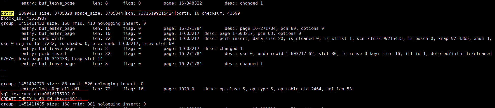

            > **说明：** 
            >如果未找到目标sql\_text，请重复[7.c](#zh-cn_topic_0000001835265765_li971715818243)\~[7.d](#zh-cn_topic_0000001835265765_zh-cn_topic_0000001554494666_li1465834151913)依次解析其他归档文件。

        5.  执行PITR恢复命令。

            ```
            ctbackup --prepare --restore --recover --target-dir=/data/backups/base --parallel=4 --pitr-scn=73716199215424 --repair-type=return_error
            ```

            普通恢复、PITR指定时间恢复和PITR指定SCN恢复的执行结果如下图所示：

            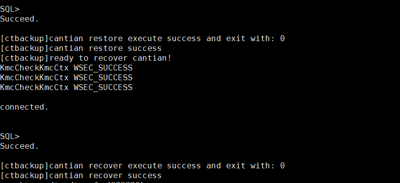

            > **说明：** 
            >如果备份集有使用压缩备份方式，恢复时需要添加选项--decompress。
            >```
            >ctbackup --prepare --restore --recover --target-dir=/data/backups/base --decompress --parallel=4
            >```

8.  执行以下命令恢复MySQL元数据。

    ```
    ctbackup --copy-back --target-dir=备份数据路径 --datadir=MySQL元数据路径 --parallel=4
    ```

    > **说明：** 
    >如果是采用物理机部署MySQL的场景，需要依次在所有Cantian引擎节点执行该步骤。如果是采用容器部署MySQL的场景，在任一Cantian引擎节点执行即可。

9.  恢复成功后，执行以下命令重启Cantian引擎以及查看重启后状态。

    ```
    cms res -start db
    cms stat
    ```

10. 重启MySQLD，并执行以下命令恢复MySQL元数据，使其与Cantian引擎的元数据保持一致。

    ```
    ctbackup --reconciel-mysql --user=登录MySQL的用户 --password='用户对应的密码' --host=MySQL监听地址 --port=MySQL监听端口
    ```

    > **说明：** 
    >如果是采用物理机部署MySQL的场景，需要依次在所有Cantian引擎节点执行该步骤。如果是采用容器部署MySQL的场景，在任一Cantian引擎节点执行即可。

# 性能指标上报及报告收集<a name="ZH-CN_TOPIC_0000001835234409"></a>


## 性能与告警指标上报<a name="ZH-CN_TOPIC_0000001788634828"></a>


### 功能概述<a name="ZH-CN_TOPIC_0000001835274329"></a>

性能与告警上报是指每间隔5秒钟，执行一次性能指标的收集工作，收集的指标会以键值对的形式记录在以当前时间戳命名的json文件中，其中键是指标的名称，值是该指标在当前系统中的值。json文件位于/opt/cantian/ct\_om/service/cantian\_exporter/exporter\_data目录下，该目录最多保留5份json文件，若超出5份，则会删除最早产生的json文件。

### 性能指标说明<a name="ZH-CN_TOPIC_0000001788475172"></a>

若因系统原因导致性能指标上报程序未获取到某个指标的值，则会上报空字符串作为该指标的值。绝大部分指标只有实际值和空字符串共两种上报内容，少部分指标有多种上报的内容，多出的上报内容请参见下表“指标值举例与解释”列。

<a name="zh-cn_topic_0000001788626204_table11592712163310"></a>
<table><thead align="left"><tr id="zh-cn_topic_0000001788626204_row1559212128332"><th class="cellrowborder" valign="top" width="25%" id="mcps1.1.5.1.1"><p id="zh-cn_topic_0000001788626204_p19592111283315"><a name="zh-cn_topic_0000001788626204_p19592111283315"></a><a name="zh-cn_topic_0000001788626204_p19592111283315"></a>指标描述</p>
</th>
<th class="cellrowborder" valign="top" width="24.959999999999997%" id="mcps1.1.5.1.2"><p id="zh-cn_topic_0000001788626204_p1759251213317"><a name="zh-cn_topic_0000001788626204_p1759251213317"></a><a name="zh-cn_topic_0000001788626204_p1759251213317"></a>上报的指标</p>
</th>
<th class="cellrowborder" valign="top" width="22.36%" id="mcps1.1.5.1.3"><p id="zh-cn_topic_0000001788626204_p145921012183311"><a name="zh-cn_topic_0000001788626204_p145921012183311"></a><a name="zh-cn_topic_0000001788626204_p145921012183311"></a>指标值类型</p>
</th>
<th class="cellrowborder" valign="top" width="27.68%" id="mcps1.1.5.1.4"><p id="zh-cn_topic_0000001788626204_p1659210128332"><a name="zh-cn_topic_0000001788626204_p1659210128332"></a><a name="zh-cn_topic_0000001788626204_p1659210128332"></a>指标值举例与解释</p>
</th>
</tr>
</thead>
<tbody><tr id="zh-cn_topic_0000001788626204_row75921012173317"><td class="cellrowborder" valign="top" width="25%" headers="mcps1.1.5.1.1 "><p id="zh-cn_topic_0000001788626204_p10592201213311"><a name="zh-cn_topic_0000001788626204_p10592201213311"></a><a name="zh-cn_topic_0000001788626204_p10592201213311"></a>集群名称</p>
</td>
<td class="cellrowborder" valign="top" width="24.959999999999997%" headers="mcps1.1.5.1.2 "><p id="zh-cn_topic_0000001788626204_p165924127338"><a name="zh-cn_topic_0000001788626204_p165924127338"></a><a name="zh-cn_topic_0000001788626204_p165924127338"></a>cluster_name</p>
</td>
<td class="cellrowborder" valign="top" width="22.36%" headers="mcps1.1.5.1.3 "><p id="zh-cn_topic_0000001788626204_p1592131213331"><a name="zh-cn_topic_0000001788626204_p1592131213331"></a><a name="zh-cn_topic_0000001788626204_p1592131213331"></a>string</p>
</td>
<td class="cellrowborder" valign="top" width="27.68%" headers="mcps1.1.5.1.4 "><p id="zh-cn_topic_0000001788626204_p1759241213333"><a name="zh-cn_topic_0000001788626204_p1759241213333"></a><a name="zh-cn_topic_0000001788626204_p1759241213333"></a>'wxy-cantain1'</p>
</td>
</tr>
<tr id="zh-cn_topic_0000001788626204_row1459271253311"><td class="cellrowborder" valign="top" width="25%" headers="mcps1.1.5.1.1 "><p id="zh-cn_topic_0000001788626204_p259211122335"><a name="zh-cn_topic_0000001788626204_p259211122335"></a><a name="zh-cn_topic_0000001788626204_p259211122335"></a>CMS侧IP</p>
</td>
<td class="cellrowborder" valign="top" width="24.959999999999997%" headers="mcps1.1.5.1.2 "><p id="zh-cn_topic_0000001788626204_p14592171216338"><a name="zh-cn_topic_0000001788626204_p14592171216338"></a><a name="zh-cn_topic_0000001788626204_p14592171216338"></a>cms_ip</p>
</td>
<td class="cellrowborder" valign="top" width="22.36%" headers="mcps1.1.5.1.3 "><p id="zh-cn_topic_0000001788626204_p2059210129335"><a name="zh-cn_topic_0000001788626204_p2059210129335"></a><a name="zh-cn_topic_0000001788626204_p2059210129335"></a>string</p>
</td>
<td class="cellrowborder" valign="top" width="27.68%" headers="mcps1.1.5.1.4 "><p id="zh-cn_topic_0000001788626204_p18593121218332"><a name="zh-cn_topic_0000001788626204_p18593121218332"></a><a name="zh-cn_topic_0000001788626204_p18593121218332"></a>'192.168.204.91;192.168.204.92'</p>
</td>
</tr>
<tr id="zh-cn_topic_0000001788626204_row95931312163315"><td class="cellrowborder" valign="top" width="25%" headers="mcps1.1.5.1.1 "><p id="zh-cn_topic_0000001788626204_p0593212113310"><a name="zh-cn_topic_0000001788626204_p0593212113310"></a><a name="zh-cn_topic_0000001788626204_p0593212113310"></a><span id="zh-cn_topic_0000001788626204_text581153102911"><a name="zh-cn_topic_0000001788626204_text581153102911"></a><a name="zh-cn_topic_0000001788626204_text581153102911"></a>Cantian引擎</span>侧IP和存储侧IP</p>
</td>
<td class="cellrowborder" valign="top" width="24.959999999999997%" headers="mcps1.1.5.1.2 "><p id="zh-cn_topic_0000001788626204_p6593131216334"><a name="zh-cn_topic_0000001788626204_p6593131216334"></a><a name="zh-cn_topic_0000001788626204_p6593131216334"></a>cantian_vlan_ip，storage_vlan_ip</p>
</td>
<td class="cellrowborder" valign="top" width="22.36%" headers="mcps1.1.5.1.3 "><p id="zh-cn_topic_0000001788626204_p659331214336"><a name="zh-cn_topic_0000001788626204_p659331214336"></a><a name="zh-cn_topic_0000001788626204_p659331214336"></a>string</p>
</td>
<td class="cellrowborder" valign="top" width="27.68%" headers="mcps1.1.5.1.4 "><p id="zh-cn_topic_0000001788626204_p059311218334"><a name="zh-cn_topic_0000001788626204_p059311218334"></a><a name="zh-cn_topic_0000001788626204_p059311218334"></a>'192.168.204.91'</p>
</td>
</tr>
<tr id="zh-cn_topic_0000001788626204_row1259371219334"><td class="cellrowborder" valign="top" width="25%" headers="mcps1.1.5.1.1 "><p id="zh-cn_topic_0000001788626204_p145931312173312"><a name="zh-cn_topic_0000001788626204_p145931312173312"></a><a name="zh-cn_topic_0000001788626204_p145931312173312"></a>NFS共享名称及IP</p>
</td>
<td class="cellrowborder" valign="top" width="24.959999999999997%" headers="mcps1.1.5.1.2 "><p id="zh-cn_topic_0000001788626204_p13593101212338"><a name="zh-cn_topic_0000001788626204_p13593101212338"></a><a name="zh-cn_topic_0000001788626204_p13593101212338"></a>share_logic_ip，storage_share_fs，storage_archive_fs，storage_metadata_fs</p>
</td>
<td class="cellrowborder" valign="top" width="22.36%" headers="mcps1.1.5.1.3 "><p id="zh-cn_topic_0000001788626204_p1359361273320"><a name="zh-cn_topic_0000001788626204_p1359361273320"></a><a name="zh-cn_topic_0000001788626204_p1359361273320"></a>string</p>
</td>
<td class="cellrowborder" valign="top" width="27.68%" headers="mcps1.1.5.1.4 "><p id="zh-cn_topic_0000001788626204_p459391215336"><a name="zh-cn_topic_0000001788626204_p459391215336"></a><a name="zh-cn_topic_0000001788626204_p459391215336"></a>'192.168.204.233'，'zj_share_fs'</p>
</td>
</tr>
<tr id="zh-cn_topic_0000001788626204_row1159301214335"><td class="cellrowborder" valign="top" width="25%" headers="mcps1.1.5.1.1 "><p id="zh-cn_topic_0000001788626204_p8593121283318"><a name="zh-cn_topic_0000001788626204_p8593121283318"></a><a name="zh-cn_topic_0000001788626204_p8593121283318"></a>总容量</p>
</td>
<td class="cellrowborder" valign="top" width="24.959999999999997%" headers="mcps1.1.5.1.2 "><p id="zh-cn_topic_0000001788626204_p959351233317"><a name="zh-cn_topic_0000001788626204_p959351233317"></a><a name="zh-cn_topic_0000001788626204_p959351233317"></a>limit</p>
</td>
<td class="cellrowborder" valign="top" width="22.36%" headers="mcps1.1.5.1.3 "><p id="zh-cn_topic_0000001788626204_p1259371283310"><a name="zh-cn_topic_0000001788626204_p1259371283310"></a><a name="zh-cn_topic_0000001788626204_p1259371283310"></a>int</p>
</td>
<td class="cellrowborder" valign="top" width="27.68%" headers="mcps1.1.5.1.4 "><p id="zh-cn_topic_0000001788626204_p1959361243319"><a name="zh-cn_topic_0000001788626204_p1959361243319"></a><a name="zh-cn_topic_0000001788626204_p1959361243319"></a>5888468983808</p>
</td>
</tr>
<tr id="zh-cn_topic_0000001788626204_row17593121283313"><td class="cellrowborder" valign="top" width="25%" headers="mcps1.1.5.1.1 "><p id="zh-cn_topic_0000001788626204_p45931912143315"><a name="zh-cn_topic_0000001788626204_p45931912143315"></a><a name="zh-cn_topic_0000001788626204_p45931912143315"></a>剩余容量</p>
</td>
<td class="cellrowborder" valign="top" width="24.959999999999997%" headers="mcps1.1.5.1.2 "><p id="zh-cn_topic_0000001788626204_p1959331211331"><a name="zh-cn_topic_0000001788626204_p1959331211331"></a><a name="zh-cn_topic_0000001788626204_p1959331211331"></a>free</p>
</td>
<td class="cellrowborder" valign="top" width="22.36%" headers="mcps1.1.5.1.3 "><p id="zh-cn_topic_0000001788626204_p659312122334"><a name="zh-cn_topic_0000001788626204_p659312122334"></a><a name="zh-cn_topic_0000001788626204_p659312122334"></a>int</p>
</td>
<td class="cellrowborder" valign="top" width="27.68%" headers="mcps1.1.5.1.4 "><p id="zh-cn_topic_0000001788626204_p10593161212332"><a name="zh-cn_topic_0000001788626204_p10593161212332"></a><a name="zh-cn_topic_0000001788626204_p10593161212332"></a>590433525760</p>
</td>
</tr>
<tr id="zh-cn_topic_0000001788626204_row9593181273314"><td class="cellrowborder" valign="top" width="25%" headers="mcps1.1.5.1.1 "><p id="zh-cn_topic_0000001788626204_p1659311210338"><a name="zh-cn_topic_0000001788626204_p1659311210338"></a><a name="zh-cn_topic_0000001788626204_p1659311210338"></a>已使用容量</p>
</td>
<td class="cellrowborder" valign="top" width="24.959999999999997%" headers="mcps1.1.5.1.2 "><p id="zh-cn_topic_0000001788626204_p145937125331"><a name="zh-cn_topic_0000001788626204_p145937125331"></a><a name="zh-cn_topic_0000001788626204_p145937125331"></a>used</p>
</td>
<td class="cellrowborder" valign="top" width="22.36%" headers="mcps1.1.5.1.3 "><p id="zh-cn_topic_0000001788626204_p175931012163313"><a name="zh-cn_topic_0000001788626204_p175931012163313"></a><a name="zh-cn_topic_0000001788626204_p175931012163313"></a>int</p>
</td>
<td class="cellrowborder" valign="top" width="27.68%" headers="mcps1.1.5.1.4 "><p id="zh-cn_topic_0000001788626204_p959341243314"><a name="zh-cn_topic_0000001788626204_p959341243314"></a><a name="zh-cn_topic_0000001788626204_p959341243314"></a>590433525760</p>
</td>
</tr>
<tr id="zh-cn_topic_0000001788626204_row5156174412713"><td class="cellrowborder" valign="top" width="25%" headers="mcps1.1.5.1.1 "><p id="zh-cn_topic_0000001788626204_p1215615441710"><a name="zh-cn_topic_0000001788626204_p1215615441710"></a><a name="zh-cn_topic_0000001788626204_p1215615441710"></a>快照预留</p>
</td>
<td class="cellrowborder" valign="top" width="24.959999999999997%" headers="mcps1.1.5.1.2 "><p id="zh-cn_topic_0000001788626204_p71566441278"><a name="zh-cn_topic_0000001788626204_p71566441278"></a><a name="zh-cn_topic_0000001788626204_p71566441278"></a>snapshotLimit</p>
</td>
<td class="cellrowborder" valign="top" width="22.36%" headers="mcps1.1.5.1.3 "><p id="zh-cn_topic_0000001788626204_p1615616443717"><a name="zh-cn_topic_0000001788626204_p1615616443717"></a><a name="zh-cn_topic_0000001788626204_p1615616443717"></a>int</p>
</td>
<td class="cellrowborder" valign="top" width="27.68%" headers="mcps1.1.5.1.4 "><p id="zh-cn_topic_0000001788626204_p1915674415715"><a name="zh-cn_topic_0000001788626204_p1915674415715"></a><a name="zh-cn_topic_0000001788626204_p1915674415715"></a>3958241859584</p>
</td>
</tr>
<tr id="zh-cn_topic_0000001788626204_row1433719484716"><td class="cellrowborder" valign="top" width="25%" headers="mcps1.1.5.1.1 "><p id="zh-cn_topic_0000001788626204_p0337134814717"><a name="zh-cn_topic_0000001788626204_p0337134814717"></a><a name="zh-cn_topic_0000001788626204_p0337134814717"></a>快照使用</p>
</td>
<td class="cellrowborder" valign="top" width="24.959999999999997%" headers="mcps1.1.5.1.2 "><p id="zh-cn_topic_0000001788626204_p5337144810719"><a name="zh-cn_topic_0000001788626204_p5337144810719"></a><a name="zh-cn_topic_0000001788626204_p5337144810719"></a>snapshotUsed</p>
</td>
<td class="cellrowborder" valign="top" width="22.36%" headers="mcps1.1.5.1.3 "><p id="zh-cn_topic_0000001788626204_p83370481717"><a name="zh-cn_topic_0000001788626204_p83370481717"></a><a name="zh-cn_topic_0000001788626204_p83370481717"></a>int</p>
</td>
<td class="cellrowborder" valign="top" width="27.68%" headers="mcps1.1.5.1.4 "><p id="zh-cn_topic_0000001788626204_p123378481675"><a name="zh-cn_topic_0000001788626204_p123378481675"></a><a name="zh-cn_topic_0000001788626204_p123378481675"></a>0</p>
</td>
</tr>
<tr id="zh-cn_topic_0000001788626204_row1828154183"><td class="cellrowborder" valign="top" width="25%" headers="mcps1.1.5.1.1 "><p id="zh-cn_topic_0000001788626204_p16289412811"><a name="zh-cn_topic_0000001788626204_p16289412811"></a><a name="zh-cn_topic_0000001788626204_p16289412811"></a>文件系统ID</p>
</td>
<td class="cellrowborder" valign="top" width="24.959999999999997%" headers="mcps1.1.5.1.2 "><p id="zh-cn_topic_0000001788626204_p1281844818"><a name="zh-cn_topic_0000001788626204_p1281844818"></a><a name="zh-cn_topic_0000001788626204_p1281844818"></a>fsId</p>
</td>
<td class="cellrowborder" valign="top" width="22.36%" headers="mcps1.1.5.1.3 "><p id="zh-cn_topic_0000001788626204_p11281141789"><a name="zh-cn_topic_0000001788626204_p11281141789"></a><a name="zh-cn_topic_0000001788626204_p11281141789"></a>string</p>
</td>
<td class="cellrowborder" valign="top" width="27.68%" headers="mcps1.1.5.1.4 "><p id="zh-cn_topic_0000001788626204_p1228174881"><a name="zh-cn_topic_0000001788626204_p1228174881"></a><a name="zh-cn_topic_0000001788626204_p1228174881"></a>'1'</p>
</td>
</tr>
<tr id="zh-cn_topic_0000001788626204_row181751679818"><td class="cellrowborder" valign="top" width="25%" headers="mcps1.1.5.1.1 "><p id="zh-cn_topic_0000001788626204_p8175871289"><a name="zh-cn_topic_0000001788626204_p8175871289"></a><a name="zh-cn_topic_0000001788626204_p8175871289"></a>文件系统名称</p>
</td>
<td class="cellrowborder" valign="top" width="24.959999999999997%" headers="mcps1.1.5.1.2 "><p id="zh-cn_topic_0000001788626204_p151756712810"><a name="zh-cn_topic_0000001788626204_p151756712810"></a><a name="zh-cn_topic_0000001788626204_p151756712810"></a>fsName</p>
</td>
<td class="cellrowborder" valign="top" width="22.36%" headers="mcps1.1.5.1.3 "><p id="zh-cn_topic_0000001788626204_p121751274812"><a name="zh-cn_topic_0000001788626204_p121751274812"></a><a name="zh-cn_topic_0000001788626204_p121751274812"></a>string</p>
</td>
<td class="cellrowborder" valign="top" width="27.68%" headers="mcps1.1.5.1.4 "><p id="zh-cn_topic_0000001788626204_p141751271788"><a name="zh-cn_topic_0000001788626204_p141751271788"></a><a name="zh-cn_topic_0000001788626204_p141751271788"></a>'fs0000'</p>
</td>
</tr>
<tr id="zh-cn_topic_0000001788626204_row121751871788"><td class="cellrowborder" valign="top" width="25%" headers="mcps1.1.5.1.1 "><p id="zh-cn_topic_0000001788626204_p5175676817"><a name="zh-cn_topic_0000001788626204_p5175676817"></a><a name="zh-cn_topic_0000001788626204_p5175676817"></a>建链状态查询</p>
</td>
<td class="cellrowborder" valign="top" width="24.959999999999997%" headers="mcps1.1.5.1.2 "><p id="zh-cn_topic_0000001788626204_p18175127887"><a name="zh-cn_topic_0000001788626204_p18175127887"></a><a name="zh-cn_topic_0000001788626204_p18175127887"></a>linkState</p>
</td>
<td class="cellrowborder" valign="top" width="22.36%" headers="mcps1.1.5.1.3 "><p id="zh-cn_topic_0000001788626204_p1317567982"><a name="zh-cn_topic_0000001788626204_p1317567982"></a><a name="zh-cn_topic_0000001788626204_p1317567982"></a>int</p>
</td>
<td class="cellrowborder" valign="top" width="27.68%" headers="mcps1.1.5.1.4 "><p id="zh-cn_topic_0000001788626204_p717567884"><a name="zh-cn_topic_0000001788626204_p717567884"></a><a name="zh-cn_topic_0000001788626204_p717567884"></a>0、5或6。其中当值为5时，表示建链失败，超规格；当值为6时，表示建链失败，lsid已存在。</p>
</td>
</tr>
<tr id="zh-cn_topic_0000001788626204_row9242511583"><td class="cellrowborder" valign="top" width="25%" headers="mcps1.1.5.1.1 "><p id="zh-cn_topic_0000001788626204_p192420113814"><a name="zh-cn_topic_0000001788626204_p192420113814"></a><a name="zh-cn_topic_0000001788626204_p192420113814"></a>缓存数据大小</p>
</td>
<td class="cellrowborder" valign="top" width="24.959999999999997%" headers="mcps1.1.5.1.2 "><p id="zh-cn_topic_0000001788626204_p5242161116810"><a name="zh-cn_topic_0000001788626204_p5242161116810"></a><a name="zh-cn_topic_0000001788626204_p5242161116810"></a>data_buffer_size</p>
</td>
<td class="cellrowborder" valign="top" width="22.36%" headers="mcps1.1.5.1.3 "><p id="zh-cn_topic_0000001788626204_p18242611785"><a name="zh-cn_topic_0000001788626204_p18242611785"></a><a name="zh-cn_topic_0000001788626204_p18242611785"></a>dict</p>
</td>
<td class="cellrowborder" valign="top" width="27.68%" headers="mcps1.1.5.1.4 "><p id="zh-cn_topic_0000001788626204_p22428113814"><a name="zh-cn_topic_0000001788626204_p22428113814"></a><a name="zh-cn_topic_0000001788626204_p22428113814"></a>{"NAME": "DATA_BUFFER_SIZE", "VALUE": "16G"}</p>
</td>
</tr>
<tr id="zh-cn_topic_0000001788626204_row7242131111813"><td class="cellrowborder" valign="top" width="25%" headers="mcps1.1.5.1.1 "><p id="zh-cn_topic_0000001788626204_p1724216118813"><a name="zh-cn_topic_0000001788626204_p1724216118813"></a><a name="zh-cn_topic_0000001788626204_p1724216118813"></a>日志缓存大小</p>
</td>
<td class="cellrowborder" valign="top" width="24.959999999999997%" headers="mcps1.1.5.1.2 "><p id="zh-cn_topic_0000001788626204_p13242111110820"><a name="zh-cn_topic_0000001788626204_p13242111110820"></a><a name="zh-cn_topic_0000001788626204_p13242111110820"></a>log_buffer_size</p>
</td>
<td class="cellrowborder" valign="top" width="22.36%" headers="mcps1.1.5.1.3 "><p id="zh-cn_topic_0000001788626204_p8242111116813"><a name="zh-cn_topic_0000001788626204_p8242111116813"></a><a name="zh-cn_topic_0000001788626204_p8242111116813"></a>dict</p>
</td>
<td class="cellrowborder" valign="top" width="27.68%" headers="mcps1.1.5.1.4 "><p id="zh-cn_topic_0000001788626204_p224212112811"><a name="zh-cn_topic_0000001788626204_p224212112811"></a><a name="zh-cn_topic_0000001788626204_p224212112811"></a>{"NAME": "LOG_BUFFER_SIZE", "VALUE": "110M"}</p>
</td>
</tr>
<tr id="zh-cn_topic_0000001788626204_row124215111884"><td class="cellrowborder" valign="top" width="25%" headers="mcps1.1.5.1.1 "><p id="zh-cn_topic_0000001788626204_p82429118816"><a name="zh-cn_topic_0000001788626204_p82429118816"></a><a name="zh-cn_topic_0000001788626204_p82429118816"></a>日志缓存池数量</p>
</td>
<td class="cellrowborder" valign="top" width="24.959999999999997%" headers="mcps1.1.5.1.2 "><p id="zh-cn_topic_0000001788626204_p12437111188"><a name="zh-cn_topic_0000001788626204_p12437111188"></a><a name="zh-cn_topic_0000001788626204_p12437111188"></a>log_buffer_count</p>
</td>
<td class="cellrowborder" valign="top" width="22.36%" headers="mcps1.1.5.1.3 "><p id="zh-cn_topic_0000001788626204_p11243121112813"><a name="zh-cn_topic_0000001788626204_p11243121112813"></a><a name="zh-cn_topic_0000001788626204_p11243121112813"></a>dict</p>
</td>
<td class="cellrowborder" valign="top" width="27.68%" headers="mcps1.1.5.1.4 "><p id="zh-cn_topic_0000001788626204_p122431911289"><a name="zh-cn_topic_0000001788626204_p122431911289"></a><a name="zh-cn_topic_0000001788626204_p122431911289"></a>{"NAME": "LOG_BUFFER_COUNT", "VALUE": "16"}</p>
</td>
</tr>
<tr id="zh-cn_topic_0000001788626204_row1859717185122"><td class="cellrowborder" valign="top" width="25%" headers="mcps1.1.5.1.1 "><p id="zh-cn_topic_0000001788626204_p55971518101218"><a name="zh-cn_topic_0000001788626204_p55971518101218"></a><a name="zh-cn_topic_0000001788626204_p55971518101218"></a>节点ID</p>
</td>
<td class="cellrowborder" valign="top" width="24.959999999999997%" headers="mcps1.1.5.1.2 "><p id="zh-cn_topic_0000001788626204_p1459761818125"><a name="zh-cn_topic_0000001788626204_p1459761818125"></a><a name="zh-cn_topic_0000001788626204_p1459761818125"></a>node_id</p>
</td>
<td class="cellrowborder" valign="top" width="22.36%" headers="mcps1.1.5.1.3 "><p id="zh-cn_topic_0000001788626204_p135971318161219"><a name="zh-cn_topic_0000001788626204_p135971318161219"></a><a name="zh-cn_topic_0000001788626204_p135971318161219"></a>string</p>
</td>
<td class="cellrowborder" valign="top" width="27.68%" headers="mcps1.1.5.1.4 "><p id="zh-cn_topic_0000001788626204_p6597101818128"><a name="zh-cn_topic_0000001788626204_p6597101818128"></a><a name="zh-cn_topic_0000001788626204_p6597101818128"></a>'0'</p>
</td>
</tr>
<tr id="zh-cn_topic_0000001788626204_row6545921111213"><td class="cellrowborder" valign="top" width="25%" headers="mcps1.1.5.1.1 "><p id="zh-cn_topic_0000001788626204_p654512114128"><a name="zh-cn_topic_0000001788626204_p654512114128"></a><a name="zh-cn_topic_0000001788626204_p654512114128"></a>节点状态</p>
</td>
<td class="cellrowborder" valign="top" width="24.959999999999997%" headers="mcps1.1.5.1.2 "><p id="zh-cn_topic_0000001788626204_p4545122161216"><a name="zh-cn_topic_0000001788626204_p4545122161216"></a><a name="zh-cn_topic_0000001788626204_p4545122161216"></a>stat</p>
</td>
<td class="cellrowborder" valign="top" width="22.36%" headers="mcps1.1.5.1.3 "><p id="zh-cn_topic_0000001788626204_p3545202131214"><a name="zh-cn_topic_0000001788626204_p3545202131214"></a><a name="zh-cn_topic_0000001788626204_p3545202131214"></a>string</p>
</td>
<td class="cellrowborder" valign="top" width="27.68%" headers="mcps1.1.5.1.4 "><p id="zh-cn_topic_0000001788626204_p954510210128"><a name="zh-cn_topic_0000001788626204_p954510210128"></a><a name="zh-cn_topic_0000001788626204_p954510210128"></a>'ONLINE'</p>
</td>
</tr>
<tr id="zh-cn_topic_0000001788626204_row18258243129"><td class="cellrowborder" valign="top" width="25%" headers="mcps1.1.5.1.1 "><p id="zh-cn_topic_0000001788626204_p16825122491210"><a name="zh-cn_topic_0000001788626204_p16825122491210"></a><a name="zh-cn_topic_0000001788626204_p16825122491210"></a>集群状态</p>
</td>
<td class="cellrowborder" valign="top" width="24.959999999999997%" headers="mcps1.1.5.1.2 "><p id="zh-cn_topic_0000001788626204_p12825122420123"><a name="zh-cn_topic_0000001788626204_p12825122420123"></a><a name="zh-cn_topic_0000001788626204_p12825122420123"></a>cluster_stat</p>
</td>
<td class="cellrowborder" valign="top" width="22.36%" headers="mcps1.1.5.1.3 "><p id="zh-cn_topic_0000001788626204_p1482515247121"><a name="zh-cn_topic_0000001788626204_p1482515247121"></a><a name="zh-cn_topic_0000001788626204_p1482515247121"></a>int</p>
</td>
<td class="cellrowborder" valign="top" width="27.68%" headers="mcps1.1.5.1.4 "><p id="zh-cn_topic_0000001788626204_p1382592416129"><a name="zh-cn_topic_0000001788626204_p1382592416129"></a><a name="zh-cn_topic_0000001788626204_p1382592416129"></a>1</p>
</td>
</tr>
<tr id="zh-cn_topic_0000001788626204_row188257242129"><td class="cellrowborder" valign="top" width="25%" headers="mcps1.1.5.1.1 "><p id="zh-cn_topic_0000001788626204_p1982619241123"><a name="zh-cn_topic_0000001788626204_p1982619241123"></a><a name="zh-cn_topic_0000001788626204_p1982619241123"></a>CMS端口</p>
</td>
<td class="cellrowborder" valign="top" width="24.959999999999997%" headers="mcps1.1.5.1.2 "><p id="zh-cn_topic_0000001788626204_p98261924181219"><a name="zh-cn_topic_0000001788626204_p98261924181219"></a><a name="zh-cn_topic_0000001788626204_p98261924181219"></a>cms_port</p>
</td>
<td class="cellrowborder" valign="top" width="22.36%" headers="mcps1.1.5.1.3 "><p id="zh-cn_topic_0000001788626204_p6826132410123"><a name="zh-cn_topic_0000001788626204_p6826132410123"></a><a name="zh-cn_topic_0000001788626204_p6826132410123"></a>string</p>
</td>
<td class="cellrowborder" valign="top" width="27.68%" headers="mcps1.1.5.1.4 "><p id="zh-cn_topic_0000001788626204_p9826724191216"><a name="zh-cn_topic_0000001788626204_p9826724191216"></a><a name="zh-cn_topic_0000001788626204_p9826724191216"></a>'14587'</p>
</td>
</tr>
<tr id="zh-cn_topic_0000001788626204_row208261524121216"><td class="cellrowborder" valign="top" width="25%" headers="mcps1.1.5.1.1 "><p id="zh-cn_topic_0000001788626204_p28264244124"><a name="zh-cn_topic_0000001788626204_p28264244124"></a><a name="zh-cn_topic_0000001788626204_p28264244124"></a>内存总量</p>
</td>
<td class="cellrowborder" valign="top" width="24.959999999999997%" headers="mcps1.1.5.1.2 "><p id="zh-cn_topic_0000001788626204_p208261424201210"><a name="zh-cn_topic_0000001788626204_p208261424201210"></a><a name="zh-cn_topic_0000001788626204_p208261424201210"></a>mem_total</p>
</td>
<td class="cellrowborder" valign="top" width="22.36%" headers="mcps1.1.5.1.3 "><p id="zh-cn_topic_0000001788626204_p182672421214"><a name="zh-cn_topic_0000001788626204_p182672421214"></a><a name="zh-cn_topic_0000001788626204_p182672421214"></a>string</p>
</td>
<td class="cellrowborder" valign="top" width="27.68%" headers="mcps1.1.5.1.4 "><p id="zh-cn_topic_0000001788626204_p12826152461220"><a name="zh-cn_topic_0000001788626204_p12826152461220"></a><a name="zh-cn_topic_0000001788626204_p12826152461220"></a>'48126.3MiB'</p>
</td>
</tr>
<tr id="zh-cn_topic_0000001788626204_row19879132891218"><td class="cellrowborder" valign="top" width="25%" headers="mcps1.1.5.1.1 "><p id="zh-cn_topic_0000001788626204_p6879102813124"><a name="zh-cn_topic_0000001788626204_p6879102813124"></a><a name="zh-cn_topic_0000001788626204_p6879102813124"></a>内存空闲</p>
</td>
<td class="cellrowborder" valign="top" width="24.959999999999997%" headers="mcps1.1.5.1.2 "><p id="zh-cn_topic_0000001788626204_p88791428191214"><a name="zh-cn_topic_0000001788626204_p88791428191214"></a><a name="zh-cn_topic_0000001788626204_p88791428191214"></a>mem_free</p>
</td>
<td class="cellrowborder" valign="top" width="22.36%" headers="mcps1.1.5.1.3 "><p id="zh-cn_topic_0000001788626204_p38792028181219"><a name="zh-cn_topic_0000001788626204_p38792028181219"></a><a name="zh-cn_topic_0000001788626204_p38792028181219"></a>string</p>
</td>
<td class="cellrowborder" valign="top" width="27.68%" headers="mcps1.1.5.1.4 "><p id="zh-cn_topic_0000001788626204_p687982891210"><a name="zh-cn_topic_0000001788626204_p687982891210"></a><a name="zh-cn_topic_0000001788626204_p687982891210"></a>'25903.2MiB'</p>
</td>
</tr>
<tr id="zh-cn_topic_0000001788626204_row17879728201211"><td class="cellrowborder" valign="top" width="25%" headers="mcps1.1.5.1.1 "><p id="zh-cn_topic_0000001788626204_p1887972820123"><a name="zh-cn_topic_0000001788626204_p1887972820123"></a><a name="zh-cn_topic_0000001788626204_p1887972820123"></a>内存已使用</p>
</td>
<td class="cellrowborder" valign="top" width="24.959999999999997%" headers="mcps1.1.5.1.2 "><p id="zh-cn_topic_0000001788626204_p5879132813122"><a name="zh-cn_topic_0000001788626204_p5879132813122"></a><a name="zh-cn_topic_0000001788626204_p5879132813122"></a>mem_used</p>
</td>
<td class="cellrowborder" valign="top" width="22.36%" headers="mcps1.1.5.1.3 "><p id="zh-cn_topic_0000001788626204_p187919289125"><a name="zh-cn_topic_0000001788626204_p187919289125"></a><a name="zh-cn_topic_0000001788626204_p187919289125"></a>string</p>
</td>
<td class="cellrowborder" valign="top" width="27.68%" headers="mcps1.1.5.1.4 "><p id="zh-cn_topic_0000001788626204_p08791728181218"><a name="zh-cn_topic_0000001788626204_p08791728181218"></a><a name="zh-cn_topic_0000001788626204_p08791728181218"></a>'11605.7MiB'</p>
</td>
</tr>
<tr id="zh-cn_topic_0000001788626204_row5879102811122"><td class="cellrowborder" valign="top" width="25%" headers="mcps1.1.5.1.1 "><p id="zh-cn_topic_0000001788626204_p198791428151213"><a name="zh-cn_topic_0000001788626204_p198791428151213"></a><a name="zh-cn_topic_0000001788626204_p198791428151213"></a>用户空间占用cpu百分比</p>
</td>
<td class="cellrowborder" valign="top" width="24.959999999999997%" headers="mcps1.1.5.1.2 "><p id="zh-cn_topic_0000001788626204_p8879122820122"><a name="zh-cn_topic_0000001788626204_p8879122820122"></a><a name="zh-cn_topic_0000001788626204_p8879122820122"></a>cpu_us</p>
</td>
<td class="cellrowborder" valign="top" width="22.36%" headers="mcps1.1.5.1.3 "><p id="zh-cn_topic_0000001788626204_p2087992813128"><a name="zh-cn_topic_0000001788626204_p2087992813128"></a><a name="zh-cn_topic_0000001788626204_p2087992813128"></a>string</p>
</td>
<td class="cellrowborder" valign="top" width="27.68%" headers="mcps1.1.5.1.4 "><p id="zh-cn_topic_0000001788626204_p28791628171210"><a name="zh-cn_topic_0000001788626204_p28791628171210"></a><a name="zh-cn_topic_0000001788626204_p28791628171210"></a>'19.9%'</p>
</td>
</tr>
<tr id="zh-cn_topic_0000001788626204_row8879828131217"><td class="cellrowborder" valign="top" width="25%" headers="mcps1.1.5.1.1 "><p id="zh-cn_topic_0000001788626204_p20879182811213"><a name="zh-cn_topic_0000001788626204_p20879182811213"></a><a name="zh-cn_topic_0000001788626204_p20879182811213"></a>内核空间占用CPU的百分比</p>
</td>
<td class="cellrowborder" valign="top" width="24.959999999999997%" headers="mcps1.1.5.1.2 "><p id="zh-cn_topic_0000001788626204_p1788082891213"><a name="zh-cn_topic_0000001788626204_p1788082891213"></a><a name="zh-cn_topic_0000001788626204_p1788082891213"></a>cpu_sy</p>
</td>
<td class="cellrowborder" valign="top" width="22.36%" headers="mcps1.1.5.1.3 "><p id="zh-cn_topic_0000001788626204_p13880192821216"><a name="zh-cn_topic_0000001788626204_p13880192821216"></a><a name="zh-cn_topic_0000001788626204_p13880192821216"></a>string</p>
</td>
<td class="cellrowborder" valign="top" width="27.68%" headers="mcps1.1.5.1.4 "><p id="zh-cn_topic_0000001788626204_p488017282128"><a name="zh-cn_topic_0000001788626204_p488017282128"></a><a name="zh-cn_topic_0000001788626204_p488017282128"></a>'12.6%'</p>
</td>
</tr>
<tr id="zh-cn_topic_0000001788626204_row1188012815123"><td class="cellrowborder" valign="top" width="25%" headers="mcps1.1.5.1.1 "><p id="zh-cn_topic_0000001788626204_p13880132841219"><a name="zh-cn_topic_0000001788626204_p13880132841219"></a><a name="zh-cn_topic_0000001788626204_p13880132841219"></a>空闲CPU百分比</p>
</td>
<td class="cellrowborder" valign="top" width="24.959999999999997%" headers="mcps1.1.5.1.2 "><p id="zh-cn_topic_0000001788626204_p158807281125"><a name="zh-cn_topic_0000001788626204_p158807281125"></a><a name="zh-cn_topic_0000001788626204_p158807281125"></a>cpu_id</p>
</td>
<td class="cellrowborder" valign="top" width="22.36%" headers="mcps1.1.5.1.3 "><p id="zh-cn_topic_0000001788626204_p12880132810127"><a name="zh-cn_topic_0000001788626204_p12880132810127"></a><a name="zh-cn_topic_0000001788626204_p12880132810127"></a>string</p>
</td>
<td class="cellrowborder" valign="top" width="27.68%" headers="mcps1.1.5.1.4 "><p id="zh-cn_topic_0000001788626204_p1288010283121"><a name="zh-cn_topic_0000001788626204_p1288010283121"></a><a name="zh-cn_topic_0000001788626204_p1288010283121"></a>'65.3%'</p>
</td>
</tr>
<tr id="zh-cn_topic_0000001788626204_row13161932111220"><td class="cellrowborder" valign="top" width="25%" headers="mcps1.1.5.1.1 "><p id="zh-cn_topic_0000001788626204_p231793211125"><a name="zh-cn_topic_0000001788626204_p231793211125"></a><a name="zh-cn_topic_0000001788626204_p231793211125"></a>查询脑裂场景下当前集群剩余节点数、IP和节点ID</p>
</td>
<td class="cellrowborder" valign="top" width="24.959999999999997%" headers="mcps1.1.5.1.2 "><p id="zh-cn_topic_0000001788626204_p631753212121"><a name="zh-cn_topic_0000001788626204_p631753212121"></a><a name="zh-cn_topic_0000001788626204_p631753212121"></a>cms_connected_domain</p>
</td>
<td class="cellrowborder" valign="top" width="22.36%" headers="mcps1.1.5.1.3 "><p id="zh-cn_topic_0000001788626204_p23171326123"><a name="zh-cn_topic_0000001788626204_p23171326123"></a><a name="zh-cn_topic_0000001788626204_p23171326123"></a>dict</p>
</td>
<td class="cellrowborder" valign="top" width="27.68%" headers="mcps1.1.5.1.4 "><p id="zh-cn_topic_0000001788626204_p123178326126"><a name="zh-cn_topic_0000001788626204_p123178326126"></a><a name="zh-cn_topic_0000001788626204_p123178326126"></a>{'remaining_nodes_nums': 2, 'remaining_nodes': ({'node_id': '1', 'ip': '1.1.1.1','voting': 'True'},{'node_id': '2', 'ip': '1.1.1.2','voting': 'False'})}。其中voting字段表示该节点是否处于投票阶段，若值为True表示处于投标阶段，若值为False则不是。</p>
</td>
</tr>
<tr id="zh-cn_topic_0000001788626204_row1934382515264"><td class="cellrowborder" valign="top" width="25%" headers="mcps1.1.5.1.1 "><p id="zh-cn_topic_0000001788626204_p143501519133117"><a name="zh-cn_topic_0000001788626204_p143501519133117"></a><a name="zh-cn_topic_0000001788626204_p143501519133117"></a>硬盘I/O状态查询</p>
</td>
<td class="cellrowborder" valign="top" width="24.959999999999997%" headers="mcps1.1.5.1.2 "><p id="zh-cn_topic_0000001788626204_p1343132514261"><a name="zh-cn_topic_0000001788626204_p1343132514261"></a><a name="zh-cn_topic_0000001788626204_p1343132514261"></a>disk<span id="zh-cn_topic_0000001788626204_ph10367915143219"><a name="zh-cn_topic_0000001788626204_ph10367915143219"></a><a name="zh-cn_topic_0000001788626204_ph10367915143219"></a>_</span>iostat</p>
</td>
<td class="cellrowborder" valign="top" width="22.36%" headers="mcps1.1.5.1.3 "><p id="zh-cn_topic_0000001788626204_p634392512612"><a name="zh-cn_topic_0000001788626204_p634392512612"></a><a name="zh-cn_topic_0000001788626204_p634392512612"></a>string</p>
</td>
<td class="cellrowborder" valign="top" width="27.68%" headers="mcps1.1.5.1.4 "><p id="zh-cn_topic_0000001788626204_p53431625132615"><a name="zh-cn_topic_0000001788626204_p53431625132615"></a><a name="zh-cn_topic_0000001788626204_p53431625132615"></a>'0'、'9090'等具体数字或者 'connect to server failed, disk iostat failed'</p>
</td>
</tr>
<tr id="zh-cn_topic_0000001788626204_row11317932141210"><td class="cellrowborder" valign="top" width="25%" headers="mcps1.1.5.1.1 "><p id="zh-cn_topic_0000001788626204_p831773210121"><a name="zh-cn_topic_0000001788626204_p831773210121"></a><a name="zh-cn_topic_0000001788626204_p831773210121"></a>最近一次备份开始、结束时间和最大缓冲大小</p>
</td>
<td class="cellrowborder" valign="top" width="24.959999999999997%" headers="mcps1.1.5.1.2 "><p id="zh-cn_topic_0000001788626204_p143171232191212"><a name="zh-cn_topic_0000001788626204_p143171232191212"></a><a name="zh-cn_topic_0000001788626204_p143171232191212"></a>sys_backup_sets</p>
</td>
<td class="cellrowborder" valign="top" width="22.36%" headers="mcps1.1.5.1.3 "><p id="zh-cn_topic_0000001788626204_p153173323121"><a name="zh-cn_topic_0000001788626204_p153173323121"></a><a name="zh-cn_topic_0000001788626204_p153173323121"></a>dict</p>
</td>
<td class="cellrowborder" valign="top" width="27.68%" headers="mcps1.1.5.1.4 "><p id="zh-cn_topic_0000001788626204_p231753261212"><a name="zh-cn_topic_0000001788626204_p231753261212"></a><a name="zh-cn_topic_0000001788626204_p231753261212"></a>{"START_TIME": "xxxxx", "COMPLETION_TIME": "xxxx", "MAX_BUFFER_SIZE": "xxxxxx"}</p>
</td>
</tr>
<tr id="zh-cn_topic_0000001788626204_row18317832171212"><td class="cellrowborder" valign="top" width="25%" headers="mcps1.1.5.1.1 "><p id="zh-cn_topic_0000001788626204_p631719322129"><a name="zh-cn_topic_0000001788626204_p631719322129"></a><a name="zh-cn_topic_0000001788626204_p631719322129"></a>查询刷盘策略中CHECKPOINT_PAGES字段的值</p>
</td>
<td class="cellrowborder" valign="top" width="24.959999999999997%" headers="mcps1.1.5.1.2 "><p id="zh-cn_topic_0000001788626204_p031719320128"><a name="zh-cn_topic_0000001788626204_p031719320128"></a><a name="zh-cn_topic_0000001788626204_p031719320128"></a>checkpoint_pages</p>
</td>
<td class="cellrowborder" valign="top" width="22.36%" headers="mcps1.1.5.1.3 "><p id="zh-cn_topic_0000001788626204_p1131714328126"><a name="zh-cn_topic_0000001788626204_p1131714328126"></a><a name="zh-cn_topic_0000001788626204_p1131714328126"></a>dict</p>
</td>
<td class="cellrowborder" valign="top" width="27.68%" headers="mcps1.1.5.1.4 "><p id="zh-cn_topic_0000001788626204_p63171732161219"><a name="zh-cn_topic_0000001788626204_p63171732161219"></a><a name="zh-cn_topic_0000001788626204_p63171732161219"></a>{"NAME": "CHECKPOINT_PAGES", "VALUE": "200000"}</p>
</td>
</tr>
<tr id="zh-cn_topic_0000001788626204_row18317193281214"><td class="cellrowborder" valign="top" width="25%" headers="mcps1.1.5.1.1 "><p id="zh-cn_topic_0000001788626204_p63181032191210"><a name="zh-cn_topic_0000001788626204_p63181032191210"></a><a name="zh-cn_topic_0000001788626204_p63181032191210"></a>查询刷盘策略中CHECKPOINT_PERIOD字段的值</p>
</td>
<td class="cellrowborder" valign="top" width="24.959999999999997%" headers="mcps1.1.5.1.2 "><p id="zh-cn_topic_0000001788626204_p931813322121"><a name="zh-cn_topic_0000001788626204_p931813322121"></a><a name="zh-cn_topic_0000001788626204_p931813322121"></a>checkpoint_period</p>
</td>
<td class="cellrowborder" valign="top" width="22.36%" headers="mcps1.1.5.1.3 "><p id="zh-cn_topic_0000001788626204_p1331893211121"><a name="zh-cn_topic_0000001788626204_p1331893211121"></a><a name="zh-cn_topic_0000001788626204_p1331893211121"></a>dict</p>
</td>
<td class="cellrowborder" valign="top" width="27.68%" headers="mcps1.1.5.1.4 "><p id="zh-cn_topic_0000001788626204_p1831810321121"><a name="zh-cn_topic_0000001788626204_p1831810321121"></a><a name="zh-cn_topic_0000001788626204_p1831810321121"></a>{"NAME": "CHECKPOINT_PERIOD", "VALUE": "1"}</p>
</td>
</tr>
<tr id="zh-cn_topic_0000001788626204_row18318173231215"><td class="cellrowborder" valign="top" width="25%" headers="mcps1.1.5.1.1 "><p id="zh-cn_topic_0000001788626204_p2031811326124"><a name="zh-cn_topic_0000001788626204_p2031811326124"></a><a name="zh-cn_topic_0000001788626204_p2031811326124"></a>查询锁数目中GLOBAL_LOCK字段的值</p>
</td>
<td class="cellrowborder" valign="top" width="24.959999999999997%" headers="mcps1.1.5.1.2 "><p id="zh-cn_topic_0000001788626204_p13318103217124"><a name="zh-cn_topic_0000001788626204_p13318103217124"></a><a name="zh-cn_topic_0000001788626204_p13318103217124"></a>global_lock</p>
</td>
<td class="cellrowborder" valign="top" width="22.36%" headers="mcps1.1.5.1.3 "><p id="zh-cn_topic_0000001788626204_p831813271214"><a name="zh-cn_topic_0000001788626204_p831813271214"></a><a name="zh-cn_topic_0000001788626204_p831813271214"></a>dict</p>
</td>
<td class="cellrowborder" valign="top" width="27.68%" headers="mcps1.1.5.1.4 "><p id="zh-cn_topic_0000001788626204_p17318832191213"><a name="zh-cn_topic_0000001788626204_p17318832191213"></a><a name="zh-cn_topic_0000001788626204_p17318832191213"></a>{"DRC_RESOURCE": "GLOBAL_LOCK", "USED": "3", "TOTAL": "1048576", "RATIO(%)": "0.00000"}</p>
</td>
</tr>
<tr id="zh-cn_topic_0000001788626204_row19731135810184"><td class="cellrowborder" valign="top" width="25%" headers="mcps1.1.5.1.1 "><p id="zh-cn_topic_0000001788626204_p37311658101810"><a name="zh-cn_topic_0000001788626204_p37311658101810"></a><a name="zh-cn_topic_0000001788626204_p37311658101810"></a>查询锁数目中LOCAL_LOCK字段的值</p>
</td>
<td class="cellrowborder" valign="top" width="24.959999999999997%" headers="mcps1.1.5.1.2 "><p id="zh-cn_topic_0000001788626204_p27313589186"><a name="zh-cn_topic_0000001788626204_p27313589186"></a><a name="zh-cn_topic_0000001788626204_p27313589186"></a>local_lock</p>
</td>
<td class="cellrowborder" valign="top" width="22.36%" headers="mcps1.1.5.1.3 "><p id="zh-cn_topic_0000001788626204_p11731105891812"><a name="zh-cn_topic_0000001788626204_p11731105891812"></a><a name="zh-cn_topic_0000001788626204_p11731105891812"></a>dict</p>
</td>
<td class="cellrowborder" valign="top" width="27.68%" headers="mcps1.1.5.1.4 "><p id="zh-cn_topic_0000001788626204_p2731165818184"><a name="zh-cn_topic_0000001788626204_p2731165818184"></a><a name="zh-cn_topic_0000001788626204_p2731165818184"></a>{"DRC_RESOURCE": "LOCAL_LOCK", "USED": "5", "TOTAL": "1048576", "RATIO(%)": "0.00000"}</p>
</td>
</tr>
<tr id="zh-cn_topic_0000001788626204_row3706161110197"><td class="cellrowborder" valign="top" width="25%" headers="mcps1.1.5.1.1 "><p id="zh-cn_topic_0000001788626204_p1770614117199"><a name="zh-cn_topic_0000001788626204_p1770614117199"></a><a name="zh-cn_topic_0000001788626204_p1770614117199"></a>查询MASTER页数量中LOCAL_TXN字段的值</p>
</td>
<td class="cellrowborder" valign="top" width="24.959999999999997%" headers="mcps1.1.5.1.2 "><p id="zh-cn_topic_0000001788626204_p47061511141911"><a name="zh-cn_topic_0000001788626204_p47061511141911"></a><a name="zh-cn_topic_0000001788626204_p47061511141911"></a>local_txn</p>
</td>
<td class="cellrowborder" valign="top" width="22.36%" headers="mcps1.1.5.1.3 "><p id="zh-cn_topic_0000001788626204_p1570641141917"><a name="zh-cn_topic_0000001788626204_p1570641141917"></a><a name="zh-cn_topic_0000001788626204_p1570641141917"></a>dict</p>
</td>
<td class="cellrowborder" valign="top" width="27.68%" headers="mcps1.1.5.1.4 "><p id="zh-cn_topic_0000001788626204_p070617113196"><a name="zh-cn_topic_0000001788626204_p070617113196"></a><a name="zh-cn_topic_0000001788626204_p070617113196"></a>{"DRC_RESOURCE": "LOCAL_TXN", "USED": "0", "TOTAL": "38760", "RATIO(%)": "0.00000"}</p>
</td>
</tr>
<tr id="zh-cn_topic_0000001788626204_row8972181761919"><td class="cellrowborder" valign="top" width="25%" headers="mcps1.1.5.1.1 "><p id="zh-cn_topic_0000001788626204_p13972171717192"><a name="zh-cn_topic_0000001788626204_p13972171717192"></a><a name="zh-cn_topic_0000001788626204_p13972171717192"></a>查询MASTER页数量中GLOBAL_TXN字段的值</p>
</td>
<td class="cellrowborder" valign="top" width="24.959999999999997%" headers="mcps1.1.5.1.2 "><p id="zh-cn_topic_0000001788626204_p16972917101916"><a name="zh-cn_topic_0000001788626204_p16972917101916"></a><a name="zh-cn_topic_0000001788626204_p16972917101916"></a>global_txn</p>
</td>
<td class="cellrowborder" valign="top" width="22.36%" headers="mcps1.1.5.1.3 "><p id="zh-cn_topic_0000001788626204_p297241716193"><a name="zh-cn_topic_0000001788626204_p297241716193"></a><a name="zh-cn_topic_0000001788626204_p297241716193"></a>dict</p>
</td>
<td class="cellrowborder" valign="top" width="27.68%" headers="mcps1.1.5.1.4 "><p id="zh-cn_topic_0000001788626204_p1697221761919"><a name="zh-cn_topic_0000001788626204_p1697221761919"></a><a name="zh-cn_topic_0000001788626204_p1697221761919"></a>{"DRC_RESOURCE": "GLOBAL_TXN", "USED": "0", "TOTAL": "38760", "RATIO(%)": "0.00000"}</p>
</td>
</tr>
<tr id="zh-cn_topic_0000001788626204_row167209581257"><td class="cellrowborder" valign="top" width="25%" headers="mcps1.1.5.1.1 "><p id="zh-cn_topic_0000001788626204_p7720195811252"><a name="zh-cn_topic_0000001788626204_p7720195811252"></a><a name="zh-cn_topic_0000001788626204_p7720195811252"></a>工作状态</p>
</td>
<td class="cellrowborder" valign="top" width="24.959999999999997%" headers="mcps1.1.5.1.2 "><p id="zh-cn_topic_0000001788626204_p3720115892515"><a name="zh-cn_topic_0000001788626204_p3720115892515"></a><a name="zh-cn_topic_0000001788626204_p3720115892515"></a>work_stat</p>
</td>
<td class="cellrowborder" valign="top" width="22.36%" headers="mcps1.1.5.1.3 "><p id="zh-cn_topic_0000001788626204_p13720205820256"><a name="zh-cn_topic_0000001788626204_p13720205820256"></a><a name="zh-cn_topic_0000001788626204_p13720205820256"></a>int</p>
</td>
<td class="cellrowborder" valign="top" width="27.68%" headers="mcps1.1.5.1.4 "><a name="zh-cn_topic_0000001788626204_ul11534122781211"></a><a name="zh-cn_topic_0000001788626204_ul11534122781211"></a><ul id="zh-cn_topic_0000001788626204_ul11534122781211"><li>0 ：正在加入集群</li><li>1 ：已经加入集群</li><li>2 ：正在离开集群</li><li>3 ：已经离开集群</li><li>6 ：DBStor文件系统信息获取失败</li></ul>
</td>
</tr>
<tr id="zh-cn_topic_0000001788626204_row172121132132510"><td class="cellrowborder" valign="top" width="25%" headers="mcps1.1.5.1.1 "><p id="zh-cn_topic_0000001788626204_p521273210256"><a name="zh-cn_topic_0000001788626204_p521273210256"></a><a name="zh-cn_topic_0000001788626204_p521273210256"></a>NTP服务器状态</p>
</td>
<td class="cellrowborder" valign="top" width="24.959999999999997%" headers="mcps1.1.5.1.2 "><p id="zh-cn_topic_0000001788626204_p1212113212252"><a name="zh-cn_topic_0000001788626204_p1212113212252"></a><a name="zh-cn_topic_0000001788626204_p1212113212252"></a>pitr_warning</p>
</td>
<td class="cellrowborder" valign="top" width="22.36%" headers="mcps1.1.5.1.3 "><p id="zh-cn_topic_0000001788626204_p621233212515"><a name="zh-cn_topic_0000001788626204_p621233212515"></a><a name="zh-cn_topic_0000001788626204_p621233212515"></a>string</p>
</td>
<td class="cellrowborder" valign="top" width="27.68%" headers="mcps1.1.5.1.4 "><p id="zh-cn_topic_0000001788626204_p1789513139312"><a name="zh-cn_topic_0000001788626204_p1789513139312"></a><a name="zh-cn_topic_0000001788626204_p1789513139312"></a>Ture：NTP服务异常，存在时间差</p>
<p id="zh-cn_topic_0000001788626204_p6212143212259"><a name="zh-cn_topic_0000001788626204_p6212143212259"></a><a name="zh-cn_topic_0000001788626204_p6212143212259"></a>False：NTP服务正常，不存在时间差</p>
</td>
</tr>
<tr id="zh-cn_topic_0000001788626204_row366154912154"><td class="cellrowborder" valign="top" width="25%" headers="mcps1.1.5.1.1 "><p id="zh-cn_topic_0000001788626204_p11661124911158"><a name="zh-cn_topic_0000001788626204_p11661124911158"></a><a name="zh-cn_topic_0000001788626204_p11661124911158"></a>CMS锁状态</p>
</td>
<td class="cellrowborder" valign="top" width="24.959999999999997%" headers="mcps1.1.5.1.2 "><p id="zh-cn_topic_0000001788626204_p186618497156"><a name="zh-cn_topic_0000001788626204_p186618497156"></a><a name="zh-cn_topic_0000001788626204_p186618497156"></a>cms_lock_status</p>
</td>
<td class="cellrowborder" valign="top" width="22.36%" headers="mcps1.1.5.1.3 "><p id="zh-cn_topic_0000001788626204_p766114494154"><a name="zh-cn_topic_0000001788626204_p766114494154"></a><a name="zh-cn_topic_0000001788626204_p766114494154"></a>string</p>
</td>
<td class="cellrowborder" valign="top" width="27.68%" headers="mcps1.1.5.1.4 "><a name="zh-cn_topic_0000001788626204_ul1597115583420"></a><a name="zh-cn_topic_0000001788626204_ul1597115583420"></a><ul id="zh-cn_topic_0000001788626204_ul1597115583420"><li>abnormal：CMS锁异常</li><li>normal：CMS锁正常</li></ul>
</td>
</tr>
</tbody>
</table>

### 性能指标上报举例<a name="ZH-CN_TOPIC_0000001835234413"></a>

查看/opt/cantian/ct\_om/service/cantian\_exporter/exporter\_data目录下创建好的上报文件。

```
[root@node0 ~]# cat /opt/cantian/ct_om/service/cantian_exporter/exporter_data/20230403172442.json
{"node_id": "0", "stat": "ONLINE", "work_stat": 1, "cluster_name": "cluster0403133600", "cms_ip": "20.20.163.101;20.20.163.103", "cantian_vlan_ip": "66.66.66.101;77.77.77.101", "storage_vlan_ip": "66.66.66.110;66.66.66.111;77.77.77.112;77.77.77.113", "share_logic_ip": "30.30.163.110", "storage_share_fs": "share_fs_101_103", "storage_archive_fs": "archive_fs_101_103", "storage_metadata_fs": "metadata_fs_101_103", "data_buffer_size": "200G", "log_buffer_size": "110M", "log_buffer_count": "16", "cluster_stat": 0, "cms_port": "14587", "cms_connected_domain": {"remaining_nodes_nums": 2, "remaining_nodes": [{"NODE_ID": "0", "IP": "20.20.163.101", "VOTING": "FALSE"}, {"NODE_ID": "1", "IP": "20.20.163.103", "VOTING": "FALSE"}]}, "mem_total": "515230.2MiB", "mem_free": "247867.6MiB", "mem_used": "248656.2MiB", "cpu_us": "14.2%", "cpu_sy": "9.6%", "cpu_id": "72.8%", "sys_backup_sets": {}, "checkpoint_pages": {"NAME": "CHECKPOINT_PAGES", "VALUE": "200000"}, "checkpoint_period": {"NAME": "CHECKPOINT_PERIOD", "VALUE": "1"}, "global_lock": {"DRC_RESOURCE": "GLOBAL_LOCK", "USED": "471", "TOTAL": "62980748", "RATIO": "0.00001"}, "local_lock": {"DRC_RESOURCE": "LOCAL_LOCK", "USED": "1100", "TOTAL": "31490374", "RATIO": "0.00003"}, "local_txn": {"DRC_RESOURCE": "LOCAL_TXN", "USED": "0", "TOTAL": "38760", "RATIO": "0.00000"}, "global_txn": {"DRC_RESOURCE": "GLOBAL_TXN", "USED": "0", "TOTAL": "38760", "RATIO": "0.00000"}, "limit": 10995116277760, "used": 2735040031232, "free": 6061052990976, "snapshotLimit": 2199023255552, "snapshotUsed": 0, "fsId": 125, "fsName": "fs_101_103", "linkState": 0，'logicrep': 'Online'，'pitr_warning': 'False'}
```

## 性能报告收集<a name="ZH-CN_TOPIC_0000001788634832"></a>

提供性能报告的收集方法，以方便地获取Cantian引擎和MySQL的性能数据。性能报告以html文件形式存在，用户可通过手动执行MySQL命令或ctsql命令生成性能报告，也可以通过脚本一键收集。

**前提条件<a name="zh-cn_topic_0000001788626256_section17910163720582"></a>**

-   Cantian引擎已正常安装和运行。
-   MySQL server端和MySQL client端已正确安装且正常运行。
-   MySQL的performance\_schema引擎正常开启。

    开启MySQL server端前，在MySQL配置文件（/opt/cantian/image/cantian\_connector/mysql-server/scripts/my.conf）中修改或加入以下字段，开启MySQL的性能诊断引擎。

    ```
    performance_schema=ON
    ```


### 手动生成性能报告<a name="ZH-CN_TOPIC_0000001835274333"></a>


#### MySQL报告<a name="ZH-CN_TOPIC_0000001788475176"></a>

**操作步骤<a name="zh-cn_topic_0000001788626136_section141903385819"></a>**

1.  执行以下命令，打开外部导入ddl的开关。

    ```
    /usr/local/mysql/bin/mysql -u mysql_user_name --password=mysql_user_password --host=mysql_server_ip --port=mysql_server_port -e "set @ctc_ddl_enabled=true;set global ctc_concurrent_ddl=ON;"
    ```

1.  执行以下命令，查看ddl开关是否被打开。开启成功时，回显的值为1，否则开启失败。

    ```
    /usr/local/mysql/bin/mysql -u mysql_user_name --password=mysql_user_password --host=mysql_server_ip --port=mysql_server_port -e "select @@ctc_concurrent_ddl;"
    ```

    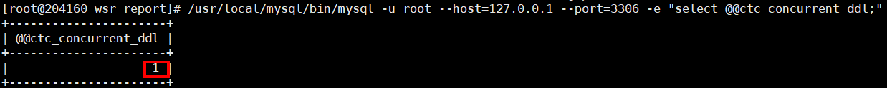

2.  导入性能报告存储过程。
    1.  执行以下命令，导入性能报告初始化存储过程。

        ```
        /usr/local/mysql/bin/mysql -u mysql_user_name --password=mysql_user_password --host=mysql_server_ip --port=mysql_server_port sys < /opt/cantian/action/wsr_report/diagnostics/diagnostics_ctc_init.sql
        ```

    2.  执行以下命令，导入性能报告查询存储过程。

        ```
        /usr/local/mysql/bin/mysql -u mysql_user_name --password=mysql_user_password --host=mysql_server_ip --port=mysql_server_port sys < /opt/cantian/action/wsr_report/diagnostics/diagnostics_ctc_detail.sql
        ```

3.  <a name="zh-cn_topic_0000001788626136_li17582191712117"></a>执行以下命令，生成mysql性能报告。

    ```
    /usr/local/mysql/bin/mysql -u mysql_user_name --password=mysql_user_password --host=mysql_server_ip --port=mysql_server_port -H -e "set autocommit=on;CALL sys.diagnostics_ctc_init(mysql_diag_total_time, mysql_diag_period_time, 'mysql_diag_mode');" > report_dir/current_instance_report.html
    ```

    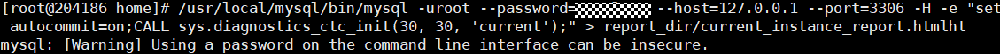

    > **说明：** 
    >示例中：
    >-   “_mysql\_user\_name_”为mysql的用户名。
    >-   “_mysql\_user\_password_”为mysql的用户密码（如果没有密码可不填写）。
    >-   “_mysql\_server\_ip_”和“_mysql\_server\_port_”分别为mysql的监听地址和端口。
    >-   “_mysql\_diag\_total\_time_”为性能报告的最长数据收集时间（单位：秒）,使用NULL值默认设定为60秒。
    >-   “_mysql\_diag\_period\_time_”为性能报告的数据收集间隔时间（单位：秒），使用NULL值默认设定为30秒。
    >-   “_mysql\_diag\_mode_”为要使用的performance\_schema配置，可配置的值有：“current”（使用当前的instruments和consumers设置）、“medium”（开启除  '%\_history%'之外的所有consumers、开启除'wait/synch/%'之外的所有instruments的采集项和计时器功能）、“full”（启用所有instruments和consumers设置）。
    >-   “_report\_dir_”为性能报告的导出路径。

1.  查看mysql性能报告。

    性能报告保存在[4](#zh-cn_topic_0000001788626136_li17582191712117)中用户指定的“_report\_dir_”路径下，格式为html，用户需要将该报告传输到有浏览器的平台上，并通过浏览器打开查看。

    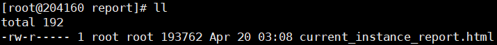

2.  执行以下命令，关闭外部导入ddl的开关。

    ```
    /usr/local/mysql/bin/mysql/mysql -u mysql_user_name --password=mysql_user_password --host=mysql_server_ip --port=mysql_server_port -e "set global ctc_concurrent_ddl=OFF;"
    ```

#### WSR报告<a name="ZH-CN_TOPIC_0000001835234417"></a>

**操作步骤<a name="zh-cn_topic_0000001788466476_section155316114910"></a>**

1.  执行以下命令，生成第一个WSR性能快照点。

    ```
    su -s /bin/bash - system_user_name -c "ctsql sys/ctsql_user_password@ctsql_server_ip:ctsql_server_port -q -c 'CALL WSR\$CREATE_SNAPSHOT'"
    ```

    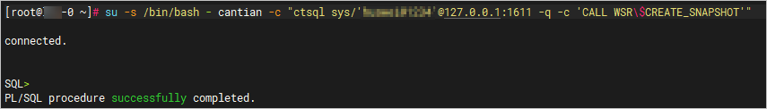

1.  等待一段时间（视使用者希望观察的时间段确定），再次执行以下命令，生成第二个WSR性能快照点。

    ```
    su -s /bin/bash - system_user_name -c "ctsql sys/ctsql_user_password@ctsql_server_ip:ctsql_server_port -q -c 'CALL WSR\$CREATE_SNAPSHOT'"
    ```

1.  执行以下命令，获取快照点的id。

    ```
    su -s /bin/bash - system_user_name -c "ctsql sys/ctsql_user_password@ctsql_server_ip:ctsql_server_port -q -c 'wsr list'"
    ```

    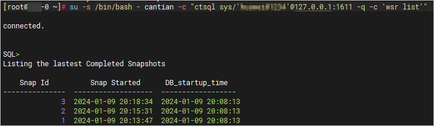

1.  <a name="zh-cn_topic_0000001788466476_li18537714118"></a>执行以下命令，生成WSR报告。

    ```
    su -s /bin/bash - system_user_name -c "ctsql sys/ctsql_user_password@ctsql_server_ip:ctsql_server_port -q -c 'wsr snap_id_1 snap_id_2 \"report_dir/wsrrpt.html\"'"
    ```

    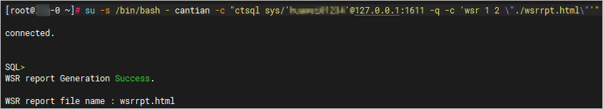

    > **说明：** 
    >示例中：
    >-   “_system\_user\_name_”的取值为安装配置文件“config\_param.json”中“deploy\_user”的值。
    >-   “_ctsql\_user\_password_”的取值为ctsql的登录密码，即用户安装Cantian引擎时输入的密码。
    >-   “_ctsql\_server\_ip_”的取值为Cantian引擎节点的监听地址。
    >-   “_ctsql\_server\_port_”的取值为Cantian引擎节点的监听端口。
    >-   “_snap\_id\_1_”是第一个快照点的id。
    >-   “_snap\_id\_2_”是第二个快照点的id。
    >-   “_report\_dir_”是WSR报告输出的路径，该路径需要有"system\_user\_name"用户的写入权限。

1.  查看WSR报告。

    WSR报告保存在[4](#zh-cn_topic_0000001788466476_li18537714118)中用户指定的“_report\_dir_”路径下，格式为html，用户需要将该报告传输到有浏览器的平台上，并通过浏览器打开查看。

    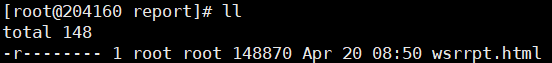

### 脚本生成性能报告<a name="ZH-CN_TOPIC_0000001788634836"></a>

mysql容器暂不支持grant all和grant super权限，因此该脚本不支持容器mysql场景，需要用户手动进入容器内部连接mysql，参考[MySQL报告](MySQL报告.md#ZH-CN_TOPIC_0000001788475176)生成MySQL报告。

**操作步骤<a name="zh-cn_topic_0000001835225749_section15631516795"></a>**

1.  执行以下命令，编辑性能报告收集脚本配置文件，相关参数如[表1](#zh-cn_topic_0000001835225749_table10984174813221)所示。

    ```
    vi /opt/cantian/action/wsr_report/report.cnf
    ```

    **表 1**  性能报告收集脚本配置文件参数说明

    <a name="zh-cn_topic_0000001835225749_table10984174813221"></a>
    <table><thead align="left"><tr id="zh-cn_topic_0000001835225749_row12984174817227"><th class="cellrowborder" valign="top" width="27.88%" id="mcps1.2.3.1.1"><p id="zh-cn_topic_0000001835225749_p1798454822216"><a name="zh-cn_topic_0000001835225749_p1798454822216"></a><a name="zh-cn_topic_0000001835225749_p1798454822216"></a>参数名称</p>
    </th>
    <th class="cellrowborder" valign="top" width="72.11999999999999%" id="mcps1.2.3.1.2"><p id="zh-cn_topic_0000001835225749_p1798414486220"><a name="zh-cn_topic_0000001835225749_p1798414486220"></a><a name="zh-cn_topic_0000001835225749_p1798414486220"></a>参数说明</p>
    </th>
    </tr>
    </thead>
    <tbody><tr id="zh-cn_topic_0000001835225749_row1984174852213"><td class="cellrowborder" valign="top" width="27.88%" headers="mcps1.2.3.1.1 "><p id="zh-cn_topic_0000001835225749_p109841048192214"><a name="zh-cn_topic_0000001835225749_p109841048192214"></a><a name="zh-cn_topic_0000001835225749_p109841048192214"></a>system_user_name</p>
    </td>
    <td class="cellrowborder" valign="top" width="72.11999999999999%" headers="mcps1.2.3.1.2 "><p id="zh-cn_topic_0000001835225749_p1498416482222"><a name="zh-cn_topic_0000001835225749_p1498416482222"></a><a name="zh-cn_topic_0000001835225749_p1498416482222"></a>用于部署<span id="zh-cn_topic_0000001835225749_text536719475317"><a name="zh-cn_topic_0000001835225749_text536719475317"></a><a name="zh-cn_topic_0000001835225749_text536719475317"></a>Cantian引擎</span>的用户，即安装配置文件“config_param.json”中“deploy_user”的值。</p>
    </td>
    </tr>
    <tr id="zh-cn_topic_0000001835225749_row79849489221"><td class="cellrowborder" valign="top" width="27.88%" headers="mcps1.2.3.1.1 "><p id="zh-cn_topic_0000001835225749_p7984148152213"><a name="zh-cn_topic_0000001835225749_p7984148152213"></a><a name="zh-cn_topic_0000001835225749_p7984148152213"></a>mysql_user_name</p>
    </td>
    <td class="cellrowborder" valign="top" width="72.11999999999999%" headers="mcps1.2.3.1.2 "><p id="zh-cn_topic_0000001835225749_p4984104819227"><a name="zh-cn_topic_0000001835225749_p4984104819227"></a><a name="zh-cn_topic_0000001835225749_p4984104819227"></a>登录MySQL的用户名。</p>
    </td>
    </tr>
    <tr id="zh-cn_topic_0000001835225749_row49842483222"><td class="cellrowborder" valign="top" width="27.88%" headers="mcps1.2.3.1.1 "><p id="zh-cn_topic_0000001835225749_p15984164812216"><a name="zh-cn_topic_0000001835225749_p15984164812216"></a><a name="zh-cn_topic_0000001835225749_p15984164812216"></a>mysql_user_password</p>
    </td>
    <td class="cellrowborder" valign="top" width="72.11999999999999%" headers="mcps1.2.3.1.2 "><p id="zh-cn_topic_0000001835225749_p1498544810226"><a name="zh-cn_topic_0000001835225749_p1498544810226"></a><a name="zh-cn_topic_0000001835225749_p1498544810226"></a>登录MySQL的密码。</p>
    </td>
    </tr>
    <tr id="zh-cn_topic_0000001835225749_row19911943192312"><td class="cellrowborder" valign="top" width="27.88%" headers="mcps1.2.3.1.1 "><p id="zh-cn_topic_0000001835225749_p1199114437238"><a name="zh-cn_topic_0000001835225749_p1199114437238"></a><a name="zh-cn_topic_0000001835225749_p1199114437238"></a>mysql_server_ip</p>
    </td>
    <td class="cellrowborder" valign="top" width="72.11999999999999%" headers="mcps1.2.3.1.2 "><p id="zh-cn_topic_0000001835225749_p149918434231"><a name="zh-cn_topic_0000001835225749_p149918434231"></a><a name="zh-cn_topic_0000001835225749_p149918434231"></a>MySQL server的监听地址。</p>
    </td>
    </tr>
    <tr id="zh-cn_topic_0000001835225749_row2516194172319"><td class="cellrowborder" valign="top" width="27.88%" headers="mcps1.2.3.1.1 "><p id="zh-cn_topic_0000001835225749_p1751612415236"><a name="zh-cn_topic_0000001835225749_p1751612415236"></a><a name="zh-cn_topic_0000001835225749_p1751612415236"></a>mysql_server_port</p>
    </td>
    <td class="cellrowborder" valign="top" width="72.11999999999999%" headers="mcps1.2.3.1.2 "><p id="zh-cn_topic_0000001835225749_p1151674132313"><a name="zh-cn_topic_0000001835225749_p1151674132313"></a><a name="zh-cn_topic_0000001835225749_p1151674132313"></a>MySQL server的监听端口。</p>
    </td>
    </tr>
    <tr id="zh-cn_topic_0000001835225749_row16857153014235"><td class="cellrowborder" valign="top" width="27.88%" headers="mcps1.2.3.1.1 "><p id="zh-cn_topic_0000001835225749_p1485716301236"><a name="zh-cn_topic_0000001835225749_p1485716301236"></a><a name="zh-cn_topic_0000001835225749_p1485716301236"></a>mysql_diag_total_time</p>
    </td>
    <td class="cellrowborder" valign="top" width="72.11999999999999%" headers="mcps1.2.3.1.2 "><p id="zh-cn_topic_0000001835225749_p7900161172614"><a name="zh-cn_topic_0000001835225749_p7900161172614"></a><a name="zh-cn_topic_0000001835225749_p7900161172614"></a>性能报告的最长数据收集时间（单位：秒）。使用NULL值默认设定为60秒。</p>
    </td>
    </tr>
    <tr id="zh-cn_topic_0000001835225749_row56629358234"><td class="cellrowborder" valign="top" width="27.88%" headers="mcps1.2.3.1.1 "><p id="zh-cn_topic_0000001835225749_p18662143511238"><a name="zh-cn_topic_0000001835225749_p18662143511238"></a><a name="zh-cn_topic_0000001835225749_p18662143511238"></a>mysql_diag_period_time</p>
    </td>
    <td class="cellrowborder" valign="top" width="72.11999999999999%" headers="mcps1.2.3.1.2 "><p id="zh-cn_topic_0000001835225749_p2116181232813"><a name="zh-cn_topic_0000001835225749_p2116181232813"></a><a name="zh-cn_topic_0000001835225749_p2116181232813"></a>性能报告的数据收集间隔时间（单位：秒），使用NULL值默认设定为30秒。</p>
    </td>
    </tr>
    <tr id="zh-cn_topic_0000001835225749_row166386389230"><td class="cellrowborder" valign="top" width="27.88%" headers="mcps1.2.3.1.1 "><p id="zh-cn_topic_0000001835225749_p156384381233"><a name="zh-cn_topic_0000001835225749_p156384381233"></a><a name="zh-cn_topic_0000001835225749_p156384381233"></a>mysql_diag_mode</p>
    </td>
    <td class="cellrowborder" valign="top" width="72.11999999999999%" headers="mcps1.2.3.1.2 "><p id="zh-cn_topic_0000001835225749_p1863853832316"><a name="zh-cn_topic_0000001835225749_p1863853832316"></a><a name="zh-cn_topic_0000001835225749_p1863853832316"></a>使用的performance_schema配置，可配置的值有：“current”（使用当前的instruments和consumers设置）、“medium”（开启除'%_history%'之外的所有consumers、开启除了'wait/synch/%'之外的所有instruments的采集项和计时器功能）、“full”（启用所有instruments和consumers设置）。</p>
    </td>
    </tr>
    <tr id="zh-cn_topic_0000001835225749_row201026215545"><td class="cellrowborder" valign="top" width="27.88%" headers="mcps1.2.3.1.1 "><p id="zh-cn_topic_0000001835225749_p110214217548"><a name="zh-cn_topic_0000001835225749_p110214217548"></a><a name="zh-cn_topic_0000001835225749_p110214217548"></a>ctsql_user_name</p>
    </td>
    <td class="cellrowborder" valign="top" width="72.11999999999999%" headers="mcps1.2.3.1.2 "><p id="zh-cn_topic_0000001835225749_p1010217255412"><a name="zh-cn_topic_0000001835225749_p1010217255412"></a><a name="zh-cn_topic_0000001835225749_p1010217255412"></a>登录ctsql的用户名，默认为“sys”。</p>
    </td>
    </tr>
    <tr id="zh-cn_topic_0000001835225749_row113247235548"><td class="cellrowborder" valign="top" width="27.88%" headers="mcps1.2.3.1.1 "><p id="zh-cn_topic_0000001835225749_p153241323115411"><a name="zh-cn_topic_0000001835225749_p153241323115411"></a><a name="zh-cn_topic_0000001835225749_p153241323115411"></a>ctsql_user_passwd</p>
    </td>
    <td class="cellrowborder" valign="top" width="72.11999999999999%" headers="mcps1.2.3.1.2 "><p id="zh-cn_topic_0000001835225749_p1832462335420"><a name="zh-cn_topic_0000001835225749_p1832462335420"></a><a name="zh-cn_topic_0000001835225749_p1832462335420"></a>登录ctsql的密码。</p>
    </td>
    </tr>
    <tr id="zh-cn_topic_0000001835225749_row54148398540"><td class="cellrowborder" valign="top" width="27.88%" headers="mcps1.2.3.1.1 "><p id="zh-cn_topic_0000001835225749_p8415139155416"><a name="zh-cn_topic_0000001835225749_p8415139155416"></a><a name="zh-cn_topic_0000001835225749_p8415139155416"></a>ctsql_server_ip</p>
    </td>
    <td class="cellrowborder" valign="top" width="72.11999999999999%" headers="mcps1.2.3.1.2 "><p id="zh-cn_topic_0000001835225749_p1141503975414"><a name="zh-cn_topic_0000001835225749_p1141503975414"></a><a name="zh-cn_topic_0000001835225749_p1141503975414"></a><span id="zh-cn_topic_0000001835225749_text19462125919210"><a name="zh-cn_topic_0000001835225749_text19462125919210"></a><a name="zh-cn_topic_0000001835225749_text19462125919210"></a>Cantian引擎</span>的监听地址，默认为“127.0.0.1”，如需修改，需要将IP加入数据库监听白名单。</p>
    </td>
    </tr>
    <tr id="zh-cn_topic_0000001835225749_row857492095518"><td class="cellrowborder" valign="top" width="27.88%" headers="mcps1.2.3.1.1 "><p id="zh-cn_topic_0000001835225749_p057522011558"><a name="zh-cn_topic_0000001835225749_p057522011558"></a><a name="zh-cn_topic_0000001835225749_p057522011558"></a>ctsql_server_port</p>
    </td>
    <td class="cellrowborder" valign="top" width="72.11999999999999%" headers="mcps1.2.3.1.2 "><p id="zh-cn_topic_0000001835225749_p145751520155515"><a name="zh-cn_topic_0000001835225749_p145751520155515"></a><a name="zh-cn_topic_0000001835225749_p145751520155515"></a><span id="zh-cn_topic_0000001835225749_text48015016313"><a name="zh-cn_topic_0000001835225749_text48015016313"></a><a name="zh-cn_topic_0000001835225749_text48015016313"></a>Cantian引擎</span>的监听端口，默认为“1611”。</p>
    </td>
    </tr>
    <tr id="zh-cn_topic_0000001835225749_row126113419243"><td class="cellrowborder" valign="top" width="27.88%" headers="mcps1.2.3.1.1 "><p id="zh-cn_topic_0000001835225749_p1815095420558"><a name="zh-cn_topic_0000001835225749_p1815095420558"></a><a name="zh-cn_topic_0000001835225749_p1815095420558"></a>ctsql_snapshot_time</p>
    </td>
    <td class="cellrowborder" valign="top" width="72.11999999999999%" headers="mcps1.2.3.1.2 "><p id="zh-cn_topic_0000001835225749_p176117410243"><a name="zh-cn_topic_0000001835225749_p176117410243"></a><a name="zh-cn_topic_0000001835225749_p176117410243"></a>两次快照的时间间隔（单位：秒）。</p>
    </td>
    </tr>
    <tr id="zh-cn_topic_0000001835225749_row61680912244"><td class="cellrowborder" valign="top" width="27.88%" headers="mcps1.2.3.1.1 "><p id="zh-cn_topic_0000001835225749_p181681799240"><a name="zh-cn_topic_0000001835225749_p181681799240"></a><a name="zh-cn_topic_0000001835225749_p181681799240"></a>report_output_dir</p>
    </td>
    <td class="cellrowborder" valign="top" width="72.11999999999999%" headers="mcps1.2.3.1.2 "><p id="zh-cn_topic_0000001835225749_p916811942412"><a name="zh-cn_topic_0000001835225749_p916811942412"></a><a name="zh-cn_topic_0000001835225749_p916811942412"></a>输出MySQL性能报告和WSR报告的路径，该路径需要有"system_user_name"用户的写入权限。</p>
    </td>
    </tr>
    </tbody>
    </table>

1.  执行以下命令，执行性能报告收集脚本。

    ```
    sh /opt/cantian/action/wsr_report/gen_report.sh
    ```

1.  查看mysql报告和WSR报告。

    mysql报告和WSR报告保存在配置文件“_report\_output\_dir_”字段的路径下，格式为html。mysql报告文件名以“mysql\_diag+ip地址+时间戳”的形式保存，WSR报告以“cantian\_wsr+hostname+时间戳”的形式保存。用户需要将报告传输到有浏览器的平台上，并通过浏览器打开查看。

