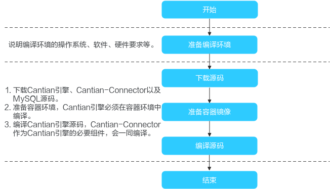

# 概述<a name="ZH-CN_TOPIC_0000001806024778"></a>

本文档介绍如何对Cantian引擎源码进行编译，生成Cantian引擎软件包。[图1](#zh-cn_topic_0000001801631373_fig2092784815585)说明了Cantian引擎的编译流程。

**图 1**  Cantian引擎编译流程<a name="zh-cn_topic_0000001801631373_fig2092784815585"></a>  


# 准备编译环境<a name="ZH-CN_TOPIC_0000001806184590"></a>

**硬件要求<a name="zh-cn_topic_0000001754552768_section179914360134"></a>**

-   主机数量：1台
-   推荐主机硬件规格：
    -   CPU：4核（64位）
    -   内存：8GB
    -   磁盘空闲空间：100GB

-   ARM架构的主机编译后生成Cantian引擎ARM类型的软件包，X86架构的主机编译后生成Cantian引擎X86类型的软件包

**操作系统要求<a name="zh-cn_topic_0000001754552768_section2010693873617"></a>**

Cantian引擎支持的操作系统（Linux 64-bit）如下，建议Cantian引擎的编译操作系统与运行操作系统一致：

-   CentOS 8.2\(x86\_64\)
-   OpenEuler-22.03-LTS\(aarch64\)

**软件要求<a name="zh-cn_topic_0000001754552768_section1912447143612"></a>**

Cantian引擎编译过程所依赖的软件如[表1](#zh-cn_topic_0000001754552768_table169281834113714)所示。

**表 1**  软件依赖

<a name="zh-cn_topic_0000001754552768_table169281834113714"></a>
<table><thead align="left"><tr id="zh-cn_topic_0000001754552768_row18929334123710"><th class="cellrowborder" valign="top" width="25.81%" id="mcps1.2.4.1.1"><p id="zh-cn_topic_0000001754552768_p119291534133718"><a name="zh-cn_topic_0000001754552768_p119291534133718"></a><a name="zh-cn_topic_0000001754552768_p119291534133718"></a>所需软件</p>
</th>
<th class="cellrowborder" valign="top" width="25.34%" id="mcps1.2.4.1.2"><p id="zh-cn_topic_0000001754552768_p15929934143710"><a name="zh-cn_topic_0000001754552768_p15929934143710"></a><a name="zh-cn_topic_0000001754552768_p15929934143710"></a>建议版本</p>
</th>
<th class="cellrowborder" valign="top" width="48.85%" id="mcps1.2.4.1.3"><p id="zh-cn_topic_0000001754552768_p7513190114412"><a name="zh-cn_topic_0000001754552768_p7513190114412"></a><a name="zh-cn_topic_0000001754552768_p7513190114412"></a>说明</p>
</th>
</tr>
</thead>
<tbody><tr id="zh-cn_topic_0000001754552768_row192953413714"><td class="cellrowborder" valign="top" width="25.81%" headers="mcps1.2.4.1.1 "><p id="zh-cn_topic_0000001754552768_p1929153412371"><a name="zh-cn_topic_0000001754552768_p1929153412371"></a><a name="zh-cn_topic_0000001754552768_p1929153412371"></a>Docker</p>
</td>
<td class="cellrowborder" valign="top" width="25.34%" headers="mcps1.2.4.1.2 "><p id="zh-cn_topic_0000001754552768_p7929634143710"><a name="zh-cn_topic_0000001754552768_p7929634143710"></a><a name="zh-cn_topic_0000001754552768_p7929634143710"></a>&gt;=19.03</p>
</td>
<td class="cellrowborder" valign="top" width="48.85%" headers="mcps1.2.4.1.3 "><p id="zh-cn_topic_0000001754552768_p251312094415"><a name="zh-cn_topic_0000001754552768_p251312094415"></a><a name="zh-cn_topic_0000001754552768_p251312094415"></a>用于构建、管理、运行<span id="zh-cn_topic_0000001754552768_text1305826182318"><a name="zh-cn_topic_0000001754552768_text1305826182318"></a><a name="zh-cn_topic_0000001754552768_text1305826182318"></a>Cantian引擎</span>编译镜像和容器。</p>
</td>
</tr>
<tr id="zh-cn_topic_0000001754552768_row1292973410378"><td class="cellrowborder" valign="top" width="25.81%" headers="mcps1.2.4.1.1 "><p id="zh-cn_topic_0000001754552768_p1592914343377"><a name="zh-cn_topic_0000001754552768_p1592914343377"></a><a name="zh-cn_topic_0000001754552768_p1592914343377"></a>Git</p>
</td>
<td class="cellrowborder" valign="top" width="25.34%" headers="mcps1.2.4.1.2 "><p id="zh-cn_topic_0000001754552768_p1692983423712"><a name="zh-cn_topic_0000001754552768_p1692983423712"></a><a name="zh-cn_topic_0000001754552768_p1692983423712"></a>&gt;=2.18.0</p>
</td>
<td class="cellrowborder" valign="top" width="48.85%" headers="mcps1.2.4.1.3 "><p id="zh-cn_topic_0000001754552768_p1951316011445"><a name="zh-cn_topic_0000001754552768_p1951316011445"></a><a name="zh-cn_topic_0000001754552768_p1951316011445"></a>用于下载源码。</p>
</td>
</tr>
</tbody>
</table>

# 版本编译<a name="ZH-CN_TOPIC_0000001852743545"></a>


## 下载源码<a name="ZH-CN_TOPIC_0000001852903501"></a>

本节介绍如何下载Cantian引擎源码以及其他依赖源码。

**前提条件<a name="zh-cn_topic_0000001801512345_section17361818184118"></a>**

已在主机正确安装并配置Git软件。

**操作步骤<a name="zh-cn_topic_0000001801512345_section16845198174112"></a>**

1.  使用root用户登录主机。
2.  创建并进入源码下载目录。

    此处以将源码下载到目录“/ctdb/cantian\_compile”为例进行说明，您可根据实际环境进行替换。

    ```
    mkdir -p /ctdb/cantian_compile
    cd /ctdb/cantian_compile
    ```

3.  执行以下命令下载Cantian引擎源码。

    ```
    git clone -b versionBranch https://gitee.com/openeuler/cantian.git
    ```

    其中，“Version Branch”为分支名称，例如：

    -   若下载“cantian24.6”的分支的源码，应执行的命令如下：

        ```
        git clone -b cantian24.6 https://gitee.com/openeuler/cantian.git
        ```

    -   若下载“master”的分支的源码，应执行的命令如下：

        ```
        git clone https://gitee.com/openeuler/cantian.git
        ```

        > **说明：** 
        >“master”为开发分支，经过验证的的最新修改都将合入该分支。要下载“master”分支的源码，命令中无需包含“-b versionBranch”的内容。

1.  执行以下命令下载Cantian-Connector-MySQL源码，用于编译Cantian引擎对接MySQL的插件。

    ```
    git clone -b versionBranch https://gitee.com/openeuler/cantian-connector-mysql.git
    ```

    其中，“Version Branch”为分支名称，例如：

    -   若下载“cantian24.6”的分支的源码，应执行的命令如下：

        ```
        git clone -b cantian24.6 https://gitee.com/openeuler/cantian-connector-mysql.git
        ```

    -   若下载“master”的分支的源码，应执行的命令如下：

        ```
        git clone https://gitee.com/openeuler/cantian-connector-mysql.git
        ```

        > **说明：** 
        >“master”为开发分支，经过验证的的最新修改都将合入该分支。要下载“master”分支的源码，命令中无需包含“-b versionBranch”的内容。

1.  进入Cantian-Connector-MySQL源码目录，执行以下命令下载MySQL-8.0.26版本源码，用于编译Cantian引擎对接MySQL的插件。

    ```
    cd cantian-connector-mysql
    wget https://github.com/mysql/mysql-server/archive/refs/tags/mysql-8.0.26.tar.gz --no-check-certificate
    tar -zxf mysql-8.0.26.tar.gz
    mv mysql-server-mysql-8.0.26 mysql-source
    ```

    > **说明：** 
    >Cantian引擎源码和Cantian-Connector-MySQL源码的根目录必须在同级目录下，在该示例中，目录的结构如下：
    >ctdb
    >---- cantian\_compile
    >----------cantian
    >----------cantian-connector-mysql
    >----------------mysql-source

## 准备容器镜像<a name="ZH-CN_TOPIC_0000001806024782"></a>

Cantian引擎仅支持在容器内编译，本节介绍两种准备容器镜像的方法：①通过Cantian-Connector-MySQL源码中的Dockerfile文件自行构建容器镜像；②通过Docker Hub直接获取容器镜像。如果执行编译的主机无法连接网络，则可选择第一种方式，否则两种方式任选其一。

**容器镜像依赖软件介绍<a name="zh-cn_topic_0000001817435653_section197590130205"></a>**

如果用户自行制作容器镜像，镜像中需包含[表1](#zh-cn_topic_0000001817435653_table169281834113714)中的依赖软件。

**表 1**  容器镜像依赖软件软件

<a name="zh-cn_topic_0000001817435653_table169281834113714"></a>
<table><thead align="left"><tr id="zh-cn_topic_0000001817435653_row18929334123710"><th class="cellrowborder" valign="top" width="38.58%" id="mcps1.2.3.1.1"><p id="zh-cn_topic_0000001817435653_p119291534133718"><a name="zh-cn_topic_0000001817435653_p119291534133718"></a><a name="zh-cn_topic_0000001817435653_p119291534133718"></a>所需软件</p>
</th>
<th class="cellrowborder" valign="top" width="61.419999999999995%" id="mcps1.2.3.1.2"><p id="zh-cn_topic_0000001817435653_p15929934143710"><a name="zh-cn_topic_0000001817435653_p15929934143710"></a><a name="zh-cn_topic_0000001817435653_p15929934143710"></a>版本</p>
</th>
</tr>
</thead>
<tbody><tr id="zh-cn_topic_0000001817435653_row192953413714"><td class="cellrowborder" valign="top" width="38.58%" headers="mcps1.2.3.1.1 "><p id="zh-cn_topic_0000001817435653_p1929153412371"><a name="zh-cn_topic_0000001817435653_p1929153412371"></a><a name="zh-cn_topic_0000001817435653_p1929153412371"></a>CMake</p>
</td>
<td class="cellrowborder" valign="top" width="61.419999999999995%" headers="mcps1.2.3.1.2 "><p id="zh-cn_topic_0000001817435653_p7929634143710"><a name="zh-cn_topic_0000001817435653_p7929634143710"></a><a name="zh-cn_topic_0000001817435653_p7929634143710"></a>&gt;=3.14.1</p>
</td>
</tr>
<tr id="zh-cn_topic_0000001817435653_row1292973410378"><td class="cellrowborder" valign="top" width="38.58%" headers="mcps1.2.3.1.1 "><p id="zh-cn_topic_0000001817435653_p1592914343377"><a name="zh-cn_topic_0000001817435653_p1592914343377"></a><a name="zh-cn_topic_0000001817435653_p1592914343377"></a>automake</p>
</td>
<td class="cellrowborder" valign="top" width="61.419999999999995%" headers="mcps1.2.3.1.2 "><p id="zh-cn_topic_0000001817435653_p1692983423712"><a name="zh-cn_topic_0000001817435653_p1692983423712"></a><a name="zh-cn_topic_0000001817435653_p1692983423712"></a>1.16.1</p>
</td>
</tr>
<tr id="zh-cn_topic_0000001817435653_row1692963463716"><td class="cellrowborder" valign="top" width="38.58%" headers="mcps1.2.3.1.1 "><p id="zh-cn_topic_0000001817435653_p11929234143717"><a name="zh-cn_topic_0000001817435653_p11929234143717"></a><a name="zh-cn_topic_0000001817435653_p11929234143717"></a>libtool</p>
</td>
<td class="cellrowborder" valign="top" width="61.419999999999995%" headers="mcps1.2.3.1.2 "><p id="zh-cn_topic_0000001817435653_p11929103419372"><a name="zh-cn_topic_0000001817435653_p11929103419372"></a><a name="zh-cn_topic_0000001817435653_p11929103419372"></a>2.4.6</p>
</td>
</tr>
<tr id="zh-cn_topic_0000001817435653_row1892916342377"><td class="cellrowborder" valign="top" width="38.58%" headers="mcps1.2.3.1.1 "><p id="zh-cn_topic_0000001817435653_p69298340375"><a name="zh-cn_topic_0000001817435653_p69298340375"></a><a name="zh-cn_topic_0000001817435653_p69298340375"></a>g++</p>
</td>
<td class="cellrowborder" valign="top" width="61.419999999999995%" headers="mcps1.2.3.1.2 "><p id="zh-cn_topic_0000001817435653_p392963419379"><a name="zh-cn_topic_0000001817435653_p392963419379"></a><a name="zh-cn_topic_0000001817435653_p392963419379"></a>8.5.0</p>
</td>
</tr>
<tr id="zh-cn_topic_0000001817435653_row9929183413711"><td class="cellrowborder" valign="top" width="38.58%" headers="mcps1.2.3.1.1 "><p id="zh-cn_topic_0000001817435653_p3929133453719"><a name="zh-cn_topic_0000001817435653_p3929133453719"></a><a name="zh-cn_topic_0000001817435653_p3929133453719"></a>libaio-devel</p>
</td>
<td class="cellrowborder" valign="top" width="61.419999999999995%" headers="mcps1.2.3.1.2 "><p id="zh-cn_topic_0000001817435653_p59295343376"><a name="zh-cn_topic_0000001817435653_p59295343376"></a><a name="zh-cn_topic_0000001817435653_p59295343376"></a>0.3.109-13</p>
</td>
</tr>
<tr id="zh-cn_topic_0000001817435653_row1492953453710"><td class="cellrowborder" valign="top" width="38.58%" headers="mcps1.2.3.1.1 "><p id="zh-cn_topic_0000001817435653_p1092983463711"><a name="zh-cn_topic_0000001817435653_p1092983463711"></a><a name="zh-cn_topic_0000001817435653_p1092983463711"></a>pkgconfig</p>
</td>
<td class="cellrowborder" valign="top" width="61.419999999999995%" headers="mcps1.2.3.1.2 "><p id="zh-cn_topic_0000001817435653_p192993463713"><a name="zh-cn_topic_0000001817435653_p192993463713"></a><a name="zh-cn_topic_0000001817435653_p192993463713"></a>0.29.1-3</p>
</td>
</tr>
<tr id="zh-cn_topic_0000001817435653_row092918345376"><td class="cellrowborder" valign="top" width="38.58%" headers="mcps1.2.3.1.1 "><p id="zh-cn_topic_0000001817435653_p179291234103711"><a name="zh-cn_topic_0000001817435653_p179291234103711"></a><a name="zh-cn_topic_0000001817435653_p179291234103711"></a>rpm-build</p>
</td>
<td class="cellrowborder" valign="top" width="61.419999999999995%" headers="mcps1.2.3.1.2 "><p id="zh-cn_topic_0000001817435653_p10930153413711"><a name="zh-cn_topic_0000001817435653_p10930153413711"></a><a name="zh-cn_topic_0000001817435653_p10930153413711"></a>4.14.3</p>
</td>
</tr>
</tbody>
</table>

**前提条件<a name="zh-cn_topic_0000001817435653_section17361818184118"></a>**

-   已在主机正确安装并配置docker软件，可参考[Docker官方文档](https://docs.docker.com/engine/)进行安装。
-   已[下载Cantian-Connector-MySQL源码](#ZH-CN_TOPIC_0000001852903501)。

**使用Dockerfile构建镜像<a name="zh-cn_topic_0000001817435653_section11199345189"></a>**

介绍如何使用Dockerfile构建编译容器镜像。

1.  使用root用户登录主机。
2.  执行以下命令进入Dockerfile文件所在目录。

    ```
    cd /code_dir/cantian/docker
    ```

    其中，“_code\_dir_”为源码下载到的目录。

    如，以源码下载到“/ctdb/cantian\_compile”为例，执行以下命令：

    ```
    cd /ctdb/cantian_compile/cantian/docker
    ```

1.  构建容器镜像。
    -   当前主机环境为x86时，执行以下命令：

        ```
        docker build -t cantian_dev:latest -f Dockerfile .
        ```

    -   当前主机环境为arm时，执行以下命令：

        ```
        docker build -t cantian_dev:latest -f Dockerfile_ARM64 .
        ```

2.  构建完成后，执行以下命令查看容器镜像。

    “cantian\_dev“即为构建的容器镜像。

    ```
    docker images
    ```

    回显类似如下：

    

**通过Docker Hub获取镜像<a name="zh-cn_topic_0000001817435653_section1585783101812"></a>**

介绍如何通过Docker Hub获取编译容器镜像。

1.  使用root用户登录主机。
2.  从Docker Hub获取编译容器镜像。

    ```
    docker pull ykfnxx/cantian_dev:0.1.0
    ```

1.  设置镜像标签。

    ```
    docker tag ykfnxx/cantian_dev:0.1.0 cantian_dev:latest
    ```

2.  执行以下命令查看容器镜像。

    “cantian\_dev“即为从Docker Hub获取的容器镜像，如图所示。

    ```
    docker images
    ```

    回显类似如下：

    

## 编译源码<a name="ZH-CN_TOPIC_0000001806184594"></a>

本节介绍如何在容器环境编译Cantian引擎源码，并生成Cantian引擎软件包。Cantian-Connector作为Cantian引擎运行的必要组件，会在Cantian引擎的自动化编译脚本中一同编译，并打包进Cantian引擎软件包。

**编译脚本介绍<a name="zh-cn_topic_0000001754552772_section18900146174715"></a>**

build\_cantian.sh是编译过程中的入口脚本，其集成了软件编译和打包的功能。以sh build\_cantian.sh \[option\]执⾏，\[option\]参数说明如[表1](#zh-cn_topic_0000001754552772_table1323046164812)所示。

**表 1**  编译脚本参数说明

<a name="zh-cn_topic_0000001754552772_table1323046164812"></a>
<table><thead align="left"><tr id="zh-cn_topic_0000001754552772_row423546164811"><th class="cellrowborder" valign="top" width="26.97%" id="mcps1.2.3.1.1"><p id="zh-cn_topic_0000001754552772_p024114613484"><a name="zh-cn_topic_0000001754552772_p024114613484"></a><a name="zh-cn_topic_0000001754552772_p024114613484"></a>参数选项</p>
</th>
<th class="cellrowborder" valign="top" width="73.03%" id="mcps1.2.3.1.2"><p id="zh-cn_topic_0000001754552772_p424124654818"><a name="zh-cn_topic_0000001754552772_p424124654818"></a><a name="zh-cn_topic_0000001754552772_p424124654818"></a>功能</p>
</th>
</tr>
</thead>
<tbody><tr id="zh-cn_topic_0000001754552772_row32412469484"><td class="cellrowborder" valign="top" width="26.97%" headers="mcps1.2.3.1.1 "><p id="zh-cn_topic_0000001754552772_p1124546154813"><a name="zh-cn_topic_0000001754552772_p1124546154813"></a><a name="zh-cn_topic_0000001754552772_p1124546154813"></a>debug</p>
</td>
<td class="cellrowborder" valign="top" width="73.03%" headers="mcps1.2.3.1.2 "><p id="zh-cn_topic_0000001754552772_p12413464486"><a name="zh-cn_topic_0000001754552772_p12413464486"></a><a name="zh-cn_topic_0000001754552772_p12413464486"></a>编译debug版本的软件包，软件包中含有用于调试的符号表文件。</p>
</td>
</tr>
<tr id="zh-cn_topic_0000001754552772_row92419464487"><td class="cellrowborder" valign="top" width="26.97%" headers="mcps1.2.3.1.1 "><p id="zh-cn_topic_0000001754552772_p324184644817"><a name="zh-cn_topic_0000001754552772_p324184644817"></a><a name="zh-cn_topic_0000001754552772_p324184644817"></a>release</p>
</td>
<td class="cellrowborder" valign="top" width="73.03%" headers="mcps1.2.3.1.2 "><p id="zh-cn_topic_0000001754552772_p142494604812"><a name="zh-cn_topic_0000001754552772_p142494604812"></a><a name="zh-cn_topic_0000001754552772_p142494604812"></a>编译release版本的软件包，软件包中不含有用于调试的符号表文件。</p>
</td>
</tr>
</tbody>
</table>

**前提条件<a name="zh-cn_topic_0000001754552772_section17361818184118"></a>**

-   已成功[构建或获取容器镜像](#ZH-CN_TOPIC_0000001806024782)。
-   已[准备好所有源码](#ZH-CN_TOPIC_0000001852903501)。

**操作步骤<a name="zh-cn_topic_0000001754552772_section7362738114918"></a>**

1.  启动容器。

    Cantian引擎源码提供了容器的启动和初始化脚本container.sh，该脚本可以自动化准备编译Cantian引擎所需的环境设置，推荐使用该脚本启动编译容器。

    1.  使用root用户登录主机。
    2.  执行以下命令进入container.sh所在目录。

        ```
        cd code_dir/cantian/docker
        ```

        其中，“_code\_dir_”为源码下载到的目录。

        如，以源码下载到“/ctdb/cantian\_compile”为例，执行以下命令：

        ```
        cd /ctdb/cantian_compile/cantian/docker
        ```

    3.  执行脚本，启动并进入编译容器。

        ```
        sh container.sh dev
        ```

2.  进入编译脚本目录。

    ```
    cd /home/regress/CantianKernel/build
    ```

1.  执行编译脚本，生成Cantian引擎软件包。

    ```
    sh build_cantian.sh option  -  开源
    ```

    其中，“_option_”为[表1](#zh-cn_topic_0000001754552772_table1323046164812)中的参数选项，指定编译release或debug版本的软件包。

1.  进入编译目标目录，获取Cantian引擎软件包。

    ```
    cd /tmp/cantian_output
    ```

    回显类似如下表示编译成功：

    ```
    Packing package_name success
    ```

    编译生成的Cantian引擎软件包名如下，请以实际生成的包名为准：

    -   X86：Cantian\__xxx_\_x86\_64\_DEBUG.tgz或Cantian\__xxx_\_x86\_64\_RELEASE.tgz，Cantian\_connector\_x86\_64\_DEBUG.tgz或Cantian\_connector\_x86\_64\_RELEASE.tgz。
    -   ARM：Cantian\__xxx_\_aarch64\_DEBUG.tgz或Cantian\__xxx_\_aarch64\_RELEASE.tgz，Cantian\_connector\_aarch64\_DEBUG.tgz或Cantian\_connector\_aarch64\_RELEASE.tgz。

