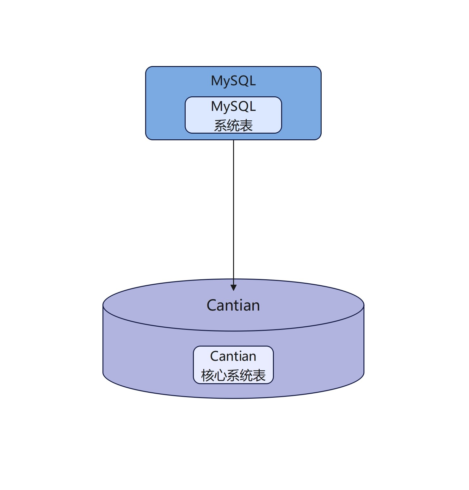
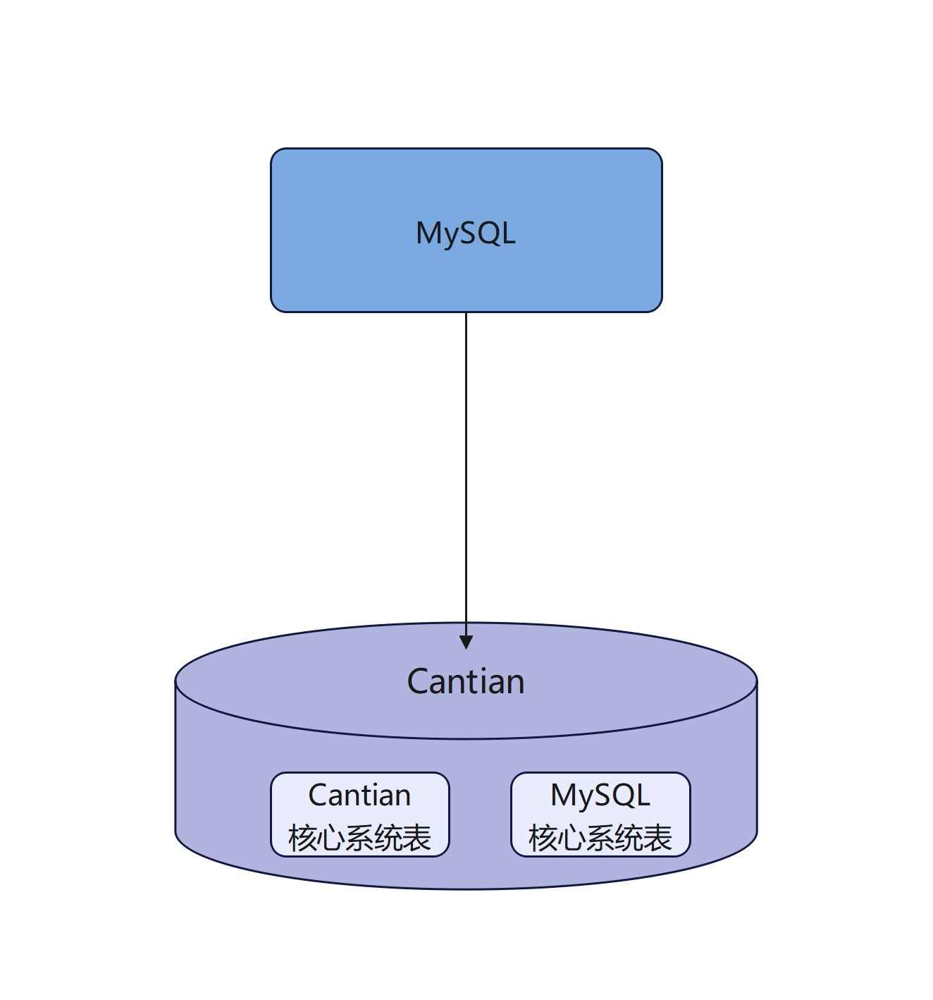
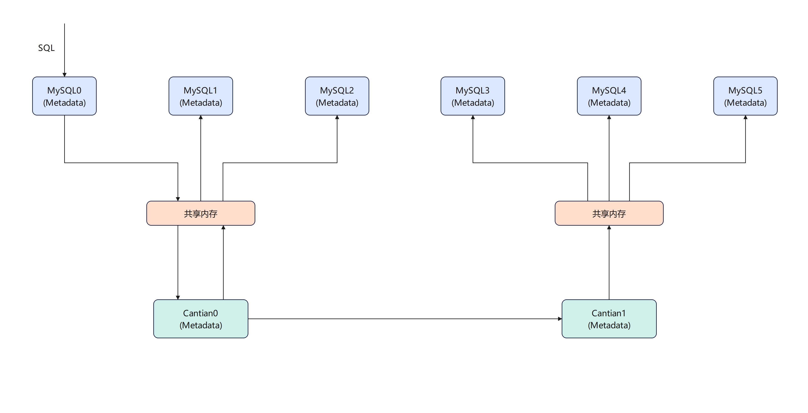
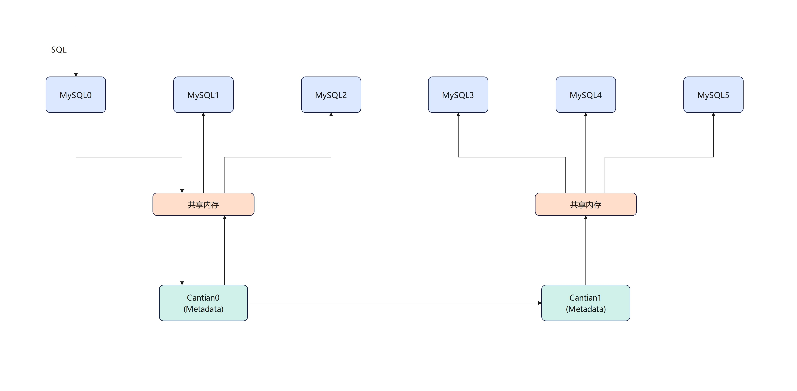

# DDL广播背景<a name="ZH-CN_TOPIC_0000002283351709"></a>

Cantian是多主数据库存储引擎，当一个节点执行了DDL操作，Cantian和MySQL实例元数据的变化需要同步到其他节点，确保各节点元数据一致。

# DDL广播理论基础<a name="ZH-CN_TOPIC_0000002256807653"></a>


## 元数据简介<a name="ZH-CN_TOPIC_0000002258553889"></a>

元数据（Metadata）是关于数据的数据，它描述了数据的结构、存储方式、关系和其他属性。在MySQL中，元数据包含了有关数据库、表、列、索引、约束、用户权限等信息。

## MySQL系统表元数据存放方式<a name="ZH-CN_TOPIC_0000002223274428"></a>

-   非共享系统表元数据。

    Cantian引擎的表的元数据有两份。MySQL的SQL引擎读取的元数据存储在InnoDB里，Cantian存储引擎读取的元数据存储在Cantian存储引擎里。

    **图 1**  非共享MySQL系统表元数据<a name="fig14391413104510"></a>  
    

-   共享系统表元数据。

    将MySQL系统表元数据下发到Cantian引擎，集群中所有MySQL实例共享同一份系统表元数据。

    **图 2**  共享MySQL系统表元数据<a name="fig12366122614456"></a>  
    

# DDL广播<a name="ZH-CN_TOPIC_0000002256822973"></a>


## DDL广播流程<a name="ZH-CN_TOPIC_0000002223434252"></a>

根据是否共享MySQL系统表元数据，DDL的广播流程是不同的：

-   非共享系统表元数据

    **图 1**  非共享系统表元数据广播<a name="fig14541512145315"></a>  
    

    1.  创表语句通过共享内存下发到Cantian0执行，这张表的元数据在InnoDB和Cantian0中创建出来。
    2.  Cantian0通过共享内存向该节点上的其他MySQL广播执行该语句，在其他MySQL创建出该表的元数据。
    3.  Cantian0向Cantian1发消息，Cantian1接收后，继续通过共享内存向该节点上的所有MySQL广播语句。

-   共享系统表元数据

    **图 2**  共享系统表元数据广播<a name="fig0493115635317"></a>  
    

    1.  创表语句通过共享内存下发到Cantian0去执行。
    2.  Cantian0的元数据再同步到Cantian1，由于MySQL系统表元数据下发到Cantian保存，更新Cantian侧元数据并且失效其他MySQL节点的元数据即可。

## 两种广播区别<a name="ZH-CN_TOPIC_0000002258394005"></a>

1.  MySQL非共享系统表形态：广播加/解锁和DDL语句。
2.  MySQL共享系统表形态：广播加/解锁且失效其他MySQL元数据。
3.  由于在DDL阶段要和其他SQL语句互斥，加/解锁广播X锁。

# DDL广播实现<a name="ZH-CN_TOPIC_0000002258553893"></a>

1.  DDL语句广播。

    ```
    // 本端
    ctc_commit
        --> ctc_execute_mysql_ddl_sql
            --> ctc_ddl_execute_and_broadcast
                --> mysql_execute_ddl_sql     // MySQL执行语句
                --> ctc_broadcast_and_recv    // 发送消息到对端Cantian
    // 对端
    dtc_task_proc
        --> dtc_process_message
            --> dtc_proc_msg_ctc_execute_ddl_req
                --> mysql_execute_ddl_sql    // MySQL执行语句
    ```

2.  加锁广播。

    ```
    // 本端
    ctc_notify_exclusive_mdl
        --> ctc_notify_pre_event
            --> ctc_lock_table
                --> ctc_lock_table_impl
                    --> ctc_ddl_execute_lock_tables_intf    // 执行加锁操作
                    --> ctc_broadcast_and_recv
    // 对端
    dtc_task_proc
        --> dtc_process_message
            --> dtc_proc_msg_ctc_lock_table_req
                --> ctc_ddl_execute_lock_tables_intf    // 执行加锁操作
    ```

