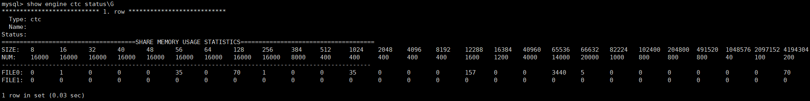
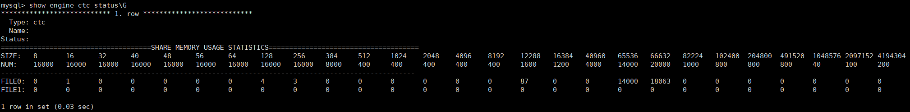

# 查看共享内存使用情况<a name="ZH-CN_TOPIC_0000002310754590"></a>

双进程模式下，mysqld和cantiand通过共享内存进行通信。MySQL下发的消息通过共享内存传到Cantian，Cantian收到后进行处理。

现已提供观察共享内存分片已使用统计情况的手段：在MySQL客户端执行命令**show engine ctc status\\G**（仅双进程有）。



其中：

-   SIZE为每个分片大小，分别从8字节，16字节依次增大到4MB。
-   NUM为每个文件中对应分片的总数，每个共享内存文件大小为4GB。
-   FILE0，FILE1……分别为每个文件中每个分片已使用数量。

共享内存的使用情况会有以下表现：

-   初次拉起直接查看，共享内存使用最少（无业务下发）。
-   下发业务过程中，共享内存使用情况会根据业务量/表结构体现为使用不同大小的分片或不同程度的占用；可通过**show processlist;**查看正在下发的业务。
-   业务结束后，当打开表未关闭时，申请的共享内存不会释放，可以通过执行**flush tables;**后再次观察，会发现共享内存使用都被释放。
-   如果发现共享内存占用很满，则可能有大量业务在下发，如果频繁出现OOM（Out of Memory，共享内存空间用满，需释放后继续使用，不影响MySQL进程存活状态），则需要查看当前共享内存使用增长频率，调整相关配置（详情见后文）。

# 影响共享内存使用配置<a name="ZH-CN_TOPIC_0000002344651361"></a>


## 影响共享内存使用情况相关参数<a name="ZH-CN_TOPIC_0000002344811185"></a>

**表 1**  MySQL和Cantian影响共享内存参数

|变量名|变量类型|变量含义|修改方式|
|--|--|--|--|
|table_open_cache_instances|MySQL变量|每个表的打开个数，即打开表缓存实例的数量。对于每个表缓存多个实例，可以减少线程之间的争用，从而提高表的打开和关闭操作的效率。|修改配置文件my.cnf中参数值，重拉MySQL。|
|table_open_cache|MySQL变量|打开表的总个数，即所有表缓存的数量。|登录MySQL客户端设置，如：**set global table_open_cache= 1000;**|
|max_connection|MySQL变量|MySQL允许的最大连接数。这个参数对于打开表总个数没有决定性影响，无论打开多少个连接，最大只能打开table_open_cache个表，每个表最多打开table_open_cache_instances次。|登录MySQL客户端设置，如：**set global max_connection = 1000;**|
|SHM_MEMORY_REDUCTION_RATIO|Cantian变量|共享内存文件个数。根据不同部署模式，该参数设置值不同。如物理环境下，该参数为1，表示共享内存文件个数缩放比例为1，共有8个文件，每个4GB，共32GB。多租场景下缩放比例最大可达到8，表示仅使用1个共享内存文件，共4GB。|配置cantiand.ini中SHM_MEMORY_REDUCTION_RATIO值后重拉。|


## 共享内存使用计算方式<a name="ZH-CN_TOPIC_0000002310772166"></a>


### MySQL中打开表数量<a name="ZH-CN_TOPIC_0000002344656081"></a>

**不考虑共享内存的计算公式<a name="section1784513320254"></a>**

假设创建表的个数为  **n**：

-   理论上打开表个数设置条件满足**table\_open\_cache \>= n \* table\_open\_cache\_instances**时，能够打开所有的表。
-   如果每个表只有一份缓存，即**table\_open\_cache\_instances = 1**，则满足**table\_open\_cache \>= max\_connection \* n**时，能够打开所有的表一次。
-   实际最大打开表个数计算公式为：**max\_open\_tables = min\(table\_open\_cache, n \* table\_open\_cache\_instances\)**。

**考虑共享内存的计算公式<a name="section101232802613"></a>**

假设创建表的个数为  **n**，共享内存文件个数为**4**，实际最大打开表个数为**max\_open\_tables**。

共享内存文件个数和实际最大打开表个数关系如下：

-   假设**max\_open\_tables = 1000**，打开所有表需要用到**1**个共享内存文件。
-   假设**max\_open\_tables = 5000**，随着时间推移，无论并发数为多少，最终共享内存需要**5**个，会不够用，此时需要调大共享内存个数或调小每个表最多打开的个数。

假设创建表的个数为**n**。则可根据上述公式，第**i**个表最多打开的个数  **max\_open\_tables\(i\)**和所有表总共打开的表个数**total\_open\_tables**计算公式如下：

```
max_open_tables(i) = min(table_open_cache(i), n * table_open_cache_instances(i))
total_open_tables = max_open_tables(1) + max_open_tables(2) + ... + max_open_tables(n)
```

在一个集群中，假设存在**node\_count**个MySQL节点。

正常情况下，每个节点使用配置文件相同，因此实际上整个集群内最大打开的表个数**total\_open\_tables**值为：

```
total_open_tables = node_count * max_open_tables = node_count * min(table_open_cache, n * table_open_cache_instances)
```

### 共享内存使用上限估计<a name="ZH-CN_TOPIC_0000002344815897"></a>

**普通表<a name="section1955419305820"></a>**

目前默认形态下一套共享内存大小为：8个共享内存文件 \* 4GB = 32GB，至少可打开81920个普通表（实测后）。

-   物理环境
    -   默认配置如下：

        ```
        table_open_cache = 81920，table_open_cache_instance = 64
        ```

    -   在默认配置下，单个Cantian节点上可存在3个MySQL节点，理论上最多打开表的个数为：

        ```
        total_open_tables = 3 * max_open_tables = 3 * min(81920, n * 64)
        if n <= 1280： total_open_tables = 3 * 64 * n
        else total_open_tables = 3 * 81920
        ```

    -   如果3个pod同时下发高并发业务时，会出现OOM，需进行一些必要的调整，如使用更少节点、使用更多共享内存文件、调低每个节点的表缓存个数等。

-   多租多租部署模式
    -   目前有3种配置：

        ```
        套餐1-22核cpu60G：table_open_cache = 10000，table_open_cache_instance = 8
        套餐2-22核cpu120G：table_open_cache = 20000，table_open_cache_instance = 16
        套餐3-22核cpu240G：table_open_cache = 40000，table_open_cache_instance = 32
        ```

    -   不同配置可打开表的上限为：

        -   套餐1：（1个共享内存文件 \* 4GB = 4GB）可打开 10240 个表。
        -   套餐2：（2个共享内存文件 \* 4GB = 8GB）可打开 20480 个表。
        -   套餐3：（4个共享内存文件 \* 4GB = 16GB）可打开 40960 个表。

        根据以上配置可知，目前多租部署模式下，普通表的任何业务模型均不会超过上限。

**分区表<a name="section18544713205813"></a>**

-   分区表共享内存使用主要在打开表时，CBO模块（基于代价估算的执行计划优化方式，cost based optimization）会根据表大小申请不同大小的内存，包括：分区个数、列个数、索引个数、字符串类型列个数等。共享内存和以上几个因素成正比例增长使用。
-   在同一时间内，如果打开表过多，需要申请的共享内存超过共享内存的上限，会报错OOM；因此，分区表的使用和并发量也非常相关。
-   单个共享内存文件（4GB，对应多租模型套餐1）可保证1000分区的分区表（tpcc模型）以100并发进行持续稳定的业务（实测后）。更多配置可根据实际部署形态进行估计。

# 共享内存OOM应对和预防手段<a name="ZH-CN_TOPIC_0000002344686693"></a>

**OOM场景分析与应对<a name="section9636424131314"></a>**

根据上述配置介绍及上限估计，当业务量太大、配置太小等情况导致共享内存频繁报错OOM时，可以通过观察内存不同分片的使用情况，进行分析。

-   如果为较大分片使用占满（64KB），根据共享内存分配情况可推断为当前打开普通表个数超过当前共享内存可容纳上限，需要调整共享内存上限（根据前文介绍）。
-   如果为最大分片使用占满（2MB，4MB），则为分区表业务过多导致打开分区表过多，可调低并发度。
-   如果为小分片使用占满，则普通消息太多，则一定为并发量太大，消息太多（增删改查/创删库表/开关链接等）可适当调低业务并发量。
-   如果共享内存从0开始快速用满，且持续不够使用，则可调低并发数延缓共享内存使用增长。

**预防共享内存报错OOM措施<a name="section20822184251311"></a>**

为预防共享内存报错OOM，可采取以下手段：

1.  合理配置参数：
    -   决定共享内存使用上限相关参数：
        -   共享内存文件个数：  **SHM\_MEMORY\_REDUCTION\_RATIO;**业务量大时适当缩小缩放比例，使用更多共享内存文件。
        -   打开表个数：**table\_open\_cache=81920, table\_open\_cache\_instances=64;**适当调小打开表个数总量，降低共享内存使用量。

    -   决定共享内存使用增长速度相关参数：

        业务并发量：可通过**show processlist;**或**show global status like "%thread%";**查看当前线程并发数；可通过最大连接数合理调整实际业务并发量。

2.  规划更优的业务模型：
    -   节点间负载均衡：尽量让业务量分摊到多个节点，减少一个节点的共享内存通信压力。
    -   分区表合理规划分区：分区表业务尽可能集中，对于更多个分区的分区表，比使用少分区的分区表对共享内存压力更大。

3.  定时刷新共享内存：

    如果业务短时间内冲高但更长时间都处于较为平衡的状态，为了避免短时间内共享内存压力增大后，持续处于高使用率状态，可以定时执行**flush tables;**语句关闭所有表，释放当前正在使用的共享内存。

